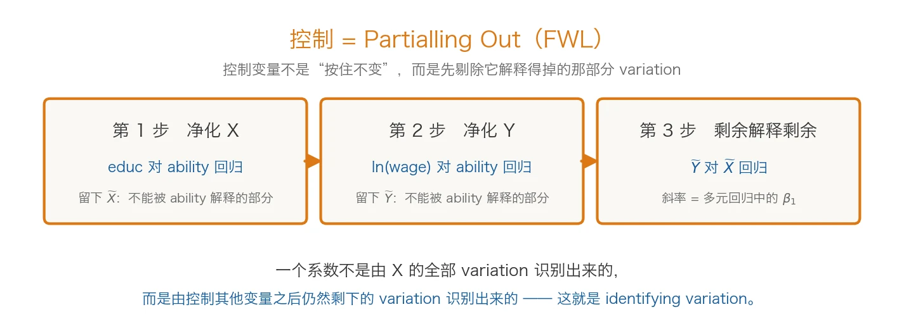

# 第3讲：回归基础复习（二）

> 本页是第三讲的课前导读、课堂地图与课后自检指南。课前可以先浏览开头和三个部分的标题，课堂中按需查阅，课后再结合五个自检问题完整复习。

## 本讲指南

### 这一讲讲什么

第二讲复习了怎样用回归描述关系、估计参数和进行假设检验。但一项真正的计量研究，不能从“打开软件并运行回归”开始。在得到结果之前，研究者必须先把经济问题写成一个可以估计的计量模型；得到结果之后，还要判断模型是不是设错了、错在哪里、应该改什么。

本讲只用一个案例，但同一份数据要走三遍：先决定经济关系怎么写进方程，再弄清楚“控制”以后究竟在比较什么，最后检查模型哪里可能出了问题，并选择对应的处理。案例问题与教材第3—5章保持一致：

> **AI 使用时间越多，课程成绩就越好吗？**

本讲依次回答三个问题：

1. **经济关系应该怎样写进模型**（函数形式）——用水平值还是对数、要不要二次项和交互项？这些选择本身就是经济假设；
2. **多元回归究竟在“控制”什么**（模型设定与 FWL）——控制并不是把变量按住不动，而是先剔除它能解释的部分，再用剩下的 variation 做比较；
3. **怎样发现模型可能出了问题**（诊断与处理）——残差图、VIF、异方差检验只能指出“哪里可能有问题”，接下来还要判断它伤害了什么、应该改什么。

三个问题之间存在一条清楚的链条：**形式决定怎么解释，控制决定在比较谁，诊断决定结论能走多远。**

### 进入课堂前，可以先想四个问题

- 给成绩方程加上 AI 使用时间的平方项以后，这个模型还是“线性回归”吗？
- “控制能力不变以后，AI 的作用是……”，这句话里的 OLS 究竟做了什么？
- 一个变量的 VIF 很高时，是不是应该立刻把它删掉？
- 改用异方差稳健标准误以后，回归系数本身会不会改变？

### 这一讲怎么安排

本讲按“形式—控制—诊断”三个部分展开，三部分使用同一份模拟数据（800 名学生），形成一条连续的研究链：先把经济问题表达成方程，再理解“控制”到底在比较什么，最后检查模型的薄弱环节并选择有针对性的处理。这份数据同时埋进了四种特征——曲率、群体差异、遗漏变量、共线性和异方差——所以三段分析才能串成一条线。

### 本讲三部分

{fig-alt=""}

#### 第一部分：函数形式——经济关系应该怎样写进模型

**1. 从经济问题到可估计方程**

经济问题通常以自然语言出现，例如“AI 是否有助于提高成绩”“用得多是不是越好”“对不同学生的作用是否一样”。计量模型要把这些问题转化为可观察变量之间的关系：

> 经济问题 → 经济机制 → 变量与样本 → 计量方程 → 可检验假设

以成绩方程为例，可以写成：

> scoreᵢ = β₀ + β₁aiᵢ + β₂ageᵢ + uᵢ

- `score` 是希望解释的结果变量（课程成绩，单位：分）；
- `ai` 是核心解释变量（每周 AI 使用时间，单位：小时）；
- `age` 是根据经济机制纳入的控制变量；
- `u` 汇集模型没有明确纳入的其他因素；
- `β₁` 是希望利用样本估计的未知参数。

一条方程并不天然等于一个好的计量模型。变量能否测量理论概念、样本是否适合研究问题、误差项中可能遗漏什么，以及参数是否具有清楚的经济含义，都会影响模型质量。

**2. 经济模型、计量模型与估计方程**

经济理论说明哪些因素可能相关、作用方向可能是什么；计量模型进一步规定变量、函数形式、误差项和统计假设；估计方程则是把样本数据代入模型后得到的具体结果。

可以把三者理解为：

- **经济模型**提供机制和方向；
- **计量模型**提供可估计、可检验的经验表达；
- **估计结果**提供特定样本中的数值证据。

因此，不能因为软件成功输出了一张表，就认为已经建立了合适的计量模型。软件只负责按照输入的方程计算，研究者仍需解释方程为什么这样设、数据为什么能够回答问题。

**3. 加了平方项，还是“线性回归”吗？**

这是最容易被误解的一点。在成绩方程里加入 AI 使用时间的平方项：

> scoreᵢ = β₀ + β₁aiᵢ + β₂aiᵢ² + uᵢ

成绩与 AI 使用时间的关系已经不是一条直线，但这个模型**仍然是线性回归**，仍然可以用 OLS 估计。原因在于：这里所说的“线性”，指的是**对参数 β 线性**，而不是要求 Y 与 X 画出来是一条直线。

对比一个真正对参数非线性的模型：

> Y = β₀ + X^β₁ + u

这里 β₁ 以幂次的方式进入方程，参数与 X 的关系不是线性组合，已经不是普通线性回归的框架。

> **线性回归里的“线性”，核心是“对参数线性”，不是要求 Y 与 X 必须是一条直线。**

理解这一点以后，对数、二次项、交互项就都不再是“破坏了线性回归”，它们只是把 X 的形态换了一种写法，参数之间仍然是线性的。

**4. 函数形式怎样选择**

线性模型假定边际作用保持不变，但现实关系未必如此。常见扩展包括：

- **对数形式**：适合解释相对变化或百分比变化，也能缓和右偏分布；
- **二次项**：允许边际效应随变量自身水平变化，例如 AI 使用到一定程度后作用递减；
- **虚拟变量**：比较某一类别与明确的基准组；
- **交互项**：允许一个变量的作用随另一个变量或群体而变化。

加入非线性项或交互项以后，单个系数往往不再等于完整的边际效应。把二次项与交互项放在一起看，区别就非常清楚：

> **二次项：X 的边际效应随 X 自身的位置而改变。**
> **交互项：X 的边际效应随另一个变量 Z 而改变。**

例如模型同时包含 `ai` 和 `ai²` 时，AI 使用的边际效应是 β₁ + 2β₂ai，取决于当前处于什么使用水平；而模型包含 `ai × strong` 时，AI 使用的边际效应是 β₁ + β₃strong，取决于基础好弱。这两种“边际效应会变”，一个随自己变，一个随别人变。

需要注意，二次项并不自动意味着“先升后降”。边际效应是升是降，取决于一次项与二次项的符号；只有当二次项为负、且极值点落在样本范围内时，曲线才呈现先升后降的形状。**更重要的是，极值点只是样本内的平均预测关系，不代表每个学生超过那个使用时间成绩都会下降。**

因此，函数形式不能只靠观察显著性星号来选择。较好的做法是结合经济机制、数据分布、散点图或预测图，并检查转折点和边际效应是否位于样本的有效范围内。

**5. 一个模型应当交代什么**

一项基础计量分析至少需要说明：

1. 研究问题属于描述、预测还是因果；
2. 被解释变量、核心解释变量和控制变量怎样定义；
3. 数据来自哪里，观察单位和样本范围是什么；
4. 函数形式怎样设定，每个系数如何解释；
5. 误差项可能包含哪些未观察因素；
6. 估计和推断依赖哪些关键假设。

这一部分最重要的结论是：

> **函数形式不是数学装饰。选择对数、二次项还是交互项，本质上是在表达我们认为经济关系是什么样的。**

#### 第二部分：模型设定与 FWL——多元回归究竟在“控制”什么

**1. 变量怎样选择**

变量选择应当从研究问题和经济机制出发，而不是从软件能够提供多少变量出发。通常需要区分：

- **被解释变量**：研究希望解释的结果；
- **核心解释变量**：研究最关心的影响因素；
- **控制变量**：为形成更合理比较而纳入的其他因素；
- **机制变量（中介变量）等其他研究角色**：在不同方程中可能承担不同任务，不能脱离具体模型判断。

控制变量既不是越多越好，也不是只看显著性决定去留。遗漏重要变量可能造成偏误；控制了由核心解释变量导致的“后果变量”，也可能改变原本希望估计的效应。例如，学习时间可能处在“AI 使用 → 学习时间 → 成绩”这条路径上，控制它就会截断一部分作用。

那么，控制谁究竟由什么决定？至少由两件事决定：

1. **你想回答什么问题**——同样一份成绩数据，研究“AI 使用的总作用”和研究“AI 中不通过学习时间起作用的那部分”，需要的控制变量并不相同；
2. **你认为数据是怎样产生的**——哪些因素同时影响核心解释变量和结果变量，只能来自对制度背景和数据生成过程的理解，软件不会告诉你。

变量选择必须有理论、制度或研究设计依据。这里先埋一句伏笔：控制变量不仅影响估计精度，也可能**改变我们究竟在估计什么**，这个问题会在后面的因果识别与实证设计中再次出现。

**2. 控制变量到底在控制什么：partialling out**

大家都听过这样的说法：“控制能力不变以后，AI 对成绩的影响是……”。这句话没有错，但它很容易让人以为 OLS 真的把样本里所有能力相同的学生挑出来做比较。**OLS 并没有这么做。**

回到本讲的案例。数据生成过程里，认知能力既影响 AI 使用（能力越强，越愿意用 AI 工具），也直接推高成绩。如果模型只放 AI 使用时间和年龄，不做任何控制，AI 系数是 **1.3156**；把能力放进模型以后，AI 系数变成 **0.3959**。差别从哪里来？——原来那个 1.3156 里，混进了一部分“能力的作用”。

那么，多元回归究竟做了什么事？**Frisch–Waugh–Lovell 定理**（FWL）给出了一个可以手算的答案，它把“控制”拆成三步：

{fig-alt=""}

1. **净化 X**：把 AI 使用时间对能力（及其他控制变量）回归，取残差，得到“不能被能力解释的 AI 使用差异”；
2. **净化 Y**：把成绩对能力（及其他控制变量）回归，取残差，得到“不能被能力解释的成绩差异”；
3. **剩余解释剩余**：用净成绩对净 AI 做一次**不带常数项**的简单回归，它的斜率**恰好等于**原多元回归中 AI 的系数。

在本讲的模拟数据上，第 3 步算出的斜率是 **0.395938**，与多元回归里的 0.395938 在数值上完全一致。这不是巧合，而是代数上的恒等式。

因此“控制”的真正含义是：

> **控制 = Partialling Out。先剔除控制变量能够解释的部分，再利用剩余 variation 进行比较。**

也可以写成一句更直白的话：

> **X = 能被控制变量解释的部分 + 净 variation**

多元回归只用了后面那一块。这就引出了本讲最重要的一个问题：

> **Which variation identifies β?（究竟是哪一部分 variation 识别出了这个系数？）**

答案是：

> **一个回归系数不是由 X 的全部 variation 识别出来的，而是由控制其他变量之后仍然剩下的 variation 识别出来的。**

这句话的意义远不止本讲。以后学习固定效应、工具变量、双重差分、双重机器学习等方法时，都可以继续追问同一个问题：

> **Where does the identifying variation come from?**

**3. 标准误怎样设定**

模型设定不仅包括右边放哪些变量，也包括怎样描述估计结果的不确定性。

- 如果误差方差随解释变量或拟合值变化，传统同方差标准误可能失真，可使用异方差稳健标准误；
- 如果同一学校、班级、地区或个体内部的观测可能相关，应考虑在相应层级使用聚类稳健标准误；
- 聚类层级应与误差相关的来源和研究设计一致，而不是为了得到更好看的显著性而反复尝试。

在同一 OLS 模型和样本下，改用稳健或聚类标准误通常不会改变系数估计，改变的是标准误、t 值、p 值和置信区间。**标准误的选择属于推断设定，不能修复遗漏变量偏误，也不能创造因果识别。**

这一部分最终要建立的意识是：

> **模型设定决定我们比较什么、怎样解释，以及用什么方式表达不确定性。每一项选择都应当有研究依据。**

#### 第三部分：诊断与处理——怎样发现模型可能出了问题

**1. 发现问题：不同问题伤害的是不同环节**

模型诊断的目的不是证明模型绝对正确，而是主动寻找可能改变结论的问题。“发现问题”只是第一步，真正要回答的是三步：

> **发现问题 → 它伤害了什么 → 我们应该改什么**

先看伤害的对象。不同问题损害的是不同环节：

- **函数形式错误**：伤害的是 E(Y|X) 的设定，直接改变系数含义；
- **异方差**：系数大体仍在，主要让传统标准误、t 值、p 值和置信区间不再可靠；
- **组内误差相关**：同样主要伤害标准误与推断，需要聚类稳健标准误；
- **多重共线性**：主要降低单个系数的估计精度，使标准误增大、系数不稳定；
- **遗漏变量或外生性失败**：伤害的是系数本身，普通的样本内诊断通常看不出来；
- **异常值或高杠杆点**：可能让少数观测对结果产生过大影响；
- **样本选择和外推问题**：限制结论适用于谁、适用于何种情境。

只有先判断问题影响的是点估计、精度、标准误还是结论的适用范围，才可能选择合适的应对方法。

**2. 诊断工具能告诉我们什么**

常见工具包括残差图、RESET 检验、相关系数、VIF、BP 检验和 White 检验等：

- 残差图可以帮助发现非线性、异方差或异常观测的线索；
- RESET 检验考察条件均值形式是否够用；
- VIF 衡量解释变量之间的线性关系使某个系数估计方差膨胀的程度；
- BP/White 检验考察误差方差是否具有系统变化。

这些工具都需要结合模型背景解释。VIF 较高不等于系数必然有偏，也不意味着必须机械删变量；异方差检验不显著不等于模型完全正确；检验显著也不能告诉研究者唯一的修复方案。

同样重要的是：**残差图、RESET、VIF 和异方差检验都属于“发现问题”，它们不是“处理问题”的方法。** 看到检验结果以后，还要判断它伤害了什么、应该改哪一环。

**3. 一张表：问题、伤害、发现与处理**

| 问题 | 主要伤害什么 | 怎么发现 | 怎么处理 |
|---|---|---|---|
| 函数形式错误 | E(Y\|X) 的设定 | 残差图 / RESET / 经济理论 | 重新设定函数形式 |
| 异方差 | 标准误、t、p、置信区间 | 残差图 / BP / White | 报告稳健标准误 |
| 组内误差相关 | 标准误与推断 | 数据结构 / 研究设计 | 聚类稳健标准误 |
| 多重共线性 | 估计精度、系数稳定性 | 相关系数 / VIF | 不机械删变量，寻找有效 variation |
| 外生性失败 | **系数本身** | 不能靠普通诊断证明 | 换识别策略 |

请特别注意最后两列的分工：**BP、White 是诊断工具，稳健标准误是推断修正，两者不在同一列。** 用检验去“修”标准误、或者用稳健标准误去“修”函数形式错误，都是把不同环节的问题混在一起。

**4. 发现问题以后，我们究竟应该改什么**

把所有处理方法归到一起，其实只有三类，对应三种完全不同的问题：

> **模型形式错 ⇒ 改 Specification**（对数、二次项、交互项）
> **误差结构有问题 ⇒ 改 Variance–Covariance / 标准误**（稳健标准误、聚类稳健标准误）
> **E(u\|X) ≠ 0 ⇒ 改 Identification Strategy**（固定效应、工具变量、双重差分、断点回归、实验）

前两类在本讲已经出现过；第三类不属于本讲，它正是接下来几讲逐步展开的内容。

诊断之后当然可以重新定义变量、调整函数形式、补充有理论依据的控制变量、使用稳健或聚类标准误、报告替代设定、检查异常值影响。但任何调整都应当能够解释，**不能只保留使核心系数显著的结果**。

面对一项诊断结果，可以依次追问：

1. 它发现的究竟是哪一类问题？
2. 这个问题影响系数、标准误还是结论适用范围？
3. 建议的处理方法为什么能够对应这个问题？
4. 处理前后的结论发生了什么变化？
5. 哪些局限在处理后仍然存在？

最终需要形成的判断是：

> **诊断工具帮助我们发现模型的薄弱环节，却不能替研究者宣布模型“正确”。可信结论来自透明的设定依据、针对性的检查和不过界的解释。**

最后还要记住一条边界：本讲的案例可以把遗漏的 `ability` 放回去比较，只是因为**生成数据的人知道真相**。在真实研究里，被遗漏的变量往往根本观测不到，稳健标准误也修不好它。所以：

> **统计显著不等于因果。一个好的回归模型，是因果分析的起点，而不是终点。**

### 本讲目标

学完本讲，你应当能够：

- 说明经济问题、经济机制、计量模型和估计结果之间的关系；
- 把一个简单经济问题转化为被解释变量、核心解释变量、控制变量、误差项和待估参数；
- 解释为什么加入二次项或交互项之后，模型仍然是“对参数线性”的线性回归；
- 说明一项基础计量模型至少需要交代哪些数据、变量、函数形式和假设信息；
- 根据研究问题区分被解释变量、核心解释变量和控制变量，避免仅凭显著性选择变量；
- 解释水平、对数、二次项、虚拟变量和交互项模型中系数含义的差异；
- 计算或说明二次项的边际效应，以及带交互项模型中不同群体的合成效应；
- 用 partialling out（FWL）说明“控制”到底做了什么，并解释什么是 identifying variation；
- 说明异方差稳健标准误与聚类稳健标准误分别应对什么问题；
- 区分函数形式错误、多重共线性、异方差和外生性失败分别主要影响设定、精度、推断还是系数本身；
- 解释残差图、RESET、VIF、BP/White 检验能够提供什么证据，又不能证明什么；
- 根据诊断问题选择有针对性的处理方法，并诚实报告处理后仍然存在的局限。

### 本讲重点与难点

本讲最重要的是形成四个连续的判断习惯：

- **先把问题变成模型**：明确研究对象、变量、样本、参数和误差项，而不是直接打开软件；
- **让每项设定都有依据**：变量、函数形式和标准误服务于研究问题，不能服务于显著性；
- **追问识别 variation**：一个系数是靠哪一部分 variation 估出来的？控制之后还剩下什么？
- **让诊断对应具体问题**：先判断问题损害什么，再选择工具和处理方法。

最难的地方有两个。第一是接受“控制变量不是按住不变，而是剔除它解释得掉的部分”——这需要放弃本科阶段那套直观但并不准确的表述。第二是接受“模型不可能被一次检验证明正确”：诊断结果只是证据的一部分，即使模型通过若干统计检验，也可能存在测量误差、遗漏变量、反向因果、样本选择或外部有效性问题。计量研究追求的不是没有缺点的模型，而是结论与证据相匹配、设定与局限足够透明的模型。

### 达成效果

本讲结束后，你应当能够沿着下面这条链条审视一项基础计量研究：

> **经济问题决定函数形式，函数形式决定怎么解释，控制方式决定在比较谁，诊断决定结论能走多远。**

看到一个陌生模型或一张回归表时，可以用下面五个问题进行自检：

1. 这项研究想回答什么问题，方程中的每个变量承担什么角色？
2. 函数形式为什么这样设定，每个系数应当怎样解释？边际效应是恒定的吗？
3. 控制变量放进模型以后，真正被用来识别系数的是哪一部分 variation？
4. 标准误是否与数据结构和误差相关方式相匹配？诊断问题分别伤害了什么？
5. 诊断和调整之后，哪些结论更可信，哪些局限仍然不能消除？

如果你能说明“为什么建立这个模型、控制以后在比较谁、诊断发现了什么、现有结果能支持多强的结论”，就达到了本讲最重要的学习要求。

## 对应教材

- [第4章：对系数的解释](../textbook/ch04.qmd)
- [第4章：非线性形式](../textbook/ch04.qmd)
- [第4章：虚拟变量及其交互项](../textbook/ch04.qmd)
- [第5章：模型设定](../textbook/ch05.qmd)
- [第5章：变量选择与设置](../textbook/ch05.qmd)
- [第5章：异方差与标准误问题](../textbook/ch05.qmd)

## 配套案例实操

[打开“第3讲案例实操”](lesson3_lab.qmd)

本讲的案例**只有一份数据**（800 名学生的模拟数据），但要走完三遍：先通过对数、AI 使用时间二次项和“AI×性别”交互项看清“形式”怎样表达经济关系；再用遗漏与控制 `ability` 的对比，亲手验证 partialling out 到底做了什么；最后诊断多重共线性和异方差，并区分哪些问题要改模型、哪些要改标准误、哪些要换识别策略。配套页面提供完整任务、参考代码、实际结果图和本讲验收要求。

## 课后练习

1. 选择一个简单经济问题，用一条方程写出计量模型，并标明被解释变量、核心解释变量、至少一个控制变量和误差项。
2. 对同一个成绩问题，分别说明使用成绩水平值、对数成绩和 AI 使用时间二次项时，模型想表达的关系有何不同。
3. 给一个线性回归模型加入 `ai²` 以后，它还是线性回归吗？说明“对参数线性”与“Y 和 X 呈直线”的区别，并举出一个真正对参数非线性的例子。
4. 解释带有 `ai × strong` 交互项的模型中，为什么不能只看交互项系数就报告基础好组的 AI 边际作用。
5. 用 partialling out 说明：把 `ability` 放进模型以后，AI 系数从 1.3156 变成 0.3959，这个变化意味着什么？被识别出来的究竟是哪一部分 variation？
6. 分别用一句话说明函数形式错误、多重共线性、异方差和外生性失败主要损害什么，以及可以使用什么证据进行检查。
7. 完成第3讲案例实操，让Agent读取第4—5章配套脚本并给出诊断建议，再检查它是否机械套用 VIF 阈值、混淆稳健标准误与因果识别，或声称某项检验能够证明模型正确。

## AI Agent 使用说明

本讲可以让Agent先只读检查`ch04/01_ai_score_form_specification`和`ch05/01_ai_score_diagnostics`两个主脚本，说明两者为什么使用同一份数据、每个模型新增了什么表达能力、FWL 三步各自在做什么，以及几类诊断问题分别影响什么。确认后再运行代码、生成图表并整理诊断结果，不要让Agent改写课程提供的数据生成过程。变量选择、函数形式和诊断处理也不能只接受Agent的单一答案。至少要求它说明“为什么这样设定、替代方案是什么、这种处理不能解决什么”，再用教材、脚本和实际输出逐项核验，并保留必要的使用记录。
