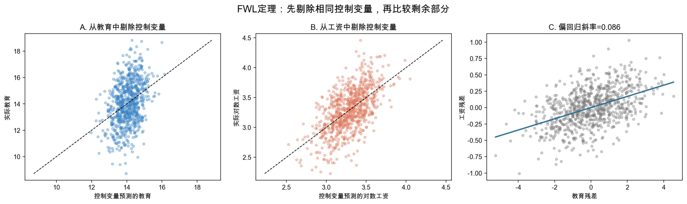

# 第2讲 代码和结果分析

> 本页是“案例实操”的参考解答，直接对应新版教材第2章2.4节和第3章3.5节。建议先完成自己的方向判断和代码运行，再使用本页核对。

## 使用说明

- Stata或Python任选一种，无需两种都运行；
- 两个脚本使用同一口径的教学工资数据，但都可独立运行；
- 下列小数来自Python主脚本的固定输出；Stata会因随机数算法不同而得到略有差异的数值；
- 教学代码已经分别在Python和StataNow 19.5 MP中完整运行。

## 主脚本对照

| 案例 | 教材位置 | Stata | Python |
|---|---|---|---|
| 教育、经验与工资 | 第2章2.4节 | `ch02/01_controls_ovb_fwl.do` | `ch02/01_controls_ovb_fwl.py` |
| 读懂一张工资回归表 | 第3章3.5节 | `ch03/01_read_regression_table.do` | `ch03/01_read_regression_table.py` |

---

## 案例一解答：控制变量、遗漏变量与FWL

### 1. 数据生成逻辑

样本量为800，随机种子为`20260910`。完整工资方程为：

$$
\ln(wage_i)=1.6+0.08educ_i+0.035exper_i+0.02tenure_i+u_i.
$$

生成过程让教育、经验和任职年限都受到同一背景因素影响。完整模型的误差项独立于这些解释变量，且方差为常数。因此，遗漏经验和任职年限后出现的问题是零条件均值被破坏，而不是异方差。

### 2. 遗漏模型与完整模型

#### Stata核心代码

```stata
regress ln_wage educ
estimates store omitted

regress ln_wage educ exper tenure
estimates store full

estimates table omitted full, b(%9.4f) se(%9.4f) stats(N r2)
corr educ exper tenure
```

#### Python核心代码

```python
omit = sm.OLS(df["ln_wage"], sm.add_constant(df[["educ"]])).fit()
full = sm.OLS(
    df["ln_wage"],
    sm.add_constant(df[["educ", "exper", "tenure"]])
).fit()

print(omit.params["educ"], omit.bse["educ"], omit.rsquared)
print(full.params["educ"], full.bse["educ"], full.rsquared)
```

#### Python参考结果

| 模型 | 教育系数 | 标准误 | $R^2$ |
|---|---:|---:|---:|
| 只含教育 | 0.12104 | 0.00634 | 0.31337 |
| 控制经验与任职年限 | 0.08559 | 0.00582 | 0.49697 |

只含教育时，教育系数约为0.121；加入经验和任职年限后下降到0.086左右，更接近生成过程设定的真值0.08。

方向上升的原因是：被遗漏的经验和任职年限都正向影响工资，并且与教育正相关。遗漏它们时，教育系数吸收了部分本应属于这些变量的关系。但“加控制变量后系数下降”不是普遍定律，偏误方向取决于两个相关方向。

### 3. FWL三步法

#### Stata核心代码

```stata
regress educ exper tenure
predict educ_resid, residuals

regress ln_wage exper tenure
predict wage_resid, residuals

regress wage_resid educ_resid
```

#### Python核心代码

```python
controls = sm.add_constant(df[["exper", "tenure"]])
educ_aux = sm.OLS(df["educ"], controls).fit()
wage_aux = sm.OLS(df["ln_wage"], controls).fit()

df["educ_resid"] = educ_aux.resid
df["wage_resid"] = wage_aux.resid
fwl = sm.OLS(
    df["wage_resid"],
    sm.add_constant(df[["educ_resid"]])
).fit()
```

Python运行结果为：

- 完整回归教育系数：`0.0855881607`；
- FWL残差回归斜率：`0.0855881607`；
- 两者差值：约`-4.16×10^-17`，属于浮点计算误差。



左图用经验和任职年限解释教育，中图用同一组变量解释工资，右图只比较两者剩余的部分。右图斜率与完整回归的教育系数一致，是FWL的样本代数结果。

FWL直观地说明了多元回归如何在样本内“控制”其他变量，但它不能证明控制变量选对了，也不能证明教育系数具有因果含义。

---

## 案例二解答：读懂一张工资回归表

### 1. 估计、区间和联合检验

#### Stata核心代码

```stata
regress ln_wage educ exper tenure

display "教育t值 = " _b[educ]/_se[educ]
display "教育95%置信区间 = [" ///
    _b[educ]-invttail(e(df_r),0.025)*_se[educ] ", " ///
    _b[educ]+invttail(e(df_r),0.025)*_se[educ] "]"

test exper tenure
```

#### Python核心代码

```python
model = sm.OLS(
    df["ln_wage"],
    sm.add_constant(df[["educ", "exper", "tenure"]])
).fit()

ci = model.conf_int(alpha=0.05)
joint_test = model.f_test("exper = 0, tenure = 0")

print(model.summary())
print(model.params["educ"] / model.bse["educ"])
print(joint_test)
```

### 2. Python参考回归表

| 变量 | 系数 | 标准误 | $t$值 | $p$值 | 95%置信区间 |
|---|---:|---:|---:|---:|---:|
| 常数项 | 1.44277 | 0.07746 | 18.625 | <0.001 | [1.29071, 1.59482] |
| 教育年限 | 0.08559 | 0.00582 | 14.706 | <0.001 | [0.07416, 0.09701] |
| 工作经验 | 0.03538 | 0.00320 | 11.060 | <0.001 | [0.02910, 0.04165] |
| 任职年限 | 0.03039 | 0.00490 | 6.196 | <0.001 | [0.02076, 0.04002] |


教育系数0.08559表示：在该模型中控制经验和任职年限后，教育每增加1年，条件对数工资平均相差约8.56%。更精确的百分比换算为$100[\exp(0.08559)-1]\%$，约为8.94%。

教育系数的$t$值可由`0.08559/0.00582`重新计算，结果约为14.71。$p$值小且区间不包含0，说明数据与“教育条件回归系数为0”的假设不相容。它仍只是条件相关证据，不自动证明教育的因果效应。

### 3. 联合检验

对$H_0:\beta_{exper}=\beta_{tenure}=0$的联合检验，Python结果约为：

- $F=145.26$；
- $p<0.001$。

因此拒绝“经验和任职年限系数同时为0”的原假设。这表示两者作为一组对解释对数工资有统计贡献，不等于证明每个变量都具有因果效应。

### 4. 论文式结果表述示例

> 基于800个教学用模拟观测，本案例以对数工资为被解释变量，并控制工作经验和任职年限。教育系数估计值为0.0856，标准误为0.0058，95%置信区间为[0.0742, 0.0970]。这表明，在该模型中教育每增加1年，条件对数工资平均相差约8.6%。经验与任职年限的联合检验拒绝了二者系数同时为0的原假设。但由于数据为教学用合成数据，模型也未排除所有潜在遗漏因素，上述结果只用于展示条件相关与统计推断，不应解释为现实中的教育因果回报。

## 两个案例的联系

第2章的案例告诉我们：回归系数依赖模型中控制了什么，遗漏变量可能让点估计发生系统性变化。第3章的案例告诉我们：得到估计值后，还要结合标准误、置信区间和联合检验判断不确定性。

完整的阅读顺序应该是：

1. 先问模型估计的是什么；
2. 再问系数在加入或删除控制变量后是否稳定；
3. 再看点估计的不确定性；
4. 最后判断证据最多支持条件相关，还是已经具备因果解释条件。

## 最小核验清单

- 两个模型比较时是否使用同一批观测？
- FWL残差化是否包含常数项并使用同一组控制变量？
- 系数除以标准误能否重现$t$值？
- $p$值与95%置信区间是否给出一致结论？
- 是否将显著性、经济大小和因果解释分开了？
