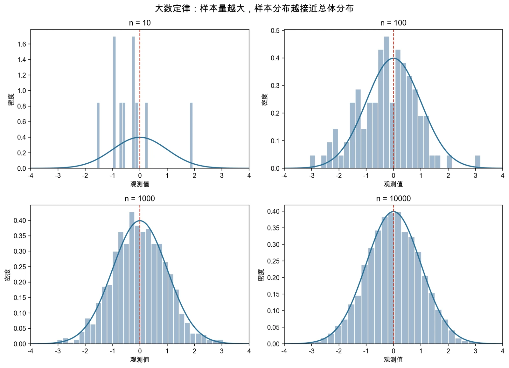
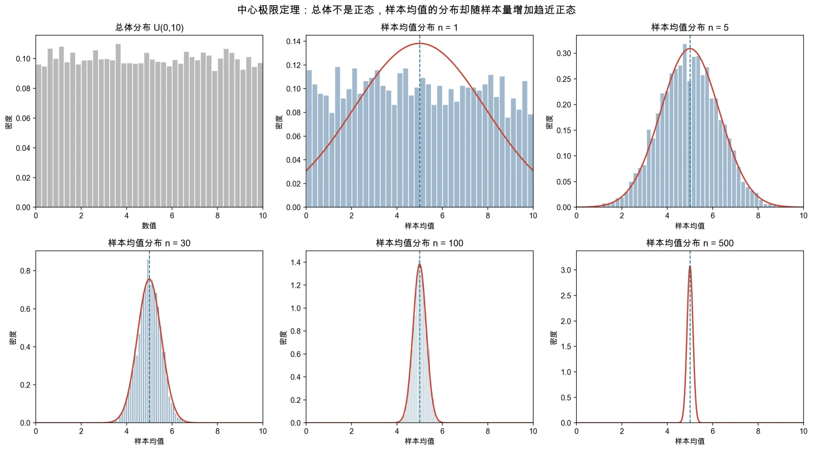
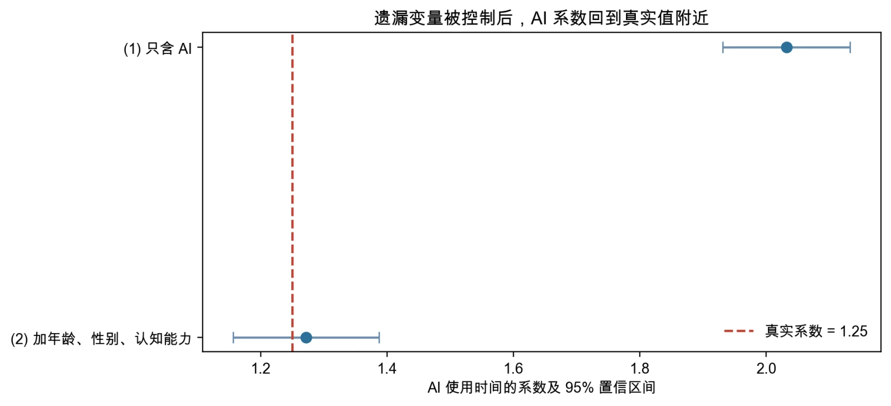
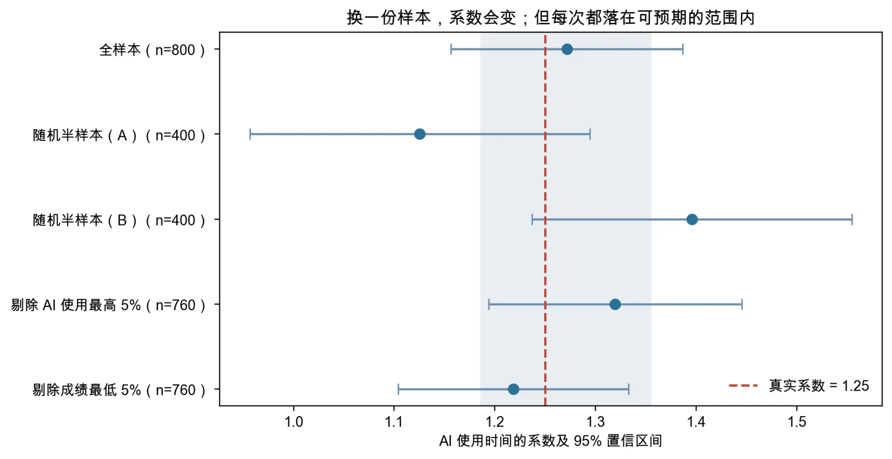

# 第2讲 代码和结果分析

> 本页是“案例实操”的参考解答，依次对应新版教材第1章1.4节、第2章2.4节和第3章3.5节。建议先完成自己的方向判断和代码运行，再使用本页核对。

## 使用说明

- Stata或Python任选一种，无需两种都运行；
- 三个脚本各自独立可运行：案例一使用参数已知的蒙特卡洛模拟数据，案例二、三使用**同一套**教学用合成数据（案例三与案例二同种子，数字完全一致）；
- 下列小数来自主脚本的固定输出。Python版与Stata版的随机数算法不同，同一套数据生成过程也会抽到不同样本，因此两种软件的种子分别固定为`20260914`和`20260430`，使各自的输出都落在真实参数附近，便于课堂对照；不追求两个软件的小数完全一致；
- 教学代码已经分别在Python和StataNow 19.5 MP中完整运行。

## 主脚本对照

| 案例 | 教材位置 | Stata | Python |
|---|---|---|---|
| 从样本到总体 | 第1章1.4节 | `ch01/01_monte_carlo_foundations.do` | `ch01/01_monte_carlo_foundations.py` |
| AI 使用与课程成绩 | 第2章2.4节 | `ch02/01_controls_ovb.do` | `ch02/01_controls_ovb.py` |
| 读懂一张成绩回归表 | 第3章3.5节 | `ch03/01_read_regression_table.do` | `ch03/01_read_regression_table.py` |

---

## 案例一解答：从样本到总体

### 1. 模拟设定

| 项目 | 设定 |
|---|---|
| 任务1的总体 | 标准正态分布 $N(0,1)$，总体均值0 |
| 任务2的总体 | 均匀分布 $U(0,10)$，总体均值5，总体标准差 $10/\sqrt{12}\approx2.887$ |
| 每次抽样观测数 | 任务1为10、100、1000、10000；任务2为1、5、30、100、500；任务3为30、100、500 |
| 蒙特卡洛重复次数 | 3000（任务1为单次抽样，不做重复） |
| 回归数据生成过程 | $Y_i=2+0.5X_i+u_i$，其中 $X\sim U(0,10)$，$u\sim N(0,1)$ |
| 真实斜率 | 0.5 |
| 随机种子 | Python `20260914`；Stata `20260430` |

必须把两个“次数”分开：**每次抽样的样本量**（5/30/100 或 30/100/500）决定每一次估计包含多少信息；**蒙特卡洛重复次数**（3000）决定我们描绘抽样分布有多精细。前者影响估计的精度，后者只影响我们对分布的观察是否平滑。

### 2. 任务1：不断增大的样本与大数定律

Python主脚本输出的各组样本均值和样本标准差（总体真值为均值0、标准差1）：

| 样本量 | 样本均值 | 样本标准差 |
|---:|---:|---:|
| 10 | −0.3246 | 0.9373 |
| 100 | −0.2519 | 1.0636 |
| 1000 | −0.0207 | 0.9886 |
| 10000 | −0.0028 | 0.9941 |

样本量为10时，直方图高低起伏、形状散乱，样本均值离0有明显距离；到1000和10000时，直方图已经与标准正态曲线基本贴合，样本均值也回到0附近。

但要注意它**并不是单调收敛**：从10到100，样本均值反而从−0.32变成−0.25，离0更远了一点。这正是大数定律的准确含义——样本量越大，样本分布越接近总体分布、样本均值越稳定；而**不是**从某个样本量开始就永久等于总体均值，也不保证每增加一个观测都让估计更接近真值。

### 3. 任务2：样本均值的分布与中心极限定理

用同一随机种子复现，五种样本量下样本均值的分布特征为：

| 每次抽样的样本量 | 样本均值的均值 | 标准差 | 理论标准差 $2.887/\sqrt{n}$ |
|---:|---:|---:|---:|
| 1 | 4.9101 | 2.8570 | 2.8868 |
| 5 | 4.9576 | 1.3052 | 1.2910 |
| 30 | 4.9955 | 0.5171 | 0.5270 |
| 100 | 5.0100 | 0.2908 | 0.2887 |
| 500 | 4.9996 | 0.1289 | 0.1291 |

这里必须说清四件事：

- **样本量为1时，样本均值的分布就是总体分布**。图中第一格 $U(0,10)$ 是一块平坦的矩形，而 n=1 那一格同样平坦——它和总体分布完全一样，显然不是正态；
- 样本量增到5、30以后，样本均值的分布迅速变成钟形，并随样本量增加越来越窄；
- 中心极限定理讨论的是**样本均值的抽样分布**，不是把原始均匀分布数据“变成”正态数据；
- 各样本量下样本均值的实际标准差与理论值 $2.887/\sqrt{n}$ 高度吻合，这为后面用标准误和 $t$ 值做近似推断提供了分布基础。

### 4. 任务3：OLS斜率的重复抽样分布

Python主脚本输出的斜率汇总（真实斜率0.5，每组重复3000次）：

| 每次抽样的样本量 | 斜率均值 | 斜率标准差 | 偏差（均值−0.5） |
|---:|---:|---:|---:|
| 30 | 0.50134 | 0.06556 | +0.00134 |
| 100 | 0.49926 | 0.03563 | −0.00074 |
| 500 | 0.49966 | 0.01589 | −0.00034 |

Stata主脚本运行结果（随机数算法不同，数值略有差异）：

| 每次抽样的样本量 | 斜率均值 | 斜率标准差 |
|---:|---:|---:|
| 30 | 0.50176 | 0.06469 |
| 100 | 0.50057 | 0.03494 |
| 500 | 0.49991 | 0.01527 |

三组分布都大致围绕真实斜率0.5，偏差量级在千分之一到万分之一之间，属于抽样波动，没有明显的系统性偏误；而斜率标准差从0.066降到0.036再降到0.016，样本量越大分布越集中。这说明：

- **一次回归偏离0.5只是抽样波动**，不能据此判断估计方法失效；
- **偏误由分布中心与真实值的距离体现**（本设定下接近0），**精度由分布的宽度体现**（样本量越大越窄）；
- 估计量是随机变量——换一个样本就会得到不同的斜率。这正是本讲反复强调“估计量有抽样分布”的直接证据，也是后面必须报告标准误的原因。



图一 大数定律：样本量从10放大到10000，直方图从散乱逐渐贴合标准正态曲线。



图二 中心极限定理：第一格是总体 $U(0,10)$（矩形，不是正态），第二格是 n=1 的样本均值分布（与总体分布相同），其后各格随样本量增加迅速变成钟形并收窄。


图三 OLS斜率的抽样分布：三组都围绕真实斜率0.5，样本量越大越集中。

### 5. 案例一的边界

模拟能够展示估计方法在**设定世界**中的性质，却不能证明现实样本满足随机抽样、零条件均值、同方差等假设。案例一给出的结论是“假如数据真按这个机制产生，OLS在重复抽样中表现如何”；把它搬到真实数据上，还需要逐条核对经典假设。这一点在案例二、三中会不断出现。

---

## 案例二解答：控制变量与遗漏变量偏误

### 1. 数据生成逻辑

样本量为800。真实成绩方程为：

$$
score_i=56+1.25\,ai_i+4.5\,ability_i+0.6\,age_i-1.8\,female_i+u_i,
$$

而 AI 使用时间本身又由认知能力决定：

$$
ai_i=3+3.2\,ability_i+0.25\,age_i-1.2\,female_i+v_i.
$$

因此 **AI 使用时间与认知能力正相关**（样本相关系数0.68），认知能力又直接推高成绩（样本相关系数0.77）。真实 AI 系数设定为1.25，是我们希望估计出来的目标参数。

完整模型的误差项独立于这些解释变量，且方差为常数。因此遗漏认知能力后出现的问题是零条件均值被破坏，而不是异方差。

### 2. 遗漏模型与完整模型

#### Stata核心代码

```stata
regress score ai
estimates store omitted

regress score ai age female ability
estimates store full

estimates table omitted full, keep(ai) b(%9.4f) se(%9.4f) stats(N r2)
corr score ai ability age female
```

#### Python核心代码

```python
omit = sm.OLS(df["score"], sm.add_constant(df[["ai"]])).fit()
full = sm.OLS(
    df["score"],
    sm.add_constant(df[["ai", "age", "female", "ability"]])
).fit()

print(omit.params["ai"], omit.bse["ai"], omit.rsquared)
print(full.params["ai"], full.bse["ai"], full.rsquared)
```

#### Python参考结果

| 模型 | AI 系数 | 标准误 | $R^2$ |
|---|---:|---:|---:|
| 只含 AI | 2.0321 | 0.0514 | 0.6622 |
| 加年龄、性别、认知能力 | 1.2716 | 0.0587 | 0.7682 |

Stata参考结果（种子不同，数值略有差异）：

| 模型 | AI 系数 | 标准误 |
|---|---:|---:|
| 只含 AI | 1.9929 | 0.0486 |
| 加年龄、性别、认知能力 | 1.2671 | 0.0554 |

只含 AI 时，系数约为2.03，是真实值1.25的1.6倍；加入年龄、性别和认知能力后降到1.27附近，置信区间也把真值包在里面。

方向上升的原因是：被遗漏的认知能力既推高成绩，又与 AI 使用时间正相关（样本相关系数0.68），遗漏它时 AI 系数吸收了部分本应属于认知能力的关系。但“加控制变量后系数下降”不是普遍定律，偏误方向取决于两个相关方向。

值得一提：年龄和性别与 AI 使用时间的相关系数分别只有0.08和−0.07，所以它们在这次系数变化中几乎不起作用——真正让系数回头的是认知能力。这也说明**控制变量不是越多越好**。



遗漏模型的置信区间整体位于真实值右侧，完整模型才第一次把真实值包进区间。偏误不是随机波动，增加样本量也不会消除它。

### 3. 案例二的边界

案例中的完整模型之所以恰好命中真实值，是因为我们**知道**真实的数据生成过程，也知道该控制哪个变量。真实研究里认知能力往往无法直接观测，研究者只能用家庭背景、既往成绩等代理变量间接刻画，代理得是否充分本身就是一个判断问题。模拟可以演示遗漏变量偏误的机制，却不能替我们决定现实中该控制什么。

---

## 案例三解答：读懂一张成绩回归表

### 1. 估计与区间

#### Stata核心代码

```stata
regress score ai age female ability

display "AI系数t值 = " _b[ai]/_se[ai]
display "AI系数95%置信区间 = [" ///
    _b[ai]-invttail(e(df_r),0.025)*_se[ai] ", " ///
    _b[ai]+invttail(e(df_r),0.025)*_se[ai] "]"

* 随机平分成两半，分别重估
set seed 20261075
gen double rndu = runiform()
sort rndu
gen byte grp = cond(_n <= 400, 1, 2)

foreach g in 1 2 {
    preserve
    keep if grp == `g'
    regress score ai age female ability
    restore
}
```

#### Python核心代码

```python
model = sm.OLS(
    df["score"],
    sm.add_constant(df[["ai", "age", "female", "ability"]])
).fit()

print(model.summary())
print(model.params["ai"] / model.bse["ai"])

# 随机平分成两半，分别重估
rng_split = np.random.default_rng(20261075)
order = rng_split.permutation(len(df))
for part in (order[:400], order[400:]):
    sub = df.iloc[part]
    f = sm.OLS(sub["score"], sm.add_constant(sub[XS])).fit()
    print(f.params["ai"], f.bse["ai"], f.conf_int().loc["ai"].tolist())
```

### 2. Python参考回归表

| 变量 | 系数 | 标准误 | $t$值 | $p$值 | 95%置信区间 |
|---|---:|---:|---:|---:|---:|
| 常数项 | 51.69142 | 2.53474 | 20.393 | <0.001 | [46.71584, 56.66700] |
| AI 使用时间 | 1.27155 | 0.05868 | 21.670 | <0.001 | [1.15637, 1.38673] |
| 年龄 | 0.78306 | 0.12680 | 6.175 | <0.001 | [0.53415, 1.03198] |
| 性别（女性=1） | −1.50764 | 0.38516 | −3.914 | <0.001 | [−2.26370, −0.75158] |
| 认知能力 | 4.83436 | 0.26189 | 18.459 | <0.001 | [4.32028, 5.34844] |

样本量800，$R^2=0.7682$，调整$R^2=0.7671$，整体$F=658.783$（$p<0.001$）。


AI 使用时间的系数为1.27155，表示在该模型中控制年龄、性别和认知能力后，每周多用一小时 AI，课程成绩平均相差约1.27分。

AI 系数的 $t$ 值可由 `1.27155/0.05868` 重新计算，结果约为21.67。$p$ 值小且区间不包含0，说明数据与“AI 使用时间的条件回归系数为0”的假设不相容。它仍只是条件相关证据，不自动证明 AI 使用的因果效应。

值得注意的是：这个数据生成过程设定的真实系数是1.25，恰好落在95%置信区间 $(1.156,1.387)$ 内部——这正是案例二中“完整模型接近真值”的另一种呈现方式。

### 3. 换一份样本，估计值会变多少

把同样的800名学生随机平分成两组，各组分别估计同一个模型：

| 样本 | 人数 | AI 系数 | 标准误 | 95%置信区间 |
|---|---:|---:|---:|---:|
| 全样本 | 800 | 1.2716 | 0.0587 | [1.1564, 1.3867] |
| 随机半样本（A） | 400 | 1.1255 | 0.0859 | [0.9566, 1.2944] |
| 随机半样本（B） | 400 | 1.3961 | 0.0808 | [1.2372, 1.5549] |

同一个模型、同一份数据，只是换了一半学生，AI 系数就从1.13跳到1.40，相差0.27。但两个置信区间**都覆盖真实值1.25**，也都把0排除在外——两组数据支持的判断其实是一致的。

再把切法重复5次，一共得到10个半样本：

- AI 系数的范围 **1.186–1.355**，均值 **1.270**（全样本为1.2716）；
- 标准误范围 0.0806–0.0860；全样本标准误 × $\sqrt{2}$ = 0.0830；
- **10个置信区间全部覆盖真实值1.25。**

样本量减半，标准误正好按 $\sqrt{2}$ 倍放大——这正是第1章抽样分布在真实数据内部的再现。

换一种切法（有选择地去掉一部分学生），结论也大致相同：

| 样本 | 人数 | AI 系数 | 标准误 | 95%置信区间 |
|---|---:|---:|---:|---:|
| 剔除 AI 使用最高 5% | 760 | 1.3195 | 0.0641 | [1.1937, 1.4453] |
| 剔除成绩最低 5% | 760 | 1.2183 | 0.0583 | [1.1039, 1.3327] |

两者都落在上面那个范围附近，置信区间也都覆盖1.25。



点估计确实在动，但每一次的置信区间都盖住同一条真实系数线。标准误和置信区间不消除波动，而是把波动的大小变成可以计算、可以报告的东西。

**子样本结论不一致不等于矛盾**：只要差异落在抽样波动能解释的范围内，两个结果就是相容的。真正需要警惕的是点估计跑到置信区间之外，或者不同样本下结论的**方向**发生变化。

### 4. 结果表述示例

> 基于800个教学用模拟观测，本案例以课程成绩为被解释变量，核心解释变量为每周 AI 使用时间，并控制年龄、性别和认知能力。AI 使用时间的系数估计值为1.2716，标准误为0.0587，95%置信区间为[1.1564, 1.3867]，每周多用一小时 AI 对应的成绩差异约为1.27分。把样本随机平分成两半后，两组的点估计分别为1.13和1.40，但置信区间都覆盖同一个真实值——这种差异属于可预期的抽样波动，说明估计值本身是随机变量，而标准误和区间把握住了它的波动范围。由于数据为教学用合成数据，且认知能力在现实中通常不可直接观测，上述结果只用于展示条件相关与统计推断，不应解释为 AI 使用对成绩的因果效应。

## 三个案例的联系

三个案例不是三个并列的小实验，而是一条完整的推理链：

1. **案例一（第1章）**：在参数已知的虚拟世界里先看清楚“样本系数是随机变量”——它有抽样分布，可能偏离真值，也会随样本量增加而更集中。这回答了“我们为什么要讨论估计量的统计性质”。
2. **案例二（第2章）**：把估计放回真实的多元回归设定，说明除了抽样波动，系数还可能因为遗漏变量而**系统性**偏离。这回答了“系数为什么依赖模型控制了什么”。
3. **案例三（第3章）**：点估计得到之后，用标准误和置信区间表达剩余的不确定性；再通过换样本，亲眼看到估计值的波动及其可预测的规律。这回答了“证据最多能支持多强的结论”。

三者的分工可以概括成一句话：**案例一管“估计量为什么会动”，案例二管“系数为什么会偏”，案例三管“结论能说到哪里”。** 案例二和三都要先有案例一建立的抽样分布直觉，才知道为什么要报告标准误、为什么显著性不等于因果。

完整的阅读顺序应该是：

1. 先问估计量为什么会有波动（案例一）；
2. 再问模型估计的是什么、系数在加入或删除控制变量后是否稳定（案例二）；
3. 然后看点估计的不确定性有多大（案例三）；
4. 最后判断证据最多支持条件相关，还是已经具备因果解释条件。

## 最小核验清单

- 案例一中是否把“总体的分布”“样本均值的分布”“OLS斜率的分布”三者分开？
- 案例一中是否注意到样本量为1时，样本均值的分布就是总体分布？
- 案例一中是否把“每次抽样的样本量”与“蒙特卡洛重复次数”分开？
- 案例一中是否把中心极限定理误说成“原始数据服从正态分布”？
- 案例一中是否意识到模拟只能说明设定世界里的性质，不能证明现实数据满足经典假设？
- 案例二的两个模型比较时是否使用同一批观测？
- 案例二中是否把“加入控制变量后系数一定变小”当成规律？
- 案例三中系数除以标准误能否重现 $t$ 值？
- $p$ 值与95%置信区间是否给出一致结论？
- 是否将显著性、经济大小和因果解释分开了？
