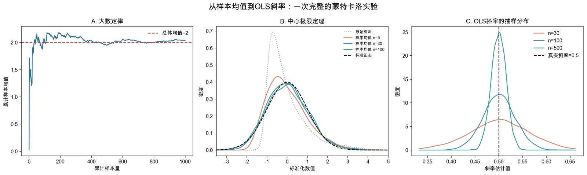

# 第2讲 代码和结果分析

> 本页是“案例实操”的参考解答，依次对应新版教材第1章1.4节、第2章2.4节和第3章3.5节。建议先完成自己的方向判断和代码运行，再使用本页核对。

## 使用说明

- Stata或Python任选一种，无需两种都运行；
- 三个脚本各自独立可运行：案例一使用参数已知的蒙特卡洛模拟数据，案例二、三使用同一口径的教学工资数据；
- 下列小数来自Python主脚本的固定输出；Stata会因随机数算法不同而得到略有差异的数值；
- 教学代码已经分别在Python和StataNow 19.5 MP中完整运行。

## 主脚本对照

| 案例 | 教材位置 | Stata | Python |
|---|---|---|---|
| 从样本均值到样本回归线 | 第1章1.4节 | `ch01/01_monte_carlo_foundations.do` | `ch01/01_monte_carlo_foundations.py` |
| 教育、经验与工资 | 第2章2.4节 | `ch02/01_controls_ovb_fwl.do` | `ch02/01_controls_ovb_fwl.py` |
| 读懂一张工资回归表 | 第3章3.5节 | `ch03/01_read_regression_table.do` | `ch03/01_read_regression_table.py` |

---

## 案例一解答：从样本均值到样本回归线

### 1. 模拟设定

| 项目 | 设定 |
|---|---|
| 总体分布 | 指数分布，总体均值=2，总体标准差=2（明显右偏） |
| 每次抽样观测数 | 任务1为1000；任务2为5、30、100；任务3为30、100、500 |
| 蒙特卡洛重复次数 | 3000（任务1为单次累计轨迹） |
| 回归数据生成过程 | $Y_i=2+0.5X_i+u_i$，其中 $X\sim U(0,10)$，$u\sim N(0,1)$ |
| 真实斜率 | 0.5 |
| 随机种子 | `20260910` |

必须把两个“次数”分开：**每次抽样的样本量**（5/30/100 或 30/100/500）决定每一次估计包含多少信息；**蒙特卡洛重复次数**（3000）决定我们描绘抽样分布有多精细。前者影响估计的精度，后者只影响我们对分布的观察是否平滑。

### 2. 任务1：累计样本均值与大数定律

Python主脚本在几个关键节点输出的累计样本均值（总体真值为2）：

| 累计样本量 | 累计样本均值 |
|---:|---:|
| 10 | 1.3764 |
| 50 | 2.1614 |
| 100 | 2.0341 |
| 500 | 1.9532 |
| 1000 | 2.0369 |

最初50个观测的累计均值极差达到2.14，而最后500个观测的极差只有0.10。小样本阶段曲线上下起伏明显，随着观测增加逐渐收拢到总体均值2附近。但要注意它**并不是单调收敛**：n=500时为1.9532，n=1000时又回到2.0369。

这正是大数定律的准确含义——样本均值在相应条件下逐渐稳定、波动越来越小，而**不是**从某个样本量开始就永久等于总体均值。样本有多少信息、和样本估计恰好落在哪里，是两回事。

### 3. 任务2：标准化样本均值与中心极限定理

用同一随机种子复现，三种样本量下标准化样本均值的分布特征为：

| 每次抽样的样本量 | 偏度 | 超值峰度 | $P(|\cdot|>1.96)$ |
|---:|---:|---:|---:|
| 5 | +0.824 | +0.760 | 0.045 |
| 30 | +0.372 | +0.212 | 0.048 |
| 100 | +0.155 | −0.074 | 0.055 |

对照标准正态的理论值：偏度0、超值峰度0、双侧5%尾概率0.05。

样本量为5时，标准化样本均值的分布仍明显右偏（偏度0.82）、尾部偏厚；样本量增到30时右偏大幅减弱；到100时已相当接近标准正态，落在±1.96之外的比例也稳定在0.05附近。

这里必须说清三件事：

- 中心极限定理讨论的是**标准化样本均值的抽样分布**，不是把原始右偏数据“变成”正态数据。图中灰色的原始观测分布始终是右偏的，改变的只是反复抽样的均值分布；
- 中心极限定理提供的是**近似**，所需的样本量与总体偏度有关。本例总体右偏较强，n=5 时近似还不够好，n=100 时才比较令人满意；
- 三个样本量下 $P(|\cdot|>1.96)$ 都接近5%，这为后面用标准误和 $t$ 值做近似推断提供了分布基础。

### 4. 任务3：OLS斜率的重复抽样分布

Python主脚本输出的斜率汇总（真实斜率0.5，每组重复3000次）：

| 每次抽样的样本量 | 斜率均值 | 斜率标准差 | 偏差（均值−0.5） |
|---:|---:|---:|---:|
| 30 | 0.50042 | 0.06445 | +0.00042 |
| 100 | 0.50061 | 0.03361 | +0.00061 |
| 500 | 0.49980 | 0.01551 | −0.00020 |

Stata主脚本运行结果（随机数算法不同，数值略有差异）：

| 每次抽样的样本量 | 斜率均值 | 斜率标准差 |
|---:|---:|---:|
| 30 | 0.49907 | 0.06458 |
| 100 | 0.50060 | 0.03535 |
| 500 | 0.49977 | 0.01532 |

三组分布都大致围绕真实斜率0.5，偏差量级在千分之一到万分之一之间，属于抽样波动，没有明显的系统性偏误；而斜率标准差从0.064降到0.034再降到0.016，样本量越大分布越集中。这说明：

- **一次回归偏离0.5只是抽样波动**，不能据此判断估计方法失效；
- **偏误由分布中心与真实值的距离体现**（本设定下接近0），**精度由分布的宽度体现**（样本量越大越窄）；
- 估计量是随机变量——换一个样本就会得到不同的斜率。这正是本讲反复强调“估计量有抽样分布”的直接证据，也是后面必须报告标准误的原因。



A图是大数定律：累计样本均值在小样本阶段波动明显，随后逐渐靠近总体均值2。B图是中心极限定理：右偏的原始分布不变，但样本量从5增到100后，标准化样本均值的分布逐步接近标准正态。C图是OLS斜率的抽样分布：三组都围绕真实斜率0.5，样本量越大越集中。

### 5. 案例一的边界

模拟能够展示估计方法在**设定世界**中的性质，却不能证明现实样本满足随机抽样、零条件均值、同方差等假设。案例一给出的结论是“假如数据真按这个机制产生，OLS在重复抽样中表现如何”；把它搬到真实数据上，还需要逐条核对经典假设。这一点在案例二、三中会不断出现。

---

## 案例二解答：控制变量、遗漏变量与FWL

### 1. 数据生成逻辑

样本量为800，随机种子为`20260910`。完整工资方程为：

$$
\ln(wage_i)=1.6+0.08educ_i+0.035exper_i+0.02tenure_i+u_i.
$$

生成过程让教育、经验和任职年限都受到同一背景因素影响。完整模型的误差项独立于这些解释变量，且方差为常数。因此，遗漏经验和任职年限后出现的问题是零条件均值被破坏，而不是异方差。

### 2. 遗漏模型与完整模型

#### Stata核心代码

```stata
regress ln_wage educ
estimates store omitted

regress ln_wage educ exper tenure
estimates store full

estimates table omitted full, b(%9.4f) se(%9.4f) stats(N r2)
corr educ exper tenure
```

#### Python核心代码

```python
omit = sm.OLS(df["ln_wage"], sm.add_constant(df[["educ"]])).fit()
full = sm.OLS(
    df["ln_wage"],
    sm.add_constant(df[["educ", "exper", "tenure"]])
).fit()

print(omit.params["educ"], omit.bse["educ"], omit.rsquared)
print(full.params["educ"], full.bse["educ"], full.rsquared)
```

#### Python参考结果

| 模型 | 教育系数 | 标准误 | $R^2$ |
|---|---:|---:|---:|
| 只含教育 | 0.12104 | 0.00634 | 0.31337 |
| 控制经验与任职年限 | 0.08559 | 0.00582 | 0.49697 |

只含教育时，教育系数约为0.121；加入经验和任职年限后下降到0.086左右，更接近生成过程设定的真值0.08。

方向上升的原因是：被遗漏的经验和任职年限都正向影响工资，并且与教育正相关。遗漏它们时，教育系数吸收了部分本应属于这些变量的关系。但“加控制变量后系数下降”不是普遍定律，偏误方向取决于两个相关方向。

### 3. FWL三步法

#### Stata核心代码

```stata
regress educ exper tenure
predict educ_resid, residuals

regress ln_wage exper tenure
predict wage_resid, residuals

regress wage_resid educ_resid
```

#### Python核心代码

```python
controls = sm.add_constant(df[["exper", "tenure"]])
educ_aux = sm.OLS(df["educ"], controls).fit()
wage_aux = sm.OLS(df["ln_wage"], controls).fit()

df["educ_resid"] = educ_aux.resid
df["wage_resid"] = wage_aux.resid
fwl = sm.OLS(
    df["wage_resid"],
    sm.add_constant(df[["educ_resid"]])
).fit()
```

Python运行结果为：

- 完整回归教育系数：`0.0855881607`；
- FWL残差回归斜率：`0.0855881607`；
- 两者差值：约`-4.16×10^-17`，属于浮点计算误差。


左图用经验和任职年限解释教育，中图用同一组变量解释工资，右图只比较两者剩余的部分。右图斜率与完整回归的教育系数一致，是FWL的样本代数结果。

FWL直观地说明了多元回归如何在样本内“控制”其他变量，但它不能证明控制变量选对了，也不能证明教育系数具有因果含义。

---

## 案例三解答：读懂一张工资回归表

### 1. 估计、区间和联合检验

#### Stata核心代码

```stata
regress ln_wage educ exper tenure

display "教育t值 = " _b[educ]/_se[educ]
display "教育95%置信区间 = [" ///
    _b[educ]-invttail(e(df_r),0.025)*_se[educ] ", " ///
    _b[educ]+invttail(e(df_r),0.025)*_se[educ] "]"

test exper tenure
```

#### Python核心代码

```python
model = sm.OLS(
    df["ln_wage"],
    sm.add_constant(df[["educ", "exper", "tenure"]])
).fit()

ci = model.conf_int(alpha=0.05)
joint_test = model.f_test("exper = 0, tenure = 0")

print(model.summary())
print(model.params["educ"] / model.bse["educ"])
print(joint_test)
```

### 2. Python参考回归表

| 变量 | 系数 | 标准误 | $t$值 | $p$值 | 95%置信区间 |
|---|---:|---:|---:|---:|---:|
| 常数项 | 1.44277 | 0.07746 | 18.625 | <0.001 | [1.29071, 1.59482] |
| 教育年限 | 0.08559 | 0.00582 | 14.706 | <0.001 | [0.07416, 0.09701] |
| 工作经验 | 0.03538 | 0.00320 | 11.060 | <0.001 | [0.02910, 0.04165] |
| 任职年限 | 0.03039 | 0.00490 | 6.196 | <0.001 | [0.02076, 0.04002] |


教育系数0.08559表示：在该模型中控制经验和任职年限后，教育每增加1年，条件对数工资平均相差约8.56%。更精确的百分比换算为$100[\exp(0.08559)-1]\%$，约为8.94%。

教育系数的$t$值可由`0.08559/0.00582`重新计算，结果约为14.71。$p$值小且区间不包含0，说明数据与“教育条件回归系数为0”的假设不相容。它仍只是条件相关证据，不自动证明教育的因果效应。

### 3. 联合检验

对$H_0:\beta_{exper}=\beta_{tenure}=0$的联合检验，Python结果约为：

- $F=145.26$；
- $p<0.001$。

因此拒绝“经验和任职年限系数同时为0”的原假设。这表示两者作为一组对解释对数工资有统计贡献，不等于证明每个变量都具有因果效应。

### 4. 论文式结果表述示例

> 基于800个教学用模拟观测，本案例以对数工资为被解释变量，并控制工作经验和任职年限。教育系数估计值为0.0856，标准误为0.0058，95%置信区间为[0.0742, 0.0970]。这表明，在该模型中教育每增加1年，条件对数工资平均相差约8.6%。经验与任职年限的联合检验拒绝了二者系数同时为0的原假设。但由于数据为教学用合成数据，模型也未排除所有潜在遗漏因素，上述结果只用于展示条件相关与统计推断，不应解释为现实中的教育因果回报。

## 三个案例的联系

三个案例不是三个并列的小实验，而是一条完整的推理链：

1. **案例一（第1章）**：在参数已知的虚拟世界里先看清楚“样本系数是随机变量”——它有抽样分布，可能偏离真值，也会随样本量增加而更集中。这回答了“我们为什么要讨论估计量的统计性质”。
2. **案例二（第2章）**：把估计放回真实的多元回归设定，说明除了抽样波动，系数还可能因为遗漏变量而**系统性**偏离。这回答了“系数为什么依赖模型控制了什么”。
3. **案例三（第3章）**：点估计得到之后，用标准误、置信区间和联合检验表达剩余的不确定性。这回答了“证据最多能支持多强的结论”。

三者的分工可以概括成一句话：**案例一管“估计量为什么会动”，案例二管“系数为什么会偏”，案例三管“结论能说到哪里”。** 案例二和三都要先有案例一建立的抽样分布直觉，才知道为什么要报告标准误、为什么显著性不等于因果。

完整的阅读顺序应该是：

1. 先问估计量为什么会有波动（案例一）；
2. 再问模型估计的是什么、系数在加入或删除控制变量后是否稳定（案例二）；
3. 然后看点估计的不确定性有多大（案例三）；
4. 最后判断证据最多支持条件相关，还是已经具备因果解释条件。

## 最小核验清单

- 案例一中是否把“单个观测的分布”“样本均值的分布”“OLS斜率的分布”三者分开？
- 案例一中是否把“每次抽样的样本量”与“蒙特卡洛重复次数”分开？
- 案例一中是否把中心极限定理误说成“原始数据服从正态分布”？
- 案例一中是否意识到模拟只能说明设定世界里的性质，不能证明现实数据满足经典假设？
- 案例二的两个模型比较时是否使用同一批观测？
- FWL残差化是否包含常数项并使用同一组控制变量？
- 案例三中系数除以标准误能否重现$t$值？
- $p$值与95%置信区间是否给出一致结论？
- 是否将显著性、经济大小和因果解释分开了？
