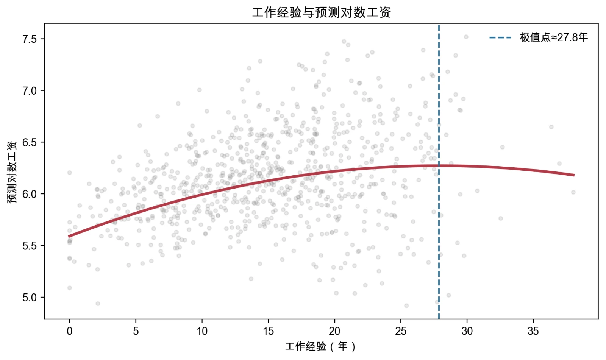
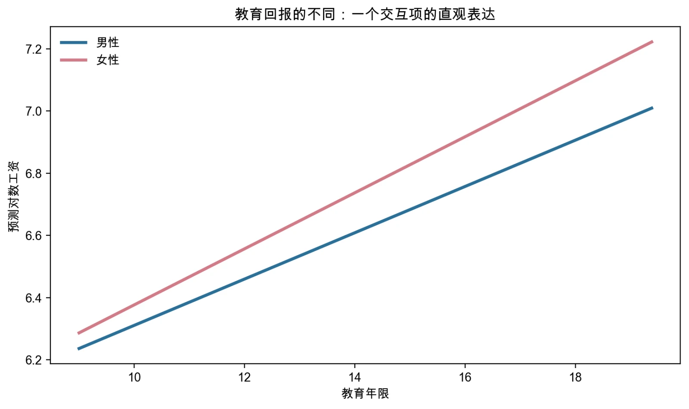

# 第3讲 代码和结果分析

> 本页是“案例实操”的参考解答，直接对应新版教材第4章4.4节和第5章5.5节。请先自己选择模型、完成诊断并写出解释，再使用本页核对。

## 使用说明

- 第4章和第5章使用两份独立的教学数据，不要混用；
- 每章的Stata和Python主脚本执行同一组分析任务；
- 本页小数为Python固定样本结果，Stata的具体数字会略有差异；
- 两套代码均已完整运行，课堂使用时只需选择一种软件。

## 主脚本对照

| 案例 | 教材位置 | Stata | Python |
|---|---|---|---|
| 工资模型的形式扩展 | 第4章4.4节 | `ch04/01_wage_form_specification.do` | `ch04/01_wage_form_specification.py` |
| 工资回归的完整诊断 | 第5章5.5节 | `ch05/01_model_diagnostics.do` | `ch05/01_model_diagnostics.py` |

---

## 案例一解答：工资模型的形式扩展

### 1. 数据生成逻辑

样本量为800，Python随机种子为`20260911`。对数工资的生成方程为：

$$
\ln(wage_i)=5+0.075educ_i+0.05exper_i-0.0009exper_i^2
-0.12female_i+0.018(educ_i\times female_i)+u_i.
$$

该设定包含三种需要由模型表达的特征：工资的相对变化、经验的非线性关系、教育斜率的性别差异。

### 2. 递进模型代码

#### Stata核心代码

```stata
* 水平模型与对数模型
regress wage educ exper i.female
estimates store level
regress ln_wage educ exper i.female
estimates store log

* 经验二次项
regress ln_wage educ c.exper##c.exper i.female
estimates store quadratic
display "经验曲线极值点 = " -_b[exper]/(2*_b[c.exper#c.exper])

* 教育×性别交互项
regress ln_wage c.educ##i.female c.exper##c.exper
estimates store interaction
margins female, dydx(educ)

estimates table level log quadratic interaction, ///
    b(%9.4f) se(%9.4f) stats(N r2)
```

#### Python核心代码

```python
base = ["educ", "exper", "female"]
m_level = sm.OLS(df["wage"], sm.add_constant(df[base])).fit()
m_log = sm.OLS(df["ln_wage"], sm.add_constant(df[base])).fit()
m_quad = sm.OLS(
    df["ln_wage"], sm.add_constant(df[base + ["exper2"]])
).fit()
m_inter = sm.OLS(
    df["ln_wage"],
    sm.add_constant(df[base + ["exper2", "educ_female"]])
).fit()

turning = -m_quad.params["exper"]/(2*m_quad.params["exper2"])
male_slope = m_inter.params["educ"]
female_slope = m_inter.params["educ"] + m_inter.params["educ_female"]
```

### 3. Python参考模型比较

| 模型 | 被解释变量 | 表中的教育系数 | $R^2$ | 新回答的问题 |
|---|---|---:|---:|---|
| 工资水平 | `wage` | 66.97382 | 0.34536 | 教育与工资金额的条件关系 |
| 对数工资 | `ln_wage` | 0.08150 | 0.36473 | 教育与近似百分比工资差异 |
| 加经验平方项 | `ln_wage` | 0.08209 | 0.38468 | 经验边际回报是否变化 |
| 加教育×女性 | `ln_wage` | 0.07445 | 0.38657 | 教育斜率是否随性别变化 |

水平模型的教育系数使用工资金额单位；对数模型的系数0.0815可近似表述为教育每增加1年，条件工资平均相差约8.15%。系数单位不同，不能直接比较数字大小。

### 4. 经验曲线

Python样本中，根据一次项和二次项估计值计算的极值点约为**26.72年**。



经验一次项为正、平方项为负时，曲线呈倒U形，说明模型中经验的边际回报逐渐下降。极值点位于样本范围内，但它仍是其他变量给定时的平均预测关系，不代表每个人工作满26.72年后工资都会下降。

### 5. 教育×性别交互项

| 组别 | 教育斜率 | 标准误 | 95%置信区间 |
|---|---:|---:|---:|
| 男性 | 0.07445 | 0.00700 | [0.06073, 0.08816] |
| 女性 | 0.09011 | 0.00717 | [0.07606, 0.10415] |



男性是基准组，因此`educ`主效应是男性教育斜率；女性教育斜率等于`educ`主效应与`educ×female`交互项之和。对线性组合做推断时，标准误还必须考虑两个估计系数的协方差，不能只把两个标准误相加。

---

## 案例二解答：一份工资回归的完整诊断

### 1. 诊断数据的已知设定

样本量为800，Python随机种子为`20260912`。生成过程故意设定：

- `ability`同时影响教育和工资；
- `city_income`和`city_size`共享一个城市发展因子；
- 扰动项标准差为`0.18+0.018×exper`，随经验增加而扩大。

这三个设定分别用于展示遗漏变量偏误、多重共线性和异方差。

### 2. 诊断代码

#### Stata核心代码

```stata
* 遗漏变量比较
regress ln_wage educ exper female city_income city_size
estimates store omitted
regress ln_wage educ exper female city_income city_size ability
estimates store full
estimates table omitted full, b(%9.4f) se(%9.4f) stats(N r2)

* 多重共线性
estat vif
corr city_income city_size

* 异方差检验
estimates restore omitted
predict fitted, xb
predict resid, residuals
rvfplot, yline(0)
estat hettest
estat imtest, white

* 稳健推断
regress ln_wage educ exper female city_income city_size, vce(robust)
```

#### Python核心代码

```python
naive_vars = ["educ", "exper", "female", "city_income", "city_size"]
full_vars = naive_vars + ["ability"]

naive = sm.OLS(df["ln_wage"], sm.add_constant(df[naive_vars])).fit()
full = sm.OLS(df["ln_wage"], sm.add_constant(df[full_vars])).fit()
robust = naive.get_robustcov_results(cov_type="HC1")

X_vif = sm.add_constant(df[full_vars])
vif = [
    variance_inflation_factor(X_vif.to_numpy(), i)
    for i in range(X_vif.shape[1])
]

bp = het_breuschpagan(naive.resid, naive.model.exog)
white = het_white(naive.resid, naive.model.exog)
```

### 3. 遗漏能力变量

| 模型 | 教育系数 |
|---|---:|
| 遗漏`ability` | 0.11355 |
| 控制`ability` | 约0.08988 |

遗漏能力后教育系数偏高。数据生成过程中，能力与教育正相关，并且正向影响工资；因此遗漏能力时，教育系数吸收了能力的部分关系。

现实研究通常不知道“真实数据生成过程”，也可能根本观察不到能力，因此不能把本次模拟中的比较当成现实研究的通用诊断方法。

### 4. 多重共线性

| 变量 | VIF |
|---|---:|
| `educ` | 1.39 |
| `exper` | 1.00 |
| `female` | 1.00 |
| `city_income` | 21.60 |
| `city_size` | 21.62 |
| `ability` | 1.38 |

`city_income`和`city_size`的VIF明显较高，说明数据难以精确分离两个城市指标的独立关系。这主要表现为两个系数的标准误较大、单个系数不稳定，而不是自动导致所有OLS系数有偏。

是否删除变量应取决于研究问题和指标含义。如果只关心控制城市发展水平，可选择理论上更合适的一个指标；如果两者都有独立理论含义，也可保留并如实报告不确定性。

### 5. 异方差与稳健标准误

Python固定样本的检验结果为：

- Breusch–Pagan检验$p$值约为`1.51×10^-13`；
- White检验$p$值约为`1.98×10^-10`。

两项检验都拒绝同方差原假设，与数据生成时让误差波动随经验增大的设定一致。


| 变量 | OLS系数 | 常规标准误 | HC1稳健标准误 |
|---|---:|---:|---:|
| `educ` | 0.11355 | 0.00947 | 0.00910 |
| `exper` | 0.03497 | 0.00259 | 0.00269 |
| `female` | -0.12130 | 0.03143 | 0.03151 |
| `city_income` | 0.05305 | 0.07436 | 0.07269 |
| `city_size` | 0.03031 | 0.07375 | 0.07076 |

常规标准误与稳健标准误并不会对每个变量按同一比例变化。这由解释变量、杠杆值和误差方差的共同结构决定。更重要的是，改用稳健标准误没有改变OLS系数，也不能把遗漏能力所导致的偏误修复掉。

### 6. 最终诊断清单

| 问题 | 主要影响 | 本案例处理 | 处理后仍然存在的限制 |
|---|---|---|---|
| 遗漏`ability` | 教育系数可能有偏 | 与已知真相的参照模型比较 | 现实中能力通常不可观测 |
| 城市指标高度相关 | 单个系数精度下降 | 结合研究问题解释VIF | 不能机械根据阈值删变量 |
| 异方差 | 常规标准误可能失效 | 报告HC1稳健标准误 | 不能修复遗漏变量偏误 |

## 最终解释示例

> 工资函数形式案例表明，模型设定应服务于研究问题：对数变换改变系数单位，经验平方项允许边际回报变化，教育与性别交互项允许两组教育斜率不同。诊断案例进一步表明，不同问题不能用同一种工具解决：遗漏能力可能使教育系数有偏，城市指标的高度共线主要降低单个系数精度，异方差则使常规标准误不可靠。HC1稳健标准误可改善异方差下的推断，却不能修复遗漏变量偏误，也不能把条件相关直接变成因果效应。

## 最后核对

1. 对数、二次项和交互项分别回答了什么问题？
2. 男女教育斜率是否按正确的线性组合计算？
3. 极值点是否在样本范围内，是否被过度解释？
4. VIF、异方差检验和稳健标准误是否各自用在了正确问题上？
5. 稳健标准误是否被误写成了遗漏变量的修正方法？
6. 结果解释是否区分了模型内条件关系与因果结论？
