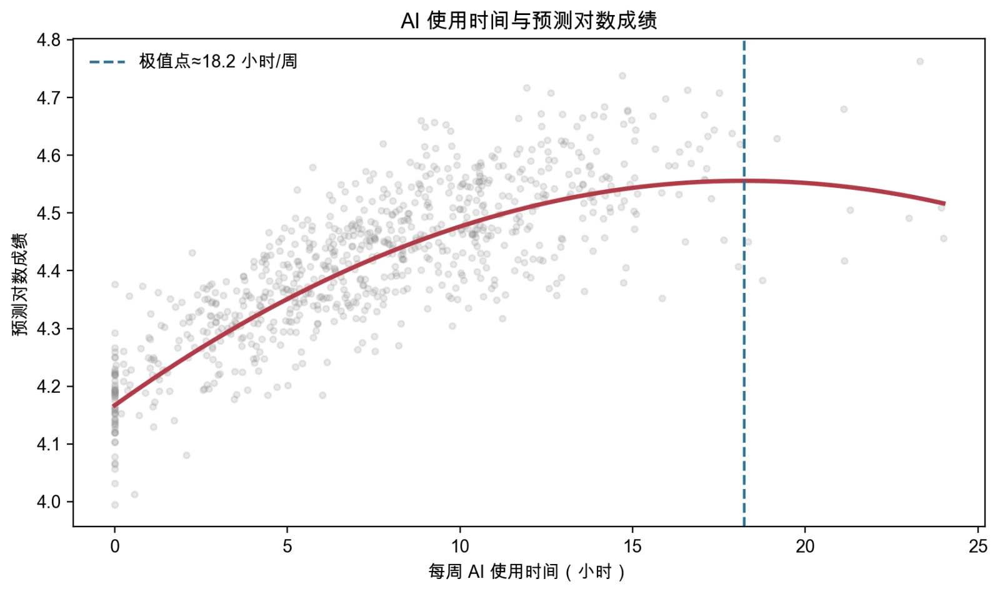
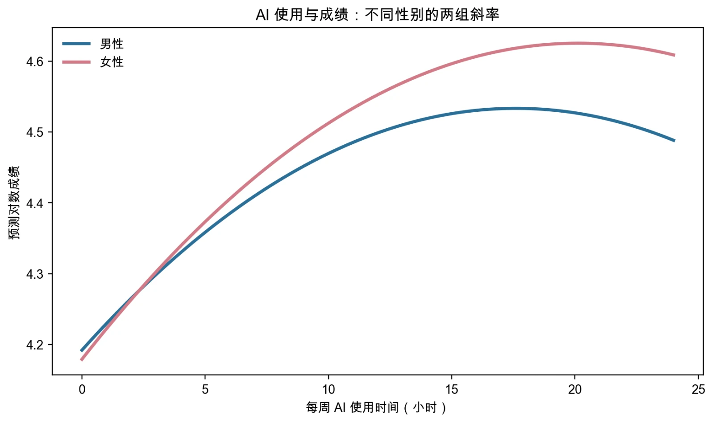
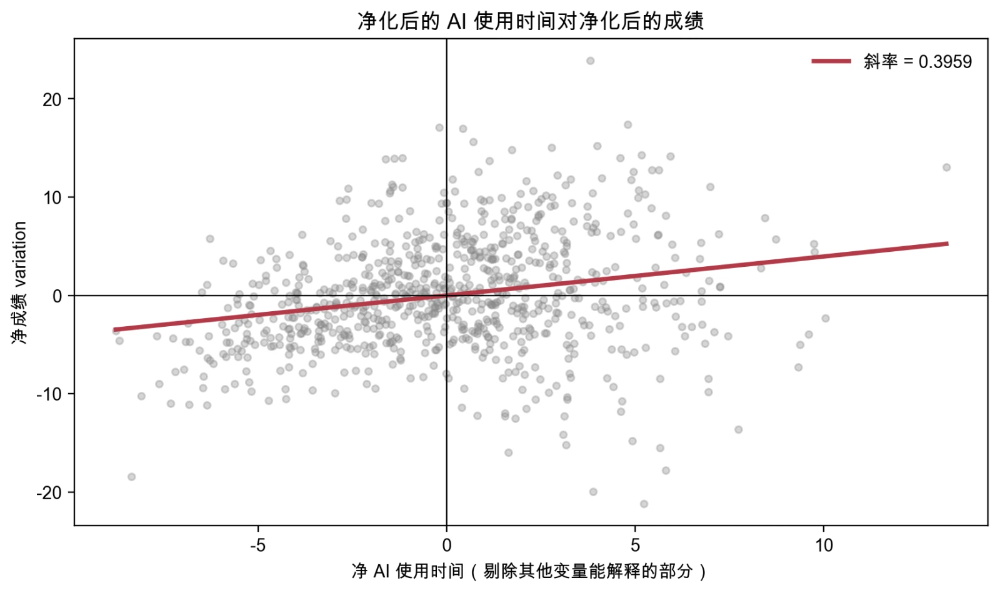

# 第3讲 代码和结果分析

> 本页是“案例实操”的参考解答，对应新版教材第4章4.4节和第5章5.5节。请先自己选择模型、完成诊断并写出解释，再使用本页核对。

## 使用说明

- 本讲只有**一份数据、两个主脚本**：`ch04` 负责第一段（模型形式），`ch05` 负责第二段（控制与 FWL）和第三段（诊断与处理）；
- 两个脚本使用同一随机种子与同一数据生成过程，面对的是同一份样本；为保证单独下载任一章的脚本都能运行，生成代码在每个脚本中各保留一份；
- 本页小数为Python固定样本结果，Stata的具体数字会略有差异（例如二次曲线的极值点，Python为18.2小时/周，Stata为20.0小时/周），结论一致；
- 两套代码均已完整运行，课堂使用时只需选择一种软件。

## 主脚本对照

| 段落 | 教材位置 | Stata | Python |
|---|---|---|---|
| 第一段：模型形式 | 第4章4.4节 | `ch04/01_ai_score_form_specification.do` | `ch04/01_ai_score_form_specification.py` |
| 第二、三段：控制与诊断 | 第5章5.5节 | `ch05/01_ai_score_diagnostics.do` | `ch05/01_ai_score_diagnostics.py` |

## 数据生成逻辑（全讲共用）

样本量为800，Python随机种子为`20260915`。成绩的生成方程为：

$$
score_i=56+2.0\,ai_i-0.060\,ai_i^2+0.55(ai_i\times female_i)
+4.5\,ability_i+0.6\,age_i-1.8\,female_i
+0.20\,parent\_edu_i+0.15\,family\_income_i+u_i.
$$

生成过程同时埋进了四种需要由后续分析处理的特征：

- **函数形式**：AI 使用时间通过二次项影响成绩（边际作用递减），斜率在男女之间不同；
- **遗漏变量**：`ability`同时影响 AI 使用和成绩（`ai = 3 + 3.2 ability + …`），但它不在任何一份“天真模型”里；
- **多重共线性**：`parent_edu`与`family_income`共享同一个家庭背景因子，相关性极高；
- **异方差**：扰动项标准差为`2.0 + 0.35×ai`，随 AI 使用时间增加而扩大。

四类特征都在同一份数据里，三段分析才能串成一条线。

---

## 第一段解答：模型形式

### 1. 递进模型代码

#### Stata核心代码

```stata
* 水平模型与对数模型
regress score ai age i.female
estimates store level
regress ln_score ai age i.female
estimates store log

* AI 使用时间的二次项
regress ln_score ai c.ai##c.ai age i.female
estimates store quadratic
display "对数成绩模型中 AI 的极值点 = " -_b[ai]/(2*_b[c.ai#c.ai])

* AI × 性别交互项
regress ln_score c.ai##i.female c.ai##c.ai age
estimates store interaction
margins female, dydx(ai)

estimates table level log quadratic interaction, ///
    b(%9.4f) se(%9.4f) stats(N r2)
```

#### Python核心代码

```python
base = ["ai", "age", "female"]
m_level = sm.OLS(df["score"], sm.add_constant(df[base])).fit()
m_log = sm.OLS(df["ln_score"], sm.add_constant(df[base])).fit()
m_quad = sm.OLS(
    df["ln_score"], sm.add_constant(df[base + ["ai2"]])
).fit()
m_inter = sm.OLS(
    df["ln_score"], sm.add_constant(df[base + ["ai2", "ai_female"]])
).fit()

turning = -m_quad.params["ai"]/(2*m_quad.params["ai2"])
male_slope = m_inter.params["ai"]
female_slope = m_inter.params["ai"] + m_inter.params["ai_female"]
```

### 2. Python参考模型比较

| 模型 | 被解释变量 | 表中的 AI 系数 | $R^2$ | 新回答的问题 |
|---|---|---:|---:|---|
| 成绩水平 | `score` | 1.87971 | 0.63697 | AI 使用时间与成绩“分数”的关系 |
| 对数成绩 | `ln_score` | 0.02291 | 0.63850 | AI 使用时间与近似百分比差异 |
| 加 AI 平方项 | `ln_score` | 0.04267 | 0.70232 | AI 使用的边际作用是否变化 |
| 加 AI×性别 | `ln_score` | 0.03878 | 0.71117 | 斜率是否随性别变化 |

水平模型的 AI 系数使用“分”作单位；对数模型的系数0.02291可近似表述为每周多用 1 小时 AI，条件成绩均值约高2.29%。系数单位不同，不能直接比较数字大小。

另外要留意：从“对数成绩”到“加 AI 平方项”，AI 系数从0.02291变为0.04267；加入`ai×female`以后降到0.03878。这是因为交互项进入模型后，AI 主效应改变了含义——它从“平均斜率”变成了**男性组**的斜率。**系数的含义变了，数值自然会变。**

### 3. AI 使用曲线

Python样本中，根据一次项和二次项估计值计算的极值点约为**18.2 小时/周**（Stata为20.0）。



AI 一次项为正、平方项为负时，曲线呈倒U形，说明模型中 AI 使用的边际作用逐渐下降。极值点位于样本范围（0—24 小时/周）内，但它仍是其他变量给定时的平均预测关系，不代表每个学生每周用满18.2小时后成绩都会下降。

需要注意，倒U形是**这份数据**的形状，不是二次项的普遍结论。二次项只是允许边际效应随 AI 使用水平改变；是升是降、有没有转折点，取决于一次项与二次项的符号，以及样本是否覆盖了转折点。

### 4. AI × 性别交互项

| 组别 | AI 斜率 | 标准误 | 95%置信区间 |
|---|---:|---:|---:|
| 男性 | 0.03878 | 0.00178 | [0.03530, 0.04227] |
| 女性 | 0.04434 | 0.00163 | [0.04115, 0.04754] |



男性是基准组，因此`ai`主效应是男性斜率；女性斜率等于`ai`主效应与`ai×female`交互项之和。对线性组合做推断时，标准误还必须考虑两个估计系数的协方差，不能只把两个标准误相加。

这也说明二次项与交互项的分工：**二次项让边际效应随 X 自己改变，交互项让边际效应随 Z 改变。**

### 5. 回到“线性到底指什么”

本段四个方程全部是**线性回归**，因为它们对参数都是线性的：

$$
\ln(score)=\beta_0+\beta_1 ai+\beta_2 ai^2+u
$$

这里成绩与 AI 使用时间画出来不是直线，但参数 $\beta_0,\beta_1,\beta_2$ 以线性组合的方式进入方程，所以仍然用 OLS 估计。对比一个真正对参数非线性的模型：

$$
Y=\beta_0+X^{\beta_1}+u
$$

这里 $\beta_1$ 以幂次方式进入，已经不是普通线性回归框架。

---

## 第二段解答：控制变量到底在控制什么

### 1. 遗漏与控制 `ability`

| 模型 | AI 系数 | 标准误 |
|---|---:|---:|
| 遗漏`ability` | 1.88287 | 0.05150 |
| 控制`ability` | 1.20994 | 0.05755 |

遗漏能力后 AI 系数明显偏高（1.88287 对 1.20994，相差约 0.67）。数据生成过程中，能力与 AI 使用正相关（`ai = 3 + 3.2 ability + …`），并且正向影响成绩；因此遗漏能力时，AI 系数吸收了能力的部分关系。

**这个差额就是遗漏变量偏误的大小。** 注意它伤害的是**系数本身**，不是标准误——把能力加进来以后，系数从 1.88287 掉到 1.20994，而标准误还从 0.05150 略增到 0.05755。偏误减小与精度下降可以同时发生。

现实研究通常不知道“真实数据生成过程”，也可能根本观察不到能力，因此不能把本次模拟中的比较当成现实研究的通用诊断方法。

### 2. FWL：亲手验证“控制”做了什么

“控制”常被理解成“把能力按住不动，看 AI 使用的变化”。OLS 并不是这么做的。FWL 定理把真正的做法拆成三步：

#### Stata核心代码

```stata
* 第1步：净化 ai
regress ai age female parent_edu family_income ability
predict ai_resid, residuals

* 第2步：净化成绩
regress score age female parent_edu family_income ability
predict score_resid, residuals

* 第3步：剩余解释剩余（不加常数项）
regress score_resid ai_resid, noconstant
display "FWL 第 3 步的AI系数 = " _b[ai_resid]
```

#### Python核心代码

```python
z_vars = ["age", "female", "parent_edu", "family_income", "ability"]
ai_resid = sm.OLS(df["ai"], sm.add_constant(df[z_vars])).fit().resid
score_resid = sm.OLS(df["score"], sm.add_constant(df[z_vars])).fit().resid
# 两个残差的均值都是 0，故不再加常数项
fwl = sm.OLS(score_resid, ai_resid).fit()
```

#### 验证结果

| 路径 | AI 系数 |
|---|---:|
| 多元回归：`ai`的系数 | 1.209941 |
| FWL第 3 步：净成绩对净 AI 回归 | 1.209941 |

两个数字**完全相等**（Python样本相差约 5.8×10⁻¹⁵，纯属浮点误差）。这正是 FWL 定理的内容：把 X 和 Y 各净化一遍以后，“剩余解释剩余”得到的斜率，就等于原多元回归中 X 的系数。



这张图的横轴是“净 AI 使用时间”，纵轴是“净成绩 variation”，斜率 1.2099 与多元回归完全一致。它把“控制”的含义画了出来：

> **控制 = Partialling Out。先剔除控制变量能够解释的部分，再利用剩余 variation 进行比较。**

换句话说：

> **X = 能被控制变量解释的部分 + 净 variation**

多元回归只用了后面那一块。所以：

> **一个回归系数不是由 X 的全部 variation 识别出来的，而是由控制其他变量之后仍然剩下的 variation 识别出来的。**

这就是 identifying variation。以后学习固定效应、工具变量、双重差分、双重机器学习等方法时，都要继续追问同一个问题：**Where does the identifying variation come from?**

### 3. 关于常数项的一个细节

第 3 步的回归**不加常数项**。因为净化后的两个残差均值都是 0，回归线必然过原点；如果误加了常数项，理论上斜率仍是同一个值，但会多出一个本该为 0 的截距，掩盖“剩余解释剩余”的含义。

---

## 第三段解答：诊断与处理

### 1. 多重共线性

| 变量 | VIF |
|---|---:|
| `ai` | 1.788 |
| `age` | 1.024 |
| `female` | 1.019 |
| `parent_edu` | 22.809 |
| `family_income` | 22.807 |
| `ability` | 1.751 |

`parent_edu`和`family_income`的VIF明显较高（两者相关系数为 **0.9778**），说明数据难以精确分离家庭背景两个指标的独立关系。这主要表现为两个系数的标准误较大、单个系数不稳定，而不是自动导致所有OLS系数有偏。

对比系数即可看到：`parent_edu`为 0.35356、`family_income`为 -0.18315，符号一正一负，但两者的标准误都在 0.5 以上——两个指标一起放进模型时，很难说清各自独立贡献了多少。

是否删除变量应取决于研究问题和指标含义。如果只关心控制家庭社会经济地位，可选择理论上更合适的一个指标；如果两者都有独立理论含义，也可保留并如实报告不确定性。**高 VIF 本身不是机械删变量的理由。**

### 2. 函数形式检查（RESET）

本段为讨论“控制”使用了只含 AI 一次项的线性设定。RESET检验结果：

- $F=43.233$，$p$值约为`1.51×10^-18`。

检验拒绝了“线性形式足够”的原假设，与第一段的结论一致：AI 的边际作用随使用强度变化，只放一次项会遗漏曲率。**这类问题的处理方向是重新设定模型形式，而不是更换标准误。**

### 3. 异方差与稳健标准误

Python固定样本的检验结果为：

- Breusch–Pagan检验$p$值约为`4.30×10^-14`；
- White检验$p$值约为`1.97×10^-25`。

两项检验都拒绝同方差原假设，与数据生成时让误差波动随 AI 使用时间增大的设定一致。


残差图可以直接看出这一点：拟合值较小时残差集中在零附近，拟合值较大时残差明显散开，呈现漏斗形。

| 变量 | OLS系数 | 常规标准误 | HC1稳健标准误 |
|---|---:|---:|---:|
| `ai` | 1.88287 | 0.05150 | 0.07108 |
| `age` | 0.58062 | 0.15050 | 0.14541 |
| `female` | 2.73114 | 0.47044 | 0.46316 |
| `parent_edu` | 0.35356 | 0.50325 | 0.50273 |
| `family_income` | -0.18315 | 0.58290 | 0.57055 |

常规标准误与稳健标准误并不会对每个变量按同一比例变化。 AI 系数的标准误从 0.05150 变成 0.07108（约 +38%），而其他变量的变化要小得多。这由解释变量、杠杆值和误差方差的共同结构决定。更重要的是：

> **稳健标准误没有改变任何一个OLS系数。它修正的是推断，不是系数。**

而且它**修不了遗漏变量偏误**——上表的 AI 系数仍然是 1.88287，仍然是遗漏了`ability`的那个偏高值。

### 4. 四列诊断清单

| 问题 | 主要伤害什么 | 怎么发现 | 怎么处理 |
|---|---|---|---|
| 函数形式错误 | E(Y\|X) 的设定 | 残差图 / RESET / 经济理论 | 重新设定函数形式 |
| 异方差 | 标准误、t、p、置信区间 | 残差图 / BP / White | 报告HC1稳健标准误 |
| 多重共线性 | 单个系数的精度与稳定性 | 相关系数 / VIF | 不机械删变量，回到研究问题找有效 variation |
| 遗漏`ability` | **AI 系数本身（偏误）** | 不能靠普通诊断证明 | 换识别策略，留到因果推断再讲 |

请特别注意第二列与第四列：**BP、White、RESET 是诊断工具，稳健标准误是推断修正，两者不在同一列。** 用残差检验去“修”函数形式错误、或用稳健标准误去“修”遗漏变量偏误，都是把不同环节的问题混在一起。

### 5. 三类问题，三种处理

把本讲所有问题归成三类，处理方向完全不同：

| 层次 | 问题 | 改什么 |
|---|---|---|
| 第一层 | 模型形式错 | 改 Specification（对数、二次项、交互项） |
| 第二层 | 误差结构有问题 | 改 Variance–Covariance / 标准误（稳健、聚类稳健） |
| 第三层 | E(u\|X) ≠ 0 | 改 Identification Strategy（固定效应、工具变量、双重差分、断点回归、实验） |

前两层在本讲已经出现过；第三层不属于本讲，是接下来几讲逐步展开的内容。

## 最终解释示例

> 这份成绩案例只有一份数据，但要走三遍。第一遍看形式：对数变换改变系数单位，AI 使用时间的平方项允许边际作用随使用强度变化，“AI×性别”交互项允许两组斜率不同——这些都是经济假设的写法，不是数学装饰。第二遍看控制：把`ability`放进模型以后，AI 系数从 1.88287 降到 1.20994，而 FWL 三步显示，多元回归实际做的是把 AI 使用和成绩各自的“净 variation”留下来再作比较，所以这个系数是靠控制之后剩下的 variation 识别出来的。第三遍看诊断：家庭背景两个指标高度共线主要降低单个系数精度；RESET 检验提示线性形式不够用，应该改设定；异方差使常规标准误不可靠，HC1稳健标准误把 AI 系数的标准误从 0.0515 修正到 0.0711。但稳健标准误既没有改变任何系数，也修不好遗漏能力带来的偏误——那属于外生性问题，只能靠识别策略，不能靠标准误。

## 最后核对

1. 对数、二次项和交互项分别回答了什么问题？系数含义在加入交互项后有没有改变？
2. 男女斜率是否按正确的线性组合计算？
3. 极值点是否在样本范围内，“先升后降”有没有被当成二次项的必然结论？
4. FWL 第 3 步的斜率是否与多元回归的 AI 系数完全相等？残差回归有没有误加常数项？
5. RESET、VIF、BP/White 和稳健标准误是否各自用在了正确问题上？
6. 稳健标准误是否被误写成了遗漏变量的修正方法？
7. 结果解释是否区分了模型内条件关系与因果结论？
