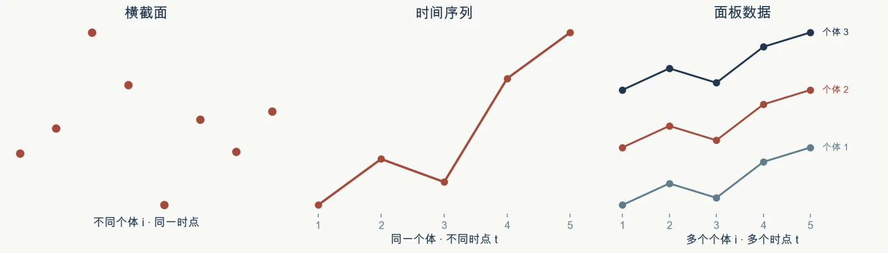
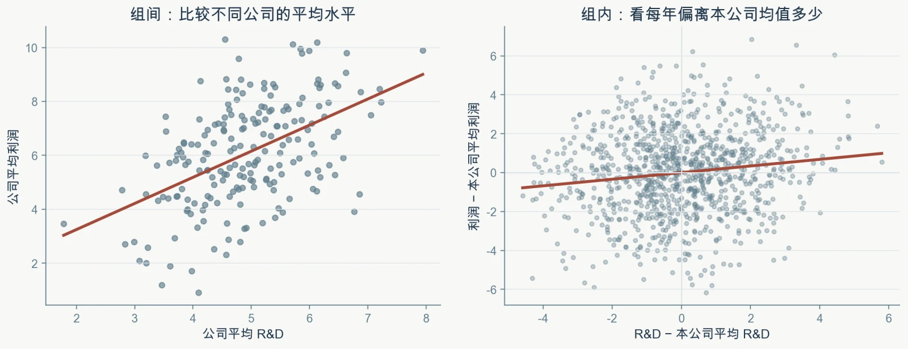
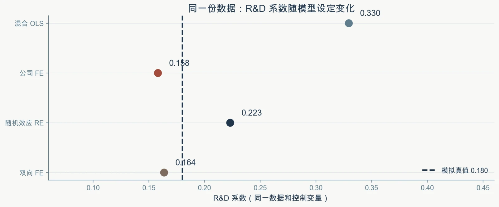

# 第5讲 代码和结果分析

> 本页是“案例实操”的参考分析。请先自己跑完脚本、写完判断，再使用本页核对。本页一切数字均来自教学用合成数据，不代表现实中研发投入对企业利润的作用。

## 使用说明

- 数据由脚本自动生成：**200 家公司 × 5 年 = 1000 个观测**，平衡面板，随机种子 `20250715`；
- Stata 与 Python 起始脚本生成同一份数据、跑同一组模型，结果应当一致；
- 数据里的 `alpha_i` 与 `gamma_t` 两列是**模拟设定的真值**，真实研究里看不到；
- 脚本用企业层面的聚类稳健标准误报告推断，本页只列出系数，便于与你自己跑出的结果逐项对照。

## 主脚本对照

| 软件 | 主脚本 | 输入数据 | 输出 |
|---|---|---|---|
| Stata | `01_panel_fe_re.do` | 脚本内生成 | 系数对照、三种 FE 方法、Hausman、双向 FE |
| Python | `01_panel_fe_re.py` | 脚本内生成 | 同上，结果另存到同级 `output/` 的 CSV |

Python 运行方式：

```bash
python 01_panel_fe_re.py
```

## 数据生成逻辑

这份数据特意设计成“混合 OLS 会高估”的教学情形：

- 利润按 `profit = 2 + 0.18×RD + 0.04×assets − 0.03×debt + alpha_i + gamma_t + u` 生成，**研发系数的真值是 0.18**；
- 企业固定效应 `alpha_i` 与研发投入**正相关**——创新文化强的公司长期更愿意投资研发，利润的基准水平也更高；
- 年份效应 `gamma_t` 对所有公司共同作用，取值从 −0.30 逐年升到 +0.30。

因此混合 OLS 会把“企业本来就强”错算成“研发的功劳”。真值 0.18 是模拟数据独有的参照物，**真实研究里没有这条线**。

{fig-alt="横截面、时间序列与面板数据：面板数据同时具有个体与时间两个维度"}

图7-1　横截面、时间序列与面板数据：面板数据同时具有个体与时间两个维度

## 任务1 参考结果：混合 OLS 与固定效应

| 变量 | 混合 OLS | 公司固定效应 |
|---|---:|---:|
| `RD`（研发投入） | 0.32951 | 0.15813 |
| `assets`（总资产） | 0.03886 | 0.03884 |
| `debt`（负债率） | −0.03188 | −0.03403 |

研发系数从 0.330 降到 0.158，接近真值 0.18 但仍有差距。这个下降说明：**混合 OLS 里有相当一部分是“企业本来就不同”，被错记成了研发的作用**。

但要同时注意另一件事：固定效应并没有给出 0.18。它排掉了长期不变的企业差异，但排不掉逐年变化的因素，所以仍有偏差——固定效应减少了偏误，不是消灭了偏误。

{fig-alt="组间比较（左）与组内比较（右）：固定效应只使用后者"}

图7-2　组间比较（左）与组内比较（右）：固定效应只使用后者

## 任务2 参考结果：三种 FE 方法

| 方法 | 研发系数 |
|---|---:|
| 组内去心法（Within） | 0.158132 |
| LSDV 法（企业虚拟变量） | 0.158132 |
| 一阶差分法（FD） | 0.136466 |

**组内去心与 LSDV 完全一致**——这不是巧合，而是因为两者是同一模型的两种写法：给每家企业一个自己的截距，与把每家企业的均值减掉，做的是同一件事。

**一阶差分明显不同（0.136 vs 0.158）**。原因不在于谁算错了：差分只用相邻两年之间的变化，丢掉了第一年的水平信息；组内去心则用每家企业全部年份相对自己均值的偏离。**两者利用的信息不同，多期时结果本来就不必相同。**

## 任务3 参考结果：随机效应与 Hausman 检验

| 变量 | 固定效应 | 随机效应 |
|---|---:|---:|
| `RD` | 0.15813 | 0.22302 |
| `assets` | 0.03884 | 0.03891 |
| `debt` | −0.03403 | −0.03332 |

随机效应的研发系数（0.223）明显高于固定效应（0.158）。原因在于，随机效应把“企业之间的长期差异”也当作信息用了进来，而这批数据里恰好是长期研发水平高的企业利润也高。

**重要的是：这不能证明随机效应更好或更差**，只能说明它用了一部分固定效应刻意舍弃的信息，而这份信息在本数据里不可信。

Hausman 检验的参考结果：

| 检验统计量 | p 值 |
|---:|---:|
| 58.0201 | < 0.001 |

原假设是“随机效应与固定效应一致”（即随机效应的附加条件成立）。本例拒绝原假设。**但请把结论停在这里**：拒绝只说明“两组系数的差异不易用抽样波动解释”，不等于“必须选固定效应”，更不能替代研究设计上的判断。

{fig-alt="固定效应与随机效应的研发系数差异：Hausman 检验比较的是整组系数，而不是星号"}

图7-3　固定效应与随机效应的研发系数差异：Hausman 检验比较的是整组系数，而不是星号

## 任务4 参考结果：双向固定效应

| 变量 | 混合 OLS | 单向 FE | 双向 FE |
|---|---:|---:|---:|
| `RD` | 0.32951 | 0.15813 | 0.16368 |
| `assets` | 0.03886 | 0.03884 | 0.03924 |
| `debt` | −0.03188 | −0.03403 | −0.03420 |

加入年份固定效应后，研发系数从 0.158 变为 0.164，变化不大。这说明本数据里**年份冲击与研发投入的关联较弱**，省略年份效应没有造成明显偏误。

注意：这个结论是这批数据特有的。换一份数据，两者完全可能差很多。**不能因为这里变化小，就认为做研究时不用考虑年份效应。**

## 四模型汇总

| 模型 | 研发系数 |
|---|---:|
| 混合 OLS | 0.32951 |
| 公司固定效应 | 0.15813 |
| 随机效应 | 0.22302 |
| 双向固定效应 | 0.16368 |
| *（模拟真值）* | *0.18* |

{fig-alt="同一模拟数据、同一组控制变量下，四个模型估出的研发系数"}

图7-4　同一模拟数据、同一组控制变量下，四个模型估出的研发系数

四个数字的排序本身就是一份小结：混合 OLS 离真值最远，固定效应与双向固定效应最接近，随机效应居中。更该记住的是它们**各自在比较什么**，而不是记住哪个数字更大。

## 最终解释示例

> 在一份 200 家公司、5 年期的合成面板数据中，研发投入与利润显著正相关。把所有观测混在一起回归，研发系数为 0.330；加入企业固定效应后降到 0.158，接近数据生成时设定的真值 0.18。这一下降说明，混合 OLS 的结果中包含大量“企业本来就不同”的成分——数据生成时特意让企业长期特质与研发正向关联，用来模拟现实中“创新能力强的公司研发多、利润也高”的情形。
>
> 组内去心与 LSDV 给出完全相同的系数（0.158132），印证了两者是同一模型的两种写法；多期一阶差分给出 0.136，与两者不同，因为它只利用相邻两年的变化。随机效应的系数为 0.223，高于固定效应，因为它额外使用了企业之间的长期差异，而这批数据恰恰不支持这份信息——Hausman 检验拒绝了两者一致的原假设（检验统计量 58.02，p<0.001）。加入年份固定效应后系数为 0.164，与单向固定效应接近。
>
> 需要强调的是：以上结论全部建立在教学用合成数据之上。真实研究中既没有“真值 0.18”这条参照线，也不能仅凭一次检验决定用哪个模型——模型选择应当先回答“关键变量的变异来自哪里、长期特质与解释变量是否相关”，再考虑诊断证据。

## 最后核对

1. 是否把混合 OLS 的系数直接解释为“研发提高了多少利润”？
2. 是否能说清每个系数来自企业之间还是比较企业内部？
3. 是否把 LSDV 与组内去心当成两个不同的模型？
4. 是否把多期一阶差分的差异说成“其中一个算错了”？
5. 是否用一张普通模型对比表冒充 Hausman 检验？
6. 是否在检验之前就已经有了自己的判断？
7. 是否把合成数据的结论说成了对现实企业的结论？

[返回第5讲案例实操](https://zhang-chenglei.github.io/Econometrics-course/course/lesson5_lab.html)
