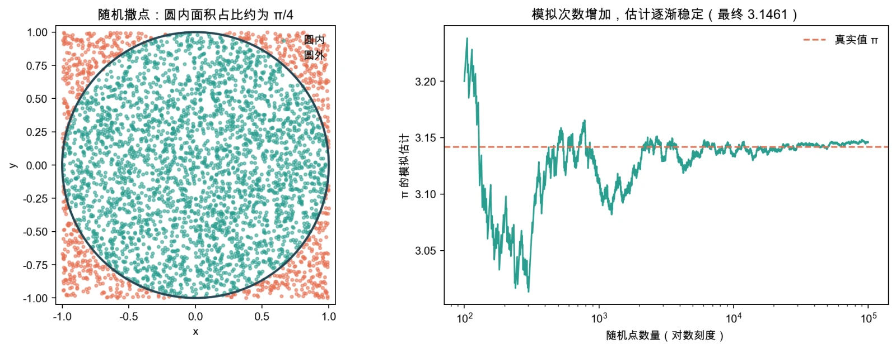
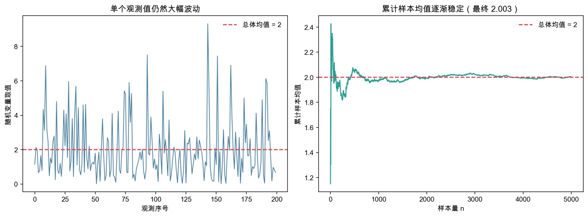
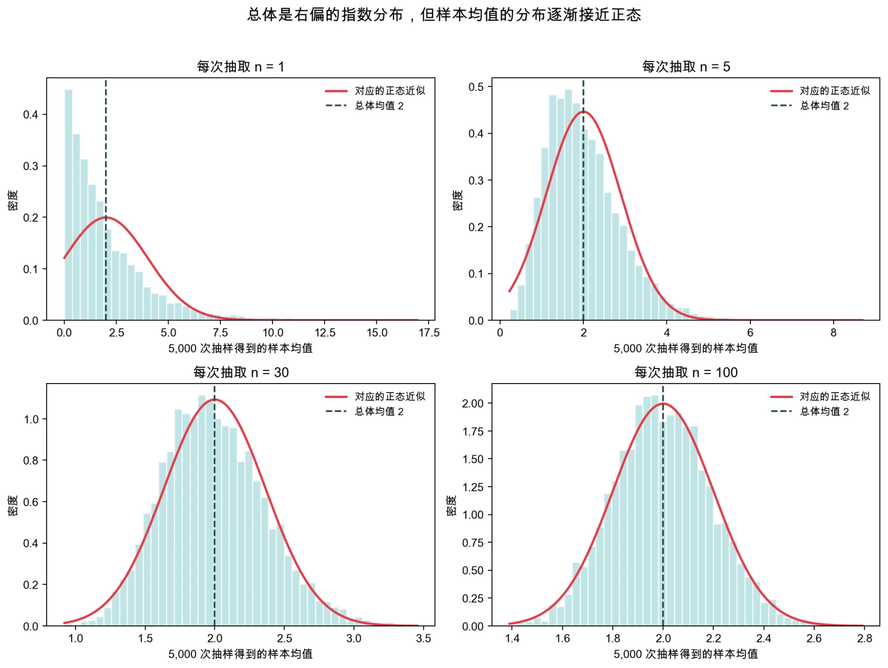
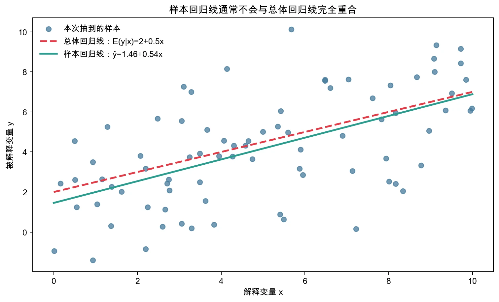
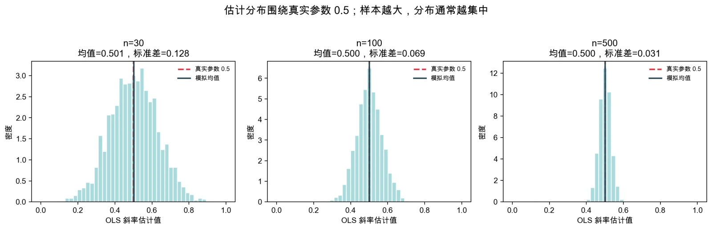
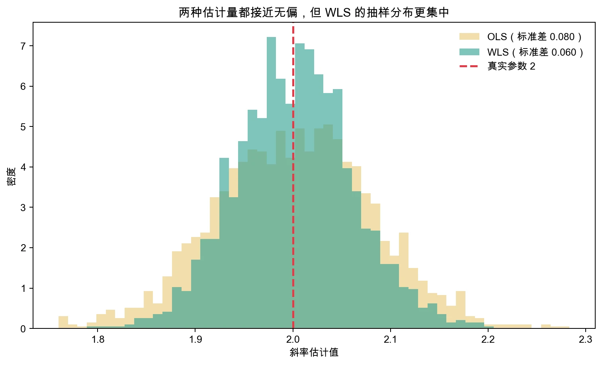
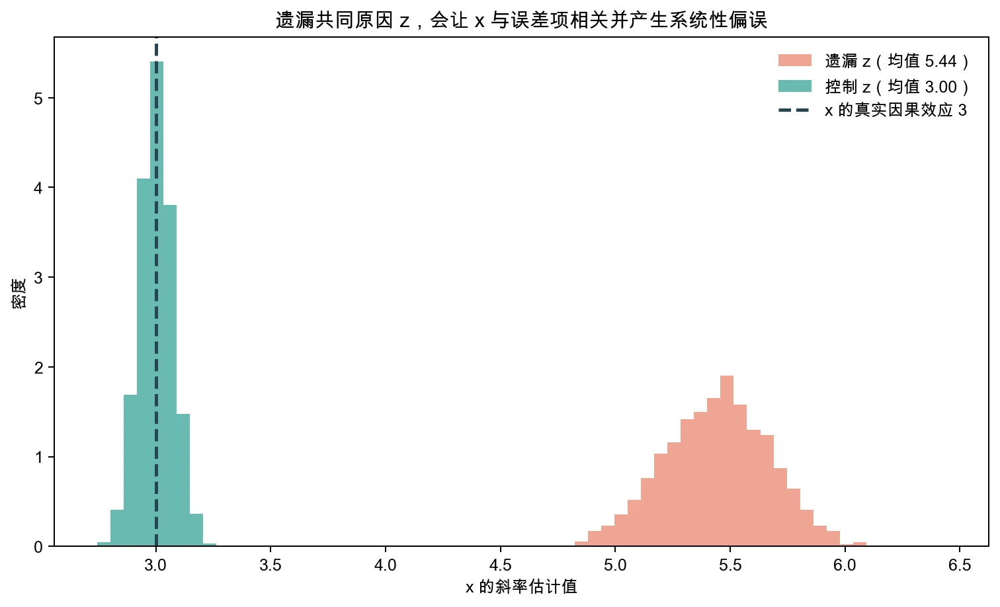

# 专题讲义：用蒙特卡洛模拟看懂计量经济学

> 这是一份面向初学者的自学讲义。你不需要先掌握复杂的概率论，也不需要一开始就看懂全部代码。先理解“我们设计了一个怎样的世界”，再观察“重复抽样后发生了什么”，最后尝试修改一个参数，就已经完成了一次有效的计量学习。

## 为什么值得学习蒙特卡洛模拟

计量经济学里有不少概念很难只靠一句定义真正理解。例如：

- 为什么样本均值会逐渐稳定？
- 一个明显右偏的变量，其样本均值为什么可能接近正态分布？
- “OLS 无偏”为什么不等于每一次估计都等于真实值？
- 两个估计量都无偏时，怎样理解其中一个更“有效”？
- 遗漏一个变量，为什么会让解释变量与误差项相关？

现实数据通常只让我们看到一次结果，而且真实参数未知。蒙特卡洛模拟则允许我们建立一个透明的“虚拟世界”：真实参数由我们设定，数据怎样生成也由我们决定，然后让计算机反复抽样、反复估计。原本看不见的抽样分布、偏误和精确性，因此可以直接画出来。

这份讲义分为三个部分：

1. **认识蒙特卡洛模拟**：它是什么，能做什么，又不能替我们做什么；
2. **学会生成数据**：怎样把一个统计或计量假设写成可重复的虚拟数据；
3. **用图形理解计量概念**：依次观察大数定律、中心极限定理、总体与样本回归、无偏性、有效性和遗漏变量偏误。

完整 Python 文件位于课程代码目录：

> `code/python/monte_carlo/monte_carlo_visualization.py`

脚本已经完整运行验证。一次运行会生成 7 张图和 1 个数值汇总文件，保存在脚本旁的 `output` 文件夹中。

---

## 第一部分：什么是蒙特卡洛模拟

### 1. 从一个“已知答案”的问题开始

假设在边长为 2 的正方形中画一个半径为 1 的圆，再向正方形中随机撒点。落在圆内的概率等于圆面积与正方形面积之比：

> 圆内概率 = π × 1² / 2² = π / 4

如果随机撒出很多点，圆内点所占的比例就可以帮助我们估计 π：

> π 的模拟估计 = 4 × 圆内点数 / 全部点数

下面的实验使用 100,000 个随机点，得到的估计约为 3.1461。它不比数学公式更适合计算圆周率，但非常适合展示蒙特卡洛方法的基本思想：**把一个问题转化为可重复的随机试验，再用大量重复结果逼近我们关心的量。**



核心 Python 代码只有几行：

```python
import numpy as np

rng = np.random.default_rng(20260906)
n_points = 100_000
x = rng.uniform(-1, 1, n_points)
y = rng.uniform(-1, 1, n_points)

inside = x**2 + y**2 <= 1
pi_hat = 4 * inside.mean()
print(pi_hat)
```

不要急着研究每个函数。先读懂这段代码表达的动作：

1. 在 `[-1, 1]` 中随机生成横坐标和纵坐标；
2. 判断每个点是否满足 `x² + y² ≤ 1`；
3. 计算圆内点的比例；
4. 用这个比例估计 π。

### 2. 蒙特卡洛模拟的六个基本步骤

计量经济学中的模拟通常遵循同一条流程：

> **设定数据生成过程 → 生成一个样本 → 使用某种方法估计 → 重复很多次 → 收集估计结果 → 统计和可视化**

其中，“数据生成过程”常写作 DGP，即 Data Generating Process。它是对“这个虚拟世界中的数据如何产生”的完整说明。

例如，我们可以设定：

> y = 2 + 0.5x + u，其中 x 从均匀分布中生成，u 从均值为 0 的正态分布中生成。

在这个虚拟世界里，真实截距是 2，真实斜率是 0.5。每生成一份样本，都会因为随机误差不同而得到略有差异的回归系数。把这个过程重复 2,000 次，我们就能观察斜率估计量的抽样分布。

### 3. 四个必须分清的设置

运行模拟前，先认清四个角色：

- **真实参数**：虚拟世界中由研究者设定的答案，例如 `β = 0.5`；
- **样本量 `n`**：每一次实验中有多少个观测；
- **重复次数 `repetitions`**：一共重新生成多少份样本；
- **随机种子 `seed`**：让同一段随机实验可以被他人复现的编号。

样本量与重复次数不是一回事。增大 `n`，通常会改变每一次估计的精确程度；增大 `repetitions`，主要让我们更稳定地看清估计量的抽样分布。

固定随机种子也不会让数据“更随机”或“更真实”。它只是让教师、学生和 AI 再次运行时得到同一组伪随机数，便于核对与排错。

### 4. 它能做什么，不能做什么

蒙特卡洛模拟特别适合：

- 把抽样分布、偏误、方差和收敛过程画出来；
- 检查某种估计方法在特定条件下是否表现良好；
- 比较不同样本量、噪声强度或模型设定的影响；
- 构造反例，发现一句计量结论依赖哪些条件；
- 验证自己的程序是否按预期工作。

但它不能：

- 证明现实世界真的遵循我们设定的 DGP；
- 自动解决反向因果、遗漏变量和选择偏误；
- 把不可信的识别假设变成事实；
- 代替真实数据分析和制度背景判断。

因此，更准确的说法是：

> 蒙特卡洛模拟展示“一种方法在我们设定的世界里会怎样表现”，而不是直接证明“现实世界就是这样”。

---

## 第二部分：怎样灵活生成数据

### 1. 先准备最小运行环境

本讲使用 Python 3.9 或更高版本，以及 NumPy、Pandas、Matplotlib 和 Statsmodels。尚未安装依赖时，可以在终端中运行：

```bash
python3 -m pip install numpy pandas matplotlib statsmodels
```

Windows 中如果无法识别 `python3`，把命令开头改成 `python` 即可。

然后在 VS Code 中打开完整脚本。脚本用 `# %%` 分成多个区块，可以逐节运行，也可以从头到尾运行。第一次使用时，建议按下面的顺序：

1. 先运行“环境与通用设置”；
2. 每次只运行一个案例；
3. 对照输出图形和讲义中的“观察重点”；
4. 最后只修改一个参数再运行一次。

如果希望一次生成全部结果，请先在终端进入解压后的课程资料根目录，再运行：

```bash
python3 code/python/monte_carlo/monte_carlo_visualization.py
```

运行结束后，到脚本旁的 `output` 文件夹查看图片与汇总结果。教师发放课程代码包时会包含完整脚本；本页的“核心代码”主要用于帮助阅读，不代替完整文件。

### 2. 随机数不是随便编数据

模拟数据要服务于一个明确的问题。不同分布代表不同的虚拟总体：

```python
import numpy as np

rng = np.random.default_rng(20260906)

normal_x = rng.normal(loc=0, scale=1, size=1000)       # 对称的正态分布
uniform_x = rng.uniform(low=0, high=10, size=1000)    # 0 到 10 之间均匀取值
skewed_x = rng.exponential(scale=2, size=1000)        # 右偏的指数分布
binary_x = rng.binomial(n=1, p=0.4, size=1000)        # 取 0 或 1 的二元变量
```

这里最重要的三个参数是：

- `loc`：正态分布的均值；
- `scale`：分布的尺度；对正态分布是标准差，对指数分布是均值；
- `size`：生成多少个观测。

代码能够运行并不意味着设定合理。把工资设为正态分布，可能生成负工资；把受教育年限设为任意连续数，也可能失去现实含义。模拟时仍然要说明变量代表什么，取值范围是否合理。

### 3. 把变量之间的关系写进 DGP

计量模拟的关键不是分别生成几个变量，而是设计它们之间的关系。

**生成一条线性关系：**

```python
n = 200
x = rng.uniform(0, 10, n)
u = rng.normal(0, 2, n)
y = 2 + 0.5 * x + u
```

这里的 `0.5` 是 `x` 对 `y` 的真实斜率，`u` 让同一个 `x` 对应的 `y` 不会完全相同。

要让 OLS 对斜率的估计在重复抽样中对准真值，一个关键条件是零条件期望：

> `E(u|x)=0`：给定任何一个 `x`，误差项的平均值都为 0；换句话说，误差不会系统性地随 `x` 偏正或偏负。

异方差会让误差的波动大小随 `x` 变化，但不一定改变误差的条件均值；遗漏了同时影响 `x` 和 `y` 的因素，则可能直接破坏这个条件。

**生成相关的两个解释因素：**

```python
z = rng.normal(size=n)
v = rng.normal(size=n)
x = 0.8 * z + v
```

因为 `x` 中包含 `z`，所以二者相关。系数 `0.8` 越大，这种联系通常越强。

**生成异方差：**

```python
x = rng.uniform(0, 10, n)
sigma = 0.5 + 0.3 * x
u = sigma * rng.normal(size=n)
```

这里误差项的波动大小会随 `x` 增加。`x` 越大，`sigma` 越大，散点图往往越像逐渐张开的喇叭。

**生成由遗漏变量引起的内生性：**

```python
z = rng.normal(size=n)
x = 0.8 * z + rng.normal(size=n)
y = 2 + 3 * x + 5 * z + rng.normal(size=n)
```

`z` 同时影响 `x` 和 `y`。如果分析时把 `z` 从回归模型中漏掉，它的影响就进入误差项；而 `x` 又与 `z` 相关，于是 `x` 与误差项相关，零条件期望被破坏。

### 4. 最有效的学习方法：每次只改一个条件

如果同时修改分布、样本量、参数、误差大小和模型，结果变了却很难知道原因。初学阶段应当遵循：

> **一次只改变一个条件，其余设定保持不变。**

例如，研究样本量的作用时，只把 `n=30` 改成 `n=100` 和 `n=500`；研究遗漏变量偏误的方向时，只把 `x = 0.8z + v` 中的 `0.8` 改为 `-0.8`。这就是模拟实验中的“控制变量”思想。

### 5. 第一次读代码时只需认识这些写法

- `params[1]`：回归结果中的第一个斜率系数；`params[0]` 通常是截距；
- `size=(5000, n)`：生成一个有 5,000 行、每行 `n` 个数的二维数组，相当于一次生成 5,000 份样本；
- `mean(axis=1)`：沿着每一行求平均，因此得到 5,000 个样本均值；
- `ddof=1`：按常用的样本标准差公式计算标准差；
- `np.column_stack([x, z])`：把 `x` 和 `z` 并排组成两个解释变量；
- 布尔数组 `inside`：每个位置记录“真”或“假”；求平均时，“真”按 1、“假”按 0 处理。

为让页面上的片段容易读，部分“核心代码”直接使用 Statsmodels 回归。完整脚本在数千次重复循环中对一元回归采用了数学等价、运行更快的斜率公式；两种写法计算的是同一个 OLS 斜率。

---

## 第三部分：用模拟看懂几个核心计量概念

### 案例一：大数定律——平均值为什么会稳定

#### 直觉

单个随机变量可以非常不稳定，但越来越多观测的平均值通常会靠近总体均值。本例故意从右偏的指数分布中抽样，总体均值设为 2。图的左侧显示单个观测仍然忽高忽低；右侧显示累计样本均值逐渐稳定在 2 附近。



#### 核心代码

```python
rng = np.random.default_rng(20260907)
true_mean = 2
sample = rng.exponential(scale=true_mean, size=5000)
running_mean = np.cumsum(sample) / np.arange(1, 5001)
```

#### 观察重点

- 前几十个观测的平均值可能离 2 很远；
- 样本量增加后，累计均值的波动范围整体缩小；
- 新观测仍然可能很大，但它对已有大量观测平均值的影响越来越小。

#### 常见误解

大数定律不是说“数据多了，每一个观测都接近均值”，也不是说样本均值会单调地向真值移动。曲线仍会上下波动，只是偏离总体均值很多的概率逐渐降低。本例使用独立同分布且总体均值有限的数据；不同版本的大数定律有各自条件，不能脱离条件套用。

#### 动手改一处

把样本量从 `5000` 改成 `100`；或把 `true_mean=2` 改成 `true_mean=5`。先写下预测，再运行代码。

---

### 案例二：中心极限定理——为什么样本均值常近似正态

#### 直觉

指数分布明显右偏，并不是正态分布。现在反复进行 5,000 次抽样，每次都计算一个样本均值。图中从 `n=1` 到 `n=100`，我们看到的不是原始数据，而是 5,000 个“样本均值”的分布。



#### 核心代码

```python
repetitions = 5000
n = 30
sample_means = rng.exponential(
    scale=2, size=(repetitions, n)
).mean(axis=1)
```

#### 观察重点

- `n=1` 时，样本均值就是单个观测，分布仍然明显右偏；
- `n=5` 时，右偏减弱；
- `n=30` 和 `n=100` 时，分布越来越接近钟形；
- 样本均值的理论期望为 2，有限次模拟得到的均值通常接近 2；
- 本例中样本均值的理论标准差为 `2/√n`。

图中其实同时发生两件事：直方图的**形状**逐渐接近正态，这是中心极限定理要强调的部分；未标准化样本均值的分布随 `n` 增大而**变窄**，是因为其标准差为 `2/√n`。不要把这两个现象混成一句“数据变正态了”。

#### 与大数定律的区别

- **大数定律**关注一份越来越大的样本中，样本均值是否靠近总体均值；
- **中心极限定理**关注重复抽样时，经过适当标准化的样本均值分布是否趋近正态。

二者都会涉及“大样本”，但回答的问题不同。中心极限定理也需要独立同分布、有限方差或其他相应的正则条件，不能简化为“任何数据只要样本大就一定正态”。

#### 动手改一处

把 `sample_sizes` 中的 `30` 改成 `10`，比较接近正态的速度；或者把重复次数从 5,000 改成 100，观察直方图为什么变得粗糙。

---

### 案例三：总体回归线与样本回归线

#### 直觉

我们设定总体模型：

> y = 2 + 0.5x + u

真实回归线是 `E(y|x)=2+0.5x`。但研究者只能拿到一份含有 80 个观测的样本，因此估计出来的样本回归线通常不会与真实线完全重合。



#### 核心代码

```python
import statsmodels.api as sm

n = 80
x = rng.uniform(0, 10, n)
u = rng.normal(0, 2, n)
y = 2 + 0.5 * x + u

model = sm.OLS(y, sm.add_constant(x)).fit()
print(model.params)
```

#### 观察重点

- 总体参数 `2` 和 `0.5` 是固定但未知的；
- 样本系数会随抽到的样本变化；
- 一次估计偏离真值，不足以说明 OLS 有偏；
- 判断估计量的性质，需要想象或模拟重复抽样。

#### 常见误解

残差小、拟合线贴近样本，并不自动意味着模型找到了真实因果关系。样本拟合、总体推断与因果识别是三个不同层次的问题。

---

### 案例四：无偏性与精确性

#### 直觉

如果一种估计方法无偏，那么在相同 DGP 下反复抽样，估计值有时偏高、有时偏低，但长期平均应等于真实参数。无偏性是对估计量抽样分布的描述，不是对某一次估计的保证。

本例把真实斜率设为 0.5，对每个样本量重复抽样 2,000 次。



#### 已验证的模拟结果

- `n=30`：估计均值约为 0.501，模拟标准差约为 0.128；
- `n=100`：估计均值约为 0.500，模拟标准差约为 0.069；
- `n=500`：估计均值约为 0.500，模拟标准差约为 0.031。

三个分布的模拟均值都很接近真实值 0.5，与 OLS 在这一 DGP 下的理论无偏性相符；样本量增加后分布明显变窄，说明估计更精确。有限次模拟只能直观展示理论性质，不能代替数学证明。

#### 核心代码

```python
beta_hats = []
for r in range(2000):
    x = rng.uniform(0, 10, n)
    u = rng.normal(0, 2, n)
    y = 2 + 0.5 * x + u
    beta_hat = sm.OLS(y, sm.add_constant(x)).fit().params[1]
    beta_hats.append(beta_hat)

print(np.mean(beta_hats), np.std(beta_hats, ddof=1))
```

如果把“估计值偏离真值 0.1 以上”看作一次较大的误差，模拟中这一比例从 `n=30` 时的 44.4%，降到 `n=100` 时的 14.9%，再降到 `n=500` 时的 0.15%。这直观展示了样本量增大后估计值远离真值的概率下降，也是理解一致性的入口。

#### 四个概念不要混淆

- **无偏性**：对固定样本量，估计量在重复抽样中的期望等于真值；
- **精确性**：描述某个估计量自身的抽样方差或标准差有多大；
- **有效性**：在同一条件和给定的比较范围内，比较多个估计量；方差更小者更有效；
- **一致性**：当样本量趋向无穷时，估计量依概率收敛于真值。

一个估计量可以有一点偏误但方差很小，也可以无偏却非常不精确。评价方法时不能只看其中一个指标。

#### 动手改一处

把误差项标准差从 `2` 改为 `5`，观察三个分布怎样变化。想一想：这会主要影响中心位置，还是分布宽度？

---

### 案例五：有效性——同样无偏，谁更稳定

#### 直觉

当误差项存在异方差时，OLS 在零条件期望等条件成立时仍可以无偏，但通常不再是最有效的线性无偏估计量。如果我们恰好知道每个观测的误差方差，就可以给予噪声较小的观测更高权重，使用正确加权的 WLS。

本例设定：

> 误差标准差 σ = 0.5 + 0.3x

经过 2,000 次重复抽样：

- OLS 斜率均值约为 2.002，模拟标准差约为 0.080；
- 正确加权的 WLS 均值约为 2.002，模拟标准差约为 0.060。



#### 核心代码

```python
sigma = 0.5 + 0.3 * x
u = sigma * rng.normal(size=n)
y = 1 + 2 * x + u
design = sm.add_constant(x)

ols = sm.OLS(y, design).fit()
wls = sm.WLS(y, design, weights=1 / sigma**2).fit()
```

#### 观察重点

两种估计量的中心都接近真实参数 2，但 WLS 分布更窄。因此这里的“更有效”不是系数更大、拟合优度更高，也不是每一次都离真值更近，而是它在重复抽样中的方差更小。

代码中的 `sigma` 是误差项的标准差，因此 `sigma**2` 才是误差方差。正确的 WLS 权重与误差方差成反比：噪声越大的观测权重越小，所以这里使用 `1/sigma**2`，而不是 `1/sigma`。

#### 两个重要限定

- 本例的 WLS 之所以表现更好，是因为模拟者知道真实的异方差结构，并使用了正确权重；
- 现实研究中通常不知道真实方差，错误权重未必改善结果。

在本节讨论的异方差问题中，异方差稳健标准误用于修正 OLS 方差与标准误的估计：它通常不改变 OLS 系数，也不把 OLS 变成更有效的估计量。不要把“使用稳健标准误”与“进行加权最小二乘”混为一谈。

#### 动手改一处

把误差设为同方差，即令 `sigma = 2`。再比较 OLS 与 WLS，并解释为什么正确权重此时实际上相同。

---

### 案例六：遗漏变量偏误与内生性

#### 直觉

设 `z` 是一个共同原因：

> x = 0.8z + v

> y = 2 + 3x + 5z + u

在这个虚拟世界中，`x` 对 `y` 的真实因果效应是 3，`z` 同时影响 `x` 和 `y`。如果回归时遗漏 `z`，`5z` 就进入新的误差项；由于 `x` 与 `z` 正相关，`x` 也与新误差项相关，OLS 的零条件期望不再成立。



#### 已验证的模拟结果

- 遗漏 `z` 时，`x` 的斜率估计均值约为 5.44；
- 控制 `z` 后，`x` 的斜率估计均值约为 3.00；
- 增大重复次数只会让我们更清楚地看到偏误，不会让有偏估计自动回到 3。

#### 核心代码

```python
z = rng.normal(size=n)
x = 0.8 * z + rng.normal(size=n)
y = 2 + 3 * x + 5 * z + rng.normal(size=n)

omitted = sm.OLS(y, sm.add_constant(x)).fit()
full = sm.OLS(y, sm.add_constant(np.column_stack([x, z]))).fit()
```

#### 为什么偏误向上

这里 `z` 对 `y` 的影响为正，`z` 与 `x` 的相关关系也为正，因此遗漏 `z` 后，`x` 的系数吸收了 `z` 的一部分正向影响，产生向上偏误。

遗漏变量偏误并不是“漏掉任何变量都会有偏”。在这个一元回归例子中，通常需要同时满足：

1. 被遗漏变量会影响 `y`；
2. 被遗漏变量与已纳入的 `x` 相关。

在多元回归中，更准确的判断是：控制其他已纳入变量后，被遗漏因素仍影响 `y`，并且仍与 `x` 中尚未被其他变量解释的那部分相关。多个遗漏因素的偏误还可能方向相反、彼此抵消，因此仅看最终系数无法判断模型没有遗漏问题。

在模拟中，数据创造者可以看到 `z`；现实研究中的遗漏因素却可能根本无法观测。因此，模拟能够解释偏误机制，却不能自动告诉我们真实研究中究竟遗漏了什么。

#### 动手改一处

把 `x = 0.8z + v` 改为 `x = -0.8z + v`。运行前先判断偏误方向，再用模拟检验自己的判断。

---

### 案例七：把蒙特卡洛模拟变成自己的学习工具

前六个案例不是要记住七张固定图，而是帮助你形成一个可迁移的学习工作流。以后遇到难懂概念时，可以按下面六步提问：

1. **我要理解什么性质？** 是偏误、方差、覆盖率，还是收敛？
2. **真实答案是什么？** 如果真值都没有设定，通常无法判断估计是否有偏；
3. **最简单的 DGP 是什么？** 先从一个解释变量和一个误差项开始；
4. **哪些条件需要比较？** 例如小样本与大样本、外生与内生、同方差与异方差；
5. **重复后保存什么？** 通常保存系数、标准误、p 值或置信区间是否覆盖真值；
6. **用什么图回答问题？** 收敛过程用折线图，抽样分布用直方图，不同方法可叠加比较。

例如，要理解“置信区间的 95% 覆盖率”，可以反复生成样本、每次构造一个 95% 置信区间，再统计其中有多少比例包含真实参数。要理解多重共线性，可以逐步提高两个解释变量之间的相关程度，观察系数标准误如何变化。要理解弱工具变量，可以逐步减弱工具变量对内生解释变量的影响，观察 IV 估计分布是否变得分散。

---

## 完整脚本怎样使用

完整脚本包含以下输出：

- `01_pi_monte_carlo.png`：随机撒点与 π 的收敛；
- `02_law_of_large_numbers.png`：大数定律；
- `03_central_limit_theorem.png`：中心极限定理；
- `04_sample_vs_population_regression.png`：总体与样本回归线；
- `05_ols_unbiased_precision.png`：无偏性与精确性；
- `06_efficiency_ols_wls.png`：OLS 与 WLS 的有效性；
- `07_omitted_variable_bias.png`：遗漏变量偏误；
- `monte_carlo_summary.csv`：中心极限定理、无偏性、有效性和遗漏变量案例的模拟统计汇总。它不保存每一次重复的原始估计值。

如果只想看图，不必先理解所有绘图语句。重点读每个区块中“如何生成数据”和“如何保存估计结果”的代码。图形代码可以暂时交给 AI 解释。

### 一次运行出现问题时

- 提示找不到某个库：重新运行依赖安装命令，并确认 VS Code 使用的是同一个 Python；
- 没有弹出图形：脚本默认把图保存到 `output` 文件夹；把 `SHOW_PLOTS=False` 改为 `True` 才会同时弹出；
- 中文显示为方框：不影响数值结果，可在系统中安装中文字体，或把图题暂时改为英文；
- 每次结果完全相同：这是因为固定了随机种子，属于可复现设计；
- 修改后结果奇怪：先撤回到原始脚本，再一次只修改一个参数。

---

## 如何使用 AI Agent 帮助学习

AI 最适合担任“解释员、代码助手和反例生成器”，但你需要保留对 DGP 和结论的控制权。

可以这样提问：

> 我正在用蒙特卡洛模拟理解大数定律。请逐行解释这段代码，先说每个变量的统计含义，再说它如何对应大数定律。不要改代码。

> 请只把样本量从 100 改为 500，保持其他设置和随机种子不变。运行后比较估计量均值与标准差，并解释变化来自哪里。

> 请检查我的遗漏变量模拟是否同时满足“z 影响 y”与“z 和 x 相关”两个条件。不要只判断代码能否运行。

> 请为这个模拟构造一个反例：改变一个参数，让遗漏变量偏误由向上变为向下，并先解释理论预测。

使用 AI 时至少保留以下记录：

- 你想验证的计量结论；
- 你使用的 DGP 和真实参数；
- AI 修改了哪一处代码；
- 结果是否符合事前预测；
- 如果不符合，你如何排查。

不要只把“生成一张漂亮的图”当作完成任务。真正的学习证据是：你能够说明图中每个对象是什么、变化由哪项设定引起、结论在哪些条件下成立。

---

## 本讲自检

完成学习后，尝试不用看讲义回答：

1. 蒙特卡洛模拟的六个基本步骤是什么？
2. 样本量与模拟重复次数分别影响什么？
3. 固定随机种子的作用是什么？
4. 大数定律与中心极限定理各自关注什么？
5. 为什么“OLS 无偏”不代表每次估计都等于真实参数？
6. 无偏性、精确性、有效性和一致性有什么区别？
7. 本讲中 WLS 为什么比 OLS 更有效？这个结论需要什么限定？
8. 遗漏变量偏误通常需要哪两个条件？
9. 为什么增加模拟次数不能消除遗漏变量偏误？
10. 为什么模拟结果不能直接证明现实中的因果关系？

如果第 4、6、7、8 题能够用自己的话说明，而不是背定义，就已经抓住了本讲的核心。

## 建议完成的最小练习

不需要重新写一套程序，只完成以下三个小修改：

1. 在无偏性案例中把误差标准差从 2 改为 5，解释分布宽度的变化；
2. 在遗漏变量案例中把 `0.8` 改为 `-0.8`，事先判断偏误方向；
3. 自选一个案例，把重复次数从 2,000 降到 100，说明图形为什么变得不稳定。

每个练习只提交三样内容：修改了哪一行、得到什么图、用两三句话解释原因。

## 最后记住

> **蒙特卡洛模拟不是用随机数代替理论，而是把理论条件变成一个看得见、改得动、可反复检验的实验。**

学习计量经济学时，如果一句结论很抽象，可以尝试问：我能否设计一个最简单的 DGP，把真实答案设好，然后让计算机重复给我看？
