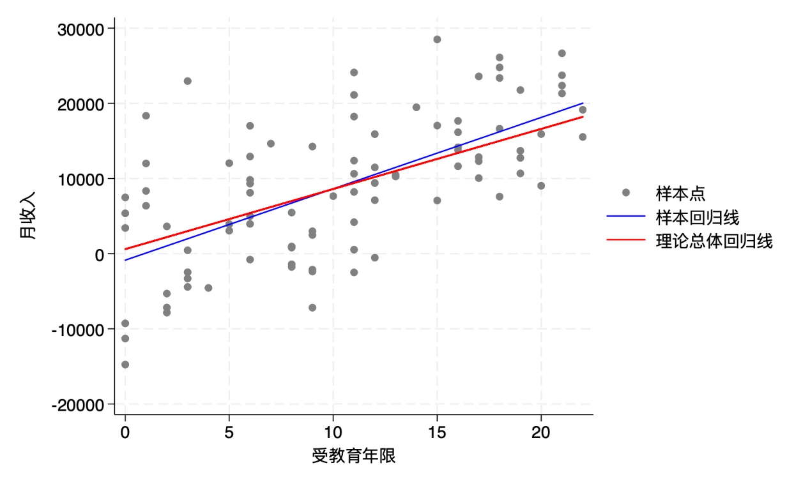

# 零基础补强指南——不用背语法，也能跑通 Stata 和 Python

> 给本科没学过计量、也没用过 Stata 和 Python 的同学。目标不是「先学会计量再来上课」，而是用这套「最小可行基础 + AI 外挂」，让你能跟上正课、跑得动数据。

## 一、先说一句让你安心的话

这门课默认大家「学过一点计量」，所以如果你本科没碰过计量、也没用过 Stata 和 Python，一开始确实会有点懵——**这很正常，不是你不行，只是你的起点和别人不一样。**

但好消息有两条，而且都很实在：

1. **这门课不要求你「会写代码」。** 所有实操都是同一套动作：你在 VSCode 里用 AI 帮你跑，你只说人话、看结果。语法、命令，AI 替你搞定。
2. **你真正要补的，只有两件小事**：搞懂三个概念（回归、参数估计、假设检验），以及会用 AI 跑通两个工具（Stata、Python）。就这么点，下面一件件带你过。

> 记住：**你不是落后，你只是起点不同，而且你手里有一台随时能帮你的「代跑员」。**

## 二、本课程「跑数据」是这套固定动作

先看一张图，这是你以后每一节课、每一次作业都要做的同一件事：

```
 ┌──────────┐   你说人话   ┌────────────────┐    调用    ┌──────────────┐
 │    你     │ ──────────▶ │  AI（Claude Code）│ ────────▶ │  Stata / Python │
 │ 在 VSCode │             │     你的代跑员    │           │  你电脑里已装好  │
 └──────────┘ ◀────────── └────────────────┘ ◀──────── └──────────────┘
   看结果、追问         用人话讲结果、画图           跑出结果（系数、表格、图）
```

- 你**不用**打开 Stata 的软件界面，也**不用**背 Python 语法。
- 你要做的只有两步：**① 把任务用人话说清楚；② 看懂 AI 还回来的结果。**

所以，这门课真正要练的「技能」不是编程，而是**「会下指令」+「会读结果」**。

## 三、先补三个概念（就这三个，按顺序，别的先不急）

这三个概念是一条链子，一步接一步：

> **回归**（画一条线描述关系）→ **参数估计**（算出这条线的斜率）→ **假设检验**（判断这斜率靠不靠谱）

### 概念 1｜什么是回归？—— 给数据画一条「最能代表」的线

**一句话**：回归就是**用一条直线，概括「X 变的时候，Y 平均会怎么变」**。

比如你想知道「多读一年书，工资平均高多少」。把每个人的「教育年限 X」和「工资 Y」画成散点，会发现点大致沿一个方向走——回归就是给这堆散点，画一条**最贴合的直线**。

这条线写成：

> **工资 = β₀ + β₁ × 教育年限 + u**

- **β₀（截距）**：这条线的起点；
- **β₁（斜率）**：**教育每多一年，工资平均涨多少**——这是我们最想知道的数；
- **u（误差项）**：所有其他没写进模型的因素（能力、行业、运气……）。


*图：回归线是散点的「折中」（教材第 1 章小黑插画）*

> **记住**：回归 = 给散点画一条「折中」的线，**β₁ 就是这条线的斜率**。

### 概念 2｜什么是参数估计？—— 用「一勺样本」猜「整锅汤」

**问题**：β₁ 到底是多少？现实里我们**看不到**「全社会的真实关系」（就像你不知道全校所有人的真实平均身高），只能抽一个样本去「猜」。

- **参数** = 总体里「真正」的那个 β₁（永远看不到，是靶心）；
- **估计** = 用手里这「一勺样本」，把 β₁ 估出来，记作 **β̂₁**（读「贝塔帽」）；
- **方法** = **最小二乘法（OLS）**：在所有可能的直线里，找一条让「每个点到线的距离（残差）平方和最小」的。



*图：总体回归线 vs 样本回归线（教材第 1 章）——虚线是「真实」那条线，实线是「你估出来」的那条，两者不完全重合，这是正常的*

**打靶比喻**（教材原图）：靶心 = 真实 β₁；每抽一次样本估一次 = 打一发子弹。**好的估计方法 = 平均打在靶心上**（这叫「无偏」），虽然单发会偏一点。

> **记住**：参数估计 = 用样本「猜」总体，方法叫 **OLS**；估出来的是 **β̂**（不是真值），但「平均」能猜准。

### 概念 3｜什么是假设检验？—— 判断「这数靠不靠谱」

**问题**：你估出 β̂₁ = 0.08，但这个数「靠谱」吗？会不会只是这一勺样本**碰巧**？

思路像法官断案：

1. 先「假设」：**X 对 Y 没影响**（即 β₁ = 0）；
2. 再看：**如果这个假设成立，出现现在这么明显的结果，概率有多大**——这个概率叫 **p 值**；
3. **p 值很小**（通常以 0.05 为线）→ 「没影响」这个假设很难站住 → 说明**这个效应大概率是真的**，叫「**显著**」。

中间有个关键量叫 **t 值**，它 = **信号 ÷ 噪声**：

> t = 系数 ÷ 标准误（「系数有多大」÷「误差有多大」）


*图：t 检验 = 信号 vs 噪声（教材第 3 章小黑插画）*

> **记住**：假设检验 = 判断「这数是不是**真不为 0**、不是碰巧」；**p 值小 = 靠谱**。

### 附：会读一张回归表（三个概念最终都落在这张表上）

AI 帮你跑完回归，通常会给你一张像这样的表（数字是编的示例）：

| 变量 | 系数 Coef. | 标准误 Std.Err. | t 值 | p 值 P>\|t\| |
|------|-----------|----------------|------|-------------|
| 教育年限 | 0.08 | 0.02 | 4.0 | 0.000 |
| _cons（截距） | 2.50 | 0.30 | 8.3 | 0.000 |

你只需抓住两处，就能对上前面三个概念：

- **系数 0.08**：这是「参数估计」估出来的 β̂（概念 2）；含义是「教育每多一年，工资平均高 0.08」（概念 1）。
- **p 值 0.000 < 0.05**：这是「假设检验」的结论——「教育对工资没影响」这个假设几乎不可能成立，所以**显著**（概念 3）。

> 看到这里就够了。**能认出「系数」和「p 值」，你就已经能读懂这门课大部分回归结果了。**

## 四、在 VSCode 里让 AI 帮你跑

### 你的工作台长这样

打开 VSCode，在侧边栏点开 **Claude Code 插件**，展开它的**对话面板**——这就是你的 AI 代跑员。它**已经能连上你电脑里的 Stata 和 Python**，你在面板里跟它说人话，它帮你跑。

### 三个指令模板（照着改就能用）

**① 先看看数据里有什么：**

> 帮我读一下 `wage_data.dta` 这个文件，告诉我里面有哪些变量，再给每个变量做个描述统计（均值、最大最小值）。

**② 跑一个回归：**

> 用 Stata 跑一个回归：`wage` 是被解释变量，`education` 是解释变量。把结果表贴出来，然后用大白话给我解释每个数字是什么意思。

**③ 让 Python 也跑一遍，做对比：**

> 用 Python 做和刚才 Stata 一模一样的事，跑同一个回归，让我看到两个工具的结果是一致的。

### 怎么读 AI 还给你的结果

AI 跑完会给你两样东西：**一段结果（表格/数字）** + **一段人话解释**。

- 结果表 → 用第三节的「系数 + p 值」去对。
- 解释没听懂 → **直接追问**：「系数 0.08 是什么意思？」「p 值为什么这么小？」「标准误是干嘛的？」——它会一直讲到你会为止。

> 三个模板里最值钱的是**「追问」的习惯**：AI 不是跑完就完，它是你的免费家教。

## 五、两个最小任务，跑通就算过关

两个都做一遍，都能跑出结果并看懂，你就和「有基础」的同学站在同一条线上了。

### 任务 A：走一遍 Stata

在 VSCode 里对 AI 下指令（用第四节模板 ① + ②），完成：

1. 读入一个 `.dta` 数据；
2. 看它的变量和描述统计；
3. 跑一个最简单的回归；
4. 从结果里读出**系数**和**p 值**，并说一句「这个系数是什么意思」。

### 任务 B：走一遍 Python

同样对 AI 下指令（用模板 ③），让它用 Python 把任务 A 的回归**再跑一遍**，确认两个工具出来的系数基本一样。

## 六、一张自检清单

对照这四条，都打勾，你的「补强」就完成了：

- [ ] 我能用自己的话说出「回归」是干嘛的（画一条线描述 X 和 Y 的平均关系）。
- [ ] 我能说清「参数估计」和「假设检验」大概是什么。
- [ ] 我能在 VSCode 里让 AI 跑通 Stata，并从结果里读出「系数」和「p 值」。
- [ ] 我能让 AI 用 Python 再跑一遍，看到结果和 Stata 一致。

## 七、接下来

到这里，你已经具备这门课最底层的那套「跑数据」能力了。**后面的每一讲，都是在「跑回归」这个动作上，一步步加新方法**——你每次只需比现在多问 AI 一个新问题而已。

遇到任何卡住的地方，回到第四节那套动作：**说清任务 → 看结果 → 追问**。别自己憋着，AI 随时在。
