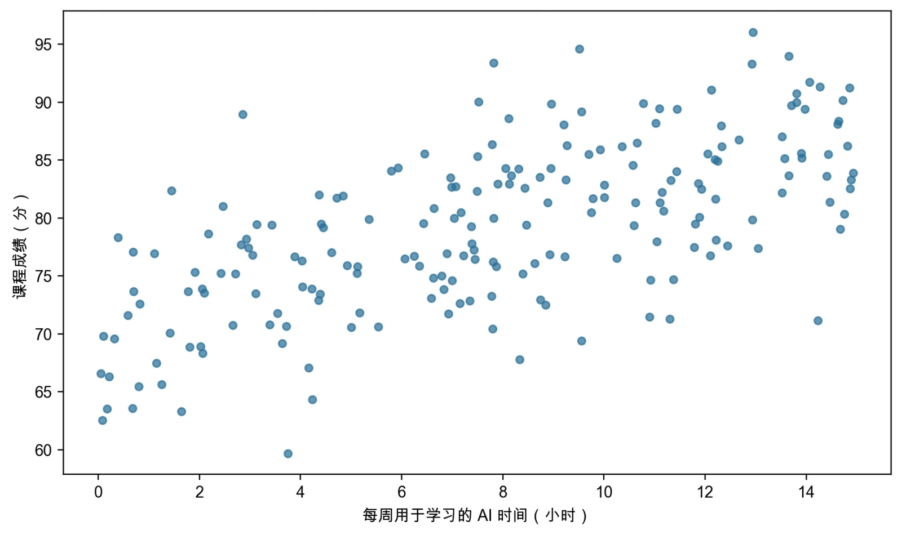
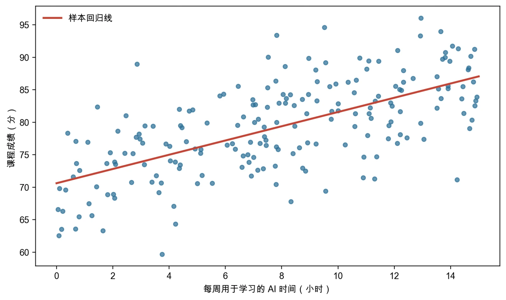
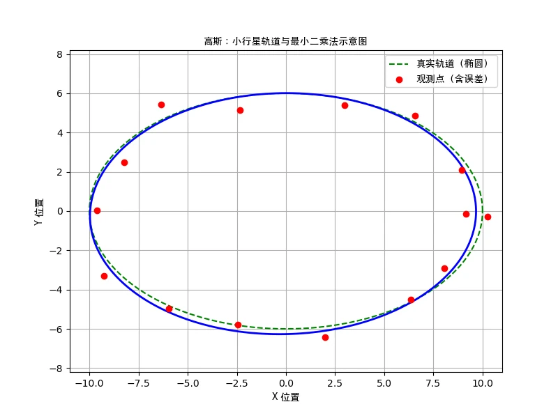
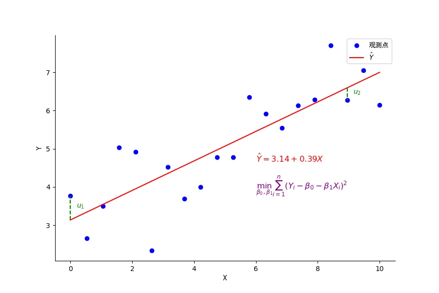
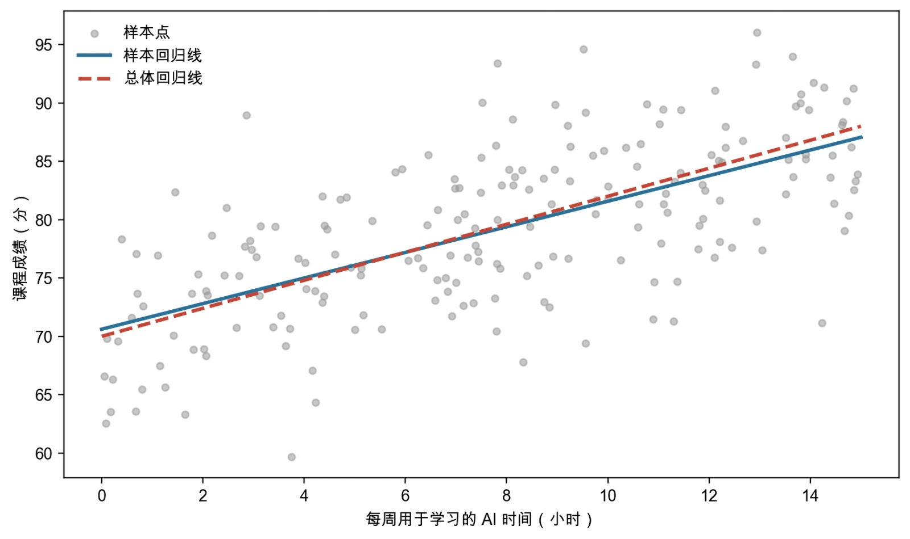
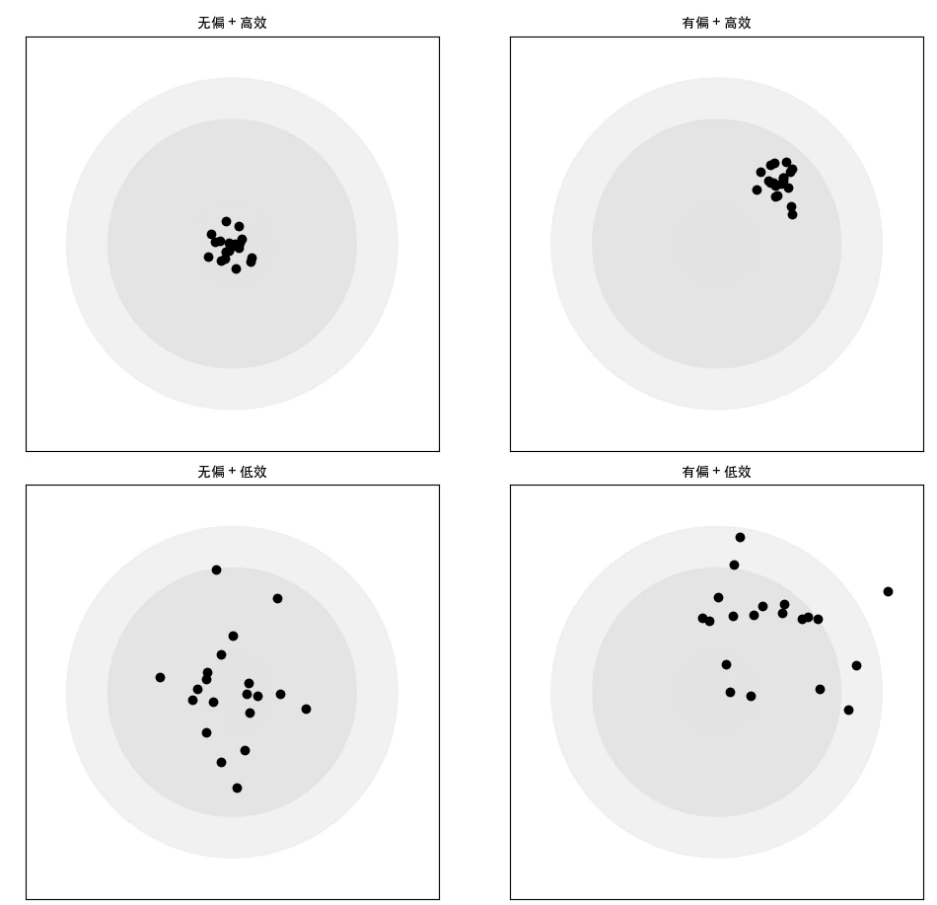
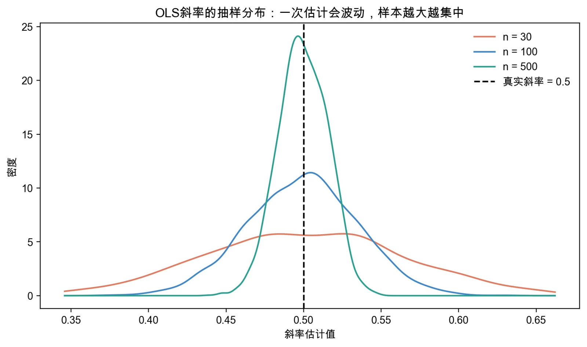

# 第1章 一元线性回归：估计

> “有些人一听到统计这个词就厌烦，但我却发现统计充满美感与趣味。”
>
> ——弗朗西斯·高尔顿（Francis Galton）

回归分析是理解经济社会数据的基础工具。它既可以用来描述变量之间的平均关系，也可以服务于预测；只有在额外的识别假设和研究设计成立时，回归系数才可以进一步解释为因果效应。一元线性回归是这套工具箱中最简洁的起点。为什么从一元回归开始？因为它只问一个问题：当X不同时，Y平均相差多少？例如，每周用于学习的 AI 时间更长的学生，课程成绩平均高多少。一条回归线不能解释成绩的全部差异，却能让我们先看清“斜率、截距、拟合值和残差”这些最基本的概念。本章围绕三个问题展开：什么是回归？怎样用OLS估计总体参数？在什么条件下OLS具有良好的统计性质？前三节依次回答这三个问题，最后用课程库原有的蒙特卡洛案例把样本回归线、重复抽样、无偏性和估计精度连在一起。正文保留理解结论所需的公式，但不要求推导证明。

## 1.1 什么是回归？

我们生活在一个错综复杂的社会经济环境中，各种现象之间存在着千丝万缕的联系。每周用于学习的 AI 时间与课程成绩之间存在怎样的关系？医疗资源投入如何影响人民健康水平？人工智能发展对就业有什么影响？这些问题的探讨都离不开对变量之间关系的深入研究。计量经济学帮助我们把经济问题转化为可用数据分析的模型。它把经济理论、统计方法和现实数据结合起来，既研究描述、预测和关联，也在适当的研究设计下探索因果问题。它与统计学有大量共同基础，特别关注经济理论、制度背景和数据生成过程对结果解释的约束。想象这样一个现实问题：到底什么因素决定了学生的成绩？我们可能会问：每周多用一小时 AI 学习工具，学生的课程成绩平均会提高多少？原有的学习基础对成绩有多重要？重点大学与普通院校的学生，成绩差异有多大？这个问题很重要也很复杂。

现实世界中的关系往往是多维度、多层次的。一名学生的成绩不仅受 AI 使用时间影响，还受到认知能力、非认知能力、学习基础、专业特点、家庭环境等多重因素的作用。为了进行有效的分析，像大多数学科一样，我们一开始从最简单的问题出发，进行假设和抽象，找出最重要的（或者我们目前最关心的）因素进行探究。即暂时专注于两个关键变量之间的关系，将复杂现实简化为可分析的模型。这种简化思维是科学研究的基础，也是我们学习计量经济学的起点。以成绩的决定因素为例，我们先考察 AI 使用时间与课程成绩之间的关系。当我们开始研究两个变量之间的关系时，我们可能首先想到的是统计学中学到过的相关关系，计算他们之间的相关系数，从而判断变量之间是否有关联以及是何种关联。相关分析主要关注两个变量之间的关联强度和方向。

它告诉我们这两个变量是如何共同变化的：是同时增加或减少，还是一个增加时另一个减少。相关系数的大小反映了这种关联的强弱，其正负号则指示了关联的方向。但相关分析有一个重要特点：它是对称的。也就是说，AI 使用时间与课程成绩的相关性等同于课程成绩与 AI 使用时间的相关性，它不区分哪个是原因、哪个是结果。回归分析进一步指定了被解释变量和解释变量，建立一个有方向的统计模型。在回归分析中，我们指定课程成绩为被解释变量（想要解释或预测的变量），每周用于学习的 AI 时间为解释变量。这里的方向首先是建模方向，并不自动等于因果方向。模型可以回答：在样本中，AI 使用时间相差一小时时，成绩平均相差多少？下面通过 AI 使用与课程成绩的例子来体会这种区别。

相关系数可以量化两个变量线性关联的方向和强度，但没有原始单位，也不能直接回答“AI 使用时间增加一小时时，成绩平均相差多少”。回归系数则可以用变量的单位表达这种条件平均关系；若被解释变量取对数，估计值还可以近似转化为百分比变化。需要特别强调的是，虽然回归分析建立了有方向的关系模型，但统计关系本身并不等同于因果关系。确立因果关系需要理论支撑、更严密的研究设计以及其他方法的验证。在 AI 使用与成绩的例子中，我们需要注意可能存在的能力偏差问题：认知能力强的学生可能既更善于使用 AI 工具，又能在考试中取得更好的成绩。因此，观察到的“AI 使用效果”可能部分反映的是个人能力的差异，这一问题在后续章节中将进行系统讨论。

在回归分析中，我们把想要解释或预测的变量称为**被解释变量**，记作\(Y\)；把用来解释或预测它的变量称为**解释变量**，记作\(X\)。例如，在“AI 使用与课程成绩有什么关系”这个问题中，\(Y\)是课程成绩，\(X\)是每周用于学习的 AI 时间。这些名称说明变量在模型中的角色，并不预先确定因果方向。要估计两者之间的关系，我们还需要现实数据。

{fig-alt="每周 AI 使用时间与课程成绩散点图"}

图1-1 每周 AI 使用时间与课程成绩散点图

现在让我们通过具体的例子和可视化工具（图1-1），来直观感受什么是回归分析。假设我们收集了200名学生的 AI 使用与成绩数据。如果我们将这些数据绘制在坐标系中，横轴表示每周用于学习的 AI 时间，纵轴表示课程成绩，每个点代表一名学生的数据，就会得到一幅生动的散点图。在这幅图中，我们可以看到随着 AI 使用时间的增加，课程成绩也呈现出明显的上升趋势。这些点虽然不是完全在一条直线上，但它们确实展示出一个清晰的模式：使用 AI 学习的时间越长，课程成绩越高。回归分析的基本任务，是用一条直线概括给定 $X$ 时 $Y$ 的平均水平如何变化——**这个“给定 $X$ 时 $Y$ 的平均值”就叫条件均值**。如果假定条件均值是线性的，总体回归线可写为：

$$E(Y\mid X) = \beta_{0} + \beta_{1}X$$

其中 $E(Y\mid X)$ 读作“在给定 $X$ 的条件下 $Y$ 的平均值”，$E(\cdot)$ 是**期望**符号。$Y$表示课程成绩，$X$表示每周用于学习的 AI 时间。$\beta_{0}$是截距，表示当$X=0$时$Y$的条件均值；如果样本中几乎没有$X=0$的观测，对这个截距不宜作过多现实解释。$\beta_{1}$是斜率，表示 AI 使用时间增加一小时时，成绩的条件均值变化多少。例如，若$\beta_{1}=1.1$，则回归线表明每周多用一小时 AI，课程成绩的条件均值高1.1分。但这条回归线只是数据平均趋势的概括，不会穿过每一个观测点。即便两名学生使用 AI 的时间相同，他们的成绩也可能相差很大，因为认知能力、非认知能力、学习基础、专业和考试状态等因素同样会影响成绩。模型没有明确写出的这些影响被归入**误差项**，记作\(u\)。因此，完整的一元线性回归模型为：

$$Y_{i} = \beta_{0} + \beta_{1}X_{i} + u_{i}$$

这个式子表示：第\(i\)个个体的\(Y\)值（如课程成绩），等于截距\(\beta_{0}\)，加上解释变量\(X_i\)（如每周 AI 使用时间）与斜率\(\beta_{1}\)的乘积，再加上无法直接观测的误差项\(u_i\)。这里的“误差”不是简单的数据录入错误，而是模型未明确刻画的影响与随机波动。它提醒我们：计量模型始终是对现实的简化。在经济社会中，一个结果往往同时受多种因素影响，数据中也包含随机波动。回归分析用一条数学上的回归线概括变量之间的条件平均关系。它可以帮助我们描述样本中的线性关联；只有在研究设计和识别假设充分时，回归系数才能进一步解释为因果效应。因此，回归分析是一种概括条件平均关系的统计方法。它可以描述关联、形成预测，也可以在研究设计和识别假设充分时估计因果效应。面对普通观察数据，更稳妥的表述是：“样本中每周多用一小时 AI，课程成绩平均高1.1分。”能否把这1.1分解释为 AI 使用带来的成绩提高，需要继续考察遗漏变量、反向因果和样本选择等问题。

> **专栏1-1 从身高到经济——“回归”这个词是怎么来的？**
>
> 在计量经济学的学习中，回归几乎是我们最先接触、也是最常用的词汇之一。我们学习线性回归、回归系数、回归残差......但有没有人想过，“回归”这个词从哪里来的？它为什么能代表我们用来刻画变量之间关系的方法？这背后，其实藏着一个关于生物学、统计学乃至科学思想变迁的有趣故事。
>
> 我们要把时间拉回到19世纪的英国。那是一个热衷于自然科学和分类研究的时代。达尔文的表弟弗朗西斯·高尔顿（Francis Galton）收集了大量家庭成员身高数据，试图研究身高等特征能否遗传。他同时也是优生学的倡导者，把复杂的人类差异简单归因于遗传，并据此给人群划分高低等级。优生学后来被证明缺乏可靠的科学依据，并造成了严重的歧视与伤害；本专栏介绍这段历史，是为了说明“回归”术语的来源，而不是认可高尔顿的价值判断。在身高数据中，高尔顿发现：如果父母身高明显高于平均水平，孩子也往往较高，但通常没有父母那么高；如果父母身高明显低于平均水平，孩子也往往较矮，但通常没有父母那么矮。也就是说，孩子的身高有向群体平均水平靠拢的趋势。高尔顿把这种趋势称为“回归到中庸”（regression toward mediocrity），后来更常称为“回归到均值”（regression toward the mean）。这就是“回归”一词进入统计学的重要历史来源。
>
> 高尔顿并不满足于只是发现这个现象，他希望用数学方法来描述它。于是他开始在图纸上将父母身高和子女身高一一作图，并试图找出它们之间的模式。他发现：如果用一个斜率小于 1 的直线连接父母身高和子女身高的点，那么这条线可以很好地反映那种向平均数靠拢的趋势。这就是最早的回归线。
>
> 稍后，卡尔·皮尔逊（Karl Pearson）等统计学家进一步发展了相关与回归思想，相关系数、协方差和方差等概念也逐渐形成系统。虽然“回归”一词最初用于描述父母与子女身高的关系，但这一方法后来被推广到其他领域。到20世纪初，经济学家已经开始用统计方法研究价格、需求和收入等数量关系。20世纪20年代，经济统计与商业周期研究继续发展；1929年开始的大萧条又使解释宏观波动和评估经济政策的需要在1930年代变得更加迫切，计量经济学也由此加速形成。这里要注意：大萧条不是20世纪20年代初就已到来，回归方法进入经济学也不是由大萧条单独触发的。
>
> 1930年代，瑞典经济学家弗里希（Ragnar Frisch）和荷兰的丁伯根（Jan Tinbergen）开始使用“回归”方法构建宏观计量模型，他们也因此被认为是计量经济学的创始人之一。
>
> 也许你会疑惑，既然我们在做的是预测或拟合，那为什么偏偏用了“回归（regression）”这个词？这是因为在术语刚诞生的那一刻，它确实是在描述一个变量向另一个中心靠近的趋势，原意是退回、趋于中庸。虽然今天的回归分析不再局限于这种回到平均的含义，而是被用于揭示变量之间的一般性关系，但这个词已经被沿用了下来，成为一种传统。
>
> 回归这一概念，并非一开始就是为经济学量身定做的，而是诞生于生物学研究的偶然发现，并在数学工具的帮助下被系统化、推广化，最终成为现代社会科学中不可或缺的分析方法。它的诞生故事本身就是统计学如何走向量化社会的一个缩影。
>
> 资料来源：Galton（1886）；关于统计学与计量经济学形成史，可进一步参见Stigler（1986）和Morgan（1990）。

## 1.2 最小二乘法

我们已经知道，一元线性回归模型试图用一个解释变量X来解释或预测一个被解释变量Y，其模型形式为：

$$Y_{i} = \beta_{0} + \beta_{1}X_{i} + u_{i}$$

为了描述解释变量X与被解释变量Y的关系，我们通过搜集数据，希望找到能够代表这些现实数据背后平均趋势的一条回归线。在前面的分析中，我们已经用散点图直观地展示了变量之间的关系。每一个点都代表一条观测数据，但这些点并不完全落在一条直线上，而是分布在图形中，存在一定的波动和随机性。这时一个自然的问题出现了：直觉上我们能看出背后的趋势并大概画出一条回归线，但怎样才能用一条明确的线概括这些散乱的数据点，刻画变量之间的系统性关系？

{fig-alt="每周 AI 使用时间与课程成绩拟合图"}

图1-2 每周 AI 使用时间与课程成绩拟合图

如果只是凭直觉画一条直线（图1-2），不同的人可能得到不同答案。为了给出明确的选择准则，我们引入普通最小二乘法（Ordinary Least Squares, OLS）。OLS在所有候选直线中，选择使观测值与预测值之间纵向残差的平方和最小的那一条。平方可以避免正负残差相互抵消，并使目标函数便于求解；但它也会对大残差给予更高权重，因此OLS对异常值并不稳健。实际分析中仍需检查异常点，而不能认为平方处理自动减弱了极端值的影响。

> **专栏1-2 最小二乘法的故事**
>
> 1801年1月1日，意大利天文学家皮亚齐在观测夜空时偶然发现了一颗陌生的星体。他兴奋地连续观测了大约40天，记录下它的运行轨迹，却因为这颗星体逐渐接近太阳而不得不中断观测。从此，天文学界失去了它的踪迹。那是人类第一次发现小行星，如果就此失落无踪，将是科学史上的巨大遗憾。
>
> 年轻的德国数学家高斯在得知这一消息后，主动接受了挑战。当时的难题在于，如何根据短暂而不完整的观测数据，推算出一条近似精确的轨道，使天文学家们能够在天空中重新定位这颗星体。传统的几何方法或数值技巧在这种情况下都难以奏效。高斯提出了一种全新的思路：既然每次观测都会带有误差，那么就不能指望找到一条完全吻合的轨道，但我们可以在最优的意义下找到一条近似轨道。他的最优准则，就是让所有观测点与理论轨道之间的偏差平方之和最小。
>
> 经过繁复的计算，高斯给出了预测位置。几个月后，天文学家果然按照他的指引重新发现了这颗小行星，并将其命名为“谷神星”。高斯的名声由此传遍欧洲，他自己也把这种方法称为“最小二乘法”。这段故事常被视为最小二乘法的诞生时刻。它告诉我们，一个看似纯粹的数学技巧，最初是为了解决极具现实意义的问题而产生的。
>
> 
>
> 此后，这种方法迅速传播开来，成为天文学和地理测量中的重要工具。与此同时，法国数学家勒让德也在1805年独立发表了最小二乘法的相关研究。可以说，最小二乘法最初源自精密科学的迫切需求，而非经济学家的纸上推演。
>
> 不过，随着经济学越来越重视实证研究，人们开始把最小二乘法运用到社会现象的分析之中。19世纪末，美国经济学家欧文·费雪（Irving Fisher）已尝试用数学和统计方法研究经济问题。真正的突破出现在20世纪30年代：挪威经济学家拉格纳·弗里施（Ragnar Frisch）、荷兰经济学家扬·丁伯根（Jan Tinbergen）等人推动了宏观经济关系的数量化研究。计量经济学会由弗里施、费雪、查尔斯·鲁斯（Charles Roos）等经济学家和统计学家推动，于1930年12月在美国克利夫兰成立；学会期刊《Econometrica》到1933年1月才出版创刊号，弗里施担任首任编辑。学会成立与期刊创刊不是同一年，也不能简单归于两个人发起。
>
> 今天，最小二乘法已经成为计量经济学入门的第一步。无论是研究 AI 使用时间对课程成绩的影响，还是分析货币政策对通胀的作用，我们都像高斯追寻谷神星那样，希望在嘈杂的数据中找到一条最优曲线。最小二乘法不仅是一种计算技巧，更是一种思维方式：即使面对不确定和误差，我们依然可以用合理的准则来提炼规律，让经验数据服务于科学推理。
>
> 资料来源：Legendre（1805）、Gauss（1809）；计量经济学会与《Econometrica》的历史可参见Morgan（1990）及计量经济学会官方历史资料。

### 1.2a 一元线性回归的参数估计

最小二乘法的基本思想非常简单：找一条直线，使得样本中所有观测点与这条线之间的距离（准确地说，是残差的平方和）最小。残差是指每个点的真实值与模型预测值之间的差：

$${\widehat{u}}_{i} = Y_{i} - {\widehat{Y}}_{i} = Y_{i} - {\widehat{\beta}}_{0} - {\widehat{\beta}}_{1}X_{i}$$

最小二乘法选择${\widehat{\beta}}_{0}$和${\widehat{\beta}}_{1}$这两个估计值，使残差平方和最小，即：

$$
\min_{\widehat{\beta}_0,\widehat{\beta}_1}
\sum_{i=1}^{n}\left(Y_i-\widehat{\beta}_0-\widehat{\beta}_1X_i\right)^2
$$

式中的 $\sum_{i=1}^{n}$ 表示把 $i$ 从 1 到 $n$ 的每一项相加，$n$ 是样本量。虽然这个式子看起来是一个纯数学问题，但它表达的想法很直观：在所有候选直线中，寻找纵向残差平方和最小的那一条。最小化过程求出具体的${\widehat{\beta}}_{0}$和${\widehat{\beta}}_{1}$。这条线最符合OLS的拟合准则，但不意味着它一定揭示了因果规律。附录A介绍了相关数学基础；这里先记住一元回归的OLS估计量：

$$\widehat{\beta}_1=
\frac{\sum_{i=1}^{n}(X_i-\overline{X})(Y_i-\overline{Y})}
{\sum_{i=1}^{n}(X_i-\overline{X})^2}$$

$${\widehat{\beta}}_{0} = \overline{Y} - {\widehat{\beta}}_{1}\overline{X}$$

上面两式中的 $\overline{X}$ 和 $\overline{Y}$ 分别是 $X$ 与 $Y$ 的样本均值——字母上加一横表示“取平均”。其中，描述X与Y线性条件关系的斜率${\widehat{\beta}}_{1}$可以进一步解释为：

$${\widehat{\beta}}_{1} = \frac{\text{样本中 }X\text{ 与 }Y\text{ 偏离平均值的共同变化}}{\text{样本中 }X\text{ 偏离平均值的平方和}}$$

分子看X和Y是否一起偏离各自的平均值，分母看X本身有多分散（图1-3 把这个求解过程画了出来）。当较大的X通常对应较大的Y时，斜率往往为正；当较大的X通常对应较小的Y时，斜率往往为负。先不用背这个公式的推导，只要记住：OLS斜率是用样本中X和Y的共同变化，除以X自己的变化程度。

{fig-alt="求解回归线"}

图1-3 求解回归线

图1-4 换了一个角度：OLS 是在**偏差与方差之间**做了一次妥协。这张图的完整含义要等 1.3c 讲完无偏性和有效性之后才会清楚，这里先留一个印象。

{fig-alt="OLS 的妥协：偏差与方差之间"}

图1-4 OLS 的妥协：偏差与方差之间

### 1.2b 拟合优度与预测

我们已经通过最小二乘法估计得出了一条样本回归线：

$${\widehat{Y}}_{i} = {\widehat{\beta}}_{0} + {\widehat{\beta}}_{1}X_{i}$$

这条线即是对我们的原始数据点的拟合，我们希望这条线能够代表背后的这些散点。所以在估计得到这样一条线后，我们不能就此满足。我们需要进一步追问：这条回归线对样本数据拟合得好不好？它是否真的揭示了X与Y之间的主要趋势？为了解答这个问题，我们引入一个衡量拟合程度的统计量——拟合优度（Goodness of Fit），也就是我们常说的$R^{2}$。拟合优度$R^{2}$是回归模型中最常用的评价指标之一。它衡量的是：回归模型对被解释变量总变异的解释程度。其数学表达式为：

$$R^{2} = 1 - \frac{RSS}{SST}$$

其中，

$$SST=\sum_{i=1}^{n}(Y_i-\overline{Y})^2$$

是总平方和（Total Sum of Squares），衡量样本中$Y$相对样本均值的总变异；

$$RSS=\sum_{i=1}^{n}(Y_i-\widehat{Y}_i)^2
=\sum_{i=1}^{n}(Y_i-\widehat{\beta}_0-\widehat{\beta}_1X_i)^2$$

是残差平方和（Residual Sum of Squares），衡量样本中模型尚未拟合的变异。在含截距的样本回归中，$R^2$越接近1，表示模型拟合的样本变异比例越高；$R^2=0$表示该模型相对于只使用样本均值没有提高拟合程度。直观地说，$R^{2}$回答的是：“这条回归线拟合了样本中$Y$变异的多大比例？”如果用每周 AI 使用时间解释课程成绩，得到$R^{2}=0.43$，表示模型在这个样本中拟合了成绩总变异的43%，其余57%是残差变异。残差变异可能来自未纳入模型的因素、测量误差、随机波动或模型形式不合适，不能简单归结为某几项“其他因素”。需要注意的是：高$R^{2}$不一定代表模型就好。如果我们遗漏了关键变量，或者模型设定错误，哪怕$R^{2}$看起来很高，也可能存在“虚假拟合”的问题。

另一个常见的问题是：我们能用这条样本回归线去预测新的Y值吗？估计出${\widehat{\beta}}_{0}$和${\widehat{\beta}}_{1}$后，可以把给定的$X$代入回归方程，得到预测值。对样本中已有观测的拟合称为样本内预测（in-sample prediction）；对未参与估计的新观测进行预测称为样本外预测（out-of-sample prediction）。$R^{2}$只衡量样本内拟合，不能单独证明样本外预测可靠。评价预测能力通常需要留出测试样本或进行交叉验证，并考察新数据与训练样本是否来自相近的环境、$X$是否超出原样本范围以及变量关系是否稳定。最小二乘法提供了一个非常直观的方式：在所有可能的直线中找出一条尽量贴近数据点的线。

但画出这条线只是第一步，更关键的是评估它的解释能力和预测能力。$R^{2}$是我们判断这条线是否“能代表样本走势”的一个重要指标；样本内预测可以检验模型对已有数据的拟合；样本外预测更具挑战性，要求我们对数据背后的结构有充分理解。计量经济学并不只是把数据丢进软件里跑个回归，而是要理解模型、检验假设、解释结果，并思考能否信任它来推断或预测。这些问题贯穿本教材的各个章节，也正是经济学分析中最具魅力的部分。即使我们得到了一条尽可能代表数据的样本回归线，任务还没有完成。因为我们的目的不仅仅是画一条线，我们还关心这个估计到底能不能代表真实关系？我们用样本估计总体，这个估计值本身也是一个随机变量，有时接近真实值，有时偏离它。那么，如何衡量这个偏离？我们能不能相信样本回归线的可靠性？这些问题将在下一节展开。

## 1.3 高斯—马尔可夫定理

### 1.3a 参数、估计量与估计值

上节中我们通过最小二乘法从样本数据中求出了${\widehat{\beta}}_{0}$和${\widehat{\beta}}_{1}$，即我们通过最小二乘法对一元回归模型进行估计，得到了一个形如：

$${\widehat{Y}}_{i} = {\widehat{\beta}}_{0} + {\widehat{\beta}}_{1}X_{i}$$

的回归线，这条线是通过样本数据计算出来的，用于描述 X与 Y之间的线性关系。这一估计结果是我们从样本数据中得到的，因此我们称之为样本回归函数（sample regression function），或简称样本回归线。它是我们对真实世界中“总体回归关系”的一种近似。但请注意，这只是样本的回归线，是对我们手头有限数据的一个最佳拟合，并不是我们真正关心的一般世界中的总体回归线。

{fig-alt="总体回归线和样本回归线"}

图1-5 总体回归线和样本回归线

图1-5 把这两条线画在了一起：总体回归线描述的是“理想世界”中X与Y的平均关系，而样本回归线则是我们在现实世界中对这一理想关系的估计。我们之所以称通过最小二乘法计算出来的回归参数为估计值，而不是真实值，是因为在现实研究中，我们通常无法获得整个总体的数据。回归分析中观测到的数据只是从总体中抽取的一个样本，因此通过样本数据计算出的斜率和截距，只能反映样本中的关系，而不能直接保证完全等于总体的真实参数。换句话说，样本回归线是一条基于有限观测数据拟合出来的线，它在一定程度上近似描述了总体回归线的走势，但会受到样本随机性的影响。样本回归线和总体回归线之间的关系，是统计推断的核心。满足相应抽样和模型条件时，OLS估计量具有无偏性或一致性（样本量增大时估计值向真值收敛）等统计性质；随着样本量增加，其估计精度通常提高。

显著性检验和置信区间用于量化抽样不确定性，但不能检验所有模型假设，更不能仅凭一个$p$值确认因果关系。总之，计算出来的参数被称为估计值，是因为它来源于样本数据，而总体回归线是我们最终想要描述的真实关系。样本回归线作为总体回归线的近似，不仅帮助我们理解变量之间的平均关系，也为进一步的预测、推断和政策分析提供了依据。回到样本和总体的关系，我们希望通过一小部分样本，尽可能准确地逼近总体回归线的真实参数$\beta_{0},\beta_{1}$。但由于数据有限、现实复杂，我们的估计值并不会总是等于真实值。而样本回归线只是一组可能的估计结果——如果我们换一个样本，所得到的${\widehat{\beta}}_{0}$和${\widehat{\beta}}_{1}$很可能会有所不同。

这是因为我们希望知道的是真实世界总体的一般规律，但在进行计量分析时采样的是有限个体，样本本身具有随机性，我们从样本得到的回归系数，也就具有随机性，估计量本身是一个随机变量。那么，我们能否相信这条样本回归线？我们估出来的参数有多可靠？要回答这个问题，我们需要进入一个核心概念：估计量的统计性质，特别是无偏性（unbiasedness）和有效性（efficiency）。

> **专栏1-3 为什么抽几个人就能知道全班的情况？——随机抽样的魔力**
>
> 在统计学与计量经济学中，有一个看似不可思议的操作：我们只需调查一小部分人，就能推断出整个群体的情况。比如，访问一千名选民就能预测全国大选结果，问几十家企业就能估算行业平均利润。很多初学者听到这类说法时，往往会感到困惑甚至怀疑：难道几个人的意见真的能代表所有人吗？
>
> 要理解这一点，可以从大学生活中的小例子说起。假设老师请班委了解全班对某门课程的满意度，班委随机抽取十位同学进行访问。这个样本可以用来估计全班的平均意见，但十个人仍可能因抽样波动而恰好偏离总体。随机抽样使我们能够计算和控制这种不确定性，并不保证某一次小样本必然具有代表性。
>
> 这正是“随机抽样”的威力所在。在统计学中，我们把你想了解的全部学生看作“总体”，你选出来问卷调查的十个人就是样本。虽然你没有访问全部人，但通过科学的抽样方式，你已经架起了一座从样本通向总体的桥梁。而这座桥是否稳固，关键就在于你的抽样是否“随机”——换句话说，每位同学被你选中的概率是否是大致相同的。如果你只找你身边关系好的同学，或者只挑坐前排的人，那样的样本可能并不具代表性，推断结果自然也靠不住。
>
> 随机抽样让我们能够在信息和资源有限时研究总体。大数法则说明，在独立同分布且总体均值存在等条件下，样本均值会随样本量增加而趋近总体均值。中心极限定理则要求有限方差等正则条件；满足这些条件时，样本均值的分布（标准化后）会逐渐接近正态分布。两条结论都有适用条件，不能简化为“无论总体分布如何都成立”。
>
> 现代社会中，大量的数据其实都不是来自普查，而是通过精心设计的抽样来获得的。选举预测、社会调查、消费研究、政策评估，甚至连你刷短视频时平台判断你是否喜欢某类内容，背后都在用类似的抽样原理在“模拟总体”。我们获取信息的成本可以很低，但结论却依然可以很有说服力。
>
> 所以，别小看一次简单的随机调查。在理解了样本与总体之间的联系之后，我们就拥有了一种强大的思维方式：即便身处信息不完全的世界，我们依然可以通过有限的观察，推断出世界的结构和规律。这正是统计思维的精髓所在，也是计量经济学的出发点之一。

我们通常用“打靶”比喻估计量的无偏性和精度。靶心是真实参数，每次抽样得到的估计值是一发子弹。若重复抽样所得估计值的平均位置落在靶心，估计量就是无偏的；若估计值还集中在靶心附近，说明方差较小。无偏性讨论重复抽样分布的平均位置，不表示某次估计“方向正确”；有效性则是在给定估计量类别中比较方差大小。

{fig-alt="OLS估计量的无偏性和有效性"}

图1-6 OLS估计量的无偏性和有效性

那么，最小二乘估计量是否满足无偏和有效这两个良好的性质呢（图1-6 给出了直观图示）？答案是肯定的，但得到肯定的回答需要有一个前提：我们是在什么样的条件下进行回归分析的？这些条件在计量经济学中被称为经典线性回归模型的基本假设，常简称为“经典假设”。这些假设并非凭空设定，而是为保证我们估计出的回归系数具有良好统计性质所必须的。

### 1.3b 经典假设

下面逐一介绍这些假设。初学时不要求证明定理，但要知道每条假设约束了什么，以及它不成立时哪一类结论会出问题。

**假设1：模型设定是正确的。** 我们假定Y与X的关系是线性的，即

$$Y_{i} = \beta_{0} + \beta_{1}X_{i} + u_{i}$$

这个假设不仅指代数形式上的线性，还要求所设定的条件均值能回答研究问题。如果真实的条件均值是曲线，而我们只拟合一条直线，扩大样本也不会让直线恢复完整的非线性关系。不过，OLS仍可以估计所设定变量下的最佳线性近似；此时系数描述的是**最佳线性近似**，而不是真实曲线在所有 $X$ 取值上的边际效应。

**假设2：样本是随机抽取的（独立同分布）。** 我们假设数据来自总体中的独立随机抽样，即每个$(X_i,Y_i)$都按同一种机制产生，且一个人的入样不决定另一个人的入样。随机抽样为从样本推断总体提供了基础，但不能保证某一次有限样本恰好代表总体。比如，老师研究睡眠与成绩时，不能只调查自己熟悉的学生；即使随机抽取十人，这十人也可能碰巧睡得较多或较少，推断仍要考虑抽样波动。

**假设3：误差项的条件期望为零。** 这是OLS无偏性最关键的条件之一。它比“X与u不相关”更强，数学表达式是：

$$E\left( u_{i} \middle| X_{i} \right) = 0$$

它表示：在每一个X水平上，模型没有解释的因素平均起来都是0。以 AI 使用时间和成绩为例，误差项可能包含认知能力、非认知能力和考试状态。如果使用 AI 较多的学生同时在这些未观测因素上系统性占优，误差项的平均值就会随X变化，零条件均值不成立。零条件均值保证OLS能够无偏估计所设定线性模型中的系数。若$X$可以被解释为外生变化，并且因果问题所需的其他条件也成立，该系数才可以进一步解释为因果效应。如果学生智力同时影响学习时间和成绩，而模型遗漏了智力，学习时间就会与误差项相关，OLS估计会产生偏误。用一个贴近大学生生活的例子来说明：假设我们要研究学生每周使用 AI 学习的时间（X）对课程成绩（Y）的影响。我们建立了回归模型：

$${score}_{i} = \beta_{0} + \beta_{1}{ai}_{i} + u_{i}$$

其中误差项$u_{i}$包含了所有没有被我们纳入模型的其他影响因素，比如认知能力、非认知能力、专业难度、考试状态等。如果认知能力更强的学生倾向于使用 AI 更多（即认知能力与 AI 使用时间正相关），而认知能力又能直接影响成绩，那我们忽略认知能力这个变量就会导致$u_{i}$和X之间有关联。此时，误差项的平均值在不同X上不是0，而是偏向某个方向。这违反了假设3，会导致我们的OLS估计值带有系统性偏误。

{fig-alt="误差项里装的是什么"}

图1-7 误差项里装的是什么

简而言之，假设3要求：遗漏因素的平均影响不能随着X系统变化（图1-7 画的就是误差项里到底装了些什么）。在其他经典条件同时成立时，可以得到OLS估计量的无偏性：

E(${\widehat{\beta}}_{0}$)=$\beta_{0}$，E(${\widehat{\beta}}_{1}$)=$\beta_{1}$

无偏性意味着：如果能够按照同一机制反复抽样并用OLS估计，估计值的期望等于总体参数。它描述的是重复抽样分布的中心位置，不保证单次估计接近真实值。在假设$E\left( u_{i} \middle| X_{i} \right) = 0$等条件成立时，最小二乘估计量在重复抽样中是无偏的。无偏性说的是估计量的平均位置；“样本量增加时估计值趋近真实参数”描述的是一致性，二者相关但并不相同。此外，斜率必须能够被数据识别，即样本中的$X$不能全部取同一个值。若$X$没有变异，分母$\sum_i(X_i-\overline X)^2$为零，斜率无法计算。为了进一步比较OLS与其他线性无偏估计量的方差，还需要同方差假设：

**假设4：误差项的方差相同。** 即

$$\operatorname{Var}\left(u_i\mid X_i\right)=\sigma^2$$

其中 $\operatorname{Var}(u_i\mid X_i)$ 表示在给定 $X_i$ 时误差项的方差，$\sigma^2$ 是这个方差的取值；同方差假设说的是这个取值不随 $X_i$ 变化。

有了同方差假定，可以进一步得到OLS斜率的方差公式。这里不要求推导，但要读懂它告诉我们的方向：

$$\operatorname{Var}(\widehat{\beta}_{1}\mid X) = \frac{\sigma^{2}}{\sum_{i=1}^{n}(X_{i} - \overline{X})^{2}}$$

其中$\sigma^{2}$表示误差的波动，分母表示X在样本中有多少变化。误差越小、X提供的有效变化越多，斜率估计通常越精确。

### 1.3c 无偏性、有效性与BLUE

综合上述条件可以得到高斯—马尔可夫定理（Gauss--Markov Theorem）：OLS是所有线性无偏估计量中方差最小的估计量，即最佳线性无偏估计量（Best Linear Unbiased Estimator，简称BLUE）。这里的“最佳”只限于线性且无偏的估计量这一比较范围，不表示OLS在所有可能方法中都最好，也不表示某一次估计必然接近真实值。第5章将进一步说明异方差出现时如何调整推断。在实际应用中，我们面对的是有限样本，而不是整个总体。通过样本计算得到的回归方程：

$${\widehat{Y}}_{i} = {\widehat{\beta}}_{0} + {\widehat{\beta}}_{1}X_{i}$$

只是对真实的总体回归方程：
$$Y_{i} = \beta_{0} + \beta_{1}X_{i} + u_{i}$$

的一种估计。换一个样本，回归系数通常也会变化。在相应条件下，无偏性表示这些估计在重复抽样中平均不会系统性偏离总体参数；BLUE表示OLS在“线性且无偏”这一类估计量中方差最小。它们都是估计方法的重复抽样性质，不保证手头这一次估计一定离真实值很近。样本回归线与总体回归线之间的关系，并非自动成立，而是建立在一系列关于数据来源与误差结构的假设之上。特别是“误差项的条件期望为零”这一点，决定了我们是否可以信任OLS估计的结果。在初学计量经济学的阶段，我们不要求你立刻掌握所有数学推导，但希望你理解：计量分析的结果不是按一下回归按钮就可以无条件相信的。任何一个统计结果背后，都有一套关于现实世界的假设。理解这些假设，是学习计量经济学最重要的第一步。因此，评价样本回归线不能只看这一次画得是否贴近。无偏性和有效性描述的是同一种抽样与估计过程反复进行时的长期表现。下一节将用模拟把这种重复抽样表现画出来。

## 1.4 案例实践：从样本到总体

### 1.4a 案例背景

在现实研究中，我们通常只有一份样本数据。比如只调查了若干名学生，却希望用这些数据去推断更大总体中的关系。这就带来一个绕不开的问题：我们算出来的这条样本回归线，到底能不能代表总体的真实关系？这个问题在现实中几乎无法直接验证——我们本来就是因为不知道总体的真实关系，才去做回归的。但计算机给了我们一条迂回的路：如果真实关系由我们自己设定，那么答案就是已知的；再从这个已知的世界里反复抽样，就可以比较“估出来的”和“真实存在的”之间差了多少。在计量经济学中，我们把“这个世界的真实规则是什么”称为**数据生成过程**（Data Generating Process，简称 DGP）：它规定了被解释变量由哪些因素决定、每个因素的系数是多大、随机扰动服从什么分布。以第1.1节的例子来说，一个最简单的数据生成过程可以写成：

$${score}_{i} = 70 + 1.2\,{ai}_{i} + u_{i}, \quad u_{i}\sim N(0,\,5.5^{2})$$

式中的 $u_i\sim N(0,\,5.5^{2})$ 读作“$u_i$ 服从均值为 0、方差为 $5.5^{2}$ 的正态分布”，符号 $\sim$ 表示“服从”。$score$ 表示课程成绩，$ai$ 表示每周用于学习的 AI 时间（小时）。这个式子说的是：一名学生的课程成绩，等于 70 分的基准，加上每周用于学习的 AI 时间乘以 1.2，再加上一个随机扰动。这里要特别说明一件事。在真实世界里，我们想搞清楚的恰恰就是这个 DGP——AI 使用时间到底有没有影响成绩、影响有多大、还有哪些因素在起作用。只不过它藏在数据背后，我们看不见。**蒙特卡洛模拟做的事情，是把顺序反过来**：先在计算机里人为设定一个 DGP（这样“真相”就是已知的），再按照它的规则随机生成数据，然后像真实研究那样去估计，最后拿估计结果和已知的真相做对照。这就是蒙特卡洛模拟（Monte Carlo Simulation），它通常包括四步：

1. **设定 DGP**：人为指定总体模型、真实系数和误差分布；
2. **反复生成样本**：从设定好的总体中抽取一份又一份样本；
3. **逐次估计**：对每一份样本用同样的方法估计，记下结果；
4. **汇总比较**：观察这些估计结果围绕真实值形成了怎样的分布。需要强调的是，模拟只能告诉我们“**在设定的世界里，某个方法表现如何**”。如果设定的 DGP 与现实相差很远，结论也不能直接搬到现实数据上。它的价值在于，把“估计方法在重复抽样中的表现”这件平时看不见的事，变成可以亲眼观察的图形。本节所有结果都来自教学用合成数据。案例结论只用于理解估计方法的统计性质，不对应任何现实人群，也不能作为现实中的学习效果或政策效果证据。

> **想先把模拟的底子打牢一些？**
> 课程资料中有一份专门的讲义《用蒙特卡洛模拟看懂计量经济学》，从“怎样用随机数估算圆周率”讲起，一步步教你自己写数据生成过程、改参数、观察结果，并配有完整的 Python 脚本和七个由浅入深的案例。如果本节读下来觉得节奏偏快，可以先看那份讲义，再回来做下面的任务。公开访问地址：<https://zhang-chenglei.github.io/Econometrics-course/course/monte_carlo_guide.html>。

> **专栏1-4 为什么叫蒙特卡洛模拟？从赌场到计算机的故事**
>
> 在学习计量经济学或金融建模时，我们常会遇到一个非常实用的工具：蒙特卡洛模拟（Monte Carlo Simulation）。它可以帮助我们估算复杂模型的预期结果，处理不确定性，甚至解决无法直接求解的数学问题。但你有没有想过，这个听起来像是赌场名字的术语，为什么会出现在严肃的科学与工程领域？蒙特卡洛到底是什么意思？它和模拟有什么关系？
>
> 故事发生在20世纪40年代的美国。那是第二次世界大战期间，美国正在进行一项极其机密的计划——曼哈顿计划，也就是研制第一颗原子弹。在这项计划中，科学家们遇到一个极大的计算难题：他们需要估算中子在核材料中穿梭、碰撞、分裂、逸出等行为的概率。这是一个高度复杂的物理过程，传统的解析解根本无法处理。于是，有人提出：我们能不能用随机数去模拟这些粒子的轨迹？反复多次，通过随机试验来逼近真实分布和平均行为？这个看似大胆又“赌博式”的想法，就是蒙特卡洛方法的雏形。
>
> 这个方法的提出者之一是著名的匈牙利裔数学家斯坦尼斯拉夫·乌拉姆（Stanislaw Ulam）。据说这个想法的灵感，竟然是乌拉姆在一次因病休养期间，和朋友下扑克牌打发时间时突然产生的。他意识到，复杂过程也许可以靠大量掷骰子的方式来模拟。乌拉姆后来和另一位传奇科学家约翰·冯·诺依曼（John von Neumann）合作，开始将这一思想转化为可执行的计算方法，并用当时最早的电子计算机来实现。
>
> 那为什么给这种严肃的科学方法起了个听起来像度假胜地的名字呢？
>
> “蒙特卡洛”这个名称由数学家尼古拉斯·梅特罗波利斯（Nicholas Metropolis）提出。相关历史材料记载，乌拉姆有一位喜欢到蒙特卡洛赌博的亲属，常向家人借钱前往赌场；梅特罗波利斯因而用这个充满随机与机遇意味的地名为方法命名。乌拉姆、冯·诺依曼和梅特罗波利斯是合作推进这套计算方法的同事，梅特罗波利斯并不是乌拉姆的表兄。
>
> 只要有不确定性和复杂概率结构的地方，蒙特卡洛方法几乎都能派上用场。它的核心思想很简单：用随机数逼近复杂过程的平均结果。哪怕你搞不清精确的公式，只要能“照着流程反复模拟”，就有办法靠近答案。这种“用随机打败复杂”的精神，正是蒙特卡洛方法的精髓。
>
> 从二战中的秘密研究，到今天的风险管理模型，蒙特卡洛方法的发展是一段典型的“偶然—灵感—工程化”科学进程。它提醒我们，科学并不总是板起脸来严肃演算，有时候，它也来自一副扑克牌、一家赌场，或者一位科学家在床上休养时的突发奇想。下一节的案例会用它来回答一个贯穿统计学和计量经济学的问题：当我们只能观察有限样本时，为什么仍有可能认识总体？

### 1.4b 案例要解决的问题

本案例要回答三个问题。第一，随着样本量不断增加，样本分布是否会越来越接近总体分布？这对应大数定律提供的基本直觉。第二，即使总体明显不是正态分布，反复抽取的样本均值，其分布是否会逐渐接近正态？样本量在其中发挥什么作用？第三，在回归分析中，为什么一次估计通常不会恰好等于真实参数，而重复抽样所得的OLS斜率仍可能围绕真实值分布，并随着样本量增加而更加集中？这里有一个顺序上的讲究：**先看样本，再看总体。**前两个任务都从一份份样本出发，等你对“样本会长成什么样”有了感觉，再请出总体分布作为对照。第三个任务设定真实模型：

$Y_{i} = 2 + 0.5X_{i} + u_{i}$, $u_{i}\sim N(0,1)$

其中，截距为2，斜率为0.5；X在0到10之间均匀分布；u是标准正态扰动。我们从这个已知的数据生成过程中反复抽取不同容量的样本。

### 1.4c AI工作流准备

先不要启动Agent。请先分别预测三件事：样本量从10增大到10000时，直方图会怎样变化；总体不是正态时，样本均值的分布会怎样变化；OLS斜率的分布会怎样变化。然后让Agent只读检查任务卡和代码中的总体分布、样本量、重复次数与真实斜率，提出运行计划；确认后再允许它执行程序、保存图表并报告实际结果。最后根据输出修正自己和Agent的预测，并把过程写入`ai_log.md`。

> **AI Agent工作流提示**
> 1. 请Agent先区分“单个观测的分布”“样本均值的分布”和“OLS斜率的分布”，不要把三者混为一谈；
> 2. 核对总体的类型、均值与标准差、每组样本量、蒙特卡洛重复次数和回归的真实斜率；
> 3. 允许执行后，要求它报告实际生成的图形与汇总表位置；需要修改代码时，只做最小修改并说明理由；
> 4. 检查每次模拟是否重新抽样，并区分“每次抽样的样本量”和“蒙特卡洛重复次数”。
>
> 但以下判断必须由你自己完成：
> 1. 大数定律与中心极限定理分别回答什么问题；
> 2. 为什么样本均值的分布逐渐接近正态，不等于原始数据本身服从正态分布；
> 3. 样本量变大后OLS分布更集中，为什么体现估计更精确；
> 4. 这个虚拟实验和真实经验研究之间有什么差别。

**不用 AI 也可以完成。** 上面这套流程是**选用 AI 路线时**的做法，不是必做要求。不使用任何 AI 工具时，做法是：先按同样的三个问题写下自己的预测；然后直接打开 `code/python/ch01/01_monte_carlo_foundations.py`（或 Stata 版 `.do`），自己读一遍数据生成过程、样本量与重复次数，运行脚本；把输出与自己的预测逐条对照。不懂的命令查 Python 官方文档或 Stata 手册。最后把自己的预测、实际输出和差异原因写成普通笔记即可，不必使用 `ai_log.md`。

### 1.4d 实践任务

任务1：用不断增大的样本观察大数定律。总体取标准正态分布 $N(0,1)$，总体均值为0。分别抽取 10、100、1000 和 10000 个观测，各画一张直方图并叠加标准正态曲线，同时记录每一组的样本均值和样本标准差。观察样本量变化时，直方图的形状和样本均值各自发生了什么。

**任务2：用重复抽样观察中心极限定理。**
总体取均匀分布 $U(0,10)$——它明显不是正态分布。分别设置样本量为 1、5、30、100 和 500，从同一个总体中重复抽样 3000 次，每次记录样本均值。先画出总体分布，再画出五种样本量下样本均值的分布，说明样本量增加后发生了什么变化。

**任务3：把重复抽样思想应用到OLS。**
使用上述线性回归数据生成过程，分别设置样本量为30、100和500，重复估计斜率。比较斜率估计值的均值、标准差和分布形状，解释一次回归为什么会偏离真实值0.5，以及大样本为什么通常更加精确。

**挑战任务：用另一种工具复现。**
如果你第一次使用 Stata 完成任务，请尝试用 Python 复现同样的图形和统计结果；反之亦然。注意比较两种工具得到的结果是否一致。

> 📁 配套代码包：
> - 案例任务：Stata `code/stata/ch01/01_monte_carlo_foundations.do`、Python `code/python/ch01/01_monte_carlo_foundations.py`
> - AI Agent任务卡：`code/ai_cards/ch01_ai_task_card.md`
>
> 提交产出：3张图 + 1张汇总表 + 300字结果解释 + 可复现代码 + `ai_log.md`

### 1.4e 结果讨论

三个任务的结果分别对应三张图。下面报告的是 Python 版的输出；Stata 与 Python 的随机数算法不同，具体数值会有细微差异，但图形形状和结论一致。

{fig-alt="大数定律：样本量越大，样本均值越稳定地接近总体均值"}

图1-8 大数定律：样本量越大，样本均值越稳定地接近总体均值

图1-8 的四个小图把样本量从10逐步放大到10000。样本量为10时，直方图高低起伏、形状散乱，样本均值为-0.32，与总体均值0有明显距离；样本量增至1000和10000时，直方图已经与标准正态曲线基本贴合，样本均值分别为-0.02和-0.003。这就是大数定律的直观表现：样本量越大，**样本均值**越稳定地接近总体均值。图中直方图同时变平滑，那是**样本分布**（经验分布）在收敛，与大数定律讲的是两件事——不能读成“样本量一大，样本就变成正态分布了”。但要注意，它并不是单调逼近。从10到100，样本均值反而从-0.32变成-0.25，离0更远了一点。大数定律说的是长期趋势，不保证每增加一个观测都让估计更接近真值，也不表示某个样本量之后样本均值就永远等于真值。

{fig-alt="中心极限定理：总体不是正态，样本均值的分布却随样本量增加趋近正态"}

图1-9 中心极限定理：总体不是正态，样本均值的分布却随样本量增加趋近正态

图1-9 的第一个小图是总体分布 $U(0,10)$，它是一个平坦的矩形——显然不是正态分布。第二个小图是样本量等于1时的样本均值分布：此时“样本均值”就是观测值本身，所以它的分布与总体分布完全一样，同样不是正态。随着样本量依次增加到5、30、100、500，样本均值的分布迅速变成钟形，并越来越窄。这正是中心极限定理要说的：即使总体不是正态分布，样本量足够大时，样本均值的分布也会接近正态。样本量等于1时，样本均值的标准差约为 2.86，与 $U(0,10)$ 的理论标准差 $10/\sqrt{12}\approx2.89$ 接近；样本量增至500时降为0.13，与理论值 $10/\sqrt{12}/\sqrt{500}\approx 0.129$ 几乎相同。需要强调，中心极限定理讨论的是**样本均值的分布**，并不是把原始的均匀分布数据“变成”了正态数据。

{fig-alt="OLS斜率的抽样分布：一次估计会波动，样本越大越集中"}

图1-10 OLS斜率的抽样分布：一次估计会波动，样本越大越集中

图1-10 比较样本量为30、100和500时OLS斜率估计值的分布。三组分布都大致围绕真实斜率0.5，均值分别为0.501、0.499和0.500；但样本量越大，分布越集中，标准差从0.066降到0.036，再降到0.016。也就是说，单次回归偏离0.5只是抽样波动；样本量增大不会改变分布的中心，却会明显收窄它的宽度。在数据生成过程和经典条件成立时，重复抽样分布的中心与宽度，分别帮助我们理解偏误和精度。解释这些结果时还要避免两个混淆。第一，每次抽样包含多少观测，与重复模拟多少次不是一回事：前者影响每一次估计包含的信息，后者影响我们描绘抽样分布的精细程度。第二，模拟能够展示方法在设定世界中的性质，却不能证明现实样本满足随机抽样、零条件均值等假设。

### 1.4f 案例总结

这个案例用一条连续的逻辑把三个统计结论连接起来：大数定律说明样本平均信息为什么会逐渐稳定，中心极限定理为许多大样本推断提供近似分布基础，OLS重复抽样则让我们看到回归系数同样是随样本变化的随机变量。更重要的是，计量经济学不是机械地跑一次回归，而是在不确定的数据中判断估计方法是否可靠。样本回归线可能偏离总体回归线，但如果抽样合理、模型设定正确、误差项条件满足，OLS估计在重复抽样中会呈现可描述的规律。理解这条从样本到总体的桥梁，比记住任何一条软件命令都更重要。

## 本章小结

本章围绕一元线性回归模型，详细介绍了回归分析的基本框架和方法，为理解计量经济学的核心工具打下了坚实基础。首先，我们从回归分析的基本概念入手，明确了回归分析的目的：通过建立被解释变量和一个解释变量之间的数学关系，揭示变量间潜在的线性联系。理解了样本数据中的散点图如何通过回归线进行概括，掌握了总体回归函数与样本回归函数的区别和联系，为后续模型估计做好准备。接着，介绍了最小二乘法（OLS）估计的原理和步骤。通过最小化所有观测值与回归线预测值之间的平方误差，得到一条最佳拟合直线。我们给出了OLS估计量的表达式并作了直观解释，同时说明了这种方法为何在实际数据分析中被广泛采用。在掌握了OLS估计方法之后，本章进一步探讨了估计量的统计性质。

在经典假设的框架下，重点分析了估计量的无偏性——即在重复抽样中，OLS估计量的期望等于真实参数值；同时说明了估计量的有效性，即它在所有线性无偏估计量中具有最小方差。这些性质为我们理解回归分析的准确性和可靠性提供了理论保障。特别是对零条件均值假设，即给定解释变量时误差项的条件期望为零，进行了深入讨论，并说明了它对无偏估计和因果解释的重要性。最后，通过一个递进式蒙特卡洛案例，我们先从不断增大的样本中观察样本分布如何逼近总体分布，再比较均匀总体下不同样本量时样本均值的分布如何趋近正态，最后考察OLS斜率的重复抽样分布。这个案例把大数定律、中心极限定理、无偏性和估计精度联系起来，也为第2章理解标准误、置信区间和统计推断奠定直觉基础。

综上所述，本章不仅讲解了回归分析的基本方法和理论，还通过理论与模拟结合的方式，加深了你对计量经济学核心概念的理解。为后续学习多元回归及更复杂模型的分析奠定了坚实的基础，也为今后利用回归模型进行经济实证研究提供了必备的工具和思维框架。

### 关键术语

- **回归**：用一种（或多种）变量的信息去概括另一种变量的条件均值。
- **总体回归线 / 样本回归线**：前者是理想世界中真实的条件均值关系（看不见），后者是用样本估出来的近似。
- **最小二乘法（OLS）**：在所有候选直线中，选择使残差平方和最小的那一条。
- **拟合值**：把某个观测的 $X$ 代入估计出的回归线所得到的 $Y$ 的预测值，记作 $\widehat Y_i$。
- **残差**：观测值与拟合值之差，$\widehat u_i=Y_i-\widehat Y_i$。
- **估计量 / 估计值**：前者是一套计算规则（随机变量），后者是把具体数据代进去算出的那个数。
- **无偏性 / 有效性**：估计量在重复抽样下平均落在真值上 / 在所有线性无偏估计量中方差最小。
- **BLUE**：最佳线性无偏估计量，高斯—马尔可夫定理给出的结论。

## 思考与练习

**1.** 一位同学跑完一元回归后告诉你：“我的斜率估计值是0.5，所以真实斜率就是0.5。”请指出这句话中的问题。如果需要你向他解释“为什么单次估计不等于真实值，但方法本身仍然可靠”，你会怎么说？（不超过200字）

**2.** 在经典线性回归假设中，\(E(u_i \mid X_i) = 0\) 被称为最关键的一条。请用“AI 使用时间（X）与课程成绩（Y）”的例子说明：如果遗漏了“认知能力”这个变量，这条假设是如何被破坏的？先假设认知能力越强的学生通常使用 AI 越多，而且认知能力本身会提高课程成绩，判断此时 AI 使用时间的系数会偏高还是偏低，并说明原因。进一步讨论：如果认知能力越强的学生反而更少依赖 AI，偏误方向会怎样变化？

**3.** 运行实践任务1和任务2的代码。（1）记录样本量为10、100、1000和10000时的样本均值与样本标准差，样本均值是否会单调地靠近总体均值？（2）比较总体分布与样本量为1、5、30、100、500时样本均值的分布，哪一个对象逐渐接近正态？（3）分别用一句话说明大数定律和中心极限定理回答的问题，不能把二者写成同一个结论。

**4.** 运行实践任务3的代码，分别记录样本量为30、100和500时斜率估计值的均值和标准差。根据你的结果回答：（1）三种样本量下，斜率均值各是多少？它们和真实值0.5的关系说明了什么？（2）样本量从30增加到500时，斜率分布的标准差发生了什么变化？这个变化如何帮助你理解“样本越大，估计通常越精确”？（3）在真实研究中，样本量往往是固定的（比如只有一次调查数据）。蒙特卡洛模拟能告诉我们关于这个固定样本的估计靠不靠谱的什么信息？它又不能告诉我们什么？

**5.** 先用不超过100字解释“为什么OLS估计量在相应经典假设下是无偏的”，再让AI Agent读取本章相关段落和模拟脚本后回答同一个问题。比较两份解释，并完成三件事：（1）写出一版能让没学过计量的大一新生听懂的答案；（2）指出Agent是否把无偏性误写成“每次都估得准”，或遗漏了成立条件；（3）记录它读取了什么、是否运行模拟，以及你怎样通过教材、逻辑推理或实际输出核验。

**6.** 回顾你在本章实践任务和练习中记录的`ai_log.md`。完成以下反思：（1）Agent读取了哪些文件、实际运行了什么、产生了哪些可以核对的输出？（2）它是否把“代码可以运行”误当成“模拟结论正确”，你用什么依据完成核验？（3）哪些判断必须由你自己完成，例如单次偏离是否意味着OLS失败、模拟结论能否推广到现实数据？

## 拓展阅读

- **同一条直线，可能在回答四个不同问题**。Wooldridge（2020）第2章从简单回归模型的假设和OLS性质讲起，Stock与Watson（2020）的单解释变量回归章节更重视现实数据中的解释。初学时最容易混淆“样本中画出的直线”“总体中的平均关系”“用于预测的关系”和“X对Y的因果效应”。建议先读两章的案例与系数解释，再做一张四栏表，把这四种说法分别写清楚。特别留意作者什么时候只说“相关”，什么时候才说“影响”。这项辨别能力比记住斜率公式更重要，也会直接影响以后毕业论文的措辞。
- **“回归”这个名称来自一项有争议的身高研究**。Galton（1886）观察父母和子女的身高，发现极高或极矮父母的子女平均更接近总体均值，由此提出“向平庸回归”。论文年代较早，语言和表格与今天不同，第一次只看数据怎样分组、代际平均值怎样比较，以及结论怎样从图表中出现，不必逐句翻译。然后回看本章专栏，尝试用今天的回归语言复述这一发现。还应把高尔顿的统计贡献与其优生学立场分开讨论：一个有用的统计概念，并不意味着提出者的社会主张也应被接受。
- **用十个观测把公式、软件和抽样波动连起来**。先选一个很小的数据集，手算均值、斜率、截距、拟合值、残差与$R^2$；数字少，哪里算错一眼就能发现。接着查Stata *Base Reference Manual* 的`regress`、`predict`条目，或Statsmodels文档中的`OLS`示例，用软件复现并逐项核对。最后把样本量扩大，改变误差的波动程度，重复本章蒙特卡洛实验。你会亲眼看到：同一个总体关系，换一批样本就会得到不同斜率；样本越多，估计通常越稳定。这比直接背诵“无偏”和“一致”更容易留下印象。
