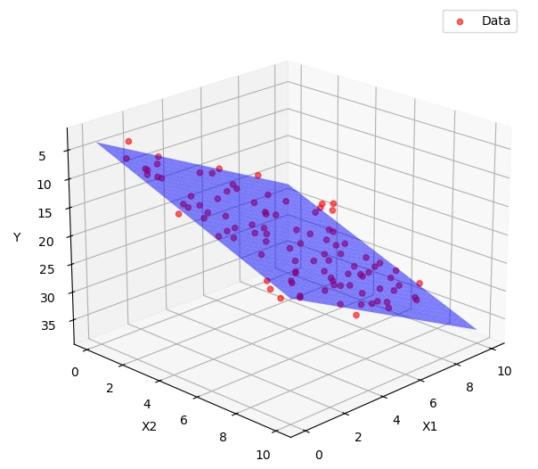

# 第2章 多元线性回归：估计

> “研究复杂问题时，可以一次考察一部分，并暂时把其他干扰因素置于‘其他条件不变’的围栏中。”
> 
> ——根据阿尔弗雷德·马歇尔《经济学原理》相关论述意译

在第1章中，我们通过建立一元线性回归模型，学习了如何用最小二乘法估计解释变量X与被解释变量Y之间的关系。这是回归分析的出发点，也是理解计量经济学的第一扇门。然而，在实际经济问题中，变量之间的关系往往不像模型中那样干净。一个被解释变量的变动通常不是由单一因素决定的，而是受到多个变量的共同影响。以学生的学习成绩为例，如果我们建立一个一元回归模型，研究自习时间与期末成绩的关系，得到的回归系数可能告诉我们：自习时间越多，成绩越高。但是，问题在于，自习时间真的能代表全部影响成绩的因素吗？也许家庭背景、课程难度、上课认真程度、同寝室学习氛围等也都会影响成绩。如果我们只纳入自习时间，而忽略了同时与自习时间和成绩相关的重要因素，那么自习时间的估计系数就可能出现遗漏变量偏误。多元回归正是把“其他条件不变”的分析思想转化为可操作模型的基本工具。

自然科学常通过随机分配和实验控制减少干扰。比如，在力学实验中，研究人员想测量物体在水平面上受力后的加速度，会尽量保持摩擦、轨道状态和测量条件稳定，使不同实验条件主要体现为外力的变化。植物学实验研究光照对生长的影响时，也会随机分组并控制土壤水分、温度和肥料等因素。实验控制不能保证所有条件绝对相同，但能使处理组与对照组形成更可信的比较。

多元回归在社会科学中提供了一种统计上的条件比较。它允许我们同时纳入多个变量，描述在模型中其他变量取值相同时，某个解释变量与被解释变量之间的条件关系。这种“其他条件不变”来自模型和数据中的可比变异，不等同于实验控制；要把系数解释为因果效应，还需要额外的识别假设。本章具体回答如下问题：

首先，为什么要从一元到多元？我们将从一元回归分析的局限性出发，解释为什么需要引入多个解释变量，并引入控制变量这一核心概念。通过现实生活和经济社会的案例，你将看到多元分析在解释复杂现象中的必要性，以及控制其他变量的直观意义。

其次，多元线性回归怎样估计？多元情形的表达式更长，但目标没有变化：选择一组系数，使残差平方和最小。每个系数首先描述控制模型中其他变量后的条件关系。

第三，多元情形下经典假设如何设定？我们将把第1章中的四个基本假设扩展到包含多个解释变量的情形，并增加多元回归特有的无完全共线性假设，重点分析它们各自的经济学含义以及违反这些假设可能带来的后果。尤其是零条件均值假设，即给定全部解释变量时误差项的条件期望为零，在多元模型中显得尤为重要：它是OLS估计量无偏性的关键条件，也与因果识别的目标密切相关。在通俗易懂的语言下，你将进一步理解无偏性、有效性等核心概念，并明白这些性质依赖于哪些条件，这对于正确解读回归结果至关重要。

最后，我们也会通过蒙特卡洛实验，直观感受多元回归的优势。通过模拟多个数据生成过程，观察在有无控制变量的两种模型中，回归估计结果的差异如何体现出模型设定的好坏。通过模拟不同样本、多种变量组合和误差分布，你可以直观地看到OLS估计量的无偏性和有效性，并理解样本波动、变量相关性对估计结果的影响。这种实验式学习方式有助于在图像和直观结果中理解多元回归分析的价值和必要性。

通过本章的学习，你将从一元回归过渡到多元回归，理解控制变量的含义、系数的条件解释以及遗漏变量偏误。多元回归为因果分析提供了基本工具，但系数能否解释为因果效应，还取决于变量选择和识别假设。

## 2.1 为什么需要多元回归

### 2.1a 遗漏变量偏误

经济学的重要任务之一，是识别变量之间的因果关系。随机对照实验通过随机分配处理，使处理状态在期望意义上与处理前特征和潜在结果独立。例如，在临床研究中，可将参与者随机分为实验组与对照组，再比较预先规定的结果。有限样本仍可能出现基线不平衡，结果缺失、不依从和组间干扰也需专门处理；随机化提供识别基础，并非自动消除所有实际问题。

在社会科学中，我们也希望构造清晰的处理组与对照组。例如，我们关心教育是否提高收入、最低工资是否影响就业，或城镇化是否改变环境质量。理论上可以设想随机分配更多教育，或随机指定某些城市提高最低工资；现实中，这类干预往往不可行。教育年限受家庭背景、个人志向和地区教育资源影响，最低工资的制定也与政治经济环境和行业特点有关。因此，我们经常使用观察性数据。计量模型可以刻画条件关系；只有研究设计和相应识别假设可信时，才能进一步识别因果效应。

最基础的分析方法是上一章我们建立的一元线性回归模型。例如，我们想知道教育年限是否影响收入水平，可以估计下列模型：

$${income}_{i} = \beta_{0} + \beta_{1}{education}_{i} + u_{i}$$

这个模型的含义是：我们试图用教育变量来解释收入差异，回归系数$\beta_{1}$表示教育每增加一年，收入平均如何变动。然而，要把它解释为因果效应，需要满足$E(u_i\mid education_i)=0$等识别条件。这里要求的是条件均值为零；教育与误差项完全独立是更强的条件，并非OLS无偏所必需。

在使用观察性数据研究教育与收入时，这个假设往往很难直接满足。以家庭背景为例，它会影响一个人能接受多少教育，也可能影响他未来能获得的收入。如果我们忽略家庭背景，就会把它的影响藏进误差项中。而当教育与家庭背景相关时，误差项就会与解释变量发生系统联系，从而违反上一章提出的基本假设3。这时，估计出来的$\beta_{1}$会同时夹杂教育年限与家庭背景的作用。我们可能因此高估教育的作用（例如，家庭条件越好的人既上学多，收入也高），也可能在其他情形下低估它。

这种偏误被称为遗漏变量偏误（omitted variable bias）。为了更具体地理解它，不妨设想一个极端情形：我们使用一元回归发现，教育与收入正相关。但事实上，如果家庭背景才是导致收入差异的主因，而教育只是背景的副产品，那么我们并不能说教育本身带来了更高的收入。更严重的是，在一些案例中，遗漏变量的作用方向甚至与我们分析的方向相反，导致我们不仅估计有偏，甚至可能得出反方向的结论。

遗漏变量偏误的根源在于两个条件同时成立：（1）被遗漏的变量影响被解释变量（例如家庭背景影响收入）；（2）该变量与我们关心的解释变量相关（例如家庭背景影响教育）。如果这两个条件都满足，遗漏该变量就会导致回归系数估计有偏。更形式化地说，若我们估计的模型遗漏了一个重要变量Z，而Z又同时影响Y和X，那么误差项就包含了Z的影响，而只要核心变量和被遗漏掉的变量相关（即Cov(X,Z)≠0），就必然导致核心解释变量和随机误差项相关（即Cov(X,u)≠0），这就违反了最小二乘法无偏性的基本条件，因此，估计出的结果也是有偏的。

> 专栏2-1 课外辅导与成绩：观察数据中的遗漏变量
>
> 假设我们调查一批学生，发现参加课外辅导的学生平均成绩更高。若只回归成绩对是否参加辅导，很容易把组间差异全部归因于辅导。但家庭教育投入可能同时影响两个变量：重视教育、资源更充足的家庭更可能购买辅导，也可能提供更安静的学习环境和更多学习支持。
>
> 此时，家庭教育投入就是潜在的遗漏变量。它既影响被解释变量（成绩），又与核心解释变量（是否参加辅导）相关。遗漏变量偏误需要这两个条件同时成立；一个只影响成绩、却与参加辅导无关的变量会增加随机波动，但不会因此造成辅导系数的系统性偏误。
>
> 如果能够用合适的变量刻画辅导开始前的家庭背景和既往成绩，多元回归可以减少这类混杂。但加入控制变量并不等于已经获得因果效应：家庭支持可能测量不全，参加辅导也可能受到学生原有成绩影响。这个例子提醒我们，多元回归是在明确假设下进行条件比较，而不是把观察数据自动变成实验数据。

### 2.1b 控制变量

缓解遗漏变量偏误的一个基本思路，是把有理由认为同时影响解释变量和被解释变量的因素纳入模型。这些变量称为控制变量（control variables）。例如，研究教育与收入的关系时，可以根据因果结构和数据条件加入政策前的家庭背景、地区和个人特征，比较这些条件相同时的收入差异。这是回归中的条件比较，不等于随机实验中的处理分配。只有当关键混杂因素已得到充分处理，且外生性等识别条件成立时，教育系数才可以进一步解释为因果效应。

在一元回归模型中加入控制变量我们便得到了多元线性回归模型。它的基本形式如下：

$$Y_{i} = \beta_{0} + \beta_{1}X_{1i} + \beta_{2}X_{2i} + \ldots + \beta_{k}X_{ki} + u_{i}$$

其中，$Y_{i}$是被解释变量，$X_{1i}$是我们关注的核心解释变量，$X_{2i}$,...,$X_{ki}$是其他解释变量。$\beta_{1}$的回归含义是：在模型中其他变量保持不变时，$X_{1}$增加一个单位，$Y$的条件均值平均变动多少。这是“控制其他变量”的回归解释；是否还能解释为因果效应，要取决于外生性和研究设计。

引入合适的控制变量有助于缓解遗漏变量偏误，也可能改善拟合或预测，但这些结果都不是自动发生的。加入变量会使样本内$R^{2}$不下降，却可能降低调整后的$R^{2}$或样本外预测表现。因此，控制变量应依据研究问题和因果结构选择，预测能力则应使用验证集或交叉验证评估。

当然，并不是控制的变量越多越好。控制变量的选取必须遵循一定原则：一是要根据理论与经验判断变量之间是否存在因果路径；二是要避免引入中介变量或结果变量作为控制变量，从而破坏因果结构本身。比如，在研究教育对收入的总效应时，如果职业类型本身是教育的结果，将其作为控制变量会截断教育通过职业影响收入的路径。因此，多元回归虽是技术方法，其建模过程也需要扎实的经济学判断与明确的因果结构。

综上所述，一元回归模型虽然形式简单、计算方便，但往往不足以支持现实中的因果解释。多元回归可以比较控制变量取值相同的观测单位，估计条件平均关系；只有当控制集合合理、关键混杂因素得到处理且其他识别条件成立时，核心系数才可以进一步解释为因果效应。这种方法也是后续政策评估、预测分析和结构建模的基础工具。

## 2.2 多元线性回归的估计

### 2.2a 参数估计

在上一章中，我们已经学习了如何利用最小二乘法估计一元线性回归模型的参数，理解了通过拟合一条直线来捕捉解释变量与被解释变量之间的平均线性关系。简单来说，一元回归通过找到使预测值与实际观测值差距最小的直线，估计截距和斜率参数，从而描述单个解释变量对被解释变量的影响。

然而，在现实中，影响一个结果的因素往往不止一个。多元回归模型的引入，正是为了应对被解释变量受到多个解释变量共同作用的情况。多元回归模型的表达式通常写为：

$$Y_{i} = \beta_{0} + \beta_{1}X_{1i} + \beta_{2}X_{2i} + \ldots + \beta_{k}X_{ki} + u_{i}$$

其中，$Y$是被解释变量，$X_1,X_2,\ldots,X_k$是多个解释变量，$\beta_0$是截距，$\beta_1,\beta_2,\ldots,\beta_k$是我们希望估计的回归系数，$u_i$是误差项，反映其他未包含在模型中的因素对$Y$的影响。真实的总体参数是未知的，我们只能通过有限样本数据估计出样本回归线。如果我们获得一组样本数据，进行多元回归的目标依旧是找到一组参数，使模型的预测值尽可能贴近样本中的实际观测值。那么，我们如何去估计出这些系数呢？

在一元回归中，我们用一条直线拟合数据点。在多元回归中，每增加一个解释变量，拟合对象就扩展为平面或更高维的超平面。OLS选择一组系数，使样本残差平方和最小。每个系数描述的是：在模型中其他解释变量保持不变时，该变量变化一个单位对应的条件均值变化。这里得到的是偏回归关系；是否可以称为变量的“独立作用”，仍取决于模型设定和识别假设。

图2-1 多元情形下（两个解释变量）的最小二乘拟合

在这幅三维回归图中，两个水平轴分别表示解释变量$X_{1}$与$X_{2}$，竖直轴表示被解释变量$Y$；每个数据点$(X_{1i},X_{2i},Y_i)$是一条观测记录。半透明平面对应样本回归方程$\widehat{Y}=\widehat{\beta}_{0}+\widehat{\beta}_{1}X_{1}+\widehat{\beta}_{2}X_{2}$。几何上，$\widehat{\beta}_{1}$是沿$X_{1}$方向的斜率，表示保持$X_{2}$不变时，$X_{1}$增加1个单位对应的预测$Y$变化；$\widehat{\beta}_{2}$是沿$X_{2}$方向的斜率。每个观测点与平面的竖直差距$\widehat{u}_{i}=Y_i-\widehat{Y}_i$是样本残差。含截距的OLS使残差和为零，并使残差与各解释变量在样本中正交。解释变量超过两个时无法直接作图，但“在解释变量空间中寻找拟合超平面”的思想不变。

那多元回归下的参数如何估计呢？具体来说，我们仍然是通过最小二乘法来估计。对于第i个观测样本，模型的预测值为：

$${\widehat{Y}}_{i} = {\widehat{\beta}}_{0} + {\widehat{\beta}}_{1}X_{1i} + {\widehat{\beta}}_{2}X_{2i} + \ldots + {\widehat{\beta}}_{k}X_{ki}$$

实际观测值与预测值之间的差距是残差：

$$\widehat{u}_{i}=Y_{i}-\widehat{Y}_{i}$$

多元回归估计中最常用的仍然是最小二乘法。最小二乘法的核心思想，是选择参数${\widehat{\beta}}_{0}$，${\widehat{\beta}}_{1}$，${\widehat{\beta}}_{2}$,...，${\widehat{\beta}}_{k}$来最小化所有残差平方和：

$$
S(\widehat{\boldsymbol{\beta}})
=\sum_{i=1}^{n}\widehat{u}_i^2
=\sum_{i=1}^{n}\left(Y_i-\widehat{\beta}_0-\widehat{\beta}_1X_{1i}-\cdots-\widehat{\beta}_kX_{ki}\right)^2
$$

和一元回归一样，OLS是在所有候选平面中选择残差平方和最小的一个。软件会完成求解，正文不展开求偏导过程。求解结果满足下面的样本关系，称为正规方程；初学时只需理解其含义，不要求推导：

$$
\sum_{i=1}^{n}\widehat{u}_i=0,
\qquad
\sum_{i=1}^{n}X_{ji}\widehat{u}_i=0,
\quad j=1,2,\ldots,k.
$$

第一条表示含截距回归的样本残差和为零，其余各条表示样本残差与相应解释变量的样本共同变化为零。这些是OLS计算后必然得到的样本代数性质，不表示不可观测的总体误差项与解释变量独立，也不能证明外生性。

一句话概括：多元OLS仍然是在找残差平方和最小的拟合面。每个系数表示模型中其他解释变量保持不变时，该变量增加一个单位所对应的被解释变量条件均值变化。系数要能够单独估计，还要求解释变量之间不存在精确的线性重复；它能否解释为因果效应，则取决于模型设定与识别假设。

### 2.2b 可决系数$R^{2}$

在一元回归模型中，我们已经接触过可决系数$R^{2}$，它衡量解释变量对于被解释变量波动的解释程度。在多元回归分析中，$R^{2}$的定义虽然保持不变，仍表示模型所解释的被解释变量变异占总变异的比例，但它的实际含义和使用方式需要进一步澄清。

首先，多元回归模型中往往包含多个解释变量，因此$R^{2}$不再仅反映某一个变量对被解释变量的解释力，而是衡量整个解释变量集合的联合解释力。换言之，它告诉我们：在考虑所有控制变量之后，这个模型整体能解释被解释变量波动的多少。例如，如果一个模型的$R^{2}$是0.65，就意味着解释变量的线性组合可以解释65%的被解释变量变异，剩下的35%被归入误差项中。这个结果通常用来初步判断模型的拟合效果。

然而，在多元回归中，$R^{2}$面临一个新的技术问题：随着解释变量数量的增加，$R^{2}$几乎总是会提高，即使新加入的变量对被解释变量几乎没有解释作用。这是因为最小二乘估计会尽可能通过调整系数来最小化残差平方和，而增加变量几乎总是有助于做到这一点。于是，若一味追求更高的$R^{2}$，就容易导致模型过度复杂、过度拟合，失去对真实关系的刻画能力。

为此，我们引入了一个在多元回归中常用的修正指标——调整后的可决系数（adjusted $R^{2}$）。它在计算时不仅考虑了残差平方和的变化，还对变量个数进行了调整，使得当加入的新变量对模型没有提供足够的信息时，调整后的$R^{2}$反而可能下降。形式上，它通过惩罚解释变量数量来抵消盲目添加变量带来的虚假提升，从而更真实地反映模型的拟合效率。

因此，在多元回归分析中，不能简单地以$R^{2}$大小判断模型优劣，而应结合调整后的$R^{2}$、参数估计结果的显著性、变量的经济含义，以及是否存在遗漏变量偏误或多重共线性等问题，综合判断模型是否合理。$R^{2}$虽然提供了一个整体上的拟合衡量，但它不能取代对个别回归系数的解释和检验，也不能作为因果关系成立的依据。

### 2.2c 系数的解释

多元回归可以估计条件均值中的偏关系：在模型中其他变量保持不变时，一个解释变量变化对应的被解释变量平均变化。这个系数是否代表净因果效应，需要额外的识别假设。

为什么必须保持其他变量不变？试想一下，我们研究工资收入$Y$与教育年限$X_{1}$、工作经验年限$X_{2}$的关系。教育年限和工作经验往往相关，且具体方向取决于年龄、入职时间等样本结构。如果只用教育年限做一元回归，教育系数会同时反映教育与工作经验的关联。当工作经验也影响工资时，遗漏它就可能造成遗漏变量偏误。

而多元回归模型则同时纳入教育年限和工作经验两个解释变量，估计教育对收入的系数时，是比较工作经验相同情况下不同教育水平的收入差异。换言之，系数${\widehat{\beta}}_{1}$描述的是在保持工作经验不变的条件下，教育年限增加一个单位带来的平均收入变化。这种控制其他变量的做法让估计更接近因果关系，减少混淆因素的干扰。

在多元回归中，控制其他变量的实质，并不是在现实中找到所有条件完全相同、仅有一个变量不同的个体，而是通过模型的数学机制将各个变量的作用彼此区分开来。假设模型为

$$Y = \beta_{0} + \beta_{1}X_{1} + \beta_{2}X_{2} + u$$

我们希望理解的是$\beta_{1}$，即控制$X_{2}$后，$X_{1}$与$Y$之间的条件平均关系。从几何角度看，多元回归是在多维空间中寻找最贴近观测点的平面。它利用$X_{1}$中不能被其他解释变量线性预测的那部分变异来估计$\beta_{1}$。变量越相关，这部分剩余变异通常越少，系数也越难精确估计。下一小节用一个不需要矩阵推导的定理，把这个计算过程完整拆开。

> 专栏2-2 Ceteris paribus是什么？
>
> 在多元回归分析中，我们常常听到“控制其他变量，解释某变量对被解释变量的影响”，或者说“在其他条件不变的情况下，某变量变动一单位，被解释变量的预期变化是多少”。这句话中的其他条件不变（拉丁语：*ceteris paribus*）是理解回归系数的关键，但它并非简单的口号，而是多元回归模型结构和解释的基础。
>
> "*Ceteris paribus*"直译为“其他条件不变”，是经济学和社会科学中常用的分析原则。它提醒我们：要理解某一因素的作用，必须把其他可能同时变化的因素区分开来。在理论模型中，这可以作为一种思想实验；在回归中，它首先表现为“给定模型中的其他变量”的条件解释。
>
> 为什么需要强调其他条件不变？想象你想研究教育年限对工资的影响。若只用一元回归，模型只包含教育年限一个解释变量，那么回归系数代表的是教育年限变化与工资变化的关系，看似直观。但实际上，工资受很多因素影响，比如工作经验、所在行业、性别、地域差异、甚至个人能力。若这些重要因素没有被纳入模型，我们估计的教育对工资的影响可能不仅仅反映教育本身，还混杂了这些遗漏因素的影响。
>
> 这时，“其他条件不变”的含义是：在模型中其他解释变量取值保持不变时，某个解释变量增加一个单位对应的条件均值变化。它是一个偏回归关系；只有识别条件成立时，才能进一步称为该变量的因果效应。
>
> 举个例子：如果多元回归模型中包括教育年限、工作经验和行业类型，那么教育年限的系数表示：在模型中工作经验相同、行业类型相同的比较下，教育年限每增加一年，工资条件均值相差多少。这里的“保持不变”是一种模型内的条件比较，不表示现实中的其他因素都已真正固定。
>
> 现实生活中，教育年限、工作经验和行业选择往往共同变化。例如，在年龄相近的人群中，教育时间更长可能意味着进入劳动力市场更晚、工作经验更少；不同行业的工资水平也可能不同。多元回归通过同时纳入这些变量，把教育系数建立在模型所定义的条件比较上。至于这种比较能否接近因果问题所需的反事实，仍取决于控制变量选择和识别假设。
>
> 此外，其他条件不变说明多元回归系数不是简单的两变量相关系数。它反映的是控制模型中其他变量后的条件关系；只有控制集合充分且其他识别条件成立时，才能把这种关系解释为因果效应。
>
> 因此，理解其他条件不变不仅是理解多元回归系数的基础，也帮助我们明确模型中控制变量的作用和意义，避免把相关关系简单等同于因果关系，提升我们对模型结果的科学判断力。

### 2.2d FWL定理：多元回归如何“控制”变量

“控制其他变量”听起来像是在现实中找到一群各方面完全相同的人，只让他们在$X_1$上有所不同。真实数据通常做不到这一点。多元回归实际采用的是一种线性残差化方法，弗里施—沃—洛维尔定理（Frisch–Waugh–Lovell theorem，简称FWL定理）把这个过程说得非常清楚。

仍然考虑下面的多元回归：

$$Y=\beta_0+\beta_1X_1+\boldsymbol{W}'\boldsymbol{\gamma}+u$$

其中，$X_1$是我们关心的解释变量，$\boldsymbol{W}$代表工作经验、行业等控制变量；下面的辅助回归都包含常数项。FWL定理可以用三步理解：

1. 用控制变量$\boldsymbol{W}$回归$X_1$，得到残差$\widetilde X_1$。它是$X_1$中不能被这些控制变量线性预测的部分。
2. 用同一组控制变量$\boldsymbol{W}$回归$Y$，得到残差$\widetilde Y$。它是$Y$中不能被这些控制变量线性预测的部分。
3. 用$\widetilde X_1$回归$\widetilde Y$。这次回归得到的斜率，与原多元回归中的$\widehat\beta_1$完全相同。

一句话记忆：先从X和Y中分别扣掉同一组控制变量能够线性解释的部分，再比较两边剩下的部分。

这个结论可以用一个很短的代数关系验证。记$M_W$为“剔除常数项和控制变量$W$能够线性解释部分”的残差化操作，则

$$\widetilde X_1=M_WX_1,\qquad \widetilde Y=M_WY.$$

由于残差与生成它的控制变量正交，$\widetilde X_1$与常数项及$W$的样本内积都等于0。把原多元回归等式两边同时残差化，可得

$$\widetilde Y=\beta_1\widetilde X_1+\widetilde u.$$

因此，残差回归的OLS斜率为

$$\widehat\beta_1=
\frac{\sum_i\widetilde X_{1i}\widetilde Y_i}
{\sum_i\widetilde X_{1i}^{2}},$$

它与完整多元回归中$X_1$的系数完全相同。初学时不必掌握残差生成矩阵，只需抓住两个事实：同一组控制变量要同时从$X_1$和$Y$中剔除；剩余部分之间的斜率就是完整回归中的目标系数。

以教育与工资为例，第一步先从教育年限中扣除工作经验、行业等变量能够线性解释的部分；第二步从工资中扣除同一组变量能够线性解释的部分；第三步比较两边剩下的部分。多元回归中的教育系数，正是从这种“都扣除同一组控制变量后再比较”的过程中得到的。

这个定理带来三个重要直觉。第一，控制变量不是把某些观测删除，而是改变了用于估计系数的样本变异。第二，如果$X_1$几乎都能被控制变量预测，那么$\widetilde X_1$所剩信息很少，系数标准误通常会变大，这正是多重共线性的一个直观来源。第三，第7章的固定效应也可以理解为一种残差化：先吸收单位或时间固定效应，再利用剩余变异估计斜率。

FWL定理是一条样本代数结论，不是一条因果识别定理。无论三步回归计算得多么精确，如果遗漏了关键混杂因素，或者错误控制了处理之后才产生的变量，$\widehat\beta_1$仍然不能自动解释为因果效应。常见风险包括中介变量（位于X影响Y的路径上）和碰撞变量（同时受到两个变量影响）。FWL告诉我们多元回归在计算上如何“控制”，却不能替我们判断应该控制什么。

## 2.3 多元线性回归估计量的统计性质

### 2.3a 经典假设

在第1章中，我们介绍了一元线性回归模型及其最小二乘估计方法。在一元回归中，我们用一个解释变量来解释被解释变量的变化，通过样本数据估计回归系数，并分析它们的含义。我们也提到，最小二乘估计具有良好的统计性质，例如无偏性和有效性。但这些性质的成立，是有条件的，它们依赖于对数据和模型设定所作的一系列基本假设。

在多元线性回归中，我们引入了多个解释变量以更全面地刻画被解释变量的变化来源，这也要求我们对模型做出一组更完整的假设。这些假设被统称为经典线性回归模型假设，简称经典假定（Classical Assumptions）。本节将介绍这些基本假定，并讨论在这些假定成立时，最小二乘估计量所具有的重要统计性质。

#### 假设1：线性回归

我们首先假定，被解释变量Y与解释变量 $X_{1},X_{2},...,X_{k}$之间存在线性关系，即：

$$Y_{i} = \beta_{0} + \beta_{1}X_{1i} + \beta_{2}X_{2i} + \ldots + \beta_{k}X_{ki} + u_{i}$$

这里的线性指的是模型对参数$\beta_{j}$是线性的，而不是说解释变量必须以原始形式进入模型。我们可以根据需要对变量做非线性变换（如平方、对数），只要模型在参数上是线性的，它仍然属于线性回归的范畴。

这一假设的作用在于建立了明确的函数关系，使我们能够使用最小二乘法估计模型参数。它还决定了我们对回归系数的解释方式：$\beta_{j}$表示在其他变量保持不变的条件下，$X_{j}$增加一个单位所带来的Y的平均变动。

#### 假设2：随机抽样（独立同分布）

我们假定样本由总体中独立、随机地抽取得到。即每一个观测点($Y_{i}$,$X_{1i}$,...,$X_{ki}$)是独立同分布的。这一假设为从样本推断相应总体提供了基础，但不能单独确保有限样本具有代表性；抽样框覆盖、无应答和样本选择等问题仍需单独检查。

这个假设的直觉在于，我们希望观测到的现象是随机选取的，而不是由于某种人为选择或偏倚机制。例如，如果我们研究教育对工资的影响，但只选取了特定城市或行业的数据，就可能无法代表整个劳动力市场的真实关系。

#### 假设3：误差项的零条件期望

和一元回归分析一样，这仍然是最关键的假设。我们假定，在给定所有解释变量的条件下，误差项的期望为零：

$$E\left( u_{i} \middle| X_{1i},X_{2i},\ldots,X_{ki} \right) = 0$$

直观上，这意味着在给定解释变量后，误差项的条件均值为零。它比“不相关”更强，但仍不等同于误差项与解释变量统计独立；误差的条件方差和更高阶分布仍可能随解释变量变化。

在线性模型、随机抽样和无完全共线等条件同时成立时，零条件期望可使最小二乘估计量具有无偏性。如果它不成立，例如遗漏了与解释变量相关的重要因素，回归系数就可能系统性偏离目标参数。

举个具体例子：我们用教育年限X来解释收入Y，但忽略了能力这个重要变量。如果能力既影响教育年限（能力强的人倾向于受教育更多），也影响收入（能力强的人收入更高），那么误差项中就含有能力的信息，而且这个信息和解释变量是相关的，这就违反了零条件期望假设，导致${\widehat{\beta}}_{1}$偏高，出现所谓的遗漏变量偏误。

这一点也是多元回归优于一元回归的关键所在。通过加入其他控制变量，我们可以更好地满足这个假设，从而提高估计结果的可信度。

#### 假设4：同方差

我们假定，误差项在不同观测值中具有相同的方差，即：

$$\operatorname{Var}\left( u_{i} \middle| X_{1i},X_{2i},\ldots,X_{ki} \right) = \sigma^{2}$$

也就是说，不管解释变量的取值如何，误差项的波动程度是恒定的。这一性质称为同方差性（homoskedasticity）。

直观理解是，我们在模型预测中对不同观测值的把握程度是相似的。比如预测不同人群的收入，如果对高收入人群预测总是偏差很大，而对低收入人群预测较准确，就出现了异方差性。

如果这个假设被违反，即出现异方差，那么最小二乘估计在零条件期望等其他假设成立时仍然无偏，但不再具有经典同方差条件下的有效性；常规OLS标准误也会估计错误，从而影响显著性检验。

#### 假设5：解释变量无完全共线性

在多元回归中，我们用多个解释变量描述条件关系；在因果研究中，控制变量还应依据因果结构选择。解释变量之间可能高度相关，甚至出现完全共线性。完全共线性是指某个解释变量能够被其余解释变量精确线性表示。例如，同时加入截距和一组互斥且穷尽的全部类别虚拟变量，就会产生严格线性关系。年龄减受教育年限只有在入学、就业时点等额外关系被机械固定时才会与工作经验严格共线，现实数据中通常只是高度相关而非必然完全共线。

完全共线性会直接影响系数的可识别性。当一个解释变量能够被其他解释变量精确线性表示时，设计矩阵不满列秩，多组系数都可能产生相同的拟合值，因此系数不能被唯一确定。软件通常会自动删除一个冗余变量，而不是给出“方程无解”的经济含义。无完全共线性要求每个解释变量提供不能由其他解释变量精确复制的样本变异。

完全共线性常源于冗余设计，例如在含截距模型中同时加入互斥且穷尽的东部、中部和西部虚拟变量，或同时加入男性和女性虚拟变量。处理时应明确基准组，删除能够被其余变量精确复制的列；高度相关但不完全共线的变量则不能仅凭相关性机械删除。无完全共线性保证样本中各系数能够被唯一估计，但不保证模型设定正确或具有因果解释。

完全共线性通常被视为一种意外或操作上的错误，它并非数据本身固有属性，而往往来源于模型设计或变量选择的不当。例如，如果在同一回归模型中同时使用父亲收入、母亲收入和家庭收入（父母收入之和），增加了额外的控制变量但完全没有提供新的信息就是完全共线性。完全共线性的结果是回归方程的系数无法唯一确定，最小二乘估计不再可行，模型失去可识别性。在实践中，这类情况往往属于我们在变量构造或操作上未注意冗余信息的意外，需要通过剔除冗余变量、合并高度相关变量或调整虚拟变量设计来解决。

除了完全共线性以外，多重共线性则是多元回归分析中的常态现象。所谓多重共线性指的是解释变量之间存在较高的相关性，但并非完全线性相关，即一个变量可以被其他变量大致预测，但不能精确表示。例如，在劳动力市场研究中，教育年限和工作经验往往正相关，但彼此并非完全重叠；在企业分析中，资产规模和销售收入通常高度相关，但仍保有独立差异。多重共线性在多元回归中广泛存在，并非操作失误，而是变量本身的内在特征。

存在多重共线性时，在其他经典假设成立的前提下，回归估计量仍然无偏，并符合高斯—马尔可夫定理。但多重共线性会增加系数的方差，使估计结果不稳定、标准误变大、置信区间变宽，并降低显著性检验的功效。例如，当教育年限和工作经验高度相关时，即便二者对工资都有关联，在回归分析中各自的系数也可能波动较大、符号不稳定，使我们难以精确量化各自的条件关系。

因此，从建模实践来看，完全共线性和多重共线性在性质和处理方式上有明显不同。完全共线性更多是一种意外，是操作上的错误，需要通过剔除冗余变量或重新设计模型来解决；而多重共线性是多元回归分析的常态问题，虽然不会导致偏差，但会增加方差，降低估计精度。

在经典假设下，某个系数估计的方差可以写成一个简单的形式：

$$\operatorname{Var}\left(\widehat{\beta}_j\right)
=\frac{\sigma^2}{SST_j\left(1-R_j^2\right)}$$

这个公式揭示了三个直观关系。误差波动$\sigma^{2}$越大，系数估计越不精确；$X_j$在样本中的有效变异越大，通常越容易精确估计；$X_j$越能被其他解释变量线性预测，$R_j^2$越高，方差膨胀因子$\mathrm{VIF}_j=1/(1-R_j^2)$越大。VIF是诊断指标，不存在适用于所有研究的硬阈值；“VIF大于10”只是一条常见经验规则。中心化可以缓解含交互项或高次项时由尺度产生的非本质相关，但不会消除一般的多重共线性；标准化改变单位，也不会增加识别信息。增加样本量有时能提高精度，却不能解决变量之间的结构性线性依赖。处理方式应根据研究目标决定，例如重新定义变量、删除确属冗余的指标，或在预测任务中采用正则化方法。

在介绍了如何通过样本数据来估计多元线性回归模型中的各个参数后，现在我们要进一步讨论这些估计量本身的性质，也就是它们是否是我们想要的好估计量。判断一个估计量是否好，最基本的两个标准仍然是无偏性和有效性。这些概念在第1章的一元回归中已经初步介绍过，但在多元回归中，它们的含义更为复杂，也更值得细致讨论。

> 专栏2-3 控制变量越多越好吗
>
> 随着数字经济的迅速发展，学者们越来越关注其对经济增长、居民收入及共同富裕水平的影响。为了更全面刻画数字经济的多维面貌，研究中常常引入多个相关指标，如数字基础设施指数、数字产业增加值占GDP的比重、居民数字消费水平、数字技术创新投入等。表面上看，这些指标各自反映了数字经济的不同层面，但它们背后隐藏着一个核心问题：这些变量之间往往高度相关，几乎同步变化。
>
> 这种变量间的高度相关关系就是所谓的多重共线性。多重共线性意味着模型中的解释变量彼此间存在强线性关系，这使得回归模型难以准确区分各个变量对被解释变量的独立影响。以数字经济为例，数字基础设施的完善促进了数字产业的扩张，同时也提高了居民的数字消费水平。因此，多个指标实际上反映的是数字经济整体发展的同一趋势。
>
> 当我们把这些高度相关的变量全部纳入回归模型时，会出现一个显著问题——系数估计不稳定且难以解读。具体表现为，在不同样本或不同模型设定中，同一个变量的估计系数可能大幅变化，甚至出现与理论预期相反的符号。这是因为模型难以区分这些变量的独立效应，它们的影响在统计意义上彼此混淆，导致无法明确判断哪一个因素是真正起作用的关键。
>
> 这种现象反映出一个更深层次的本质问题：多重共线性实际上减少了模型中有效信息的维度。虽然我们加入了多个变量，试图从多角度解释数字经济的作用，但由于这些变量高度相关，模型中的信息其实是重复的，浪费了分析的自由度。这就好比问几个人讲同一件事情，听多了反而让人混淆谁说了什么。
>
> 这个例子也提醒我们，控制变量的选择必须讲究质量而非数量。盲目追求控制变量的数量，特别是加入大量高度相关的变量，不仅没有提升模型解释力，反而可能让结果变得混乱且难以解释。
>
> 为此，我们常用的方法是结合理论和数据分析，精选代表性的关键变量，避免信息重复。或者通过合成指标（如主成分分析）将多个相关指标归纳成一个综合指数，这样既保留了核心信息，又降低了多重共线性的风险。
>
> 同时，这也提示我们，现实经济变量通常相互关联。合理的变量组合不要求解释变量彼此独立，而是要避免完全共线，明确每个变量在因果结构中的角色，并保证样本中有足够的独立变异来回答研究问题。
>
> 希望同学们在将来的研究中，能够深入理解控制变量的选择原则，避免越多越好的误区，懂得如何利用理论和数据的力量，构建稳定且有意义的多元回归模型。

### 2.3b 多元回归估计量的统计性质

无偏性：为什么保持其他变量不变很重要？

所谓无偏性，简单说就是在重复抽样的平均意义下，估计量不会系统性地高估或低估真实参数。也就是说，对于任一回归系数$\beta_{j}$，其估计值${\widehat{\beta}}_{j}$应满足：

$$E\left( {\widehat{\beta}}_{j} \right) = \beta_{j}$$

这一性质说明我们可以信任这个估计量——虽然每次用不同的样本估出来的结果会有些差异，但长远来看，这种差异是围绕着正确值随机波动的，而不是始终偏高或偏低。

图2-2 多元回归估计的无偏性

这一结论仍然依赖于经典假设的成立，尤其是其中最关键的一条：误差项在控制了解释变量后，其条件期望为零。换句话说，在多元回归中，我们假定在已知所有解释变量的取值后，误差项的平均值是零。这个假设在直觉上意味着：模型中所没有包含的影响被解释变量的其他因素，并不与已有的解释变量系统性相关。

多元回归的一个重要优点就在于，它使我们能同时纳入多个变量。设想我们要研究教育水平（以受教育年限衡量）与工资的关系，如果不控制工作经验等变量，而教育和经验又相关，那么遗漏经验可能使教育系数出现偏误。把工作经验加入模型后，我们估计的是经验等模型内变量保持不变时，教育与工资之间的条件关系。只有控制集合充分且其他识别条件成立时，这一系数才可以进一步解释为教育的因果效应。

这一点正是多元回归系数解释的核心所在：每一个系数首先描述控制模型中其他变量后的偏回归关系。这种“其他变量保持不变”的条件性是一元回归无法提供的；系数是否无偏以及能否作因果解释，还取决于零条件均值等假设。

再强调一次：当误差项中含有那些与某个解释变量相关的遗漏因素时，估计就会偏误。这种情形在多元回归中尤为常见，因为我们研究的是复杂的经济社会问题，遗漏变量很难完全避免。因此，根据事前因果结构合理选择控制变量，是减少部分遗漏变量偏误的重要手段，但它不能确保零条件均值成立。控制了中介变量、碰撞变量或其他处理后变量，还可能引入新的偏误。

有效性：在所有线性无偏估计中最稳定

除了无偏，我们还希望估计值尽可能稳定、波动小。直观来说，在不同样本下反复估计，如果结果总是大起大落，那就算平均上不偏，也难以让人信赖。这个波动大小用统计学术语来说，就是估计量的方差。一个线性无偏估计量如果在所有线性无偏估计量中具有最小方差，我们就说它在这一类估计量中是有效的（efficient）。在高斯—马尔可夫条件下，多元最小二乘估计具有这一性质，因此被称为最佳线性无偏估计量。与一元回归一样，这个结论称为高斯—马尔可夫定理。它说明，在零条件均值、同方差等条件下，最小二乘法是在线性和无偏这两个限制条件下方差最小的估计方法。

为什么说这是“在线性无偏估计中”最优？这是因为还可能存在一些非线性的估计方法（例如最大似然估计、贝叶斯估计），它们可能在特定条件下比最小二乘更好；也可能存在一些偏的估计方法，它们通过接受一定的偏差来换取更小的方差（这在小样本时偶尔是值得的）。但在最常用的线性模型框架下，最小二乘法仍然是我们最基础、也最强有力的工具。

图2-3 多元回归的有效性问题（同方差vs异方差）

加入解释变量可能减少残差变异，也可能因共线性而增大目标系数的方差，净结果取决于数据结构。OLS最小化残差平方和；它在高斯—马尔可夫条件下具有线性无偏估计量中的最小方差性质，但后者不是由“最小化残差平方和”这句话单独推出的。标准误用于估计系数抽样分布的波动程度。

回顾整个讨论，多元最小二乘允许我们描述控制其他变量后的线性关系。在零条件均值等假设下，OLS对总体线性模型参数无偏；在高斯—马尔可夫条件下，它在线性无偏估计量中方差最小。控制变量增多不会自动带来因果解释，也不要求把所有影响被解释变量的因素都放入模型；关键是不能遗漏造成目标解释变量与结构误差相关的因素，也不能错误控制中介变量或碰撞变量。

因此，在使用多元回归时，除了掌握技术操作，我们更应关注模型设定的合理性。变量选得是否恰当，控制得是否充分，将直接决定我们能否获得一个真正可靠的估计结果。

### 2.3c 选读：偏差和方差的权衡

本节帮助有兴趣的读者把OLS与预测方法联系起来，不影响后续章节学习。在多元回归中，我们既关心估计量有没有系统性偏差，也关心它在不同样本中是否稳定。无偏是说重复抽样的平均值等于真实参数；方差描述不同样本估计结果的波动。

在多元回归中，加入必要的混杂因素可能减少遗漏变量偏误，也可能因为解释变量高度相关而提高目标系数的方差；但增加变量并不必然造成严重共线性。当解释变量缺乏独立变异、彼此高度相关或误差波动很大时，系数估计可能不精确。在预测问题中，收缩和正则化常以引入一定偏差来降低方差；在因果问题中，则要先保证目标参数和识别逻辑不被变量选择改变。

偏差和方差的权衡可以用第1章的打靶比喻来理解。靶心代表真实参数：落点长期平均位于靶心、但分布很散，对应无偏但高方差；落点集中在靶心一侧，对应有偏但低方差。在高斯—马尔可夫条件下，OLS在线性无偏估计量这个范围内方差最小，但这不表示它在所有损失函数、预测任务和估计方法中都最优。实际取舍要看研究目标、样本量、模型复杂度和所比较的方法。

换句话说，估计方法要围绕目标选择。因果推断首先要求目标参数可识别，但有限样本估计并不总能做到严格无偏，研究者还要同时考虑一致性、方差和置信区间覆盖率；预测任务则更直接关注样本外损失，常允许一定收缩偏差。偏差—方差权衡不是“因果必须无偏、预测可以有偏”的简单二分。

## 2.4 案例实践：教育、经验与工资

【案例背景】

在第1章中，我们用一元回归描述两个变量之间的平均关系。但工资不仅与教育有关，也与工作经验和在现单位任职年限等因素有关。如果教育与这些因素相关，只做一元回归，教育系数就可能混入其他因素的影响。

本案例使用教学用合成工资数据，围绕一个问题展开：加入合理的控制变量以后，教育系数为什么会变化？数据生成过程暂时满足随机抽样、参数线性、无完全共线性和同方差等条件；随后我们有意遗漏经验与任职年限，使新的误差项与教育相关，以便观察零条件均值被破坏后的结果。所有数值只服务于方法教学，不代表现实教育回报。

【案例要解决的问题】

本案例要回答三个相互连接的问题。

第一，只用教育解释工资，与进一步控制经验和任职年限相比，教育系数为什么不同？

第二，遗漏变量怎样进入新的误差项，并使零条件均值假设失效？偏误方向由哪些关系共同决定？

第三，FWL定理所说的“先剔除、再比较”能否在同一份工资数据中得到数值和图形验证？

案例开始前先完成一张假设核对表：模型对参数线性；样本由设定的数据生成过程独立产生；解释变量不存在完全线性关系；完整模型满足零条件均值；误差项暂设为同方差。本章重点改变其中的零条件均值条件。同方差与异方差的图形区别在本章作直观提示，正式检验和稳健标准误留到第5章。

【AI Agent工作流准备】

先写下自己的预测：教育与被遗漏的经验、任职年限怎样相关，这两个变量怎样影响工资，因此教育系数可能向什么方向变化。然后让Agent在`chapter02_project/`中读取本节、任务卡和配套脚本，核对完整模型、遗漏模型和FWL三步法使用的是不是同一份数据与同一组控制变量，再提出运行计划。确认后运行程序，检查模型比较表和偏回归图是否来自真实输出，并把核验过程写入`ai_log.md`。

> **AI Agent工作流提示**
> 1. 检查教育、经验、任职年限和工资的数据生成关系，并说明完整模型为何满足零条件均值；
> 2. 检查一元模型与完整模型是否使用同一批观测，避免把样本变化误当成控制变量的作用；
> 3. 检查FWL两次残差化是否使用完全相同的控制变量并包含常数项；
> 4. 执行后核对完整回归教育系数与残差回归斜率是否在数值精度范围内一致。
>
> 但以下判断必须由你自己完成：
> 1. 教育系数变化是否符合遗漏变量偏误方向的理论判断；
> 2. 为什么FWL验证成功不能证明控制变量选择正确；
> 3. 完整模型更接近数据生成真相是否等于现实研究已经识别因果效应；
> 4. 哪些经典假设在本案例中只是由生成过程设定，而不是被样本检验证明。

【实践任务】

**任务1：比较遗漏模型与完整模型。**  
先用教育年限解释对数工资，再加入工作经验和任职年限。整理两个模型中的教育系数、标准误和$R^2$，并根据变量之间的相关方向和真实工资方程判断教育系数为什么发生变化。

**任务2：用误差项解释遗漏变量偏误。**  
把完整模型与遗漏模型并排写出，说明经验和任职年限被遗漏后进入了新的误差项。结合样本相关系数和数据生成过程，判断新的误差项为什么可能与教育相关，并明确这破坏的是零条件均值，而不是同方差假设。

**任务3：验证并画出FWL定理。**  
分别从教育和对数工资中剔除经验与任职年限能够线性解释的部分，再用工资残差对教育残差回归。比较该斜率与完整回归中的教育系数，并绘制偏回归图。

> 📁 配套代码包：
> - Stata：`code/stata/ch02/`
> - Python：`code/python/ch02/`
> - AI Agent任务卡：`code/ai_cards/ch02_ai_task_card.md`
>
> 提交产出：1张模型比较表 + 1张FWL偏回归图 + 300字结果解释 + 可复现代码 + `ai_log.md`

【结果讨论】

模型比较表通常会显示：只用教育解释工资时，教育系数不仅反映教育本身，还可能吸收经验和任职年限带来的工资差异。加入这些变量后，教育系数更接近数据生成过程中设定的真实值。偏误究竟向上还是向下，取决于被遗漏变量对工资的影响方向，以及它与教育的相关方向，不能机械地认为“加控制变量后系数一定变小”。

从误差项角度看，遗漏经验和任职年限后，新的误差项包含了这两个变量的影响。如果它们与教育相关，教育也会与新误差项相关，零条件均值不再成立。本案例的误差方差仍然由生成过程设为常数，因此遗漏变量偏误与异方差是两类不同问题。

图2-4 FWL定理的三步残差化与偏回归图

偏回归图以教育残差为横轴、工资残差为纵轴。图中回归线的斜率应与完整多元回归中的教育系数完全一致。它直观展示了多元回归如何进行样本内的线性控制，但没有回答现实研究中是否遗漏能力、家庭背景等不可观测因素。

【案例总结】

本章案例从同一份工资数据出发，依次比较遗漏模型和完整模型、解释零条件均值为什么被破坏，并用FWL定理验证多元回归在计算上如何“控制”变量。三项任务共同回答一个问题：教育系数为什么会在加入控制变量以后发生变化。

这个案例也建立了后续章节需要反复使用的假设意识。零条件均值关系到系数是否存在系统性偏误；高度共线主要影响精度；异方差主要影响常规标准误。它们都会影响研究质量，但不能被笼统地称为同一个“回归问题”。

## 本章小结

本章重点围绕多元线性回归模型展开，系统阐述了多元回归分析的基本原理和核心方法。首先，我们从控制变量的概念入手，结合自然科学中随机控制实验的例子，深入探讨了为什么仅依赖一元回归往往难以准确揭示变量之间的因果关系。遗漏变量偏误的存在使得简单的单变量分析可能产生有偏的结果，而引入控制变量构建多元回归模型，则能够在一定程度上隔离其他影响因素，从而更准确地估计目标变量的影响。

接着，本章详细讲解了多元回归模型中参数的含义和估计方法。回归系数描述其他模型变量保持不变时的条件平均关系，这一点是多元回归区别于一元回归的重要特征。FWL定理进一步说明，多元回归可以理解为分别剔除控制变量对核心解释变量和被解释变量的线性解释，再比较两边剩余的部分；这是一条计算定理，并不自动赋予系数因果含义。

随后，本章介绍了多元回归的经典假设，包括参数线性、随机抽样、零条件均值、同方差和无完全共线性。零条件均值等条件保证OLS无偏；加上同方差等高斯—马尔可夫条件后，OLS在所有线性无偏估计量中方差最小。本章还讨论了多重共线性。它不会自动造成偏误，但可能增大方差，使单个系数难以精确估计。

通过本章的学习，我们不仅掌握了多元回归的理论基础和估计技术，更能理解模型假设的重要性及其对估计性质的影响。同时，结合案例分析和专栏讨论，我们建立起对现实经济问题中多重因素交互作用的直观认识。为后续学习更复杂的计量经济学方法和进行实证分析打下了坚实的基础。

然而，参数的估计只是回归分析的第一步。为了判断这些估计的可靠性和准确性，我们还需要引入统计推断的理论，这包括如何构建假设检验、置信区间以及如何评估估计结果的显著性和稳健性。下一章将重点探讨这些内容，帮助我们掌握基于样本数据对总体参数作出科学判断的方法，从而更好地理解和应用多元回归模型的分析结果。

## 思考与练习

**1.** 一位同学在回归中加入了10个控制变量后，发现核心变量的系数变小且不再显著了。他对你说：“控制变量太多把显著结果搞没了，应该少放几个让结果更好看。”请指出他理解中的两处问题：（1）控制变量的目的是“让结果好看”还是“让估计更接近真实”？（2）加入控制变量后核心系数变小——这可能是偏误被修正了，还是变量被过度控制了？如何区分这两种情况？

**2.** 另一位同学在报告中写道：“我的模型VIF都小于5，且调整R²高达0.85，说明不存在遗漏变量问题。”请指出这句话中的混淆：（1）VIF诊断的是什么问题？遗漏变量偏误涉及什么问题？两者可以互相替代吗？（2）R²高能说明模型设定正确吗？请用一个反例说明为什么R²高不等于没有遗漏变量偏误。（3）根据FWL定理，如果控制变量包括工作经验和行业，教育系数可以通过哪三步残差化得到？FWL定理能否证明剩余的教育变异是外生的？

**3.** 运行实践任务1，记录遗漏模型和完整模型中的教育系数与标准误。（1）教育系数发生了什么变化？（2）根据经验、任职年限对工资的影响方向以及它们与教育的相关方向，解释这个变化；（3）如果遗漏模型的标准误反而更小，能否说明它更可靠？为什么精度不能弥补系统性偏误？

**4.** 运行实践任务3，比较完整多元回归中的教育系数与FWL残差回归斜率。（1）两者在允许的数值误差内是否一致？（2）如果只从教育中剔除经验和任职年限，却没有从工资中剔除相同变量，结果还会等于完整回归系数吗？（3）偏回归图展示的是怎样的样本内关系，为什么它本身不能证明教育的因果效应？

**5.** 先独立判断下面的情形，再让AI Agent读取你的模型说明与回归输出并质疑：“工资回归加入父亲受教育年限后，教育系数从0.08降到0.05，且仍然显著。这个变化说明什么？新模型是否一定更好？”比较后回答：（1）父亲教育是否可能代理家庭背景并同时关联子女教育和工资？（2）它发生在子女教育之前，通常不是教育影响工资的中介变量，但为什么仍可能测量不完整？（3）为什么系数变化既不能证明旧模型有偏，也不能证明新模型已经满足因果识别条件？同时记录Agent依据了哪些材料、哪些判断仍需要研究者负责。

**6.** 回顾你在本章实践任务中记录的`ai_log.md`。反思：（1）Agent是否确认三个任务使用同一份数据和相同样本？（2）它是否正确完成两次残差化并核对FWL系数，而不是只声称“结果应该相同”？（3）在判断经验和任职年限是否应当控制时，Agent能提供什么帮助，哪些判断仍必须依靠理论、制度背景和研究设计？

## 拓展阅读

- **为什么加入一个变量，原来的系数会突然变化？** Wooldridge（2020）第3章和Stock与Watson（2020）的多元回归章节都从这个问题进入统计控制。先以“教育是否提高工资”为例：能力可能同时影响教育和工资，是需要考虑的混杂因素；工作岗位可能是教育影响工资的中间环节，把它控制住反而会拿掉一部分效应；有些变量同时受教育和工资影响，随意控制还可能制造新的相关性。零基础读者不必马上掌握所有术语，先为每个控制变量写一句“为什么放进来”，再看教材中的遗漏变量例子。你会逐渐明白，多元回归不是把数据表中能找到的变量全部塞进模型。
- **FWL定理把多元回归拆成了三个看得见的步骤**。Frisch与Waugh（1933）提出偏回归思想，Lovell（1963）给出了后来常见的完整表述。原论文公式较密，第一次只读问题和结论：先用其他控制变量解释核心解释变量，留下无法解释的部分；再对被解释变量做同样处理；最后用两组“剩余部分”回归。用本章数据完成这三步，再与一次完整多元回归的核心系数比较，你会得到几乎完全相同的数字。这个小实验能直观说明“控制其他变量不变”在计算上做了什么，但也要记住，残差化只是一种计算分解，不能自动保证因果关系成立。
- **控制变量不是装饰品，它体现研究者怎样理解经济机制**。Angrist与Pischke（2009）第3章用许多应用例子讨论回归与控制变量，可与Wooldridge（2020）第3章的遗漏变量偏误公式对照。阅读前先画一个简单箭头图，例如“家庭背景→教育”“家庭背景→工资”“教育→工资”，再判断漏掉家庭背景可能让教育系数偏向哪个方向。随后找一篇与你选题接近的实证论文，只读变量说明和基准回归表：作者为何控制这些变量？有没有只写“参考现有文献”却没有给出经济理由？这是一种很实用的论文审读方法。
- **做一次“加入变量以后发生了什么”的模型比较**。同一份数据依次估计三种模型：只含核心解释变量的简单模型、根据理论加入必要控制变量的模型、故意加入一个可能过度控制的模型。把核心系数、标准误、样本量与$R^2$放在一张表里，逐列解释变化原因。Stata的`regress`、`predict`条目或Statsmodels线性回归示例足够完成操作。特别检查三次回归的观测数是否相同：新增变量有缺失值时，软件会悄悄删除一些样本，系数变化可能来自样本变了，而不全是“控制变量发挥作用”。
