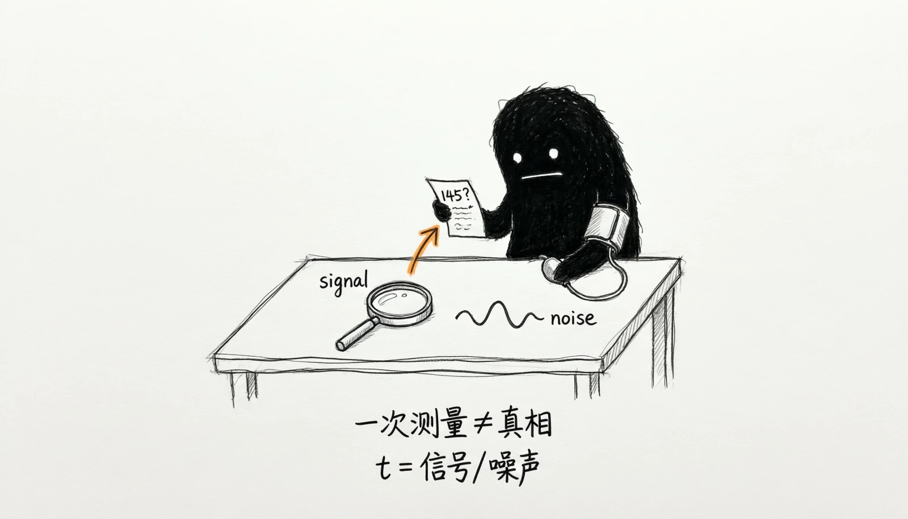
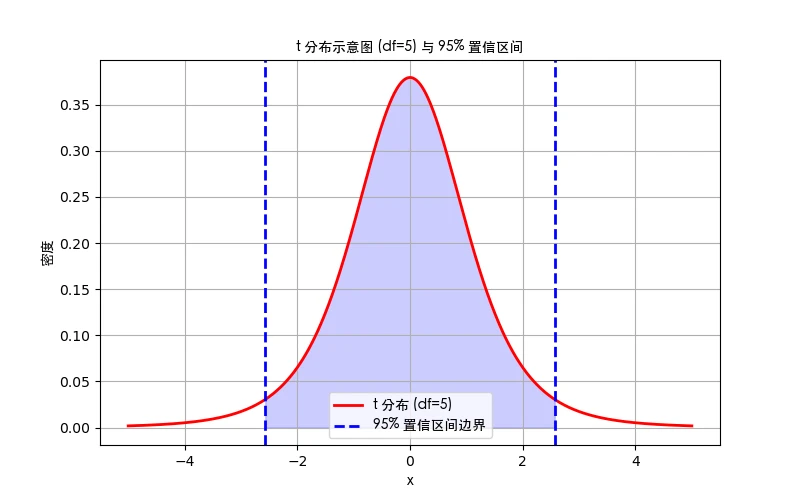
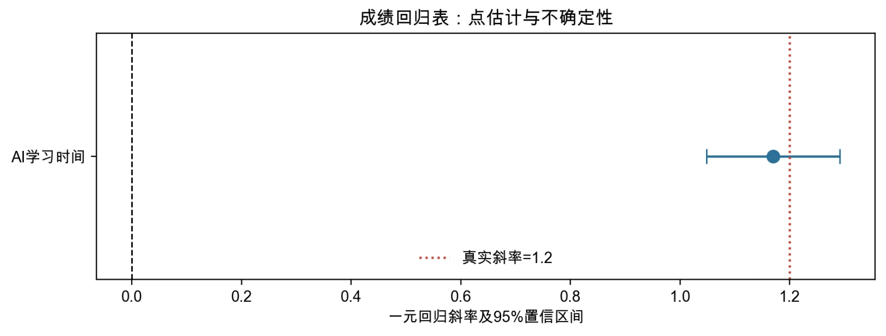
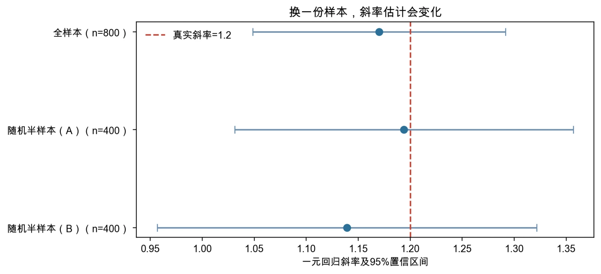

# 第2章 一元线性回归：推断

> “有道之士，贵以近知远，以今知古，以所见知所不见。”
>
> ——《吕氏春秋·察今》

{fig-alt=""}

学完第1章，你已经会从一份样本里算出一条回归线了。把同样的方法用到一份真实的调查数据上，你会得到一个很具体的数字：每周 AI 学习时间每增加 1 小时，课程成绩平均高 **1.17 分**。它来自八百名学生的观测，清清楚楚、有零有整，很容易让人产生一种印象——**我们似乎已经知道了答案**。但先别急着相信它。让我们做一件第1章做过的事情：重新抽一批学生，重新算一次。换一份样本，这个数字还会是 1.17 吗？几乎不会。它可能是 1.09，也可能是 1.24，甚至可能是 1.32。第1章的蒙特卡洛实验已经让你亲眼看到过：同一套估计方法，在不同的样本上给出的答案并不相同。现在把这个观察落到实处——你手上这一份样本，只是无数可能样本中的一个。既然如此，凭什么相信 1.17 就是那个真正想去了解的答案？这就是本章存在的理由。

为什么“估出来一个数”还不够。问题出在一个容易被忽略的事实上：**我们想知道的东西，从来不是 1.17**。我们真正想知道的是，在所有人身上，AI 学习时间与成绩之间到底是什么关系。这个关系客观存在，不以我们抽了哪些学生为转移，我们把它记作$\beta_1$，称为**总体参数**。麻烦在于，$\beta_1$**看不见**——我们不可能把所有学生都测量一遍，更不可能让时间倒流、换一种情形再测一次。我们唯一拥有的，就是手头这八百名学生的数据。于是只能退而求其次：设计一套计算规则，把这八百个观测喂进去，得到一个数字，用它来**推测**那个看不见的$\beta_1$。这套计算规则称为**估计量**，记作$\widehat\beta_1$；把具体数据代进去算出来的 1.17，称为**估计值**。两者的性质完全不同：

> **估计量是随机变量。**

“随机变量”这个词听起来抽象，含义却非常朴素：**在抽样之前，你根本不知道会得到几。** 如果今天抽到的是这八百名学生，你得到 1.17；如果明天抽到的是另外八百名，你会得到另一个数——它不是固定的，它随样本而变，像掷骰子一样，掷之前你不知道点数，掷完才知道。而$\beta_1$恰恰相反：它就像天上的某个天体，位置是确定的，只是我们看不见。两者性质完全不同，一个固定但未知，一个随机且已知（抽样之后）。这个区别正是全部困难的来源：第1章解决的是“怎么算出一个尽可能好的估计”，本章要解决的，是“怎样从这样一个随机的、会变的东西，说出关于那个固定真相的话”。

一条线索：先弄清它会怎么变。既然估计值会变，一个自然的想法就是先把“它会怎么变”弄清楚。它会往哪个方向偏，还是说平均而言正好落在真值上——这是**无偏性**要回答的；它一次会变多少，是轻微抖动还是差之千里——这是**精度**要回答的；这种变化有没有规律、会不会集中在某个范围里——这是**分布**要回答的。一个随机变量，只要知道了它的分布，就几乎等于被彻底看透了。而一旦看透了估计值的分布，很多原本无法回答的问题就变得可以回答：1.17 离 0 有多远，它会不会只是抽样波动偶然造成的假象？如果不做任何假设，我们能说这个关系的取值大概在什么范围内？换一份样本结果变了，这算不算矛盾？本章就是沿着这条线索走的。

**2.1 节**先弄清楚估计值的变化规律——它的中心和宽度；**2.2 节**学会用这把尺子去判断某个关于真相的命题是否站得住脚；**2.3 节**把估计值和它的不确定性合成一句话，直接报告出来。本章会用到一些新的符号和公式，但它们都在讲同一件朴素的事情。如果读的过程中觉得公式太多，不妨停下来问自己一句：这一步是在回答“它会怎么变”，还是在回答“所以该怎么判断”？抓住这条主线，剩下的都是细节。还有一点要提前说明：推断本身不创造信息。样本小、变量的变化少、数据噪声大，推断就会给出很宽的区间和很弱的结论。这不是方法的失败，而是方法在诚实报告数据的限度，理解这一点比记住任何一个公式都重要。

本章仍然只讨论一元回归，好处是你可以把全部注意力放在推断的逻辑上，而不必同时应付新的模型设定；进入第3章以后，同一套逻辑会原样搬到“控制其他变量之后”的多元回归系数上，那时改变的是系数的含义和需要检验的参数组合，而推断的骨架不会变。

## 2.1 抽样分布与标准误

推断的第一个任务，就是把那个“会变的估计值”的变动规律摸清楚。这一节要回答的就是：它围绕什么变化、变化有多大。

### 2.1a 为什么估计值会变化

设总体模型为

$$Y_i=\beta_0+\beta_1X_i+u_i.$$

$\beta_0$和$\beta_1$是固定但未知的总体参数。用一份样本计算得到的$\widehat\beta_0$和$\widehat\beta_1$则会随样本变化。为什么会变？因为样本里装着的是**不同的人**：这一次抽到的是这八百名学生，下一次可能是另外八百名；每个人的成绩都包含一些没有写进模型的因素——学习基础、认知能力、当天的状态——这些因素在样本中的取值不同，拟合出的直线自然也会略有不同。理解“随机变量”最好的方式，是在脑子里做一次假想实验。假设我们有能力**把这项研究重复一千次**：每次重新随机抽八百名学生，每次都用完全相同的公式算一遍斜率。一千次之后，我们会得到一千个数字，把它们画成一张图，就得到了斜率估计值的分布。这个分布称为**抽样分布**（sampling distribution）。

这个名字容易让人误会，以为它是一份数据里的分布；恰恰相反，它是把“再做一次研究”重复很多次之后，估计值自己的分布。它回答了我们最开始关心的两个问题。第一，这一千个数字**平均**落在哪里？如果它们正好围绕真值散开，说明这套估计方法没有系统性的高估或低估——这就是**无偏性**。第二，这一千个数字**铺得有多开**？铺得越开，单次研究的结果就越不可信——这就是**精度**。第1章的高斯—马尔可夫定理说明，在相应条件下，OLS 估计量无偏且在线性无偏估计量中方差最小。无偏性描述抽样分布的中心：

$$E(\widehat\beta_1)=\beta_1.$$

把总体参数想象成一个固定靶心，把每份样本估出的斜率看成一次射击，会更容易理解这句话的分量。无偏意味着**所有弹着点的平均位置落在靶心**，但它完全不保证眼前这一发就打中了靶心，也不保证每一发都靠得很近。估计量的方差描述的是射击的密集程度：方差越小，不同样本给出的结果越集中，我们对单次结果的信心才越有依据。一个讲准不准，一个讲稳不稳，两者缺一不可。这里还要严格区分三个经常被混用的词，它们是本章后半部分一切讨论的地基（表2-1）：

表2-1 总体参数、样本估计量与样本估计值的区别

| 名称 | 指的是什么 | 在本章案例中的取值 | 会不会变 |
|---|---|---|---|
| 总体参数$\beta_1$ | 客观存在的真实关系 | 1.20（我们设定的真值） | 固定不变，但看不见 |
| 估计量$\widehat\beta_1$ | 一套计算规则 | “拿数据算最小二乘斜率” | 是随机变量 |
| 估计值 | 规则在某份样本上的输出 | 1.170 | 抽样后确定 |

把估计值直接称作“真实的斜率”，是初学回归时最常见的错误。它看起来只是措辞上的马虎，后果却不小：一旦把 1.17 当成真相，就会把一次抽样的偶然结果当成确定无疑的规律，进而高估整个结论的可靠性。只要记住“我手里的是估计值，不是参数”，本章后面所有的谨慎就都有了着落。

{fig-alt="抽样分布与双侧检验的临界区域"}

图2-1 抽样分布与双侧检验的临界区域

图2-1 把上面那个假想实验画了出来。可以看到，估计值并不是均匀散落在真值两侧的：绝大多数样本给出的结果集中在中心附近，离真值越远越罕见。这种“中间密、两头疏”的形状，是后面所有推断工具的基础。图中两侧的阴影区域标出了极端结果的概率——本章后半部分讲假设检验时会再回到它。

### 2.1b 标准误：把抽样波动变成一个数字

假想实验给了我们一个漂亮的概念，却有一个致命的现实障碍：我们只做一次研究，看不到那条分布曲线。想想看，如果只能得到一粒沙子，怎么描述整片沙滩的形状？我们显然无法把研究重复一千次，于是只能退而求其次：用这一份样本的信息，去猜那条分布的宽度。这个猜出来的宽度，就是**标准误**（standard error）。它衡量的是，如果把这套抽样和估计过程重复很多次，斜率的估计值通常会偏离中心多远——它回答的正是本章开头那个问题：“一次典型的抽样波动有多大”。在一元同方差模型中，斜率估计量的方差为

$$\operatorname{Var}(\widehat\beta_1\mid X)=
\frac{\sigma^2}{\sum_{i=1}^n(X_i-\overline X)^2}.$$

这个公式的推导不重要，重要的是把它翻译成人话。它是一个**除法**，上面是“坏消息”，下面是“好消息”。**分子$\sigma^2$是误差项的方差**，也就是模型没有解释掉的那部分波动的强弱，它是“坏消息”：世界里看不透的东西越多，答案就越不稳，误差波动越大，标准误越大。

**分母$\sum(X_i-\overline X)^2$度量解释变量自身的离散程度**，是“好消息”：$X$ 在样本中铺得越开、我们观察到的变化越多，斜率就越容易被钉准。反过来，如果班上所有学生使用 AI 的时间都挤在 10 小时附近，那么“多用一小时会怎样”这个问题**几乎没有数据能回答**，即使样本很大，斜率也会估得很不稳。这是初学者最容易忽略的一条：**样本量不等于信息量。** 样本量$n$则通过分母间接发挥作用，观测越多，这个平方和通常越大，精度也就越高。把这三句话合起来，就是本章最实用的三条直觉：噪声大则不准，变异少则不准，样本小则不准。它们解释了为什么同样的方法在不同数据上表现差异巨大，也提醒我们在解读任何一个标准误之前，先去看数据本身长什么样。软件不会直接告诉我们$\sigma^2$，因为它同样未知。常规做法是先用残差估计误差方差：

$$s^2=\frac{\sum_{i=1}^n\widehat u_i^2}{n-2},$$

再把$s^2$代回上面的公式，得到的是估计量的**方差**；**把它开平方，才得到我们真正要用的标准误**：

$$\operatorname{se}(\widehat\beta_1)=\sqrt{\frac{s^2}{\sum_{i=1}^n(X_i-\overline X)^2}}.$$

这里 $\operatorname{se}(\cdot)$ 表示**标准误**，即估计量抽样分布的标准差。

分母中的$n-2$来自自由度的消耗：估计截距和斜率各用掉一个信息，剩下$n-2$个独立信息用来估计误差的波动。这也是为什么样本很小时标准误往往大得惊人——不仅观测少，可用自由度还被参数占去了一部分。有一组区别容易混淆：标准差描述原始观测的离散程度，标准误描述估计量的抽样不确定性。它们名字相近、数值上也可能接近，含义却完全不同。一个班里学生成绩相差很大，未必意味着“AI 使用时间的影响”估不准；是否估得准，还要看样本量、$X$ 的变化范围以及模型剩余误差的大小。反过来，一份成绩高度一致的数据里，斜率也可能估得很稳——因为缺少的是$X$ 的变化，而不是$Y$ 的波动。

软件输出表里这两类数字经常并排列出，读表时若不加分辨，很容易把描述性差异误读成推断精度。最后要提醒的是，标准误不是软件附赠的装饰，也不是一个可以与模型设定脱钩的独立数字。它由模型条件、样本信息和残差波动共同决定。一旦模型设定改变——比如加入控制变量、取对数、允许异方差——同样的斜率也会配上不同的标准误。所以“系数有没有变”和“标准误有没有变”是两个必须分开检查的问题，第5章会专门讨论当标准误本身被算错时会发生什么。

### 2.1c 抽样分布的形状与适用条件

到目前为止，我们知道抽样分布的中心（无偏）和宽度（标准误），但还缺一块：它的**形状**。形状决定了接下来要用哪张表去查**临界值**——在给定的显著性水平下，判断统计量是否“足够极端”的那条界线，因此必须说清楚它在什么条件下成立。若经典线性模型成立，且误差项在给定$X$时服从正态分布，那么 OLS 估计量在有限样本中服从正态分布。这是一个很强的结论：不管样本多小，只要误差正态，斜率的抽样分布就正态。现实中还有一层麻烦：$\sigma^2$未知，上面的$s^2$本身也是从样本估出来的，带着额外的不确定性。用样本估计误差方差以后，把估计值标准化得到的统计量不再服从标准正态，而是服从$t$分布。$t$分布以 0 为中心、左右对称，形状也呈钟形，但**小样本时尾部比标准正态更厚**——多出来的那部分厚度，正是为“我们连噪声的方差都得猜”这件事付出的代价。

自由度越大，$t$分布越接近标准正态；当自由度超过几十以后，两者在常用临界值上的差别已经很小。误差不服从正态时怎么办？在独立抽样、**有限矩**（指随机变量的均值、方差等矩存在且有限，是中心极限定理成立的技术前提）等条件下，中心极限定理保证随着样本量增大，估计量的抽样分布趋向正态，因此大样本通常可以使用正态近似。但这里的“大样本”没有适用于所有数据的固定门槛。教材上说的“$n>30$”只是一个非常粗略的经验说法，它成立的前提是数据相对规整。以下几种情形都会明显削弱近似的质量：存在极端值，使得少数观测主导了平方和；误差分布厚尾，罕见事件的影响被放大；观测在时间上相关，或同一群体内部相关，使得“独立抽样”不成立；样本结构高度不平衡，某些类别只有寥寥几个观测。遇到这些情况，仅凭样本总量大就套用常规临界值，是实践中很常见的失误。

顺着这个思路可以看出，推断的可靠性并不只取决于公式，还取决于数据结构本身。第5章将讨论异方差下的稳健标准误；面板数据、时间序列和聚类抽样数据，则需要与其依赖结构相匹配的标准误。本章后面所有的检验与区间，都以“误差独立、同方差、正态或大样本近似可用”为前提。记住这个前提，比记住任何一个临界值都重要。

> **专栏2-1 钉板实验：为什么“很多小随机”加起来会像正态？**
>
> 如果你去过科技馆，可能见过一台立着的木板，上面密密麻麻钉着排成三角形的钉子，顶端有个漏斗，能把小球一颗颗放下来。小球每碰到一颗钉子，就随机地往左或往右掉一格，然后继续往下碰下一排钉子。最后所有小球落进底部一排小格子里。这就是**高尔顿钉板**（Galton board），19 世纪的英国学者高尔顿设计它，是为了演示一个他自己也感到惊讶的现象：小球最终堆成的轮廓，几乎总是中间高、两边低的钟形——哪怕每一次左右的弹跳都完全是随机的。
>
> {fig-alt=""}
>
> 为什么会这样？先看一颗小球。它最终落在哪个格子，取决于它一路上往右走了几次。假设板子上有$n$排钉子，一颗小球在这$n$次碰撞中独立地做$n$次左右选择，那么“往右走的总次数”可能是 $0,1,2,\ldots,n$ 中的任何一个。这个次数就是它在底部的落点。单独一次碰撞是随机的、不可预测的；但很多次碰撞加起来，结果却呈现出极强的规律。往右走$n/2$次左右是最容易出现的——因为达到这个结果的方式最多；而走极端（几乎每次都往右，或几乎每次都往左）的方式很少，因此罕见。把这两句话用数学写出来，就是著名的**二项分布**，而它的形状正是钟形。
>
> 真正让这个现象变得威力无穷的，是它的一般化。18 世纪的拉普拉斯等人发现：只要是把大量独立的、影响都很小的随机因素加起来，结果就会趋近正态分布——不管每一个单独的随机因素本身服从什么分布。这就是**中心极限定理**（central limit theorem）。注意它的措辞：它说的不是“数据本身是正态的”，而是“**很多小东西的加总，看起来像正态**”。
>
> 现在把这条定理用到我们的问题上，你就能明白它为什么如此重要。斜率的估计值 $\widehat\beta_1$ 本身就是**许多随机影响的一个加总**——它由所有观测的 $Y_i$ 按各自的权重求和得到，而每一个 $Y_i$ 都带着自己的随机扰动 $u_i$。于是，我们实际上是在**把很多个小的随机影响加在一起**。中心极限定理告诉我们：哪怕单个学生的成绩误差并不服从正态，只要观测足够多、彼此独立、没有哪个别观测能独占分量，这个加总的结果就会趋近正态。这样一来，我们就能够用正态分布（或它的近亲$t$分布）去描述估计值的抽样分布，从而查表、算$p$值、构造区间。本章后面所有的推断工具，都建立在这条定理之上。
>
> 但正因为它是“加总”，它也有失效的边界，而这些边界在实际研究中非常容易被忽略。第一，**独立性**是前提：如果观测之间相互关联——比如同班同学的成绩互相影响，或者同一家企业的数据连年重复出现——那么“小随机量”就不是独立相加的，正态近似会明显偏乐观。第二，**极端值**会破坏它：如果少数观测的取值大到能主导整个加总，那么“影响都很小”这一条就不成立。第三，**厚尾分布**（比如金融收益率）收敛得极慢，往往需要大得多的样本才能真正接近正态。第四，当样本量本身很小的时候，加总的项数太少，定理根本还没开始起作用。
>
> 所以，请记住专栏里最重要的一句话：中心极限定理不是一张可以随处使用的通行证，而是一张写明条件的契约。它告诉我们为什么可以近似，也同时告诉我们什么时候不能近似。当你日后使用面板数据、聚类抽样数据或时间序列数据时，正是这些条件出了问题，才需要换上与之匹配的推断方法——这也是第5章和后续章节要处理的内容。

## 2.2 一元回归的假设检验

有了标准误，我们手上就有了一把尺子。这一节要做的，是正式用这把尺子回答一个具体问题：样本里的这个差异，究竟是真实关系的反映，还是抽样波动制造的假象？

### 2.2a 为什么不能直接下结论

先看一个看起来合情合理的想法：既然估计出来的斜率是 1.17，而我们要判断的正是“有没有关系”，那么**1.17 不是明显大于 0 吗？直接说“有关系”不就行了？** 这个想法的问题在于，它忘掉了刚刚花一整节建立的结论：**1.17 会变**。它不是一个可以拿来直接比较的固定事实，而是一次抽样的产物。如果换一份样本得到的是 0.03，你还会说“明显大于 0”吗？如果得到的是 −0.05 呢？更深一层的问题是：**“明显”这个词需要一个参照系。** 1.17 这个数字本身，既不“大”也不“小”，它大不大取决于一次典型的抽样波动有多大。如果典型波动是 0.01，那么 1.17 稳定得令人信服；如果典型波动是 1.5，那么 1.17 完全可能只是噪声。第1章反复强调“统计关系需要谨慎解读”，这里的谨慎就有了具体的形式：**不看噪声，就不能判断信号。** 那么该怎么建立参照系？一个直接的想法是：干脆假设“没有关系”，然后看看数据会不会打脸。这正是假设检验的做法。

### 2.2b 假设检验的构造：从原假设到 t 值

假设检验的核心思路，用一句话概括就是：先假定一个最平淡的可能成立，再拿数据去检验它。若数据与这个假定严重冲突，我们就反过来说“它大概不成立”。这个逻辑对我们并不陌生。数学证明中常用的**反证法**就是同一套路：想证明命题 $A$，先假设 $A$ 不成立，从中推出矛盾，从而反过来确认 $A$ 成立。假设检验借用的是这个结构，但有一处关键区别：**它不是逻辑证明，而是概率判断**。数据不能“证明”原假设为假，它只能是“与原假设很不相容”。这一点后面还会反复强调。现在把这个思路写成正式的形式：设我们要检验的是“AI 使用时间与成绩之间没有关系”，那么把它翻译成关于总体参数的命题：

$$H_0:\beta_1=0,\qquad H_1:\beta_1\neq0.$$

$H_0$称为**原假设**，它代表那个平淡的、需要数据来推翻的假定；$H_1$称为**备择假设**，它代表我们希望数据能够支持的那个方向。写成这样并不只是形式上的约定：它把“AI 使用时间和成绩到底有没有关系”这个含混的问题，明确成了一个可以被数据反驳的命题。如果经济理论在看数据之前就已经明确了方向——比如使用时间只可能提高、不可能降低成绩——也可以设置单侧备择，例如$H_1:\beta_1>0$。单侧的代价是另一侧完全放弃检验能力，因此**必须在看结果之前决定方向**；看完结果再挑一个容易显著的方向，会把误报率悄悄放大到远高于名义水平。零也不是唯一值得检验的值。

研究者常常关心的是某个有理论含义的数量：若理论认为价格弹性应等于 −1，相应的原假设就是$H_0:\beta_1=-1$；若某项政策被认为只会带来微小的效果，也可以检验效应是否超过某个实际重要的门槛。关键是假设值必须来自理论或制度背景，并在看数据之前说明清楚，而不是看到一个估计值之后，反过来把它当成要检验的命题。写假设时还要把**统计命题**与**研究命题**分开，这是初学阶段最容易越界的地方。$H_0:\beta_1=0$说的只是“在所设定的这个一元线性模型里，总体斜率为零”。它并没有直接说“$X$ 完全没有任何作用”：真实关系可能是非线性的，可能被测量误差稀释，也可能因为样本中$X$ 的变化太少而无法识别——这些情况下拒绝不了原假设，并不等于变量之间真的没关系。

反过来，更不能把“拒绝了$H_0$”自动写成“$X$ 导致 $Y$ 变化”，因果结论需要第1章讨论过的零条件均值假设以及更强的识别依据。把这两句话分清楚，是本章最需要带走的一条纪律。

**有了原假设，接下来该怎么办？** 假设我们接受了$H_0:\beta_1=0$这个临时设定，那么在这个假设下，我们观察到的 1.17 应该怎么理解？它当然不可能正好是 0——样本千差万别，即使真实关系真的是零，抽出来的样本也总会给出一个非零的数字。问题在于：1.17 这个偏离，算不算“太远了”？到这里，我们就需要一个尺度了，而这正是标准误的用武之地。一个自然的想法是直接用**距离**：1.17 离 0 有 1.17。但前面已经说过，1.17 这个数字脱离噪声是没有意义的，所以更好的做法是**把距离换算成“多少个典型波动”**：

$$t=\frac{\widehat\beta_1-\beta_{1,0}}
{\operatorname{se}(\widehat\beta_1)}.$$

这就是**$t$ 统计量**。请仔细看它的结构：**分子是信号，分母是噪音。** 分子$\widehat\beta_1-\beta_{1,0}$是估计值与原假设值之间（$\beta_{1,0}$ 就是原假设中设定的那个取值，检验“斜率为 0”时它等于 0）的距离，在我们的例子里就是$1.170-0=1.170$，它回答的是“**观察到的效应有多大**”；分母$\operatorname{se}(\widehat\beta_1)=0.0619$是一次典型抽样波动的幅度，它回答的是“**这个观察值有多不可靠**”。两句话合起来，$t$ 值回答的是一个更有信息量的问题：**这个效应，相当于几个典型波动？** 本章案例给出的答案是

$$t=\frac{1.170}{0.0619}\approx18.91.$$

将近 19 个典型波动。这里要追问一句：为什么这个公式用的是**相除**而不是相减？这恰恰是它最容易被忽略、也最值得体会的地方。不妨换一个日常例子。假设有人说：“我们班同学的平均身高比全国平均高 5 厘米。”这句话能不能说明这个班特别高？只看这 5 厘米，是判断不了的。关键要看这个班有多少人、个体差异有多大。如果这个班有 500 人，而且是从全国随机抽的，那么高出 5 厘米几乎不可能只是偶然；如果这个班只有 3 个人，那么高 5 厘米一点都不稀奇。$t$ 值做的正是这件事：它把“差多少”换算成“差多少个标准差”。在身高的例子里，统计课上常说的是“比平均身高高 2 个标准差”——这个说法之所以比“高 5 厘米”有用，是因为它已经消化掉了单位和波动幅度。回到回归。

$t=18.91$ 的含义是：观察到的斜率，偏离零斜率假设将近 19 个“抽样波动的单位”。这个偏离大到什么程度？在现实数据中，这种量级的结果几乎不可能由随机抽样凭空制造出来。反过来，如果标准误是 1.5 而不是 0.0619，那么$t$ 值就只有 0.78，连一个典型波动都不到——那时的正确判断就是：**这份数据根本不足以说明问题**，而不是“效应很小”。这正是初学者最容易犯错的地方：看到估计值大就以为结论强。其实决定结论强弱的，从来不是估计值单独有多大，而是它与噪声的比例。从 t 值到 p 值：换成概率的语言。 $t=18.91$ 已经很有说服力了，但它还只是一个“多少倍”的数字。研究者之间交流时，通常希望用一个统一的、不受具体案例影响的标尺，于是就有了**$p$ 值**。

要理解$p$ 值，先要接受一个事实：即使原假设完全成立，我们抽到的样本也不会给出正好等于 0 的斜率。样本有随机性，1.17、0.3、−0.5 都可能出现，只是概率不同。把这些可能的结果连同它们的概率画成一张图（就是 2.1 节讲过的抽样分布），我们就知道在“真的没关系”的世界里，多大的斜率算是罕见的。$p$ 值衡量的正是这个罕见程度：

> $p$ 值 = 在原假设成立的前提下，观察到当前这么极端、或更极端结果的概率。在本章案例中，$p$ 值远小于万分之一。它的意思是：如果 AI 使用时间与成绩真的毫无关系，那么靠抽样波动撞出“斜率至少 1.17”这种结果的机会，小到几乎不存在。既然这件事几乎不可能发生，而它偏偏发生了，那么“毫无关系”这个假定就站不住脚了。

**$t$ 与 $p$ 是什么关系？** $t$ 值和$p$ 值是**同一件事的两种刻度**，一一对应，可以互相换算，对照见表2-2：

表2-2 $t$ 值与 $p$ 值：同一件事的两种刻度

| | $t$ 值 | $p$ 值 |
|---|---|---|
| 回答的问题 | 偏离相当于几个典型波动？ | 这么极端的偏离有多罕见？ |
| 计量单位 | “倍数”（无单位） | 概率（0 到 1 之间） |
| 典型取值 | $t$ 越大越极端 | $p$ 越小越极端 |
| 查阅方式 | 与临界值比较 | 与显著性水平$\alpha$比较 |

表中的 $\alpha$ 是**显著性水平**，即我们事先允许的“误报概率”，常用 0.05。之所以需要两个，是因为它们各有各的用处。$t$ 值直观地告诉你“信号是噪声的多少倍”，适合在讨论中建立感觉；$p$ 值把大小不一的案例统一到同一把概率标尺上，方便约定一个通用的判断门槛。图2-2 把这两者放在了一起：$t$ 值对应横轴上的位置，$p$ 值对应那个位置之外、曲线下方的面积。

{fig-alt="$t$ 值：信号与噪声的比"}

图2-2 $t$ 值：信号与噪声的比

有了它们，判断就有两条等价的路。**临界值法**把$|t|$与$t$分布的临界值比较：在 5% 显著性水平、自由度$n-2$下查出临界值，若$|t|$超过它，就拒绝$H_0$。**$p$值法**直接看$p<\alpha$是否成立。两种做法在数学上完全等价，给出同样的结论；区别只在于一个把“多远算远”写成固定门槛，另一个把当前结果在分布中的位置直接报出来。

{fig-alt="小样本下的$t$分布"}

图2-3 小样本下的$t$分布

图2-3 展示了小样本下$t$分布与标准正态的对比：两侧尾部更厚，同样的显著性水平要求更大的临界值。这直观地说明了为什么在用样本估计误差方差之后，判断标准必须相应放宽。

$p$ 值最容易被误读的三个地方。$p$ 值是整章最容易被误读的概念，而且错法相当固定，值得逐条拆开。第一，$p$ 值不是“原假设为真的概率”。 $p=0.03$ 不意味着“没关系这件事有 3% 的概率为真”。它是**在假定原假设为真的条件下**算出来的结果概率。把条件反过来读，是逻辑上的颠倒——就像说“如果他是凶手，现场会有他的指纹；现场有指纹，所以他一定是凶手”一样。第二，$p$ 值不是“结果由偶然造成的概率”。任何一次结果都带有偶然成分。$p$ 值衡量的只是“这种偶然能制造出这么大的差异，有多罕见”。

第三，不显著不等于证明原假设成立。检验的逻辑是“证据不足以定罪”，而不是“宣判无罪”。样本太小、噪声太大时，真实存在的效应同样可能被放过。这时$p$ 值很大只说明**数据没有提供足够强的反对证据**，不能反过来当作“效应不存在”的依据。这两个说法的差别，在实务中经常被压缩成一句含糊的“没有显著影响”，而它恰恰是很多错误结论的源头。一次规范的检验可以按六步推进：先写出$H_0$与$H_1$，再在看数据之前设定显著性水平$\alpha$，然后确认所用标准误和参考分布，接着计算$t$ 值，报告$p$ 值或与临界值比较，最后用研究问题的语言解释结论及其边界。以本章案例为例，$\widehat\beta_1=1.170$、标准误为 0.0619，于是$t\approx18.91$。但请注意结论的写法：我们说的是“**数据与零斜率假设很不相容**”，而不是“AI 使用时间一定提高成绩”——后者需要的是识别策略，而不是一个更大的$t$ 值。

> **专栏2-2 “Student”是谁？——$t$ 分布的来历**
>
> 1908 年，一份署名“Student”的论文发表在《生物统计》上，题为《均值的可能误差》。论文处理的是一个当时很棘手的问题：当样本很小、而且连误差的方差都不知道时，还能不能做统计推断？这篇论文后来被认为奠定了小样本推断的基础，而“Student”其实是一个笔名——他的真名是威廉·戈塞特（William Sealy Gosset）。
>
> 戈塞特的身份很有意思：他不是大学教授，而是**都柏林吉尼斯酿酒厂**的化学师。他的日常工作之一是检验大麦和啤酒的质量，而酿酒过程中的样本往往很小——一批麦芽只有几个测量值，一批啤酒只有几个样品。用当时的方法（假定方差已知的正态分布）去处理这么小的样本，结论经常不可靠。戈塞特在酒厂里做了一个今天看起来很现代的事情：他用蒙特卡洛的方法，**亲手算出大量小样本的经验分布**，观察它到底长什么样。他发现，当样本很小时，标准化后的统计量并不服从正态分布，而是服从一个尾部更厚、更分散的分布。这就是后来的$t$ 分布。
>
> 为什么必须用笔名发表？因为吉尼斯公司不允许员工对外发表研究成果——酿酒配方能保密，统计方法同样被视为商业资产。公司最终同意他发表，条件是必须用假名，以免暴露公司身份。“Student”这个笔名因此被沿用下来，并在统计学史上留下了一个有趣的印记。
>
> 那么，$t$ 分布为什么会比正态分布“尾部更厚”？关键就在于**方差也是猜出来的**。在使用正态分布时，我们假定自己知道误差的波动有多大；而现实中，我们是从同一份样本里**估计**出这个波动$s^2$的。估计本身也会波动：这份样本恰好抽到几个极端值，$s$ 就会偏大；恰好抽到几个特别一致的观测，$s$ 就会偏小。这意味着我们的判断里叠加了**两层不确定性**——一层来自估计斜率，一层来自估计噪声的大小。$t$ 分布把第二层不确定性也算了进去，代价就是把尾部加厚：因为多了一层不确定，我们就必须对“极端值”更宽容一些，判断门槛也就相应提高。
>
> 这也解释了$t$ 分布中**自由度**的含义。在计算$s^2$时，我们用到了样本均值，而样本均值本身是从数据里算出来的，它“占用”了一份信息。因此$n$ 个观测在估计完截距和斜率之后，只剩下$n-2$ 份独立信息可以用来衡量误差的波动。自由度越小（样本越小），$t$ 分布越胖，临界值越大；自由度增大时，$t$ 分布逐渐向标准正态靠拢，当自由度超过几十以后，两者在常用临界值上已经几乎没有差别。所以在样本足够大时，用$t$ 还是用正态，结论通常完全一样；而在小样本里，这个区别可能决定结论。
>
> 下一次当你在软件输出表里看到“$t$ 值”这一列时，不妨回想一下：这个字母代表的不是某个抽象符号，而是一位在酿酒厂里对着小样本发愁的化学师，以及他为了把话说得诚实一点而发明的一套校正方法。

> **专栏2-3 一个数字引发的百年争论：$p$ 值该不该用？**
>
> $p$ 值是现代科学中使用最广、也争议最大的统计工具。它的历史几乎和$t$ 分布一样长，而围绕它的分歧至今没有平息。了解这段争论，不是为了让你放弃$p$ 值，而是为了让你**知道它到底能承担什么、不能承担什么**。
>
> 争议的起点是两种不同的检验哲学。20 世纪 20 年代，罗纳德·费希尔（Ronald Fisher）在农业试验中推广了$p$ 值的做法：计算“在原假设下出现当前或更极端结果的概率”，把它作为一个**连续的证据强度指标**——$p$ 值越小，说明数据与原假设越不相容。费希尔本人反对设定一个机械的阈值，他认为研究者应当结合具体情境判断证据的分量。几乎同时，奈曼（Jerzy Neyman）和皮尔逊（Egon Pearson）提出了另一套框架：事先选定一个显著性水平$\alpha$，把它当作**长期决策规则**——在反复使用这套规则时，控制犯错的频率。这套框架关心的是“多次决策中会错百分之几”，而不是“这一次的证据有多强”。
>
> 问题在于，后来的教科书和使用者把两套思路**混在了一起**：既借用奈曼-皮尔逊的固定阈值（0.05），又用费希尔的“证据强度”语言去解释单个$p$ 值。这种混合在教学中被固化下来，成了今天的通行做法——一句“$p<0.05$ 就是显著”，同时承载了两种互不兼容的含义。
>
> 后果在实践中逐渐显现。研究者在“发表需要显著”的压力下，倾向于反复尝试不同的设定、样本和变量，直到$p$ 值降到 0.05 以下，然后只报告成功的那一次。这种做法被称为“$p$ 值操纵”或“发表偏倚的温床”，它并不违反任何单次检验的数学，却系统性地抬高了假阳性率——如果试了 20 次，即使真相是零，也有大约三分之二的概率至少撞出一次“显著”。这正是近年来心理学、医学乃至经济学中**可重复性危机**的重要技术原因之一：一批已发表的显著结果，在其他研究者用同样的方法重做时无法复现。
>
> 2016 年，美国统计协会（ASA）罕见地就一个统计概念发布正式声明，明确列出对$p$ 值的六条常见误用，并强调“$p$ 值不能衡量效应的大小或重要性”“单凭$p$ 值不足以证明一个模型或假设为真”。2019 年，数百位科学家在《自然》上联名倡议，建议不再使用“统计显著”这一说法，以免把连续的证据压缩成二元判断。与此同时，也有学者主张$p$ 值不应被抛弃，问题不在于工具本身，而在于使用方式。
>
> 这场争论给我们三点可以直接用起来的提醒。第一，$p$ 值只是证据的一部分，应当与效应量、置信区间、研究设计和数据质量放在一起看。一个显著但量级微不足道的效应，和一个不显著但区间允许重要效应的结果，都需要被如实报告。**第二，报告要有“全部尝试”的自觉。** 如果换过模型、删过样本、试过多个结果变量，这些都应当写出来，而不是只呈现最终版本。第三，不要把$p<0.05$ 当成研究结论的终点。它是一道程序性的门槛，不是“真相已被确认”的印章。本章最后两节讨论的置信区间与规范结论写法，正是为了把单一门槛还原成更完整的证据陈述。

### 2.2c 两类错误、功效与结论边界

假设检验给出的是一个“是或否”的判断，而任何基于样本的判断都可能出错，并且错误不止一种。

**第一类错误**是在$H_0$为真时错误地拒绝了它，也就是把不存在的关系报成了存在。显著性水平$\alpha$控制的正是这种长期误报的概率——当你设定 5% 时，意味着在“真的没关系”的世界里反复做研究，长期大约有 5% 的次数会得出“有关系”的结论。**第二类错误**是在$H_0$为假时没有拒绝它，也就是漏掉了一个真实存在的关系。把这两种情况与两种判断结果并排放在一起，可以得到表2-3这张完整的对照表：

表2-3 检验结论与真实情况的四种组合

| 真实情况 | 拒绝$H_0$ | 不拒绝$H_0$ |
|---|---|---|
| $H_0$为真 | 第一类错误（误报） | 正确判断 |
| $H_0$为假 | 正确判断，形成检验功效 | 第二类错误（漏报） |

**检验功效**（power）是指在效应确实存在时成功发现它的概率，它与第二类错误互补。功效由三个因素共同决定：真实效应的大小、样本量、以及数据的噪声水平。效应越大、样本越多、噪声越小，功效越高。这也解释了一个常见困惑——为什么同样一个效应，在一项研究里显著、在另一项研究里不显著。差别往往不在于“效应有没有”，而在于那项研究**有没有足够的能力把它从噪声里辨认出来**。把$\alpha$从 5% 降到 1% 会减少误报，但在样本量和真实效应不变时，判断门槛提高了，漏报也会相应增加。因此**显著性水平不是越小越好**，它是一种事先约定的错误管理规则：研究者根据这项判断的后果，在两类错误之间做出取舍。在探索性研究中漏掉一个可能的效应代价较高，在政策建议中误报一个不存在的效应代价较高，两者的合理选择并不相同。无论选择哪一个，都应当在看数据之前定下，并在报告中如实写明。

> **专栏2-4 “疑罪从无”：两类错误与法律的类比**
>
> 假设检验的逻辑，和刑事审判惊人地相似。理解这个类比，能帮你一下子抓住好几个容易混淆的地方。
>
> 在刑事审判中，有一个基本原则：**疑罪从无**——在证据不足以证明被告有罪之前，应推定其无罪。把这个原则翻译成统计语言，简直是一一对应：**原假设 = “被告无罪”**（那个平淡的、需要证据来推翻的假定）；**备择假设 = “被告有罪”**；**证据 = 样本数据**；**判决 = 拒绝或不拒绝原假设**。
>
> 顺着这个类比，两类错误立刻有了非常具体的含义。**第一类错误**就是**冤枉好人**：被告本来无辜，却被判有罪。**第二类错误**则是**放过坏人**：被告确实有罪，却因为证据不足被判无罪。我们当然希望两种错误都不发生，但现实中做不到——降低任何一类的概率，通常都要以提高另一类的概率为代价。
>
> 那么司法体系是怎么取舍的？它明确选择了**宁可放过，不可冤枉**：把“定罪”的门槛设得很高（在英美法系中要求“排除合理怀疑”），目的正是把冤枉好人的概率压到极低。代价也很明确——一些真正有罪的人会因为证据不够而被释放。这个取舍不是疏忽，而是**刻意的价值选择**。假设检验里的显著性水平$\alpha$，正是同一个取舍的统计版本：把$\alpha$ 设得越小，“定罪”的门槛越高，冤枉（假阳性）越少，放过（假阴性）越多。
>
> 这个类比还顺手澄清了三个高频误解。
>
> 第一，为什么结论是“不拒绝”而不是“证明无罪”。法庭判“无罪”时，真正的含义往往是“证据不足以定罪”，而不是“查明了他确实没做”。这一点在司法上被反复强调，在统计上却常被忽略：$p$ 值大只说明**现有证据不足以推翻原假设**，不等于原假设成立。样本太小、噪声太大，都可能导致“证据不足”——而“证据不足”从来不是“清白”的同义词。
>
> 第二，为什么不能一边看证据一边放宽标准。没有人会接受这样的庭审：先看被告像不像犯人，如果证据不够就悄悄把定罪门槛降低一点。统计上同样如此——**显著性水平必须在看数据之前设定**，事后根据结果调整门槛，等于在司法上“先定结论再改标准”，会让误判率失控。
>
> 第三，为什么“影响很大”和“证据充分”是两回事。一个被告是否真的有罪（真相），和他是否会被定罪（判决），是两个不同的问题。同理，一个效应是否真实存在，和一个研究是否有能力把它检出来，也是两个问题。一个真实但微弱的效应，在样本很小时很难被“定罪”；一个完全不存在的关系，在反复尝试之后却可能被“冤枉”。这就是 2.2c 讲的两类错误与功效。
>
> 类比到此也有它失效的地方，值得一提。司法审判处理的是**个案**，它的取舍建立在“错判一个人不如放过一些人”这样的伦理判断上；而统计检验处理的是**反复执行的程序**，$\alpha$ 的含义是长期频率，而不是某一次判决的对错。此外，司法有“无罪推定”作为明确的默认立场，而统计上原假设的选择本身就是一个需要论证的决定——选错了原假设，整场审判的框架就偏了。所以类比是用来建立直觉的梯子，爬到位置之后，还是要回到统计本身的定义上。最后提醒一句本章反复出现的边界：**统计显著不等于实际重要**——显著性只回答“样本证据与某个假设值是否相容”，不回答“这个效应值不值得关心”，也不回答“这个关系是不是因果”。本章最后一节会用一个完整的例子演示这三层该怎么分开写。

## 2.3 置信区间与统计结论

假设检验给出的是一种“是或否”的判断：数据与零斜率假设相容吗？但研究者真正需要向读者交代的，往往不是这个二元结论，而是**这个参数可能是多少**。置信区间正是为回答这个问题设计的工具，它把点估计和不确定性合并成一句可以直接说出口的话。

### 2.3a 从点估计到区间估计

先说一个朴素的想法。既然我们知道 1.17 会变、知道一次典型波动是 0.0619，那么与其硬邦邦地报告“1.17”，不如改口说：“大致在 1.17 附近，上下浮动零点几个单位。” 置信区间就是这个想法的精确化版本。它的构造十分直接：以点估计为中心，向两侧各展开一段由标准误决定、并乘以一个临界值的距离。

$$\widehat\beta_1\ \pm\ t_{1-\alpha/2,\,n-2}
\operatorname{se}(\widehat\beta_1).$$

式中的 $t_{1-\alpha/2,\,n-2}$ 是 $t$ 分布的**临界值**：下标里的 $1-\alpha/2$ 表示单侧尾部留出 $\alpha/2$ 所对应的分位点，$n-2$ 是自由度。

看懂这个式子，就掌握了区间几乎所有的性质。**中心是点估计**，它仍然是我们的最佳猜测。**宽度由标准误和临界值共同决定**：标准误越大，说明数据信息越少，区间越宽；临界值越大（**置信水平**越高——置信水平是区间长期覆盖真值的比例，常用 95%），我们要求的把握越大，区间同样越宽。把标准误的影响展开，就得到三条与上一节完全一致的推论：样本量更大、残差波动更小、$X$ 的变化更多，都会让区间收窄。区间只是把标准误翻译成了参数的可能范围。而临界值那部分则提醒我们一件容易被忽略的事：区间的宽度同时反映两件事——数据提供了多少信息，以及研究者选择了多严格的覆盖标准。这两种来源必须分开看。把置信水平从 95% 提高到 99%，区间会变宽，但这并不意味着数据质量变差了，只是我们要求的把握更大了。因此比较两项研究的区间宽度时，必须先确认它们用的是同一个置信水平，否则比较没有意义。

**95% 到底是什么的 95%？** 置信区间的含义需要格外小心地表述，这也是初学者最容易含混带过的地方。在频率学派框架下，**参数是固定的，随样本变化的是区间本身**，95% 置信区间的准确解释是：

> 如果按照同一套抽样和构造程序把研究重复很多次，长期来看约有 95% 的区间会覆盖那个固定的真实参数。注意这句话里“95%”修饰的是**区间**，不是**参数**。对于眼前已经算出的这一个具体区间，更严谨的说法是：“它给出了一组与数据和模型相容的参数值。”

{fig-alt="置信区间：一张网能罩住什么"}

图2-4 置信区间：一张网能罩住什么

用撒网来理解（图2-4）会比较直观：每一次撒网（每一份样本）都会捕到一个不同的范围，我们不知道眼前这一网有没有罩住那条鱼（真实参数），但可以保证这个撒网程序**长期来看有 95% 的成功率**。区间宽窄则告诉我们这一网的覆盖面有多精细——网撒得太大，罩住的可能位置范围就广，信息量自然下降。常见的误读是“参数有 95% 的概率落在当前区间内”。这句话把参数说成了随机变量，与频率学派的设定不符——参数不掷骰子，掷骰子的是我们抽到哪一份样本。日常交流中这种说法随处可见，但在正式报告和对学生的训练中，区分“程序的长期覆盖率”与“这一次的相容集合”是必要的。需要说明的是，在贝叶斯框架下，确实可以给出“参数落在某个范围内的概率”这样的陈述，但那需要先设定先验分布，属于另一套推断体系，不在本章范围内。

### 2.3b 置信区间与t检验的关系

在使用相同标准误和相同显著性水平的前提下，双侧$t$检验与置信区间给出的结论必然一致，它们其实是同一件事的两种说法。判断规则很简单：

> 若 0 落在 95% 置信区间之外，就会在 5% 水平拒绝$H_0:\beta_1=0$；若 0 落在区间之内，就不能拒绝。这不是巧合，而是因为区间正是由“**哪些假设值不会被拒绝**”构成的集合——把每一个可能的候选值都拿来检验一遍，通不过的那些落在区间外，通得过的落在区间内。理解这一层，你就能明白为什么两者永远同步，也就能在写作时根据需要自由选择报告方式。可以用一组具体数字来体会两者的分工。假设某研究得到$\widehat\beta_1=1.20$、标准误为 0.30，大样本下 95% 区间约为

$$1.20\pm1.96\times0.30=(0.61,1.79).$$

区间不包含 0，因此与 5% 双侧检验的拒绝结论一致。但**区间还提供了检验没有说出的东西**：与数据相容的正向关系可能小到 0.61，也可能大到 1.79，这个范围跨越了“几乎无足轻重”和“相当可观”两种截然不同的解读。更妙的是，同一个区间还能回答检验没有提出的问题。如果理论认为该系数应当等于 1，那么由于 1 落在区间内，同样这份数据在 5% 水平上无法拒绝$H_0:\beta_1=1$。换句话说，同一份估计结果可以与某些假设值相容，却与另一些假设值不相容。而如果只报告“显著”或“不显著”，这个丰富的信息就被压缩成了一个比特。正因如此，置信区间在区分统计显著与实际重要时特别有用。

一个**极窄但紧贴 0** 的区间，可能意味着效应确实存在，却小到没有实际意义；一个**很宽的区间**即使不包含 0，也可能同时允许“影响微乎其微”和“影响十分巨大”两种情形，说明这项研究其实还不足以支持任何有力的判断。因此，研究报告不应只问“区间是否跨过 0”，还要问“区间允许的数值范围里，哪些具有经济意义，哪些没有”。如果整个区间都落在无实质意义的范围内，那么即便它不含 0，结论的实际价值也有限；如果区间宽到横跨两种相反的解读，那么正确的表述是承认证据尚不充分，而不是抓住“显著”这个标签。

### 2.3c 怎样写出规范结论

规范的结果表达有固定的要素，可以概括为一条顺序：**点估计—不确定性—统计判断—现实含义—解释边界**。五者缺一，读者就不得不自己去猜缺失的那部分，而这往往正是误读的来源。先看一个完整的示例：

> 在该样本的一元回归中，每周 AI 学习时间每增加 1 小时，课程成绩平均高 1.20 分（标准误 0.30，95% 置信区间为 0.61 至 1.79）。样本结果与总体斜率为 0 的假设不相容。该结果描述的是两个变量的样本线性关系；由于没有控制认知能力等潜在混杂因素，不能据此断言增加 AI 使用会使成绩提高。这段话依次交代了：效应有多大、有多不确定、统计判断是什么、这个量级意味着什么、以及它不能被解释成什么。再对照一种常见的写法：

> AI 使用对成绩有显著正向影响。这句话没有错，但它把点估计、不确定性、量级和因果边界全部省略了。读者既不知道影响有多大，也不知道这个判断有多稳，更可能误以为作者已经确立了因果关系。“显著”只是一个判断标签，它不承载任何关于大小和含义的信息。需要补充的是，规范报告并不要求把上述每个要素都写成独立的一句。面对不同读者，可以调整详略：面向同行时可以更紧凑，面向政策读者时可能需要把现实含义展开得更充分。但无论详略如何，**“能不能被解释成因果”这一条边界必须写明**，因为它是读者最容易自行越界的地方，也是作者最不该沉默的地方。这套写法还有一个额外的好处：它为第3章做好了接口。当模型加入控制变量以后，同样的五要素结构依然适用，只是“现实含义”一段需要解释为什么系数会从 1.17 变到 1.27，以及这个变化说明了什么。推断的语言不变，改变的是对系数的经济解释。

## 2.4 案例实践：一张成绩回归表告诉了我们什么

### 2.4a 案例背景

本案例沿用课程库原有的“读懂成绩回归表”设计，并把模型严格限定在一元回归，以便把全部注意力放在推断本身。教学数据来自一个参数完全已知的模拟世界：每周 AI 学习时间由一个设定的分布生成，课程成绩则按

$$score_i = 70 + 1.20 \times ai_i + u_i,\qquad u_i\sim N(0,\,5.5^2)$$

构造，共 800 名学生。这样一个设计有两个别处难以同时具备的优点。第一，**真实斜率 1.20 是我们自己设定的**，因此可以拿着软件的估计结果与真值对照，亲眼看到估计值与参数之间确实存在差距，而不必依赖教科书上的断言。第二，**整个数据生成过程是可复现的**，随机种子固定之后，任何人运行同一段代码都会得到完全一样的数字，这让“手工核对软件输出”这类练习有了确定的答案。之所以选择成绩回归表作为载体，还因为它最贴近学生的真实处境。无论是课程作业、毕业论文还是日后读到的期刊论文，一元回归表都出现得极为频繁，而它恰恰是最容易被误读的一类表格——许多人只扫一眼星号，就把整张表的信息量丢掉了。本案例的目标正是把这张表从头到尾读一遍，让每一个数字都找到它的出处和含义。与前两章案例的关系也值得一提。

第1章的蒙特卡洛案例关心的是“估计量在重复抽样中的行为”，重点是估计方法本身的性质；本章案例则把视角收回到**一次具体的研究**上，关心“手头这一份数据能支持多强的结论”。两者构成一个完整的循环：第1章说明方法在长期操作中值得信任，本章说明在单次研究中这份信任应当如何被诚实地折算成结论的强度。最后需要声明案例的边界。这里的所有数字都来自模拟数据，它的作用是训练读取和核对回归表的能力，不代表现实中 AI 学习工具对成绩的真实影响。模拟世界的设定也比现实干净得多——没有遗漏变量、没有测量误差、误差同方差且正态——正因为干净，它才适合作为推断逻辑的第一站；而这些条件在现实中是否成立，是第5章要处理的问题。

### 2.4b 案例要解决的问题

本案例围绕三个问题展开。第一，回归表中的系数、标准误、$t$ 值、$p$ 值和置信区间分别表达什么，它们之间有什么可以相互验证的关系？第二，如何用这些数字回答一个具体的研究问题，并写出符合 2.3c 五要素规范的结论？第三，换一份样本以后，斜率会怎样变化，而标准误和置信区间能否合理地描述这种变化？

### 2.4c AI工作流准备

运行程序之前，先写下自己的预测：斜率的符号应该是什么，$t$ 值大致应当由哪两个数字相除得到，95% 置信区间是否会包含 0，半样本的斜率会比全样本更稳定还是更不稳定。把预测写下来，是这套工作流中最容易被跳过、也最有价值的一步——它把“看结果”变成“检验自己的理解”。随后让 Agent 做只读检查：确认数据生成过程、随机种子、回归式和输出路径，提出一份运行计划。确认计划之后执行，把预测、实际输出、核对过程和**未采纳的 Agent 建议**一并写入`ai_log.md`。最后一项尤其重要：Agent 常常会给出听起来合理但与本课程设定不符的解释，识别并拒绝这类建议，本身就是一次很好的训练。需要明确的是，Agent 可以承担运行代码、整理表格、检查数字一致性这些工作，但有三项判断必须由学生自己完成：统计显著与实际重要性的区别，为什么抽样波动不等于模型失效，以及为什么一元回归的结果不能自动解释为因果效应。这三项构成了本章的核心能力，把它们交给 Agent，等于放弃了这一章。

不用 AI 也可以完成。上面这套流程是**选用 AI 路线时**的做法，不是必做要求。不使用任何 AI 工具时，做法是：先写下同样的四条预测（斜率符号、$t$ 值由哪两个数相除、区间是否含 0、半样本是否更不稳定）；然后打开 `code/python/ch02/01_simple_inference.py`（或 Stata 版 `.do`），自己读回归式与输出路径，运行脚本；逐条核对预测与实际输出。不懂的命令查官方文档。最后把预测、实际输出和差异原因写成普通笔记即可，不必使用 `ai_log.md`。

### 2.4d 实践任务

**任务1：读懂一元回归表。** 估计课程成绩对 AI 学习时间的一元回归，整理系数、标准误、$t$ 值、$p$ 值和 95% 置信区间，报告样本量与$R^2$。表中每一个数字都要能说出它是怎么来的。

**任务2：手工核对推断。** 写出$H_0:\beta_1=0$，用系数除以标准误核对$t$ 值，再用“估计值 ± 临界值 × 标准误”核对置信区间。说明$t$ 检验、$p$ 值和置信区间三者给出的结论是否一致，并把估计值与已知的真实斜率 1.20 对照。

**任务3：观察样本波动。** 把样本随机平分为两组分别估计同一模型，再重复若干次切分。比较点估计、标准误和区间覆盖情况，解释为什么点估计会变，而推断结论仍可能保持相容。

**任务4：写出规范结论。** 按 2.3c 的五要素结构，为任务1的结果写一段不超过 200 字的结论，并用一句话说明这个结论为什么不能被解释成因果效应。

> 📁 配套代码包：
> - Stata：`code/stata/ch02/01_simple_inference.do`
> - Python：`code/python/ch02/01_simple_inference.py`
> - AI Agent任务卡：`code/ai_cards/ch02_ai_task_card.md`
>
> 提交产出：1张回归表 + 1张系数区间图 + 1张样本波动图 + 300字结果解释 + 可复现代码 + `ai_log.md`

### 2.4e 结果讨论

程序使用 800 个教学观测，估计`score`对`ai`的一元回归。Python 输出如表2-4 所示。

表2-4 案例回归结果的完整报告

| 参数 | 估计值 | 标准误 | $t$值 | $p$值 | 95%置信区间 |
|---|---:|---:|---:|---:|---:|
| 截距 | 70.241 | 0.488 | 143.896 | <0.001 | (69.283, 71.200) |
| AI学习时间 | 1.170 | 0.062 | 18.906 | <0.001 | (1.049, 1.292) |

上表报告的是 Python 版的输出。Stata 版使用**相同的数据生成过程与参数**，但两者的随机数生成器不同、抽到的样本不同，因此你会看到不同的数字：本例 Stata 的 AI 系数为 **1.229**（Python 为 1.170），标准误为 0.064。**系数方向、显著性、置信区间是否覆盖真值 1.20 这些结论完全一致**——这正是本章要说明的：换一份样本，数字就会变。

先看与真值的对照。真实斜率是我们自己设定的 1.20，样本给出 1.170，低了 0.03，而置信区间 (1.049, 1.292) 恰好覆盖了 1.20（图2-5）。这符合我们对抽样波动的预期：估计值不会恰好等于真值，而区间给出了一个包含真值的相容范围。

再看数字自洽性：手工计算$1.170/0.0619\approx18.91$，与软件输出的 18.906 相符（**表中的标准误已四舍五入为 0.062**，用它反算得到 18.87，与软件输出对不上——做这类自洽性检查时要用未舍入的原始输出，这也是为什么报告表格的舍入位数要交代清楚）；由“1.170 ± 1.96×0.0619”得到的区间也落在 (1.049, 1.292) 附近（软件因用$t$ 临界值而略宽）。当一个估计值、标准误、$t$ 值和区间能够相互对上时，说明这张表在内部是自洽的；如果对不上，首先要怀疑的是读错了行或用了不同的标准误口径。样本量为 800，$R^2=0.309$。这个$R^2$说明 AI 使用时间单独解释了成绩变异的大约三成，剩下七成来自模型没有写出的因素。它同时提醒我们，**一个高度显著的系数并不意味着模型解释力强**：本例中$t$ 值接近 19，$p$ 值远小于 0.001，但$R^2$ 并不高。显著性和解释力是两个不同的问题，把它们混为一谈是读表时另一个常见的失误。

{fig-alt="一元回归中的点估计与95%置信区间"}

图2-5 一元回归中的点估计与95%置信区间

{fig-alt="换一份样本，斜率估计如何变化"}

图2-6 换一份样本，斜率估计如何变化

接下来看样本波动（图2-6）。固定一次随机切分，两个半样本（各 400 个观测）的斜率分别为 1.194 和 1.139，标准误分别为 0.083 和 0.093，二者的区间都覆盖真实斜率 1.20。注意两个半样本的斜率都比全样本更分散——这符合预期，因为样本量减半，精度自然下降。重复五次切分得到 10 个半样本，斜率范围为 1.040 至 1.332，平均标准误为 0.088，而全样本标准误乘以$\sqrt{2}$等于 0.0875，两者几乎相同。这个约等于$\sqrt{2}$的关系不是巧合，而是标准误公式的直接推论：样本量减半时，分母中$X$ 的平方和大致减半，其他条件不变，标准误就会放大约$\sqrt{2}$倍。它说明标准误确实在如实地反映“样本变小、结论变弱”这件事，而不是一个与样本规模无关的标签。

10 个半样本的区间全部覆盖了真实值，与 95% 置信水平下“长期约有 95% 覆盖”的预期相符——当然，10 次抽样太少，不能据此判断覆盖率的准确性，它只是让这个抽象的频率学派陈述变得可以看见。最后回到解读的分寸上。图中的点估计会随样本改变，但标准误和置信区间把这种变化转换成了可报告的不确定性。若不同子样本给出的点估计不同，却具有重叠的置信区间，这通常不构成矛盾，也不意味着哪一次结果“错了”。真正需要进一步检查的是另外几种情形：估计方向在不同子样本间频繁反转，置信区间宽到无法支持任何判断，结论主要由极少数观测决定，或者数据生成与抽样条件本身发生了变化。

### 2.4f 案例总结

本案例把第1章“估出一条线”的任务推进到“判断这条线有多确定”。学生从一张一元回归表出发，完整走了一遍推断的流程：先写出原假设，再用系数除以标准误核对$t$ 值，接着核对$p$ 值与置信区间是否给出同一个结论，最后把估计结果与已知的真实斜率 1.20 相对照，并借助重复切分观察点估计和标准误怎样随样本改变。整条链条上的每一个数字，学生都亲手算过一遍，而不是从软件输出里抄下来。这个案例最重要的收获，是让三个抽象概念在具体数字上落了地。第一是**无偏性**：估计值 1.170 与真值 1.20 并不相等，差了 0.03，这正是“单次估计不等于真实参数”的字面含义；但把它放到重复抽样的框架里看，我们没有理由认为这套方法会系统性地高估或低估。

第二是**抽样波动**：10 个半样本给出的斜率从 1.040 到 1.332 不等，这个范围直观地展示了“换一份数据结果就会变”，而标准误 0.088 恰好是对这种散布程度的合理概括。第三是**区间覆盖率**：10 个半样本的置信区间全部覆盖了真值，让 95% 置信水平这个频率学派的陈述，从一句绕口的话变成了可以数出来的事情。案例的第三个收获，是让学生亲眼看到**推断结论的强弱取决于数据而非愿望**。样本量减半，标准误放大约$\sqrt{2}$倍，区间随之变宽，这不是方法的退化，而是方法在如实反映信息的减少。同样的道理，当研究数据噪声很大或核心变量的变异很小时，任何技巧都无法凭空造出精确的结论。

理解这一点，学生在日后面对自己的研究数据时，才不会把“结果不显著”简单归咎于方法用错，也不会指望通过换一种模型来得到想要的结果。从整本书的结构看，这个案例是一个枢纽。它以第1章的估计方法为起点，把本章的推断工具全部用上，又为第3章做好了准备：加入多个解释变量之后，推断的步骤完全不变——仍然是标准误、$t$ 检验、置信区间——改变的是系数的含义以及需要检验的参数组合，届时还需要一个联合检验来回答“几个系数是否同时为零”。再往后，当模型扩展到面板、工具变量和准实验设计时，推断的计算方式会有新的内容，会涉及聚类、稳健标准误和更复杂的识别假设，但“先看估计值、再看不确定性、最后界定解释边界”这个顺序始终不变。最后要重复一次案例的边界。这里所有的数字都来自一个参数已知、误差正态、没有遗漏变量的模拟世界。

它的价值在于把推断的逻辑讲清楚，而不是提供一个关于 AI 学习效果的现实结论。真正的数据里，遗漏变量、测量误差、样本选择和异方差都会同时出现，那时需要的不只是本章的工具，还有第5章的诊断和第6章之后的识别策略。把模拟世界里学到的逻辑带出去，把模拟世界里的数字留下来，是本案例希望留下的分寸感。

## 本章小结

本章完成了一元回归的统计推断闭环，它的骨架可以概括成一条链条。一切从一个朴素的事实出发：**估计量是随机变量**。换一份样本，1.17 就会变成别的数字。正因为如此，单看一个估计值不足以支撑任何结论，我们必须先弄清楚这个随机变量会怎么变——而描述一个随机变量，靠的是它的分布。

**抽样分布**给出了估计值变动的全貌：分布的中心对应无偏性，分布的宽度对应精度。现实中我们只有一份样本，看不到那条曲线，于是用**标准误**去估计它的宽度，把“一次典型波动有多大”压缩成一个数字。有了这个数字，我们才有了一把可以和信号做比较的尺子。

**假设检验**用这把尺子做判断。它的逻辑是反证法式的：先假定“没有关系”，再看数据会不会打脸。**$t$ 统计量**把“估计值偏离假设值多远”换算成“相当于几个典型波动”——分子是信号，分母是噪音，相除而不是相减，是为了把单位和噪声水平都消化掉。**$p$ 值**则把同一个偏离换算成概率的语言：在原假设成立的前提下，出现这么极端或更极端结果的概率有多小。两者是同一件事的两把尺子，一一对应。

**置信区间**把估计值和不确定性合成一句可以直接报告的话。它比检验携带更多信息，因为它同时展示了方向、可能量级和精度，也让我们能够追问“区间允许的取值里，哪些具有经济意义”。有几个容易越界的地方值得再次强调。$p$ 值小不代表原假设为真的概率小；未拒绝原假设也不代表证明了它成立——**“证据不足”与“查明没有”是两回事**。统计显著与实际重要是两条独立的判断。而无论显著性如何，一元回归的结果都不能自动获得因果解释，决定这一点的始终是识别假设与研究设计，而不是$t$ 值的大小。最后，推断的所有结论都建立在若干前提之上：抽样方式是否独立随机、模型设定是否正确、标准误是否按数据结构选对。本章默认了误差同方差且近似正态，第5章将讨论这些条件不成立时该怎么办；面板数据、聚类抽样和时间序列数据则需要与其依赖结构匹配的推断方法。带着“结论有多强取决于前提有多牢”这个意识进入后续章节，会比多记几个公式有用得多。

### 关键术语

- **抽样分布**：把“再做一次研究”重复很多次之后，估计值自己的分布。
- **标准误**：估计量抽样分布的标准差，衡量一次估计的典型波动幅度。
- **$t$ 统计量**：估计值与原假设值之差除以标准误，即“信号除以噪声”。
- **$p$ 值**：在原假设成立的前提下，观测到当前或更极端结果的概率。
- **假设检验**：事先设定原假设与显著性水平，再判断样本证据是否与它相容。
- **置信区间**：由估计值和标准误构造的区间，长期来看约有 95% 会覆盖真实参数。
- **第一类错误 / 第二类错误**：原假设为真却拒绝它 / 原假设为假却未拒绝它。
- **功效**：当真实效应确实存在时，检验能把它识别出来的概率。

## 思考与练习

**1.** 一位同学跑完一元回归后说：“斜率估计值是 1.17，所以总体斜率就是 1.17。”请指出这句话中的问题，并区分总体参数、估计量、估计值这三个概念。如果需要你向他解释“为什么单次估计不等于真实值，但方法本身仍然可靠”，你会用什么类比或例子？（不超过200字）

**2.** 若$\widehat\beta_1=0.80$、标准误为 0.25、样本量为 102，请完成以下计算：（1）在 5% 水平上检验$H_0:\beta_1=0$，写出$t$ 值并与临界值比较；（2）计算近似 95% 置信区间；（3）说明两种方法给出的结论是否一致，以及为什么它们必然一致；（4）若把样本量提高到 402（标准误相应变为 0.125），$t$ 值和置信区间分别怎样变化？

**3.** 判断下列说法是否正确，并逐条说明理由：（1）$p=0.03$说明原假设为真的概率是 3%；（2）95% 置信区间意味着真实参数有 95% 的概率落在当前区间内；（3）不显著就说明效应不存在；（4）$R^2$ 越高，说明因果关系越可能成立；（5）$t$ 值越大，说明效应越重要。

**4.** 某研究报告了$\widehat\beta_1=2.0$、标准误 0.5；另一份报告了$\widehat\beta_1=0.4$、标准误 0.05。请回答：（1）分别计算$t$ 值，说明哪一个结果更有说服力，为什么；（2）如果把第一份报告的比较对象换成“系数是否等于 1”，结论会怎样变化；（3）这个例子说明$t$ 值的分子和分母各自承担什么角色，为什么只看估计值的大小会得出错误印象；（4）为什么样本量增加通常会缩小标准误，却不能消除遗漏变量偏误？请分别从标准误公式与遗漏变量偏误的来源回答，并说明这两个问题分别属于“精度”与“正确性”中的哪一个。

**5.** 运行本章案例代码，完成以下核对与分析：（1）比较全样本和两个半样本的斜率与标准误，验证半样本标准误是否约等于全样本标准误的$\sqrt{2}$倍，并说明为什么是放大这个倍数而不是恰好翻倍；（2）把置信水平依次设为 90%、95% 和 99%，再把样本量改为 200 和 1600，列出各种设定下的区间宽度；（3）把引起宽度变化的原因分成两类——哪些改变的是数据提供的信息量，哪些改变的只是研究者选择的报告标准；（4）用不超过200字解释“点估计变化”与“估计精度变化”这两件事的区别。

**6.** 先用不超过100字解释“为什么$p$ 值不是原假设为真的概率”，再让 AI Agent读取本章相关段落和案例脚本后回答同一个问题。比较两份解释，并完成三件事：（1）指出 Agent 是否把$p$ 值误写成“原假设为真的概率”或“结果由偶然造成的概率”；（2）记录它读取了什么文件、是否实际运行了代码，以及你怎样通过教材、逻辑推理或实际输出加以核验；（3）把这次核验过程写入`ai_log.md`。

## 拓展阅读

- 同一个系数，读者想知道的是它有多大把握。Wooldridge（2020）第 4 章系统讲解回归系数的假设检验与置信区间，处理比本书更形式化，适合在掌握本章直觉之后用来补足推导。阅读时选一个系数，沿“估计值—标准误—$t$ 值—$p$ 值—区间”逐项核对，你会发现软件报出的每一列都能在这条链条里找到位置。读完再回头看一眼本章 2.1b 节的公式，会更容易明白为什么标准误是整条链条的支点。
- **抽象的分布，可以先用图看出来**。Stock 与 Watson（2020）关于一元回归推断的章节特点是图形丰富，适合用来建立抽样分布和置信区间的直观图像。如果本章 2.1 节的文字让你觉得抽象，可以先读这一章对应的图示部分，把“中间密、两头疏”的形状看熟，再回来重读公式和定义，理解会顺畅得多。
- **一位酿酒师怎样发明了一个分布**。Student（1908）是$t$ 分布的经典来源，署名者真名戈塞特，当时在吉尼斯酿酒厂工作。原文篇幅不长，但推导密度较高，初次阅读建议只关注问题设定——为什么小样本且方差未知时需要一种新的分布，以及为什么这个分布要比正态分布“更保守”。不必追随全部推导。读完再回看专栏 2-2，会对“统计方法来自具体现实难题”这句话有更具体的体会。
- **一个统计量为什么会引发百年争论**。Wasserstein 与 Lazar（2016）是美国统计协会关于$p$ 值的官方声明，列举了研究者对$p$ 值的六条常见误用；Amrhein、Greenland 与 McShane（2019）发表在《自然》上的评论则更进一步，主张放弃“统计显著”这一说法。两篇都短，适合与专栏 2-3 配合阅读。读的时候带着一个具体问题：如果不使用“显著/不显著”这样的二分说法，你自己研究中的结论应该怎样表述？读完再回头检查练习第 3 题的判断是否准确。
- **“样本不够”往往不是因为效应不存在**。本章 2.2c 节只给出了功效的定性结论，而功效分析在实证研究中相当实用：它回答的是“在给定效应大小和噪声水平下，需要多少样本才能有把握地发现它”。若你打算做毕业论文或投稿研究，值得进一步了解这一思路的基本框架，它与研究设计阶段的样本量选择和结果解释都直接相关。可以先从任何一本应用计量教材的功效章节读起，重点看它怎样把“把握”翻译成具体的样本量。
