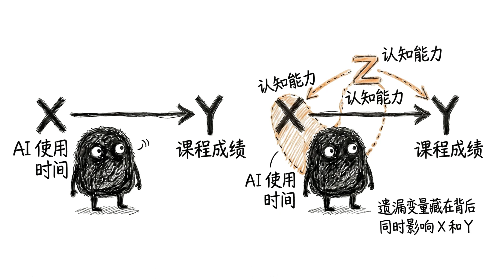
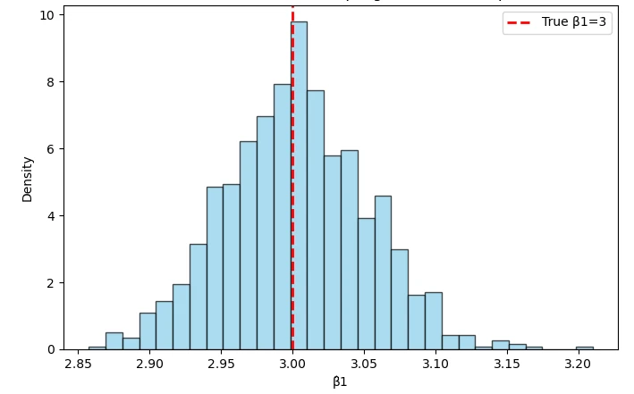
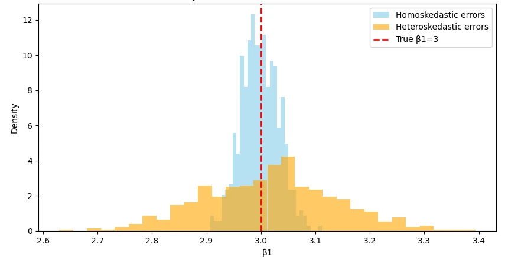

# 第3章 多元线性回归：控制与解释

> “研究复杂问题时，可以一次考察一部分，并暂时把其他干扰因素置于‘其他条件不变’的围栏中。”
>
> ——根据阿尔弗雷德·马歇尔《经济学原理》相关论述意译

前两章建立了一元线性回归的完整闭环：第1章用最小二乘法估出一条直线，第2章判断这条线有多确定。那条线回答的是一个简单的问题——当 $X$ 变化时，$Y$ 的条件均值平均会变化多少。但真实世界很少只让一个因素起作用。一名学生的成绩不仅与使用 AI 的时间有关，也与认知能力、学习基础、专业要求、家庭环境有关；一家企业的创新产出不仅与研发投入有关，也与规模、行业、融资条件和所在城市的政策环境有关。只挑出其中一个变量做回归，得到的系数就很难只代表这个变量自己的作用。多元回归正是为应对这种情况而生的工具。它允许我们同时把多个变量放进同一个模型，从而回答一个更接近现实的问题：在模型中其他变量保持不变的情况下，这个变量与结果之间是什么关系？这句话听起来只是一个技术性的限定，却是整章的核心。

它既是多元回归胜过一元回归的地方，也是初学者最容易误解的地方——“其他条件不变”是模型内部的条件比较，并不自动等同于实验控制，更不自动等于因果效应。要理解这一点，不妨先看看自然科学是怎么做的。力学实验想测量物体受力后的加速度，会尽量保持摩擦、轨道状态和测量条件稳定，让不同实验条件主要体现为外力的变化；植物学实验研究光照对生长的影响，会随机分组并控制土壤水分、温度和肥料。实验控制当然也不能保证所有条件绝对相同，但它能让处理组与对照组形成更可信的比较。社会科学很少享有这种条件：我们无法随机指定一部分学生使用 AI、另一部分不使用，也无法随机决定哪个城市设立试验区。

面对观察数据，多元回归提供的是一种**统计上的条件比较**——它用模型和数据中的可比变异，尽量逼近“其他条件相同”的局面，而它是否真的逼近了，取决于变量选择和**识别假设**（要让系数具备因果解释，所必须额外成立的那些条件）。这一章要回答四个层层递进的问题。第一，为什么要从一元走到多元？我们会从一元回归的局限出发，讲清楚什么是遗漏变量偏误，以及“控制变量”这个概念的直观含义。第二，多元回归怎样估计、系数怎样解释？模型形式变长了，但目标没有变——仍然是让残差平方和最小；真正的新内容是，每个系数都建立在“控制模型中其他变量”的比较之上。第三，多元情形下那些经典假设还成立吗？第1章讲过的那几条在这里仍然有效，只是形式要推广到多个解释变量，另外还多出一条多元回归特有的要求：解释变量之间不能完全线性重复。第四，多个系数怎样一起检验？

第2章的单参数推断在这里完全够用，但遇到“这两个系数是否同时为零”这类问题时，需要一个新工具。贯穿全章的是一个朴素的道理：多元回归让我们的比较更精确，但不会把观察数据变成实验数据。系数能否解释为因果效应，最终取决于研究设计和识别假设，而不取决于模型里放进了多少变量。带着这个意识读这一章，你会在学到技术的同时，也学到应有的谨慎。

## 3.1 为什么需要多元回归

### 3.1a 遗漏变量偏误

经济学的重要任务之一，是识别变量之间的因果关系。随机对照实验是构造因果证据的黄金标准：通过随机分配处理，使处理状态在期望意义上与处理前的特征和潜在结果独立。在临床研究中，把参与者随机分为实验组与对照组，再比较预先规定的结果，就能在很大程度上排除“愿意参加的人本来就不一样”这类干扰。当然，随机化也不是万能的——有限样本仍可能出现基线不平衡，结果缺失、不依从和组间干扰都需要专门处理。随机化提供的是识别的**基础**，而不是自动解决所有实际问题。社会科学同样希望构造清晰的处理组与对照组。我们关心使用 AI 是否提高成绩、最低工资是否影响就业、城镇化是否改变环境质量——这些问题在理论上都可以设想用随机实验来回答，但在现实中往往不可行。

AI 使用时间受认知能力、学习习惯和课程要求影响，最低工资的制定与政治经济环境和行业特点纠缠在一起，政策试点的选址也从来不是掷骰子的结果。所以研究者绝大多数时候面对的是**观察数据**。计量模型可以刻画条件关系，但只有研究设计和相应的识别假设可信时，这种条件关系才能进一步解释为因果效应。最基础的分析方法仍然是上一章的一元线性回归。想知道每周使用 AI 的时间与课程成绩的关系，可以估计

$${score}_{i} = \beta_{0} + \beta_{1}{ai}_{i} + u_{i}.$$

这个模型的含义很直白：用 AI 使用时间来解释成绩差异，$\beta_{1}$ 表示 AI 使用时间每增加一小时，课程成绩平均变动多少。要把它解释为因果效应，需要满足 $E(u_i\mid ai_i)=0$ 这样的识别条件。这里要求的只是**条件均值**为零，AI 使用时间与误差项完全独立是更强的条件，并不是 OLS 无偏所必需的——把这一点记清楚，可以避免日后提出过强的要求，也可以避免误以为只要“有一点相关”就一定出问题。麻烦在于，在使用观察数据研究 AI 使用与成绩时，这个条件往往很难满足。以认知能力为例：它会影响一名学生使用 AI 的多少（能力强的学生可能更善于把 AI 用起来），也可能直接影响考试成绩。

如果我们忽略认知能力，它的影响就被藏进了误差项里；而由于 AI 使用时间与认知能力相关，误差项就与解释变量发生了系统性的联系，零条件均值假设随之被破坏。这时估计出来的 $\beta_{1}$ 会同时夹杂 AI 使用时间与认知能力两方面的作用——我们可能因此**高估** AI 的作用（认知能力强的学生既用得多、考得也好），也可能在其他情形下低估它。这种偏误称为**遗漏变量偏误**（omitted variable bias）。图3-1 画的正是它污染核心系数的过程。为了更具体地理解它，不妨设想一个极端情形：一元回归显示 AI 使用时间与成绩明显正相关，但如果认知能力才是造成成绩差异的主因，而 AI 使用时间只是能力的外在表现，那么我们就不能说使用 AI 本身带来了更高的成绩。

更糟的是，在某些情形下遗漏变量的作用方向与我们所分析的方向相反，导致估计不仅偏离真值，甚至可能得出与事实相反的结论。偏误的产生需要**两个条件同时成立**：第一，被遗漏的变量影响被解释变量（认知能力影响成绩）；第二，被遗漏的变量与核心解释变量相关（认知能力影响 AI 使用时间）。这两个条件缺一不可。如果一个变量只影响成绩、却与 AI 使用时间毫无关系，那么遗漏它只会增加误差项的波动，让估计不那么精确，却不会让 AI 系数系统性地偏高或偏低——这一点在后面的 3.3 节讨论精确度时还会用到。反过来，如果一个变量与 AI 使用时间高度相关、却对成绩没有独立影响，遗漏它同样不会造成系统性偏误。偏误来自“共同成因”，而不是来自“变量很多”。

把这两个条件写成更形式化的语言：若我们估计的模型遗漏了一个重要变量 $Z$，而 $Z$ 同时影响 $Y$ 和 $X$，那么误差项中就含有 $Z$ 的影响；只要核心变量与遗漏变量相关（$\operatorname{Cov}(X,Z)\neq 0$），核心解释变量就必然与误差项相关（$\operatorname{Cov}(X,u)\neq 0$），从而违反最小二乘法无偏性的基本条件，估计结果也就有偏。至于偏误的方向，则由两个相关关系的符号共同决定：遗漏变量与 $X$ 正相关、且对 $Y$ 有正向影响，会推高系数估计；若其中一个方向相反，偏误方向也随之改变。**“加了控制变量系数一定变小”是一个常见的错误印象**，本案例后面会看到，系数可以变大，也可以几乎不变。

> **专栏3-1 课外辅导与成绩：观察数据中的遗漏变量**
>
> 假设我们调查一批学生，发现参加课外辅导的学生平均成绩更高。这个发现很容易被解读成“辅导有用”，于是有人主张所有学生都去报班。但如果只把成绩对“是否参加辅导”做一次一元回归，得到的系数几乎必然把组间差异全部归因于辅导——而组间差异中真正属于辅导的那一部分，可能远比看上去的小。
>
> 问题出在家庭教育投入上。重视教育、资源更充足的家庭，既更可能为孩子购买辅导，也更可能提供更安静的学习环境、更丰富的读物、更稳定的作息和更多的学业支持。这些资源和氛围本身就会提高成绩，而它们又与“是否参加辅导”高度相关。于是家庭教育投入成为一个典型的遗漏变量：它既影响被解释变量（成绩），又与核心解释变量（是否参加辅导）相关，**两个条件同时成立**，辅导系数因此被系统性地推高。
>
> 这个例子也说明了两个条件的必要性。假如某个变量只影响成绩、却与是否参加辅导完全无关——比如学生本人的某种先天特质——那么遗漏它只会让估计的随机波动变大，让标准误上升，却不会让辅导系数系统性地偏高。这就是为什么在研究设计阶段，我们要花很大力气去识别“哪些是真正的共同成因”，而不是把所有能想到的变量一股脑塞进模型。
>
> 那么，把家庭背景变量加进模型就可以解决问题了吗？未必。多元回归确实可以减少这类混杂：如果能用合适的变量刻画辅导开始**之前**的家庭背景和既往成绩——比如父母受教育年限、家庭藏书量、学生入学时的成绩排名——那么“在家庭条件相近的学生之间，参加辅导与成绩还有多大关联”这个问题就变得可以回答了，辅导系数也会向更可信的方向调整。但加入控制变量并不等于已经获得因果效应。
>
> 原因至少有两条。第一，**测量不完全**：家庭对教育的支持很难用一个或几个变量穷尽，一份问卷测量到的只是它的一个侧面，剩下的部分仍然留在误差项里。第二，**反向因果**：参加辅导这件事本身可能受到学生原有成绩的影响——成绩已经落后的学生更可能去补课，也更容易在后续考试中继续落后。这不是模型里多放几个控制变量能解决的问题，因为它涉及“谁选择接受处理”这一机制，属于第6章要专门讨论的识别难题。
>
> 这个例子提醒我们，多元回归是在明确假设下进行条件比较，而不是把观察数据自动变成实验数据。把能想到的变量都塞进模型，并不会自动补上缺失的那部分识别逻辑；真正起作用的，是对“为什么会有这个差异”“谁进入了处理组”这类问题的持续追问。控制变量是回答这些追问的工具之一，而不是替代品。

图3-1 遗漏变量如何污染核心系数

### 3.1b 控制变量

缓解遗漏变量偏误的一个基本思路，是把有理由认为**同时影响**解释变量和被解释变量的因素纳入模型。这类变量称为**控制变量**（control variables）。研究 AI 使用与成绩的关系时，可以根据因果结构和数据条件，加入使用 AI 之前的认知能力测量、学习基础和个人特征，然后在这些条件相同的观测之间比较成绩差异。这里有一个容易滑过去的细节值得强调：控制变量应当在**核心解释变量发生作用之前**就已经确定。用认知能力、家庭背景、入学时的成绩做控制是合适的，因为它们先于“使用 AI”这件事；而用“是否参加辅导”“作业完成质量”这类可能位于因果链条中间或之后的变量做控制，反而会把原本要估计的总效应截断。控制变量不是“和结果有关的变量”，而是“在因果结构上位于核心变量之前的共同成因”。如何在具体研究中判断这一点，第5章会给出更系统的框架。在一元回归模型中加入控制变量，就得到了**多元线性回归模型**：

$$Y_{i} = \beta_{0} + \beta_{1}X_{1i} + \beta_{2}X_{2i} + \ldots + \beta_{k}X_{ki} + u_{i}.$$

其中 $Y_{i}$ 是被解释变量，$X_{1i}$ 是我们关注的核心解释变量，$X_{2i},\ldots,X_{ki}$ 是其他解释变量。$\beta_{1}$ 的回归含义是：在模型中其他变量保持不变时，$X_{1}$ 增加一个单位，$Y$ 的条件均值平均变动多少。这是“控制其他变量”的回归解释；它是否还能解释为因果效应，要取决于**外生性**（解释变量与误差项不相关）和研究设计。引入合适的控制变量有助于缓解遗漏变量偏误，也可能改善拟合或预测，但这些结果都不会自动发生。加入变量会使样本内 $R^{2}$ 不下降，却可能降低调整后的 $R^{2}$ 或样本外的预测表现——因为模型多了一个需要估计的参数，而它带来的信息可能抵不上这份代价。因此，控制变量应当依据研究问题和因果结构来选择，而预测能力则应当用验证集或交叉验证来评估，这是两件不同的事。

还需要说清楚的是，**并不是控制的变量越多越好**。变量的取舍至少要遵循两条原则：一是依据理论与经验判断它是否真的位于因果路径上；二是避免引入中介变量或结果变量，从而把因果结构本身破坏掉。举例来说，在研究 AI 使用对成绩的**总效应**时，如果“作业完成质量”本身是使用 AI 的结果，那么把它作为控制变量就会截断“AI 使用 → 作业质量 → 成绩”这条路径，估计出来的只是除这条路径之外的其余影响，而不是总效应。所以多元回归虽然表现为一套技术操作，它的建模过程却依赖扎实的经济学判断和明确的因果结构。变量放进模型之前，先想清楚它在因果图上站在哪里——这条要求贯穿本书后续所有章节。

> **专栏3-2 辛普森悖论：为什么加一个变量会让结论反转**
>
> 先看一个真实发生过的例子。1973 年，加州大学伯克利分校被指控研究生录取存在性别歧视：把全校各系的数据汇总起来，男性申请者的录取率约为 44%，女性约为 35%，差距明显。指控看上去证据确凿。
>
> 但一位统计学家建议把数据**按系拆开**再看。拆开之后，情况完全颠倒过来：在大多数系里，女性的录取率与男性相当，甚至更高；只有少数几个系略低。汇总数据里的“歧视”，在分系数据中几乎消失了。
>
> 这怎么可能？关键在于各系的录取难度和申请者的分布不同。女性申请者更集中于录取率本来就很低的热门系（比如某些人文社科方向），而这些系的竞争极为激烈；男性申请者则更多集中在录取率较高的系。把两个差异极大的群体混在一起统计总体录取率，得到的其实是“申请去向”的差异，而不是“录取标准”的差异。这种**汇总层面与分组层面结论相反**的现象，就是**辛普森悖论**（Simpson's paradox），它的更一般形式在 20 世纪初就已被讨论，1951 年由辛普森在一篇论文中系统阐述，并因此得名。
>
> 这个悖论对回归分析的意义非常直接。它说明：一个关系可以在“不分组的总体”中呈现一个方向，在“控制住分组变量之后”呈现相反的方向。用回归的语言说，分系就是把“系别”作为一个控制变量放进了模型；汇总数据相当于遗漏了这个变量的一元回归，而它的结论与加入“系别”之后截然相反。
>
> 需要注意，辛普森悖论并不是“数据骗人”，也不是统计方法的缺陷。两组数字都是真的，只是它们回答的问题不同：汇总数据回答的是“实际被录取的比例是多少”，分系数据回答的是“在同一个系的申请者之间，男女的录取概率是否不同”。前一个问题的答案受申请去向影响，后一个问题的答案才更接近“录取标准是否公平”。搞清楚你究竟在回答哪个问题，比记住任何一个公式都重要。
>
> 由此还可以引出两条使用回归时的纪律。第一，发现系数在加入某个变量后反转，不要急着怀疑数据或软件——它可能正是在提示你：存在一个此前被忽略的分组结构，而这个结构本身就是理解问题的关键。本案例后面会看到，AI 系数在加入认知能力之后发生明显移动，原理与此相同。第二，**反过来也不能机械地认为“控制得越多越好”**：如果控制的是一个位于因果链条中间的中介变量，甚至是一个被结果影响的变量，那么“控制之后”的估计对象已经悄悄换成了另一个问题。辛普森悖论教给我们的不是“一定要控制”，而是“要清楚自己控制了之后，回答的还是不是原来的问题”。

## 3.2 多元回归的估计与解释

从这一节起，我们进入多元回归的技术部分。好消息是，你在一元回归里学到的东西几乎全部可以沿用：仍然是最小二乘，仍然是最小化残差平方和，系数的抽样分布、标准误和检验逻辑也都不变。真正的变化只有一处——**每个系数现在都是“控制模型中其他变量之后”的系数**，因此它的含义、精度和解释方式都需要重新理解。这一节就沿着“怎么估 → 拟合得好不好 → 系数怎么读 → 控制究竟做了什么”这条线展开。

### 3.2a 参数估计

在第1章中，我们学习了如何利用最小二乘法估计一元线性回归模型的参数：找到一条使预测值与实际观测值差距最小的直线，从而估计出截距和斜率。然而现实中，影响一个结果的因素往往不止一个。多元回归模型的引入，正是为了应对被解释变量同时受到多个解释变量作用的情况：

$$Y_{i} = \beta_{0} + \beta_{1}X_{1i} + \beta_{2}X_{2i} + \ldots + \beta_{k}X_{ki} + u_{i}.$$

其中 $Y$ 是被解释变量，$X_1,X_2,\ldots,X_k$ 是多个解释变量，$\beta_0$ 是截距，$\beta_1,\beta_2,\ldots,\beta_k$ 是我们希望估计的回归系数，$u_i$ 是误差项，反映其他未包含在模型中的因素对 $Y$ 的影响。真实的总体参数未知，我们只能通过有限样本估计出样本回归线。估计的思路与一元回归完全一致。在一元回归中，我们用一条直线拟合数据点；在多元回归中，每增加一个解释变量，拟合对象就从直线扩展为平面；变量再多就画不出来了，但估计的思路完全一样。OLS 依然选择一组系数，使样本残差平方和最小。对于第 $i$ 个观测，预测值和残差分别是

$${\widehat{Y}}_{i} = {\widehat{\beta}}_{0} + {\widehat{\beta}}_{1}X_{1i} + \ldots + {\widehat{\beta}}_{k}X_{ki},
\qquad
\widehat{u}_{i}=Y_{i}-\widehat{Y}_{i},$$

而估计的目标就是选择 $\widehat{\beta}_{0},\widehat{\beta}_{1},\ldots,\widehat{\beta}_{k}$ 来最小化

$$
S(\widehat{\beta}_0,\widehat{\beta}_1,\ldots,\widehat{\beta}_k)
=\sum_{i=1}^{n}\widehat{u}_i^2
=\sum_{i=1}^{n}\left(Y_i-\widehat{\beta}_0-\widehat{\beta}_1X_{1i}-\cdots-\widehat{\beta}_kX_{ki}\right)^2.
$$

和一元回归一样，这是在所有候选平面中选择残差平方和最小的一个。软件会完成求解，正文不展开求偏导过程；求解结果满足一组称为**正规方程**的样本关系：

$$
\sum_{i=1}^{n}\widehat{u}_i=0,
\qquad
\sum_{i=1}^{n}X_{ji}\widehat{u}_i=0,
\quad j=1,2,\ldots,k.
$$

第一条表示含截距回归的样本残差和为零，其余各条表示样本残差与相应解释变量的样本共同变化为零。这些是 OLS 计算之后必然得到的样本代数性质，不是关于世界的假设。它们不表示不可观测的总体误差项与解释变量独立，也不能用来证明外生性——这一点在后面的经典假设部分会看得更清楚。

图3-2 多元情形下（两个解释变量）的最小二乘拟合

图3-2 用两个解释变量的情形把这件事画了出来。两个水平轴分别表示 $X_{1}$ 与 $X_{2}$，竖直轴表示 $Y$，每个数据点 $(X_{1i},X_{2i},Y_i)$ 是一条观测记录；半透明平面就是样本回归方程 $\widehat{Y}=\widehat{\beta}_{0}+\widehat{\beta}_{1}X_{1}+\widehat{\beta}_{2}X_{2}$。几何上，$\widehat{\beta}_{1}$ 是沿 $X_{1}$ 方向的斜率，表示保持 $X_{2}$ 不变时 $X_{1}$ 增加一个单位对应的预测 $Y$ 变化；$\widehat{\beta}_{2}$ 同理。每个观测点与平面的竖直差距 $\widehat{u}_{i}$ 就是残差。

当解释变量多于两个时无法直接作图，但“寻找残差平方和最小的那个拟合面”的思想完全不变。一句话概括这一节：多元 OLS 仍然是在找残差平方和最小的拟合面。每个系数表示模型中其他解释变量保持不变时，该变量增加一个单位所对应的条件均值变化。系数要能够被单独估计，还要求解释变量之间不存在精确的线性重复；它能否解释为因果效应，则取决于模型设定与识别假设。

### 3.2b 拟合优度 $R^{2}$

在一元回归中我们接触过拟合优度 $R^{2}$，它衡量解释变量对于被解释变量波动的解释程度。在多元回归中，$R^{2}$ 的定义保持不变——仍然是模型所解释的变异占总变异的比例——但它的含义和使用方式需要进一步澄清。首先，多元模型往往包含多个解释变量，因此 $R^{2}$ 不再反映某一个变量的解释力，而是衡量**整个解释变量集合的联合解释力**：在考虑所有控制变量之后，这个模型整体能解释被解释变量波动的多少。如果一个模型的 $R^{2}$ 是 0.65，就意味着这些解释变量合起来可以解释 65% 的被解释变量变异，剩下 35% 归入误差项。这个数字通常用来初步判断模型的拟合效果。

然而，$R^{2}$ 在多元回归中面临一个新的技术问题：随着解释变量数量的增加，$R^{2}$ 几乎总是会提高，即使新加入的变量对被解释变量几乎没有解释作用。原因在于，最小二乘估计会尽可能通过调整系数来最小化残差平方和，而多一个可调参数几乎总是能让残差平方和至少不上升。于是若一味追求更高的 $R^{2}$，就容易滑向模型过度复杂、过度拟合，反而失去对真实关系的刻画能力。为此，我们引入**调整后的拟合优度**（adjusted $R^{2}$）：它在计算时不仅考虑残差平方和的变化，还对解释变量的个数进行惩罚（若样本量为 $n$、解释变量个数为 $k$，则调整后 $R^{2}=1-\frac{(1-R^{2})(n-1)}{n-k-1}$），使得当新变量没有提供足够信息时，调整后的 $R^{2}$ 反而可能下降。用一句话说，它抵消了“盲目添加变量带来的虚假提升”，从而更真实地反映模型的拟合效率。

因此，在多元回归中不能简单地以 $R^{2}$ 的大小判断模型优劣，而应结合调整后的 $R^{2}$、参数估计的显著性、变量的经济含义，以及是否存在遗漏变量偏误或多重共线性等问题综合判断。$R^{2}$ 提供了一个整体上的拟合衡量，但它不能取代对个别回归系数的解释和检验，也不能作为因果关系成立的依据。一个 $R^{2}$ 很高的模型，完全可能因为遗漏了关键变量而给出严重有偏的系数；一个 $R^{2}$ 不高的模型，也可能恰恰把最重要的那个条件关系估得很准。判断的重点始终落在系数上，而不是落在拟合优度上。

### 3.2c 系数的解释：控制其他变量意味着什么

多元回归估计的是条件均值中的**偏关系**——所谓“偏”，指的是把其他解释变量的影响扣除之后剩下的那部分关系：在模型中其他变量保持不变时，一个解释变量的变化对应的被解释变量平均变化。这个系数是否代表净因果效应，需要额外的识别假设。本节要做的，是把“控制其他变量”这句话从一句口头禅，变成一个可以理解、可以检查的具体机制。

**为什么必须保持其他变量不变？** 设想我们研究课程成绩 $Y$ 与每周 AI 使用时间 $X_{1}$、认知能力 $X_{2}$ 的关系。AI 使用时间和认知能力往往是相关的：认知能力更强的学生可能更善于把 AI 用起来，也更容易取得好成绩。如果只用 AI 使用时间做一元回归，AI 系数就会同时反映它与认知能力的关联；而由于认知能力本身也影响成绩，遗漏它就会造成 3.1a 讲过的遗漏变量偏误。多元回归模型同时纳入这两个变量，估计 AI 的系数时，比较的是**认知能力相同**的情况下不同 AI 使用时间的成绩差异。换言之，$\widehat{\beta}_{1}$ 描述的是在保持认知能力不变的条件下，AI 使用时间增加一小时带来的平均成绩变化。这一步让估计更接近因果关系，减少了混淆因素的干扰——但请注意，它只是减少了**模型中已经写出来的那些**混淆因素的影响。

**“保持不变”到底是怎么做到的？** 这里必须澄清一个常见的误解。多元回归中的“控制其他变量”，**并不是在现实中找到所有条件完全相同、仅有一个变量不同的个体**，然后拿他们相互比较。现实中根本找不到这样的人，即使找到，样本量也远远不够。真正的机制发生在数学层面：模型通过一套代数运算，把各个变量的作用彼此区分开来。为了看清楚这套运算，考虑只有两个解释变量的简单情形：

$$Y = \beta_{0} + \beta_{1}X_{1} + \beta_{2}X_{2} + u.$$

我们希望理解 $\beta_{1}$。用几何语言说，多元回归就是在所有可能的拟合面里，找那个离观测点最近的面。关键在于它究竟用了 $X_{1}$ 的哪一部分信息来估计 $\beta_{1}$——答案是：**只用 $X_{1}$ 中不能被其他解释变量线性预测的那部分变异**。变量之间越相关，这部分剩余变异通常越少，系数也就越难精确估计。这个判断在后面的多重共线性一节（3.3c）还会再回到。读到这里你可能会问：软件究竟是怎样把各个变量的作用“分开”的？这不是一个可以凭直觉带过的问题——它是理解多元系数含义的最后一道关。下一节专门回答它。

> **专栏3-3 *Ceteris paribus* 是什么？**
>
> 在多元回归分析中，我们常常听到“控制其他变量，解释某变量对被解释变量的影响”，或者说“在其他条件不变的情况下，某变量变动一单位，被解释变量的预期变化是多少”。这句话中的**其他条件不变**（拉丁语 *ceteris paribus*）是理解回归系数的关键，但它并非一句简单的口号，而是多元回归模型结构和解释的基础。
>
> *Ceteris paribus* 直译为“其他条件相同”，是经济学和社会科学中常用的分析原则。它提醒我们：要理解某一因素的作用，必须把其他可能同时变化的因素区分开来。在理论模型中，这可以作为一种思想实验——经济学家推导需求曲线时，总是假定收入、偏好、其他商品价格不变，只让自身价格变化，看看需求量怎样响应。在回归中，它首先表现为“给定模型中的其他变量”这一条件解释。
>
> 为什么需要强调其他条件不变？继续用 AI 使用时间与课程成绩的例子。若只用一元回归，模型只包含 AI 使用时间一个解释变量，回归系数代表的是 AI 使用时间变化与成绩变化之间的总体关联，看上去直观，实际上却很含混。因为成绩受很多因素影响——认知能力、每周自习时间、所选专业、出勤情况，甚至考试当天的状态。若这些重要因素没有被纳入模型，我们估计出的“AI 影响”很可能不只是 AI 本身的作用，还混杂了这些遗漏因素的贡献。
>
> 这时，“其他条件不变”的确切含义是：在模型中其他解释变量取值保持不变时，某个解释变量增加一个单位对应的条件均值变化。它是一个偏回归关系；只有在识别条件成立时，才能进一步称为该变量的因果效应。这两句话之间隔着整整一章的距离——第6章会专门讨论需要什么样的假设才能跨过它。
>
> 举个例子。如果多元回归模型包括 AI 使用时间、认知能力和每周自习时间，那么 AI 使用时间的系数表示：在模型中认知能力相同、自习时间相同的比较下，AI 使用时间每增加一小时，成绩条件均值相差多少。请注意这里的“保持不变”是一种**模型内的条件比较**，它不表示现实中的其他因素都已经真正固定住了。模型之外的那些因素——比如家庭氛围、教师水平——依然在变化，只是它们没有被写进这个模型而已。
>
> 现实生活中，AI 使用时间、认知能力和自习时间往往是共同变化的。认知能力更强的学生既可能使用 AI 更多，自习效率也更高；不同专业的课程难度和成绩分布也不相同。多元回归通过同时纳入这些变量，把 AI 的系数建立在模型所定义的条件比较之上。至于这种比较能否接近因果问题所需要的反事实，仍然取决于控制变量的选择和识别假设——这也是为什么同样一张回归表，在不同研究设计下可以支持强度完全不同的结论。
>
> 还有一点值得强调：*ceteris paribus* 的解释使多元回归系数**不再是简单的两变量相关系数**。相关系数没有“控制”的概念，它只描述两个变量共同变化的方向和强度；而回归系数回答的是“在模型限定的条件下”的条件关系。二者的差别，正是多元回归相对一元回归最重要的增量。理解了这一点，你也就明白了为什么读回归表时不能只看系数大小——必须先看清这个系数是在哪些变量的陪伴下被估出来的。因此，理解其他条件不变不仅是理解多元回归系数的基础，也帮助我们明确模型中控制变量的作用和意义，避免把相关关系简单等同于因果关系。

### 3.2d 控制究竟做了什么：FWL 与净变异

上一节留下了一个问题：软件究竟是怎样把各个解释变量的作用“分开”的？这一节给出答案。理解它，你对“控制”的认识会从一句口头禅变成一件看得见的事情。设模型为

$$
Y_i=\beta_0+\beta_1X_i+\gamma_1Z_{1i}+\gamma_2Z_{2i}+\cdots+\gamma_mZ_{mi}+u_i,
$$

其中 $X$ 是我们关心的核心解释变量，$Z_{1i},\ldots,Z_{mi}$ 是全部控制变量。我们要理解的是 $\widehat\beta_1$ 究竟由数据的哪一部分支撑。**Frisch–Waugh–Lovell 定理**（简称 FWL 定理）说明，它可以用三个步骤算出来。

**第一步：净化 $X$。** 用控制变量 $Z$ 去解释核心解释变量 $X$：

$$
X_i=\pi_0+\pi_1Z_{1i}+\pi_2Z_{2i}+\cdots+\pi_mZ_{mi}+v_i,
$$

这里的 $\pi_j$ 不需要在此逐一作经济解释：真正进入下一步的不是这些系数，而是它们产生的残差。控制集合一旦变化，辅助回归的系数和残差都会跟着变，最终的 $\widehat\beta_1$ 也可能随之变化。FWL 定理说的不是"辅助系数无关紧要"，而是**在同一控制集合下，直接做多元回归与用残差做净回归，会得到同一个 $\widehat\beta_1$**。

取残差 $\widetilde X_i=\widehat v_i$。这个残差是 $X$ 中**不能被当前控制变量线性解释**的那部分——换句话说，是把 $X$ 里与控制变量“同涨同落”的成分剔除之后剩下的净变异。

**第二步：净化 $Y$。** 用同一组 $Z$ 去解释被解释变量 $Y$：

$$
Y_i=\rho_0+\rho_1Z_{1i}+\rho_2Z_{2i}+\cdots+\rho_mZ_{mi}+e_i,
$$

取残差 $\widetilde Y_i=\widehat e_i$。它同样是把 $Y$ 中能被控制变量解释的部分剔除之后剩下的净变异。

**第三步：剩余解释剩余。** 用净 $X$ 去解释净 $Y$：

$$
\widetilde Y_i=\widehat\beta_1\widetilde X_i+\text{残差}_i.
$$

这个简单回归的斜率 $\widehat\beta_1={\sum_i\widetilde X_i\widetilde Y_i}/{\sum_i\widetilde X_i^2}$，**恰好等于原多元回归中 $X$ 的 OLS 系数**。这三步说明的事情非常值得记住：所谓“控制其他变量”，在代数上就是把 $X$ 和 $Y$ 中能被控制变量解释的部分都剔除掉，然后看剩下的部分之间还有没有关系。如果剔除之后 $X$ 只剩下很少的变异，那么无论这很少的变异与 $Y$ 的关系看起来多强，系数的估计都会很不精确——这正是 3.2c 里那句“变量越相关，剩余变异越少，系数越难精确估计”的确切含义，也是后面多重共线性问题的代数根源。

FWL 定理还有一个必须讲清楚的边界：它是一个恒等式，不是一个关于世界的断言。它说的是“多元回归系数等于某某”，这在任何一份数据、任何一个模型设定下都成立，不需要任何识别假设。因此它既能告诉我们系数的变异来源，也可能给人造成一种错觉——好像“把控制变量剔除干净”就等于“把混杂因素剔除干净”了。事实并非如此：净化只是把 $X$ 中**能被现有控制变量线性解释**的部分拿掉，如果还有一个重要的混杂因素没有被放进 $Z$，它既不会被剔除，也不会因为做过这两步净化就变得无关紧要。FWL 完成的是代数分解，它不创造外生性。这一点值得用一个问句留在心里：**哪一部分变异实际支撑着这个系数的估计？** 当你读到一个回归系数时，试着去想象它所依赖的那部分净变异究竟来自数据的哪些观测、哪些变化。如果那部分变异本身仍然与未观测的因素纠缠在一起，那么无论模型里放了多少控制变量，这个系数都还不能承担因果解释。第5章会沿着这个问题继续往前走，把它接到识别问题上去，并在案例中把这两步净化实际算一遍、画成图。

## 3.3 经典假设与统计性质

前两节讲的是“怎么算”和“怎么读”。这一节要回答一个更根本的问题：这些估计量在什么条件下才值得信任？第1章已经给出过一组经典假设，并说明了它们能带来无偏性和有效性。多元回归并没有推翻这套东西——假设的形式几乎原封不动地保留了下来，只是把单个解释变量换成了多个解释变量。真正的新内容有两处：一是多出一条多元回归特有的要求（解释变量之间不能完全线性重复），二是“高度相关但不完全共线”这种常见情形会带来新的问题。这一节先快速回顾假设，再重点展开第二件事。

### 3.3a 五条经典假设：多元下仍然是它们

经典线性回归模型的假设（简称经典假定）共有五条。**其中前四条在第1章已经系统介绍过**，多元情形下的表述与含义基本不变，因此这里只做简明回顾；**第五条是多元回归特有的**，需要单独说明。

**假设1：模型对参数线性。** 被解释变量与解释变量之间存在线性关系，即 $Y_{i} = \beta_{0} + \beta_{1}X_{1i} + \ldots + \beta_{k}X_{ki} + u_{i}$。这里的“线性”指的是模型对**参数** $\beta_j$ 线性，而不是要求解释变量必须保持原始形式——取对数、平方、加入交互项都不会破坏这一条。这个假设决定了系数的解释方式：$\beta_{j}$ 表示其他变量保持不变时，$X_{j}$ 增加一个单位所带来的 $Y$ 的平均变动。

**假设2：随机抽样。** 样本由总体中独立、随机地抽取得到，每个观测点 $(Y_i, X_{1i}, \ldots, X_{ki})$ 独立同分布。这一条为从样本推断总体提供了基础。需要提醒的是，它不能单独保证有限样本具有代表性——抽样框覆盖不全、无应答和样本选择等问题仍需单独检查。如果研究只选取了某几个专业或某几门课程的数据，即便抽样过程本身合规，结论也未必能代表全校学生。

**假设3：误差项的零条件期望。** 在给定所有解释变量的条件下，误差项的期望为零：$E(u_{i}\mid X_{1i},\ldots,X_{ki}) = 0$。这是五条中最关键的一条，也是 3.1a 讲遗漏变量偏误时反复出现的那一条。直观上，它意味着模型没有包含的那些影响因素，**并不与已有的解释变量系统性相关**。它比“不相关”更强（要求的是条件均值，不是单纯的相关系数为零），但仍不等同于误差项与解释变量统计独立——误差的条件方差和更高阶分布仍可能随解释变量变化。

**假设4：同方差。** 误差项在不同观测中具有相同的方差：$\operatorname{Var}(u_{i}\mid X_{1i},\ldots,X_{ki}) = \sigma^{2}$。直观理解是，模型对不同观测值的把握程度是相似的。如果预测高收入人群时误差总是很大、预测低收入人群时却比较准，就出现了异方差。违反这一条不会让 OLS 有偏（在假设3成立的前提下），但会破坏它的有效性，并使常规标准误估计错误，从而影响显著性检验。

**假设5：解释变量无完全共线性。** 任何一个解释变量都不能被其余解释变量**精确地**线性表示。这一条第1章没有出现，是多元回归特有的要求——因为只有存在多个解释变量时，“彼此线性表示”才成为一个可能的情形。它保证的是系数**能够被唯一确定**，而不是保证模型设定正确或具有因果解释。前四条与第1章的表述完全一致，含义也没有变化。第五条则值得单独展开：它不仅关系到“能不能算出来”，还牵出一个在实证研究中几乎人人都会遇到的问题——解释变量高度相关时该怎么办。这正是下面要重点讨论的内容。

### 3.3b 无偏性与有效性

在展开多重共线性之前，先把“好估计量”的两个标准复习清楚，因为后面讨论共线性时要用到它们。

**无偏性**说的是：在重复抽样的平均意义下，估计量不会系统性地高估或低估真实参数。对任一回归系数 $\beta_{j}$，其估计值满足 $E(\widehat{\beta}_{j}) = \beta_{j}$。这一性质意味着每次用不同样本估出的结果虽然会有差异，但这种差异是围绕正确值随机波动的，而不是始终偏向一侧（图3-3）。在多元回归中，无偏性仍然依赖经典假设的成立，尤其是假设3。当误差项中含有与某个解释变量相关的遗漏因素时，估计就会偏误——这在复杂的经济社会问题中相当常见，因此根据事前因果结构合理选择控制变量，是减少这部分偏误的重要手段，但它不能确保零条件均值成立。

图3-3 多元回归估计的无偏性

**有效性**说的是：在所有线性无偏估计量中，最小二乘估计的方差最小。仅有无偏还不够——如果不同样本下结果总是大起大落，即便平均而言不偏，也难以让人信赖。在高斯—马尔可夫条件下（零条件均值、同方差等成立），多元最小二乘估计具有这一性质，因此被称为**最佳线性无偏估计量**（BLUE，图3-4 对比了同方差与异方差两种情形）。这个结论就是高斯—马尔可夫定理，它在多元情形下与一元情形完全平行。

图3-4 多元回归的有效性问题（同方差与异方差）

“线性无偏估计中方差最小”这句话有两个限定词值得留意。第一是“线性”：非线性方法（如最大似然估计、贝叶斯估计）在特定条件下可能表现更好。第二是“无偏”：有些有偏的估计方法通过接受一定偏差来换取更小的方差，在小样本时偶尔是值得的（图3-5）——这正是 3.3e 的选读要讨论的权衡。在最常用的线性模型框架下，最小二乘法仍然是我们最基础也最强有力的工具。有一处容易混淆的地方需要点明：加入解释变量可能减少残差变异，也可能因共线性而增大目标系数的方差，净结果取决于数据结构。OLS 最小化的是残差平方和，而“在线性无偏估计量中方差最小”这个性质并不是由“最小化残差平方和”这一句话单独推出的——它需要高斯—马尔可夫条件的支撑。这两件事经常被混为一谈，但它们的含义完全不同。

### 3.3c 多重共线性：信息重复的代价

现在回到假设5。前面反复出现一句话：“变量越相关，剩余变异越少，系数也越难精确估计。”这一节把它讲透，并区分两种性质完全不同、处理方式也截然不同的情形。

**完全共线：估计根本无法进行。** 完全共线性是指某个解释变量能够被其余解释变量**精确地**线性表示。**虚拟变量**是只取 0 和 1 两个值、用来表示类别的变量。最典型的例子是“虚拟变量陷阱”：在一个含截距的模型中同时加入互斥且穷尽的全部类别虚拟变量——比如同时放入东部、中部、西部三个虚拟变量，或者同时放入男性和女性。这时这组虚拟变量之间存在严格的线性关系，模型无法确定唯一的一组系数。后果不是“估计不精确”，而是“系数无法被唯一确定”。当某个变量能够被其余变量精确复制时，存在**多组不同的系数**都能产生完全相同的拟合值，模型没有办法在它们之间做出选择。软件通常会自动删掉一个冗余变量，而不是给出“方程无解”的错误提示——但这个自动动作背后是模型失去了可识别性，而不是数据有什么问题。需要强调的是，完全共线性通常并非数据本身的属性，而是模型设计或变量选择上的疏忽。另一个常见例子是在同一回归中同时使用父亲收入、母亲收入和家庭总收入（前两者之和）：变量变多了，信息却没有增加一点。遇到这种情况，处理方式是明确的——明确基准组，删除能被其余变量精确复制的那个变量。

**多重共线：能算，但不精确。** 与完全共线不同，多重共线性指的是解释变量之间存在**较高的**相关性，但不是精确的线性关系——一个变量可以被其他变量大致预测，却不能被完全复制。它远比完全共线常见，几乎可以说是多元回归的常态：在学习行为研究中，AI 使用时间和每周自习时间往往正相关；在企业分析中，资产规模和销售收入通常高度相关；在宏观数据里，各类经济指标更是同涨同落。多重共线性在多数情形下不是操作失误，而是变量本身的内在特征。存在多重共线性时，只要其他经典假设成立，回归估计量**仍然无偏**，也仍然满足高斯—马尔可夫定理。它带来的问题是**方差**：系数估计变得不稳定，标准误变大，置信区间变宽，显著性检验的功效下降。用 FWL 的语言说，这件事的机制一目了然——控制变量能够更多地解释核心变量，净变异 $\widetilde X$ 就越少，而系数估计的方差正比于 $1/\sum \widetilde X_i^2$。信息重复了，可用的独立变异就少了，估计自然不稳。这个机制可以写成一个简洁的公式。在经典假设下，某个系数估计的方差是

$$\operatorname{Var}\left(\widehat{\beta}_j\right)
=\frac{\sigma^2}{SST_j\left(1-R_j^2\right)},$$

其中 $SST_j$ 是第 $j$ 个解释变量自身的变异程度（形式与第1章的 $SST$ 相同，只是换成了 $X_j$），$R_j^2$ 是它被其余解释变量解释掉的比例。

其中 $R_j^2$ 是把 $X_j$ 对其余全部解释变量回归得到的拟合优度。公式里有三个直观关系：误差波动 $\sigma^{2}$ 越大，估计越不精确；$X_j$ 自身的有效变异 $SST_j$ 越大，估计越精确；$X_j$ 越能被其他解释变量预测，$R_j^2$ 越高，估计越不精确。把后两者的比值单独拿出来，就是**方差膨胀因子**

$$\operatorname{VIF}_j=\frac{1}{1-R_j^2}.$$

它衡量的正是“多重共线性把方差放大了多少倍”。

**VIF 该怎么读？** 它是诊断指标，不是判决书。经验上常说“VIF 大于 10 就要处理”，但这只是一条粗糙的经验规则，不存在适用于所有研究的硬阈值：一个 $R_j^2=0.9$ 的变量，如果它的变异本身足够大、样本量也足够，系数照样可能估得足够精确。判断共线性是否构成问题，要看目标系数的标准误和置信区间是否宽到无法支持研究要回答的问题，而不是看 VIF 有没有越过某条线。另外两个常见做法也值得澄清：中心化可以缓解含交互项或高次项时由尺度产生的非本质相关，但不会消除一般的多重共线性；标准化只改变单位，不会增加识别信息。增加样本量有时能提高精度，却无法解决变量之间结构性的线性依赖。最重要的一条：不能因为共线就自动删变量。这是实践中最容易出错的地方。

假设研究的目标参数是 AI 使用时间的效应，而“家庭收入”和“家庭资产”高度相关——如果两者都是控制混杂所必需的，那么删掉其中一个，等于把一个相关的遗漏因素重新丢回误差项，**用偏误换取了精度**。这是比方差膨胀严重得多的代价。正确的判断顺序是：先问这个变量在因果结构中的角色是什么，再问它在统计上是否冗余。如果两个变量都在因果结构中有位置，就保留它们，并如实报告较宽的不确定性；只有当两个变量确实在重复测量同一个概念时，才可以在理论支持下精简，或者把它们合成为更少但更可靠的指标（例如主成分）。降维和正则化方法会改变估计对象，不能当作“保持原有目标参数不变”的机械修复手段。

图3-5 偏差与方差的权衡

> **专栏3-4 控制变量越多越好吗**
>
> 随着数字经济的迅速发展，学者们越来越关注它对经济增长、居民收入及共同富裕水平的影响。为了更全面地刻画数字经济的多维面貌，研究中常常引入多个相关指标：数字基础设施指数、数字产业增加值占 GDP 的比重、居民数字消费水平、数字技术创新投入等。表面上看，这些指标各自反映了数字经济的不同层面，实际上它们背后隐藏着一个共同的问题——这些变量之间往往高度相关，几乎同步变化。
>
> 这种高度相关关系就是多重共线性。它意味着模型中的解释变量之间存在强线性关系，使回归难以准确区分各个变量对被解释变量的独立影响。以数字经济为例，数字基础设施的完善促进了数字产业的扩张，同时也提高了居民的数字消费水平，因此这几个指标实际上反映的是同一件事：数字经济整体的发展程度。
>
> 当我们把这些高度相关的变量全部纳入模型时，会出现一个具体而明显的现象——**系数估计不稳定且难以解读**。在不同的样本或不同的模型设定下，同一个变量的估计系数可能大幅变化，甚至出现与理论预期相反的符号。原因并不神秘：模型难以区分这些变量的独立效应，它们的影响在统计意义上彼此混淆，于是无法明确判断哪一个因素才是真正起作用的关键。
>
> 这个问题背后还有一层更本质的含义：**多重共线性实际上压缩了模型中有效信息的维度**。虽然我们加入了多个变量，试图从多个角度解释数字经济的作用，但由于它们高度相关，模型中的信息其实是重复的——自由度被消耗了，信息量却没有相应增加。这就好比请几个人来讲同一件事，听多了反而让人分不清到底是谁说了什么。
>
> 这个例子提醒我们，控制变量的选择必须讲究质量而不是数量。盲目追求控制变量的数量，特别是加入大量高度相关的变量，不仅没有提升模型的解释力，反而可能让结果变得混乱、难以解释。需要补充的是，这并不意味着加入控制变量本身有错——问题不在于“加变量”，而在于“加了重复的变量”。一个与核心变量高度相关、又确实属于共同成因的变量，即便带来共线性，也往往必须保留；而一堆彼此高度相关、却都不处在因果关键位置上的指标，才是应当精简的对象。
>
> 那么该怎么做？常用的方法是结合理论和数据分析，精选有代表性的关键变量，避免信息重复。另一种思路是通过合成指标（如主成分分析）把多个相关指标归纳成一个综合指数，这样既保留了核心信息，又降低了多重共线性的风险。两种做法的共同前提都是：先想清楚每个变量在因果结构中的角色，再决定它在统计上是否冗余。
>
> 这个例子最后提示我们，现实中的经济变量通常相互关联。合理的变量组合并不要求解释变量彼此独立，而是要避免完全共线，明确每个变量在因果结构中的位置，并保证样本中有足够的独立变异来回答研究问题。希望同学们在将来的研究中，既能理解控制变量的选择原则，避免“越多越好”的误区，也能在必须保留相关变量时，如实报告由此带来的不确定性，而不是为了让表格好看而删掉真正重要的控制项。

### 3.3d 选读：大样本下的一致性

本节供有兴趣的读者进一步理解估计量的性质，不影响后续章节的学习。到目前为止，我们判断估计量好坏用的都是**无偏性**和**有效性**，它们有一个共同特点：讨论的都是**样本量固定时**的行为。无偏性说“重复抽样时平均落在真值上”，有效性说“在这个前提下波动最小”。但实证研究中还有另一类问题：如果样本不断变大，估计值会不会越来越接近真值？回答这个问题的性质叫**一致性**（consistency）。直观地说，一个估计量是一致的，意味着当样本量趋于无穷时，它依概率收敛到真实参数——样本越大，估计值落在真值附近的可能性越高。与无偏性相比，一致性关心的是**极限行为**，而不是某一个固定样本量下的平均值。这两者不是一回事，而且**彼此并不包含**。

一个估计量可以一致但有偏：只要偏差随着样本增大而消失，它最终仍会收敛到真值——比如用 $1/n$ 代替 $1/(n-1)$ 计算样本方差，就是有偏但一致的经典例子。反过来，一个估计量也可以无偏但不一致：它在任何一个样本量下平均都落在真值上，可它的方差并不随样本增大而缩小，估计值始终在真值附近大幅摆动。“无偏”和“一致”必须分开说，不能互相替代。那么 OLS 在什么条件下一致？核心仍然是假设3的**大样本版本**：误差项与解释变量不相关（$E(X_j u)=0$，即外生性），加上抽样独立、有限矩等正则条件。值得注意的是，OLS 一致所需要的条件与“有限样本无偏”所需要的条件并不完全相同——无偏要求的是更强的零**条件**均值，而一致性在大样本下可以容许更弱的设定。

这也解释了为什么在实际研究中，即便研究者对零条件均值没有十足把握，仍然会使用 OLS：因为**一致性往往比无偏性更接近实证研究真正需要的东西**——只要有足够大的样本，估计值就会向真值靠拢。但一致性也有它的边界，值得说清楚。第一，**一致性不保证小样本无偏**，也不保证置信区间的实际覆盖率在有限样本中达到名义水平，因此“样本大就没事”这句话并不准确。第二，**一致性无法修复内生性**：如果 $X_j$ 与误差项在总体上相关，那么样本再怎么增大，估计值也只会稳定地收敛到一个错误的值上，而不是真值——这正是“一致”和“偏误”可以同时出现的另一种组合，也是遗漏变量偏误不能被大样本拯救的原因。第三，这里讨论的收敛是**概率意义下的**，不意味着任何一份具体的大样本都一定给出接近真值的结果。

把这一节和前两节连起来看，一个估计量的性质至少有四个维度：无偏（平均准不准）、有效（波动大不大）、一致（样本大了会不会收敛到真值）、以及方差—偏差的取舍（下一节）。它们各自回答不同的问题，不能用一个词概括。当你日后读到“OLS 是最好的估计方法”这类说法时，不妨追问一句：这里说的“最好”，是在哪一条标准下、在什么条件成立的前提下？能问出这个问题，说明你已经真正理解了这一节的内容。

### 3.3e 选读：偏差和方差的权衡

本节帮助有兴趣的读者把 OLS 与预测方法联系起来，同样不影响后续章节的学习。在多元回归中，我们既关心估计量有没有系统性偏差，也关心它在不同样本中是否稳定。无偏说的是重复抽样的平均值等于真实参数；方差描述的是不同样本给出的估计结果波动多大。这两件事在有限样本里常常此消彼长，取舍的权衡就是**偏差—方差权衡**。在多元回归的语境里，这个权衡最典型的形态是这样的：加入必要的混杂因素可以减少遗漏变量偏误，但也可能因为解释变量之间高度相关而提高目标系数的方差；反过来，删掉一个相关的控制变量会让方差下降，却把偏误重新引入。**“加变量”和“减变量”都不是免费的**，关键要看代价落在哪一边。需要提醒的是，增加变量并不必然造成严重共线性——只有当解释变量之间确实存在结构性依赖、且样本中缺乏独立变异时，方差才会明显膨胀。

偏差和方差的权衡可以用第1章的打靶比喻来理解。靶心代表真实参数：落点长期平均位于靶心、但分布很散，对应无偏但高方差；落点集中在靶心一侧，对应有偏但低方差。在高斯—马尔可夫条件下，OLS 在线性无偏估计量这个范围内方差最小，但这不表示它在所有损失函数、所有预测任务和所有估计方法中都最优。实际的取舍取决于研究目标、样本量、模型复杂度和所比较的具体方法。在预测任务中，收缩和正则化方法常常**主动引入一定的偏差来换取方差的下降**——岭回归、LASSO 都是这个思路（二者都在目标函数里加一个惩罚项，把系数往零的方向压缩），当变量很多、彼此相关时，它们往往比 OLS 预测得更准。但在因果问题中，情况完全不同：**变量的取舍必须先保证目标参数和识别逻辑不被改变**。为了让系数“好看”而删掉一个必要的控制变量，不是在权衡偏差和方差，而是在悄悄更换研究的对象。

因此，偏差—方差权衡不是“因果必须无偏、预测可以有偏”这样一个简单的二分，而是要求研究者始终清楚：自己优化的究竟是哪一个目标。

## 3.4 多元回归中的推断：单参数与联合检验

第2章建立的推断工具可以直接搬到多元回归，不需要重新学一套东西。形式仍然是“估计值减去假设值，再除以相应标准误”；置信区间的构造也完全一样。**唯一需要重新理解的是系数的身份**：$\widehat\beta_j$ 现在表示的是**控制模型中其他解释变量之后**的条件回归系数，因此显著性结论也必须连同控制变量集合一起解释——“控制了年龄、性别和认知能力之后，AI 系数显著不为零”是一句完整的话，而“AI 系数显著”不是。除此之外，多元回归还带来一个一元情形下不存在的新问题。在一元回归里，“检验这个系数是否为零”就是全部要问的问题；但在多元模型里，研究者常常关心的是**一组系数**的共同行为——比如“年龄和性别这两个控制变量是否都不起作用”，或者“这一组行业固定效应是否联合显著”（固定效应是第7章的主题，这里先把它理解成一组表示类别的虚拟变量）。这类问题需要一个新的工具。

### 3.4a 单参数的 t 检验

当研究问题只涉及一个系数时，用法与第2章完全相同。要检验 $H_0:\beta_j = \beta_{j}^{0}$，统计量仍然是

$$t=\frac{\widehat\beta_j-\beta_{j}^{0}}{\operatorname{se}(\widehat\beta_j)},$$

在经典假设下服从自由度为 $n-k-1$ 的 $t$ 分布；置信区间仍然写成 $\widehat\beta_j \pm t_{1-\alpha/2,\,n-k-1}\operatorname{se}(\widehat\beta_j)$。自由度从第2章的 $n-2$ 变成 $n-k-1$，是因为现在要估计 $k$ 个斜率加一个截距，一共用掉了 $k+1$ 个自由度——这个变化很小，含义与前两章完全一致。真正需要注意的是解释：这个 $t$ 值衡量的是“**在控制了模型中其他变量之后**，$X_j$ 的系数离零有多远”。如果一个变量单独做一元回归时显著、放进多元模型后不再显著，正确的解读不是“这个变量没有作用”，而是“在已有的控制变量条件下，它没有提供额外的独立信息”——这两种说法差别很大。多元回归里的“不显著”，永远是相对于某个控制集合而言的。

### 3.4b 为什么“分别做多个 t 检验”不够

现在来看多元回归特有的问题。假设在成绩方程中，我们想检验年龄和性别的条件回归系数**是否同时为零**。一个看起来自然的做法是：分别对两个系数做 $t$ 检验，如果两个都不显著，就认为它们可以一起从模型中拿掉。这个做法有两个毛病，而且都不轻。

第一，它没有回答原来的问题。“两个系数同时为零”是一个关于**联合约束**的命题，而“第一个系数为零”和“第二个系数为零”是两个关于**单个系数**的命题。这两组命题并不等价：完全可能两个系数分别看都不显著，但它们联合起来显著（比如两者高度负相关，一个偏离正方向时另一个总偏离负方向，联合起来偏差很小却各自都不小）；也完全可能两个都显著，而某个联合约束恰好成立。用两个单参数检验去推断一个联合命题，逻辑上就搭不起来。第二，它没有利用系数估计之间的相关性。同一个回归里估出来的系数并不是彼此独立的——它们由同一份数据、同一个模型算出来，各自的抽样波动之间存在相关性。比如年龄增大往往伴随其他控制变量的变化，两个系数估计的方向和幅度会相互牵动。

单个 $t$ 检验只用到每个系数自己的标准误，把这份相关性完全丢掉了；而联合检验恰恰要把这份相关性用起来，才能正确判断“它们合在一起是否偏离零”。还有一层容易被忽略的后果：**反复做多个单参数检验会抬高误报的概率**。如果每个检验都在 5% 水平上做，那么即使所有系数真的都是零，做十个检验也仍有近四成的概率至少撞出一个“显著”的结果。联合检验避免了这种累积，因为它只做一次判断，控制的是**整组约束**的总体误报率。

### 3.4c F 检验：受约束与无约束的比较

解决联合问题的方法是 **$F$ 检验**。它的思想非常直观：**比较两个模型的拟合优度**。

**无约束模型**（unrestricted model）是包含全部解释变量的原始回归方程；**受约束模型**（restricted model）则是在原假设下把要检验的 $q$ 个系数限制为零之后重新估计的方程。两者用同一份数据、同一个被解释变量，差别只在于解释变量集合。如果原假设成立（那 $q$ 个系数确实是零），那么把它们去掉不会明显损害模型的拟合效果，两个模型的残差平方和应当很接近。如果原假设不成立，完整的模型应当显著优于受约束的模型。于是判断的标准就是：约束带来的拟合损失，相对于模型的误差水平，是不是足够大。把这个想法写成公式。设无约束模型的残差平方和为 $RSS_U$，受约束模型的残差平方和为 $RSS_R$（约束总会使残差平方和上升，所以 $RSS_R \ge RSS_U$）。$F$ 统计量定义为

$$F = \frac{({RSS}_{R} - {RSS}_{U})/q}{{RSS}_{U}/(n - k - 1)},$$

其中 $q$ 是受检约束的个数，$n$ 是样本容量，$k$ 是无约束模型中解释变量的总数（不含截距）。分子是把约束“摊到”每一个被限制的系数上之后造成的平均拟合损失，分母是无约束模型的误差方差水平——也就是“正常情况下一次估计会带来多少残差波动”。$F$ 值大，说明约束造成的损失远超正常的误差波动，因此原假设不可信。在经典线性模型且误差独立、同方差、正态时，有限样本中的 $F$ 统计量精确服从自由度为 $q$ 和 $n-k-1$ 的 $F$ 分布。**但这组条件比较强**：当存在异方差或聚类相关时，$F$ 检验应当改用**用稳健标准误构造的 Wald 检验**（Wald 检验是基于估计值与标准误构造的一大类检验统计量的统称，$t$ 检验和 $F$ 检验都是它的特例），其依据通常是大样本近似，而不再是精确的有限样本分布。这一点在应用中相当重要，第5章会讨论如何判断该用哪一种。用一个具体数字走一遍会更容易理解。

假设我们有 200 个样本，用 AI 使用时间、年龄和性别三个变量回归成绩，想检验 $H_0:\beta_{age}=\beta_{female}=0$。完整模型的残差平方和 $RSS_U=800$，把年龄和性别约束为零之后的残差平方和 $RSS_R=1200$，受检约束个数 $q=2$、解释变量总数 $k=3$、样本量 $n=200$。代入公式：

$$F=\frac{(1200-800)/2}{800/(200-3-1)}\approx49.02.$$

在自由度为 2 和 196 的 $F$ 分布下，这个值远远超过 5% 水平的临界值，因此拒绝联合零假设。但这个结论要说清楚边界。拒绝联合原假设，只说明数据不支持“这两个系数同时为零”，并不证明模型设定正确，也不自动赋予系数因果含义。反过来，如果整组系数未能拒绝为零，可能是效应本身很小、可能是估计不够精确、也可能是模型设定不合适，这几种原因在单看 $F$ 值时分不出来。而且即使拒绝了零假设，也只能说这组变量在统计上**联合相关**；要称得上“政策有效”，仍然取决于研究设计与识别假设。

### 3.4d t 与 F 的关系

$t$ 检验和 $F$ 检验不是两套互不相干的方法，它们之间存在一个很干净的关系：当只检验一个线性约束（$q=1$）、且使用同一种协方差估计时，$F$ 检验与双侧 $t$ 检验完全等价，并且 $F=t^2$。这不是巧合。一个系数的平方除以它的方差，正好等于“约束带来的拟合损失除以误差方差”——同一件事的两种写法。理解了这一点，学生就不会把 $t$ 和 $F$ 当成两种需要分别记忆的检验，而会看到它们是同一个逻辑在约束个数不同时的两个面孔：约束只有一个时，$F$ 退化成 $t^2$；约束有多个时，只能用 $F$，因为“多个系数同时为零”这件事没法用任何单个 $t$ 值表达。最后把两个工具的分工总结清楚。**$t$ 检验回答“这一个系数是否为零”**，它对应的是单个参数的假设和区间；**$F$ 检验回答“这一组系数是否同时满足若干限制”**，它对应的是联合假设。在实际论文中，两者通常一起报告：回归表里每个系数配一个 $t$ 值或标准误，表的下方再给出若干联合检验的 $F$ 值或 $p$ 值（例如“行业固定效应联合显著”）。读表时把这两类信息分开看，是理解一张多元回归表的基本功。

## 3.5 案例实践：AI 使用与课程成绩

### 3.5a 案例背景

前两章用一元回归描述了两个变量之间的平均关系。但课程成绩不仅与 AI 使用时间有关，也与认知能力、学习基础、专业要求等因素有关。如果 AI 使用时间恰好与这些因素相关，只做一元回归，AI 系数就会混入它们的影响——这正是 3.1a 讲过的遗漏变量偏误。本案例使用教学用模拟数据，围绕一个问题展开：加入合理的控制变量以后，AI 系数为什么会变化，变化的方向能不能事先判断？之所以用模拟数据而不是真实数据，是因为只有前者能让我们同时拥有两样东西：一个**已知的真实系数**，和一个**已知的数据生成过程**。数据由下面的方程生成：

$${score}_{i} = 56 + 1.20\,{ai}_{i} + 4.5\,{ability}_{i} + 0.6\,{age}_{i} - 1.8\,{female}_{i} + u_{i}.$$

其中 $ability$ 是**认知能力**，它同时影响 AI 使用时间和课程成绩（$ai = 3 + 3.2\,ability + \cdots$），因此是本案例要考察的那个遗漏变量；年龄和性别作为基本的控制变量。真实系数 1.20 就是我们希望估计出来的目标参数——它与第2章反复抽样实验里那个“靶心”是同一个数字，让我们可以拿着估计结果与真值直接对照。案例的数据生成过程暂时满足随机抽样、参数线性、无完全共线性和同方差等条件，本章重点改变的只有一条：**零条件均值**。同方差与异方差的图形区别在本章只作直观提示，正式的检验和稳健标准误留到第5章处理。这样做是有意的——一次只动一个条件，才能看清楚违反它究竟会造成什么后果。最后需要声明案例的边界。这里的所有数值都来自模拟，只服务于方法教学，不代表现实中 AI 学习工具对成绩的真实影响。模拟世界的干净恰恰是它的用途所在：正因为没有别的干扰，遗漏变量偏误的机制才能被看得清清楚楚。

### 3.5b 案例要解决的问题

本案例要回答三个相互连接的问题。第一个问题关于**偏误的方向**。只用 AI 使用时间解释成绩，与加入年龄、性别和认知能力相比，AI 系数为什么会不同？在动手算之前，能不能根据变量之间的相关方向事先判断它是变大还是变小？（1）认知能力与 AI 使用时间是什么关系？（2）认知能力对成绩的影响是正是负？（3）把这两个方向合起来，AI 系数会朝哪个方向偏？第二个问题关于**机制**。遗漏的认知能力是怎样进入新的误差项，并使零条件均值假设失效的？请把两个模型并排写出，说明新的误差项里究竟多了什么，以及它为什么必然与 AI 使用时间相关。同时要说明：这里被破坏的是零条件均值，而不是同方差。第三个问题关于**推断**。完整模型中的 AI 系数能否通过单参数检验？年龄与性别能否通过联合检验？两种检验分别回答什么问题？

拒绝联合原假设为什么不等于“每个系数都显著”？案例开始前先完成一张假设核对表：模型对参数线性；样本由设定的数据生成过程独立产生；解释变量之间不存在完全线性关系；包含认知能力的模型满足零条件均值；误差项暂设为同方差。做完之后请回头看一眼这张表，标注出哪些条件是被生成过程**设定**的，哪些是被样本**检验证明**的——这个区分在本案例结束时还会再提一次。

### 3.5c AI工作流准备

动手之前先写下自己的预测：AI 使用时间与被遗漏的认知能力怎样相关，认知能力怎样影响成绩，因此 AI 系数可能向什么方向变化，变化幅度大致有多大。把预测写下来是这套工作流中最容易被跳过、也最有价值的一步——它把“看结果”变成“检验自己的理解”。随后让 Agent 在`chapter03_project/`中读取本节、任务卡和配套脚本，核对两个模型使用的是不是同一份数据、同一批观测，再提出运行计划。确认后运行程序，检查模型比较表和系数图是否来自真实输出，并把核验过程写入`ai_log.md`。

> **AI Agent工作流提示**
> 1. 检查 AI 使用时间、认知能力和成绩的数据生成关系，说明为什么包含认知能力的模型满足零条件均值；
> 2. 检查两个模型是否使用同一批观测，避免把样本变化误当成控制变量的作用；
> 3. 核对样本中 AI 使用时间与认知能力的相关系数，判断偏误方向是否与理论预期一致；
> 4. 执行后核对完整模型中 AI 系数是否落在真实值 1.20 的置信区间内。
>
> 但以下判断必须由你自己完成：
> 1. AI 系数变化是否符合遗漏变量偏误方向的理论判断；
> 2. 为什么完整模型系数接近真值，不能证明控制变量选择在现实中同样正确；
> 3. 年龄和性别这两个基本控制变量在本案例中起了多大作用；
> 4. 哪些经典假设在本案例中只是由生成过程设定，而不是被样本检验证明。

不用 AI 也可以完成。上面这套流程是**选用 AI 路线时**的做法，不是必做要求。不使用任何 AI 工具时，做法是：先写下同样的预测（遗漏认知能力会让 AI 系数向哪个方向偏、幅度大概多大）；然后打开 `code/python/ch03/01_controls_ovb.py`（或 Stata 版 `.do`），自己核对两个模型用的确实是同一份数据、同一批观测，运行脚本；再用模型比较表与自己事先写下的偏误公式对照。不懂的命令查官方文档。最后把预测、实际输出和差异原因写成普通笔记即可，不必使用 `ai_log.md`。

### 3.5d 实践任务

**任务1：比较遗漏模型与完整模型。** 先用 AI 使用时间解释课程成绩，再加入年龄、性别和认知能力。整理两个模型中的 AI 系数、标准误和 $R^2$，并根据变量之间的相关方向和真实成绩方程，判断 AI 系数为什么发生变化。

**任务2：用误差项解释遗漏变量偏误。** 把只含 AI 的模型与完整模型并排写出，说明认知能力被遗漏后进入了新的误差项。结合样本相关系数和数据生成过程，判断新的误差项为什么可能与 AI 使用时间相关，并明确这破坏的是零条件均值，而不是同方差假设。

**任务3：完成单参数与联合检验。** 在完整模型中检验 $H_0:\beta_{ai}=0$，并联合检验 $H_0:\beta_{age}=\beta_{female}=0$。分别说明 $t$ 检验与 $F$ 检验回答的问题，以及拒绝联合原假设为什么不等于所有系数都显著。

**任务4：写出规范结论。** 按第2章 2.3c 的五要素结构（点估计—不确定性—统计判断—现实含义—解释边界），为完整模型的 AI 系数写一段不超过 200 字的结论，并说明这个结论为什么仍然不能被解释成因果效应。

> 📁 配套代码包：
> - Stata：`code/stata/ch03/01_controls_ovb.do`
> - Python：`code/python/ch03/01_controls_ovb.py`
> - AI Agent任务卡：`code/ai_cards/ch03_ai_task_card.md`
>
> 提交产出：1张模型比较表 + 1张系数对比图 + 300字结果解释 + 可复现代码 + `ai_log.md`

### 3.5e 结果讨论

程序运行后得到两个模型的结果（表3-1）：

表3-1 一元与多元模型下 AI 系数的对比

| 模型 | AI 系数 | 标准误 | $R^2$ |
|---|---|---|---|
| (1) 只含 AI | 1.982 | 0.051 | 0.651 |
| (2) 加年龄、性别、认知能力 | 1.222 | 0.059 | 0.761 |

表中报告的是 Python 版的输出。Stata 版因随机种子不同，具体数值会略有差异（本例为 1.943 与 1.217），但结论一致。先看偏误有多大。模型(1)的 AI 系数约为 1.98，是真实值 1.20 的约 1.65 倍——如果研究者只做了一元回归，就会把 AI 的作用高估六成五。这不是方法失灵，而是遗漏了认知能力造成的：样本中 AI 使用时间与认知能力的相关系数为 0.68，认知能力又显著推高成绩，两个方向同为正，于是把 AI 系数向上推。加入年龄、性别和认知能力以后，系数回落到 1.222，与真实值相当接近，其 95% 置信区间 (1.106, 1.337) 也把 1.20 包在里面。偏误不是随机波动，增加样本量不会消除它。

如果认知能力始终不在模型里，那么无论把样本扩大到一千还是一万，系数都会稳定地收敛到那个错误的值上——这正对应 3.3d 选读里“一致但仍有偏”的情形。要让它回到真值附近，唯一的办法是把与核心变量相关的遗漏因素纳入模型，而不是把样本做大。值得留意的是，年龄和性别在这个例子里几乎不起作用——它们与 AI 使用时间的相关系数分别只有 0.08 和 −0.07，所以真正让系数回头的仍是认知能力。这从另一个侧面印证了 3.1a 的结论：控制变量不是越多越好，起作用的是那些真正与核心变量相关的遗漏因素。一个只影响成绩、却与 AI 使用时间几乎无关的变量，加进来只会消耗自由度，不会纠正偏误。

图3-6 控制遗漏变量前后，AI 系数的位置

图3-6 把两个模型的 AI 系数及其 95% 置信区间画在一起。遗漏模型的置信区间整体位于真实值右侧，完整模型才第一次把真实值包进区间。这个图形直观地说明了上面那句话：偏误表现为**区间整体位置偏离**，而不是区间不够窄。从误差项的角度看，遗漏认知能力之后，新的误差项包含了它的影响；既然认知能力与 AI 使用时间相关，AI 使用时间也就与新误差项相关，零条件均值不再成立。需要再次强调，本案例的误差方差仍然由生成过程设为常数，所以这里发生的是**遗漏变量偏误**，与**异方差**是两类完全不同的问题——前者影响系数是否偏向一侧，后者影响标准误是否算对。把两者混为一谈，是初学阶段很常见的错误。最后看推断部分的数字。

完整模型中，AI 系数的 $t$ 值为 20.817（$p<0.001$）；年龄与性别的联合检验得到 $F=26.153$（$p<0.001$）。前者反对“控制其他变量后 AI 系数为 0”，后者反对“年龄和性别两个系数同时为 0”。请注意这两个结论的措辞差别：联合检验拒绝零假设，只意味着至少有一个约束与数据不相容，**不能据此声称每个系数都显著**。事实上，本案例中年龄和性别各自的效应都很小，联合检验之所以显著，很大程度上是因为样本量足够大、把微弱的信号也分辨了出来。还有一点要提前提醒，以免形成错误的思维定式：系数会不会变化取决于遗漏变量与核心变量的相关方向，不能机械地认为“加了控制变量系数一定变小”。

如果某个遗漏变量与 AI 使用时间负相关、同时对成绩有正向影响，那么遗漏它反而会**低估** AI 的作用；如果它与 AI 使用时间无关，那么加不加它都不会改变 AI 系数的系统性位置。

### 3.5f 案例总结

本案例从同一份数据出发，比较了遗漏模型与完整模型，并把零条件均值被破坏的机制完整走了一遍。四项任务依次回答：AI 系数为什么会在加入控制变量后变化、变化方向能否事先判断（任务1）；零条件均值是怎样被破坏的（任务2）；单参数检验与联合检验分别说明什么（任务3）；以及结论应该怎样规范地写出来（任务4）。整个过程中，学生手里始终握着一个已知的真实值 1.20，因此每一步判断都能立刻得到检验——这是模拟数据最大的价值。案例的第一个收获，是让“遗漏变量偏误”从一个术语变成了一件可以预判的事。在动手之前，只要问三个问题：这个遗漏变量与核心变量正相关还是负相关？它对结果的影响是正是负？两个方向合起来会把系数推向哪一边？回答完这三个问题，偏误的方向就确定了。

这种“先预测、再验证”的习惯，比记住任何一个公式都更能帮助你在真实研究中保持清醒。第二个收获是关于**模拟能做什么、不能做什么**。案例中的完整模型之所以恰好命中真实值，是因为我们**知道**真实的数据生成过程，也知道该控制哪个变量。真实研究里，认知能力往往无法直接观测，研究者只能用家庭背景、既往成绩等代理变量间接刻画，代理得是否充分本身就是一个需要论证的判断。因此，模拟可以演示遗漏变量偏误的机制，却**不能替我们决定现实中该控制什么**。把模拟世界里学到的逻辑带出去、把模拟世界里的数字留下来，这个分寸与本课程第1、2章的要求完全一致。第三个收获是建立了一套**假设意识**，它会在后续章节反复被用到：零条件均值关系到系数是否存在系统性偏误；高度共线主要影响估计的精度；异方差主要影响常规标准误是否正确。

这三类问题都会影响研究质量，但它们的机制、后果和处理方式各不相同，**不能被笼统地称为同一个“回归问题”**。在案例开始时要求填写的那张假设核对表，正是为了让大家养成逐条对照的习惯——请回头再看一眼你标注的“由生成过程设定”与“被样本检验证明”，这个区分会在第5章变成一整套诊断流程。在走到那些诊断之前，第4章先处理另一个方向的问题——**模型的形式**：关系是不是弯的、两组是不是一样、结果该不该二分。

## 本章小结

本章把一元回归扩展到多元回归，核心的变化只有一句话：每个系数现在都建立在“控制模型中其他变量”的条件比较之上。这句话带来的连锁反应贯穿全章。从**动机**上看，多元回归是为了应对遗漏变量偏误。偏误的产生需要两个条件同时成立——被遗漏的变量既影响结果，又与核心解释变量相关。只满足一个条件不会造成系统性偏误，这解释了为什么控制变量要按因果结构挑选，而不是越多越好。多元回归提供的是统计上的条件比较，它让估计更接近因果，却不能把观察数据变成实验数据。从**技术**上看，多元 OLS 仍然是最小化残差平方和，正规方程是计算的自然结果而非关于世界的假设。$R^2$ 衡量的是整个变量集合的联合解释力，并且会随变量增加而虚增，因此需要调整后的版本配合判断。

**FWL 定理**把“控制”的机制讲清楚了：所谓控制，就是把 $X$ 与 $Y$ 中能被控制变量解释的部分都剔除掉，再看净变异之间的关系——但它同时提醒我们，这是一个代数恒等式，**它不创造外生性**。从**假设**上看，第1章的五条经典假设在多元情形下形式不变。假设3（零条件均值）仍然是系数是否无偏的关键；假设5（无完全共线性）是多元特有的要求，它保证系数能被唯一确定。需要区分两类相关：**完全共线**通常源于模型设计的疏忽，会让估计无法进行，必须删除冗余变量；**多重共线性**是多元回归的常态，它不造成偏误，但会通过减少净变异来放大方差、降低精度。VIF 是诊断指标而非判决书，**绝不能因为共线就自动删掉一个在因果结构中有位置的控制变量**——那等于用偏误换取精度。

从**推断**上看，第2章的 $t$ 检验和置信区间在多元模型下继续使用，只需把自由度调整为 $n-k-1$，并记住显著性结论必须连同控制集合一起解释。新的工具是 $F$ 检验，它通过比较受约束与无约束模型的残差平方和来判断一组系数是否同时满足限制。**当约束只有一个时，$F=t^2$**；约束有多个时，只能借助 $F$，因为任何单个 $t$ 值都表达不了“多个系数同时为零”这件事。最后回到贯穿全书的那条纪律：多元回归让我们的比较更精确，但它给出的是**条件关系**。系数能否解释为因果效应，取决于识别假设与研究设计，而不取决于模型里放进了多少变量。第5章将沿着这条线索，把变量选择、函数形式、误差结构和结果解释组织成一套完整的诊断流程。

### 关键术语

- **多元回归**：同时纳入多个解释变量、分别估计各自条件关系的模型。
- **控制变量**：有理由认为同时影响解释变量和被解释变量、因而纳入模型的变量。
- **遗漏变量偏误**：遗漏了同时影响 $Y$ 与 $X$ 的变量，使系数产生系统性偏差。
- **FWL 定理**：把 $X$ 与 $Y$ 中能被控制变量解释的部分剔除后，用剩余变异估计出的斜率恰好等于原多元回归的系数。
- **净变异**：一个变量扣除其他解释变量能解释的部分之后剩下的变异。
- **完全共线 / 多重共线**：解释变量之间存在精确的线性关系（无法估计）／存在较高的相关（能估计但不精确）。
- **VIF**：方差膨胀因子，衡量共线性把系数方差放大了多少倍。
- **调整后 $R^{2}$**：对解释变量个数作出惩罚之后的拟合优度。

## 思考与练习

**1.** 用一个现实例子说明遗漏变量偏误成立所需的两个条件，并判断偏误方向。进一步说明：如果一个变量只影响被解释变量、却与核心解释变量无关，遗漏它会造成什么后果？为什么这个后果与“偏误”是两回事？

**2.** 解释多元回归系数中“其他条件不变”的确切含义。为什么它是一种模型内的条件比较，而不自动等同于实验控制？请结合一个具体例子，说明“保持不变”实际上是怎么通过代数运算实现的（可参考 3.2d 的三步）。

**3.** 什么是完全共线性？什么是多重共线性？请回答：（1）两者对估计结果的影响分别是什么；（2）为什么完全共线需要删除变量，而多重共线通常不能靠删变量解决；（3）如果两个高度相关的变量都处在因果结构的关键位置上，你会怎么处理？

**4.** 一张回归表中某个系数不显著，可能有哪些原因？请至少列出四条，并说明为什么不能直接写成“该变量没有作用”。在此基础上，解释为什么“控制了其他变量之后不显著”与“这个变量不重要”是两个不同的判断。

**5.** 分别说明 $t$ 检验和 $F$ 检验适合回答什么问题。当只检验一个线性约束时，两者有什么关系？某研究报告 $F=26.153$、$p<0.001$，据此能否推断“被检验的两个系数都显著”？为什么？

**6.** 选一张实证论文中的回归表，完成以下解读：（1）按“研究问题—变量—系数解释—不确定性—识别边界”的顺序写一段不超过400字的解读；（2）指出表中哪些信息支持因果解释、哪些不支持；（3）如果作者为了让系数更显著而删掉了某个控制变量，你会提出什么问题？

## 拓展阅读

- 加变量之后系数为什么会变，这是全书最重要的一个问题。Wooldridge（2020）第 3—4 章系统讲解多元 OLS、统计性质与推断，处理比本书更形式化。阅读时选一个你熟悉的例子，把“遗漏变量偏误的两个条件”逐条对照到具体变量上，比抽象地记公式有效得多。读完再回看本章 3.1a，你会对“偏误来自共同成因，而不是变量很多”这句话有更具体的体会。
- 把“控制”拆开看，是理解多元回归的钥匙。Frisch 与 Waugh（1933）、Lovell（1963）是偏回归思想与 FWL 定理的原始文献。这两篇年代较早、符号体系与今天不同，初次阅读建议只关注它们的核心命题——“多元回归系数等于净变异之间的简单回归斜率”，不必追随全部推导。读完后回到本章 3.2d，试着用自己的一句话复述这三步净化，是检验理解的好办法。
- 控制变量该放什么，是识别问题而不是统计问题。Angrist 与 Pischke（2009）从实证研究问题出发讨论控制变量与因果识别，风格与本书接近。阅读重点是作者如何判断一个变量该不该控制——尤其是他们区分“好的控制”与“坏的控制”（后者会引入新的偏误）的方式，这与本章 3.1b 提到的中介变量和结果变量直接相关。想进一步深入的读者，可以把这本书与第5章、第6章配合阅读。
- **共线性是不是问题，取决于你要回答什么**。关于多重共线性的讨论在教材中往往被夸大成“必须消除的问题”，值得找一找不同立场的文献对照阅读。建议带着这个问题去读：如果两个变量都处在因果结构的关键位置上，删掉其中一个究竟是在解决问题，还是在更换研究的对象？本章 3.3c 给出的判断顺序（先看因果角色，再看统计冗余）可以作为阅读时的对照框架。
