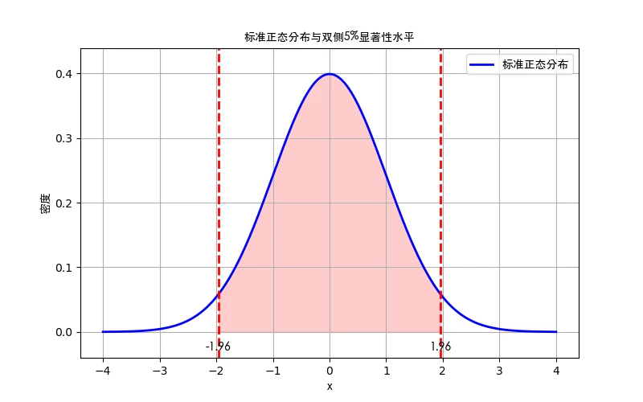
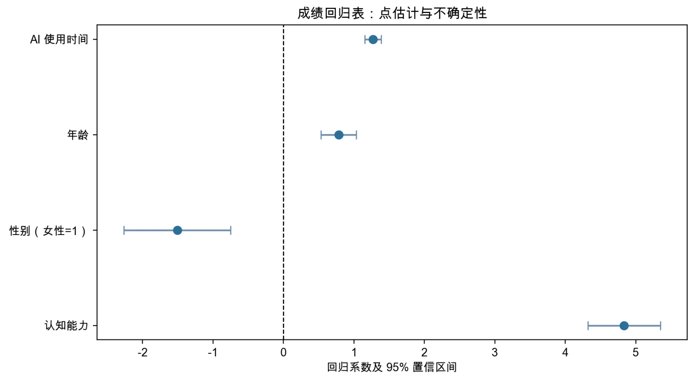

# 第3章 多元线性回归：推断

> “有道之士，贵以近知远，以今知古，以所见知所不见。”
> 
> ——《吕氏春秋》

你刚刚做了一次体检。报告单上写着：收缩压145 mmHg。护士看了一眼，说“有点偏高”。你心里一紧——我真的有高血压吗？还是只是因为刚才爬了两层楼梯、有点紧张？

一次测量包含偶然波动，不能完整反映长期水平。这与抽样不确定性有相似之处，但两者并不相同：同一个人的多次血压读数可能受时间、活动和药物影响，彼此也未必独立；回归推断通常讨论从规定总体和抽样机制中反复取样时，估计量怎样变化。这个比喻只用于说明“一个观测结果带有不确定性”。

前两章介绍了如何用最小二乘法估计回归系数。例如，样本中的教育系数可能是2.5，研发投入系数可能是0.3。换一批样本，估计值通常会改变。统计推断研究这种抽样波动，并用标准误、检验和置信区间描述估计的不确定性。

例如，数字经济指标的估计系数是0.35。换一批地区或年份，这个数字还会不会接近0.35？它与0的距离相对于抽样波动算不算大？统计推断回答的是这类不确定性问题。它本身不能判断数字经济是否具有因果效应。

本章将带你掌握三件核心工具。第一件是$t$检验——衡量样本结果与某个零假设之间的距离相对于抽样误差有多大。第二件是置信区间——同时展示点估计和估计精度。第三件是$F$检验——检验多个系数是否共同满足一组约束。大样本推断常借助中心极限定理，但它不是不管数据怎样都正态的万能定律；抽样方式、误差依赖、尾部和矩条件都会影响近似是否可靠。

学完本章，你应当会同时阅读估计值、标准误、检验和置信区间，并知道“没有拒绝等于零”不等于“证明没有关系”。

## 3.1 统计推断基础

前一章教我们算出回归系数，本章关心这个数字有多不确定。例如，样本中的教育系数是2.5，只能说明这一份样本给出了2.5的估计；换一个样本，结果可能是2.0或3.1。统计推断用抽样分布和标准误描述这种变化。

### 3.1a 为什么需要统计推断？

在线性回归中，我们使用样本数据来估计回归模型中的系数。这一过程的核心目的是想了解，在整个总体中，一个解释变量（如教育）对被解释变量（如工资）是否真的有影响，以及这个影响有多大。但我们面对的现实是：我们通常只能观察到一部分个体的数据，即我们所说的样本。也就是说，我们对模型系数的估计结果，是基于这一个样本计算出来的。

这里的关键问题在于：样本具有随机性。不同的样本可能会得出不同的估计结果。比如，我们以两个不同地区的居民为样本，使用相同的模型研究教育对工资的影响，可能得到的教育系数一个是2.5，另一个是2.0。进一步说，即使是从同一总体中随机抽取两个样本，只要样本组成不同，OLS估计的结果也可能不同。这并不代表模型错了，而是因为每个样本中包含的信息不同，因此所得的结果也有所差异。这意味着我们不能把某一次回归的估计值当作“真实值”，而应当把它看作是对总体中真实系数的一种估计。这种估计值带有误差，会因样本的差异而波动。也正因为如此，我们在解释回归结果时，不能只盯着系数的数值，而应该进一步问：

我们能否相信这个估计结果接近真实值？

我们能否判断某个系数在总体中是否真正不为零？

我们是否能估计这个系数的不确定性有多大？

这就需要引入统计推断（statistical inference）的工具。简而言之，统计推断是在只拥有样本数据的前提下，对总体特征进行判断和估计的过程。在回归分析中，它主要包括两方面内容：

假设检验：我们是否有足够的证据拒绝“某个系数等于零”的假设？比如，教育年限的系数是不是显著不等于零？

置信区间：除了一个估计值，我们是否能给出一个合理的范围，来表示这个系数可能的真实取值？

要完成这两个任务，我们必须了解一个核心概念：OLS估计值的抽样分布。

### 3.1b 抽样分布

为什么OLS估计量会有随机性呢？原因在于回归模型中包含了随机误差项。考虑一个最简单的回归模型：

$$Y_{i} = \beta_{0} + \beta_{1}X_{1i} + \beta_{2}X_{2i} + \ldots + \beta_{k}X_{ki} + u_{i}$$

其中$\beta_{0},\ldots,\beta_{k}$是固定但未知的总体参数，而$u_i$包含随机因素。我们用样本计算得到的是$\widehat{\beta}_{0},\ldots,\widehat{\beta}_{k}$。样本不同，估计值也会不同，因此随机的是估计量$\widehat{\beta}_{j}$，而不是总体参数$\beta_j$。估计量在重复抽样中的分布叫作抽样分布。

如果我们能够从总体中无限次地抽取样本，每次都估计一次回归系数，并把所有的估计值画在数轴上，就会得到一个形状类似的分布图。大多数估计值会集中在真实参数值附近，少数估计值会偏离得比较远。这就是 OLS 估计量的抽样分布。

在相应经典条件下，OLS估计量可以具有无偏性和有效性。无偏表示重复抽样的平均值等于真实参数；有效性比较同一类无偏估计量的波动大小。对多元回归中的第$k$个系数，其条件方差可以写成：

$$\operatorname{Var}\left(\widehat{\beta}_{k}\mid X\right)
=\frac{\sigma^{2}}{\sum_i \widetilde X_{ki}^{\,2}}$$

这里$\widetilde X_{ki}$是把$X_k$对其他解释变量回归后留下的残差。它表示$X_k$中不能被其他解释变量解释的独立变化。多元回归不能直接套用一元回归中的$\sum(X_{ki}-\bar X_k)^2$作为分母，因为解释变量之间的相关性也会影响估计精度。

不需要推导这个公式，只要读懂方向：误差波动越大，估计越不精确；$X_k$在扣除其他解释变量后剩下的变化越多，估计通常越精确。

我们还需要知道抽样分布的形状。在经典线性模型下，如果误差项服从正态分布，OLS估计量也服从正态分布：

$$\widehat{\beta}_k\sim N\!\left(\beta_k,\operatorname{Var}(\widehat{\beta}_k)\right)$$

现实中的误差项未必正态。在独立性、有限矩和模型设定等正则条件下，大样本中的OLS估计量通常可以用正态分布近似。这里的“大”没有一个适用于所有数据的固定门槛；厚尾、强相关、少量聚类或极端不平衡的数据都会使近似变差。

正态或$t$分布近似使我们能够把“估计值离假设值有多远”换算成检验和置信区间。后面要学的$t$检验，正是用标准误把这个距离标准化。

图3-1 标准正态分布及其5%临界点

举一个直观的比喻：假设我们在黑暗的房间里，试着摸一张桌子的宽度。我们每次伸手摸到的结果都可能差一点，有时候偏大，有时候偏小。但如果我们把无数次测量结果画出来，它们大体会围绕着真实的宽度聚集成一个正态分布。OLS估计量的抽样分布就是这样的规律。而我们要做的，就是利用这个分布，判断我们的测量值是否足够接近真实值，或者给出一个区间，说明真实值大概在哪里。

一句话记忆：回归系数会随样本变化，标准误描述这种变化有多大，抽样分布则帮助我们把这种不确定性转化为检验和区间。

> 专栏3-1 中心极限定理与钉板实验
>
> 中心极限定理讨论的是：在独立性、有限方差等条件下，许多随机变量的和或平均值经过标准化后，其分布会逐渐接近正态分布。它不是说所有原始数据都会变成正态分布。
>
> 英国科学家高尔顿（Francis Galton）在19世纪做过一个著名的实验。他发明了一个装置，后来被称为“高尔顿钉板”。想象一下，一个三角形的钉板，上面密密麻麻排满了钉子。如果从顶端放下很多小球，小球下落的过程中会不断碰到钉子，每次碰撞都会随机地往左或往右偏移一下。最后，这些小球会落入底部的一排格子里。
>
> 
>
> 如果你只看一两个小球的轨迹，完全是随机的，左也行右也行。但当成百上千个小球落下之后，你会惊讶地发现：底部格子里小球的堆积高度会形成一个优美的钟形曲线，正好就是正态分布的形状！
>
> 钉板给出了一个直观例子：每个小球经历许多近似独立的左右碰撞，最终位置是这些小变化的加总，因此大量小球的落点呈现近似钟形。这个例子满足特定条件，不能推广成“任何随机过程都会变成正态”。
>
> 为什么这对我们学计量经济学如此重要呢？原因在于：很多统计推断方法，如置信区间和假设检验，都是建立在正态分布假定上的。但现实中我们往往并不知道误差项的真实分布是不是正态。如果没有中心极限定理，我们几乎无法开展这些分析。而正是因为中心极限定理告诉我们：只要样本量足够大，即使真实分布并非正态，我们依然可以放心地使用正态分布作为近似，从而进行推断。这就是为什么在教材和研究中经常强调大样本的意义。
>
> 中心极限定理讨论的是样本均值、加总量或估计量的抽样分布，并不意味着原始经济变量本身会变成正态分布。工资常常右偏，金融收益也可能具有厚尾。大样本正态近似能否使用，仍要检查抽样方式、相关性、尾部和矩条件；面板、时间序列或聚类数据还需要与其依赖结构相匹配的标准误。
>
> 对本章而言，中心极限定理最重要的用途很具体：它说明为什么在条件合适且样本足够大时，我们可以近似使用正态分布进行回归推断。

## 3.2 t检验

在理解了估计量的抽样分布之后，我们就能认识到：估计量并不是固定的，它会因为抽样不同而有所波动。这意味着，当我们得到一个回归系数的估计值时，必须区分两种可能：它可能真实地反映了总体关系，但也可能只是一次抽样误差的结果。为了判断哪种可能性更合理，我们需要一套系统的方法，这就是假设检验的思想。

在回归分析中，最常见的问题是：在给定模型中，某个解释变量的总体回归系数是否为零？系数为零表示，在控制模型中的其他变量后，没有检测到相应的线性条件关系；它本身并不自动回答因果关系是否存在。更一般地说，我们常常想要检验一个总体参数是否等于某个特定值，例如零或理论预测的数值。总体参数本身是未知的，我们无法直接观察它，只能先提出一个假设，再利用样本判断该假设是否与数据相容。

那么，如何判断一个估计量是否等于某个特定值呢？这就需要借助它的抽样分布。我们知道，如果假设成立（比如系数等于零），那么估计量会围绕这个假设值随机波动，其波动的大小由标准误来衡量。因此，合理的做法是：把“估计值与假设值的差”与“标准误”进行比较。如果两者相差很小，那么样本结果可能只是正常的随机波动；如果差距远远大于标准误，那么我们就有理由怀疑这个假设不成立。

为了量化这种偏离程度，我们需要同时考虑两个因素：

估计值与假设值的差距：如果估计值远离假设值，说明样本结果可能与零假设不一致。

估计值的不确定性（标准误）：即使偏离较大，如果标准误也很大，这种差异可能只是正常的随机波动。

把这两个因素结合起来，我们构造了一个统计量：

$$t = \frac{\widehat{\beta} - \beta_{0}}{\operatorname{se}(\widehat{\beta})}$$

其中，$\beta_0$是原假设给定的数值。分子表示估计值与假设值之间的距离，分母表示估计值的不确定性，比值告诉我们：这种偏离相对于随机波动是否足够大，是否值得怀疑原假设。从直观上理解，这就像衡量一根天平的倾斜程度：偏离越大、天平越稳，样本结果与原假设越不相容；如果偏离小或者天平本身晃动很大，我们就不能轻易否定原假设。

式子中的估计值来自样本，假设值由研究问题给定，分母$\operatorname{se}(\widehat{\beta})$也由样本估计。在经典线性模型中，若误差项独立、同方差并服从正态分布，使用常规标准误构造的统计量在有限样本中精确服从$t$分布。误差不正态时，大样本下通常依靠渐近近似；存在异方差、序列相关或聚类相关时，还要采用与数据结构匹配的标准误和参考分布。因此，“总体方差未知且样本有限”本身不足以保证精确$t$分布。

图3-2 自由度为5的t分布

总体参数未知，所以研究者先提出一个可检验的数值假设，再考察样本与该假设是否相容。回归中最常见的是$H_0:\beta_j=0$，因为零表示在所设定模型中没有线性偏效应。但这一检验不能自动决定变量是否“有用”或是否应保留。用于控制混杂、满足预先设定研究设计或提高预测表现的变量，即使系数不显著，也可能需要保留；变量选择应由研究目标、理论和验证结果共同决定。

当然，零并不是唯一可以检验的数。在某些情况下，我们也可能检验系数是否等于其他特定值。例如，如果经济理论预言某个弹性应该等于 1，我们就可以检验系数是否显著不同于 1。但无论检验什么值，背后的逻辑都是一样的：提出一个明确的数值假设，然后用抽样分布来判断估计结果是否与该假设一致。

因此，t 检验并不是凭空产生的。它正是建立在“估计量有抽样分布”这一点之上：如果假设成立，估计量就应该围绕这个假设值波动；如果样本结果和这个假设差距过大，就说明假设不再合理。通过这种方式，我们就能把不可观测的真实值问题，转化为一个可操作的统计检验问题。

> 专栏3-2 “学生”与$t$分布
>
> 在统计学的世界里，t 分布和 t 统计量几乎是小样本推断的代名词。它们的出现，有一段既科学又充满人情味的历史。
>
> 故事要从1908年说起。当时，英国吉尼斯啤酒公司希望在生产过程中控制原料质量，但只能获取少量样本。传统的正态分布推断在小样本下表现不稳定，经常导致错误判断。年轻的统计学家威廉·戈塞特（William Sealy Gosset，以笔名Student发表论文）注意到：当样本量有限、总体方差未知时，普通的正态分布方法会低估数据的波动，从而得出不可靠的结论。于是，他推导出了一种新的分布——今天我们称之为Student's t分布（Student，1908）。
>
> 想象你想知道一组样本的平均值是否显著不同于某个假设值，但你不知道总体方差，只能从样本数据估计标准差。样本估计的标准差本身会随着样本不同而波动，这意味着你构造的偏离程度（估计值减去假设值）需要与标准差的波动同时考虑。
>
> 这时，数学上可以证明：
>
> $$t = \frac{\text{样本均值}-\text{假设均值}}{\text{样本标准误}}$$
>
> 这个比值的分布不是正态分布，而是 t 分布。它比正态分布的尾巴更“胖”，也就是说，在小样本下出现极端偏离的概率更高。直观地说，t 分布给了我们一个更保守的判断标准，让小样本推断更可靠。
>
> t 统计量的构造非常精妙：分子是偏离程度，衡量估计值离零假设有多远；分母是“随机波动的度量”，也就是样本标准误；比值就是把偏离和不确定性结合起来，形成一个无量纲指标，可以直接与 t 分布比较，判断偏离是否显著。这个形式不仅解决了小样本未知方差的问题，还体现了统计推断的核心思想：衡量信号相对于噪声的大小。
>
> 在常见正则条件下，大样本中的OLS估计量可以用正态分布近似。小样本下，经典t分布结论还要求线性模型、同方差正态误差等条件；并不是样本小就可以无条件使用t分布。
>
> t 分布和 t 统计量的出现，是统计学家为解决现实问题——有限样本和未知方差——提出的优雅方案。它不仅有严谨的数学基础，也有深刻的直觉意义：偏离值越大、噪声越小，我们对假设的否定就越有把握。
>
> 今天回归分析中的$t$检验，延续了戈塞特处理小样本不确定性的思路：先指定一个可检验的假设，再判断样本结果与它是否相容。

在一个多元回归模型里，t 检验要回答的问题很具体：控制住其他解释变量不变时，某个系数是否显著不同于某个给定数（最常见是0）。形式上，模型可以写为：

$$Y_{i} = \beta_{0} + \beta_{1}X_{1i} + \beta_{2}X_{2i} + \ldots + \beta_{k}X_{ki} + u_{i}$$

我们观察到的是样本估计$\widehat\beta_j$，检验的是未知总体参数$\beta_j$是否等于某个给定值$\beta_{j0}$，最常见的给定值是0。思想很简单：把样本估计与假设值的距离，同估计的不确定性作比较。

它的逻辑可以分为几个步骤：

第一步：提出原假设与备择假设。

原假设通常是某个条件回归系数等于0，例如：

H0: $\beta_{j} = 0$

双侧备择假设是该系数不等于0：

H1: $\beta_{j} \neq 0$

这就是一个双侧检验。如果我们有明确的方向性猜想，比如认为教育对工资的作用应当为正，也可以设定单侧检验：

H1: $\beta_{j} > 0$

第二步：构造统计量。

我们不能直接观察$\beta_j$，只能利用样本估计量$\widehat{\beta}_j$。如果$\widehat{\beta}_j$与零的差距足够大，我们就倾向于拒绝原假设。问题在于，“足够大”如何衡量？答案是要看差距相对于估计的标准误有多大。于是我们构造：

$$t=\frac{\widehat{\beta}_j-\beta_{j0}}{\operatorname{se}(\widehat{\beta}_j)}$$

其中$\beta_{j0}$是原假设指定的数值，最常见的是0；$\operatorname{se}(\widehat\beta_j)$是标准误。分子是估计值与假设值的距离，分母把这个距离换算成“多少个标准误”。$|t|$越大，样本结果与原假设越不相容。

第三步：确定分布并进行比较。

关键问题是这个$t$统计量服从什么分布。在经典线性模型满足条件同方差，且误差项给定解释变量服从正态分布时，OLS系数估计量条件正态；用样本估计误差方差后，相应统计量服从自由度为$n-k-1$的$t$分布。$t$分布对称且尾部比标准正态分布更厚；自由度增大时逐渐接近标准正态。若存在异方差、聚类相关或其他依赖结构，则应使用与数据结构相适应的标准误和大样本近似，不能机械套用这一精确小样本结论。

第四步：做出统计推断。

有了$t$的分布，我们便能制定决策规则。有两种等价做法。其一是临界值法：给定显著性水平$\alpha$（常用0.10、0.05、0.01），查自由度为$n-k-1$的$t$表，得到临界值$T$。双侧检验时，当$|t|>T$就拒绝$H_{0}$。其二是$p$值法：计算在$H_{0}$成立时，观察到当前$|t|$（或更极端）的概率，这个概率就是$p$值。双侧检验的$p$值计算公式是

$$p = 2\Pr\left(T_{n-k-1}\geq |t|\right)$$

单侧检验（例如$H_1:\beta_j>\beta_{j0}$）的$p$值是

$$p = \Pr\left(T_{n-k-1}\geq t\right)$$

$t$表通常不会直接给$p$值，而是列出若干临界点。实践上，可把$|t|$放到相邻两列临界值之间，从而判断$p$值所在的区间；也可用软件得到精确$p$值。正确理解$p$值很重要：它是在原假设和所用统计模型成立时，观察到当前这样或对原假设更不利的检验统计量的概率。它不是“原假设为真的概率”，也不表示结果由“随机机会”造成的概率。当$p$值较小时，数据与原假设的相容程度较低，我们可以按事先设定的显著性水平决定是否拒绝$H_0$。

用一个完整的数值例子串起来更清楚。设有一个工资方程，包含教育（$X_{1}$）、工作经验（$X_{2}$）和性别（$X_{3}$），样本量$n=120$。我们关心教育系数，估计得到$\widehat{\beta}_{1}=0.08$，标准误为$\operatorname{se}(\widehat{\beta}_{1})=0.03$。此时自由度$df=n-k-1=120-3-1=116$。在检验$H_{0}:\beta_{1}=0$的双侧检验下，$t=(0.08-0)/0.03\approx2.67$。查$t$表（或用软件），在$df=116$下，$|t|=2.67$的双侧$p$值约为0.0088，这远小于0.05，于是我们在5%的显著性水平下拒绝原假设。这里可以顺带体会“统计显著性”和“经济意义”不是一回事：统计显著说明数据与零效应假设不太相容，至于0.08的大小是否具有现实重要性，还需要经济学解释与背景知识支撑。

再看一个边缘情形，$\widehat{\beta}_{1}=0.03$，$\operatorname{se}(\widehat{\beta}_{1})=0.02$，同样$df=116$。此时$t=1.50$。双侧$p$值约为0.136，这高于0.10，通常不拒绝$H_{0}$。若研究在事先就提出了单侧备择$H_1:\beta_{1}>0$，那么单侧$p$值约为0.068，仍高于0.05，但低于0.10。在实践中要注意：单侧还是双侧应当在看数据之前就根据研究问题确定，事后根据结果“挑方向”会高估显著性。$t$检验还有一个常用拓展：检验等于某个特定数而非0。例如要检验教育回报率是否等于5%，可设$H_{0}:\beta_{1}=0.05$，把统计量分子改为$\widehat{\beta}_{1}-0.05$。

还要注意几个现实问题。第一，解释变量之间高度相关时，目标系数的标准误可能增大，使其难以精确估计。第二，存在异方差或组内相关时，常规标准误可能错误，应根据数据结构采用异方差稳健或聚类稳健推断；这会改变不确定性估计，但不会修复遗漏变量或函数形式错误。第三，样本量和解释变量的有效变异会影响检验功效。因此，应同时报告点估计、标准误和置信区间，不能把“是否显著”作为唯一结论。

第五步：理解经济含义。

$t$检验不能代替经济解释。假设工资方程中的教育系数为0.08，$t=3$，我们可以说教育的条件相关系数为正，并且样本结果与“系数等于0”的假设不太相容。0.08在现实中是否重要，以及能否解释为教育回报，仍要结合变量单位和识别条件。

第六步：多元回归下的意义。

在多元回归中，$t$检验考察的是：控制模型中的其他变量后，某个回归系数是否与假设值显著不同。比如，在工资方程中同时纳入教育和工作经验，教育系数显著表示样本数据与“教育的条件线性系数为零”这一假设不太相容。它仍不能单独证明教育具有因果作用。

通过本节的学习，我们认识到，t 检验的出发点是提出一个零假设，例如“某个回归系数等于零”。这一假设对应的含义往往是：该解释变量对被解释变量没有系统性影响。然后我们利用样本信息，结合估计量的抽样分布，来判断样本结果是否与零假设相符。如果样本结果与零假设差距很大，就有理由否定零假设；如果差距不大，则只能认为样本没有提供足够的证据去推翻它。值得强调的是，t 检验以及所有的统计检验方法，都遵循同一逻辑：我们无法证明一个假设必然为真，只能在概率意义上尝试否定它。

> 专栏3-3 统计检验也会犯错：误报与漏报
>
> 既然是推断，就难免会出现判断错误。第一类错误（Type I error）可以理解为“误报”：零假设实际上为真，我们却错误地拒绝了它。在回归中，这相当于总体系数确实等于0，样本波动却产生了一个显著结果。显著性水平$\alpha$（如5%）正是对这种长期误报概率的事先控制。
>
> 第二类错误（Type II error）可以理解为“漏报”：总体系数实际上不为0，但样本信息不足，我们没有拒绝零假设。样本量较小、真实效应较弱或数据噪声较大，都可能增加漏报。检验功效等于发现既有差异的概率，通常随样本量和真实效应增大而提高。
>
> 例如检验教育系数是否为0：第一类错误是教育系数实际为0却报告显著；第二类错误是教育系数实际不为0却没有发现显著关系。因此，“显著”不等于发现真理，“不显著”也不等于证明没有关系。本章只要求理解这种错误管理逻辑，不要求编写两类错误的模拟程序；有兴趣的读者可以在蒙特卡洛专题讲义中进一步实验。

社会和经济研究通常只能观察有限样本。统计推断把估计值与抽样不确定性放在一起，帮助我们判断哪些参数值与数据较为相容。它不会单独揭示“真相”，结论还取决于抽样方式、模型设定和研究设计。

## 3.3 置信区间

在前面的学习中，我们介绍了$t$检验。它属于假设检验：先提出一个具体的假设值，例如$\beta_j=0$，再判断样本结果与这个假设是否相容。现在我们换一个问法：与数据相容的参数值大致落在哪个范围？这就是区间估计要回答的问题。

实际研究通常还关心参数的大致范围。例如，工资回归中的教育系数即使显著大于0，2%和10%的经济含义也很不同。光有“显著”不足以讨论现实量级，还要看区间允许哪些数值；能否把系数称为教育回报率，则取决于识别设计。

置信区间提供的是区间估计，而不是单点判断。以95%置信区间为例，严格的频率学派解释是：如果按照同一抽样与构造程序反复取样，长期来看约95%的区间会覆盖真实参数。对眼前这一条区间，我们可以说它给出了与数据和模型相容的参数范围，但不能说“真实参数有95%的概率落在其中”。

置信区间的核心公式是：

$$\text{估计值}\ \pm\ \text{临界值}\times\text{标准误}$$

对回归系数$\beta_j$，可写为

$$\widehat\beta_j\ \pm\ t_{1-\alpha/2,\,n-k-1}\operatorname{se}(\widehat\beta_j).$$

不需要推导这个式子，只要读懂三部分：估计值是区间中心，标准误反映不确定性，临界值决定区间要放多宽。若按照同一抽样和构造程序反复取样，长期来看约有$1-\alpha$比例的区间覆盖真实参数。大样本下95%区间的临界值常接近1.96；经典正态线性模型的小样本推断使用相应自由度的$t$临界值。

与t检验相比，置信区间有几个明显的优势：

第一，它能提供更多的信息。$t$检验针对一个给定假设值作出拒绝或不拒绝的判断，置信区间同时展示估计方向、大小和精度。例如，教育系数的置信区间为$(0.04,0.12)$，说明在所用模型与推断程序下，与数据相容的系数范围为0.04到0.12。能否称为教育的“作用”，还取决于因果识别条件。

第二，它能帮助我们理解估计精度。如果置信区间很窄，说明在所用标准误和模型下估计较精确；这种精度可能来自较大的样本量、较小的误差波动或更有利的解释变量变异。区间较宽则表示数据允许的参数范围较大。置信区间包含零时，应表述为“不能在相应显著性水平下拒绝系数为零”，而不是断言不存在关系。

第三，置信区间便于同时呈现点估计的方向、量级和不确定性。它给出在既定模型和构造方法下与数据相容的参数范围，比只报告显著性星号包含更多信息；但区间本身也依赖抽样设计、标准误和模型设定。

### 置信区间与t检验的关系

其实，置信区间和t检验之间并没有本质区别。95%置信区间的含义就是“所有不会在5%显著性水平下被拒绝的参数值的集合”。换句话说，如果0不在95%置信区间里，我们在5%显著性水平下就会拒绝“参数等于0”的原假设；如果0在区间里，我们就不能拒绝原假设。因此，置信区间可以看作是t检验的扩展：它不是只检验某一个点，而是一次性把所有可能的参数值放进来检验，并把那些站得住脚的数值留下。

### 一个数值例子

假设我们在500个样本上估计了工资方程：

$${wage}_{i} = \beta_{0} + \beta_{1}{education}_{i} + \beta_{2}{experience}_{i} + u_{i}$$

结果显示，教育的系数估计值为${\widehat{\beta}}_{1}$=0.08，标准误是0.02。如果采用95%置信水平，自由度大约是497，临界值接近1.96。于是置信区间为：0.08±1.96×0.02=(0.04,0.12)。

如何解读？按照同一抽样和区间构造程序反复进行研究，约95%的此类区间会覆盖真实的$\beta_{1}$。对当前区间，可以说0.04到0.12是与样本数据和模型相容的参数范围。频率学派的95%置信区间不是说“固定参数有95%的概率落入已经算出的区间”。

置信区间同时呈现点估计和抽样不确定性。与只报告显著性相比，它能让读者看到数据所支持的参数范围，并据此讨论经济意义。

## 3.4 F检验

在多元回归中，我们有时要检验一组系数是否共同满足某些限制。例如，在工资方程中，可以检验教育和工作经验的条件回归系数是否同时为0。分别做多个$t$检验不能直接回答这个联合问题，也没有正确利用系数估计之间的相关性。

为了解决这一问题，F检验应运而生。F检验是一种整体显著性检验，它可以检验多元回归中一个或多个回归系数是否同时为零。设想我们有如下回归方程：

$$Y_{i} = \beta_{0} + \beta_{1}X_{1i} + \beta_{2}X_{2i} + \ldots + \beta_{k}X_{ki} + u_{i}$$

如果我们想检验$X_{1},X_{2},...,X_{k}$这一组解释变量是否联合影响Y，即原假设为：

H0:$\beta_{1}$=$\beta_{2}$=⋯=$\beta_{q}$=0

备择假设为：

H1:至少有一个$\beta_{j}$≠0

F检验的核心思想是比较两个模型的拟合优度：

限制模型（Restricted Model）：在原假设下构建的回归方程，即把要检验的 q 个系数限制为0。

完整模型（Unrestricted Model）：包含所有解释变量的原始回归方程。

如果原假设成立，限制模型与完整模型的拟合效果差别不大；如果原假设不成立，完整模型显著优于限制模型。我们用残差平方和（RSS）来衡量拟合效果。设完整模型的残差平方和为$RSS_{U}$，限制模型的残差平方和为$RSS_{R}$。F统计量定义为：

$$F = \frac{({RSS}_{R} - {RSS}_{U})/q}{{RSS}_{U}/(n - k - 1)}$$

其中，q是受检变量的数量，n是样本容量，k是完整模型中解释变量的总数（不包括截距项）。

直观上，F统计量衡量限制条件导致的拟合损失相对于误差方差的大小。在经典线性模型且误差独立、同方差、正态时，有限样本中的统计量精确服从自由度为$q$和$n-k-1$的F分布。存在异方差或聚类相关时，应使用相应稳健协方差矩阵构造Wald/F检验，其依据通常是大样本近似。当$q=1$且使用同一种协方差估计时，F检验与双侧t检验等价：$F=t^2$。

假设我们有200个样本，用三个解释变量回归工资：教育、工作经验和所在行业的虚拟变量。我们想检验$H_0:\beta_{edu}=\beta_{exp}=0$。完整模型残差平方和$RSS_U=800$，限制模型残差平方和$RSS_R=1200$，$q=2$、$k=3$、$n=200$。代入公式：

$$F=\frac{(1200-800)/2}{800/(200-3-1)}\approx49.02$$

因此拒绝联合零假设。这个结果只说明数据不支持“两个系数同时为零”，并不证明模型设定正确，也不自动赋予系数因果含义。

F检验可以一次性检验一组参数限制。如果整组系数未能拒绝为零，可能是效应较小、估计不精确或模型设定不合适。即使拒绝零假设，也只能说这组变量在统计上联合相关；能否称为“政策有效”，仍取决于研究设计与识别假设。

## 3.5 案例实践：一张工资回归表告诉了我们什么

【案例背景】

前几节我们学习了$t$检验、置信区间和$F$检验。但学生在实际阅读论文时，面对的不是彼此分开的公式，而是一张同时出现系数、括号、星号、样本量和拟合优度的回归表。本章把所有实践集中到一张工资回归表中，训练从“看见数字”到“形成规范结论”的完整过程。

本章继续使用教学用工资数据，以教育年限为核心解释变量，以工作经验和任职年限为控制变量。案例不再要求模拟第一类错误和第二类错误，而是集中训练最常用的应用能力：识别回归表结构、完成单个系数推断、进行联合检验，并区分统计显著性、经济显著性与因果解释。

这里使用的是教学用模拟工资数据，目的不是让学生得出某个真实劳动力市场结论，而是训练“如何做推断”。真实研究中，数据来源、样本代表性、变量测量和识别假设还需要进一步讨论；本章先把注意力集中在回归结果表本身。

【案例要解决的问题】

本案例要回答三个相互关联的问题。

第一，一张回归表中的系数、标准误、$t$值、$p$值、置信区间、样本量、$R^2$和$F$统计量分别表达什么？

第二，怎样围绕教育系数完成一套完整推断，而不是只看$p$值和显著性星号？

第三，怎样进行经验与任职年限的联合检验，并把统计结果改写成准确、克制的论文语言？

【AI Agent工作流准备】

开始操作前，先选择教育变量这一行，用自己的话预测系数、标准误、$t$值和置信区间之间应该具有怎样的数值关系。然后让Agent进入`chapter03_project/`，只读检查任务卡、数据生成过程和推断脚本，说明准备怎样生成回归表、核对置信区间并执行联合检验。确认计划后再运行程序。

Agent必须区分“软件真实输出”与“根据星号作出的概括”。你可以要求它重新计算$t$值、置信区间和联合检验，也可以让它把回归结果整理为规范表格；但系数的经济含义、统计显著性是否具有现实重要性、结果能否解释为因果效应，仍必须由你判断。

完成后，把实际回归表、手工核对结果、Agent提出但未采用的解释以及核验依据写入`ai_log.md`。

【实践任务】

本章实践任务可以任选Stata或Python完成。正文不放代码，配套代码放在外置代码包中。

> 📁 配套代码包：
> - Stata：`code/stata/ch03/`
> - Python：`code/python/ch03/`
> - AI Agent任务卡：`code/ai_cards/ch03_ai_task_card.md`
>
> 提交产出：1张回归结果表 + 1张系数区间图 + 300字结果解释 + 可复现代码 + `ai_log.md`

**任务1：认识回归表的结构。** 使用教学工资数据估计对数工资对教育、经验和任职年限的回归，整理一张包含系数、标准误、$t$值、$p$值和95%置信区间的结果表，同时报告样本量、$R^2$和整体$F$统计量。逐项说明这些数字回答什么问题。

**任务2：跟踪教育系数完成单个参数推断。** 写出$H_0:\beta_{educ}=0$，根据系数与标准误核对$t$值，解释$p$值和95%置信区间，并绘制教育、经验和任职年限的系数区间图。说明统计显著、经济显著和因果效应为什么是三种不同判断。

**任务3：完成联合检验并撰写结果。** 检验$H_0:\beta_{exper}=\beta_{tenure}=0$，解释拒绝或不拒绝联合原假设意味着什么。最后将点估计、不确定性、联合检验和解释边界整合为一段200—300字的论文式结果分析。

【结果讨论】

回归表把点估计和不确定性放在一起。教育系数表示控制经验与任职年限后的条件相关；标准误衡量该估计在重复抽样中的不稳定程度；$t$值把估计值与原假设比较；$p$值衡量原假设下出现当前或更极端统计量的概率；置信区间则给出一组与数据较为相容的参数值。星号只是$p$值的压缩标记，不能代替这些信息。

图3-3 工资回归表中的点估计与95%置信区间

教育系数如果为正且置信区间不包含0，可以说样本结果与“教育条件回归系数为0”的假设不太相容。如果被解释变量是对数工资，教育系数还可以近似解释为教育每增加一年，条件均值相差约$100\widehat\beta_{educ}\%$。但统计显著不等于经济影响很大，更不自动证明教育具有因果效应。

$F$检验回答的是经验和任职年限这组变量能否被同时排除，而不是证明每一个变量都单独显著。如果拒绝联合原假设，只能说数据不支持“二者系数同时为0”。模型是否设定正确、变量是否外生以及结论能否推广，仍要依靠后续诊断和研究设计。

【案例总结】

本章案例只围绕一张工资回归表展开。学生先识别表格结构，再跟踪教育系数完成单个参数推断，最后用联合检验和论文式语言整合结果。第一类错误和第二类错误作为专栏保留，用于提醒显著与不显著都可能判断错误，但不再增加额外的模拟负担。

面对一张回归表，我们不仅要看系数大小，还要看标准误、$t$值、$p$值、置信区间和联合检验；不仅要说“显著不显著”，还要说明经济含义和解释边界。学会这一点，才算真正从“会运行回归”走向“会判断回归”。

## 本章小结

本章主要围绕多元回归分析中的统计推断展开，目标是帮助你理解如何在样本数据的基础上，对回归系数以及整个回归模型进行科学判断。

首先，我们复习了OLS估计量的抽样分布。不同样本会产生不同的回归系数，因此要用抽样分布描述不确定性。在独立抽样、有限矩和模型正则性等条件下，OLS估计量在大样本中通常具有渐近正态分布；面板、时间序列或聚类数据则需要针对其依赖结构建立推断。中心极限定理不是“样本足够大就必然正态”的无条件保证。

接着，本章详细介绍了单个回归系数的$t$检验。它用于检验某个条件回归系数是否等于事先指定的数值。在原假设和所用统计模型成立时，$p$值表示观察到当前这样或对原假设更不利的检验统计量的概率。$p$值较小表示数据与原假设的相容程度较低，但不能单凭$p$值判断变量的现实重要性或因果作用。

随后，我们学习了置信区间的概念。置信区间提供了系数可能取值的范围，让我们不仅能判断显著性，还能直观理解估计的不确定性。例如，一个95%的置信区间意味着在重复抽样的条件下，有95%的样本会产生包含真实系数的区间。相比单纯的t检验，置信区间更强调估计量的不确定性和实际含义。

本章还引入了$F$检验，用于检验多个系数是否共同满足一组线性约束。常见的“整体显著性检验”把除截距外的斜率系数同时设为零，但拒绝这一原假设只表示至少一个相应线性系数不为零，不能证明模型设定正确、具有因果解释或整体上“合理”。

最后，本章通过工资回归表案例，把系数估计、标准误、$t$检验、置信区间和$F$检验放回同一份结果中进行解读。第一类错误和第二类错误以专栏形式保留，用来提醒统计检验可能发生误报和漏报，但不作为必做模拟。总体而言，本章建立了从单个系数到联合检验的推断框架，目标不是让学生记住显著性规则，而是能够完整读懂回归表、核对关键数字，并用准确语言表达统计证据及其边界。

## 思考与练习

**1.** 一位同学跑完回归后，发现教育变量的$p$值为0.12。他对你说：“$p$值大于0.05，说明教育对工资没有影响。”请指出他理解中的两处错误：（1）没有拒绝H₀和接受H₀是不是同一回事？（2）$p$值大于0.05可能是因为真实效应确实为零，也可能是因为什么其他原因？举出至少两种可能导致不显著但真实关系存在的情形。

**2.** 另一位同学在论文中写道：“F检验的$p$值小于0.01，说明模型中所有变量都在1%水平上显著。”请指出这句话中的混淆：（1）F检验的零假设是什么？拒绝它意味着什么？（2）F检验通过是否保证每个变量都显著？请用至少有一个变量显著和所有变量都显著的区别来修正这句话。

**3.** 运行第3章案例代码，选择教育变量这一行进行核对。（1）用系数除以标准误重新计算$t$值；（2）根据软件给出的临界值或置信区间，判断是否拒绝$H_0:\beta_{educ}=0$；（3）检查$t$检验、$p$值和95%置信区间是否给出一致结论；（4）说明为什么这些结果仍不能单独证明教育对工资具有因果作用。

**4.** 使用本章工资回归表完成结果说明。（1）用完整句子解释教育系数，并同时报告点估计、标准误和95%置信区间；（2）写出经验与任职年限的联合零假设，解释拒绝它意味着什么；（3）如果教育系数的95%置信区间不包含0，有人写道“我们有95%的把握认为教育对工资具有正向因果影响”。这句话包含哪两层误解？应如何改写？

**5.** 先独立判断以下表述是否正确并写出理由，再让AI Agent读取本章推断部分和工资回归输出后检查：（a）“$p$值=0.03意味着零假设为真的概率是3%”；（b）“得到这个95%置信区间后，固定参数落入该区间的概率仍为95%”；（c）“样本量越大，$p$值一定越小”；（d）“不拒绝H₀就说明H₀为真”。比较后回答：（1）Agent是否准确指出每句话的问题？（2）它是否说清楚“区间是随机的，参数是固定的”？（3）选一句重写为正确表述，并注明所依据的教材段落或回归输出。

**6.** 回顾你在本章案例实践中记录的`ai_log.md`。反思：（1）Agent是否实际运行程序并保存回归表与区间图，还是只根据代码猜测结论？（2）它是否重新核对了$t$值、置信区间和联合检验？（3）它在解读工资回归时是否只盯着$p$值和星号，忽略系数大小、经济含义和因果解释边界？

## 拓展阅读

- **一张回归表为什么会有系数、标准误、括号和星号？** Wooldridge（2020）第4章以及第5章的大样本OLS部分给出完整答案，Stock与Watson（2020）的推断章节则提供较多直观解释。零基础阅读时不要同时追很多符号，只选一个系数走完整个过程：点估计告诉我们样本中的最佳猜测，标准误描述这项猜测有多不稳定，$t$统计量把估计值与原假设比较，置信区间给出一组与数据相容的数值。读完后拿一张真实回归表，用四句普通话逐项解释；若仍只能说“有星，所以显著”，就说明还需要回到标准误和区间部分。
- **$t$分布诞生于一个很实际的小样本难题**。以“Student”为笔名发表论文的Gosset面对的是样本很少、总体方差又不知道的情况；Student（1908）讨论怎样在这种条件下衡量均值估计的误差。原文有年代感，第一次读摘要、问题设置和分布图即可，不必复现全部积分推导。随后用本章模拟比较正态临界值和$t$临界值：样本只有十几个时，$t$分布会给尾部留出更多空间；样本逐渐增大，两者才越来越接近。软件根据自由度改变临界值，并不是一个可有可无的技术细节。
- **统计显著性曾经把很多论文带进误区，这场争论至今仍值得本科生读**。Wasserstein与Lazar（2016）的美国统计协会声明用较短篇幅说明$p$值能做什么、不能做什么；Wasserstein、Schirm与Lazar（2019）进一步讨论为什么研究报告不应围着“是否小于0.05”打转。先看其中列出的常见误解，再选一段带星号的回归结果，补写效应量级、置信区间、研究设计和不确定性。还可用Stata的`test`、`testparm`、`lincom`或Statsmodels的`t_test`、`wald_test`做一次联合检验。重点不是多学几个命令，而是先把原假设写成一句清楚的话。
