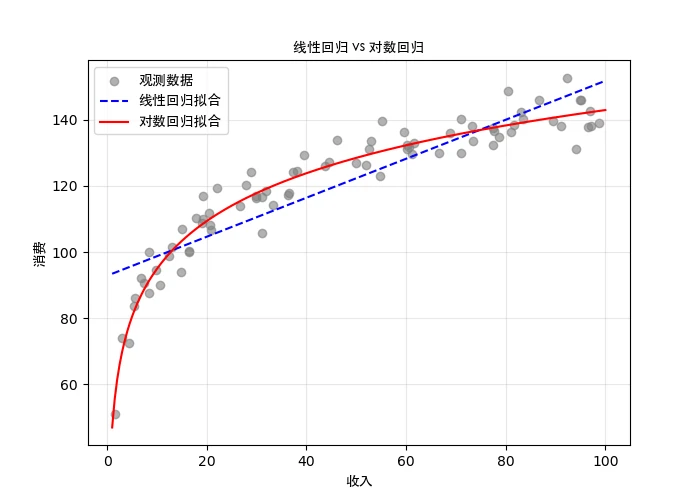
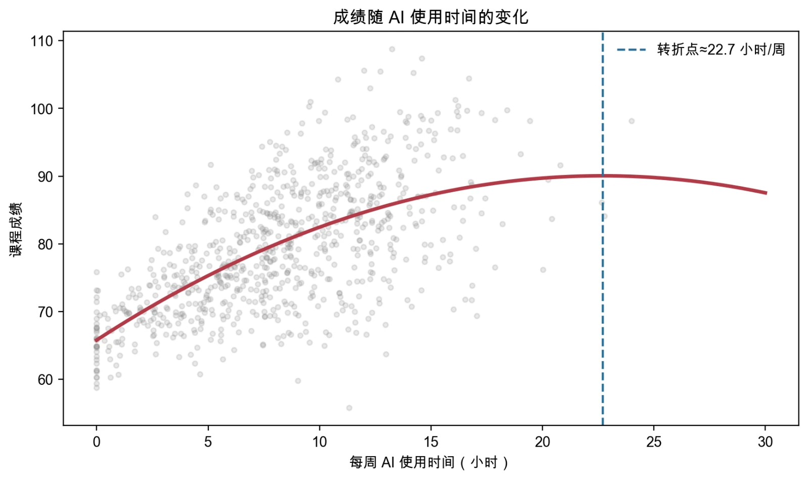
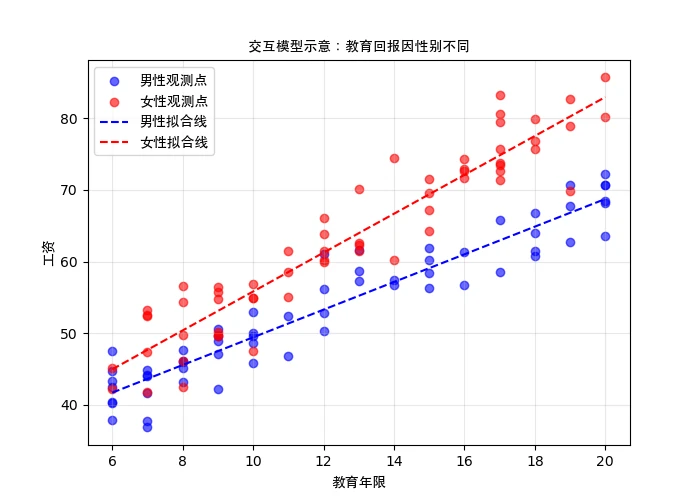
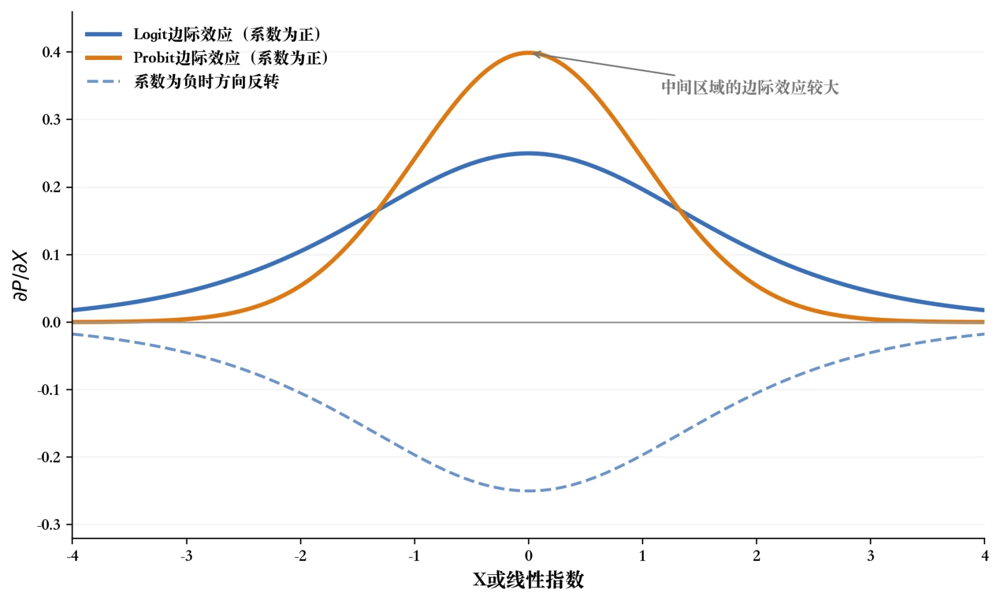
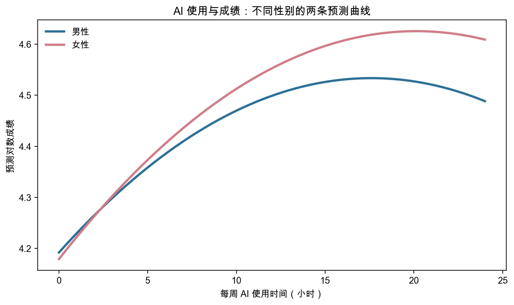

# 第4章 回归模型扩展：函数形式与二元结果

> “荃者所以在鱼，得鱼而忘荃。”
>
> ——《庄子·外物》

地铁线路图不会按真实比例画出整座城市。它只保留站点顺序和换乘关系，却比一张巨大的等比例地图更适合找路。模型也一样：它要保留与研究问题有关的结构，而不是复制现实的全部细节。前三章的工具都建立在一个默认设定上：被解释变量是连续的，关系是一条直线。这两个默认在第3章的案例里都还好用——成绩是分数，AI 使用时间是小时，一条直线足以概括它们的平均关系。但现实中，这两个假设经常不成立。家庭消费随收入增加而上涨，可增幅会逐渐变小；工资随教育年限上升，可每多读一年带来的回报未必相同；而如果把研究问题从“成绩多少分”改成“是否达到课程目标”，被解释变量就只剩 0 和 1 两个取值了。本章从两个方向扩展这套工具。

**第一个方向是改变变量进入模型的方式**：用对数描述相对变化和比例关系，用二次项描述弯曲关系，用虚拟变量和交互项描述分类信息与群体差异。**第二个方向是改变被解释变量的类型**：讨论当结果只有 0 和 1 时，模型应该描述什么、系数应该怎样翻译。公式会比前三章多一些，但整章始终围绕三个问题打转：研究对象是什么，变量怎样进入模型，结果应当怎样翻译。只要抓住这三问，公式就只是工具，不会成为负担。本章与第3章考察的是同一个问题——**AI 使用时间与课程成绩之间是什么关系**。第3章用一条直线描述它，并讨论了控制变量的作用；本章允许这条关系弯曲、允许它随群体变化，最后再追问：如果研究结果改成“是否达到课程目标”，模型和解释应当怎样调整？

同一份数据被反复使用，正是为了让读者看清楚——变的不是数据，而是我们向数据提出的问题。

## 4.1 模型形式首先是经济假设

### 4.1a 经济模型、计量模型与估计方程

回归方程不是把现实机械地抄进公式，而是把研究问题转成一组可估计的假设。这个转译过程其实分了三层，把它们区分开，是理解本章所有内容的起点。

**经济模型**回答“哪些机制值得关注”。它来自经济理论和对制度背景的判断：消费取决于收入，教育回报取决于劳动力市场对技能的定价，AI 的使用效果取决于它与学习方式的匹配程度。经济模型通常不写具体的函数形式，它给出的是变量之间的方向和机制。

**计量模型**把经济模型落到变量和函数形式上：哪些可观测变量代表这些概念，它们以什么形式进入，误差项包含什么。这时就会遇到本章要处理的全部选择——取不取对数、要不要平方项、性别用虚拟变量还是分组回归、关系是否随群体变化。

**估计方程**则是最终送进软件的那一行代码所对应的式子：具体到每一个变量的名字、每一个系数要估计什么。三层之间相互关联，却不能混为一谈。一个常见的误区是把三层压缩成一层，看到软件输出的系数就以为它自动等同于经济模型里的那个机制——**中间的函数形式选择、变量测量和识别假设都被跳过了**。

“线性回归”中的**线性**，首先是指模型对未知参数线性，而不是要求所有变量之间都呈直线关系。例如，下面两个模型都可以用 OLS 估计：

$$
Y_i=\beta_0+\beta_1X_i+\beta_2X_i^2+u_i,
$$

$$
\ln Y_i=\beta_0+\beta_1\ln X_i+u_i.
$$

式中的 $\ln$ 是**自然对数**（以 $e\approx2.718$ 为底）：它换一个尺度来看变化，把原尺度上的乘法关系变成加法关系。前者允许曲率，后者给出弹性解释，但两者的未知参数 $\beta_0,\beta_1,\beta_2$ 都是以“变量乘以系数再相加”的形式出现，所以仍然属于线性回归。相反，如果把某个参数放进指数或分母——比如 $Y_i=e^{\beta_0+\beta_1X_i}+u_i$——模型就对参数非线性，需要另一套估计方法。**“加入平方项之后就不是线性回归了”是初学者最常见的误解之一**，它会影响你对后续所有方法的理解，值得在这里一次性澄清。

### 4.1b 系数怎么读：单位、符号与量级

回归系数首先描述**条件关系**：模型中其他解释变量保持不变时，被解释变量的条件均值怎样随某个解释变量变化。只有识别条件成立时，这种变化才能进一步解释为因果效应。统计显著也不表示模型形式已经正确；解释时仍要同时说明变量单位、样本范围、函数形式与识别边界。单位决定系数的读法。以课程成绩为例，考虑成绩 $score$（单位：分）与每周 AI 使用时间 $ai$（单位：小时）、年龄 $age$（单位：年）的关系：

$${score}_{i} = \beta_{0} + \beta_{1}{ai}_{i} + \beta_{2}{age}_{i} + u_{i}.$$

若回归结果显示 $\beta_{1}=2$，经济解释是：在年龄不变的情况下，每周多用 1 小时 AI，课程成绩平均高 2 分。请注意这个解释里**每一个数字都带着单位**——"2"本身没有意义，是“2 分／小时”才有意义。正因为如此，如果把 AI 使用时间改以分钟计，同样的数据会给出 $\beta_1=2/60\approx0.033$，解释随之变成“每多用 1 分钟，成绩平均高 0.033 分”。同一个关系，换了计量单位，系数就换了一个数字，但经济含义分毫未变。读任何回归表之前先确认单位，是避免误读的第一步。符号表示方向。正号表示 $X$ 较大时模型预测的 $Y$ 条件均值较高，负号则相反。回到 AI 的例子，AI 系数为正，表示在模型控制的其他条件相同的情况下，AI 使用时间较长的学生预测成绩较高。

但要注意这句话的落点：它说的是**预测**较高，不是“用 AI 提高了成绩”。后者需要的是研究设计，而不是一个正号。量级要结合单位和变化范围来看。假设年龄系数是 0.6 分、AI 系数是 2 分，能不能据此说 AI“更重要”？不能。两者的单位、可变化范围和研究含义都不同——年龄在样本中可能只跨 9 岁（0.6×9＝5.4 分），而 AI 使用时间可以跨 20 多个小时（2×20＝40 分）。想比较现实量级，应当计算**变量在有意义的变化幅度下对应的预测差异**，而不是直接比较系数的大小。**系数大小本身不携带“重要性”信息**，这一点在后面的二次项和交互项里会体现得更明显。最后要提醒的是函数形式的边界。回归系数或导数描述的是模型中其他变量保持不变时的条件均值变化，它不自动等于因果效应。

AI 使用与成绩的关系还可能受到能力、家庭背景和学习动机的影响——这些因素本节暂时不处理，但它们正是第3章和第5章的主题。函数形式的任务是准确表达所假定的关系，不是通过反复换模型去追求显著性。解读时要把设定理由、变量范围和识别条件一并说清楚。

## 4.2 对数与二次项

现实中的条件关系不一定是一条直线。家庭消费可能随收入增加而增加，但增幅逐渐变小；企业产出随投入增加，却可能因为管理成本上升而变得迟缓。这一节处理的就是这类“形状”问题：对数用于表达相对变化和比例关系，二次项用于表达边际效应随变量位置而改变。（**边际效应**指的是解释变量变化一点点时，被解释变量的条件均值变化多少。）面对一条弯曲的散点图，选择函数形式不是把所有可能的形式都跑一遍、挑一个最好看的。一个更可靠的做法是依次问自己五件事：**经济机制预期的是绝对变化还是相对变化**（这决定要不要取对数）；**变量的单位与取值范围能否支持这种变换**（比如含 0 或负值的变量不能直接取对数）；**样本是否覆盖了准备讨论的区间**（在样本范围内成立的曲率，不能外推到样本之外）；**散点图、条件均值图和残差是否提示系统曲率**（数据有没有给出信号）；**更复杂的形式能否改善解释或样本外表现**（多一个参数值不值）。这个顺序强调“**先提出有依据的形式，再用数据检查**”，而不是反过来。

{fig-alt="对数回归示意图"}

图4-1 对数回归示意图

图4-1 用一组模拟的家庭消费数据把这件事画了出来。灰色散点显示：随着收入增加，消费继续上升，但边际增幅逐渐变小。蓝色虚线是水平模型，红色曲线是对数形式的拟合。可以明显看到，在收入的低端两条线差别不大，越往高端，直线越是高估了消费的增长——**这正是“曲率”在图上留下的痕迹**。至于系数怎么解释，取决于究竟对哪个变量取了对数：双对数模型的系数是弹性；只有收入取对数时，系数表示收入变化 1% 对应消费变化多少个原始单位；只有消费取对数时，则近似表示收入增加一个单位对应消费变化多少百分比。

### 4.2a 对数：让系数读成百分比

在经济学中，很多关系用**相对变化**来描述比用绝对变化更自然。工资上涨 10%、价格下降 5%、GDP 增长 3%——这些说法都以百分比为单位，而取自然对数正是让回归系数直接读成百分比的工具。它的原理来自自然对数的一个性质：对于较小的变化，$\Delta\ln Y$ 近似等于 $Y$ 的相对变化 $\Delta Y/Y$。换言之，对数把乘法关系变成加法关系，也把绝对变化翻译成相对变化。根据对哪个变量取对数，常见的形式有三种，它们的系数解释各不相同，混用是初学者最容易犯的错误之一。

**对数—线性模型**（只有被解释变量取对数）的形式是 $\ln Y = \beta_{0} + \beta_{1}X + u$。这里 $X$ 保持原始单位，$\beta_{1}$ 表示 $X$ 增加一个单位时，$Y$ **约变化 $100\beta_{1}$%**。若 $\beta_{1}=0.02$，近似解释为 $Y$ 增加 2%；在标准对数线性设定下，更精确的离散变化是 $100(e^{\beta_{1}}-1)$%。在本章的 AI 案例中，若成绩方程的对数模型给出 $\beta_{1}=0.023$，可以读成：每周 AI 使用时间每增加 1 小时，条件几何均值成绩约提高 2.3%。这里说的是**几何均值**（把变量取对数、求算术平均、再取回指数，结果总不超过算术均值）而非算术均值——把它解释为算术均值的变化还涉及误差项和重转换问题（重转换指把对数尺度上的拟合值换回原来的尺度），这一点在报告时需要留意。

**线性—对数模型**（只有解释变量取对数）的形式是 $Y = \beta_{0} + \beta_{1}\ln X + u$。这时 $Y$ 保持原始单位，$\beta_{1}$ 表示 $X$ 变化 1% 时，$Y$ 平均变化 $\beta_{1}/100$ 个**单位**。例如 $X$ 是家庭收入、$Y$ 是课程成绩，若 $\beta_{1}=5$，则家庭收入增加 1%，成绩大约变化 0.05 分。这类形式适合研究**解释变量的相对变化**对**被解释变量绝对水平**的影响，在收入、价格一类的变量上很常见。

**对数—对数模型**（两者都取对数，也称双对数模型）的形式是 $\ln Y = \beta_{0} + \beta_{1}\ln X + u$。此时 $\beta_{1}$ 就是**弹性**：$X$ 变化 1%，$Y$ 约变化 $\beta_{1}$%。在企业产出与资本投入的双对数模型中，若 $\beta_{1}=0.5$，说明资本增加 1% 对应产出约增加 0.5%。双对数模型在生产函数和需求弹性分析中使用极广，原因也在这里——它直接给出经济学最常用的那个概念。**当解释变量是虚拟变量时**，$100\beta_{1}$ 只是近似值：$D$ 从 0 变到 1 带来的精确百分比效应是 $e^{\beta_{1}}-1$。$\beta_{1}$ 很小时两者差别可以忽略，$\beta_{1}$ 较大时不能忽略——本章案例中的 `female` 就是对数模型里的虚拟变量（精确的百分比解释见 Halvorsen 与 Palmquist，1980）。三种形式讲完了，但有一个容易被跳过、却极其要紧的判断：**变量能不能取对数**。

在 AI 与成绩的例子中，AI 使用时间在样本里包含 0 值（确实有同学完全不用），而对 0 取对数是没有定义的，直接变换会把这些观测整条丢掉——而它们恰恰是“完全不用 AI 的学生考得怎样”这个问题的唯一信息来源。所以更自然的做法是**只对成绩取对数**，AI 使用时间保持原单位。一般来说，只有在变量取值远离零、且分布明显右偏时，才考虑对它取对数；一旦取了，系数的读法也要相应改成“增加 1%”。最后要澄清一个流传很广的印象：**对数变换并不是一剂万能药**。它有时能更好地描述比例关系、缓解右偏或稳定方差，但这些效果都不是必然的——取完对数后异方差可能依然存在，残差可能仍呈系统曲率，样本外预测也未必更好。

是否采用对数，应当由经济机制、变量取值范围、残差诊断和样本外表现共同决定，而不是因为它“看起来更专业”。

> **专栏4-1 为什么要取对数**
>
> 在经济学文献中，工资、收入、消费甚至 GDP 被对数化处理的情形极为常见。刚接触的同学往往觉得奇怪：为什么不直接用原始数据，而要多此一举地取对数？这件事背后既有数学的道理，也有经济学的直观逻辑。
>
> 对数的历史可以追溯到十七世纪。当时科学家面临的计算问题非常繁琐——天文学家要推算行星运动，工程师要处理复杂的力学公式，动辄成千上万次的乘法运算让人不堪重负。他们发现，如果把指数关系的数值取对数，原本复杂的乘法就可以转化为简单的加法。那时对数表几乎就是科学家的“超级计算器”，用了几百年，直到电子计算机出现才退居幕后。
>
> 对数函数本身有一些特殊性质，使它在经济分析中格外好用。**第一，它的增长是递减的**：变量取值较小时变化迅速，取值较大时变化趋缓。工资从 1 万元涨到 2 万元，对个人生活的影响很明显；但从 100 万元涨到 101 万元，感受就微弱得多。这种“起步变化大、后来变化慢”的特性，恰好符合大多数经济变量的实际感受。**第二，它能把乘法关系转化为加法关系**，把指数关系近似线性化——这正是回归分析所需要的：原本复杂的非线性关系，可以用线性模型来描述，估起来既简便又稳健。
>
> 但更重要的一层含义在于**解释的单位**。取了对数之后，系数衡量的不再是绝对量的变化，而是相对变化。这在经济学中特别自然：我们说“收入提高 10%”“价格下降 5%”，本来就是在用比例说话。而且相对变化有一个绝对变化没有的好处——**它不受计量单位影响**。同样一个弹性，无论收入用元计还是用万元计，数值都一样；而水平模型的系数则会随单位改变。这使得跨研究、跨数据集的比较成为可能。
>
> 不过，必须再次强调：百分比解释**取决于模型形式**。只有双对数模型中，系数才表示“$X$ 增加 1%，$Y$ 约变化 $\beta$%”；若只有被解释变量取对数，则连续解释变量增加一个单位时，$Y$ 约变化 $100\beta$%；若只有解释变量取对数，系数要除以 100 才是“每 1% 变化对应多少个单位”。把这三者混为一谈，是读文献时最常见的错误之一。
>
> 取对数也有它的代价和前提。变量必须为正，含零或负值的变量不能直接变换；对数会压缩极端大值，这在缓解右偏的同时也可能掩盖真正重要的信息；把结果从对数尺度还原回原始尺度时，还会涉及重转换的偏差问题。所以对数变换有时能缓解右偏、稳定方差或把乘法写成加法，**但这些都不是必然结果**。是否采用对数，应结合经济机制、变量取值范围、残差图和预测表现来判断，不能把它当成自动修复模型的步骤。
>
> 顺便说一个生活中的小趣味：如果你每天吃一块糖，快乐值可能增长很快，但吃到第 20 块时，增加的快乐已经很有限。这种递减感受正好对应对数函数的增长特性。生活中很多感受、财富、信息的满足感，都像对数一样——起步阶段变化大，后来变化慢。
>
> 所以，看到对数工资或对数 GDP 时，先问两个问题：为什么取对数，以及取对数后系数的单位变成了什么。把这两点答清楚，对数就不再神秘（图4-2 换了一个比喻：取对数相当于换一把量变化的尺子）。

{fig-alt="对数：换一把量变化的尺子"}

图4-2 对数：换一把量变化的尺子

### 4.2b 二次项：让边际效应随位置改变

对数处理的是“变化用百分比还是用单位”的问题，二次项处理的是另一个方向的问题：**边际效应本身会不会变。** 很多经济关系并不是单调的，而是先增后减、或者先减后增——年龄与工资的关系、投资规模与收益的关系、税率与税收收入的关系，都属于这一类。一条直线无法刻画这种“先上后下”的形状，因为它从头到尾只有同一个斜率。回到 AI 与成绩的例子。图4-3 中的灰色散点是模拟的学生数据。可以看到，成绩随 AI 使用时间呈现明显的**倒 U 型**：一开始随使用时间上升得很快，超过某个水平后增量越来越小，再往上甚至转为下降。蓝色曲线是加入 AI 使用时间平方项之后的拟合结果，红色虚线标出点估计对应的转折水平。

{fig-alt="二次项模型示意图"}

图4-3 二次项模型示意图

二次多项式模型的基本形式是

$$Y = \beta_{0} + \beta_{1}X + \beta_{2}X^{2} + u,$$

其中 $Y$ 是被解释变量，$X$ 是解释变量，$u$ 是随机误差项。与线性模型相比，多出来的 $X^{2}$ 项让曲线可以弯曲，而弯曲的方向由 $\beta_{2}$ 的符号决定：**$\beta_{2}>0$ 时曲线呈 U 型**，$Y$ 随 $X$ 先下降到最低点再上升；**$\beta_{2}<0$ 时曲线呈倒 U 型**，$Y$ 随 $X$ 先上升到最高点再下降。这两个符号的判断在几乎所有实证论文里都会用到，值得记牢。不过，**光看 $\beta_2$ 的符号还不足以理解这个模型**，更关键的是**边际效应**和它为零的那一点。对 $Y = \beta_{0} + \beta_{1}X + \beta_{2}X^{2}$ 求导，$X$ 的边际效应是 $\beta_{1}+2\beta_{2}X$——它**随 $X$ 的取值而变化**，这正是二次项的全部意义所在。令它为零，就得到曲线的极值点位置：

$$X^{*} = - \frac{\beta_{1}}{2\beta_{2}}.$$

这个点是曲线由升转降（或由降转升）的位置。若 $\beta_{1}>0$ 且 $\beta_{2}<0$，边际效应 $\beta_{1}+2\beta_{2}X$ 随 $X$ 递减，并在 $X^*$ 处由正转负。但这里有一个必须检查的前提：转折点是否落在样本支持范围内。如果样本只覆盖转折点左侧，那我们观察到的只是“边际效应递减”，而不能声称被解释变量已经开始下降——曲线右半段是模型外推的结果，不是数据告诉我们的。这一点最容易出错：二次项说的是“边际效应随 $X$ 自身的位置而改变”，而不是“一定先升后降”。边际效应是升是降、有没有转折点，取决于 $\beta_1$ 与 $\beta_2$ 的符号，以及样本是否真的覆盖了转折点。把“我加了平方项”直接等同于“我发现了倒 U 型规律”，是把模型能力误当成数据结论。

再看一个不同领域的例子，体会一下这套读法。设 $h$ 表示员工培训小时数，企业用 $\text{绩效}=\beta_{0}+\beta_{1}h+\beta_{2}h^{2}+u$ 描述培训时间与工作绩效的关系。若回归结果为 $\beta_{1}=5$、$\beta_{2}=-0.1$，则极值点在 $X^{*}=-5/[2\times(-0.1)]=25$ 小时。在 0 到 25 小时之间，绩效预测值继续上升，但边际增量 $5-0.2h$ 逐步下降；超过 25 小时之后，模型预测的边际效应转为负——每一小时额外培训反而拉低预测绩效。

这里的解读同样要加两个限定：**只有当 25 小时确实落在样本支持范围内、函数形式合理、估计不确定性可以接受时**，才能把它讨论为经验上的转折点；仅凭点估计就据此制定“每人培训不超过 25 小时”的规定，是把统计模型当成了因果证据。在多元回归中，二次项可以和其他变量一起使用，形式如 $Y = \beta_{0} + \beta_{1}X + \beta_{2}X^{2} + \beta_{3}Z + u$，其中 $Z$ 表示其他控制变量。加入控制变量不会改变二次项的性质——它仍然刻画 $X$ 与 $Y$ 之间的非单调关系，极值点的计算方式也完全一样。这一点在后面第3节的交互项里会再次用到：当平方项和交互项同时存在时，边际效应的表达式会变得更长，单个系数的含义也会随之改变。

多项式模型虽然灵活，使用时仍有几处需要留心。**一是过拟合**：二次项之外再堆高次项，在样本量有限时很容易把噪声当成规律，样本外表现反而变差。**二是极值点的位置**：它必须落在数据的合理范围内，否则所谓“转折”只是外推的产物，没有经验内容。**三是显著性与经济含义要分开看**：平方项显著，不代表曲线的弯曲在经济上重要；不显著，也不代表关系就是直线——可能是样本不够、也可能是 $X$ 的变化范围太窄。**四是边际效应的局部性**：二次项给出的是随 $X$ 变化的边际效应，因此报告时应当给定具体的 $X$ 取值，或者报告样本范围内的平均边际效应，而不是笼统地说“这个变量的影响是某某”。本节的核心结论是：二次多项式让多元回归能够表达样本取值范围内的 U 型或倒 U 型条件关系。

规范的做法是同时报告二次项系数、边际效应表达式、转折点及其不确定性，并说明转折点是否落在数据支持范围内。模型可以为政策讨论提供参考，但决策含义还取决于识别设计和外部有效性——这一点在后面的案例中会有正反两面的演示。

> **专栏4-2 从拉弗曲线看经济学中的倒 U 型关系**
>
> 在回归模型里引入解释变量的平方项，初次接触时总显得有点神秘：为什么要把一个变量平方了再放进去？其实这背后有一条非常直观的经济逻辑——很多经济现象本来就不是线性的，而是随变量的增加先上升后下降，或者先下降后上升，形成典型的 U 型或倒 U 型曲线。平方项只是给了模型一个表达这种形状的能力。
>
> 最常被拿来作例子的是**拉弗曲线**（Laffer Curve），它讨论税率与税收收入之间可能存在的非单调关系。逻辑并不复杂：税率为 0 时，政府一分钱也收不到，税收收入自然是 0；税率提高，收入随之增加。但如果税率一路提高到接近 100%，人们的劳动、投资和申报意愿会被严重削弱，税基萎缩，税收收入未必继续上升——它可能在某个税率水平上达到峰值，然后掉头向下。把这条思路画出来，就是一条典型的倒 U 型曲线。
>
> 需要立刻加上一句限定：这只是一个理论示意，不是一个已经确立的经验规律。税率接近 100% 时收入是否降为 0 且不说，峰值究竟落在什么位置，取决于劳动供给弹性、避税与逃税的空间、税基的定义和制度环境，不同国家、不同税种的结果可能相差很大。拉弗曲线适合用来说明“二次项可以表达倒 U 形”，**它本身并不构成关于现实税制的经验结论**。
>
> 用计量经济学的语言，我们可以写出 $\text{税收收入}=\beta_{0}+\beta_{1}T+\beta_{2}T^{2}+u$，其中 $T$ 表示税率。如果估计出 $\beta_{1}>0$、$\beta_{2}<0$，二次函数的顶点就在 $T^{*}=-\beta_{1}/(2\beta_{2})$。请注意这里的两条纪律：只有当 $T^*$ 落在样本实际覆盖的税率范围内、且估计具有足够精度时，数据才支持样本范围内的倒 U 形描述；而即便画出了这样一条曲线，也不能直接读出一个“最优税率”——税率调整会改变税基，还可能受到其他制度因素的干扰，这个回归式承载不了那么多含义。
>
> 同样的读法适用于其他常被提到的倒 U 型假说。伊斯特林悖论讨论的是个人横截面收入与幸福感的关系和长期总体关系之间的差异，它**并不等同于**一个已经确定的倒 U 型；环境库兹涅茨曲线同样是一个需要由具体污染物、地区和时间段数据来检验的经验假说，而不是一个先验结论。加入平方项只是允许数据呈现曲率，不能预先证明某种经济规律存在。
>
> 引入二次项的另一个好处，是它帮助我们理解“边际效应会变”这件事。在税收的例子中，税率每提高一个百分点，收入的边际变化不再是固定的：低税率时增加较快，高税率时逐渐下降，甚至变成负数。这种随位置变化的边际效应，在许多经济决策中都是核心关切。生活中也有类似的现象——学习新技能的效率起初进步很快，随着熟练度提高，单位时间的进步逐渐减少，甚至出现疲劳效应。这种“先快后慢”的变化，正是二次型函数在现实世界中的影子。
>
> 所以，平方项的作用可以精确地概括为一句话：它允许 $X$ 的边际效应随 $X$ 的取值变化。而只有当二次项本身与转折点的估计都得到数据支持时，才可以把结果解读为样本范围内的 U 型或倒 U 型条件关系——这是这一节最需要带走的分寸。

## 4.3 虚拟变量与交互项

前两节改变的是连续变量进入模型的方式。但研究中最重要的一些变量，恰恰不是连续变量。性别、专业类别、所在地区、是否实施某项政策——这些因素在被解释变量的形成中往往举足轻重，却没有天然的数值刻度。它们不能用“增加一个单位”来描述，所以前面那套系数解释在这里完全用不上。这一节处理的就是：定性信息怎样进入回归模型，以及当同一个变量在不同群体中作用不同时，模型应当怎样表达。

### 4.3a 虚拟变量：分类信息怎样进入模型

图4-4 中蓝色和红色散点分别表示男生和女生的成绩观测值，虚线是两组各自的拟合线。可以看到两条线的位置和倾斜程度都不完全相同——这说明 AI 使用时间与成绩的条件关系可能随性别而变化。

{fig-alt="交互模型示意图"}

图4-4 交互模型示意图

把定性变量纳入模型的办法是构造**虚拟变量**（dummy variable）：用一个取值为 0 或 1 的变量表示某个类别是否成立。例如，设女性为 1、男性为 0，得到变量 `female`。它本身不携带“多大的量”这类信息，但它把“属于哪一组”这个事实编码进了模型。最简单的形式是只有一个虚拟变量的情形：

$${score}_{i} = \beta_{0} + \beta_{1}{female}_{i} + u_{i}.$$

此时截距 $\beta_{0}$ 表示基准组（男性，即 `female`=0）的平均成绩，$\beta_{1}$ 表示女性相对于男性的平均成绩差异。若估计出 $\widehat{\beta}_{0}=80$、$\widehat{\beta}_{1}=2$，含义就是男生平均 80 分、女生平均 82 分。**系数在这里的含义是“两组条件均值之差”**，它清楚地对应着虚拟变量为 1 的组与基准组之间的比较。设置虚拟变量时有一条必须遵守的规则，初学者几乎都会在这里摔一跤。对性别这样只有两类的情形，只需要一个虚拟变量，不能同时放入“女性”和“男性”两个。原因是：每一行样本里都有 $female_{f}+female_{m}=1$，两列之间存在精确的线性关系。

此时存在多组不同的系数都能给出完全相同的拟合值，模型无法确定究竟该选哪一组。这就是所谓的**虚拟变量陷阱**（dummy variable trap），它属于第3章讲过的**完全共线性**——第3章已说明，这时需要的是删除冗余变量，而不是换一种估计方法。解决的办法很直接：**选定一个基准类别**（通常设为 0），其余类别都表示成与基准组的差异。对性别而言，把男性作为基准，一个 `female` 变量就足以刻画两类的全部差异。当类别多于两个时，处理方式完全类似。设专业类别包括经管、理工、文史三类，如果生成了三个虚拟变量 $D_{A},D_{B},D_{C}$ 并且模型中还有截距项，同样会落入陷阱。标准做法是选择一个基准类别——比如经管类——然后只生成 $k-1=2$ 个虚拟变量：

$$\text{score}_i=\beta_0+\beta_1D_{Bi}+\beta_2D_{Ci}+u_i.$$

此时 $\beta_{0}$ 表示基准专业（经管类）的条件均值，$\beta_{1}$ 表示理工类相对于经管类的差异，$\beta_{2}$ 表示文史类相对于经管类的差异。省略一个基准组虚拟变量既避免了完全共线性，也让每个系数都有清晰的相对解释。若 $\widehat{\beta}_{0}=82$、$\widehat{\beta}_{1}=3$、$\widehat{\beta}_{2}=-2$，三类专业的预测平均成绩分别是 82 分、85 分和 80 分。请留意一个容易忽略的推论：所有关于类别差异的结论，都是相对于基准组而言的。换一个基准组，系数的数值会变，但组间差异本身不变——这也是为什么报告虚拟变量结果时，必须写明基准组是哪一个。

### 4.3b 交互项：让关系随群体变化

有了虚拟变量，我们就可以进一步处理一个更细致的问题：同一个解释变量，在不同群体中的作用是否相同？图4-4 里两条拟合线的斜率不同，正是这个问题在图形上的表现。回答它需要的工具是**交互项**，也就是两个变量的乘积。先从两个类别因素的组合说起。研究性别与专业对成绩的联合影响时，如果只把 `female`、$D_{B}$、$D_{C}$ 放进模型，隐含的假设是“专业差异对男女完全一样”和“性别差异在各专业完全相同”——两条维度互不干涉。这个假设未必成立，放松它的办法是加入交互项：

$$
\text{score}_i=\beta_0+\beta_1\text{female}_i+\beta_2D_{Bi}+\beta_3D_{Ci}
+\beta_4(\text{female}_i\times D_{Bi})+\beta_5(\text{female}_i\times D_{Ci})+u_i.
$$

在这个模型中，$\beta_{1}$ 表示女生在**基准专业（经管类）**的成绩差异，$\beta_{2}$、$\beta_{3}$ 表示男生在理工和文史专业相对于经管类的差异，而 $\beta_{4}$、$\beta_{5}$ 表示女生在这两个专业上的**额外**差异。换句话说，**主效应系数现在只对基准组有意义**，其他组合的效应要靠相加得到。若 $\widehat\beta_0=82$、$\widehat\beta_1=2$、$\widehat\beta_2=3$、$\widehat\beta_3=-2$、$\widehat\beta_4=1$、$\widehat\beta_5=0.8$，六类学生的预测平均成绩见表4-1：

表4-1 交互项的系数如何落到各组预测成绩上

| 性别 | 经管类 | 理工类 | 文史类 |
|---|---:|---:|---:|
| 男生 | 82 | 82+3＝85 | 82−2＝80 |
| 女生 | 82+2＝84 | 82+2+3+1＝88 | 82+2−2+0.8＝82.8 |

这张表把交互项的作用说清楚了：它不是“多加一个变量”，而是**允许两个类别的组合产生非加性效应**（交互项的正确解读见 Brambor、Clark 和 Golder，2006）。但交互项更常见、也更有价值的用法，是与**连续变量**交互。所谓斜率效应，指的是某个连续变量（如每周 AI 使用时间）对被解释变量的**边际影响**随类别不同而变化。把前面的模型写出来就是

$$\text{score}_i=\beta_0+\beta_1\text{female}_i+\beta_2\text{ai}_i
+\beta_3(\text{female}_i\times\text{ai}_i)+u_i.$$

当 `female`=0（男生）时，模型简化为 $\text{score}_i=\beta_0+\beta_2\text{ai}_i+u_i$，成绩对 AI 使用时间的斜率是 $\beta_{2}$；当 `female`=1（女生）时，简化为 $\text{score}_i=(\beta_0+\beta_1)+(\beta_2+\beta_3)\text{ai}_i+u_i$，斜率变成 $\beta_2+\beta_3$。交互项系数 $\beta_3$ 衡量的是**女生相对于男生的斜率差异**：$\beta_3>0$ 说明女生的斜率更高，$\beta_3<0$ 则更低。把它写成偏导数的形式会更清楚：

$$
\frac{\partial\,\text{score}_i}{\partial\,\text{ai}_i}
=\begin{cases}
\beta_2, & \text{female}_i=0\quad\text{（男生）},\\
\beta_2+\beta_3, & \text{female}_i=1\quad\text{（女生）}.
\end{cases}
$$

若 $\widehat{\beta}_{2}=1.8$、$\widehat{\beta}_{3}=0.5$，则基准组男生每周多用 1 小时 AI，成绩平均高 1.8 分；女生对应的斜率为 $1.8+0.5=2.3$ 分。需要提醒的是，这里比较的仍然是条件平均斜率，把它解释为“AI 对女生的效果更好”这种因果异质性，还取决于识别设计——这一点在后面的专栏里还会展开（图4-5 画出了斜率随群体而变的情形）。

{fig-alt="交互项：斜率随群体而变"}

图4-5 交互项：斜率随群体而变

### 4.3c 当二次项与交互项同时存在

上面两组斜率之所以是常数，是因为模型里**没有平方项**。一旦模型同时允许 AI 使用的曲率和性别差异——比如

$$
\ln(\text{score}_i)=\beta_0+\beta_1\text{ai}_i+\beta_2\text{ai}_i^2
+\beta_3\text{female}_i+\beta_4(\text{ai}_i\times\text{female}_i)
+\gamma'Z_i+u_i,
$$

情况就变了。此时 AI 使用时间的**完整条件边际效应**是

$$
\frac{\partial E[\ln(\text{score}_i)\mid X_i]}{\partial\text{ai}_i}
=\beta_1+2\beta_2\text{ai}_i+\beta_4\text{female}_i.
$$

注意这个表达式有三个部分：一次项 $\beta_1$、**平方项贡献的 $2\beta_2\text{ai}_i$**、以及交互项贡献的 $\beta_4\text{female}_i$。此时男生和女生对应的是**两条曲线**，而不是两条斜率恒定的直线。两组在同一个 AI 使用水平上的边际效应之差仍然是 $\beta_4$（因为前两项对两组都一样），**但每一组自身的边际效应都会随 `ai` 改变**。这一步为什么重要？因为它正是这一节要纠正的那种误读：当模型同时含有平方项和交互项时，把 $\beta_1$ 与 $\beta_1+\beta_4$ 称为“男女两组的斜率”，是完全错误的——它们只是两组在 `ai`=0 处的局部斜率，代表不了整条曲线。

正确的报告方式是：**给出若干有代表性的 AI 使用水平处的边际效应**（例如每周 5、10、15、20 小时），或者**分别报告两组的平均边际效应及其置信区间**。本章的案例和后续章节的配套脚本都采用这种口径，读者在读文献时如果看到“男生斜率 0.0288、女生斜率 0.0351”这类说法而模型里又有平方项，就有理由怀疑那个数字被误读了。虚拟变量的设置既关系到完全共线性，也决定了系数相对于哪个基准组解释。对于含截距的模型，$k$ 个互斥且穷尽的类别通常使用 $k-1$ 个虚拟变量；交互项则进一步允许组间截距或斜率不同。但无论模型怎样复杂，系数首先描述的都是条件均值差异，因果解释仍需相应研究设计。

> **专栏4-3 平均效应与群体差异**
>
> 实证研究中经常出现这样的表述：“某项政策使收入平均提高了 8%”“AI 使用对成绩的平均作用是正向的”。这类“平均效应”当然有它的价值——它概括了整体方向，也便于政策讨论。但它有一个容易被人忽略的局限：平均值本身不告诉你任何关于分布的信息。一个平均提高了 8% 的政策，可能在每个人身上都提高了 8%，也可能对一部分人提高了 30%、对另一部分人反而降低了 10%。这两种情形在政策含义上截然不同，可它们给出的是同一个平均值。
>
> 正因如此，当理论上有理由预期异质性时，研究者会进一步考察**交互项或分组效应**。假设一项研究估计出 AI 使用对成绩的平均作用，而研究者关心这个作用在不同性别中是否一致，就可以在成绩方程中加入“AI 使用时间×性别”交互项，直接检验两组斜率是否存在统计上可分辨的差异。这里要提醒一句：这一节讲的可能差异会随数据、时期、样本和识别方法而变化，因此不存在一个放之四海而皆准的数字；交互项展示的是**模型允许的组间差异**，至于差异为什么会存在，仍然需要进一步的研究去回答。
>
> 同样的思路可以推广到其他分组。设想不同类型学校之间可能存在差异：如果理论上认为课时安排和教师支持会改变 AI 工具的使用方式，那就可以引入“AI 使用时间×学校类型”交互项，检验条件关系是否随教学组织而变。这里要注明的是，这类例子只是说明交互项的用途，**不是关于现实学校的经验结论**。
>
> 从模型结构上看，交互项做的事情其实很简单：没有交互项时，模型把各组的回归线限制为平行——组间只有水平差异，倾斜程度必须相同；**加入交互项后，这一限制被放松**，每组可以有自己的斜率。所以要不要交互项，本质上是在问：**数据是否支持组间斜率不同？** 这个判断应当依据理论、研究问题和数据支持来做出，而不是先跑一圈看哪个模型更显著。
>
> 这也引出一个容易被忽略的推论：“要不要加交互项”和“加了之后怎么读”是两个不同的问题。加了交互项之后，主效应系数的含义就变了——它只对应基准组，不再代表整体平均。因此报告时必须同时说明基准组是哪个、其他组需要怎样相加。很多误读正是因为作者加对了交互项、却按没有交互项的方式去解释系数。
>
> 最后回到最根本的一句：平均效应和异质性效应回答的是不同问题。想知道“总体上有没有作用”，看平均效应；想知道“对谁更有作用”，看分组或交互。交互项可以帮助发现群体差异，但在观察数据里，交互系数仍然只是条件相关；要把它解释为因果异质性，同样需要可信的识别设计。

## 4.4 当被解释变量只有0和1

前面三节改变的都是**解释变量**进入模型的方式，被解释变量始终是一个连续变量。这是本章的第二个扩展方向：如果研究问题本身问的是一个“是或否”的结果，模型应该描述什么？这类问题在经济学中比比皆是：学生**是否**达到课程目标、劳动者**是否**就业、企业**是否**违约、家庭**是否**购买保险。此时被解释变量只有两个取值——设 $Y_i=1$ 表示事件发生，$Y_i=0$ 表示事件未发生。既然它只取两个值，那么“成绩平均高多少分”这类解释就失效了，我们需要换一个对象来描述。换什么呢？答案藏在条件均值里。由于二元变量只有两个取值，给定解释变量后

$$
E(Y_i\mid X_i)=1\times P(Y_i=1\mid X_i)+0\times P(Y_i=0\mid X_i)
=P(Y_i=1\mid X_i).
$$

这条恒等式把二元结果重新接回了回归框架：对二元 $Y$ 建模，就是对事件发生的条件概率建模。后面三种模型——**LPM**（线性概率模型）、**Logit**（逻辑斯蒂模型）、**Probit**（概率单位模型）——的差别，说到底都是“用什么样的函数把 $X$ 映射到 $[0,1]$ 区间上的概率”这一件事上的差别。

### 4.4a 线性概率模型

最直接的做法是照着原来的样子写：

$$
Y_i=\beta_0+\beta_1X_{1i}+\cdots+\beta_kX_{ki}+u_i,
$$

并且仍然用 OLS 估计。这就是**线性概率模型**（Linear Probability Model，LPM）。它的拟合值 $\widehat{Y}_i$ 被解释为事件发生概率的预测，连续变量 $X_j$ 的系数则有一个很好懂的含义：在模型中其他变量不变时，$X_j$ 相差一个单位，对应事件发生的条件概率平均相差 $\beta_j$——也就是**相差 $100\beta_j$ 个百分点**。若教育年限的系数为 0.04，就可以表述为“多一年教育对应就业条件概率平均高 4 个百分点”。请注意这里的措辞：是“对应”，不是“使得”——要写成因果，仍需识别条件。

LPM 的最大优点是**直观**：它保留了线性回归的全部工具，容易加入固定效应（第7章的主题，这里先理解成一组表示类别的虚拟变量）和交互项，系数的解读也几乎不需要额外的数学。正因如此，它在应用文献中使用得非常广泛。但它也有三项限制，而且这三项性质不同，不能混为一谈。

**第一，线性预测值可能越界。** 由于概率必须落在 $[0,1]$ 内，而线性函数可以取到任何实数，LPM 对某些观测会给出小于 0 或大于 1 的预测概率。这不是“拟合得不够好”，而是**函数形式本身与取值范围的冲突**：在这些个体身上，模型输出的数字根本无法解释成概率。

**第二，条件异方差。** 若 $p_i=P(Y_i=1\mid X_i)$ 随 $X_i$ 变化，则条件误差方差为 $p_i(1-p_i)$，它显然随 $X_i$ 变动。这意味着 LPM 通常存在异方差，**至少应当报告适当的稳健标准误**。这一条是三项限制中最容易处理的一项，第5章会详细讨论。

**第三，边际效应被限制为常数。** 线性模型假设 $X_j$ 每变化一个单位，概率总是变化 $\beta_j$——无论起点概率是 0.5 还是 0.01。但现实中，概率在接近 0 或 1 时通常变化缓慢，而在中间区域变化较快：把一个本来几乎确定的事件再推高一点点，比把一个五五开的事件推高要困难得多。LPM 无法表达这种“快慢不均”。这三项限制的严重程度并不相同，处理方式也完全不同。**稳健标准误只能处理第二项**——它把推断问题修好，却不能把越界的预测拉回 $[0,1]$，也不能修正错误的条件均值形式。把这三件事混在一起、靠一个“稳健标准误”包治百病，是很有代表性的误解（图4-6 展示了 LPM 的线性拟合如何越出概率边界）。

{fig-alt="LPM的线性拟合与概率边界"}

图4-6 LPM的线性拟合与概率边界

### 4.4b Logit与Probit的概率曲线

要解决越界问题，就得换一个**永远落在 $[0,1]$ 之间**的函数。做法是把各个解释变量按系数加权相加得到的一个数——记作 $\eta_i=\beta_0+\beta_1X_{1i}+\cdots+\beta_kX_{ki}$——送进一个单调的 S 形函数：

$$
P(Y_i=1\mid X_i)=F(\eta_i).
$$

**Logit** 使用逻辑斯蒂累积分布函数（**累积分布函数** $F(z)$ 给出“随机变量不超过 $z$”的概率，取值总在 0 到 1 之间，正好适合用来表示概率）

$$
\Lambda(z)=\frac{1}{1+e^{-z}},
$$

**Probit** 使用标准正态累积分布函数 $\Phi(z)$。两者的共同点是：当线性指数趋于 $-\infty$ 时概率趋于 0，趋于 $+\infty$ 时概率趋于 1，中间部分呈 S 形——**这恰好对应了“接近 0 和 1 时变化慢、中间变化快”的现实直觉**。同时，由于 $F(\cdot)$ 是非线性函数，边际效应自然随个体特征变化，第三项限制也随之解除。代价是系数的解释变复杂了。以 Logit 为例，$\beta_j$ 描述的是**对数胜算**（log odds）的条件变化：在其他变量不变时，$X_j$ 增加一个单位，对数胜算变化 $\beta_j$，胜算本身则变为原来的 $e^{\beta_j}$ 倍。这里的两个词值得特别当心：胜算（odds）不是概率，胜算比也不是概率之比。

胜算是“事件发生概率与不发生概率之比” $p/(1-p)$；概率 0.5 对应胜算 1，概率 0.8 对应胜算 4，概率 0.9 对应胜算 9——胜算可以取到任意正数，概率却被限制在 $[0,1]$。因此，看到“胜算比 2.0”就说“概率翻了一倍”是错的。Probit 的系数则描述标准正态潜在指数的条件变化，通常借助“潜在倾向越过某个阈值”的直觉来理解。两类模型通常用**极大似然法**估计，本章侧重概率解释和边际效应，完整的似然推导以及有序、多项选择模型，留待后续高阶课程。这里要强调的是一条使用纪律：Logit 与 Probit 使用了不同的链接函数（链接函数就是把线性指数 $\eta_i$ 映射到概率 $[0,1]$ 上的那个函数），两个模型原始系数的尺度不同，不能通过比较系数大小判断哪个模型“作用更强”。

在大量处于概率中间区域的样本中，两者给出的预测概率或平均边际效应常常非常接近；在极端概率、样本较小或函数形式不合适时则可能不同。模型的选择应当依据研究目标、数据支持和解释需要，而不是依据哪一个模型更容易得到显著结果（图4-7 把三条条件概率曲线放在一起对比）。

{fig-alt="LPM、Logit与Probit的条件概率曲线"}

图4-7 LPM、Logit与Probit的条件概率曲线

### 4.4c 从系数回到概率

无论用哪种模型，读者的最终关心点都是“概率会怎样变化”。所以在非线性概率模型里，$\beta_j$ 本身通常**不是**“概率变化多少”——从系数回到概率，需要经过一步换算。记线性指数或更一般的指数部分为 $\eta_i$，则连续变量 $X_j$ 在个体 $i$ 处的边际效应一般写成

$$
\frac{\partial P(Y_i=1\mid X_i)}{\partial X_{ji}}
=f(\eta_i)\frac{\partial\eta_i}{\partial X_{ji}},
$$

其中 $f(\cdot)$ 是所选累积分布函数对应的密度（密度是累积分布函数的斜率，衡量概率在这一点附近堆积得有多快）。这个式子由两部分相乘，含义很清楚：**第一部分 $f(\eta_i)$ 说明“当前位于概率曲线的哪个位置”**——在中间区域密度大，边际效应强；在两端密度小，边际效应弱；**第二部分 $\partial\eta_i/\partial X_{ji}$ 说明“指数本身怎么变”**。若 $X_j$ 只以一次项进入，第二部分就等于 $\beta_j$；但若指数中同时有 $X_j^2$ 和 $X_j\times D_i$，它就变成 $\beta_j+2\beta_{j^2}X_{ji}+\beta_{jD}D_i$——这与 4.3c 讲的完整边际效应是同一个道理。正因为边际效应随个体变化，报告时需要把它汇总成一个数字。最常用的是**平均边际效应**（Average Marginal Effect，AME）：先为每个观测计算该观测处的完整边际效应，再取样本平均，

$$
\widehat{AME}_j=\frac{1}{n}\sum_{i=1}^{n}
f(\widehat\eta_i)\frac{\partial\widehat\eta_i}{\partial X_{ji}}.
$$

这样得到的数字，可以与 LPM 的系数直接对话——两者都是“概率变化多少个百分点”的量级，可以放在一起比较。本章案例后面会看到，LPM 的系数与 Logit、Probit 的 AME 往往相当接近，但这是数据特征使然，不是必然。还有一种做法是**在特定取值处计算边际效应**（比如“对年龄等于样本均值、其他变量固定在样本均值的个体”），它在早期文献中很常见，代价是那个“代表性个体”可能并不存在于现实中。

{fig-alt="非线性概率模型中的边际效应随位置变化"}

图4-8 非线性概率模型中的边际效应随位置变化

图4-8 画出了非线性模型中边际效应随位置变化的情形。最后要重申一条本章反复强调的边界：更换链接函数不会自动解决因果识别问题。一个 Logit 模型给出的 AME 再漂亮，它依然只是条件概率的差异；遗漏变量、反向因果和选择偏误不会因为换了 S 形函数就消失。同样地，把连续结果人为二分也会**损失信息**——原本 60 分和 90 分是不同的，二分之后都变成“达标”，两种差异被压成了同一个取值。选择二元模型应当出于研究问题本身关心“是否”，而不是因为跑出来更显著，或者因为二元变量看起来更容易解释。

> **专栏4-4 胜算比：从赛马赔率到 Logit**
>
> 在读到 Logit 的实证结果时，你经常会看到两个说法：“胜算比是 2.0”和“概率提高了 15 个百分点”。前者来自 Logit 的原始系数，后者来自边际效应或平均边际效应。它们描述的是同一件事，单位却完全不同，混用会得出严重错误的结论。要弄清这个区别，得先弄清“胜算”到底是什么。
>
> **胜算**（odds）是一个比概率更古老的表达方式，它的历史几乎和赌博一样长。在赛马场上，人们不说“这匹马赢的概率是 20%”，而说“这匹马的赔率是 1 赔 4”——意思是每押 1 块钱，赢了净赚 4 块（连本带利拿回 5 块）。这个说法的背后就是胜算：赢的概率与输的概率之比。概率 20% 对应胜算 $0.2/0.8=0.25$，也就是常说的“1 赔 4”。概率 50% 对应胜算 1（“一赔一”，即公平赔率），概率 80% 对应胜算 4，概率 90% 对应胜算 9。
>
> 胜算和概率之间是一个**单调但非线性**的对应关系：概率从 0 走到 1，胜算从 0 走到无穷大。正因为如此，胜算这个尺度有一个概率没有的好处——它可以取任意正数，不受 $[0,1]$ 的限制。而这恰恰是建模时需要的东西：我们希望线性指数 $X'\beta$ 能够自由变动，于是就把它解释成“对数胜算”。取了对数之后，胜算的无穷大范围被压缩成整条实数轴，线性模型也就有了用武之地。Logit 模型的名字，正是从“对数胜算”（log-odds）来的。
>
> 理解了这一层，Logit 系数的解释就顺理成章：$\beta_j$ 是“$X_j$ 增加一个单位，对数胜算变化多少”，$e^{\beta_j}$ 则是**胜算比**——胜算变成了原来的几倍。若 $e^{\beta_j}=2$，说明 $X_j$ 每增加一个单位，事件发生的胜算翻倍。
>
> 但这正是最容易出错的地方：胜算翻倍不等于概率翻倍，也不等于概率提高了一倍。举个具体的例子。假设某个人的达标概率本来是 0.2（胜算 0.25），胜算翻倍后变成 0.5，对应的概率是 $0.5/(1+0.5)\approx0.333$——概率从 0.2 升到 0.333，提高了约 13 个百分点，而不是“翻倍到 0.4”。再假设另一个人的达标概率本来是 0.5（胜算 1），胜算同样翻倍到 2，对应概率是 $2/3\approx0.667$——提高了约 17 个百分点。同样是胜算翻倍，对应的概率变化却依赖于起点，而且你无法只凭胜算比说出“提高了几个百分点”。
>
> 这就是为什么在向读者报告结果时，胜算比和边际效应各有各的位置，不能互相替代。胜算比适合描述“相对变化”，在流行病学和医学研究中用得非常普遍（那里的“风险比”“比值比”就是同一个东西）；而在经济学中，读者更关心的是“概率变化了多少个百分点”，因此平均边际效应或特定取值处的边际效应更常被报告。看到 Logit 的系数表时，先问一句“作者报告的是哪一个”，再决定怎么读——这个习惯能避免绝大多数相关误读。
>
> 最后提醒一句：无论用胜算比还是边际效应，它们描述的都是**条件概率的差异**。换一种更“专业”的模型，不会把相关变成因果。这也是本章反复回到的那条线。

## 4.5 案例实践：AI 使用与课程成绩的形式扩展

### 4.5a 案例背景

前面几节把三种扩展逐个讲了一遍，但它们在真实研究里从不是分开使用的——研究者往往需要同时面对“要不要取对数”“关系是不是弯的”“两组是不是一样”“结果该不该二分”这一连串问题。本案例把这些选择放进同一个研究问题里，让读者看清**每一次扩展各自回答了什么新问题**。案例使用的是教学用模拟数据，与第3章考察的是同一个问题——AI 使用时间与课程成绩的关系——但数据生成过程**额外加入了曲率与群体差异**：AI 的作用不是恒定的，它会随使用水平递减，并且在男女两组中略有不同。这样设定是刻意的：只有数据里真的存在这些结构，模型才有可能把它们识别出来；用一份“本来就是直线”的数据去演示二次项，学生学到的只是软件操作，而不是判断力。所有关系都由数据生成过程预先设定，因此结果只用于练习模型解释，不代表现实中 AI 的学习效果，也不代表任何群体的差异。重点不在于运行回归本身，而在于理解每种模型形式回答什么问题，以及系数应该如何解释。

本案例与第5章共用同一份数据：第5章会回到这份数据，做控制变量与诊断分析。

### 4.5b 案例要解决的问题

本案例要回答四个递进的问题。

**第一，改变单位会改变什么。** 对成绩取对数后，AI 使用时间的系数应该如何解释？这种解释和直接用成绩做被解释变量有什么不同？为什么两个数字看起来差别很大，却可能都是“对的”？

**第二，允许关系弯曲会改变什么。** AI 使用时间与成绩的条件关系是否呈现边际递减？如果是，预测成绩达到最高值的 AI 使用时间大约是多少？这个峰值是否意味着“用多了成绩一定下降”，还是应当更谨慎地解读？

**第三，允许群体差异会改变什么。** 当模型同时包含 AI 平方项和 AI×性别交互项时，AI 使用时间的边际效应怎样随使用水平和性别变化？性别虚拟变量与交互项分别改变了什么？为什么此时不能再把“一次项系数”当作某一组的斜率？

**第四，改变结果类型会改变什么。** 如果把结果改为“是否达到课程目标”，研究问题、信息量和模型解释会发生什么变化？二分之后丢失了什么？

### 4.5c AI工作流准备

动手之前，先写下各步模型中 AI 系数的**单位**，并预测二次项和交互项应当怎样共同解释。然后让 Agent 在`chapter04_project/`中读取本节、任务卡和配套代码，列出每一步的被解释变量、新增项、基准组和预期输出。确认后运行 Stata 或 Python 脚本，保存模型比较表、AI 使用曲线和分组预测曲线，再逐项核对对数变换、平方项、交互项、预测值和边际效应公式。

> **AI Agent工作流提示**
> 1. 要求Agent先只读检查数据生成过程和递进模型，不要立即改代码；
> 2. 让它说明将运行哪个脚本、生成哪些表图，以及如何检查变量顺序和基准组；
> 3. 执行后核对`ln_score`的对数变换、`ai²`的构造和`ai×female`的设定；
> 4. 最终模型同时含`ai²`与`ai×female`，必须按$\beta_{ai}+2\beta_{ai^2}ai+\beta_{ai\times female}female$计算边际效应及置信区间，不能只把一次项和交互项系数相加。
> 5. 核对`ch04_representative_marginal_effects.csv`是否同时使用一次项、平方项与交互项；旧的`ch04_group_slopes.csv`口径遗漏平方项，不得提交。
>
> 但以下判断必须由你自己完成：
> 1. 对成绩取对数后，系数的经济含义是否比水平模型更合理？为什么？
> 2. 二次项的符号和极值点是否在经济意义上可信？如果极值点在样本范围之外，说明什么？
> 3. 交互项系数为正说明同一AI水平下两组边际效应之差为何是正，但是否意味着所有人的边际效应都为正？是否存在遗漏变量问题？
> 4. 三步模型分别适合回答什么问题？为什么不是越复杂的越好？

### 4.5d 实践任务

**任务1：比较成绩水平模型与对数成绩模型。** 两个模型都使用 AI 使用时间、年龄和性别作为解释变量。说明同样是 AI 系数，为什么在水平模型中表示“分”的差异，在对数模型中近似表示百分比差异。

**任务2：检查 AI 使用时间的非线性关系。**在任务1的对数成绩模型中加入AI使用时间的平方项（ai²）。共同检查一次项、平方项及其不确定性，再计算转折点（公式：−β_ai / 2β_ai²），核对转折点是否位于样本支持范围内。只有在曲率方向、转折位置和数据范围共同支持时，才把它描述为样本范围内的最高预测值。绘制散点图加二次拟合曲线，标注转折点。完成后回答：条件边际关系怎样随AI使用水平变化？转折点意味着什么？

**任务3：分析条件关系的群体差异。** 在任务2的二次项模型中继续加入性别虚拟变量和“AI使用时间×性别”交互项。分别在每周5、10、15和20小时处计算男生与女生的条件边际效应及置信区间，再报告两组的平均边际效应，并画出两组AI使用—预测成绩曲线。最后把各阶段模型整理成一张比较表，说明每一步扩展回答了什么新问题。注意：最终模型中的两组关系是曲线，不是两条恒定斜率的直线。

**任务4：改变被解释变量的类型。** 设课程有一个事先确定、具有教学含义的达标标准，定义`pass=1`表示成绩至少75分。运行精简二元结果脚本，完成三项比较：（1）连续成绩模型和达标概率模型分别回答什么问题；（2）二分后丢失了哪些成绩信息；（3）LPM系数与Logit、Probit的AI导数型AME有什么异同。不得为了获得显著结果而事后调整达标线。

> 📁 配套代码包：
> - Stata：`code/stata/ch04/01_ai_score_form_specification.do`
> - Stata（二元结果）：`code/stata/ch04/02_binary_outcome_models.do`
> - Python：`code/python/ch04/01_ai_score_form_specification.py`
> - Python（二元结果）：`code/python/ch04/02_binary_outcome_models.py`
> - AI Agent任务卡：`code/ai_cards/ch04_ai_task_card.md`
>
> 提交产出：1张模型比较表 + 1张AI使用曲线 + 1张分组预测曲线 + 1张代表性取值边际效应表 + 1段连续/二元结果比较说明 + 300字结果解释 + 可复现代码 + `ai_log.md`

### 4.5e 结果讨论

下表报告的是 Python 版的输出。Stata 版使用**相同的数据生成过程与参数**，但随机数生成器不同、样本不同，因此数字有差异：成绩水平模型的 AI 系数 Stata 为 **1.239**（Python 为 1.080），对数模型为 **0.0161**（Python 为 0.0141）。**本案例的模型含二次项与交互项，对样本构成比第2章更敏感，因此两版数字的差距也更大**；但各模型的相对大小、符号和结论一致。
**任务1的结果**通常显示：水平模型中的AI系数以“分”为单位，而对数模型中的系数可以近似读成百分比变化。本案例的对数模型AI系数为 **0.0141**，即每周多用 1 小时 AI，条件几何均值成绩约高 1.4%；而水平模型的同一系数为 **1.0797** 分。两个数字看起来相差悬殊（0.014 对 1.08），但它们回答的是不同单位下的问题，数值不能直接比较——这正是 4.2a 讲的三种对数形式必须分清的现实版本。表4-2 把这几种设定整理在一起对照。

表4-2 四种模型设定各自回答的问题

| 模型 | 被解释变量 | 表中的 AI 系数 | $R^2$ | 新回答的问题 |
|---|---|---:|---:|---|
| 成绩水平 | `score` | 1.07971 | 0.3807 | AI 使用时间与成绩“分数”的关系 |
| 对数成绩 | `ln_score` | 0.01405 | 0.3818 | AI 使用时间与近似百分比差异 |
| 加 AI 平方项 | `ln_score` | 0.03323 | 0.4720 | AI的条件边际关系是否变化 |
| 加 AI×性别 | `ln_score` | 0.02883 | 0.4891 | 边际效应是否随性别变化 |

需要提醒一句：表中第一行的被解释变量是 `score`，后三行是 `ln_score`。**不同被解释变量的 $R^{2}$ 不能直接比较**——它们的分母不同，数值大小并不表示哪一个模型“更好”。

表中最后一行那个 0.02883，经常被误读成“男生在所有 AI 使用水平上的斜率”。它其实是**男生在 `ai`=0 处的局部斜率**，也就是曲线的起点切线——由于同一个模型里还有 `ai²`，边际效应会随 `ai` 改变。同理，女生在其他 AI 水平上的完整边际效应也**不等于**简单的 $0.02883+\widehat\beta_{ai\times female}$。这个口径问题在 4.3c 已经讲透，案例在这里提供了一次真实的检验机会：请回到脚本，核对输出表用的是哪一种口径。

任务2的结果显示，AI 平方项为负，模型呈现倒 U 型关系。本案例估计的极值点约为 **14.6 小时/周**，落在样本 AI 使用范围（0—24 小时）之内。但请留意极值点附近的曲线相当平缓，因此**不能把它过度解读为“每周超过 14.6 小时成绩一定下降”**。更稳妥的说法是：在本模型和样本范围内，AI 使用的边际作用随使用时间增加而递减。这正是 4.2b 强调的那条纪律——**转折点存在不等于转折点重要**，点估计离零多远、置信区间有多宽，比“有没有峰值”更值得报告。

{fig-alt="AI 使用时间与预测对数成绩"}

图4-9 AI 使用时间与预测对数成绩

图4-9 画出了这个模型下的预测对数成绩曲线。**任务3的结果**需要格外小心地读。最终模型同时含有 `ai²` 与 `ai×female`，所以男生在 AI 使用水平 $a$ 处的边际效应为 $\widehat\beta_{ai}+2\widehat\beta_{ai^2}a$，女生则在此基础上再加上 $\widehat\beta_{ai\times female}$。交互项为正表示**在同一个 $a$ 处**女生的条件边际效应高出一个交互系数；它**不表示**两组边际效应在所有使用水平上都为正。按照当前 Python 固定样本，代表性取值处的估计如表4-3所示。表中数值是“每周AI使用时间增加1小时，对预测对数成绩的局部变化”，方括号内为95%置信区间。

表4-3 分性别的边际效应

| 每周AI使用时间 | 男生边际效应 | 女生边际效应 |
|---:|---:|---:|
| 5小时 | 0.0182 [0.0160, 0.0205] | 0.0246 [0.0225, 0.0266] |
| 10小时 | 0.0077 [0.0060, 0.0094] | 0.0140 [0.0121, 0.0158] |
| 15小时 | −0.0029 [−0.0058, −0.0001] | 0.0034 [0.0002, 0.0066] |
| 20小时 | −0.0135 [−0.0180, −0.0090] | −0.0072 [−0.0121, −0.0023] |

表4-3 值得逐行看一遍。随着 AI 使用时间上升，两组的边际效应都在下降；男生在 15 小时处的点估计已转为负值（−0.0029），女生到 20 小时才转为负值（−0.0072）。**这正是“曲线不是直线”的具体含义**——如果只报告两个恒定斜率，上面这四种变化就完全看不见了。同一固定样本中的**组别平均边际效应**约为男生 0.0128 [0.0110, 0.0145]、女生 0.0191 [0.0174, 0.0208]。这两个数字是把各观测 AI 水平上的边际效应取平均之后的结果，它们才是“平均而言男生/女生的边际效应”这一说法的正确载体；只报告一个忽略平方项的常数，不能再被称为男女恒定斜率。需要说明的是，Python 与 Stata 的随机数发生器不同，后续两个脚本应当估计**同一个边际效应对象**，但具体小数不要求完全一致——第3章已经解释过这一点，跨软件比较时看的是口径是否一致，而不是尾数是否相同。

{fig-alt="不同性别的AI使用—预测对数成绩曲线"}

图4-10 不同性别的AI使用—预测对数成绩曲线

图4-10 按性别把两条预测曲线分开画出。还要补充一句关于不确定性的说明。上述区间暂按当前案例脚本的**常规（同方差）标准误**计算，而数据生成过程刻意设置了异方差。第5章会解释为什么最终推断还需要比较常规与异方差稳健标准误；因此这里的区间用于练习完整边际效应的计算，**不应被视为已经通过误差结构诊断的最终区间**。至于能不能进一步说“女生更应该多用AI”，则要更加谨慎——AI 使用和成绩可能同时受到能力、家庭背景、学习动机等因素影响，这一层问题属于第5章和第6章。

任务4的结果进一步说明，改变被解释变量会改变目标量。按预先确定的 75 分标准，当前 Python 固定样本的达标率为 **57.3%**。LPM 中 AI 系数为 **0.0503**，Logit 和 Probit 的 AI 导数型 AME 分别为 **0.0504** 和 **0.0473**——**三者回到概率尺度后数值接近**，这是 4.4c 讲的那条换算的实证版本。但 LPM 有 28 个观测的拟合值大于 1，最大值为 1.484，说明它不适合用于这些个体的概率预测——这正是 4.4a 提到的第一项限制在数据上的直接表现。

至于 Logit 与 Probit 的原始 AI 系数（分别为 **0.2745** 和 **0.1476**），它们与 0.0503 根本不在同一个尺度上，**不应直接比较**。把这四步放在一起看，会发现它们**不是为了选出唯一的“正确答案”**。水平模型讨论“分”，对数模型讨论近似百分比，平方项刻画 AI 边际作用的变化，性别虚拟变量和交互项允许两组曲线不同，二元结果模型讨论条件概率。模型选择取决于研究问题，而不是哪一个模型包含的变量最多、$R^2$ 最高、或者结果最显著。

### 4.5f 案例总结

本章案例把对数、二次项、交互项放在同一个 AI 与成绩问题中逐步使用，并以二元结果作为简短延伸。每一步只增加一种模型表达能力：改变单位、允许曲线、允许两组曲线不同，或改变结果类型。这种“一次只动一件事”的递进设计，是为了让每个扩展的作用都能被单独看清——如果一开始就把所有项都放进去，读者很难说清哪一个变化是由哪一项带来的。案例的第一个收获，是让“系数不能直接比较”从一句忠告变成了看得见的事实。水平模型的 1.0797 与对数模型的 0.0141，数值上相差七十多倍，却可能描述同一个关系；Logit 的 0.2745 与 LPM 的 0.0503，同样不能放在一起比大小。读任何一张回归表，第一步都是确认系数的单位和它对应的目标量，这一步做错，后面的推理再严密也没有意义。第二个收获来自那张代表性取值的边际效应表。

它把 4.3c 讲的“完整边际效应”落到了具体数字上：同一个模型里，男生的边际效应从 5 小时处的 0.0182 一路降到 20 小时处的 −0.0135。如果沿用“两组各有一个恒定斜率”的旧口径，这四种变化会被压缩成两个数字，全部信息丢失。这个对比比任何一段说明都更能说明为什么“完整边际效应”必须同时使用一次项、平方项和交互项。第三个收获是关于模拟能做什么、不能做什么。我们知道真实的数据生成过程里确实含有曲率，所以可以用它来检查：工作模型能不能把这条弯曲关系识别出来。但**知道 DGP 不等于工作模型的估计值就是真实参数**。本案例的极值点 14.6 小时来自一个以 `ln_score` 为被解释变量、只纳入 AI 一次项与平方项的**工作模型**；而数据生成过程里成绩水平的真实转折点是**男生 10 小时、女生约 14.58 小时**（女生更高，因为交互项抬高了她的斜率）。14.6 既不是“所有人的转折点”，也不是对真实参数的准确还原——它是那个工作模型在这份样本上的估计结果。

**模拟的价值正在于此**：因为知道真值，我们才能看出工作模型与真实结构差在哪里、差多少。真实研究里没有这份保证：曲率是否存在、峰值在哪里、两组是否真的不同，都需要用数据去检验，而且检验结果还可能受样本范围、函数形式和识别假设的影响。模拟能演示模型形式的作用机制，却不能替我们决定现实中该用哪种形式，更不能让任意一个工作模型的转折点都变得“可以放心解读”。

最后要重申的是本章与因果识别的边界。**本章只讨论函数形式。** 对数、二次项、交互项或 S 形概率函数可以更准确地表达条件关系，却不会自动解决遗漏变量、反向因果或选择偏误——换个模型形式不会让相关变成因果。系数为什么会在控制变量变化时改变、这些关系能否作因果解释，属于第5章和第6章的内容。同一份数据会在第5章被重新拿出来，那时我们关心的不再是“形式选得对不对”，而是“控制了什么”和“哪里可能出错”。比以上任何一条都更重要的，是一种应当从此养成的思维习惯：拿到一个研究问题后，先想清楚“变量之间的关系可能是什么样的”——是线性的还是非线性的？是同质的还是异质的？绝对量重要还是相对变化重要？结果本身是连续的还是二元的？——**然后再选择对应的模型形式。** 这种“先想后跑”的习惯，比记住任何一条软件命令都更有价值。

## 本章小结

本章从**模型形式**和**结果类型**两个方向扩展了基础回归。第一个方向是改变变量进入模型的方式。对数改变系数单位，把“变化多少”翻译成“变化百分之多少”，但请记住只有双对数模型的系数才是弹性；二次项允许边际效应随解释变量取值改变，$\beta_2$ 的符号决定曲线是 U 型还是倒 U 型，极值点 $-\beta_1/(2\beta_2)$ 必须落在样本支持范围内才有解释意义；虚拟变量让分类信息进入模型，$k$ 个互斥且穷尽的类别要用 $k-1$ 个虚拟变量，并明确基准组；交互项允许关系随群体变化，它放松的是“各组斜率必须平行”这一限制。第二个方向是改变被解释变量的类型。当结果只有 0 和 1 时，条件均值就是事件发生的条件概率。

线性概率模型容易估计和解释，但可能产生区间外预测、通常存在条件异方差，并把边际效应限制为常数——这三项限制性质不同，稳健标准误只能处理其中的异方差，修不了另外两项。Logit 和 Probit 用 S 形函数把预测概率约束在 $[0,1]$ 内，代价是系数不再直接等于概率变化：Logit 的系数描述对数胜算的变化，$e^{\beta_j}$ 是胜算比而非概率比；应用报告应进一步给出预测概率、离散变化或平均边际效应。贯穿全章的一条技术纪律是：当模型同时包含二次项与交互项时，单个系数不再等于完整边际效应。边际效应由一次项、二次项和交互项共同决定，并随 $X$ 与组别变化；规范的做法是报告代表性取值处的边际效应或组别平均边际效应及其不确定性，而不是把两个系数相加后称作“某一组的斜率”。

最终要回到那句反复出现的话：**模型形式与因果识别是两个层面的事情。** 更灵活的函数形式能更准确地表达条件关系，但它不创造识别。下一章将换一个角度——不再问“关系长什么样”，而是问“这个模型控制住了什么，哪里可能出错，以及发现问题以后究竟应该改什么”。

### 关键术语

- **对数模型**：对被解释变量或解释变量取自然对数，系数可读成近似的百分比变化。
- **二次项与转折点**：用 $X^{2}$ 表达边际效应随位置改变，抛物线的顶点就是转折点。
- **交互项**：$X\times D$ 形式，允许两组的关系斜率不同。
- **完整边际效应**：模型同时含有平方项与交互项时，边际效应随取值和组别变化，不能压缩成一个常数。
- **平均边际效应（AME）**：把每个观测上的边际效应取平均。
- **LPM / Logit / Probit**：线性概率模型／逻辑斯蒂模型／概率单位模型，三者差别在于把线性指数映射到 $[0,1]$ 的函数不同。
- **链接函数**：把线性指数 $\eta_i$ 映射到概率上的那个函数。
- **胜算与胜算比**：事件发生概率与不发生概率之比；Logit 系数取指数即得胜算比。

## 思考与练习

**1.** 一位同学用水平模型（`score`为被解释变量）和对数模型（`ln_score`为被解释变量）分别回归 AI 使用时间，发现两个系数差别很大（1.08 与 0.014），于是说：“两个模型的结果不一样，肯定有一个是错的。”请指出他理解中的问题，并解释为什么两个系数不同但可能都是“对的”。如果你的任务是比较两项研究的效应大小，你会怎样处理这个单位差异？

**2.** 在回归模型中加入交互项后，主效应系数的解释发生了变化。请用“AI使用时间和性别影响成绩”的例子说明：（1）在没有交互项的模型中，AI系数是什么意思；（2）加入`ai×female`后，AI系数又是什么意思；（3）如果模型还包含`ai²`，为什么 $\beta_{ai}+\beta_{ai\times female}$ 不再是女生在所有AI水平上的完整斜率；（4）规范的报告方式应当是什么。

**3.** 运行实践任务2的代码，记录 AI 的系数、AI 平方项的系数和极值点，然后回答：（1）如果 AI 平方项系数不显著（$p>0.05$），你是否仍然应该报告非线性效应？为什么？（2）如果极值点在样本中 AI 使用时间的99分位数之外（比如极值点算出来是 40 小时，但样本中 99% 的同学每周不超过 24 小时），这个极值点还有经济意义吗？（3）在本案例中，极值点 14.6 小时落在样本范围内，为什么仍然不建议说“超过 14.6 小时成绩一定下降”？

**4.** 运行实践任务3的代码，在每周 5、10、15 和 20 小时处分别记录男生、女生的边际效应及置信区间。（1）比较这四个取值处的边际效应，说明它们为什么不是常数；（2）如果女生组的点估计普遍更高，某媒体据此报道“女生更应该多用AI”，请从完整边际效应、组间差异是否显著、观察数据的因果解释边界和样本适用范围四个方面评价这一标题；（3）组别平均边际效应与代表性取值处的边际效应各自回答什么问题，为什么两者都要报告？

**5.** 同一份课程数据既有连续成绩`score`，也可以根据事先规定的标准生成`pass`。请分别写出两个研究问题，并回答：（1）把成绩二分会丢失什么信息；（2）什么情况下达标概率比平均分更贴近政策问题；（3）为什么不能看完结果后再选择达标线；（4）如果你的研究问题确实是“是否达标”，在选择 LPM 还是 Logit 时你会考虑哪些因素？

**6.** 一位同学用 LPM 和 Logit 估计是否就业，得到教育系数 0.04 和 0.20，于是断言两个模型矛盾。请解释为什么原始系数不能直接比较，并说明若要回答“多一年教育对应就业概率平均相差多少个百分点”，应当比较什么量。进一步说明：（1）LPM 的 0.04 与 Logit 的 AME 数值接近说明了什么；（2）即使二者接近，为什么仍不能据此断言教育具有因果效应；（3）如果 LPM 给出的预测概率中有相当一部分大于 1，这个问题能不能靠稳健标准误解决？

## 拓展阅读

- **函数形式是经济假设，不是数学装饰**。Wooldridge（2020）关于对数、二次项与交互项的章节处理得系统而细致，适合作为 4.2 节的延伸阅读。读的时候带着本章那五个追问去看：作者每做一次形式选择，依据的是什么？特别建议关注他对“取对数的适用条件”的处理——那里能看到很多初学者容易忽略的前提。
- **年龄—收入曲线是二次项最常见的应用场**。找一两篇劳动经济学的相关论文对照阅读，重点看作者怎么处理转折点：它落在样本范围内吗？报告置信区间了吗？有没有把样本内的峰值说成“最优年龄”？本章 4.2b 强调的那几条纪律，正是从这类文献的常见问题里提炼出来的。
- **交互项是把“平均”拆成“分布”的第一步**。Angrist 与 Pischke（2009）有关于交互项与异质性的专门章节。阅读时留意一个问题：作者讨论的是**统计上的组间差异**，还是**因果上的效应异质性**？这两者在实证文献中经常被混为一谈，而 4.3b 与专栏 4-3 都强调过它们并不等同。
- 二元结果模型应用极广，系数读法也最容易被误解。若想深入，Long 与 Freese（2014）系统处理了各类类别被解释变量模型，McFadden（1974）则是条件 Logit 模型的经典来源；对着它们重点读 LPM、Logit、Probit 三者的比较，以及平均边际效应与胜算比各自的适用场合。本章 4.4 节与专栏 4-4 给出的是入门要点，进阶阅读中会看到更完整的极大似然推导。
- 把连续结果二分会损失什么，值得单独想一想。这在医学和经济学中都有大量讨论。建议带着 4.5e 节那个“28 个观测的预测值大于 1”的具体案例去读：当你看到一个研究者为了“更容易解释”而把连续变量二分时，你会向他提出什么问题？
