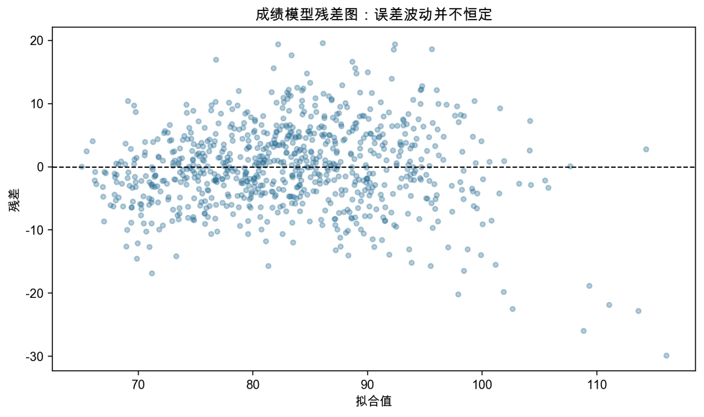

# 第5章 模型设定：变量选择、诊断与稳健推断

> “举一纲而万目张，解一卷而众篇明。”
>
> ——郑玄《诗谱序》

第4章结束时，一个“完整的模型”似乎已经摆在面前：对数、二次项、交互项都讲过了，形式选得对不对、系数怎么读也都交代清楚了。但一个真正的研究者拿到回归结果时，要问的问题远不止这些。这个系数是由数据的哪一部分支撑的？它会不会因为某个我们没放进来的因素而系统性偏了？两个高度相关的控制变量同时放进去，会发生什么？残差图里那条渐渐张开的喇叭口，意味着什么？这些问题的共同点是：它们都不是“怎么做”的问题，而是“哪里可能出错”的问题。前三章教的是怎样估计和解释一个给定模型，第4章教的是怎样把关系写得准确；本章要做的，是把这些工具组织成一套**诊断流程**——在什么情况下该怀疑什么，发现了以后该改什么，以及哪些问题是改了也解决不了的。

本章围绕一条主线展开：先想清楚要回答什么，再理解“控制”做了什么，然后从几个最典型的方向去找问题，最后决定该怎么处理。这条线上有三类问题最值得优先检查——**变量与控制、多重共线、异方差**。它们之所以被单列出来，不是因为别的毛病不重要，而是因为它们出现得最频繁、伤害的对象又各不相同，而且往往被初学者混为一谈。搞清楚这三类问题各自“伤害什么、怎么发现、怎么处理”，你就有了面对一份陌生回归结果时的基本判断力。

## 5.1 模型诊断：诊断什么

### 5.1a 从“设好模型”到“检查模型”：第4章留给我们什么

按照本书的写作顺序，第4章已经讲授了模型形式的设定，所以本章不再把“形式选择”作为一项诊断内容。这个取舍值得先说明清楚，因为它决定了本章的边界。第4章回答的问题包括：什么情况下应当取对数、什么时候用二次项、二次项的极值点必须落在样本支持范围内、虚拟变量应当怎样设置基准组、交互项的系数为什么不能当作某一组的斜率、结果只有 0 和 1 时该用哪种模型。这些都是**设定阶段**的判断，做在前面，也必须做在前面。一个在设定阶段就把函数形式搞错的研究，后来的诊断只能发现问题，却没法替研究者决定正确的形式是什么——诊断工具会告诉你“这里可能有毛病”，但它不会告诉你“应该改成什么”。所以本章的起点是：形式已经按第4章的原则设好了，现在要问的是另外一些问题。一个有用的比喻是体检。体检不负责让你变得更健康，它只做两件事：用有限的几项指标，找出最可能出问题的环节；然后提示你下一步该找哪个科室。模型诊断也是如此，它不生产正确答案，只负责定位问题。

### 5.1b 一个完整设定还要写清什么

模型设定（model specification）是把研究问题转化为可估计模型的过程。在第4章已经处理了函数形式的前提下，一个完整的设定至少还要说清楚四件事：

研究目标。这项研究是要描述条件关系、进行预测，还是识别因果效应？三者的评价标准完全不同：描述性研究关心模型是否如实概括了数据中的条件关系，预测研究关心样本外的损失，因果研究则必须围绕目标参数和识别假设来组织。把因果问题当成描述问题来处理，或者反过来，是很多实证设计走偏的根源。

目标参数或报告量。有了目标，还要指明最终要报告的那个量究竟是什么：是某个系数、某个弹性、某个特定取值处的边际效应、某个概率变化，还是样本外的预测误差？这个选择不是形式问题，而是实质问题。以本章反复使用的 AI 与成绩例子为例，如果研究者想回答的是“AI 使用时间增加到 15 小时会怎样”，那么应当报告的就是 15 小时处的边际效应，而不是模型里那个一次项系数。

变量角色。哪个是核心解释变量，哪些是控制变量，各自为什么进入模型？这些变量在时间上位于核心变量的前面还是后面？**这是四个要素中最需要判断、也最容易出错的一项**，下一节将专门展开。

误差结构。误差是否可能异方差？观测之间是否可能相关？这两个问题的答案决定了后面该用哪一种标准误，本章第 4 节会详细讨论。这四件事彼此关联。第4章已经说明函数形式和结果类型会改变系数含义；本章要进一步强调，即使方程看起来完全相同，研究目标和控制集合不同，所估计的对象也可能不同。因此，建模不能从“把所有可得变量放进软件”开始，而应该先写清楚研究问题和目标量。以 AI 使用与成绩为例，一个较完整的条件均值模型可以写成

$$
score_i=\beta_0+\beta_1ai_i+\beta_2ai_i^2
+\beta_3female_i+\beta_4(ai_i\times female_i)
+\gamma'Z_i+u_i,
$$

这里 $Z_i$ 可以包括年龄、家庭背景和能力等控制变量。第4章已经说明，该模型中 AI 使用的条件边际效应是

$$
\frac{\partial E(score_i\mid X_i)}{\partial ai_i}
=\beta_1+2\beta_2ai_i+\beta_4female_i.
$$

由此可以看清一件事：如果把平方项和交互项删去，剩下那个模型里的 AI 系数，通常不再等于这个完整边际效应，而只是给定样本和控制集合下的一种线性近似。所以，在比较两个模型、或者拿一个模型去和文献对话之前，必须先确认它们是否在回答同一个问题——很多看似“结论矛盾”的研究，其实只是估计对象不同。模型设定依靠理论、制度背景和数据检查共同完成。理论帮助确定变量的时间顺序和可能机制；图形、残差和样本外表现可以提示设定是否遗漏了系统规律；但显著性、$R^2$ 或某一项检验都不能替代研究设计。描述性模型可以参考调整 $R^2$，预测模型应当关注留出样本或交叉验证，因果模型则必须围绕目标效应和识别假设来选择变量。

### 5.1c 诊断什么：三个最典型的问题

设定写好了，模型也跑出来了，接下来该从哪里开始检查？一个诱人的做法是把软件里能找到的检验全都跑一遍，看到哪个报警就处理哪个。这个做法有两个问题：一是检验做得越多，凭偶然撞出“显著”的概率越高；二是每一项检验伤害的对象不同，不加区分地处理，很可能把一种问题“修”成另一种问题。所以本章不打算做一个检验命令大全，而是聚焦**三个最典型的问题**——它们出现得最频繁，覆盖了绝大多数实际困扰，而且三者的性质恰好互补：

**第一个是变量与控制的问题。** 该控制的变量有没有控制？控制的变量是不是控制错了？这是最根本的一类问题，因为它的后果最严重——**它伤害的是系数本身**，一个系统性偏掉的系数，无论标准误多小、$R^2$ 多高，结论都是错的。第 2 节将说明它的机制与判断方法。

**第二个是多重共线的问题。** 控制变量之间高度相关，会让各自的系数变得不稳定、标准误膨胀。它伤害的不是“准不准”而是“稳不稳”——**估计仍然无偏，但精度大幅下降**。第 3 节处理这一类。

**第三个是异方差的问题。** 误差的波动随解释变量变化时，点估计不受影响，但常规标准误会被算错，$t$ 值、$p$ 值和置信区间随之失真。**它伤害的是推断**。第 4 节处理这一类。把三者的伤害对象并排放在一起，本章的结构就清楚了：一个伤害系数，一个伤害精度，一个伤害推断。后面每一节都会按同样的三步推进——**它是什么、怎么发现、发现了怎么办**——并在“怎么办”里说清楚处理的**边界**：哪些问题一次处理就能解决，哪些只能缓解，哪些根本解决不了。最后要说明本章**不**处理哪些问题，以及它们去了哪里。函数形式的诊断已经在第4章讲透；组内相关与聚类标准误需要先理解固定效应之后才能讲清楚，第7章会在讲完固定效应后交代面板数据为什么离不开它，层级选择与实际用法见第14章；异常值与影响点的识别和处理属于数据准备环节，见第13章；而外生性失败、测量误差、反向因果这一类问题，普通诊断工具无法证明也无从检验，本质上是识别问题，属于第6章以及后续章节的内容。本章的边界，本身就是这一节要传达的最重要的信息之一：诊断能做的事是有限的，知道它的边界在哪里，比多掌握几个检验更有价值。

## 5.2 变量与控制的问题

三类问题里，变量与控制排在最前面，因为它造成的是**系数本身的偏误**——这一类错误的代价最大，而且最不容易自救。标准误算错了，换一个稳健标准误还能补救；精度不够，扩大样本还有希望；但一个系统性偏掉的系数，无论样本多大都会稳定地收敛到那个错误的值上。

### 5.2a 是什么：选错变量的代价

第3章已经讲过遗漏变量偏误的两个条件：被遗漏的变量既要影响被解释变量，又要与核心解释变量相关，两者缺一不可。这一节把那个直觉换成一个可以推算的表达式，因为只有写成公式，才能判断偏误的**方向**和**大小从哪来**。考虑一个用于说明原理的线性总体模型：

$$
Y_i=\beta_0+\beta_1X_i+\gamma Z_i+u_i,
\qquad E(u_i\mid X_i,Z_i)=0.
$$

再把 $Z_i$ 对 $X_i$ 作一次简单回归（用 $X$ 去解释 $Z$）：

$$
Z_i=\delta_0+\delta_1X_i+r_i,
\qquad E(r_i)=0,\quad E(X_ir_i)=0.
$$

如果估计时遗漏了 $Z_i$，只估计 $Y_i=\alpha_0+\alpha_1X_i+v_i$，那么在随机抽样、**有限二阶矩**（指变量的方差等矩存在且有限，是这类大样本结论的技术前提）、$\operatorname{Var}(X)>0$ 和其他常规正则条件下，简单回归的斜率满足

$$
\operatorname{plim}\widehat\alpha_1
=\beta_1+\gamma\delta_1,
\qquad
\delta_1=\frac{\operatorname{Cov}(X,Z)}{\operatorname{Var}(X)}.
$$

式中的 $\operatorname{plim}$ 读作**概率极限**，表示样本量无限增大时估计值收敛到的那一个数。

这个式子值得逐项读一遍。$\beta_1$ 是我们真正想估计的目标参数，$\gamma$ 是 $Z$ 对 $Y$ 的条件作用，$\delta_1$ 是 $Z$ 与 $X$ 的线性关系。**遗漏变量偏误就是这两者的乘积**，所以它的方向由两个符号共同决定：两者同号时偏误向上，异号时偏误向下，而只要其中一个为零，偏误就消失了——这正好对应第3章讲的“两个条件缺一不可”。这里有一处措辞必须严格。上述等式说的是概率极限，而不是每个有限样本中都精确成立的“估计值恒等式”。它依赖线性总体模型、外生性和大样本收敛等条件。如果真实的条件均值里还含有平方项、交互项或者其他遗漏变量，那么简单的两项公式就不能把观察到的系数差异全部分解为单一遗漏变量的作用——这正是本章案例中要特别小心的一个陷阱。把样本里两个估计值之差直接称作“纯粹的遗漏变量偏误”，是把一个总体性质误当成了样本恒等式（图5-1 画出了遗漏变量进入核心系数的路径）。

{fig-alt="遗漏变量如何进入核心解释变量的系数"}

图5-1 遗漏变量如何进入核心解释变量的系数

理清了这个表达式，还可以进一步分清**三类设定错误的后果其实各不相同**：遗漏关键混杂因素会使目标系数**不一致**（无论样本多大都偏）；加入真实系数为零的冗余变量通常不会造成同类系统偏误，却会**降低精度**（这一点下一节会看到）；函数形式错误则会**改变所拟合的条件关系和系数的含义**（第4章已经讲过）。三者后果不同，处理方式也不同，**不能被笼统地称为同一种“设定偏误”**。把它们混在一起，就会出现“加变量会变准、删变量也会变准”这样自相矛盾的印象。

### 5.2b FWL 完成了什么、没有完成什么

知道了漏掉变量会偏，接下来的问题很自然：那么“控制”这个动作，在数学上究竟做了什么？对这个问题的回答，既关系到我们怎样理解系数，也关系到后面共线性一节为什么那样展开。第3章的 3.2d 已经给出了 Frisch–Waugh–Lovell（FWL）定理的三步做法：先用控制变量 $Z$ 解释核心解释变量 $X$ 并取残差，得到净 $X$；用同一组 $Z$ 解释被解释变量 $Y$ 并取残差，得到净 $Y$；最后用净 $X$ 解释净 $Y$，其斜率恰好等于原多元回归中 $X$ 的 OLS 系数。那一节的结论是：所谓“控制其他变量”，在代数上就是把 $X$ 与 $Y$ 中能被控制变量解释的部分剔除掉，再用剩下的变异估计系数。本节不再重复那三步，而是接着问一个第3章没有回答的问题：这个代数分解，能不能把识别问题也一并解决掉？先把第3章有意略去的两处技术细节补齐，它们对理解“恒等式”的性质很有用。设模型为

$$
Y_i=\beta_0+\beta_1X_i+\gamma_1Z_{1i}+\gamma_2Z_{2i}+\cdots+\gamma_mZ_{mi}+u_i,
$$

前两步都包含常数项。这样处理后，两组残差的样本均值都为零，因此第三步的截距必然为零——省略常数项只是去掉一个冗余参数；即使保留常数项，斜率也不会改变。所以“不加常数”不是 FWL 成立的额外识别假设，只是代数上的化简。更整体地说，$\widehat\beta_1$ 等于净回归的斜率是一个**有限样本代数恒等式**：只要数据里有这些变量，等式就成立，不需要任何关于世界的假定，也不需要 $\widehat\beta_1$ 事先具有因果解释。正因为它是恒等式，它才容易被误用。FWL 把“其他条件不变”转化成一个可以逐步检查的计算过程，也顺带说明了系数估计的**精度从何而来**：净 $X$ 的变异越大，估计越精确；净 $X$ 的变异很小，估计就会很不稳——这正是本章第 3 节讲多重共线性的代数根源。但请特别注意这句话的分寸：FWL 剔除的是“能被现有控制变量线性解释”的部分，而不是“所有混杂因素”。如果还有一个重要的未观测因素没有放进 $Z$，它既不会被这两步净化掉，也不会因此变得无关紧要。这引出了本节真正要问的问题：FWL 让我们可以追问：

> **哪一部分变异实际支撑着$\widehat\beta_1$的估计？**

这个问题值得反复问，但如果把它当成识别问题来用，就越界了。净 $X$ 仍然可能与未观测因素相关。 FWL 只是把 $X$ 中与 $Z$ 共变的部分拿掉，它既不检验 $E(u_i\mid X_i,Z_i)=0$，也不能因为“已经净化过”就宣称外生性成立。换句话说：

> FWL 描述的是估计量用哪一部分变异算出来的，它不决定这部分变异是否可信。这两件事必须分开看。前者是代数，后者是识别。代数能给的是**更清楚的问题**：它告诉我们这个系数究竟站在哪些观测、哪些变化之上，因而也告诉我们，如果要论证这个系数可信，需要为哪一部分变异辩护。而答案只能从研究设计和制度背景里找，不能从模型里推导出来。本章后面的诊断、变量角色讨论和案例，都是在为“这部分净变异是否可信”收集证据；第6章则会给出判断识别是否成立的完整语言。（图5-2 把净 AI 使用时间与净成绩的关系画了出来。）

{fig-alt="FWL中的净AI使用时间与净成绩"}

图5-2 FWL中的净AI使用时间与净成绩

### 5.2c 怎么解决：一个看起来“应该控制”的变量

现在已经知道选错变量的代价，也知道控制做了什么，剩下的就是操作层面的问题：面对一份变量清单，究竟该把哪些放进模型？先要破除一个流传很广的说法：**控制变量不是“越多越好”。** 变量是否进入模型，取决于目标参数、时间顺序和它在数据生成过程中的角色，而不只取决于它能否预测 $Y$，更不取决于它自己是否显著。表5-1按**变量与研究问题的关系**把常见角色分成七类，每一类进入模型时都要回答一个不同的问题。

表5-1 七类变量角色

| 变量角色 | 时间顺序 | 它与研究问题的关系 | 进入模型时要问什么 |
|---|---|---|---|
| 核心解释变量 | 研究关注的那个原因本身 | 研究者主要关心的 $X$ | 目标是条件关系、预测贡献还是因果效应 |
| 混杂变量 | **事前**（先于 $X$ 与 $Y$） | 同时影响 $X$ 和 $Y$ 的前定因素 | 是否可观测、测量是否可靠、函数形式是否合适 |
| 精度变量 | **事前**（先于 $X$ 与 $Y$） | 处理前、能够预测 $Y$，且在既定设计和必要控制条件下不改变目标效应识别 | 是否能降低残差波动而不改变目标参数 |
| 中介变量 | **位于 $X$ 与 $Y$ 之间** | 位于 $X\rightarrow M\rightarrow Y$ 路径上 | 研究总效应还是控制中介后的直接效应 |
| 代理变量 | 与它所代理的变量同期 | 用可观测指标代表难以直接测量的概念 | 代理关系是否可信，测量误差会带来什么后果 |
| 冗余变量 | 不定 | 对目标问题没有必要且信息重复 | 是否只增加噪声、自由度损失或共线性 |
| 处理后变量 | **事后**（可能受 $X$ 影响） | 可能受到核心解释变量影响 | 控制后是否改变估计对象或引入新的选择问题 |

这张表里最值得反复看的是**时间顺序**这一列。研究 AI 使用对成绩的**总效应**时，事前能力和家庭背景是候选的混杂变量；而“学习时间”如果会被 AI 使用改变，它就落在因果路径的中间，是一个中介变量，机械控制会截断一部分作用路径。若研究问题改成“不通过学习时间发生的直接效应”，控制集合和目标参数又都会变化。变量名称本身不能决定是否应当控制，决定它的是它在因果结构中的位置。这也是为什么 5.1b 把“变量角色”单列为设定要素之一——它比函数形式更依赖判断，也更难从数据里直接看出答案。代理变量的处理还有一层额外的困难。找到“一个相近的指标”并不等于解决问题：如果代理与潜在概念联系过弱、测量误差严重，或者代理本身受到处理的影响，都可能引入新的偏误。研究者的责任是说明代理的理论含义、测量口径和局限，**而不是把它当作未观测变量的无损替身。**

最后是一条使用纪律：统计不显著不是删除控制变量的充分理由。如果变量由研究设计预先确定，或者删除它会改变目标参数，那么即使 $p$ 值很大也可能需要保留。反过来，高度显著也不表示它就应该进入因果模型。至于**碰撞变量**（同时受到核心解释变量和被解释变量影响的变量）、选择机制和处理后控制这类问题，它们同样属于“某个变量该不该控制”的范畴，但判断依据不在统计表现里，而要从因果结构里找——第6章会给出统一的框架。

> **专栏5-1 一个看起来“应该控制”的变量**
>
> 假设你在研究“参加实习是否提高毕业起薪”。这是一个很自然的研究问题，数据也容易获得：问卷里有是否实习、有起薪、还有一堆个人特征。跑一遍回归，加入性别、专业、成绩、家庭背景作为控制变量，结果显著——实习生的起薪平均高出两千元。
>
> 这时有人提出：“还应该控制**是否拿到过留用机会**，因为这显然影响起薪。”这个建议听起来完全合理：留用机会确实与起薪高度相关，不控制它，岂不是遗漏了一个重要变量？于是你把它加进模型。结果发现，实习的系数一下子缩小了大半，甚至不再显著。
>
> 该怎么解读这个变化？初学者常会得出结论：“看来实习本身没那么重要，真正起作用的是留用机会。”**这个结论是错的。**
>
> 问题出在留用机会的位置上。想一想因果链条：参加实习 → 表现好 → 拿到留用机会 → 起薪更高。留用机会并不在“实习”之前，而是实习的结果之一，同时又是起薪的原因——它站在因果路径的**中间**。这类变量叫**中介变量**（mediator）。把中介变量放进模型，估计的就不再是“实习的总效应”，而是“不通过留用机会这条路径发生的那部分效应”。这不是在控制混杂，而是在悄悄更换研究问题。
>
> 更麻烦的是，中介变量还有一种伪装。假设你改为控制“实习期间的表现评分”。这个变量同样在实习之后，同样与起薪相关，但它还受到另一些因素的影响——比如学生本人的能力、导师的偏好。而能力恰恰也影响起薪。此时“表现评分”既是中介，又带着一部分混杂因素的信息。控制它之后，实习系数会朝哪个方向变，已经很难从直觉上判断了。当控制变量同时扮演两个角色时，模型给出的系数就不再对应任何清晰的目标参数。
>
> 还有一类变量比中介更隐蔽，那就是**被结果影响的变量**。设想你控制“毕业时是否已获得多个 offer”。offer 数量显然与起薪相关，但它既受实习影响，也可能受起薪谈判过程影响——它站在结果的近端。控制它之后，剩下的变异已经经过了“结果”的筛选，系数的含义就更加模糊了。
>
> 那么，凭什么判断一个变量该不该控制？一个实用的办法是在纸上画出**时间线**：把核心解释变量、结果变量和每一个候选控制变量按“谁先发生”排一排。排在前面的、且同时影响两者的，是混杂变量，应当控制；排在核心变量之后的，几乎都要警惕。这个办法不需要复杂的工具，却能把上面前两个例子里的大部分错误避掉。
>
> 需要补充的是，中介变量并非永远不能进模型。如果你的研究问题本来就是“实习通过留用机会这个渠道发挥了多大作用”，那么控制中介、比较系数变化，恰恰是**中介分析**的标准做法。关键在于：**你要非常清楚自己在回答哪一个问题。** “总效应”和“直接效应”都是合法的问题，但它们是不同的问题，对应不同的控制集合，也会给出不同的系数。
>
> 这一类错误之所以危险，是因为它在数字上看起来特别“对”：加入一个高度相关的变量，模型拟合变好了，系数也“更精确”了。而实际上，你只是把一个清晰的因果问题，换成了一个说不清楚的问题。

## 5.3 多重共线的问题

讲完了变量与控制，接下来最自然的一个问题就是：如果放进模型的变量之间彼此高度相关，会发生什么？这个问题常常紧跟着**坏控制变量**（放进模型反而把结论带偏的变量）出现——当你判断出某个变量不该控制、准备把它拿掉时，很自然会反过来问：那么留在模型里的这些变量，彼此之间的关系会不会也有问题？多重共线性的原理在第3章 3.3c 已经讲透：完全共线让估计无法进行，而只是高度共线则让系数变得不稳、标准误膨胀；它的代数根源可以通过 FWL 看清——控制变量能解释核心变量的部分越多，留给估计的净变异就越少。本节不重复那套原理，只处理医生手里的事情：怎样在一份实际数据里发现它，发现之后怎么办。

### 5.3a 是什么：它伤害的是精度，不是无偏

先用一句话把要害说清楚：多重共线性伤害的是“稳不稳”，不是“准不准”。这里最容易搞混的一点是：存在多重共线性时，只要其他经典假设成立，回归估计量**仍然无偏**，也仍然满足高斯—马尔可夫定理。它带来的问题是**方差**：系数在不同的样本之间会大幅摇摆，标准误变大，置信区间变宽，显著性检验的功效下降。用一个直觉的说法——两个几乎在说同一件事的变量，模型很难判断究竟是哪一个在起作用，于是把它们的影响分摊得飘忽不定。正因如此，判断共线是否构成问题，不能只看共线的程度，而要看目标系数的标准误是不是宽到了无法支持研究结论的程度。这是本节与第3章那套原理之间最实际的衔接点：第3章告诉你方差从哪来，这里告诉你何时该紧张。

### 5.3b 怎么识别：相关结构与 VIF

识别多重共线性有几条由粗到细的路径，实际工作中通常结合起来用。

**第一步，看两两相关系数表。** 这是最省事的起点：把模型里所有解释变量的相关系数算出来排成一张表，数值特别高的那些组合值得留意。它的好处是直观、一眼就能看出来；局限也很明显——它只能发现两个变量之间的线性关系，发现不了三个以上变量的联合共线。比如“家庭收入 ≈ 父母教育 + 地区均值”这样的组合关系，两两相关系数可能都不算高，合在一起却高度共线。

**第二步，看辅助回归与方差膨胀因子。** 要补上第一步的盲区，可以对每一个解释变量 $X_j$ 做一次**辅助回归**：用其余全部解释变量去解释它，得到一个 $R_j^2$。这个 $R_j^2$ 衡量的是“$X_j$ 有多少能被其他变量解释掉”。把 $R_j^2$ 换算成**方差膨胀因子**

$$VIF_j=\frac{1}{1-R_j^2},$$

就得到了一个可以直接比较的指标：VIF 为 1 表示这个变量**不能被其余解释变量的线性组合解释**（辅助回归的 $R_j^2=0$）——注意这说的是线性可预测性，不是统计独立，更不是“完全无关”；VIF 为 5 表示方差被放大了 5 倍，VIF 为 22 表示放大了 22 倍。**VIF 的关键在于它同时覆盖了两两共线和多变量联合共线两种情形**，这是相关系数表做不到的。

第三步，把指标读回到目标系数的区间上。三步之中，这一步最容易被跳过，却最重要。经验上常说“VIF 大于 10 就要处理”，但这只是一条粗糙的经验规则，**不存在适用于所有研究的硬阈值**。原因不难理解：VIF 只是方差膨胀的倍数，而标准误的绝对大小还取决于误差波动和样本量。一个 $R_j^2=0.9$（即 VIF=10）的变量，如果它自身的变异足够大、样本也足够，系数照样可能估得足够精确；反过来，一个 VIF 只有 4 的变量，在样本很小、噪声很大的数据里也可能给出宽得没法用的区间。所以正确的判断口径是：看目标系数的标准误和置信区间是否已经宽到无法支持你要回答的问题。 VIF 是一个有用的预警指标，它帮你找到可疑的地方；但真正决定要不要处理的，是区间，而不是 VIF 的数字本身。

### 5.3c 怎么解决：不机械删变量，找回有效变异

发现共线之后该怎么办？这是本节的核心，也是最容易出错的一步。第一条，也是最要紧的一条：不能因为共线就自动删变量。假设研究的目标参数是 AI 使用时间的效应，而“家庭收入”和“家庭资产”高度相关。如果两者都是控制混杂所必需的，那么删掉其中一个，等于把一个相关的遗漏因素重新丢回误差项——你用一个偏误，换来了一个更小的标准误。这笔交易几乎总是不划算的，因为标准误大只是让结论变得“不确定”，而偏误是让结论变得“确定地错”。

**第二条，先问因果角色，再问统计冗余。** 判断的顺序应当是：这个变量在因果结构中有没有位置？如果有，就保留它，并如实报告较大的不确定性；只有当两个变量确实在**重复测量同一个概念**时，才可以在理论支持下精简，或者把它们合成为更少但更可靠的指标。第3章 3.3c 已经强调过这条顺序，此处不再展开。

**第三条，注意几种常见做法的边界。** 有些处理手段经常被当作“共线性修复”来用，但它们能做的事其实是有限的：**中心化**可以缓解含交互项或高次项时由尺度产生的非本质相关（因为原始变量与其平方项天然高度相关），但它不会消除一般的多重共线性；**标准化**只改变单位，既不增加也不减少识别信息；**增加样本量**有时能提高精度，却无法解决变量之间结构性的线性依赖——如果两个变量在总体上就是同向变动的，再多的观测也分不开它们；而**降维和正则化**（主成分、岭回归、LASSO）确实能让估计更稳定，但它们会**改变估计对象**，不能当作“保持原有目标参数不变”的机械修复。

**第四条，处理好之后要如实披露。** 如果最终决定保留两个高度相关的控制变量，那么报告时应当写明它们的相关系数和 VIF，说明保留的理由是因果结构上的需要，并提示读者目标系数的精度受到这一取舍的影响。把不确定性摊在明处，比把它藏起来更专业。很多时候，一项研究最诚实的部分，正是它对自身局限的说明。

> **专栏5-2 VIF 超过 10 就该删变量吗**
>
> 在实证研究的口耳相传中，“VIF 大于 10 就要处理”几乎成了一条金科玉律。审稿人看到高 VIF 会提出质疑，学生在论文里也常主动汇报“所有 VIF 均小于 10”，仿佛这是一份体检合格的证明。这条规则从哪来？它站得住脚吗？
>
> 先说它的来源。“VIF 大于 10”并不是统计理论的结论，而是一条**经验建议**，大致可以追溯到 20 世纪 80 年代的几本应用计量教材。它的逻辑是：VIF 为 10 意味着 $R_j^2=0.9$，也就是这个变量有九成的变异能被其他变量解释——听上去确实“太高了”。作为一条提醒研究者去看一看的**预警线**，它是有用的；但把它当作“必须删变量”的**判决线**，就完全是另一回事了。
>
> 问题出在 VIF 只告诉我们**方差被放大了多少倍**，却不告诉我们**放大之后的标准误是否真的太大**。标准误的大小由三个因素共同决定：误差波动、样本量、以及净变异。VIF 只反映第三者。举一个具体的对比。
>
> 情形一：某研究有 10,000 个观测，核心解释变量的 VIF 高达 15。由于样本量足够大、误差波动也不算大，它的标准误是 0.02，系数估计 0.35，置信区间 [0.31, 0.39]——精确得足以支持明确结论。这条区间完全能用，没有任何理由因为 VIF 超过 10 就删掉一个必要的控制变量。
>
> 情形二：另一项研究只有 80 个观测，核心变量的 VIF 只有 4。但样本太小、结果变量的噪声又大，标准误达到 1.8，置信区间 [-3.5, 3.6]——宽到既有大幅正向效应、又有大幅负向效应的可能，什么结论都支持不了。这里的 VIF 甚至没到 5，问题却严重得多。
>
> 把这两种情形放在一起，结论很清楚：决定要不要处理的，是目标系数的置信区间，而不是 VIF 的数字。 VIF 应该被当作一个“去看看那里”的信号，而不是一个“该怎么处理”的指令。
>
> 更危险的是机械删变量的后果。假设你在研究教育对收入的影响，模型里有“受教育年限”和“学历层次”两个变量，它们高度相关，VIF 都超过 10。若按规则删掉其中一个，剩下的那个系数会怎么变？答案取决于两个变量各自在因果结构中的角色：如果学历层次只是受教育年限的一个粗粒度代理，删掉它问题不大；但如果学历层次本身也承载着“文凭信号”这一独立机制，删掉它就意味着把这条机制塞回了误差项。同一个统计动作，在两种情况下的后果完全不同，而 VIF 对此一无所知。
>
> 那么在什么情况下确实应该动手？有几种情形是合理的：两个变量**确实在重复测量同一个概念**，且理论上没有区分它们的必要；两个变量**高度共线到近乎完全共线**，说明其中一个是冗余的（这更接近第3章讲的完全共线问题）；或者研究的目标本来就是**预测而非解释**，此时用降维或正则化换稳定性是划算的——但这时要清楚，你优化的目标已经变了。
>
> 最后给一条可以直接用的判断流程：先问因果角色，再看目标系数的区间，最后才看 VIF。顺序反过来，就容易掉进“为了让表格好看而删掉真正重要的控制项”这个坑里。而那个坑的代价，是整项研究的结论建立在一个有偏的系数上。

## 5.4 异方差的问题

变量的问题、共线的问题，处理的对象都是“模型里放了什么”。这一节换一个入口——**看残差**。当模型的设定和控制集合都基本确定之后，还能不能从数据本身读出更多信息？能，而且信息量很大。

### 5.4a 是什么：它伤害的是标准误，不是系数

先回到最初的那条假设。同方差要求

$$
\operatorname{Var}(u_i\mid X_i)=\sigma^2,
$$

意思是：无论解释变量取什么值，误差项的波动程度都一样。如果条件方差随 $X_i$ 变化，就出现了**异方差**。异方差在现实数据里几乎无处不在。收入分布本身就随教育程度扩张——高学历人群的收入差异远大于低学历人群，于是“用教育解释收入”的模型很难满足同方差；企业规模越大，研发投入的绝对波动通常也越大；使用 AI 时间长的学生，成绩的离散程度可能也更大。这些都不是数据的毛病，而是经济现实的一部分。那么它伤害了什么？答案很明确：它伤害的是标准误，不是系数。在零条件均值等条件仍然成立时，OLS 的点估计**仍然是一致的**——也就是说，样本足够大时，$\widehat\beta$ 依然会收敛到真值附近。异方差破坏的是另一件事：**常规的同方差标准误公式不再成立**，于是 $t$ 值、$p$ 值和置信区间统统失真。通常（但不总是）它会让标准误被**低估**，使研究者把不显著的效应误认为显著。

{fig-alt="异方差改变误差波动的尺度"}

图5-3 异方差改变误差波动的尺度

图5-3 用一把橡皮尺把这个区别画了出来：测量的“刻度”会随着被测量对象的大小而伸缩。点估计说的是“量到了多长”，标准误说的是“这个长度有多可信”；异方差污染的是后者。这个区分是本节全部内容的支点——它解释了为什么处理异方差的办法是“改标准误”，而不是“改模型”。

### 5.4b 怎么识别：残差图、BP 与 White

识别异方差有两条互补的路径：看图，和做检验。

**看图**是最应该养成的习惯，而且往往比检验更有信息量。把残差对拟合值（或对某个解释变量）作散点图，如果残差的散布呈现明显的形状——比如随拟合值上升而逐渐张开成喇叭口，或者呈现两头大中间小的漏斗形——就提示存在异方差。图5-3 的橡皮尺比喻对应的正是这种视觉印象。图的优势在于它不只回答“有没有”，还能回答“以什么形式变化”：是随某个变量线性扩大，还是只在高端急剧放大？这个信息对后续处理很重要。

**做检验**能给出一个量化的判断。常用的两种是：**Breusch–Pagan 检验**（把残差平方对其解释变量作辅助回归，检验它是否与解释变量系统相关）和 **White 检验**（在辅助回归中加入解释变量、它们的平方项和交叉项，因此比只含线性项的形式更灵活——但它**并非允许任意函数**，仍有覆盖不到的结构）。两者的原假设都是“同方差”。White 检验更一般，代价是消耗更多的自由度，在小样本里可能不够有力。这里有一条必须写清楚的边界：检验不显著不能证明严格同方差，显著也不说明系数一定有偏。检验回答的只是“数据有没有显示出足以拒绝同方差的证据”，它既可能漏掉温和的异方差（样本不够大时尤其如此），也可能在样本很大时把无关紧要的轻微异方差判为显著。识别出异方差之后，真正要判断的仍然是：它对我的标准误和结论到底有多大影响？这个问题，检验本身回答不了。

### 5.4c 怎么解决：稳健标准误能做什么、不能做什么

处理异方差的正确工具是**异方差稳健标准误**。它并不改变系数的算法，只改变标准误的算法；要看清它究竟改了什么，最好回到第 3 章讲 FWL 时引入的那个量——**净 $X$**。在一元回归里，斜率的标准误有一个很朴素的形式：用误差方差除以 $X$ 自身的变异。多元情形完全类似，只是把“$X$ 的变异”换成“净 $X$ 的变异”。记 $\widehat r_{ji}$ 为把第 $j$ 个解释变量对其余解释变量回归后得到的残差，那么 $\sum_{i}\widehat r_{ji}^{2}$ 就是净 $X_{j}$ 的变异，常规标准误为

$$\widehat{\operatorname{SE}}(\widehat\beta_j)=\sqrt{\frac{\widehat\sigma^{2}}{\sum_{i=1}^{n}\widehat r_{ji}^{2}}}$$

这里 $\widehat\sigma^{2}$ 是误差方差的估计，$\widehat r_{ji}$ 是把第 $j$ 个解释变量对其余解释变量回归后的残差——也就是第3章 FWL 里的“净变异”。

分子上只有一个常数 $\widehat\sigma^{2}$——这正是同方差假定在公式里的样子：所有观测共用同一个误差方差。分母是净 $X_{j}$ 的变异，变异越大，标准误越小。异方差稳健标准误做的事情，就是把这个常数换掉。它允许每个观测有自己的误差方差，并用该观测自己的残差平方 $\widehat u_i^{2}$ 去估计它：

$$\widehat{\operatorname{SE}}_{HC}(\widehat\beta_j)=\sqrt{\frac{\sum_{i=1}^{n}\widehat u_i^{2}\,\widehat r_{ji}^{2}}{\left(\sum_{i=1}^{n}\widehat r_{ji}^{2}\right)^{2}}}$$

两个式子的分母都取决于净 $X_{j}$ 的变异，这一点值得停下来多看一眼：稳健标准误并没有改变“净变异越大、估计越精确”这条规律，它改变的只是分子对误差方差的处理方式。因此共线性造成的精度损失，换用稳健标准误是补不回来的——第 3 章那句“共线伤害的是精度而不是无偏”，在这里又一次露面。实际软件会使用 HC0、HC1、HC2 或 HC3 等不同的有限样本调整（HC 是 heteroskedasticity-consistent 的缩写，意为“异方差一致”；**HC1** 是最常用的一种，在 HC0 的基础上再做一点自由度调整）：它们在分子上乘一个略有差别的修正系数，样本较大时差别通常不大，样本较小时 HC1 及以后的形式更常用。最关键的一点（也是本章反复出现的那个区分）：稳健标准误改变的是标准误、$t$ 值、$p$ 值和置信区间，它不改变同一个 OLS 回归的点估计。因为点估计本来就依赖异方差之外的假设。

这个事实有两层含义：一方面，它说明为什么遇到异方差不需要换模型——系数本身没问题；另一方面，它也说明**稳健标准误的能力边界非常明确**：它**不能修正函数形式错误、不能修正遗漏变量、不能修正反向因果**。第二层含义值得展开一句。一个学生如果发现稳健标准误没有让自己的结论变显著，可能会怀疑“稳健标准误没用”。但问题往往不在标准误——如果系数本身是偏的，把标准误算得再准也无济于事：你只是得到了一个准确的置信区间，去包围一个错误的值。这句话把本章三类问题的伤害对象再一次区分开了：变量问题伤系数，共线问题伤精度，异方差问题伤推断。诊断与处理必须先对准问题，否则再“稳健”的手段也只是在错误的层面上工作。

在展开之前先交代一个名字：**RESET 检验**是一种常用的函数形式检验，做法是把拟合值的平方项、立方项加回回归，看它们是否联合显著；不显著只说明"没有检测出"函数形式问题，不等于函数形式一定正确——这正是下面这个专栏的要点。

> **专栏5-3 检验不出问题，不等于没有问题**
>
> 一位同学完成了一项实证研究，在附录里自豪地列出一张诊断表：RESET 检验不显著（函数形式没问题），BP 检验不显著（没有异方差），所有 VIF 都小于 5（没有共线性），残差图看起来也没有明显模式。他在结论中写道：“各项检验均通过，因此模型设定正确，系数可以解释为因果效应。”
>
> 这段话的每一句都需要修正，而最后一句错得最严重。问题不在于他做了检验，而在于他误解了检验能证明什么。
>
> 这里有一条统计学中最基本的逻辑，值得反复咀嚼：**不拒绝原假设，不等于证明原假设成立。** 假设检验的逻辑是“证据不足以定罪”，而不是“查明无罪”。BP 检验不显著，正确的含义是“这份数据没有提供足够强的证据说明存在异方差”，而不是“误差方差确实处处相同”。样本越小、异方差越温和，这两种说法之间的差距就越大。
>
> 更根本的一层问题在于，每一项检验都只检查**一种**特定的毛病，而模型可能出问题的地方远不止那几种。BP 检验只能发现“残差平方与解释变量相关”这一种形式的异方差；White 检验宽一些，但仍有它覆盖不到的结构。RESET 检验能发现条件均值函数形式的某些偏差，但对遗漏变量几乎无能为力。至于**遗漏变量偏误、反向因果、样本选择**这类问题，它们从来都不在普通诊断工具的射程之内——不是因为工具不够好，而是因为这些问题涉及不可观测的反事实，而残差里没有任何信息能揭示它。
>
> 那么，正确的诊断态度是什么？可以概括成三条。
>
> 第一条：把诊断当作风险排查，而不是合格证书。检验通过意味着“这一类风险在这份数据里没有明显的迹象”，仅此而已。它能排除一些可能性，但不能确认模型正确。就像体检报告一切正常，说明没有查出明显疾病，不等于可以保证未来健康。
>
> 第二条：区分“检验能回答的问题”和“检验不能回答的问题”。本章反复出现的三分类——变量问题伤系数、共线问题伤精度、异方差问题伤推断——其实就给出了这份清单。前两类中有一部分可以通过诊断发现（共线可以算 VIF，遗漏变量可以靠残差与理论提示），但最关键的那一类，即外生性是否成立，诊断工具完全无能为力。
>
> 第三条：认识到“诊断不出来的问题”往往是最致命的问题。一个偏掉的系数，可能伴随着漂亮的残差图、不显著的检验和很高的 $R^2$——因为偏误来自模型外面，而不是模型里面。这也解释了一个让人沮丧的现象：很多发表时“通过所有检验”的研究，在别人用不同数据重做时结论却变了。**检验通过从来不是结论可靠的充分条件。**
>
> 所以，那位同学的结论应当改成类似这样的一段话：“RESET 与 BP 检验均未提示函数形式与误差结构存在明显问题，VIF 处于可接受范围，因此在这几类设定风险上，模型没有显示出明显缺陷。但本研究使用观察数据，控制变量均为可观测特征，无法排除未观测能力因素造成的遗漏变量偏误，因此所报告的系数应理解为条件相关关系，因果解释需要更强的识别设计支持。”
>
> 这两段话的差别，不是措辞上的保守，而是**对统计推断边界的准确认识**。前者把“没查到问题”当成了“没有问题”，后者则分清了“诊断能排除什么”和“诊断排除不了什么”。这个区别，将决定你在读完第6章之后，还会不会写出第一段那样的结论。

## 5.5 案例实践：一份成绩回归的完整诊断

### 5.5a 先确认数据生成过程与工作模型

本案例继续使用第4章的教学用合成数据。真实生成过程包含 $ai^2$、$ai\times female$、能力、年龄、家庭背景，以及**随 AI 使用而增大的误差方差**——这最后一项意味着数据里确实存在异方差，是本节第 5 步要检出的目标。案例的目的不是估计现实中的 AI 学习效果，而是**让已知的问题在同一份数据里可被检查**。正因为数据生成过程是我们自己设定的，我们才既知道正确答案是什么，也知道毛病藏在哪儿——这样学生做的每一次诊断，都能立刻得到验证。现有诊断脚本为了展示 FWL、VIF 和异方差检验，刻意使用两个**简化的线性工作模型**：

$$
M_L^0:\quad score_i=\alpha_0+\alpha_1ai_i+\theta_1age_i+\theta_2female_i+\theta_3parent\_edu_i+\theta_4family\_income_i+e_i,
$$

$$
M_L^1:\quad score_i=\alpha_0+\alpha_1ai_i+\theta_1age_i+\theta_2female_i+\theta_3parent\_edu_i+\theta_4family\_income_i+\lambda ability_i+e_i,
$$

其中括号外的四个控制变量分别是年龄、性别、父母受教育年限和家庭收入。两个模型都没有纳入 $ai^2$ 与 $ai\times female$。因此，表中的 $\widehat\alpha_1$ 是这个线性工作模型里 AI 系数的**样本 OLS 估计值**，不是第4章完整模型中的结构参数，也不是所有 AI 使用水平上的恒定边际效应。这个限制是案例设计的一部分：先用一个形式简单的工作模型把诊断工具看清楚，再去讨论它为什么会报警。各项诊断使用的工作模型如表5-2所示，比较数字时必须保持模型口径一致：

表5-2 诊断任务与工作模型的对应

| 诊断任务 | 使用的工作模型 | 选择理由 |
|---|---|---|
| FWL核验 | $M_L^1$ | 与含ability的多元回归逐项验证同一AI系数 |
| 控制集合比较 | $M_L^0$与$M_L^1$ | 观察加入ability后样本的净变异估计怎样变化 |
| VIF | $M_L^1$的解释变量集合 | 检查完整控制集合中的净变异 |
| BP与White | $M_L^0$ | 诊断脚本把它作为初始工作模型，所有标准误比较均保持同一回归 |

### 5.5b 比较不同控制集合

先看变量与控制这一类问题。$M_L^0$ 遗漏 ability 时，AI 一次项的样本 OLS 估计为 **1.08287**；加入 ability 后，$M_L^1$ 中的相应估计为 **0.40994**。两者的对照见表5-3。

表5-3 两个工作模型的估计对比

| 工作模型 | AI 系数的样本估计 | 常规标准误 |
|---|---:|---:|
| $M_L^0$：不含ability | 1.08287 | 0.05150 |
| $M_L^1$：含ability | 0.40994 | 0.05755 |

本节数字报告的是 Python 版的输出。Stata 版使用**相同的数据生成过程与参数**，但随机数生成器不同、样本不同，因此数字有差异：$M_L^0$ 的 AI 系数 Stata 为 **1.240**（Python 为 1.083），$M_L^1$ 为 **0.457**（Python 为 0.410）。**本案例模型含二次项与交互项，对样本构成更敏感，两版差距比第2章大**；但"加入 ability 后系数大幅下降"这一核心结论两版一致。

数据生成过程告诉我们：ability 与 AI 使用正相关，且对成绩有正向作用，所以在简化线性模型中加入 ability 后 AI 系数下降，**方向符合 5.2a 给出的偏误公式的预测**（$\gamma$ 与 $\delta_1$ 同号，遗漏时系数向上偏）。但这里必须停一下，因为正是 5.2a 提醒过的那个陷阱：由于两个工作模型还共同遗漏了平方项和交互项，$1.08287-0.40994$ 不能被称为“纯粹的遗漏变量偏误”，0.40994 也不能被称为 AI 使用的结构真值。正确的表述是：改变控制集合后，相应线性工作模型中参数的样本 OLS 估计发生了变化；公开的数据生成过程帮助我们理解其中包含的混杂方向，但**这个差值同时包含了两类设定问题的影响**。把样本差直接套用总体偏误公式，就是把恒等式和概率极限混为一谈。

### 5.5c 用FWL复现“控制”的代数

再看 FWL 是否真的成立。在 $M_L^1$ 中，把年龄、性别、父母受教育年限、家庭收入和 ability 作为控制集合，按第3章 3.2d 的三步做一遍：用这些变量解释 AI 使用时间取得净 AI 残差，用同一组变量解释成绩取得净成绩残差，再用净成绩对净 AI 作不带常数项回归。现有输出中，第三步的斜率估计为 **0.409941**，与 $M_L^1$ 中的 AI 样本 OLS 估计完全相等。三条路径的对照见表5-4。

表5-4 不同解释路径下的系数对比

| 路径 | AI 系数的样本估计 |
|---|---:|
| 多元回归$M_L^1$ | 0.409941 |
| FWL第三步 | 0.409941 |

这个相等关系验证的是 FWL 本身，不是因果效应。它说明 0.409941 由当前控制变量不能解释的那部分 AI 变异所支撑——这正是 5.2b 讲的“净变异”；它**并不说明**这部分变异已经外生，也**不把**一个误设的线性模型变成正确的结构模型。请把这两句话的差别记牢：等式成立是代数事实，变异可信是识别问题。

### 5.5d 检查多重共线性

接下来看共线。`parent_edu`（父母受教育年限）与 `family_income`（家庭收入）共享家庭背景这一共同因子，样本相关系数为 **0.9778**，两者的 VIF 分别约为 **22.809** 和 **22.807**。这个数字远高于“VIF 大于 10”的经验门槛，说明两者的独立作用难以精确分离。但按照 5.3c 的判断顺序，先要问的不是“要不要删”，而是“它们在因果结构中各自是什么角色”。如果研究只需要控制“家庭背景”这一笼统概念，那么预先选择一个理论上更合适、测量更可靠的指标即可；如果研究问题确实需要区分父母教育和家庭收入各自的条件关系，那就应当保留二者，并如实报告由此带来的较大不确定性。请注意这里的标准误：表中两个变量的标准误都在 0.5 上下，明显大于 AI 使用时间。这个“大”反映的是净变异不足，而不是系数有偏——这正是 5.3a 强调的那句“共线伤精度、不伤无偏”的具体体现。也正因为如此，**不能因为 VIF 超过某个阈值就机械删除对目标参数必要的控制变量**：删掉一个，精度是上去了，代价却是把一个相关的因素重新丢回误差项。

### 5.5e 检查异方差并形成诊断清单

最后看残差。数据生成过程让误差标准差随 AI 使用增加，因此这里确实存在异方差。BP 和 White 检验均拒绝同方差假设，$p$ 值分别约为 $4.30\times10^{-14}$ 和 $1.97\times10^{-25}$——两者都给出了非常明确的信号。图5-4 把残差按拟合值画了出来，可以看到波动随拟合值增大而扩散。

{fig-alt="成绩线性工作模型的残差与拟合值"}

图5-4 成绩线性工作模型的残差与拟合值

在同一个 $M_L^0$ 中，比较常规标准误与 HC1 稳健标准误（表5-5）：

表5-5 常规标准误与 HC1 稳健标准误

| 变量 | OLS系数 | 常规标准误 | HC1稳健标准误 |
|---|---:|---:|---:|
| ai | 1.08287 | 0.05150 | 0.07108 |
| age | 0.58062 | 0.15050 | 0.14541 |
| female | 2.73114 | 0.47044 | 0.46316 |
| parent_edu | 0.35356 | 0.50325 | 0.50273 |
| family_income | -0.18315 | 0.58290 | 0.57055 |

这张表把 5.4c 讲的三件事同时演示了出来。**第一，系数一列完全没变**——1.08287 在两种标准误下都是 1.08287，因为稳健标准误改的只是推断，不是点估计。第二，标准误确实变了，而且变化并不整齐：AI 使用时间的标准误从 0.05150 升到 0.07108（放大约 38%），而年龄、性别等变量反而略有下降。这个差异说明**异方差的具体形式是有结构的**，不是简单地“所有标准误都被低估”。**第三，标准误变大不改变结论的性质**：AI 系数仍然显著，但区间明显变宽——这就是“改标准误”这条处理路径的全部内容，也是它的边界。如果研究者按照第4章的形式重新设定模型、并采用稳健标准误重新报告完整边际效应，会得到下面这组数字（每周 AI 使用时间增加 1 小时对预测对数成绩的局部变化，方括号内为 HC1 的 95% 置信区间，见表5-6）：

表5-6 分性别边际效应（HC1 稳健标准误）

| 每周AI使用时间 | 男生边际效应（HC1 95%CI） | 女生边际效应（HC1 95%CI） |
|---:|---:|---:|
| 5小时 | 0.0187 [0.0167, 0.0206] | 0.0254 [0.0239, 0.0269] |
| 10小时 | 0.0081 [0.0065, 0.0098] | 0.0148 [0.0129, 0.0168] |
| 15小时 | −0.0024 [−0.0053, 0.0005] | 0.0043 [0.0008, 0.0078] |
| 20小时 | −0.0129 [−0.0176, −0.0083] | −0.0062 [−0.0115, −0.0009] |

在全样本 AI 分布上分别将性别设为男性和女性时，组别平均边际效应分别为 0.0132 [0.0117, 0.0147] 和 0.0199 [0.0184, 0.0214]。**这些数字与第4章不完全相同**，因为本节在恢复函数形式的同时还更改了控制集合——这恰好印证了 5.1b 的那句话：估计对象变了，数字自然会变，比较之前先确认口径。最后，把全部诊断结论收进表5-7这张清单：

表5-7 三类问题的诊断小结

| 发现 | 主要伤害 | 本案例的处理 | 处理后仍未解决 |
|---|---|---|---|
| ability是已知混杂因素 | 系数含义与因果解释 | 比较控制集合并说明DGP | 现实中未观测能力不能靠普通诊断消除 |
| 家庭背景指标高度共线 | 单个系数精度 | 依据目标选择或保留并披露 | 不会自动增加净变异 |
| BP、White拒绝同方差 | 常规标准误与推断 | 报告稳健标准误 | 不修复函数形式和混杂 |

这张表的结构值得留意：**每一行都有一列“处理后仍未解决”。** 这不是为了谦虚，而是本章最重要的一条认识——每一种诊断工具都只解决它对应的问题，而且往往只能解决一部分。比较控制集合能让我们看清偏误的方向，却没法把未观测的能力变出来；报告稳健标准误能让推断更可信，却不会让系数更接近真值。诊断的价值不在于“修好模型”，而在于让研究者和读者都清楚地知道，这个模型在哪些地方是可靠的，在哪些地方还留着无法消化的不确定性。

> 📁 配套代码包：
> - Stata：`code/stata/ch05/01_ai_score_diagnostics.do`
> - Python：`code/python/ch05/01_ai_score_diagnostics.py`
> - AI Agent任务卡：`code/ai_cards/ch05_ai_task_card.md`
> **不用 AI 也可以完成**：本章案例不要求使用 AI Agent。上述任务可以直接按 Stata 或 Python 脚本完成——读脚本、运行、逐项对照表5-2 至表5-7 列的核验点，并把事先写下的预测与实际输出对照。AI 任务卡是并行的可选路径，不是必做要求。
>
> 提交产出：1张诊断清单、1张FWL核验表、1张标准误比较表、2张诊断图、1张恢复设定后的边际效应表、300字结论、可复现代码与`ai_log.md`。线性工作模型与恢复后非线性模型回答不同估计对象，必须分开报告。

## 本章小结

本章把前四章的工具组织成了一套诊断流程，它的骨架可以用一句话概括：先想清楚要回答什么，再看“控制”做了什么，然后从三个方向找问题，最后决定改什么。诊断的第一个方向是**变量与控制**。这是三类问题中最根本的一类，因为它伤害的是**系数本身**——一个系统性偏掉的系数，标准误再准、样本再大也救不回来。遗漏变量的偏误可以写成概率极限的形式 $\operatorname{plim}\widehat\alpha_1=\beta_1+\gamma\delta_1$，方向由 $Z$ 对 $Y$ 的作用 $\gamma$ 和 $Z$ 与 $X$ 的关系 $\delta_1$ 共同决定；但必须记住这是一个**总体性质**，不能把样本里两个估计值之差直接当成纯粹的偏误。

判断变量该不该控制，靠的是它在因果结构中的位置和时间顺序，而不是它是否显著；把中介变量或处理后变量放进模型，等于悄悄更换了研究问题。而 FWL 定理告诉我们“控制”在代数上做了什么——只用净变异估计系数——但**代数分解不创造外生性**，净变异是否可信是识别问题，不是模型问题。第二个方向是**多重共线**。它伤害的是**精度**：估计仍然无偏，但标准误膨胀、系数不稳。识别它要结合相关系数表（看得见两两关系）和方差膨胀因子（覆盖多变量联合共线），但决定要不要处理的从来不是 VIF 的数字，而是目标系数的置信区间是否宽到无法支持结论。处理时的第一条纪律是不机械删变量——如果两个变量都在因果结构中有位置，删掉一个等于用偏误换精度。第三个方向是**异方差**。它伤害的是**推断**：点估计仍然一致，但常规标准误会失真。

识别它要靠残差图和 BP、White 检验，但检验不显著不等于严格同方差。处理的办法是异方差稳健标准误，它改变标准误、$t$ 值、$p$ 值和置信区间，不改变点估计，也不能修正函数形式、遗漏变量或反向因果。三类问题走完，本章最后要收在两个概念上：**内部有效性**（研究结论在它实际研究的这批单位和情境里是否站得住）与**外部有效性**（这个结论能不能推广到其他单位、时期或情境）。

内部有效性关注的是：在当前样本和制度环境中，这项研究设计能否识别出目标的因果效应。外部有效性关注的是：结论能否推广到其他群体、其他地区、其他时期或其他的政策实施方式。这两者回答的是不同的问题，而且不能用其中一个替代另一个。一项内部有效性很强的实验（比如在某个特定城市的严格随机试验），可能因为样本的特殊性而外部有效性有限；反过来，一个覆盖全国、样本代表性极好的观察性研究，也可能因为识别策略薄弱而根本不具备内部有效性。本章做的所有诊断——变量角色、共线、异方差，加上第4章的函数形式——最终都是为这两个标准服务的。但这里有一个必须认清的落差：这些诊断工具能够处理的主要是外部有效性的一部分以及推断层面的问题，而对于内部有效性最核心的部分，即外生性是否成立，它们几乎无能为力。

普通残差图、RESET、VIF、BP 或 White 检验都不能证明零条件均值成立；大样本、小标准误、高 $R^2$、大量控制变量、稳健标准误，也同样不能把条件相关自动变成因果效应。诊断能排除的是“模型内部的技术性毛病”，排除不了“模型与世界的对应关系是否正确”。所以，当本章的三个方向都检查完毕、四个诊断都通过之后，研究者**仍然不能**写下“因此系数具有因果解释”这样的结论。正确的表述是：在这个模型所设定的条件下，数据没有显示出这几类技术性缺陷；但能否把系数解释为因果效应，取决于识别策略与研究设计——**而这正是下一章要正式开始的内容。** 第6章将引入反事实、目标参数和识别假设，解释随机实验、固定效应、工具变量、双重差分和断点回归为什么必须依赖不同来源的可信比较。诊断能够提示风险，却永远替代不了识别。

### 关键术语

- **坏控制变量**：放进模型反而把结论带偏的变量（如中介变量、碰撞变量、处理后变量）。
- **碰撞变量**：同时受到核心解释变量和被解释变量影响的变量，控制它反而会引入新的偏误。
- **异方差**：误差项的波动程度随解释变量取值而变化。
- **稳健标准误（HC1）**：不假设同方差、按异方差结构修正后的标准误；它改变推断，不改变点估计。
- **RESET 检验**：把拟合值的平方项、立方项加回回归，检验能否检出函数形式问题。
- **BP / White 检验**：常用的异方差检验。
- **内部有效性 / 外部有效性**：结论在研究情境内是否站得住／能否推广到其他情境。

## 思考与练习

**1.** 在总体模型 $Y=\beta_0+\beta_1X+\gamma Z+u$ 中，设 $\gamma>0$。请回答：（1）分别讨论 $\operatorname{Cov}(X,Z)>0$、等于 0 和小于 0 时，遗漏 $Z$ 对简单回归斜率概率极限的影响；（2）如果 $\operatorname{Cov}(X,Z)=0$ 但 $Z$ 对 $Y$ 有很强的作用，遗漏它会造成什么后果？这个后果和“偏误”是同一件事吗？（3）为什么说上述公式是大样本性质，而不能把样本里两个估计值之差直接当作纯粹的遗漏变量偏误？

**2.** 用三步 FWL 说明多元回归怎样实现“控制其他变量”。请回答：（1）为什么第三步不加常数项，这是不是一条额外的识别假设？（2）如果净 $X$ 的变异非常小，系数的精度会怎样，这与第 3 节的共线问题是什么关系？（3）为什么净 $X$ 仍然可能内生？FWL 能证明外生性吗？

**3.** 对 AI 成绩案例中的两个线性工作模型，解释 1.08287 和 0.40994 分别是什么。请回答：（1）为什么两者之差不能被称为纯粹的 ability 遗漏变量偏误；（2）若要与第4章模型口径一致，下一步应报告什么量；（3）如果研究者把 0.40994 写成“AI 使用的真实效应”，错在哪里？

**4.** 判断下列变量在不同研究问题中的角色，并说明理由：（1）研究 AI 使用总效应时的事前能力；（2）可能受到 AI 使用影响的学习时间；（3）用于预测成绩但不影响 AI 使用的既往课程成绩；（4）代表家庭背景的父母教育指标；（5）在“实习是否提高起薪”研究中，是否拿到留用机会。进一步说明：为什么变量角色取决于目标参数和时间顺序，而不是取决于它是否显著？

**5.** 一位同学写道：“RESET 不显著，BP 检验不显著，所有 VIF 都小于 5，所以模型没有遗漏变量，系数可以作因果解释。”请逐句指出错误，并说明每一项诊断实际能回答什么问题、不能回答什么问题。如果你要为这段话写一个正确的版本，你会怎么写？

**6.** 某研究报告了两个高度相关的控制变量（相关系数 0.95，VIF 均约 20），作者为了“消除共线性”删掉了其中一个，结果目标系数的标准误下降了一半。（1）这个处理在什么情况下是合理的，在什么情况下是错误的？（2）如果目标系数的置信区间在删除前后都宽到无法支持结论，你会建议作者怎么做？（3）请从“伤害对象”的角度说明：为什么“用偏误换精度”通常是一笔不划算的交易？

## 拓展阅读

- **FWL 与净变异**。Frisch 与 Waugh（1933）、Lovell（1963）是偏回归思想与 FWL 定理的原始文献。阅读时先回顾第3章 3.2d 给出的三步做法，再回到本章 5.2b，重点追问两件事——“这个系数由哪部分变异支撑”和“净化以后是否仍可能内生”。前一个是代数问题，后一个是识别问题；原始文献只回答了前一个，这正是本书要把两者分开讲的原因。
- **设定与异方差**。Wooldridge（2020）第 8 章讨论异方差，第 9 章讨论模型设定与数据问题。建议把“条件均值设错”和“协方差估计设错”分开阅读——它们常常被混为一谈，却对应完全不同的处理路径。特别留意作者如何处理“稳健标准误改什么、不改什么”这个区分，它是本章 5.4c 的核心。
- **经典诊断文献**。Breusch 与 Pagan（1979）提出异方差检验，White（1980）给出异方差一致协方差估计，Cameron 与 Miller（2015）系统讨论聚类稳健推断（聚类问题见第7章与第14章）。每读一项都可以问同一个问题：**它改变的是点估计还是标准误？它不能解决什么？**
- **共线性的判断与误用**。可以找一两篇讨论“VIF 门槛”的文献或教材章节对照阅读，重点看不同作者对“何时该处理共线性”给出的标准是什么。你会发现分歧往往不在统计学上，而在研究目标上——是解释还是预测，决定了同一个共线程度该不该处理。
- **中介变量与坏控制变量**。本章专栏 5-1 讲的“不该控制的变量”，在因果推断文献中有更系统的讨论。可以带着一个问题去读：当控制变量同时扮演混杂和中介两种角色时，模型给出的系数对应的是什么？这个问题会一直延伸到第6章关于控制变量因果角色的讨论。
- **可复查的工作流**。建议在 Stata 或 Statsmodels 中并排保存工作模型、FWL 残差回归、VIF、BP/White 和稳健标准误输出，报告每一步使用的模型、样本、控制集合与处理理由。**不根据星号选择诊断方法**——这个习惯本身就是本章要训练的判断力的一部分。
