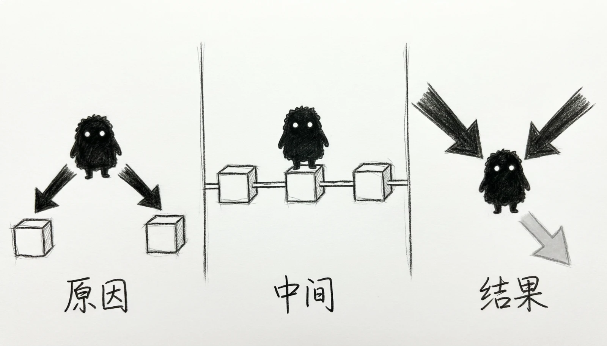

# 第6章 因果识别基础：反事实与内生性

> “见之不若知之，知之不若行之。”
>
> ——《荀子·儒效》

{fig-alt=""}

前五章教的是怎样把一条关系描述得准确、解释得清楚。一个模型经过这样的训练，可以做到系数精确、拟合良好、各项诊断也都通过。但这里有一件让人不安的事情：所有这些工作加起来，仍然不能保证你回答了那个真正想问的问题。举个具体的例子。假设你做了一个回归，发现使用 AI 时间越长的学生成绩越高，系数显著、标准误很小、残差图干净、VIF 也都正常。报告写得很漂亮。可是，如果这份报告要回答的是“**让**学生多用 AI，成绩会不会提高”，那么前面所有的诊断都还不够——它们检查的是模型内部有没有毛病，而这里的问题是：模型之外，是否还有别的东西在同时推动这两件事？这就是本章要处理的问题，它也是本书前半部分与后半部分的分水岭。

前五章关心的是“这份数据里的关系是什么样”，从本章开始，我们关心的是“这个关系能不能承担因果解释，以及凭什么”。这两件事的评价标准完全不同：前者靠模型的拟合与诊断，后者靠**研究设计**。本章的特别之处在于：**它不增加任何新的软件命令。** 你会看到不少新词——反事实、潜在结果、处理效应、识别、混杂、碰撞——但没有一行需要你去跑的新代码。原因很简单：本章要建立的是**一套语言**，而不是一套技术。后面四章（面板数据、工具变量、随机实验与准实验、现代计量工具）各自有不同的估计方法，但它们回答的是同一个问题，也需要说同一种话。这一章就是为它们准备共同语言的。为了让这套语言尽可能容易接受，本章几乎不用数学推导，而是尽量用具体的场景和日常类比来说明。

请把注意力放在**每一个概念试图解决什么问题**上，而不是记公式——当你知道一个问题为什么重要时，它的答案往往就不难理解了。

## 6.1 描述、预测与因果

### 6.1a 同一份数据，三种问法

同一份数据，可以支持三类完全不同的问题。把它们分开，是理解本章全部内容的起点。

**描述问题**关心已经发生的事实。比如：在这份数据里，AI 使用时间与课程成绩的条件关系是怎样的？一周多用一小时的学生，平均成绩相差多少？描述问题的答案就是对观察分布的总结，前五章学的工具主要就是为它服务的。

**预测问题**关心对尚未观察到的对象的判断。比如：能否根据一名学生的已知特征——他过去的使用习惯、家庭背景、平时表现——预测他这学期期末能考多少分？预测问题的评价标准很明确：预测得准不准。它不要求预测因子是结果的原因，只要它携带稳定的信息就够了。

**因果问题**关心“如果改变了某件事，会怎样”。比如：如果让一名学生每周多用两小时 AI，他的成绩会变成多少？请注意这个问题与前两个的本质区别——**它问的是一个从未发生、也可能永远不会发生的世界**。我们不能真的把同一个学生的时间倒回去，让他不用 AI 再考一次。三种问题的差别，用一句话可以概括：描述回答“是什么”，预测回答“会是多少”，因果回答“如果……会怎样”。前两个问题的答案都能从数据里直接读出来，第三个不能——它的答案藏在一个我们永远看不到的地方。这并不意味着三类问题有高下之分。描述性研究有自己的价值，预测在很多场景中比因果更实用（比如信用评分关心的是“会不会违约”，不是“为什么违约”）。**问题出在把它们混为一谈**：用描述性问题的答案去回答因果问题，用预测能力去证明因果关系——这是实际研究中最常见、代价也最大的一类错误。

### 6.1b 预测准确不等于找到可干预的原因

为什么“预测得准”不能推出“找到了原因”？因为一个变量可以是非常好的预测器，却完全不是原因。举个容易理解的例子。假设你发现“登录学习平台的频率”能够相当准确地预测期末成绩——登录越频繁的学生，成绩越高。这个预测关系可能有很高的 $R^2$，统计上毫无疑问。那么，如果学校要求所有学生每天多登录几次，成绩会提高吗？多半不会。因为登录频率真正反映的可能是**学习动机**：有动力的学生既愿意多登录、也愿意多花时间学习。登录频率本身只是动机的一个“影子”。要求所有人多登录，只是让影子变多了，并不会制造出动机——成绩自然也不会变化。这个例子说明了描述、预测与因果之间的关键区别：相关模式可以用于预测，但只有当我们理解了“为什么会有这个模式”，才能谈论干预的效果。影子跟着人走，所以可以用影子判断人在哪里；但你去推影子，人是不会动的。把这件事说得更正式一些，下面两个表述并不等价：
> **条件相关**：在样本和模型中，AI 使用时间更长的学生平均成绩更高。
>
> **因果效应**：对同类学生施加更多的 AI 使用，会提高其成绩。

第一句话是对观察到的数据分布的总结，它在数据范围内一定成立（只要统计上确实如此）；第二句话则包含了一个**干预的含义**——“施加更多使用”。它要求的不是“两者一起变化”，而是“**改变其中一个，另一个会跟着改变**”。这两件事在观察数据里并不是一回事。

**这个区别为什么这么重要？** 因为它直接决定了结论能不能用于决策。如果你是一家公司的分析师，用登录频率预测用户流失率，那么预测准确就够了；但如果你是教育政策的制定者，想知道“要不要给所有学生配备 AI 工具”，那么需要的就不是预测，而是因果——你必须知道干预之后会发生什么，而不只是知道什么样的人会取得好成绩。因果推断的难点，正是从这个“干预之后”开始的。因为干预之后的世界没有发生，我们手里没有它的数据。那么，有没有办法用别的信息把它“补”出来呢？这将是本章后面反复追问的核心问题。

> **专栏6-1 “相关不等于因果”为什么这么难记住**
>
> “相关不等于因果”大概是统计学里被引用最多的一句话，也是最容易被点头同意、转头就忘的一句话。原因不在于它难懂，而在于**人的直觉天生就倾向于把一起出现的东西解释成因果关系**——这是一种对生存有用的思维捷径，但在数据分析里会频繁出错。
>
> 历史上最常被引用的一类误判，来自**混淆了因果方向和共同原因**。19 世纪时，有人统计发现“消防员人数越多的火灾，损失越大”，于是得出结论说应该减少派往现场的消防员。这显然是荒谬的——真正的解释是**火势大小**同时决定了“需要多少消防员”和“会造成多大损失”。火势是那个共同原因，消防员人数和损失都只是它的结果。
>
> 类似的例子几乎随处可见：冰淇淋销量高的月份，溺水人数也多——但吃冰淇淋不会导致溺水，两者共同受到“夏天气温”的推动；医院里病情更重的病人死亡率更高——这不是医院把人治坏了，而是重症病人本来就更可能去世。
>
> 还有一类误判来自于**只看结果、忽略选择过程**。20 世纪中期有研究发现，接受某种治疗的心脏病患者存活率反而更低。乍看像是治疗有害，但深入检查后发现：医生倾向于把这套治疗留给**病情最重**的病人，而轻症病人接受的是常规处理。治疗组的起点本来就差，存活率低并不说明治疗无效。这个例子后来成了因果推断中“选择偏误”的经典教学材料——问题不在于数据错了，而在于分组不是随机的。
>
> 为什么这些错误如此顽固？因为它们在直觉上往往讲得通。“消防员多所以损失大”符合“人多手杂”的直觉；“治疗组死得多所以治疗有害”符合“药物有毒”的直觉。因果解释是人类最喜欢的一种解释，所以它总能在事后被编出来。而“相关不等于因果”这句口号，恰恰需要你在最想编故事的那一刻把它想起来。
>
> 一个实用的自检方法是：看到一个相关关系时，先不要问“这说明了什么”，而是问三个问题——有没有一个共同原因同时推动了这两件事？会不会是后面的影响了前面的？有没有一个选择过程决定了谁能进入这两组？这三个问题正好对应本章后面要讲的混杂、反向因果和选择偏误。能养成先问这三个问题的习惯，比记住十个案例都有用。

## 6.2 控制变量的因果角色与内生性

第5章已经讨论过“该控制谁”，并且给了一个实用办法：把候选变量按时间线排一排，排在核心变量之后的都要警惕。这一节要往前走一步，追问一个更尖锐的问题：控制变量放得对不对，会不会不只是“效果好坏”的差别，而是“结论对错”的差别？把“控制”这件事的理解过程分成三步，会更容易看清我们走到了哪里。**第一步是本科阶段的理解**：“控制其他变量”意味着“其他条件不变”——这个说法是对的，但它只是一个愿望，没有说明怎样实现。**第二步是第3章 FWL 定理给出的理解**：控制变量 $Z$ 做的事情，是把 $X$ 里能被 $Z$ 解释的那部分变异剔除掉，只留下净变异来估计系数，这解释了“怎么做到”。**第三步就是本章要问的问题**：那么，为什么这部分变异应该被剔除？剔除之后，剩下的比较真的更可信吗？前两步回答的是“怎么做”，这一步问的是“做了对不对”。答案并不是“当然对的”——有些时候，控制之后反而更糟。

### 6.2a 三种最基本的因果结构

要判断一个控制变量该不该放，先要看清它在因果结构中扮演什么角色。最常见的角色只有三种，用箭头图表示非常直观——箭头 $A\rightarrow B$ 表示 $A$ 影响 $B$。

**第一种：混杂变量（confounder）**，也就是处理和结果的共同原因。以能力 $Z$ 为例：能力强的人既更愿意使用 AI（$Z\rightarrow D$），也更容易取得好成绩（$Z\rightarrow Y$），这种结构可以写成

$$
Z\longrightarrow D,
\qquad
Z\longrightarrow Y.
$$

混杂是遗漏变量偏误的来源，也是控制变量这个制度最初要解决的问题。在所有相关混杂都被正确处理后，处理组和对照组会变得更可比——这是三种角色中最符合直觉的一种，控制变量之所以存在，最初就是为它服务的。在潜在结果的语言里，这个要求可以写成一个条件独立假设：

$$
\{Y_i(1),Y_i(0)\}\perp D_i\mid X_i,
$$

意思是：给定处理前的协变量 $X_i$ 之后，一个人接受不接受处理，与他两种潜在结果如何无关——换句话说，“谁进了处理组”这件事，在条件相似的人之间已经近似随机了。这是一个很强的假设，不会因为“我控制了很多变量”就自动成立。它在一致性、条件独立和后面要讲的重叠条件同时具备时，才允许我们把平均处理效应写成

$$
ATE=E_X\left\{E(Y_i\mid D_i=1,X_i)-E(Y_i\mid D_i=0,X_i)\right\}.
$$

这个公式的意思用大白话说就是：先找一批条件相似的人，看他们在处理组和对照组里的平均差异，再把这些差异在全体人群中平均。这正是“用条件相似的人替代看不见的反事实”的具体含义。请注意，它要求的是**能够封闭所有非因果路径的调整集合**，而不是一份“把能想到的变量都放进去”的清单。

**第二种：中介变量（mediator）**，也就是处在处理影响结果路径上的变量。比如教育 $D$ 可能通过职业 $M$ 影响收入 $Y$：

$$
D\longrightarrow M\longrightarrow Y.
$$

中介变量的麻烦在于，它与处理高度相关（因为它就是处理的结果之一），也与结果高度相关，所以从统计上看，它简直是一个“理想的控制变量”。但如果你研究的是教育对收入的**总效应**，把职业控制住，就会把“教育 → 职业 → 收入”这条路径截断——剩下的只是一个不同的问题。这时回归系数描述的是“在职业相同的条件下，教育与收入的关系”，而不再是教育改变收入的总效果。控制中介变量不会让估计更“干净”，它只是悄悄换掉了你估计的东西。这一点在所有错误里最容易发生——因为每一个步骤看起来都没有问题：变量相关、模型拟合更好、系数也“更精确”。第三种：碰撞变量（collider）。这是最反直觉的一种。碰撞变量是两个或多个变量的**共同结果**。设 AI 使用 $D$ 和一个未观测的毅力 $U$ 都影响“是否完成课程” $C$，而毅力又影响成绩 $Y$：

$$
D\longrightarrow C\longleftarrow U\longrightarrow Y.
$$

在**不对 $C$ 附加条件**的时候，$D$ 和 $U$ 可以毫无关系——一个人用不用 AI，与他的毅力没有系统性关联。可是，一旦你在回归中控制 $C$，或者只保留 $C=1$（完成课程）的学生来分析，$D$ 与 $U$ 之间就会**被创造出一条关联**，从而打开一条从 $D$ 通向 $Y$ 的非因果路径。为什么会这样？直觉是这样的：在“完成课程”这个条件下，如果一个人**没有**用 AI，那么他一定**很有毅力**（否则完不成）；反过来，一个人用了 AI 却没完成，说明毅力很低。于是“是否完成”这个筛选条件，把 AI 使用和毅力绑在了一起。这就是**“多放一个控制变量反而更差”**的典型情形。碰撞变量的反直觉之处在于：它和结果高度相关、和核心变量也高度相关，从任何“相关性强弱”的标准看都该放进模型。

判断它该不该放的唯一办法，是看它在因果图中的位置，而不是看它的相关系数。三种结构讲完，可以给出一条实用的筛查规则：先看时间顺序，再看它是不是共同原因、是不是路径中间的一环、是不是多个变量的共同结果。时间顺序之所以是第一道筛查，是因为它最容易判断——家庭背景、入学前能力、基线成绩都在处理之前；AI 使用之后的学习时间、课程参与、完课状态都在处理之后。**而处理之后产生的变量，几乎都要警惕**，因为它们可能是中介、碰撞，或者两者的组合。最后还有一条边界条件：即使所有相关混杂都被观察并正确调整，条件比较还需要处理组和对照组在协变量上有**足够重叠**。用 $P(D_i=1\mid X_i=x)$ 表示给定特征 $x$ 时接受处理的概率，重叠要求

$$
0<P(D_i=1\mid X_i=x)<1
$$

对目标总体中相关的 $x$ 成立。说人话就是：对每一类学生，既要有使用了 AI 的，也要有没使用的。如果某一类学生一定使用 AI（比如学校强制要求），那么数据里就没有条件相似的对照可以拿来比较，估计就变成了模型外推，而不是样本内的可信比较。这一点在第 4 节的识别部分还会再回到。图6-1 把混杂、中介、碰撞这三种最基本的因果结构画在了一起。

{fig-alt="三种最基本的因果结构"}

图6-1 三种最基本的因果结构

> **专栏6-2 三个小故事：混杂、中介与碰撞**
>
> 三种因果结构听起来抽象，但它们在日常判断中随处可见。三个故事可以帮助你把它们记住。
>
> 故事一：混杂——“医院里心脏病人更多，所以医院让人得心脏病”。假设你做了一个统计，发现“住在医院附近的人心脏病发病率更高”。这个结论可以推出“医院有害”吗？当然不能。真正的解释是：年龄大的人既更可能住在医院附近（因为要方便就医），也更容易得心脏病。年龄在这里就是一个混杂变量——它同时推动了“住哪里”和“是否得病”。如果把年龄因素考虑进去，两者之间的关系就消失了。这正是控制变量的用武之地：**它是为混杂而生的。**
>
> 故事二：中介——“控制了刷题量之后，补课就没用了”。假设你研究补课对成绩的作用，同时把“刷题量”也放进模型，结果发现补课的系数变得很小。有人据此说“补课本身没用，是刷题在起作用”。这个推理错在哪里？**刷题量恰恰是补课起作用的主要途径之一**——上补习班会做题、会讲方法，学生自然刷得更多。把刷题量控制住，等于问了一个新问题：“在不通过刷题发挥作用的前提下，补课还有多少效果？”这个问题当然也有意义，但它不是“补课有没有用”。控制中介变量时，你得到的不是更准确的总效应，而是另一个量。
>
> 故事三：碰撞——“会打球的人里，矮个子更灵活”。假设篮球运动员的选拔同时看重身高和灵活性。你观察一支职业队，会发现一个奇怪的现象：在**已经入选**的球员里，个子越矮的，灵活性往往越高。是不是矮个子天生更灵活？
>
> 不是。真正的原因是：在这支“已经入选”的队伍里，身高和灵活性是互补的——个子不高的球员想留下来，必须靠灵活性补足；而个子很高的球员即使灵活性一般也能入选。于是“入选”这个条件，人为地在身高和灵活性之间造出了一条负相关。而在普通人群中，这两者本来可能毫无关系。
>
> 这个例子里，“入选”就是那个碰撞变量。三个故事的关键区别可以这样记：混杂是“共同的原因”，控制了它，比较才公平；中介是“中间的一环”，控制了它，问题就变了；碰撞是“共同的结果”，控制了它，反而会凭空造出关系来。
>
> 三条判断口诀可以随身带着走：看它在处理之前还是之后；看它是原因是结果；看它是不是被别的东西共同决定的。这三问不需要任何统计软件，只需要在纸上画几根箭头——但它们能避掉的错误，比任何一项检验都多。

### 6.2b 两类问题：识别问题与估计对象问题

上一节讲了三种因果结构，这一节要把它们放进一个更清楚的分类框架里。初学者常常产生一种印象：只要模型里出了毛病，都是“内生性”，都靠“多控制几个变量”来解决。但仔细看上一节的三种结构，会发现它们造成的麻烦**性质不同**。把它们分成两类，很多困惑会豁然开朗。

**第一类是识别问题（Identification Problem）：** 用来估计系数的**变异本身被污染了**。典型的情形有五种。其一是**遗漏变量**——能力、动机这类同时影响 AI 使用和成绩的因素没有被观察，它们的影响落进了误差项，而误差项又与 AI 使用相关。其二是**反向因果**——不是 AI 使用影响成绩，而是“预期成绩不好”促使学生更多地使用 AI，因果方向反了过来。其三是**处理选择**——愿不愿意使用 AI 这件事本身与学生的潜在结果相关，比如动机强的学生更可能主动使用，同时在不使用时成绩也更好。其四是**样本选择**——能否被观察到、能否进入分析样本，与处理和结果的决定因素相关，比如只保留“完成课程者”。其五是**测量误差**——AI 使用时间靠自报，学生可能遗忘或低报，导致测量到的变量与真实变量不同。这五种的共同点是：它们都让“用于估计 $\beta$ 的那部分变异”和“其他影响 $Y$ 的因素”纠缠在一起。用一句更技术的话说，就是误差条件均值不再为零：$E(u\mid X)\neq 0$。这个式子是 6.2c 要重点讲的。

**第二类是估计对象问题（Estimand Problem）：** 这里的系数估计本身可能是“对”的，但**你估计的不再是你想估计的那个东西**。典型情形有两种。一种是**控制中介变量**——如 6.2a 的故事二，控制了“刷题量”之后，得到的是“不通过刷题发挥的那部分效应”，而不是补课的总效应。另一种是**控制处理后变量**——AI 使用之后才产生的学习时间、课程参与、完课状态，如果被放进模型，同样会改变系数的含义。这一类的共同点与前者完全不同：不是变异被污染，而是研究问题本身发生了变化。处理效应从“总效应”变成了某种“受控效应”或“直接效应”。估计可能很精确，但它回答的是另一个问题。把两类放在一起对照（表6-1），差别就非常清楚了：

表6-1 识别问题与估计对象问题的区别

| | 识别问题 | 估计对象问题 |
|---|---|---|
| 本质 | 用于估计的变异被污染 | 研究问题被换掉 |
| 常见来源 | 遗漏变量、反向因果、选择、测量误差、碰撞 | 控制中介变量、控制处理后变量 |
| 系数会怎样 | 估计有偏，收敛到错误的数 | 估计可能是“对”的，但对应另一个量 |
| 补救思路 | 改识别策略（第7—9章的方法） | 想清楚目标参数，重新决定控制集合 |

**这个划分带来一个非常实用的提醒：** 当你发现加入某个控制变量之后系数变化很大时，先不要急着庆祝“控制得更干净了”，也不要急着怀疑数据，而要先问一句：**这个变量是在处理之前还是之后？** 如果在处理之后，那么变化的很可能不是估计的精度，而是估计的对象。还有一条相关的提醒：主处理变量的识别假设即使成立，也不表示回归中每个控制变量的系数都具有因果含义。控制变量往往是为了构造对主处理更可信的比较而放进去的——它们的作用是“让比较变得公平”，而不是“让每个系数都能被解释成政策效果”。看到一篇论文逐个解释控制变量的系数含义时，往往需要多一分警惕。

### 6.2c 把“内生性”重新理解一下

前面反复出现了“内生性”这个词，但一直没有正面定义它。现在可以给出一个既准确、又好记的说法：

> 内生性指的是：用于估计系数的变异，与误差项纠缠在了一起。第3章的 FWL 告诉我们，回归系数只用 $X$ 中那部分“不能被其他变量解释”的净变异来估计。如果这部分净变异中，还夹杂着一些**同时影响结果 $Y$、但又不属于 $X$ 的因素**，那么估计出来的系数就把这些因素的作用也算进去了——你以为量的是 $X$ 的作用，实际上量到的是 $X$ 加上别的东西。用数学写出来，这个“纠缠”表现为误差项的条件均值不为零：

$$
E(u_i\mid D_i,X_i)\neq 0.
$$

在线性相关的简化情形下，它常常表现为 $\operatorname{Cov}(D,u)\neq 0$ —— **处理和误差项同涨同落**。这就是“内生”这个词的字面含义：变化的来源在模型**内部**，而不是从外部独立进来的。回到 6.2b 的五种识别问题，它们其实都是这一句话的不同表现形式。遗漏变量是“别的东西直接混在误差项里”；反向因果是“结果反过来推了处理一把”；测量误差是“你测的那个 $X$ 和真正的 $X$ 不是一回事”；选择问题是“谁进入样本本身就被结果影响了”。它们看起来五花八门，但都归结为同一个后果：用来识别的变异不干净。讲到这里，必须澄清一个非常重要、也非常容易搞混的问题：**内生性是识别问题，不是精度问题。** 这两者的区别，决定了你能用什么办法去应对它。表6-2这张对照表值得单独记住：

表6-2 常见做法能解决什么、不能解决什么

| 你可能想的办法 | 它实际能做什么 | 对内生性有用吗 |
|---|---|---|
| 增加样本量 | 缩小随机误差 | **没有用**。样本越大，有偏的估计只会越**稳定地**收敛到那个错误的对象上 |
| 关注小标准误和小 $p$ 值 | 说明相对某个估计对象的抽样不确定性小 | **没有用**。它们只说明估计得“稳”，不说明估的是对的东西 |
| 提高 $R^2$ | 改善样本内拟合 | **没有用**。拟合衡量的是对已有数据的描述，不是反事实是否可信 |
| 使用异方差稳健标准误 | 改善特定误差结构下的推断 | **没有用**。它修的是标准误，不修系数本身 |

这张表可以用一句很残酷的话概括：一个更精确的错误答案，仍然是错误答案。

“精确”和“正确”是两个独立的维度。你可以同时做到很精确和很错误——这正是内生性最危险的地方：**它往往不会在数据里留下明显的痕迹。** 残差图可能是干净的，检验可能全部通过，$R^2$ 可能很高，标准误可能很小，而系数依然稳定地偏离真值。因为偏误的来源在模型外面，残差里没有任何信息能揭示它。这也解释了为什么本章不从“怎么修”开始讲。在弄清楚“问题出在哪一层”之前，任何修补动作都可能是无效的，甚至是误导的。第7—9章将介绍三种改变识别策略的工具——面板数据利用个体内部的变化，工具变量利用外部推动的变化，随机实验和准实验设计则直接构造可信的比较。它们之所以有效，不是因为技术更复杂，而是因为它们**针对的正是“变异不干净”这一层问题**。

## 6.3 反事实与因果效应

前面的讨论反复说到“因果效应”，但一直没有给它一个准确的定义。这一节补上这一环。奇怪的是，一旦把定义说清楚，你会发现**因果推断最根本的困难其实在这个定义里就已经藏好了**——正是它决定了后面所有方法为什么必须那样设计。

### 6.3a 用两个潜在结果定义因果效应

先把问题简化：假设我们关心的处理是一个“是或否”的事——学生 $i$ 参加了一套定义明确的 AI 学习方案（$D_i=1$），或者没有参加（$D_i=0$）。现在，想象**同一个学生存在两个平行世界**：在一个世界里他参加了方案，在另一个世界里他没有参加。我们要定义的就是这两个世界的成绩之差。为此，对每位学生定义两个**潜在结果**：

$$
Y_i(1)=\text{学生$i$使用方案时的成绩},
$$

$$
Y_i(0)=\text{学生$i$不使用方案时的成绩}.
$$

“潜在”这个词的意思是：它们都是这位学生**本来可能得到**的结果，只不过在现实中只有其中一个会真的发生。两个潜在结果之差，就是这位学生的**个体因果效应**：

$$
\tau_i=Y_i(1)-Y_i(0).
$$

这个定义简洁、清楚，也完全符合直觉——“用 AI 比不用 AI 多考了多少分”。但接下来的事情就没那么轻松了。在现实中，我们只能观察到其中一个结果。学生实际参加哪一边，就只看到哪一边。写成公式：

$$
Y_i=D_iY_i(1)+(1-D_i)Y_i(0).
$$

这个式子称为**观察方程**：它说的是，我们观察到的 $Y_i$，就是这位学生实际接受的那种处理所对应的潜在结果。当 $D_i=1$ 时，$Y_i(1)$ 被观察到，$Y_i(0)$ 成了**反事实**；当 $D_i=0$ 时则相反。这里就是因果推断全部困难的源头：个体因果效应需要两个潜在结果，而数据只显示其中一个。一个学生要么用了 AI，要么没用，不可能两者同时发生。无论样本多大、方法多先进，这一点都不会改变。用一个具体的表格来体会。表6-3列出四位学生完整的潜在成绩——但请记住，**真实数据里只会显示最后两列**：

表6-3 潜在结果与可观察结果

| 学生 | $Y(1)$ | $Y(0)$ | 实际状态 | 可观察结果 |
|---|---:|---:|---:|---:|
| 甲 | 88 | 82 | **$D=1$** | 88 |
| 乙 | 80 | 76 | **$D=1$** | 80 |
| 丙 | 74 | 72 | **$D=0$** | 72 |
| 丁 | 69 | 70 | **$D=0$** | 70 |

看第一行：甲参加了方案，我们看到他考了 88，这对应 $Y(1)$；但他**如果没有参加**会考多少，我们无从得知。第三行反过来：丙没有参加，我们看到他考了 72；但他**如果参加了**会考多少，同样无从得知。真实数据里只会看到“实际状态”和“可观察结果”这两列。那个能让我们直接算出因果效应的表格，从来就不存在。因此，因果推断要做的事情，不是“把真实效应算出来”——它在个体层面根本算不出来——而是**用某种办法把这缺失的一半补上**。补得可信不可信，就是所有识别策略要回答的问题。在处理和总体被定义清楚之前，$Y_i(1)$ 本身就不唯一。这句话听起来抽象，但它的实际含义很具体。“使用 AI”到底指什么？

用 AI 写作业、用 AI 答疑、用 AI 编程、还是用 AI 做个性化练习——这是四种不同的处理，对应四个不同的 $Y_i(1)$。“每周使用一小时”和“每周使用十小时”也不是同一个处理。处理含义模糊时，潜在结果就没有确定所指，后面的一切讨论都失去意义。同样，**目标总体也必须明确**。某一所学校、某一门课程已选课学生的平均效应，不自动等于所有大学生的平均效应。“在样本中识别了什么”与“结果能推广到哪里”，是两个必须分开回答的问题。

还有一条常用但常被忽略的前提，叫做**稳定处理值假设**（SUTVA），在入门层面可以理解为两件事：第一，同一个处理状态不能存在“隐藏版本”——如果“参加方案”在一部分学生那里意味着每天被要求打卡、在另一部分学生那里只是给了个账号，那么这两种情形其实不是同一种处理；第二，一个人的结果不受其他人的处理状态影响——但同一个班里，学生之间分享提示词、互相竞争、彼此辅导，都会破坏这一点。同伴干扰看起来是细节，却能让整个反事实框架失效，因为它意味着“这位学生的 $Y_i(0)$”取决于别人的处理状态，不再是一个确定的数。最后要说明，**处理也可以是连续的**。

若用 $d$ 表示每周 AI 使用小时数，那么 $Y_i(d)$ 就表示把这位学生的使用水平设为 $d$ 时的潜在成绩，因果效应变成“从 $d_1$ 变到 $d_2$ 会带来多少变化”。二元处理只是一个更简单的特例——把问题简化为二元，不是因为它更现实，而是因为它把核心困难表达得最清楚。图6-2 用“同一个人，两条路”画出这个意思。

{fig-alt="同一个人，两条路"}

图6-2 同一个人，两条路

> **专栏6-3 因果推断的根本困难**
>
> 统计学家鲁宾（Donald Rubin）有一句被反复引用的话，把上一节讲的事情压缩成了一句话：因果推断的根本问题是，我们永远无法同时观察同一个体的两种潜在结果。这句话有个正式的名字——**因果推断的根本问题**（Fundamental Problem of Causal Inference）。
>
> 它之所以被称为“根本”，是因为它不是一个技术难题，而是**一个逻辑上的、无法绕过的困难**。样本可以提高精度，算法可以更灵活，数据可以更丰富——但这些都无法让你同时看到同一个学生在“用了 AI”和“没用 AI”两个世界里的成绩。**你不可能让同一个人重来一次。** 这一点和物理上的测不准有几分相似：不是测量工具不够好，而是测量这件事本身有内在的限制。
>
> 面对这个根本困难，统计学给出了一个非常聪明的退路：既然补不上一个人的另一半，那就去找别人的一半来替代。你想知道甲“如果没用 AI”会考多少，那就找一位与甲在各方面都相似、但确实没用 AI 的学生乙，用乙的成绩来估计。这个“替代”的思路，就是全部因果推断方法的共同内核。
>
> 而所有的分歧，都集中在这个替代可信不可信上。乙真的能替代甲吗？如果乙和甲在动机、能力、家庭背景上都不一样，那么拿乙的成绩来估计甲的另一种可能，就只是在用一个不同的人冒充。所以因果推断的核心工作，始终是回答同一个问题：谁有资格替代谁？
>
> 这也解释了为什么“随机实验”在因果推断中地位特殊。随机分配并不能解决根本困难——实验里的处理组学生依然看不到自己的另一半——但它做到了另一件关键的事：让被分到不同组的个体在平均意义上没有系统性差别。换句话说，随机化保证了替代者有资格替代。至于为什么随机化能做到这一点，以及当随机化不可行时该怎么办，正是本章余下部分和第7—9章的内容。
>
> 有意思的是，这个“根本困难”的表述虽然出自 20 世纪的统计学，但它和日常智慧早有呼应。古希腊的赫拉克利特说“人不能两次踏进同一条河流”，讲的是世界在流动、无法重复；而因果推断要面对的，是比这更苛刻的一点：**你连一次都没法踏入两条河。** 理解了这一层，你也就理解了为什么这一章不教任何“新命令”——**它面对的不是操作问题，而是认识问题。**

### 6.3b 从个体效应到目标参数

既然个体因果效应 $\tau_i$ 从来算不出来，实证研究只好退一步：不去问“这个人会怎样”，而问“这一群人平均会怎样”。这不是妥协，而是因果研究实际能够回答的问题。最常见的目标参数是**平均处理效应**（average treatment effect，ATE）：

$$
ATE=E\left[Y_i(1)-Y_i(0)\right].
$$

它回答的问题很明确：在目标总体中，如果把每个人的处理状态都从“不处理”改成“处理”，结果平均会改变多少？比如，如果把这套 AI 学习方案提供给全部学生，成绩平均会提高几分。但很多时候我们关心的不是“所有人”，而是“已经接受处理的那批人”。这就定义了**处理组平均处理效应**（average treatment effect on the treated，ATT）：

$$
ATT=E\left[Y_i(1)-Y_i(0)\mid D_i=1\right].
$$

它回答的是：对那些实际参加了方案的学生，这套方案让他们平均提高了多少？在评估一项已经实施的政策时，ATT 往往比 ATE 更贴近实际问题——我们想知道的是“这项政策对参与者做了什么”，而不是“如果所有人都参加会怎样”。

ATE 与 ATT 并不天然相等。只有在效应完全同质（每个人受益都一样），或者“会不会接受处理”与“个体效应”无关等特定情形下，两者才必然相同。而在现实中，这两条通常都不成立：一套学习方案很可能对基础较弱的学生帮助更大，而这些学生也更可能主动报名。所以在问“效应是多少”之前，必须先说清“对谁的什么效应”——这句话是本节最需要带走的一条纪律。既然目标参数是平均效应，能不能直接比较“处理组的平均成绩”和“对照组的平均成绩”呢？把这两个平均之差展开，会得到

$$
\begin{aligned}
E(Y_i\mid D_i=1)-E(Y_i\mid D_i=0)
={}&ATT\\
&+\left\{E[Y_i(0)\mid D_i=1]-E[Y_i(0)\mid D_i=0]\right\}.
\end{aligned}
$$

这个式子看起来复杂，读法却很简单：观察到的组间差异 = 真正的处理效应（ATT） + 选择差异。等式右边第二项那个大括号，比较的是“处理组**假设没有接受处理**时的平均结果”与“对照组实际的平均结果”。如果这两者不一样，说明这两组人本来就不是一路人。举一个具体的例子：参加 AI 学习方案的学生，即使**不参加**，成绩可能也本来就好一些（因为他们更有动力）。那么这一项为正，观察到的组间差异就会**高估**方案的真实效果。这一项就是 6.2c 讲的“内生性”在这里的表现形式。它不依赖于样本大小，也不体现在任何一个残差图里。它只取决于一件事：**分组是不是随机的**。

如果处理组和对照组是随机分的，那么“处理组假设不处理时的平均结果”与“对照组的平均结果”在期望上就相同，第二项为零，观察到的差异就正好等于 ATT。还可以从另一个角度看这个分解。既然第二项里出现的量是 $E[Y_i(0)\mid D_i=1]$——**处理组在不处理状态下的平均结果**，也就是“他们如果没有参加会怎样”——那么因果推断的任务就可以重新表述为：为目标总体中未被观察到的潜在结果，寻找一个可信的替代。这个表述比“控制变量”更接近问题的本质。它告诉我们：重要的不是模型里放了多少变量，而是那个被用来充当反事实的群体，究竟有没有资格充当。

至于当目标参数是 ATE 而不是 ATT 时，需要补的量会变成未处理者在处理状态下的反事实 $E[Y_i(1)\mid D_i=0]$ ——**注意缺失的那一半会随着问题变化**，这也是“先定目标参数”如此重要的又一个理由。

### 6.3c 谁可以替代看不见的反事实

既然因果推断的核心是“用某个可信的比较来替代看不见的反事实”，那么关键问题就变成：**什么样的比较才算可信？**

回到 AI 与成绩的例子。一个使用了 AI 的学生，他“如果不用 AI”的成绩从哪里来？一个最自然的想法是：**用另一个没用 AI 的学生来替代。** 但紧接着问题就来了——**他们真的可比吗？** 如果那位不用的学生本来学习动机就更弱、基础也更差，那么用他的成绩来估计“前者不用 AI 会考多少”，显然是不公平的替代。这个思路可以推广开。所有因果推断方法做的事情，都是寻找一种可信的比较，区别只在于从哪里找。

可能充当替代的无非是这么几类：**条件相似的另一批人**——找在各方面特征上都差不多的处理者和非处理者进行比较，这是“OLS＋控制变量”的思路；**同一个人的另一个时期**——用一个人处理前后的变化来替代，这是面板数据与固定效应的思路；**未受政策影响的对照组**——用一组没有经历政策的人群，在政策前后的相对变化来推断，这是双重差分的思路；**阈值另一侧的个体**——利用制度上一个硬性的分界线，比较刚好在两侧、其他条件几乎相同的人，这是断点回归的思路；以及**由外部因素推动的那部分变化**——只用那些由某个外部因素“推着”发生的处理变化来估计效应，这是工具变量的思路。这些方法看上去差别很大，但**它们都在回答同一个问题**：谁有资格替代谁，以及凭什么。

这句话可以当作整章的题眼：Causal inference is finding a credible comparison（因果推断就是寻找一个可信的比较）。在这些思路里，随机实验之所以被视为基准，恰恰因为它把“谁有资格”这件事交给了掷硬币。当处理组和对照组是随机分配时，两组在所有方面——可观察的和不可观察的——都只在随机波动范围内不同。随机化并没有消除根本困难，但它一次性解决了“替代合不合格”的问题：被随机分到对照组的那批人，就是处理组反事实的合法替身。可是现实中，**随机实验往往是不可行的**。我们无法随机指定哪些学生使用 AI，无法随机决定哪个城市设立试验区，也无法随机安排谁去接受一项培训。

原因可能是伦理上的（不能让一部分学生失去教育机会）、成本上的、或者根本做不到的（性别、地区这类“处理”无法随机分配）。**绝大多数经济研究面对的都是观察数据**，而观察数据里的分组从来不是掷硬币的结果。所以，从第7章开始，我们要学的就是：当随机化不可行时，有哪些别的办法可以构造出一个可信的比较？每一种办法都对应一种特定的“寻找反事实”的方式，也都对应一组特定的假设——这些假设不能被检验完全证明，只能靠制度背景、经济逻辑和研究设计来论证。这就是为什么识别（identification）始终是实证研究里最难、也最需要判断力的部分。在这里还要再强调一次 6.3a 讲过的那条要求：替代必须发生在被明确界定的处理与总体之内。

如果处理定义含混（“使用 AI”到底指什么），或者总体含混（“大学生”到底指哪些人），那么再精巧的比较也无济于事——因为你不知道自己在把哪一批人的哪一种经验，搬到哪一群人身上。

## 6.4 识别：从可信比较到方法地图

前面三节建立了因果语言的基本词汇：反事实、潜在结果、目标参数、内生性、可信比较。这一节把它们组装起来，回答一个方法论上的问题：做一项因果研究，到底要经过哪几道关口？

### 6.4a 识别的层次与三个追问

先给出一个定义。一个参数被“识别”（identified），是指在明确的模型与假设下，观察数据的分布可以唯一确定这个参数。对因果问题而言，识别的核心是：所观察到的人、时间、制度或阈值附近的比较，在什么假设下能够替代看不见的反事实？这个定义听起来抽象，但它的实际含义很清楚：识别问的不是“算得准不准”，而是“能不能算”。如果一项设计在概念上就没有办法把目标效应从数据里单独分离出来，那么无论用多先进的估计方法，结果都没有因果含义。把一项经验研究拆开看，其实有四个层次，顺序不能颠倒。**第一个层次是 Estimand（目标量）：我到底想估计什么？** 是 ATE 还是 ATT？是总效应还是直接效应？是某一个具体取值处的边际效应？这一步不涉及任何数据，纯粹是想清楚问题。

**第二个层次是 Identification（识别）：数据为什么能够告诉我这件事？** 我用了什么可信的比较？这个比较依赖什么假设？这是本章的核心，也是第7—9章各方法真正不同的地方。 **第三个层次是 Estimator（估计量）：怎么算？** 用 OLS、固定效应、工具变量还是别的？这一步才是“技术”层面的选择——值得注意的是，**研究设计（research design）位于识别与估计之间**，它决定了用哪种比较，也就决定了后面能选哪些估计量。**第四个层次是 Inference（推断）：这个估计有多不确定？** 标准误、置信区间、显著性检验都属于这一层。这四个层次的关键在于：**它们不能互相替代**。

一个研究可能在第四层做得很精细（用了稳健标准误、做了聚类调整），却在第二层完全站不住（比较根本不可信）；也可能估计量非常先进，但目标量从一开始就没想清楚。用一句简洁的话说：

> Estimand ≠ Identification ≠ Estimation ≠ Inference。

**顺序不能倒置**这句话，对初学者尤其重要。很多人在做实证研究时的习惯是：先看手上有什么数据，再决定跑什么模型，最后给结果编一个解释。这个顺序正好是反的。正确的顺序是从问题出发，确定目标量，再判断手上有什么可信的比较，最后才选择估计方法。判断一项识别策略是否站得住，可以先问三个问题。**第一，利用了什么外生变化？** 处理为什么会在其他相关条件近似不变时发生变化？换句话说，是什么力量让一部分人接受了处理、另一部分人没有，而这个力量与结果本身无关？ **第二，谁替代了看不见的反事实？** 是条件相似的另一批人、同一个体的另一个时期、未受政策影响的对照组，还是阈值另一侧的个体？**第三，因果解释依赖什么关键假设？** 这些假设是否与制度背景、时间顺序和数据生成过程相容？识别假设通常不能被一次统计检验完全证明。

这一点必须说透：数据可以暴露某些明显的违背（比如平行趋势检验发现处理前趋势差异显著），制度事实、安慰剂检验和稳健性分析也能增加或减少可信度，但**识别最终仍然是数据、研究设计与经济逻辑的联合判断**。不存在一个检验，跑完就能宣布“识别成立”。这也是本章与前三章最大的不同：前三章的结论可以靠数据算出来，这一章的结论**必须靠论证**。

### 6.4b 八种方法各自利用什么比较

后续几章会分别展开不同的方法。它们形式各异，但都要回答同样两个核心问题：什么比较能够代替反事实？哪一部分处理变化在识别效应，为什么它值得信任？表6-4先把整张地图铺开。阅读时不必记住每一行，重点看“可信比较与识别变异”这一列——**它才是每种方法的灵魂**。

表6-4 八种方法各自利用什么比较

| 方法 | 可信比较与识别变异 | 主要假设与边界 |
|---|---|---|
| Randomized Experiment（随机实验） | 依据已知随机分配机制比较被分到不同指派状态的个体 | 随机化应实际执行；仍要处理不依从、失访、干扰和处理版本；指派效应与实际接受处理的效应不必相同 |
| OLS＋Controls（OLS＋控制变量） | 比较观察协变量条件相似的个体 | 给定恰当处理前变量后没有剩余混杂，且存在重叠；结果依赖对混杂和函数形式的充分处理 |
| Fixed Effects（固定效应） | 用同一个体随时间的内部变化作比较 | 可吸收时不变的未观测差异；时变混杂、反向因果和测量误差仍可存在 |
| Instrumental Variables（工具变量） | 只使用由工具变量外部推动的处理变化 | 工具要能推动处理，不与结果的未观测决定因素纠缠，并且对结果的影响通过处理发生；异质效应下可能是局部效应 |
| Difference-in-Differences（双重差分） | 比较处理组和对照组在政策前后的相对变化 | 无处理时的反事实趋势应平行，且需处理预期、同期冲击和构成变化等问题 |
| Regression Discontinuity（断点回归） | 比较制度阈值附近、但处理状态不同的个体 | 若无处理，潜在结果在阈值处应连续，且没有其他决定结果的制度规则同时在该阈值跳变；精确操纵运行变量会威胁局部可比性；通常识别阈值附近的局部效应 |
| Machine Learning（机器学习） | 用灵活函数近似改善预测或条件关系拟合 | ML本身不提供因果识别，不会创造外生变异，也不会修复遗漏混杂或重叠不足 |
| Double/Debiased ML（双重机器学习） | 在已给定的识别条件下，用正交得分、交叉拟合和ML估计高维干扰函数，如 $E(Y\mid X)$ 与 $E(D\mid X)$ | 它是估计与推断程序，不是独立识别策略；仍依赖原研究设计的外生性、重叠和其他假设 |

这张表可以用一句话来记：每一种方法的区别，都在于它从哪里找那个“可信的比较”。随机实验的关键词是“**已知分配机制**”，固定效应的关键词是“**个体内变化**”（within variation），工具变量的关键词是“**外部推动的变化**”（externally induced variation），双重差分的关键词是“**相对变化**”，断点回归的关键词是“**阈值附近的局部比较**”。最后两行最容易被误解，需要特别说明。机器学习能够更灵活地拟合条件关系，在预测任务中常常表现优异；双重机器学习（DML）能在已经给定的识别条件下，更高效地估计目标参数并做推断。但是——**两者都不创造外生变异。** 如果一项研究使用的比较本身不可信，那么换上再先进的机器学习方法，也只是把一个不可信的比较算得更精确。这与 6.2c 那句“更精确的错误答案仍然是错误答案”是同一个道理。

### 6.4c 现代实证研究的工作流

把前面所有内容串起来，一项现代实证研究的逻辑顺序可以写成一条链：

> **研究问题 → 目标参数 → 识别威胁 → 研究设计 → 估计量 → 推断**

这条链值得逐段对照 6.4a 的四个层次来读：前两步对应 **Estimand**，中间两步对应 **Identification**，第五步是 **Estimator**，最后一步是 **Inference**。从左往右走，每一步都在回答上一个环节提出的问题；而从右往左走——先挑方法再找故事——则几乎必然走偏。不同研究设计的价值，不在于它们把回归方程变得更复杂，而在于它们为反事实提供了不同的可信替代。一个研究用固定效应、一个用工具变量、一个用断点回归，它们的方程形式可能相差很大，但如果放在这张地图上看，它们做的事情是一样的：各自找一种自己信得过的比较，然后用它去估计目标参数。判断一项研究好不好，关键也不在于它用了哪种方法，而在于它选的那种比较，在这份数据、这个制度背景下，究竟站不站得住。这也解释了为什么本章要花这么大篇幅讲概念，而不是直接教方法。如果不知道“要替代的是什么”，学再多的估计命令也只是在盲操作。下一节用一个完整的案例把这些概念串一遍，之后第7章到第9章才分别展开各种具体设计。

## 6.5 概念案例：AI 使用是否提高成绩

现在用本章的工作流重新审视贯穿前文的 AI 与成绩案例。为了避免把注意力过早放在估计命令上，这里只做概念设计——不运行任何代码，只把该想清楚的事情想清楚。这个练习的目标不是得出一个结论，而是完整地走一遍“从问题到设计”的推理链。

### 6.5a 写出研究问题和目标参数

第 6.1 节说过，一个含混的问题没法回答。所以第一步是把问题写得足够具体。一个可操作的版本是这样的：

> 对本课程的已选课学生，**实际参加**一套规定用途和最低使用频率的 AI 学习方案，相对于不参加该方案，对期末成绩的平均因果效应是多少？这个表述看起来啰嗦，但它一次性交代了四件必须交代的事——**处理**（参加一套规定用途和最低使用频率的方案）、**对照**（不参加该方案）、**结果**（期末成绩）、**目标总体**（本课程的已选课学生）。任何一项缺失，问题都会重新变得含混。接下来确定目标参数。按上面的表述，我们想要的是这个总体中“实际参加方案者”的平均效应，也就是 $ATT$。如果只想知道已经自主参加方案的学生从中获益多少，目标就是 ATT；如果想问“把这套方案推给所有人会怎样”，目标就变成 ATE。两者对应不同的反事实，也对应不同的补缺方式，所以必须在动手之前定下来。这里还有一个容易混淆的地方值得点明：“实际参加”与“被指派参加”是两回事。假设学校随机选择一部分学生，通知他们可以参加这套方案——这是“**指派**”；但被通知的人里，有的参加了，有的没参加——这才是“**实际参加**”。如果要研究“被指派获得方案”的效应，就应当把指派状态记为另一个变量 $Z$，**不能与实际参加 $D$ 混用**。这两个变量的因果效应是不同的量，混用会导致研究问题与识别策略错位。

### 6.5b 列出识别威胁

目标定好了，接下来要做的是“找麻烦”——尽可能把所有可能让结论失效的因素摆到桌面上。这个步骤在因果研究中被称为**识别威胁清单**，它的价值不在于全部解决，而在于**说清楚哪些解决了、哪些没解决**。对上面这个问题，至少要列出六项。第一项是**能力和学习动机**——动机强的学生更可能认真使用方案，也更容易考得好，这是典型的**混杂**，也是首要威胁。第二项是**学习时间和学习方法**——用了方案之后，学生可能重新分配学习时间、改变做题方式，这些变量属于**中介**，如果目标是总效应就不应当机械地控制掉。第三项是**只分析完课学生**带来的问题——如果完课与否既受 AI 使用影响、又受毅力等因素影响，那么只保留完课者就相当于在一个被筛选过的子样本上做比较，可能产生**碰撞或样本选择偏误**。

第四项是**成绩预期影响 AI 使用**所体现的**反向因果**——预感到自己成绩不理想的学生，可能更主动地使用 AI。第五项是**自报 AI 使用时间**含有的**测量误差**——学生可能遗忘、四舍五入，甚至因为知道在被研究而多报。第六项是**同伴之间共享提示词或学习策略**造成的**干扰**——一位学生的结果受其他学生处理状态的影响，这直接违反了前面讲过的稳定处理值假设。这份清单本身就很有教育意义。请注意其中只有第一项是“经典的遗漏变量”，其余五项分别属于中介、碰撞、反向因果、测量误差和干扰。初学者往往以为“因果问题就是遗漏变量问题”，而现实中的威胁远比这丰富——列清单的过程，就是在强迫自己把所有可能性都想一遍。

### 6.5c 比较可能的研究设计

最后一步，是把每一个候选设计与它所能提供的那种“可信比较”对应起来，并说清它各自依赖什么假设。下面按 6.4b 地图的顺序，把与这个问题真正相关的设计逐个过一遍。表6-4 中的断点回归需要一个人为设定的阈值，机器学习与双重机器学习只是估计与预测手段、不提供识别变异，这三者在本问题里都用不上，因此不展开。

**OLS＋Controls** 可以比较基线成绩、家庭背景和其他处理前特征相似的学生。它提供的可信比较是“条件相似的另一批人”。但这个设计仍然需要假设：给定这些可观察变量之后，**没有未观察动机等剩余混杂**，并且处理组与对照组在这些特征上有**足够重叠**。用大白话说——它赌的是“把所有重要的东西都观察到了”，而这恰恰是最难保证的一件事。

**随机分配**提供了最强的一种比较。研究设计者可以决定哪些学生被指派获得方案，把这个指派记为 $Z$。在执行良好时，随机化使 $Z$ 在平均意义上与事前潜在结果无关，因而可以直接识别**指派效应**（intention-to-treat effect，ITT）。注意这里的关键：随机化保证的是“指派”的随机性，不是“实际参加”的随机性。只有在所有人都严格依从指派（$D=Z$）时，指派效应才与实际参加方案的效应重合。一旦存在不依从，想要用 $Z$ 识别 $D$ 的因果效应，就需要额外的工具变量假设，并且可能只能识别**局部平均处理效应**——也就是“会被指派影响的那部分人”身上的效应。此外，失访、处理溢出和处理版本不一致，也都需要单独处理。**随机实验是基准，但并不是免检。**

**固定效应**需要同一位学生的多期数据——他不同时期的 AI 使用与成绩。它提供的比较是“同一个人自己和自己比”。这个办法能够吸收不随时间变化的能力差异（因为能力在所有时期都一样，组内变化时就被消掉了），但**不会自动消除随时间变化的学习动机或成绩冲击**：如果某位学生在某学期突然变得特别努力，而他同时也开始用 AI，那么这部分变化依然混在一起。

**工具变量**需要一个能够推动 AI 使用、**却不通过其他途径影响成绩**的外部因素。平台推荐、账号开通规则都只是候选来源。这里有一条必须牢记的纪律：不能因为某个因素“来自外部”，就直接宣称它是有效工具。仍然需要论证它为什么与未观测的决定因素无关，以及它的影响是否全部通过 AI 使用发生——这两条都不容易证明，而且无法靠统计检验完成。

**双重差分**需要有一批学生或班级在某一时点开始实施方案，同时存在未同期实施方案的对照组。它利用的是两组的**相对变化**：如果两组在政策之前的趋势本来平行，那么政策之后的两组差异，就提供了一个可以替代反事实的比较。它的关键假设是“如果没有处理，两组趋势仍会平行”——而这个假设本身无法被直接检验，只能通过政策前的趋势、制度背景和安慰剂检验来间接支持。五个设计讲完，可以把它们并排放在一起看：它们提供的比较各不相同——相似的人、随机指派、自己和自己、外部推动的变化、相对变化——但没有一个是“免费”的。每一种都要付出一组假设作为代价，而这些假设能否成立，取决于研究问题的具体情境，而不取决于方法本身有多流行。没有哪个方法因为名称更先进就天然更好。选择方法应当从“数据中实际存在着什么样的可信比较”出发，而不是先决定要用某个流行估计量，再到处寻找能支撑它的故事。这正是本章希望留下的最终印象：因果研究的功夫，花在设计与论证上，而不是花在命令上。

> 📁 配套材料：
> - AI Agent任务卡：`code/ai_cards/ch06_ai_task_card.md`
> - 本章**不设估计脚本**：按表0-2，第6章无论走哪条路线都按正文给出的概念性任务作答。
>
> **不用 AI 也可以完成**：上述 a／b／c 三步完全可以在纸面或讨论课上独立完成——写出研究问题与目标参数、列出识别威胁清单、把候选设计与它提供的比较逐一对应。走 AI 路线时，Agent 可以协助检索同类研究、检查清单是否遗漏常见威胁，或就某个设计的假设提出反驳；但**判断比较来源是否可信、假设是否成立，必须由读者自己作出**。无论走哪条路线，本章都不提交代码或结果表格。

## 本章小结

本章从相关关系走向因果识别，建立了后续各章共用的因果语言。回顾一下，这条线索上共有几个关键的转折。起点是一个区分：**描述、预测与因果是三类不同的问题。** 描述关心已经发生的事实，预测关心尚未观察到的对象，因果关心干预会带来什么改变。前两者都可以建立在稳定的相关模式上，**预测准确不等于找到了可干预的原因**——一个变量可以是出色的预测器，却完全不是原因。接着是因果的定义。**因果效应是同一个体在不同处理状态下两个潜在结果之差**，而数据只提供其中一个。这个“只能看到一半”的事实，就是**因果推断的根本困难**。它不是一个技术上的不足，而是一个逻辑上的限制：同一个学生不可能既用了 AI、又没用 AI。

正因为如此，实证研究把目标从个体效应转向**群体平均效应**，最常见的是 ATE 与 ATT；两者面向不同的人群，**研究必须先确定“对谁的什么效应”**，否则后面一切都会错位。第三个转折是“控制”的重新理解。控制变量放得对不对，不仅是效果好坏的问题，还可能是结论对错的问题。**混杂变量**是处理和结果的共同原因，控制它能让比较更公平；**中介变量**处于作用路径的中间，控制它会悄悄换掉研究问题；**碰撞变量**是多个变量的共同结果，控制它反而会凭空造出一条偏误路径。这三者的区别，决定了“控制”究竟是在帮忙还是在帮倒忙。由此可以把常见的麻烦分成两类。

**识别问题**（遗漏变量、反向因果、处理选择、样本选择、测量误差）让用于估计的变异被污染，后果是系数有偏；**估计对象问题**（控制中介变量、控制处理后变量）则换掉了研究问题，后果是系数对应的不再是原来那个量。**内生性就是前者的总称**——用它来估计系数的变异，与误差项纠缠在了一起。最后是识别。识别、估计与推断是三个层次：能不能算、怎么算、算得有多不确定，顺序不能倒置。后续各章的方法——固定效应、工具变量、双重差分、断点回归——虽然形式不同，但都在回答同一个问题：什么比较能够代替反事实，凭什么值得信任。随机实验之所以是基准，是因为它用随机分配一次性解决了“替代合不合格”的问题；而当随机化不可行时，研究者就必须为手中的比较提供制度、时间和逻辑上的理由。

有一点必须在本章结束时再次强调：上面所有这些诊断和论证，都不存在一个“跑一遍就通过”的检验。大样本、小标准误、高 $R^2$ 和稳健标准误，都不能把一个条件相关变成因果效应；而识别假设能否成立，最终靠的是数据、研究设计与经济逻辑的联合判断。这正是本章与前五章最大的不同：前五章的结论可以从数据里算出来，本章的结论必须靠论证得来。下一章进入面板数据与固定效应。我们将具体学习如何利用同一个体随时间的变化，剔除时不变的未观测差异，并讨论这种“个体内变化”什么时候值得信任。

### 关键术语

- **反事实**：同一个人在没有接受处理时会是什么结果；它永远不能被同时观察到。
- **潜在结果**：$Y_i(1)$ 与 $Y_i(0)$，分别表示接受与未接受处理时的结果。
- **目标参数（Estimand）**：研究真正想估计的那个量，如总体平均效应（ATE）或处理组平均效应（ATT）。
- **识别假设**：要让数据里的比较等价于目标参数所要求的比较，所必须额外成立的条件。
- **混杂变量**：同时影响处理与结果的变量，不控制它会制造虚假相关。
- **中介变量**：位于"处理→中介→结果"路径上的变量，控制它会截断部分作用路径。
- **碰撞变量**：同时受到处理与结果（或其他变量）影响的共同结果，控制它反而会引入偏误。
- **内生性**：处理变量与误差项相关，是上面几类问题的总称。
- **四个层次**：Estimand（目标量）→ Identification（识别）→ Estimator（估计量）→ Inference（推断），四层不能互相替代。

## 思考与练习

**1.** 判断下列问题分别属于描述、预测还是因果，并说明理由：（1）哪些学生更可能在期末不及格？（2）将 AI 写作反馈提供给所有学生，会不会提高平均成绩？（3）样本中 AI 使用时间的分布如何？（4）如果某校把班级规模缩小 5 人，学生成绩会怎样变化？在回答之后，请进一步说明：如果一个变量能非常准确地预测某个结果，为什么我们仍然不能据此断言它是原因？请举一个你自己想到的例子。

**2.** 为“职业培训对一年后工资的影响”定义 $D_i$、$Y_i(1)$、$Y_i(0)$、ATE 和 ATT。请回答：（1）在个体层面，哪一个潜在结果不可观察？为什么？（2）如果研究发现“接受培训者的工资低于未接受者”，能否据此得出培训有负面效果？请利用本章的分解式说明理由。（3）如果实际想了解的是“把培训项目推给所有失业者会怎样”，目标参数应当改成什么？这时缺失的反事实量是哪一个？

**3.** 判断下列情形中，所讨论的变量分别属于混杂、中介还是碰撞，并说明你的判断依据：（1）研究教育对收入的总效应时，父母的教育程度；（2）研究 AI 使用对成绩的影响时，使用 AI 之后形成的学习时间；（3）研究“是否完成课程”与“成绩”的关系时，只保留完课学生所带来的筛选；（4）研究实习对起薪的影响时，是否拿到留用机会。（5）请进一步说明：为什么第（2）项虽然与成绩高度相关，却通常不应控制？

**4.** 某研究使用一百万条观测，回归系数的 $p$ 值小于 0.001，并使用异方差稳健标准误，$R^2$ 达到 0.75。请回答：（1）这些信息分别能说明什么？（2）它们能说明系数具有因果含义吗？为什么？（3）如果这项研究的核心解释变量存在遗漏变量问题，上述哪一项会发生变化？（4）请用一句话概括“识别问题”与“精度问题”的区别。

**5.** 从固定效应、工具变量、DID 和 RDD 中任选两种，分别回答三个问题：它利用了什么变化？谁替代了看不见的反事实？什么假设使这个替代可信？在回答之后，请说明这两种方法各自识别的是总体效应还是某种局部效应，并解释“随机实验被视为基准”这一说法的确切含义——它解决了什么，又没有解决什么。

**6.** 针对“AI 学习方案是否提高成绩”这一问题，写出一页概念性研究设计。要求包含：（1）研究问题与目标总体；（2）目标参数（ATE 还是 ATT，并说明理由）；（3）处理与对照的精确定义；（4）至少三个识别威胁，并说明每个威胁属于本章的哪一类问题；（5）一种首选设计及它依赖的两个关键假设；（6）明确写出“如果这两个假设不成立，结论会退化成什么”。

## 拓展阅读

- **潜在结果框架的原始文献**。Neyman（Splawa-Neyman，1923/1990）最早提出随机化实验中的潜在结果思想，Rubin（1974）把它发展成一套通用的因果推断框架，因此这一框架也常被称为 Neyman–Rubin 模型。两篇文献都不长，但符号体系与今天略有不同；初次阅读建议只关注它们如何定义因果效应，以及为什么必须借助“未观察到的另一半”。
- **《基本无害的计量经济学》的前几章**。Angrist 与 Pischke（2009）对因果推断的直觉讲得非常清楚，尤其是关于“为什么随机化是基准”“工具变量识别的到底是谁”这两个部分。这本书的风格与本章接近——重设计、轻推导，很适合作为 6.3 与 6.4 两节的延伸阅读。
- **一篇系统讨论坏控制变量的文章**。控制变量什么时候会把结果带偏，在因果推断文献里有专门的讨论。带着本章 6.2a 的三种因果结构去读，会给“混杂该控、中介不该控、碰撞控了更糟”这三条判断逐一找到更具体的例子。
- **因果图的语言**。Pearl（2009）《Causality》与 Hernán 与 Robins（2020）《Causal Inference: What If》都系统讲解了有向无环图（DAG）。本章只用了几根箭头，而 DAG 提供了一套可以严格判断“该控制什么”的规则——若你打算做实证研究，这套语言值得专门花时间学习。
- **关于“根本困难”的讨论**。Holland（1986）的文章《Statistics and Causal Inference》是“因果推断的根本问题”这一表述的经典来源，文中对统计模型能否承担因果解释的讨论至今仍有启发。读的时候不妨想一想：如果根本困难无法绕过，那么多年来研究者找到的这些“退路”，各自付出了什么代价？
