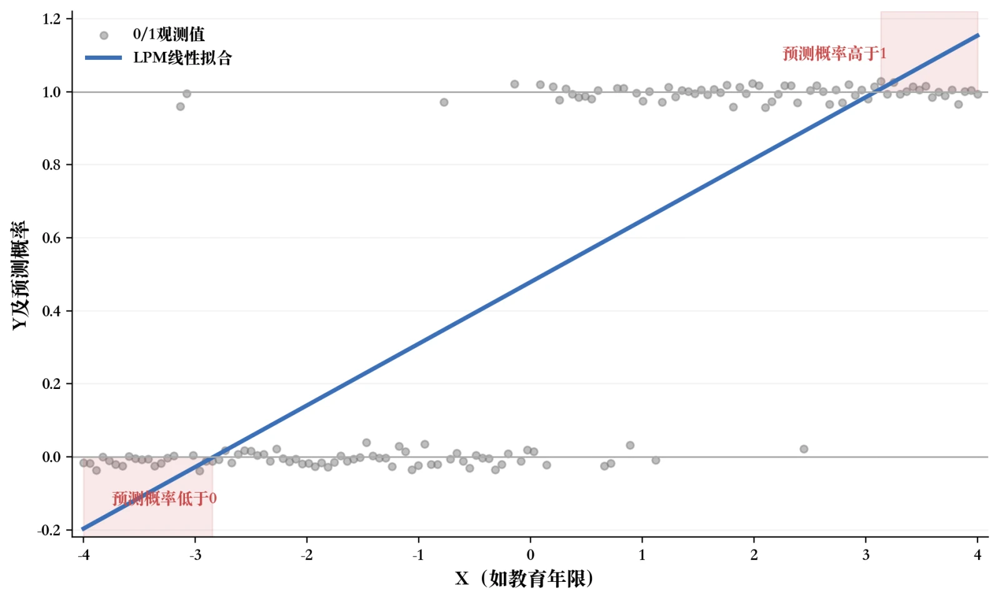
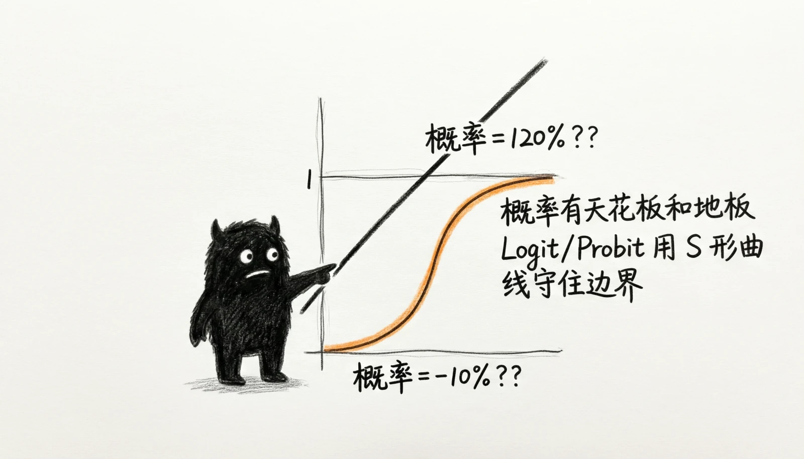
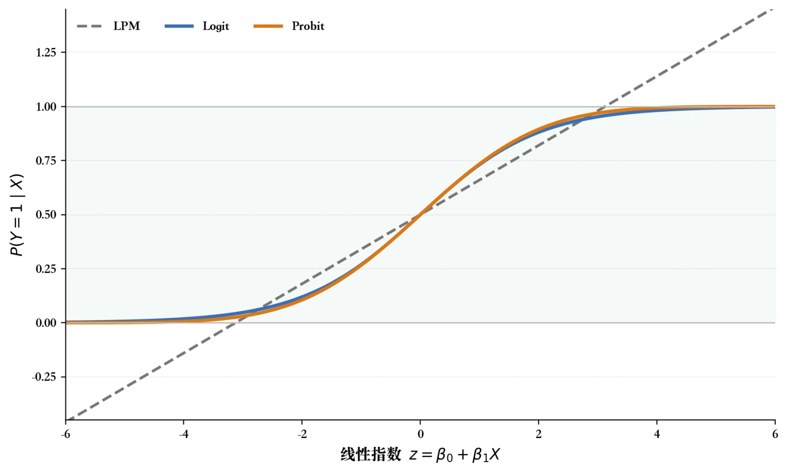
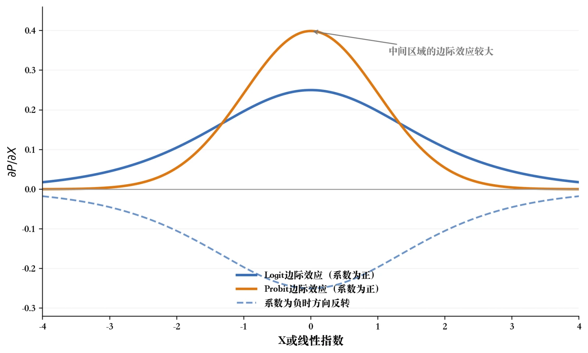
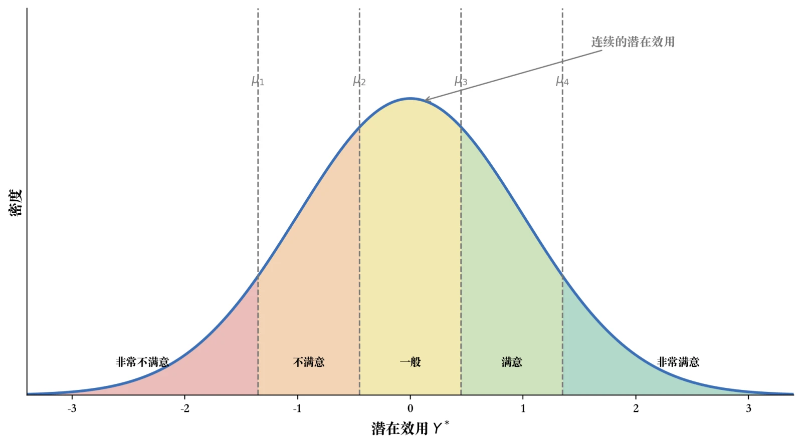
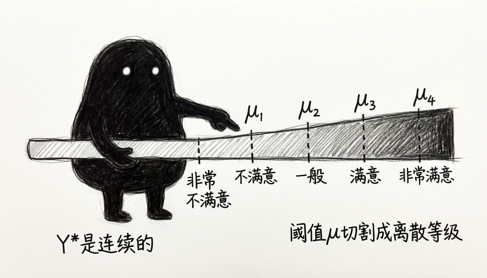

# 第6章 离散选择模型

> “鱼，我所欲也；熊掌，亦我所欲也。二者不可得兼，舍鱼而取熊掌者也。”
> 
> ——《孟子·告子上》

假设你刚刚毕业，手上有两份工作邀请。一份在北京，月薪15000，但房租贵、通勤长、竞争激烈。一份在老家省城，月薪8000，但离家近、生活成本低、节奏舒服。你会怎么选？

这个问题没有标准答案，但你的选择背后藏着一套经济学逻辑：你在比较两种方案给你带来的效用——工资、生活质量、职业前景、离家距离……最终你选了那个总效用更高的。经济学家没法钻进你的脑子里测量效用，但他们能看到你的最终选择——你选了北京，说明在你心里，北京的总效用超过了老家。这个选择动作就是经济学家能观测到的数据：一个离散的结果——去北京（Y=1）或者回老家（Y=0）。

这正是本章要建立的一套新思维。前面五章，我们分析的被解释变量都是连续的——收入可以是3000、5632.5、12876，取许多不同的实数值。但现实中大量的经济决策结果不是连续的：买还是不买？就业还是失业？上市还是不上市？考研还是直接工作？这些问题的被解释变量只有几种互斥的类别——我们管它叫离散选择。面对二元被解释变量，直接使用OLS会遇到两个重要局限：第一，预测值可能跑到0和1之外——你没法解释“一个人的就业概率是150%”；第二，误差项通常存在异方差，常规同方差标准误不再可靠。使用异方差稳健标准误可以修正第二个问题下的统计推断，却不能解决预测越界，也不能修正线性条件均值的函数形式设定。

本章从线性概率模型（LPM）出发，再介绍用S形链接函数把预测概率限制在0与1之间的Logit和Probit模型，随后讨论具有自然次序的有序被解释变量。案例部分将练习模型估计、预测概率和边际效应解释，并区分条件关联与因果效应。

从这一章开始，你的计量工具箱不再只适用于“量”的问题，也能处理“选”的问题。这是一个重要的能力拓展——说到底，经济学研究的正是人们在稀缺条件下的选择。

## 6.1 线性概率模型

在前面的章节中，我们一直把被解释变量看作可以连续取值的变量，比如收入、消费、利润等。然而，在大量的现实经济研究中，我们关心的被解释变量往往不是连续的数字，而是一种是与否的选择。比如：一个劳动者是就业还是失业？一个家庭购买还是不购买住房？一名学生是否决定继续读研？一家企业是否选择上市？这些问题的被解释变量只有两个可能的取值，我们通常用1表示是，用0表示否，这就是所谓的二元被解释变量（Binary Dependent Variable）。

二元被解释变量虽然形式上简单，但其经济含义却十分丰富。它代表的是个体在两种状态之间的离散选择，背后往往隐藏着复杂的决策过程。比如劳动者是否就业，可能取决于工资水平、家庭负担、教育程度、健康状况等；家庭是否购房，可能与收入、利率、房价预期、家庭人口等密切相关。我们希望通过建立一个回归模型，揭示这些因素如何影响个体做出“1或0”的选择。

那么，是否可以直接套用我们熟悉的线性回归模型来处理二元被解释变量呢？这就引出了线性概率模型（Linear Probability Model, LPM）。它的核心思想很简单：把二元被解释变量Y作为普通连续变量来对待，直接用OLS方法进行回归。

### 6.1a 线性概率模型的形式与解释

考虑一个简单的二元选择问题，假设我们想研究一个人是否就业（Y=1表示就业，Y=0表示未就业）受到教育年限（X）等因素的影响。线性概率模型可以写为：

$$Y_{i} = \beta_{0} + \beta_{1}X_{1i} + \beta_{2}X_{2i} + \ldots + \beta_{k}X_{ki} + u_{i}$$

由于被解释变量只能取0或1，从概率角度来看，给定解释变量X的取值，Y的条件期望就等于Y=1发生的条件概率：

$$E(Y_{i}|X_{i}) = P(Y_{i} = 1|X_{i}) = \beta_{0} + \beta_{1}X_{1i} + \ldots + \beta_{k}X_{ki}$$

也就是说，LPM的拟合值可以解释为在给定X的条件下，Y=1发生的概率。这正是它名字线性概率模型的由来——概率以线性函数的形式表达。

参数$\beta_{1}$的解释也十分直观：在模型给定其他变量的条件下，$X_{1}$相差一个单位对应的$Y=1$条件概率平均相差$\beta_{1}$，也就是$100\beta_{1}$个百分点。例如，若教育年限的LPM系数为0.04，可以表述为教育年限每相差一年，就业条件概率平均相差4个百分点。只有在相应识别假设成立时，才能进一步解释为多受一年教育造成的概率变化。

图6-1 线性概率模型的越界问题

### 6.1b 线性概率模型的局限

LPM的优点是直观、易实现、易解释。它把离散选择问题一刀切地放进了线性回归框架，使我们能够无缝衔接已经掌握的OLS方法。然而，正如世上没有十全十美的工具一样，LPM也存在三个突出的问题。

第一，预测概率可能落在[0,1]区间之外。 由于线性函数随解释变量的变化是无界的，当X特别大或特别小时，模型预测出的概率可能小于0或大于1。例如教育年限达到20年时，预测就业概率可能高达1.2，这显然不符合概率的基本定义——概率最多是1，怎么会有120%的概率呢？这个问题是LPM最被诟病的缺陷。

第二，误差方差通常随条件概率变化。 当Y只能取0或1时，给定X之后，误差项u的方差为：

$$Var(u_{i}|X_{i}) = P(Y_{i} = 1|X_{i}) \cdot \lbrack 1 - P(Y_{i} = 1|X_{i}) \rbrack$$

当条件概率随$X$变化时，这个方差通常也随$X$变化；只有条件概率恒定等特殊情形才可能同方差。如果条件概率确实可以写成$X$的线性函数，OLS系数仍可无偏估计这一线性条件均值；但常规同方差标准误通常不可靠，因此应使用异方差稳健标准误。如果线性条件均值本身设定错误，稳健标准误也不能消除模型设定偏误。

第三，边际效应不变的假设并不合理。 LPM假定X对概率的边际影响是一个常数（即斜率$\beta_{1}$），但在现实中，再受一年教育对一个高中生的就业概率影响，可能远大于对一个博士生的影响——后者就业概率本就接近1，再增加一年教育的影响几乎可以忽略。也就是说，概率的边际变化通常应当是非线性的，而LPM无法捕捉这种边际递减特征。

正是由于上述局限，研究者常使用非线性二元选择模型——Logit模型和Probit模型。它们通过非线性链接函数把预测概率限制在[0,1]之内，同时允许边际效应随X变化。不过，这些优点来自更强的函数形式与分布假设，并不意味着模型自动揭示了选择背后的真实机制。

> 专栏6-1 选择背后的概率视角——LPM的直觉与陷阱
> 
> 设想这样一个场景：一家银行希望评估客户是否会按时还款。客户的还款行为只有“按时还”和“逾期”两种结果——这是一个典型的二元选择问题。银行的风控团队最初尝试用最熟悉的线性回归方法：把是否按时还款（1或0）作为被解释变量，把客户的收入、年龄、信用评分等作为解释变量，跑了一个OLS回归。结果看似不错，每个变量都有显著的系数，似乎可以直接用来评估客户。
> 
> 然而，问题很快浮现。某位高收入、高信用评分的客户，模型预测他按时还款的概率竟然是1.18——超过了100%！而对一位收入较低的客户，预测值是-0.07，也就是负概率。这显然是荒谬的。概率本应是0到1之间的数值，怎么会出现这种超界的情形？
> 
> 这正是线性概率模型最核心的陷阱。它把概率当作一条无限延伸的直线来拟合，没有意识到概率本身有“上下天花板”。当解释变量取值非常极端时，预测自然会冲破[0,1]的边界。
> 
> 更隐蔽的陷阱在于异方差。我们知道，OLS的标准假设之一是“误差项方差恒定”，但二元被解释变量天生就违反这一点：当预测概率接近0或1时，误差项可能性集中在一个较小范围；而当预测概率接近0.5时，误差波动最大。这就好比一面湖水，中间风大时浪高，岸边风小时浪低——线性回归却假设整面湖水浪高一致。在线性条件均值设定正确时，系数仍可无偏，但常规标准误不再可靠；若线性设定不正确，系数只能理解为线性投影。
> 
> 那么，是不是LPM就毫无用武之地了？也不全是。在实际研究中，LPM由于其简洁直观，仍被广泛用于初步探索性分析、稳健性检验、以及大样本下的快速估计。许多顶级期刊的实证论文中，研究者在用Logit或Probit之外，常常还会汇报LPM的结果作为对照。它就像一把老式的木尺，虽然不精密，但用来粗略测量长度仍然方便。
> 
> 这个故事提醒我们：每一种统计方法都有自己的适用边界。当我们面对概率这种特殊的被解释变量时，不能简单地照搬线性回归的思路，而需要寻找更合理的工具——这正是Logit与Probit模型登场的契机。

## 6.2 Logit模型与Probit模型

### 6.2a 从线性概率到非线性概率

正如上一节所述，LPM的一项重要局限在于它用线性函数描述概率与解释变量之间的关系——但概率天生有天花板和地板（即0和1），现实中的边际效应也常随解释变量取值变化。稳健标准误只能改善异方差条件下的推断，不能改变这一直线形式。我们需要的，是一种能够把任意实数压缩到[0,1]区间的函数，让模型的预测值始终具有概率意义。

数学上，能够实现这种压缩功能的函数被称为累积分布函数（Cumulative Distribution Function, CDF）。任意一个累积分布函数F(z)都满足：当z趋向于负无穷时F(z)趋近于0；当z趋向于正无穷时F(z)趋近于1；并且F(z)在0和1之间单调递增。这恰好是我们需要的特性。

于是，二元选择模型的一般形式可以写为：

$$P(Y_{i} = 1|X_{i}) = F(\beta_{0} + \beta_{1}X_{1i} + \ldots + \beta_{k}X_{ki})$$

不同的 $F(\cdot)$ 函数选择，决定了不同的模型类型。当我们选择逻辑斯蒂分布（Logistic Distribution）的累积分布函数时，得到的就是Logit模型；当我们选择标准正态分布的累积分布函数时，得到的就是Probit模型。这两种模型从形式上略有差异，但内在思想完全一致：用S形曲线取代直线，使概率被合理地约束在 $[0,1]$ 之间。

图6-2 LPM、Logit与Probit的概率曲线

### 6.2b Logit模型

Logit模型采用逻辑斯蒂分布的累积分布函数，其形式为：

$$P(Y_{i} = 1|X_{i}) = \frac{e^{\beta_{0} + \beta_{1}X_{1i} + \ldots + \beta_{k}X_{ki}}}{1 + e^{\beta_{0} + \beta_{1}X_{1i} + \ldots + \beta_{k}X_{ki}}} = \frac{1}{1 + e^{- (\beta_{0} + \beta_{1}X_{1i} + \ldots + \beta_{k}X_{ki})}}$$

这是一条典型的S形曲线：当线性指数项$\beta_{0} + \beta_{1}X_{1i} + \ldots$趋于负无穷时，概率趋近于0；当趋于正无穷时，概率趋近于1；在中间区域，概率随X的变化呈现非线性的快速跃升特征。

Logit模型有一个便于解释的代数性质，即对数胜算的线性化。先定义事件发生的胜算（odds）：

$$\frac{P(Y_{i} = 1|X_{i})}{1 - P(Y_{i} = 1|X_{i})}$$

它表示事件发生概率与不发生概率之比。若就业概率为0.8，胜算就是$0.8/0.2=4$，即4∶1。胜算不是概率；两个群体或两个$X$取值下的胜算之比，才叫胜算比（odds ratio）。对Logit模型的概率公式取对数，可以得到：

$$\ln\left\lbrack \frac{P(Y_{i} = 1|X_{i})}{1 - P(Y_{i} = 1|X_{i})} \right\rbrack = \beta_{0} + \beta_{1}X_{1i} + \ldots + \beta_{k}X_{ki}$$

虽然概率与$X$之间是非线性关系，但对数胜算与$X$之间是线性关系。Logit系数$\beta_{1}$表示$X_{1}$增加1个单位时，对数胜算变化$\beta_{1}$；$e^{\beta_{1}}$表示其他变量不变时，新旧胜算之比，即胜算变为原来的$e^{\beta_{1}}$倍。

例如，用Logit模型研究是否购房与家庭年收入的条件关系，得到$\beta_{1}=0.3$，则$\exp(0.3)\approx1.35$。家庭年收入每增加1万元，购房胜算变为原来的1.35倍，胜算约提高35%；不能据此说购房概率提高35%。

### 6.2c Probit模型

Probit模型则采用标准正态分布的累积分布函数：

$$P(Y_{i} = 1|X_{i}) = \Phi(\beta_{0} + \beta_{1}X_{1i} + \ldots + \beta_{k}X_{ki})$$

其中$\Phi(\cdot)$是标准正态分布的累积分布函数。Probit模型的曲线与Logit相似，但潜变量表示中假设的是误差项在给定解释变量后服从标准正态分布，而不是说潜在效用本身无条件服从正态分布。

Probit模型的提出与潜变量（latent variable）思想密切相关。我们可以设想，在每个个体心中存在一个不可直接观测的潜在效用$Y_{i}^{*}$，它表示个体作出选择1的倾向：

$$Y_{i}^{*} = \beta_{0} + \beta_{1}X_{1i} + \ldots + \beta_{k}X_{ki} + u_{i}$$

我们观测到的二元变量Y与潜在变量 $Y^{*}$ 之间存在如下关系：

$$Y_{i} = \begin{cases} 1, & \text{若 } Y_{i}^{*} > 0 \\ 0, & \text{若 } Y_{i}^{*} \leq 0 \end{cases}$$

也就是说，当一个人对购房的潜在意愿超过某个阈值（这里规范为0）时，他就会选择购房；否则就不购房。如果误差项u服从标准正态分布，那么我们就得到了Probit模型；如果u服从逻辑斯蒂分布，则得到Logit模型。两类模型最主要的区别是链接函数及其尾部形状；系数尺度和极端概率预测也会随之不同。

从经济学直觉上看，Probit的潜变量框架与理性选择理论非常契合——每个人都在内心权衡利弊，形成一个潜在效用，当效用足够高时就采取行动。这种自然的解释方式，使Probit在劳动经济学、产业组织等领域得到广泛应用。

### 6.2d 极大似然估计

由于Logit和Probit模型都是非线性模型，OLS方法不再适用。我们使用极大似然估计法（Maximum Likelihood Estimation, MLE）来估计参数。

极大似然法的基本思想是：在给定参数 $\beta$ 的情况下，每个观测出现的概率是可以计算的。我们希望找到一组参数 $\beta$，使得所有观测样本同时出现的概率（即似然函数）达到最大——即让数据最像我们所看到的样子的参数估计。

通俗一点说，假设我们手上的数据就是已经发生的现实。极大似然法问的问题是：是什么样的 $\beta$，最有可能产生我们手上看到的这批数据？它在所有候选的 $\beta$ 中，找到那个让数据出现的可能性最大的一组，作为估计结果。

具体而言，对于第i个观测，其出现的概率为：

$$L_{i}(\beta) = \lbrack F(X_{i}\beta) \rbrack^{Y_{i}} \cdot \lbrack 1 - F(X_{i}\beta) \rbrack^{1 - Y_{i}}$$

整个样本的对数似然函数为：

$$\ln L(\beta) = \sum_{i = 1}^{n}\left\{ Y_{i} \ln F(X_{i}\beta) + (1 - Y_{i}) \ln \left[ 1 - F(X_{i}\beta) \right] \right\}$$

通过最大化对数似然函数，可以得到Logit或Probit的参数估计$\widehat{\beta}$。在模型正确设定、观测的依赖结构得到恰当处理并满足常见正则条件时，极大似然估计量具有一致性和渐近正态性等性质。若链接函数、样本选择或标准误结构设定错误，这些结论可能不成立。

### 6.2e 边际效应的解读

Logit和Probit的系数 $\beta$ 本身不能直接解释为X对 $Y = 1$ 概率的边际影响——这是初学者最容易混淆的地方。以Probit为例，$X_{1}$ 对概率的真实边际影响为：

$$\frac{\partial P(Y_{i} = 1|X_{i})}{\partial X_{1i}} = \phi(X_{i}\beta) \cdot \beta_{1}$$

其中 $\phi(\cdot)$ 是标准正态分布的密度函数。可以看到，边际效应不仅取决于 $\beta_{1}$，还取决于X的具体取值——边际效应是会随X变化的。这正好弥补了LPM边际效应恒为常数的不足。

那么在实际研究中，我们怎么报告X增加1单位，Y=1的概率变化多少呢？通常有两种常用做法：

第一种是样本均值处的边际效应（Marginal Effects at Means, MEM），即假设所有解释变量都取样本均值，然后在这一点上计算边际效应。它回答的是：对于一个“平均水平”的个体，$X_{1}$增加1单位，概率会变化多少？

第二种是平均边际效应（Average Marginal Effects, AME），即对每一个观测点都单独计算边际效应，然后取所有观测的平均值。它回答的是：对于样本中所有人来说，$X_{1}$增加1单位带来的概率变化平均是多少？

这两种做法在实证中都很常见。AME直接对样本各观测的边际效应求平均，不依赖一个可能并不存在的“均值人”，因此通常更便于描述样本平均边际效应。但AME和MEM是不同的汇总对象，不能简单说AME在统计上“更稳健”；二者都依赖模型设定。

举例说明：假设我们用Probit模型分析是否购房对家庭收入的回归，得到 $\beta_{1} = 0.05$。这并不意味着收入每增加1万元购房概率提高5个百分点，而需要在具体X取值处用 $\phi(X\beta) \cdot 0.05$ 计算。如果在均值处 $\phi(\cdot) = 0.4$，则MEM约为0.02，即收入每增加1万元，购房概率平均提高约2个百分点。这一解释才是有经济意义的。

图6-3 Probit与Logit的边际效应

### 6.2f Logit与Probit的比较

Logit和Probit在实证应用中得到的结果通常非常接近，差异主要体现在：

第一，分布假设不同。 Logit基于逻辑斯蒂分布，Probit基于正态分布。逻辑斯蒂分布的尾部比正态分布更厚，因此在极端情形下两者预测会有细微差别。

第二，系数尺度不同。 由于两种链接函数采用的尺度不同，同一组数据上Logit系数经常比Probit系数大约1.6倍，但这只是经验近似，不是必须满足的恒等式。二者的边际效应常常接近，方向和显著性也可能不同，尤其在样本较小、解释变量极端或模型设定不同的情况下。

第三，解释方式不同。Logit模型可通过对数胜算和胜算比解释系数；Probit模型常用正态误差的潜变量框架表示。无论采用哪一种，都建议报告预测概率或边际效应。

第四，应用传统略有差异。Logit在医学、流行病学和市场营销中较常见，Probit在部分经济学研究中较常见，但这不是模型选择的统计依据。

总的来说，两类模型在许多数据中会给出相近的预测，但不能仅凭习惯决定。研究者应结合研究问题、解释方式、样本中的极端概率以及模型拟合情况选择，并优先报告可比较的预测概率或平均边际效应。并列报告LPM、Logit和Probit可以检验结果是否依赖函数形式，但三者一致也不能证明因果识别成立。

> 专栏6-2 Logit、Probit与LPM——三兄弟的性格对比
> 
> 在二元选择模型的家族中，LPM、Logit和Probit就像三兄弟，各有性格、各有所长。理解它们的差异，有助于我们在实证研究中合理选择和搭配。
> 
> 大哥LPM：直率坦诚，但有点莽撞。LPM把条件概率写成直线，优点是估计简单，系数直接以概率单位表示；局限是可能产生小于0或大于1的预测，并把边际效应限制为常数。当样本中的概率主要处于中间区域、真实关系近似线性时，LPM与Logit、Probit的平均边际效应可能接近；大样本本身并不能保证三者接近。
> 
> 二哥Logit：它用逻辑斯蒂曲线把预测概率约束在$[0,1]$，还可以把系数转换为胜算比。要注意，胜算比比较的是两组胜算，不是两组概率之比。例如“胜算比为2”不能直接写成“发生概率是两倍”。
> 
> 三弟Probit：以标准正态分布作为链接函数，也可写成潜变量越过阈值时观测到选择“1”的形式。Logit同样能够嵌入随机效用框架，只是对误差分布作出不同设定。潜变量表示便于连接选择理论，但不意味着数据已经证明存在可直接观测的“内在效用”，也不是选择Probit的充分理由。
> 
> 三种模型在样本概率主要位于中间区域时，估计的边际效应常常接近；在极端概率、样本较小或函数形式不合适时，也可能明显不同。并列结果可以帮助判断结论是否依赖链接函数，但方向一致不证明模型设定正确，更不能替代因果识别论证。
> 
> 因此，模型比较的用途是检查函数形式敏感性，而不是用“多数模型一致”进行投票。

## 6.3 有序选择模型

### 6.3a 有序数据的特征

在前两节中，我们讨论的都是只有两个取值（0或1）的二元选择问题。然而，在现实研究中，我们经常遇到取值多于两个、并且这些取值之间存在自然顺序的被解释变量。比如：

教育程度：小学、初中、高中、大学、研究生（学历依次递增）；

信用评级：AAA、AA、A、BBB、BB、B、CCC（信用依次递减）；

满意度调查：非常不满意、不满意、一般、满意、非常满意；

健康状况：很差、较差、一般、较好、很好。

这类被解释变量被称为有序分类变量（Ordinal Variable）。它们与一般的多元分类变量（如交通方式选择汽车/公交/地铁/步行，没有自然顺序）不同——类别之间存在明显的递进或递减关系，但相邻类别之间的距离未必相等。比如非常满意和满意之间的差异，未必等于满意和一般之间的差异。

如果直接对有序变量做OLS回归，等于把1、2、3、4、5这些数字当作连续的距离来对待，这显然忽略了真实数据的非等距性；而如果用普通的多元Logit或Probit（把每个类别当作互不相关的离散选择），又浪费了顺序这一宝贵信息。我们需要一种专门用于有序数据的模型——这就是有序Probit模型（Ordered Probit）与有序Logit模型（Ordered Logit）。

### 6.3b 有序Probit的潜变量框架

有序Probit模型的建模思路与二元Probit一脉相承，都是基于潜变量+阈值的思想，只不过将一个阈值扩展为多个阈值。

设个体i的潜在效用$Y_{i}^{*}$由解释变量决定：

$$Y_{i}^{*} = \beta_{1}X_{1i} + \beta_{2}X_{2i} + \ldots + \beta_{k}X_{ki} + u_{i}$$

我们假设误差项u服从标准正态分布。设有J个有序类别（如满意度有5个等级，则 $J = 5$），存在 $J - 1$ 个待估的切割点或阈值参数：

$$\mu_{1} < \mu_{2} < \ldots < \mu_{J - 1}$$

观测到的有序变量Y与潜在变量 $Y^{*}$ 之间的关系为：

$$Y_{i} = \begin{cases} 1, & \text{若 } Y_{i}^{*} \leq \mu_{1} \\ 2, & \text{若 } \mu_{1} < Y_{i}^{*} \leq \mu_{2} \\ 3, & \text{若 } \mu_{2} < Y_{i}^{*} \leq \mu_{3} \\ \vdots & \vdots \\ J, & \text{若 } Y_{i}^{*} > \mu_{J - 1} \end{cases}$$

直观理解：每个个体心中都有一个潜在评价水平$Y^{*}$，表示其对某事物的真实满意度（或健康水平、信用水平等）。我们观测到的等级，是把这个连续的潜在水平按若干分界线切割后得到的离散表达。当潜在水平较低时，观测到非常不满意；当潜在水平稍高时，观测到不满意；以此类推。

可以打一个形象的比方：满意度的潜在效用就像考试的真实分数，而我们观测到的非常不满意、不满意、一般、满意、非常满意五个等级，就像考试的不及格、及格、中、良、优五个档次。学生真实的水平是连续的（一个具体的分数），但我们看到的是分档后的结果。模型要做的，就是在不知道具体分数的前提下，通过分档情况倒推每个学生大致的水平，并研究哪些因素会影响他们的潜在水平。

图6-4 有序Probit的潜变量与阈值切割

### 6.3c 概率公式与极大似然估计

基于上述潜变量框架，我们可以推导出每个类别的概率：

$$P(Y_{i} = 1|X_{i}) = \Phi(\mu_{1} - X_{i}\beta)$$

$$P(Y_{i} = j|X_{i}) = \Phi(\mu_{j} - X_{i}\beta) - \Phi(\mu_{j - 1} - X_{i}\beta), \quad j = 2,...,J - 1$$

$$P(Y_{i} = J|X_{i}) = 1 - \Phi(\mu_{J - 1} - X_{i}\beta)$$

其中 $\Phi(\cdot)$ 为标准正态分布的累积分布函数。这些概率加总为1，因为各阈值区间划分了整条潜变量分布。模型的参数（包括$\beta$和阈值$\mu$）通过极大似然法估计。如果将正态分布换为逻辑斯蒂分布，就得到有序Logit模型。两者的链接函数相似，但在尾部、样本较小或极端概率较多时，估计结果可能不同。

读者无需手工计算这些概率。常用统计软件可以估计有序Probit或有序Logit，并给出系数、阈值参数和标准误；但模型类别、变量编码、识别假设和结果解释仍需由研究者检查。

### 6.3d 系数解读与边际效应

有序模型的系数 $\beta$ 的解释需要格外谨慎，与前面的二元模型相比有一些独特之处：

第一，系数的符号是清晰的。 如果 $\beta_{1} > 0$，意味着 $X_{1}$ 增大会提高潜在效用 $Y^{*}$，从而使个体更可能落入更高的类别（如满意度更高、信用评级更高）；反之，$\beta_{1} < 0$ 则会使个体倾向于落入较低的类别。

第二，系数大小不能直接解释为概率变化。 与二元Probit类似，$\beta$ 反映的是潜在效用变化，而非任何具体类别概率的变化。要回答X每增加1单位，“非常满意”的概率提高多少，需要计算具体的边际效应——而且对每个类别都要单独计算：

$$\frac{\partial P(Y_{i} = j|X_{i})}{\partial X_{1i}} = \lbrack \phi(\mu_{j - 1} - X_{i}\beta) - \phi(\mu_{j} - X_{i}\beta) \rbrack \cdot \beta_{1}$$

在实践中，研究者通常借助统计软件直接报告各类别的边际效应。常用统计软件中，有序模型估计后都可以按类别分别计算边际效应。

第三，边际效应的方向不一定与系数方向一致，这是有序模型一个特别有意思的地方。 当 $\beta_{1} > 0$ 时，最低类别（$j = 1$）的概率必然下降，最高类别（$j = J$）的概率必然上升，但中间类别的概率变化方向是不确定的——它可能上升也可能下降。

举一个例子：研究收入对生活满意度（5个等级）的影响，假定 $\beta = 0.2$。我们能确定：收入提高会使非常不满意概率下降，非常满意概率上升。但收入提高对一般满意概率的影响则不一定——对于原本处于不满意的低收入者来说，收入提高可能让他们上升到一般，使一般的概率增加；对于原本处于一般的中等收入者来说，收入提高可能让他们上升到满意，使一般的概率反而减少。最终一般概率的总体变化方向，取决于这两股力量谁占上风。

### 6.3e 何时使用有序模型

总的来说，当被解释变量满足以下两个条件时，有序模型是首选：

第一，类别之间存在自然顺序（如等级、评级、满意度）；第二，类别之间的距离未必相等，不能直接当作连续变量做OLS。

如果类别之间没有自然顺序（如交通方式选择），则应使用多项Logit/Probit模型；如果类别之间距离明确等距且类别数较多，也可以谨慎地直接用OLS。

需要说明的是，标准有序模型包含“平行回归”或“比例优势”一类限制：同一组系数推动潜变量变化，而各类别由一组共同阈值划分。这个限制不能先验地假定为合理，应结合专业知识、图形和相应检验评估。若限制明显不成立，可考虑广义有序模型、多项模型或重新定义结局变量。零基础阶段先掌握标准模型即可，但报告中要把这一假设写清楚。

> 专栏6-3 满意度调查中的分界线——有序模型的现实解读
> 
> 我们在生活中经常遇到这样的问卷：请您对本次服务的满意度进行评价，1=非常不满意，2=不满意，3=一般，4=满意，5=非常满意。看似简单的五个数字背后，其实蕴含着一个有趣的统计学问题：每个被访者心中的“满意”标准真的一样吗？
> 
> 设想两个朋友老张和小王同样去吃了一顿饭。这顿饭“客观上”算中等水平——菜还行，服务一般。老张给了2分，小王给了4分。两人的评分差异可能来自口味、经历以及模型中未观测到的因素。标准有序Probit并不会为每个人单独估计一套阈值。
> 
> 有序Probit模型把这种不可直接观测的连续倾向记为潜在满意度。受访者不会报告这个连续数值，而是在1到5之间选择一个等级。标准模型假定所有人的回答由同一组阈值 $\mu$ 划分，个体差异则通过解释变量和误差项体现；若研究确实认为不同群体使用量表的阈值不同，就需要加入相应结构或改用更灵活的模型。
> 
> 有序模型把潜在满意度和共同分界线分开估计：$\beta$ 描述解释变量与潜在倾向的条件关系，$\mu$ 划分相邻等级。这样可以保留等级信息，但若数据来自观察性调查，仍不能把这些系数直接解释为“真实的因果因素”。
> 
> 这种思路在很多研究领域都极有用：信用评级研究中，潜在的信用水平是连续的，但评级机构给的是A、B、C等离散等级；健康调查中，潜在的健康状况是连续的，但被访者只能在“很差/较差/一般/较好/很好”中选择；教育评估中，潜在的学习能力是连续的，但学生只能拿到“不及格/及格/中/良/优”五档成绩。
> 
> 有序模型用一个潜在连续变量和一组阈值来解释观测到的等级。这是一种有用的建模假设，而不是数据已经证明等级背后必然存在某种“真实的连续本质”。它的价值在于保留等级顺序，同时提醒我们检查共同阈值等模型限制是否适合具体问题。

## 6.4 从被解释变量类型出发选择模型

前面几节讨论了二元和有序被解释变量，但现实中的被解释变量还有很多其他形式。选模型时，第一步不是打开软件搜索命令，而是先问：**被解释变量$Y$究竟记录了什么？** 下面这张表提供一份入门导航。

| 被解释变量的类型 | 例子 | 常见入门方法 | 解读时首先注意什么 |
|---|---|---|---|
| 连续变量 | 工资、利润、考试成绩 | OLS | 系数的单位、函数形式与异常值 |
| 二元变量 | 是否就业、是否违约 | LPM、Logit、Probit | LPM系数与非线性模型边际效应的区别 |
| 有序类别 | 满意度、信用等级 | 有序Logit/Probit | 类别有顺序，但相邻等级距离未必相等 |
| 无序多类别 | 交通方式、职业选择 | 多项Logit/Probit | 需要选定基准类别，并检查模型限制 |
| 计数变量 | 专利数、就诊次数 | Poisson/PPML、负二项模型 | 结果非负、可能有许多零值，系数通常按条件均值解释 |
| 删失或角点结果 | 大量家庭消费为0，其余为正 | Tobit或两部模型等 | “观察到0”的生成机制决定模型，不能只看数值形式 |

其中，计数结果在经济研究中很常见。Poisson模型把条件均值写成

$$E(Y_i\mid X_i)=\exp(X_i'\beta),$$

所以预测值不会为负，也能保留$Y=0$的观测。在条件均值设定正确并使用适当稳健标准误时，Poisson伪极大似然估计（PPML）并不要求被解释变量严格服从Poisson分布。负二项模型则对计数分布施加另一组方差结构假设，常用于存在明显过度离散的情形。初学者现阶段只需知道它们的适用对象，不需要推导似然函数。

面对专利数等计数结果，有人会直接使用$\ln(1+Y)$后做OLS。这样做计算方便，却改变了被解释变量和目标参数；它不是Poisson模型的同义写法，也不能仅因为存在零值就被视为默认方案。较稳妥的做法是根据研究问题选择主模型，并用原始计数、$\ln(1+Y)$或合适的计数模型进行有解释依据的比较。

删失、截断和大量零值也不是同一件事。Tobit模型假定一个潜在连续变量越过门槛后才被观察到，并依赖较强的分布与函数形式条件；如果“是否发生”和“发生多少”是两个不同决策，两部模型可能更合适。因此，这张表的作用是帮助你找到方法入口，而不是仅凭被解释变量的外观自动决定模型。

## 6.5 案例实践：离散选择模型的估计与比较

【案例背景】

在前面三节中，我们学习了四种处理离散被解释变量的模型：线性概率模型（LPM）把二元选择当作连续变量来跑OLS，Logit和Probit通过S形曲线把概率约束在[0,1]之间，有序Probit/Logit则为满意度、评级这类有序等级提供了专门的建模框架。每种模型有自己的假设、自己的系数解释方式、以及自己擅长回答的问题类型。

在研究练习中，面对同一份调查结构的数据，可以同时使用多种模型并比较结果。本案例使用完全生成的模拟数据，让你依次估计LPM、Logit、Probit和有序Probit四种模型，并重点理解两件事：第一，Logit/Probit的原始系数和边际效应是两回事——只有后者才能解读为“概率变化多少个百分点”；第二，有序模型能保留二元化会丢失的等级信息。模拟结果只用于检验你是否理解模型，不构成关于现实居民收入与幸福感的证据。

模拟数据中预埋了一个潜在满意度（y_star），它是所有可观测变量的线性函数加上一个正态误差项。你观测到的“是否满意”（happy）和“满意度五等级”（satisfaction）都是从同一个y_star按不同规则生成的——这意味着四种模型本质上在逼近同一个真实关系，但它们逼近的方式和精度各不相同。

【案例要解决的问题】

本案例要回答四个问题。

第一，对于“是否满意”这个二元被解释变量，LPM、Logit和Probit给出的结论一致吗？如果不一致，不一致在哪里——是系数符号、显著性、还是预测值范围？

第二，Logit和Probit的原始系数为什么不能直接解读为概率变化？平均边际效应（AME）怎么算、怎么解释？两种模型的AME是否接近？

第三，如果用有序Probit替代二元Probit来分析五等级满意度，我们能多获得哪些信息？收入提高1万元，落在“非常满意”的概率变化和落在“非常不满意”的概率变化，符号和大小各是怎样的？

第四，如果你需要向一位非技术背景的读者（如政策制定者）汇报研究结论，四种模型中哪一种最便于沟通？如果你需要向学术期刊投稿，哪种最规范？

【AI Agent工作流准备】

先建立`chapter06_project/`，把所选语言的配套脚本复制到项目中，并在README写清二元变量、有序变量、类别顺序和准备报告的量。运行前先独立解释LPM系数、Logit/Probit原始系数、胜算比和平均边际效应，不能让Agent替你完成第一次判断。

然后让Agent只读查看本节、任务卡和脚本，列出“变量编码—模型—命令—预期输出—核验方式”。确认后再允许它运行代码，把模型比较表、预测范围检查、AME表和有序类别概率效应表保存到`output/`，并将实际运行命令、软件版本和输出文件写入`ai_log.md`。如果Agent建议修改数据生成过程或类别编码，应先说明理由并在脚本副本中操作。

> **AI Agent工作流提示**
> 1. 先检查`happy`是否只有0和1，`satisfaction`是否按1—5正确排序，再检查估计命令；
> 2. 对连续变量核对导数型AME，对二元变量核对从0到1的离散变化，不能只看结果表标题；
> 3. 要求Agent实际运行所选Stata或Python脚本并保存输出；如果环境不能运行，应明确标注“未验证”，不得编造数字；
> 4. 让Agent逐句审查结果解释，标出把原始系数、胜算比、预测概率和边际效应混为一谈的地方。
>
> 但以下判断必须由你自己完成：
> 1. LPM的预测值有多少落在[0,1]之外？这个比例是否大到不可接受？
> 2. Logit和Probit的AME在方向和量级上是否接近？这种接近只说明本样本对链接函数不太敏感，还是足以证明模型正确？
> 3. 有序Probit中，收入对“一般”（中间类别）的边际效应符号是正还是负？你能解释为什么符号不一定和系数一致吗？
> 4. 给定四种模型的结果——如果它们的方向和显著性一致，你应该选哪个作为主表？理由是什么？

【实践任务】

**任务1：二元选择模型的估计。** 以happy（是否满意）为被解释变量，income、edu、age、married、health、urban、female为解释变量，依次估计LPM、Logit和Probit三个模型。提交一张三列对比表，并回答：（1）三个模型中收入系数的符号和显著性是否一致？（2）检查LPM的预测值——有多少比例落在了[0,1]区间之外？（3）比较Logit系数和Probit系数的大小——Logit系数是否约为Probit系数的1.6–1.8倍？

**任务2：边际效应的计算与比较。** 对任务1中的Logit和Probit模型，分别计算每个解释变量的平均边际效应（AME）。提交一张两列AME对比表，并回答：（1）收入的AME在两个模型中分别是多少？是否非常接近？（2）用收入的AME来解读——“收入每增加1万元，满意的概率平均提高多少个百分点”——这个解释和直接读Logit原始系数有什么区别？（3）为什么AME才是我们可以直接用来回答“概率变化多少”的量？

**任务3：有序Probit模型的估计。** 以satisfaction（五等级满意度，1=非常不满意至5=非常满意）为被解释变量，使用相同的解释变量，估计有序Probit模型。提交以下内容：（1）系数估计表，标明每个系数的符号及其含义（符号告诉我们潜变量变动的方向）；（2）收入对五个类别概率的平均边际效应表，并核对五项之和是否接近0；（3）重点解释类别1（非常不满意）、类别3（一般）和类别5（非常满意）的结果，说明中间类别的边际效应为什么可能为正也可能为负。

**任务4：模型比较与选择。** 将四种模型的收入关联整理到一张汇总表中，内容至少包含：系数/AME的估计值、标准误、以及最直观的统计解读。根据汇总表回答：（1）如果要向非技术读者说明模拟数据中的条件关联，哪一种表达沟通成本最低？（2）模型选择为什么应由被解释变量结构、预测目标和函数形式决定，而不是由期刊更喜欢哪一种决定？（3）有序Probit比二元Probit保留了什么信息？（4）为什么本案例不能用于论证提高收入会提升现实居民的幸福感？

> 📁 配套代码包：
> - Stata：`code/stata/ch06/01_discrete_choice_models.do`
> - Python：`code/python/ch06/01_discrete_choice_models.py`
> - AI Agent任务卡：`code/ai_cards/ch06_ai_task_card.md`
>
> 提交产出：1张三模型对比表 + 1张AME对比表 + 1张包含五个类别的有序Probit边际效应表 + 1份模型比较汇总表 + 可复现代码 + `ai_log.md`

【结果讨论】

任务1中，按照配套程序设定的随机种子，三个模型的收入系数通常方向一致，边际效应也可能接近。Logit与Probit系数之比可作为尺度差异的观察对象，但不应把1.6—1.8当作必须满足的判据。LPM虽然简单直观，但可能产生区间外预测；区间外比例较小也不等于线性概率模型一定正确，仍应结合用途、拟合范围和边际效应形状判断。

任务2的重点是区分原始系数和边际效应。按照Python固定样本，Logit和Probit的收入AME分别约为0.0125和0.0122，可以表述为：在该模拟模型中，收入每增加1万元，预测满意概率的样本平均变化约为1.2个百分点。AME不依赖一个“均值人”，但仍依赖所估计的模型，也不是因果效应的自动证明。Stata与Python的随机数发生器不同，具体小数不必完全一致。

任务3中，按照Python固定样本，有序Probit的收入系数约为0.0634，说明收入提高与潜在满意度上升相关。收入对“非常不满意”（类别1）的AME约为−0.0011，对“非常满意”（类别5）的AME约为+0.0220，对“一般”（类别3）的AME约为−0.0126。端点类别的方向可由潜变量整体右移判断，中间类别的方向和大小则取决于流入与流出两股力量，不能预设为接近零，也不能机械断言“两端大、中间小”。各类别AME之和应在数值精度内接近零，因为五类概率之和始终为1。

任务4的模型选择没有唯一答案。LPM的边际效应容易沟通，Logit或Probit保证预测概率位于合理区间，有序Probit则在被解释变量是有序等级时保留更多信息。规范做法是先根据研究问题和被解释变量结构确定主模型，再报告可解释的预测概率或AME；其他模型可以检验结果是否依赖函数形式，但不能用多个模型都显著替代识别论证。

【案例总结】

本章案例将LPM、Logit、Probit和有序Probit放在同一份满意度模拟数据上演示。前三种模型处理二元满意指标，有序Probit处理等级指标，因此它们的目标变量和系数尺度并不完全相同。若收入效应方向在多种合理设定下相近，可以说明结论对链接函数不太敏感；统计显著性一致仍不能证明模型正确或具有因果解释。

更重要的是，通过这个案例你应该掌握一种核心技能：读懂Logit/Probit输出表中的每一个数字，知道哪些可以直接解释、哪些必须通过边际效应转换后才能解释。这是离散选择模型应用中最容易出错的一环，也是审稿人最可能质疑的地方。

## 本章小结

本章系统介绍了离散选择模型这一处理离散被解释变量的核心工具。与连续被解释变量回归相比，离散选择模型面对的根本挑战在于：被解释变量的取值是有限的（是/否，或几个等级），直接套用OLS会出现预测值超界、异方差严重、边际效应不变假设不合理等问题。

在理论部分，我们首先介绍了线性概率模型（LPM）。LPM直观易解释，但预测值可能超出$[0,1]$；只要条件概率随解释变量变化，误差通常存在异方差，因此应报告合适的稳健标准误。Logit和Probit通过S形累积分布函数约束预测概率；前者便于解释胜算比，后者常用潜变量表示。并列比较三种模型可以检查函数形式敏感性，但不能替代识别论证。Logit/Probit原始系数不等于概率变化，通常应进一步报告预测概率或平均边际效应。

接下来，本章介绍了有序选择模型。当被解释变量是满意度、信用评级等有序等级时，有序Probit/Logit通过多个阈值参数将连续的潜在效用切割为离散等级，既比OLS更尊重数据的非等距性，又比一般多项模型更高效地利用了顺序信息。有序模型的特殊之处在于：中间类别的边际效应符号可能与系数符号不一致，解读时需要结合流入和流出两股力量来分析。最后的方法地图还说明了无序多类别、计数和删失结果的常见入口，提醒我们先判断被解释变量类型，再选择模型。

在实践部分，我们以居民生活满意度调查的模拟数据为例，依次估计了LPM、Logit、Probit和有序Probit四种模型，并通过边际效应计算和模型比较，完整体验了从估计到解读的全流程。从LPM的直观到Logit/Probit的严谨，再到有序模型的精细——四种模型不是“谁替代谁”的关系，而是各自回答了不同层面的问题。

总体而言，离散选择模型的核心价值在于让我们能够严谨地建模选择这一最基本的经济行为。从个体的就业、消费、购房决策，到政策参与、行业进入，选择无处不在。掌握这些模型的估计和解读方法，就掌握了通往行为经济学和实证决策研究的基本工具。

## 思考与练习

**1.** 一位同学用LPM和Logit分别估计是否就业的决定因素，发现LPM中教育系数为0.04，Logit中教育系数为0.20。他对你说：“两个系数差这么多，肯定有一个是错的。”请指出他理解中的两处问题：（1）LPM系数和Logit系数的量纲有什么不同？为什么不能直接比较数值大小？（2）如果要比较两个模型的结果是否一致，应该比较什么（提示：边际效应）？

**2.** 在有序Probit模型中，收入系数β̂=0.05（正且显著）。一位同学据此写道：“收入每增加1万元，落入‘非常满意’的概率提高5个百分点。”请指出这句话中的错误：（1）原始系数β̂衡量的是什么——是概率变化还是潜变量变化？（2）对“非常满意”这一类别的概率影响应该如何计算？如果计算结果显示收入对“一般”的边际效应为负，这个结果与β̂为正矛盾吗？

**3.** 运行实践任务1的三个模型。在Python固定样本中，LPM预测值约有10.1%的观测落在[0,1]之外：（1）这个比例对把LPM用于概率预测意味着什么？（2）如果LPM中收入系数约为0.0120，Logit的AME约为0.0125，两者在方向和量级上是否接近？（3）在这种情况下，你会在论文中如何使用LPM——作为便于解释的基准、稳健性比较，还是直接用于个体概率预测？说明理由。

**4.** 运行实践任务3的有序Probit模型。在Python固定样本中，收入对类别1（非常不满意）、类别3（一般）和类别5（非常满意）的AME分别约为−0.0011、−0.0126和+0.0220。（1）用你自己的话解释这三个条件关联，并检查五个类别AME之和是否接近零；（2）为什么中间类别的边际效应方向和大小不能只由收入系数的符号决定？（3）这些模拟结果能否单独证明现实中“提高收入”会减少非常不满意者比例？

**5.** 先独立解读任务1中的Logit输出表，再让AI Agent读取实际脚本、输出表和你的解释并完成检查。比较后回答：（1）Agent是否把Logit系数直接解释为概率变化；（2）为什么回答“概率变化多少”需要计算边际效应；（3）Agent计算的是AME还是MEM，你怎样从实际命令和输出确认？

**6.** 回顾你在本章案例实践中记录的`ai_log.md`。离散选择模型的难点不在于估计，而在于区分原始系数、胜算、胜算比、边际效应和各类别概率。反思：（1）Agent实际读取和运行了哪些文件？（2）它有没有混淆系数、胜算比和概率变化？（3）处理有序Probit时，它是否理解中间类别边际效应方向不确定？你用什么输出完成了核验？

## 拓展阅读

- **先从日常选择理解模型为什么要改变**。是否就业、是否购买、是否违约只有0和1；满意度“低—中—高”虽然有顺序，却不是连续数值。Wooldridge（2020）第17章的二元响应与受限被解释变量部分会说明线性概率模型为何可能预测出小于0或大于1的概率，Long与Freese（2014）的Binary Outcomes和Ordinal Outcomes章节则展示Logit、Probit与有序模型怎样报告结果。用同一个就业例子做一张对照表，写清被解释变量类型、预测范围、原始系数和最终应报告的量。读完后至少要能分辨系数、胜算比、预测概率与平均边际效应不是同一个东西。
- **选择模型背后有一个很像经济学的故事：人们在比较看不见的效用**。McFadden（1974）的条件Logit论文从交通方式等多项选择出发，把每个备选项带来的效用分成可观察部分和不可观察部分，选择概率由相对效用决定。原论文技术性较强，零基础学生先读研究问题、模型直觉和应用背景，暂时跳过完整似然推导。然后选“公交、地铁、驾车”或“几个手机品牌”，列出价格、时间、便利性等属性，写出谁在比较哪些选项。这样再看Logit曲线，就会知道它不是为了让概率弯成S形而随意选用的函数。
- **边际效应把抽象系数翻译成“概率改变了多少”**。Long与Freese（2014）关于预测值、离散变化和边际效应展示的章节很适合配合软件阅读。先看一个连续变量，例如年龄增加一年；再看一个虚拟变量，例如是否参加培训从0变为1。比较平均边际效应（先为每个人计算再平均）和样本均值处边际效应（先构造一个“平均的人”再计算），想一想为什么二者可能不同。有序模型还要逐个结果类别报告概率变化，并检查各类别变化之和接近零，因为总概率始终等于1。
- **把课程论文可能用到的输出一次跑全**。从Stata的`logit`、`probit`、`ologit`和`margins`文档，或Statsmodels离散选择模型示例中选一套工具，完成“模型估计—预测概率—边际效应—拟合检查”。先用软件自带数据照着示例运行，再换成本章数据；每一步写一句普通语言解释。比较LPM、Logit和Probit时必须使用同一估计样本，也不要比较三种模型原始系数的大小。更有意义的问题是：预测概率是否合理，边际效应的方向和量级是否相近，结论对模型形式是否敏感。
