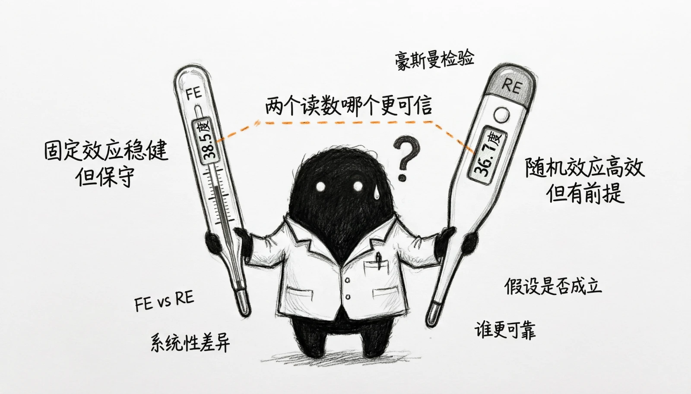

# 第7章 面板数据模型

> “横看成岭侧成峰，远近高低各不同。不识庐山真面目，只缘身在此山中。”
> 
> ——苏轼

只看一个时间点，往往难以区分个体差异与变量变化的作用。例如，高学历者收入较高，既可能与教育有关，也可能与能力、勤奋或家庭资源有关。只做一次横向比较，通常无法把这些解释分开。

面板数据的独特价值正在于此——它同时包含不同个体（如个人、企业、地区）和不同时期（如连续多年）两个维度，使我们能够跟踪同一对象的变化，并控制不随时间改变的单位特征。不过，能够跟踪不等于已经识别因果：随时间变化的混杂因素、反向因果和测量误差仍可能存在。

本章先比较截面数据与面板数据，再介绍固定效应和随机效应。固定效应可以吸收不随时间变化的单位特征；随机效应还要求单位效应与解释变量不相关。两种模型利用的信息和依赖的假设不同，都不能自动排除时变混杂或反向因果。

为了在实际研究中选择合适的模型，我们还会介绍豪斯曼检验。它提供一项关于FE与RE系数差异的统计证据，但不能替代对数据生成过程和外生性假设的判断。最后，我们将通过完全生成的模拟数据，从数据准备、模型估计到结果解读，练习完整流程。

面板数据分析不仅是一组估计方法，也是一种比较思路：既观察不同单位之间的差异，也追踪同一单位随时间的变化。本章的重点，是理解这些额外信息改变了什么、固定效应与随机效应各自依赖什么，以及为什么更丰富的数据仍不能替代识别判断。

## 7.1 从截面数据到面板数据

在我们生活的世界中，经济社会现象复杂而动态。无论是个人收入、企业创新，还是地区经济发展，其背后的规律往往隐藏在多重因素交织的迷雾之下。在前面的学习中，我们掌握了使用横截面数据（Cross-sectional Data）来探索变量间的关系。横截面数据如同在某个特定时间点，为大量的个体（个人、家庭、企业、国家等）拍摄的一张全景照片。它让我们能够观察不同个体在同一时刻的状态，并进行比较。然而，这张静态照片有其局限性。它无法告诉我们个体自身是如何随着时间而演变和发展的。正如我们无法从一张班级合影中看出哪位同学的进步最快，也无法判断是哪些因素促使了这种进步。

在前面的章节中，我们已经系统地学习了多元线性回归模型（OLS）的基本原理与应用。这一方法的核心在于，通过在模型中引入多个控制变量，试图在保持其他因素不变的条件下，估计出某个特定解释变量对被解释变量的净影响。其标准模型形式可表示为：
$$Y_{i} = \beta_{0} + \beta_{1}X_{1i} + \beta_{2}X_{2i} + \ldots + \beta_{k}X_{ki} + u_{i}$$
这一方法虽然强大，却始终面临着一个根本性的挑战——遗漏变量偏误问题。具体而言，如果存在某个重要的解释变量Z被遗漏在模型之外，而该变量又与已包含的解释变量X相关，那么我们对X的系数估计β1就会产生系统性偏差，尽管相比一元回归来说，我们可以使用多元回归模型尽可能把和核心解释变量相关的影响被解释变量的因素都控制起来，但在实际分析过程中，总有我们没有考虑到的因素，或者考虑到了但在数据层面又无法完全控制的情况。

比如在分析研发投入对公司绩效的影响时，影响公司绩效的因素远不止公司的研发投入，公司基本特征（规模、行业、性质等）、经营管理以及企业文化等都是同时与研发投入和绩效都相关的因素。因此，我们需要构建一个如下的多元回归模型：

$$
\text{profit}_{it}=\beta_0+\beta_1\text{RD}_{it}+\beta_2\text{age}_{it}
+\beta_3\text{size}_{it}+\beta_4\text{debt}_{it}+\beta_5\text{assets}_{it}
+\beta_6\text{culture}_i+u_{it}
$$

但是，如果说公司经营管理情况还可以通过控制公司CEO特征来实现，企业文化却是一个难以准确观测和量化的变量，在现实中一般无法直接观察和衡量，从而无法纳入模型。在这种情况下，我们的模型实际为：

$$
\text{profit}_{it}=\beta_0+\beta_1\text{RD}_{it}+\beta_2\text{age}_{it}
+\beta_3\text{size}_{it}+\beta_4\text{debt}_{it}+\beta_5\text{assets}_{it}+u_{it}
$$

其中，原本应该纳入模型的$\text{culture}_i$被归入误差项$u_{it}$。如果企业文化同时影响研发投入和利润，研发投入就会与误差项相关，违背OLS的关键外生性假设。此时$\widehat{\beta}_1$会混合研发投入与企业文化的关联，不能解释为研发投入的因果回报。例如，文化更偏向创新的公司既可能投入更多研发，也可能因其他管理优势获得更高利润。横截面比较难以把这类固定特质与研发投入的关联区分开。

要回答这类变化与发展的问题，我们需要一种能够记录过程而不仅仅是结果的数据——这就是面板数据。面板数据的出现，为我们解决这个问题提供了一线曙光。面板数据（Panel Data），又称纵向数据，它的最大特点是同时包含了个体维度和时间维度。

面板数据是指对同一批公司在多个年份连续观察所获得的数据。与单一横截面相比，面板数据不仅能够记录不同公司之间的差异，也能够跟踪同一公司随时间的变化。通过比较同一公司在不同时期的利润变化，固定效应可以吸收公司不随时间变化的特质，从而减少这一类遗漏因素造成的偏误。但它不能自动处理随时间变化的混杂、反向因果或测量误差，因此所得系数首先是公司内部变化的条件关系。

面板数据还可以研究动态关系，例如研发投入的滞后关联或累积变化；在相同单位数下，多期观测也提供更多信息。加入年份固定效应可以吸收某一年对所有单位共同作用的冲击，但不能控制影响不同单位程度不同的宏观变化、行业冲击或地方政策。

我们看一个简单的例子：假设我们自2021年起，连续4年追踪调查3家公司的研发和绩效情况，我们就能得到如下面板数据集：

| 公司 | 时间 | 研发投入 | 年终利润 |
| --- | ---: | ---: | ---: |
| A | 2021 | 8.0 | 12 |
| A | 2022 | 8.8 | 14 |
| A | 2023 | 10.0 | 16 |
| A | 2024 | 11.5 | 16 |
| B | 2021 | 10.0 | 16 |
| B | 2022 | 10.8 | 20 |
| B | 2023 | 11.0 | 16 |
| B | 2024 | 13.0 | 18 |
| C | 2021 | 11.0 | 8 |
| C | 2022 | 12.0 | 9 |
| C | 2023 | 13.6 | 11 |
| C | 2024 | 15.0 | 13 |

在这个例子中，我们有3个个体（i = 公司A，公司B，公司C），每个个体被观测了4个时期（t = 2021, 2022, 2023, 2024）。数据的总观测值为 3 × 4 = 12 个。面板数据最强大的能力，在于它为我们提供了控制不可观测的个体异质性的可能。

什么是不可观测的个体异质性（Unobserved Heterogeneity）？它指的是那些影响被解释变量Y，但通常无法被直接观测或量化，且不随时间变化的个体特征。比如在研究个人收入时，它可能是个人能力、动机、家庭背景、遗传特质等。在研究企业绩效时，它可能是企业文化、管理质量、品牌声誉等。在研究地区发展时，它可能是地理位置、文化传统、历史遗产等。在横截面数据中，这些因素因为无法测量而被排除在模型之外，成为了遗漏变量。如果它们与我们所关心的解释变量（如受教育年限）相关，就会导致严重的估计偏误——我们可能错误地将能力带来的高收入也归功于教育。

面板数据能够把同一单位与自身比较，从而吸收观察期内不变的单位特征。这里的“不变”是模型假设：地理位置等特征较稳定，但管理团队、企业文化和经营战略都可能随时间变化。利润和研发同时上升也可能来自时变需求、融资条件或管理改革，因此组内比较只是减少一类混杂，不能自动识别因果效应。

通过前面的介绍，我们已经认识到，面板数据独特的二维结构为我们揭示变量间的真实关系提供了强大的潜力。它最核心的价值在于，能够通过追踪同一对象随时间的变化，来帮助我们控制那些无法观测却又不随时间改变的个体特征（即不可观测的异质性），从而极大地缓解了遗漏变量偏误这一传统横截面分析中的顽疾。

然而，认识到这种潜力只是第一步。接下来要问的是：如何在计量模型中吸收这些不变的个体特质，并明确其余识别假设？本章介绍两种常用方法：固定效应模型（Fixed Effects Model, FE）与随机效应模型（Random Effects Model, RE）。前者侧重单位内部变化，后者在更强假设下同时利用组内和组间信息。

固定效应模型采用一种直接的策略：它允许个体效应与解释变量相关，并通过组内去心或差分消除不随时间变化的个体效应。随机效应模型则假定个体效应与各期解释变量不相关，并在该假设成立时同时利用组内和组间信息。

接下来的两节先介绍固定效应的实现与适用条件，再讨论随机效应的关键假定。豪斯曼检验可比较两类估计量在特定限制下是否存在系统差异，但模型选择还需结合研究问题、数据生成过程和推断设定。

> 专栏7-1 追踪调查与企业数据库——面板数据的现实应用
>
> 在学习面板数据模型时，我们常常会问：为什么要使用面板数据？它究竟来自哪里，又为什么如此重要？事实上，面板数据的最大价值，就在于它能够同时反映时间维度和个体维度，揭示随时间演变的动态变化。为了更直观地理解这一特点，有必要从现实中的两大类面板数据应用谈起。
>
> 社会科学中的追踪调查。在社会科学研究中，追踪调查（longitudinal survey）是面板数据的重要来源。与一次性横截面调查不同，追踪调查会对同一批个体在不同年份持续跟踪，从而捕捉到其随时间的变化轨迹。例如，中国家庭追踪调查（CFPS）：自2010年启动，定期追访同一批家庭和个人，涵盖教育、就业、收入、健康等广泛领域，被誉为中国的PSID。中国健康与养老追踪调查（CHARLS）：自2011年起跟踪45岁及以上人群，记录他们的健康、经济与社会支持状况，为研究人口老龄化提供了独特数据。中国劳动动态调查（CLDS）：聚焦于劳动市场和劳动力流动，揭示了城乡就业、产业转移与收入分配的动态过程。其他如中国教育追踪调查（CEPS）、中国收入分配项目（CHIP）等，也为社会学、教育学和经济学研究提供了坚实的数据基础。
>
> 这些调查的价值在于，它们使我们不仅能比较不同群体的差异，还能分析同一群体在不同时间的变化，从而更好地理解因果关系和政策效果。如果没有追踪调查，我们往往只能依赖横截面数据，看似全面，却容易忽略个体差异背后的动态过程。
>
> 经济与金融研究中的企业面板数据。除了调查类数据，另一类重要的面板数据来源是企业和上市公司的财务与运营数据。在经济学和金融学研究中，这类数据被广泛应用：中国上市公司财务数据库（如CSMAR、Wind）收录了A股上市公司的年度和季度财务报表、股价数据和公司治理信息。我们可以利用这些数据构建企业面板，分析企业盈利、投融资、治理结构与市场表现的长期演变。工业企业数据库（如中国工业企业数据库）记录了大规模制造业企业的产出、成本和利润情况，为产业组织与生产率研究提供了丰富的数据基础。银行、保险、基金公司等金融机构的经营数据，也能形成面板，用于研究金融市场的动态风险与稳定性。
>
> 这类数据的意义在于，它们不仅揭示了宏观经济趋势，还能帮助学者与政策制定者观察企业行为和市场机制。例如，我们可以通过面板数据吸收企业不随时间变化的固定因素（如地理位置、较稳定的行业属性），减少这类因素对比较的干扰；能否进一步识别政策或市场冲击的因果效应，还取决于时变混杂、处理分配和其他识别假设。
>
> 面板数据的价值：动态性与更丰富的比较。无论是社会科学中的追踪调查，还是经济金融领域的企业数据库，它们的共同点在于：既有横向比较，又有纵向演变。这种多维信息使我们能够观察同一群体收入变化或企业创新能力的长期演进，并通过固定效应等方法吸收难以观测但不变的个体特征。它可以改善某些因果研究的比较基础，却不能仅凭数据结构识别政策与冲击的真实作用；时变混杂、反向因果和处理分配机制仍需单独处理。
>
> 因此，面板数据不仅是一种统计形式，更是一种理解社会与经济运行的独特视角。从微观家庭到宏观企业，从教育、健康到金融、产业，它们让我们在纷繁复杂的世界中看得更清楚，也推理得更可靠。

## 7.2 固定效应模型

在上一节中，我们介绍了面板数据利用单位自身变化、减少时间不变遗漏因素干扰的优势。固定效应可以通过组内去心或最小二乘虚拟变量法（LSDV）实现；一阶差分是另一种消除单位效应的变换。它们改善了比较基础，但只有在额外外生性假设成立时，系数才可解释为因果效应。

### 7.2a 一阶差分法

固定效应模型最直观的实现方式之一是差分法（First-Difference）。每个单位都有多个时期的观测值，而某些单位特征在观察期内保持不变。将同一单位相邻两期的数据作差，可以消去这些不随时间变化的特征，只利用单位内部的变化信息估计系数。但差分不能消除随时间变化的遗漏因素，也不能自动解决解释变量与当期或未来误差相关的问题。

差分法的提出逻辑就是针对这个问题而设计的。我们注意到，对于面板数据而言，每个单位在不同时期都会有观测值，而单位固定特质在短期内通常保持不变。因此，如果我们将同一单位连续两期的数据做差，就可以让那些不随时间变化的特质自动抵消。换句话说，差分法利用的是时间维度上的变化信息，而不依赖单位之间的横向比较，从而剔除固定特质造成的一类混杂。通过这种方式，我们能够聚焦解释变量变化与被解释变量变化之间的组内关系；只有随时间变化的遗漏因素、反向因果等威胁得到处理时，才可进一步作因果解释。更直观地理解，可以考虑上市公司研发投入对利润的例子。假设我们想知道研发投入是否真正促进利润增长。如果公司A本身管理水平高、企业文化优秀，它的利润可能长期高于其他公司。若只用横截面数据比较不同公司，我们可能会错误地把利润高的部分归因于研发投入，而实际上可能是管理水平的作用。

总之，差分法利用同一单位内部的变化消除不随时间变化的固定特质，从而缓解这一类遗漏变量偏误。它不能处理随时间变化的混杂因素，也不替代对严格外生性、动态关系和误差结构的讨论。这一思路有助于理解组内去心法和LSDV等固定效应实现方式。

在技术层面，一阶差分法要求我们将每个变量都转换为相邻年度的差值。利润率和研发投入都从水平值变为变化量。然后，我们分析研发投入的变化量是否能够解释利润率的变化量。这种方法特别适合那些自然具有连续变化过程的经济现象。例如，研究投资对经济增长的影响时，经济学家往往更关心增长率的变化而不是绝对水平的高低。

具体来看，对模型进行一阶差分，即用第*t*期的方程减去第*t*−1期的方程：

$$Y_{it} = \beta_{1}X_{it} + \alpha_{i} + u_{it}$$

$$Y_{i,t - 1} = \beta_{1}X_{i,t - 1} + \alpha_{i} + u_{i,t - 1}$$
两式相减得：

$$Y_{it} - Y_{i,t - 1} = \beta_{1}(X_{it} - X_{i,t - 1}) + (u_{it} - u_{i,t - 1})$$

即

$$\Delta Y_{it} = \beta_{1}\Delta X_{it} + \Delta u_{it}$$
在这个方程中，固定效应 $\alpha_i$ 被消除，因此可以对差分后的数据进行OLS估计。在条件外生性等假设成立时，${\widehat{\beta}}_{1}$描述同一单位中X变化1个单位与Y平均变化多少相关。它是否可解释为因果效应，还取决于是否控制了随时间变化的混杂因素、是否存在反向因果，以及误差项的动态结构。一阶差分会丢失第一期数据，并可能放大测量误差；误差还可能在单位内相关，因此推断时通常应按面板单位聚类标准误。

### 7.2b 组内去心法

差分法直观，但会丢失每个单位的第一期观测，并可能放大测量误差。组内去心法（又称单位去均值法）同样可以消除单位固定效应，并利用各期相对于单位均值的偏离。两种变换对误差序列相关和测量误差的敏感程度不同，不能把组内去心简单理解为对一阶差分缺点的普遍修复。

组内去心法的基本思想是：对每个单位分别计算被解释变量和解释变量的时间均值，再用每一期观测减去相应均值。由于单位固定效应在观察期内保持不变，去心后会被消除，估计只利用变量的组内偏离。它消除的是时间不变单位效应，不能消除时变混杂或反向因果。

差分法比较相邻两期的变化量，组内去心法比较每一期相对于单位均值的偏离。后者使用全部时期形成组内偏离序列，但不具有机械“平滑”数据的作用；在不同误差结构下，二者的效率和稳健性排序也可能不同。

以上市公司研发投入对利润的分析为例，如果公司A在五年内的利润分别为10、11、12、13、14万，则该公司平均利润为12万。对每一年利润减去12万，即得到偏离值：-2、-1、0、1、2万。同理，研发投入也计算偏离值。对这些偏离值进行回归，可以估计单位内部的条件关联。与一阶差分相比，组内去心使用每一期相对单位均值的偏离；当 $T>2$ 时，两者的信息权重不同，通常不会给出完全相同的估计，也不能笼统地说组内估计一定更能应对测量误差。

总之，组内去心法和一阶差分都能消除时间不变的单位效应，但二者对时间序列信息的使用不同。选择哪一种要结合误差的序列相关、测量误差、面板长度和研究目标，而不是把它们视为必然等价的计算方式。

具体来看，组内去心法的逻辑是：既然*$\alpha_{i}$*不随时间变化，那么只要关注每个个体内部随时间发生的变化，就可以将其差分掉。具体而言，为每个个体计算其所有时期变量的平均值，然后用原始值减去这个均值，从而得到去心后的数据。

首先，对个体*i*求时间均值：

$$\overline{Y}_i=\frac{1}{T}\sum_{t=1}^{T}Y_{it},
\qquad
\overline{X}_i=\frac{1}{T}\sum_{t=1}^{T}X_{it}$$

其次，用原方程减去均值方程：

$$Y_{it}-\overline{Y}_i
=\beta_1\left(X_{it}-\overline{X}_i\right)
+\left(u_{it}-\overline{u}_i\right)$$

我们可以定义去心符号：

$$\ddot{Y}_{it}=Y_{it}-\overline{Y}_i,
\qquad
\ddot{X}_{it}=X_{it}-\overline{X}_i$$

其中$\overline{Y}_i$和$\overline{X}_i$分别为单位$i$的被解释变量和解释变量的时间平均值。通过组内去心，个体效应$\alpha_i$被消除；应当将$\ddot{Y}_{it}$对$\ddot{X}_{it}$回归，而不是对原始$X_{it}$回归。

延续公司研发投入的例子，如果五年平均利润为10百万，而某一年利润为12百万，则该年的偏离值为2百万；五年平均研发投入为4百万，当年为5百万，则偏离1百万。对这些偏离值回归得到的系数表示公司内部研发变化与利润变化之间的条件关系；能否解释为因果效应，仍取决于时变混杂和外生性等条件。相比差分法，组内去心法不丢失第一期数据，也能更平滑地利用多期信息，因此在面板较长的情况下通常更稳定。

### 7.2c 最小二乘虚拟变量法

在差分法和组内去心法之后，我们可能会好奇：固定效应模型有没有更直观的实现方式？最小二乘虚拟变量法（Least Squares Dummy Variable, LSDV）直接为每个单位引入虚拟变量，把单位固定效应作为一组截距项纳入模型。它与组内去心法在常规线性设定下给出相同的核心斜率：两者都吸收了不随时间变化的单位特征，再利用单位内部随时间的变化估计条件关系。如果单位数量不多，LSDV还能显式展示各单位截距的差异。但无论使用哪种计算方式，时变混杂和反向因果都不会自动消失。

最直接的想法是：如果每个个体都有一个独一无二的特质，那就为每个个体分配一个独一无二的标签或身份标识，并将其放入模型中加以控制。想象一下，我们正在研究10家上市公司研发投入对利润率的影响。直觉告诉我们，每家公司都有自己独特的企业文化、管理风格和历史传承，这些因素虽然难以直接测量，但都会显著影响利润率。LSDV方法的巧妙之处在于，它不试图直接测量这些难以量化的因素，而是通过为每家公司设置一个虚拟变量来代表其独特性。

具体来说，我们会为10家公司创建9个虚拟变量（为避免完全多重共线性，需要舍弃一个虚拟变量或常数项）。这样，我们的模型就变成了：

$$
\text{profit}_{it}=\beta_0+\beta_1\text{RD}_{it}+\beta_2\text{size}_{it}
+\beta_3\text{debt}_{it}+\beta_4\text{assets}_{it}
+\sum_{j=2}^{10}\alpha_jD_{ji}+u_{it}
$$

在这个模型中，公司虚拟变量系数概括该公司相对于基准公司的长期截距差异。它吸收所有时间不变因素的合计，不能把某个系数单独解释为“卓越管理团队”或某一种可观测特质的作用。

LSDV模型如何估计呢？在数学上，我们从一个包含个体效应的面板模型开始：
$$Y_{it} = \beta_{1}X_{it} + \alpha_{i} + u_{it}$$
其中，$\alpha_{i}$即为个体固定效应，代表了所有影响$Y_{it}$但不随时间变化的个体特征。LSDV法通过为每个个体*i*创建一个虚拟变量*Di*（当观测值属于个体*i*时取1，否则取0），将上述模型改写为：

$$Y_{it}=\beta_1X_{it}+\sum_{j=1}^{N}\alpha_jD_{ji}+u_{it}$$

在这个模型中，$\alpha_{1},\alpha_{2},\ldots,\alpha_{N}$作为待估截距出现。对同一模型、同一样本和同一权重，LSDV与组内去心法的斜率系数数值相同；一阶差分在$T=2$时与二者等价，但在$T>2$时通常不同。

回到上市公司研发投入对利润的例子，使用LSDV方法可以为每家公司设置一个虚拟变量，表示其长期固定差异，如管理水平、企业文化、行业地位等。回归结果中的${\widehat{\beta}}_{1}$表示公司内部研发投入每增加一百万，利润的平均变化量，而各个虚拟变量的系数则反映了不同公司长期固定特质对利润的影响。这种方法直观清晰，便于理解单位固定效应的经济含义，也为教学和报告分析提供了便利。

LSDV法的思想非常直观，但直接创建成千上万个虚拟变量会降低计算效率，也不便于展示结果。现代软件通常采用组内变换或吸收算法处理高维固定效应，无需显式生成和报告每个虚拟变量。因此，LSDV更适合帮助理解固定效应，实际大样本估计则通常使用计算上等价而更高效的实现。

这些方法都能消除时间不变的单位效应，但不能避免所有遗漏变量偏误。组内去心与LSDV在相同设定下等价；一阶差分使用相邻期变化，在多期面板中一般不等价。实际选择要结合误差序列相关、测量误差、面板长度与研究问题，并为单位内相关选择合适的聚类标准误。

### 7.2d 时间固定效应

除了单位特质，面板数据中还存在可能同时影响所有单位的年份共性因素。以上市公司为例，宏观经济波动、政策变化或行业景气周期可能在某一年内影响所有公司的利润。如果不控制这些年份效应，回归估计仍然可能存在偏误。时间固定效应模型通过引入年份虚拟变量，将年份间的共性冲击吸收掉，从而只比较不同公司在同一年内的差异，同时剔除年份间所有公司共有的波动。其形式可以写作：

$$\text{profit}_{it}=\beta_0+\beta_1\text{RD}_{it}+\beta_2\text{size}_{it}
+\beta_3\text{debt}_{it}+\beta_4\text{assets}_{it}+\gamma_t+u_{it}$$

其中，$\gamma_{t}$ 表示年份固定效应，捕捉每一年可能影响所有公司的共性因素。经济直觉上，年份固定效应相当于为每一年设定一个单独截距，从而剔除宏观经济和政策等年份共性波动的干扰。

在许多实际问题中，同时存在单位固定效应和时间固定效应。双向固定效应模型同时吸收公司自身的时间不变特征和各公司共同经历的年份冲击，再估计研发投入与利润之间的条件关系，形式如下：

$$\text{profit}_{it}=\beta_0+\beta_1\text{RD}_{it}+\beta_2\text{size}_{it}
+\beta_3\text{debt}_{it}+\beta_4\text{assets}_{it}+\alpha_i+\gamma_t+u_{it}$$

其中，$\alpha_{i}$ 表示公司固定效应，$\gamma_{t}$ 表示年份固定效应。模型利用同一公司相对自身均值的变化，并控制某一年对所有公司共同的冲击。它仍不能控制公司层面随时间变化的遗漏因素，因此研发投入系数不自动等于真实因果效应。

例如，如果某一年所有企业利润都受同一宏观冲击影响，年份固定效应可以吸收这一共同变化。双向固定效应后的研发系数仍可能混入企业层面的时变冲击，不能称为“只保留研发投入本身的影响”。它也无法单独估计不随时间变化的解释变量，例如成立年份。

固定效应模型无需直接测量时间不变的个体特征，而是通过虚拟变量或组内变换吸收其影响。它依赖单位内部随时间的变化，因此无法单独估计时间不变变量的系数；当解释变量组内变化很小时，估计也会不精确。更关键的是，因果解释通常需要解释变量满足严格外生性等条件：在控制固定效应和其他控制变量后，解释变量不能与该单位各期未观测冲击系统相关。

这自然引出了一个重要问题：如果我们有理由相信，那些未被观测的个体异质性与模型中的解释变量完全不相关，是否存在一种更加高效的方法，能够同时利用组内变异和组间变异的信息来进行估计？答案是肯定的，这就是我们下一节将要重点介绍的随机效应模型（Random Effects Model）。随机效应模型采取了一条不同的建模思路：它不再将个体效应视为待估计的固定参数，而是将其视为与解释变量不相关的随机误差项的一部分。这种处理方式虽然要求更强的假设条件，但在满足条件时能够产生更有效的估计结果，并且允许我们估计不随时间变化的变量影响。

那么，在实际研究中，我们究竟应该在固定效应与随机效应模型之间如何选择？两种模型的估计结果如果有差异，又该如何理解和解释？这些问题将带领我们进入面板数据分析的下一个核心议题：随机效应模型的基本原理、假设条件及其与固定效应模型的根本性区别。

> 专栏7-2 三种消除固定效应的方法，结果何时相同？
>
> 在学习固定效应模型时，我们常常会疑惑：差分法、组内去心法和LSDV都能消除单位固定效应，它们的结果是否必然相同？答案是：LSDV与组内去心在同一设定下等价；一阶差分只有在两期面板等特殊情况下与它们等价。
>
> 想象一下这样一个场景：你想研究三家上市公司过去五年的研发投入对利润的影响。每家公司都有自己的长期特质，例如管理水平、企业文化、品牌影响力等，这些特质在短期内几乎不变。我们关心的是研发投入的变化对利润的影响，而不是公司固有特质对利润的贡献。
>
> 差分法就像拿每家公司连续两年的数据做减法。它直接把每家公司不随时间变化的特质消掉，只关注研发投入变化对应的利润变化。
>
> 组内去心法的思路是先计算每家公司各变量的平均值，然后对每条数据减去该平均值，相当于把每家公司固定特质的平均水平去掉，只剩下内部变化部分。
>
> LSDV方法则通过给每家公司引入虚拟变量，让回归模型为每家公司设定一个单独的截距，从而吸收公司固有特质对利润的影响。
>
> 三种方法都控制公司自身不变特质，但对多期变化的加权方式不同。因此，组内去心与LSDV的研发投入系数应一致，一阶差分则可能明显不同。差异并不必然说明程序出错，而可能反映误差结构、测量误差或动态过程。
>
> 直观地说，这就像你要测量一台恒温水壶加热效率，不同方法可能是测温点不同（差分法是测前后温差，去心法是测偏离平均温度，LSDV是为每个壶单独标定），但核心目标一致——得到水壶加热速度的真实数值。
>
> 这个案例告诉我们，面板数据方法中形式不同但核心逻辑相同的估计方法，往往会得出相同的结果。我们不必被方法形式困惑，而应理解其背后的控制单位不变特质的思想。拓展来看，这种思路也可以应用到教育、城市发展、医疗机构绩效等各种面板数据分析场景，使得固定效应方法成为研究长期趋势和动态变化的强大工具。

## 7.3 随机效应模型

在上一节中，我们介绍了如何利用单位内部变化消除不随时间改变的单位特质。固定效应不能单独估计完全不随时间变化的变量；若变量只有很少的组内变化，估计也会不精确。现代软件可以高效吸收大量固定效应，因此单位数量大本身通常不是选择随机效应的理由。

### 7.3a 随机效应模型

随机效应模型与固定效应模型对单位特质的处理不同：固定效应允许单位效应与解释变量相关，并通过组内变换或虚拟变量吸收它；随机效应把单位效应视为随机变量。关键附加条件不是“单位效应与误差项不相关”，而是单位效应与该单位所有时期的解释变量不相关，同时特异扰动也要满足相应外生性条件。

随机效应模型的直觉可以通过上市公司研发投入对利润的例子来理解。假设每家公司都有一些长期特质，如管理水平、企业文化、行业地位。随机效应模型要求这些单位效应与各期解释变量不相关。在这一强假设和其他常规条件成立时，模型可以同时利用公司内部变化和公司之间差异，并可能比固定效应更精确；若假设不成立，利用组间信息反而会带来偏误。

换句话说，随机效应模型把每个公司的固定特质看作是从总体中随机抽取的样本效应，允许解释变量在跨单位和跨时间两个维度的变化都被利用来估计回归系数。与固定效应模型只利用单位内部变化不同，随机效应模型同时利用了单位间差异，这在单位内部变化较小或短面板的情况下尤其有优势。

在随机效应模型中，复合误差由单位效应和特异扰动两部分构成，同一单位不同期的复合误差因共享单位效应而相关。广义最小二乘通常通过准去均值变换处理这种相关结构。变换程度由单位效应方差、特异扰动方差和观测期数共同决定，而不是依据每家公司的实际波动为其随意分配一个权重。

具体地，随机效应模型的初始形式如下：

$$Y_{it} = \beta_{1}X_{it} + \epsilon_{it}$$

随机效应模型的核心在于将无法解释的变异拆分为两个独立部分，即随机误差项$\epsilon_{it}$可以表示为：

$$\epsilon_{it} = \alpha_{i} + u_{it}$$

其中$\alpha_i$表示单位随机效应，$u_{it}$表示时变的特异扰动。常用随机效应设定要求$E(\alpha_i\mid X_{i1},\ldots,X_{iT})=0$，并对$u_{it}$施加相应条件外生性。仅写某一期的零协方差不足以概括这些要求。

在随机效应模型中，我们把每个单位的固定特质$\alpha_{i}$看作随机变量，而整体误差项可以分解为两部分：单位特质的随机效应$\alpha_{i}$和传统的随机扰动$u_{i}$。也就是说，每个观测值的总误差包括长期特质的影响和随机噪声。为了得到有效的回归系数估计，我们需要既消除固定效应可能带来的偏误，又尽量利用单位间的差异信息。

在随机效应设定下，同一个体不同时期的复合误差因共享单位效应而相关。因此，混合OLS虽可能仍保持一致，但通常不是有效估计，常规标准误也不适用。随机效应通常在其假定的协方差结构下使用广义最小二乘法（GLS）估计。它同时利用单位内部变化和单位间差异；只有在单位效应与各期解释变量不相关等假设成立时，这些信息才能提高估计效率而不引入偏误。

想象你在比较多家企业的绩效与研发投入，但每家企业都有自己的平均水平——有的企业天生经营稳健，有的天生风险高。随机效应估计做的事情，就是先估计出每家企业大致的平均表现（相当于对每个企业取一段时间的平均），然后在回归时部分地剔除这种平均差异的影响。和固定效应不同的是，固定效应会完全剔除个体平均值，只比较企业自己内部的变化；而随机效应只是部分地调整，在剔除和保留之间找到一个平衡。这个平衡点取决于两个方差的大小：企业特质的方差（不同企业之间的差异）和年度波动的方差（同一家企业内部的随机变化）。如果企业之间差异很大（企业特质的方差大），模型会更接近固定效应；如果企业差异不大（特质方差小），模型会更接近普通OLS（在实际应用中，随机效应模型是用一种叫广义最小二乘法（GLS）的办法估计的）。

直观地说，固定效应完全减去单位均值，而随机效应只减去单位均值的一部分，因此保留一些组间信息。只有在单位效应与解释变量不相关等假设成立时，${\widehat{\beta}}_{1}$才兼具一致性和效率优势；随机效应不会自动消除固定效应偏误。

随机效应把单位特质视为随机变量，并利用组内和组间差异。在单位效应与各期解释变量不相关、特异扰动满足外生性且协方差结构设定合适时，RE可以保持一致并比FE更有效率；这些条件不成立时，利用组间信息可能引入偏误。

### 7.3b 豪斯曼检验

在实际面板数据分析中，我们常常面临一个重要选择：究竟应该使用固定效应模型，还是随机效应模型？固定效应模型稳健，但无法估计不随时间变化的解释变量，并且只利用单位内部变化信息；随机效应模型效率更高，可以同时利用单位内部和单位间的信息，但前提是单位特质与解释变量不相关。如果这个假设不成立，随机效应估计可能会产生偏误。为了系统比较两种估计结果的差异，可以使用豪斯曼检验（Hausman，1978）。它提供的是模型限制是否与数据相容的辅助证据，而不是脱离研究背景自动选择模型的裁判。

豪斯曼检验通过比较固定效应与随机效应的可比系数，考察数据是否与随机效应施加的额外限制相容。若这些限制成立，二者都可能一致，而随机效应在协方差结构设定正确时通常更有效率；若差异显著，随机效应限制受到质疑。固定效应是否可靠仍取决于严格外生性、模型形式和推断方法等条件，不能由豪斯曼检验单独保证。

可以把豪斯曼检验类比为比较两种依据不同校准条件工作的测量方案。比较的重点不是先验认定其中一支体温计永远准确，而是判断二者的差异是否与随机效应施加的额外限制相容。若限制不成立，两种结果可能出现系统差异；若差异不明显，也不能据此认证限制为真。

固定效应模型可类比为主要依据同一对象多次测量之间的变化。例如研究企业研发投入与利润时，它比较同一家企业研发投入相对自身均值的变化及其利润变化，从而吸收企业不随时间变化的特征。代价是不能直接估计时间不变变量的系数，而且当核心解释变量几乎不随时间变化时，估计会很不精确。

随机效应模型同时利用单位内部变化和单位之间的差异，因而在其额外不相关限制和协方差结构成立时可能更有效率。若单位长期特质与各期解释变量相关，组间信息会使简单RE估计偏离目标参数。

豪斯曼检验可以理解为比较两种测量方案的结果。若固定效应和随机效应的可比系数差异超过抽样波动所能解释的范围，说明数据与随机效应的额外限制不相容，此时不宜把简单RE作为主要模型。但这并不自动证明FE已经正确，还需要检查时变混杂、动态设定和标准误等问题。

豪斯曼检验的逻辑可以理解为以下几个步骤：

（1）分别估计固定效应模型和随机效应模型：首先对同一面板数据使用两种方法回归，得到两组可比较的系数。固定效应允许单位效应与解释变量相关，但仍需要严格外生性等条件，并非总是有效；随机效应还要求单位效应与各期解释变量不相关。

（2）比较两组估计结果：检验的核心在于观察固定效应和随机效应估计系数之间是否存在系统性差异。如果随机效应假设成立，这两种方法的估计结果应当非常接近，差异仅由抽样波动引起；如果差异显著，则说明随机效应假设被违反，单位特质可能与解释变量相关。

（3）结合证据做出选择：若检验显示差异显著，数据与随机效应的关键限制不相容，应避免把RE作为主结果。若差异不显著，只能说样本没有提供足够证据拒绝RE，不能证明不相关假设成立；检验功效、标准误设定和模型设定都可能影响结论。

在上市公司研发投入对利润的例子中，如果两种方法得到的系数差异很小，这只是与RE限制相容的一项证据；还需从研发决策过程判断公司长期特质与解释变量不相关是否可信。如果差异明显，则应重点检查RE假设、变量设定和推断方法。

豪斯曼检验提供了一项关于模型限制的统计证据。它的价值在于提示研究者比较两种估计量所依赖的假设，而不是给出脱离研究背景的自动答案。

豪斯曼检验也有局限：小样本下功效可能不足，异方差或聚类相关会影响传统检验，两个模型的解释变量设定或样本不一致时也无法直接比较。没有一个普适的“30家企业”或“50个人”分界线。实务中应先说明识别假设，再把检验作为辅助证据；必要时可考虑相关随机效应设定（Mundlak，1978），直接加入时间变化变量的单位均值来检验和放松RE限制。

选择模型不是“FE绝对准确、RE高效全面”的二选一。二者都依赖假设，只是允许单位效应与解释变量相关的方式不同。模型选择应结合研究问题、数据生成过程、组内变异、时间不变变量的重要性和推断方法，而不能只看一个$p$值。

如果研究目标是利用单位内部随时间的变化估计条件关系，且担心单位效应与解释变量相关，固定效应通常是自然起点。它吸收时间不变的单位差异，但因果解释仍要求时变解释变量满足严格外生性等条件。

若研究需要估计时间不变变量，且有充分理由相信单位效应与各期解释变量不相关，随机效应可以同时利用组内和组间变异。也可以考虑相关随机效应等设定，在保留时间不变变量的同时放松简单RE限制。

不能根据“大$N$、短$T$选FE”或“长$T$选RE”来决定模型。$N$和$T$会影响估计精度、动态偏误和推断方法，但FE与RE的核心选择仍取决于单位效应—解释变量相关性、目标参数和解释变量的组内变异。

还应注意，固定效应变换会消除所有时间上保持不变的变量，因此无法直接估计所有制类型、地区制度环境或行业属性等时间不变变量的系数。若这些变量是研究重点，可考虑有充分依据的随机效应、相关随机效应（Mundlak设定）或其他分层模型；这些替代方案各有额外假设，不能仅因FE无法估计而自动采用。

在许多经济学应用中，研究者会把固定效应作为重要基准，因为单位效应与解释变量不相关的假设往往较强。但固定效应只对时间不变遗漏因素提供保护；若存在时间变化的混杂、反向因果、动态模型偏误或严重测量误差，它仍可能产生系统性偏误。

豪斯曼检验只是模型选择的一项经验依据。实际研究应先界定目标参数，考察核心变量的组内变异，并判断单位效应与解释变量相关的可能性、严格外生性和误差结构。担心单位效应相关时，FE常可作为基准；需要估计时间不变变量时，可进一步考虑相关随机效应等方案并明确额外假设。最终选择不能由检验结果或效率高低单独决定。

> 专栏7-3 固定效应与随机效应——两种视角的生活化理解
>
> 在面板数据分析中，固定效应模型和随机效应模型是两种常用的方法，但初学者往往容易混淆它们的适用场景和本质区别。理解这两种方法的核心思想，有助于我们在处理真实数据时做出合理选择。
>
> 固定效应的视角：剔除个体不变特质，专注变化
>
> 固定效应模型的核心理念是：每个个体都有自己独特、但不随时间变化的特质，这些特质可能会影响被解释变量，如果不加以控制，会导致估计结果偏误。固定效应模型通过为每个个体设立独立截距，将这些固定特质吸收掉，只分析随时间变化的因素对结果的影响。举一个直观的例子：一所学校想研究不同教学方法对学生成绩的影响。每个学生的家庭背景、智力水平、性格特征都是固定特质，如果直接比较不同学生的成绩，很难判断成绩差异是否真的来自教学方法。使用固定效应模型，相当于为每个学生设定一个基础线，只关注其成绩随教学方法变化的提升或下降，从而更准确地评估教学效果。固定效应模型的优势在于，它可以有效剔除那些不随时间变化的干扰因素，使我们观察到的效应更加纯粹。它尤其适合研究那些个体特质可能与解释变量相关的情况，例如不同城市的政策研究、不同企业的投资行为分析等。
>
> 随机效应的视角：个体差异视为随机扰动
>
> 随机效应模型则采取另一种策略：它认为个体的固定特质可以被视为随机扰动，这些差异与解释变量不相关，可以纳入误差项中进行建模。换句话说，随机效应模型不需要为每个个体单独设置截距，而是通过假设个体差异为随机变量来处理。回到学校的例子，如果我们认为学生的先天差异与采用的教学方法无关，也就是说智力水平和家庭环境与教学策略选择没有系统性关联，那么可以使用随机效应模型。这种方法能够利用更多的自由度，更高效地估计教学方法的平均效果，同时保留个体差异的随机影响。
>
> 想象一个公司评估员工培训的效果：如果每位员工的基础能力差异很大，且这些差异可能与培训内容相关（如高绩效员工更容易接受高级培训），公司希望分析每个员工培训前后的变化，则固定效应模型更适合。它可以剔除员工固定特质，只分析培训导致的实际绩效变化。相反，如果员工之间的能力差异相对随机，与培训安排无关，公司只关心培训整体效果，那么随机效应模型可以更高效地利用数据，同时得到对总体平均效果的稳健估计。
>
> 如何选择模型：思考与实践
>
> 在实践中，我们应先理解数据来源和研究问题，再判断单位效应与解释变量不相关是否可信，并把豪斯曼检验作为辅助证据。固定效应能控制时间不变的单位特质，但不能保证控制所有混杂；随机效应的效率优势也只在其附加假设成立时存在。
>
> 通过这些例子可以看到，固定效应和随机效应不仅是计量工具，也是一种分析思路：面对复杂多维数据时，我们可以选择关注变化还是整体平均水平，理解个体差异在分析中的作用，从而做出更加合理和稳健的推断。

## 7.4 案例实践：面板固定效应与豪斯曼检验

【案例背景】

在前三节中，我们学习了面板数据的两大建模框架：固定效应模型（FE）通过与自己比较消除不随时间变化的个体特质，随机效应模型（RE）则在单位效应与解释变量不相关等假设下利用组内和组间信息。本案例用生成数据练习估计、比较与假设诊断；它不提供关于现实上市公司的经验证据。

本案例以一份模拟的上市公司面板数据为基础——200家公司连续5年的研发投入（R&D）、总资产（Assets）、负债率（Debt）和利润（Profit）。数据中预埋了公司固定效应（不可观测的企业文化与研发投入相关）和年份固定效应（不可观测的宏观冲击）。你需要通过四个任务，完整走一遍面板数据分析的标准流程，并在每个环节中理解我为什么要做这一步。

【案例要解决的问题】

本案例要回答四个问题。

第一，如果忽略公司固定效应，直接用混合OLS回归，研发投入的系数会如何偏误？偏误的方向和大小说明了什么？

第二，组内去心法（xtreg, fe）与LSDV为什么给出同一个β̂？一阶差分在五期面板中为什么不要求与它们相同？

第三，随机效应模型和固定效应模型的估计结果有何差异？豪斯曼检验如何判断哪种模型更适合？如果豪斯曼检验拒绝了RE，这告诉我们数据中有什么样的结构特征？

第四，在加入年份固定效应后（双向固定效应），研发投入的系数是否发生了变化？这说明了宏观冲击在本案例中的作用有多大？

【AI Agent工作流准备】

先建立`chapter07_project/`，在README写下面板单位、时间单位、唯一键、平衡性、目标变异来源和聚类层级，并预测混合OLS、固定效应和随机效应的差别。把所选语言的配套脚本复制进项目，原文件只读保留。

让Agent先读取本节、任务卡、README和脚本，检查`id×year`是否唯一、年份排序是否正确、核心变量是否有足够的组内变化，并列出将要运行的模型与输出。确认计划后，再允许它运行混合OLS、组内FE、LSDV、一阶差分、RE、Hausman检验和双向FE，将模型表、检验统计量和日志保存到`output/`。不能把并列展示FE与RE系数的表冒充Hausman检验。

> **AI Agent工作流提示**
> 1. 先核对`xtset`或Python面板索引、重复键和缺口，再运行回归；
> 2. 要求Agent说明每种估计使用组间变化、组内变化还是相邻期变化，并核对样本量；
> 3. 实际保存Hausman统计量、自由度和$p$值，同时记录聚类标准误的层级；
> 4. 若Python实现需要手工计算检验，必须保存公式、协方差矩阵处理和运行结果，不能只生成一段“看起来像”的代码。
>
> 但以下判断必须由你自己完成：
> 1. 混合OLS和FE的系数差异是否大到足以改变结论？偏误方向是否符合理论预期？
> 2. 组内去心与LSDV的β̂是否一致？一阶差分为什么可能不同（不仅因为少一期数据，也因为它对多期变化的加权方式不同）？
> 3. 豪斯曼检验的$p$值是否小于0.05？如果不拒绝RE，你会选择RE还是仍然坚持FE？理由是什么？
> 4. 双向FE中，年份虚拟变量的系数模式是否有经济含义（如某年全部公司的利润都偏低）？

【实践任务】

**任务1：混合OLS与固定效应的对比。** 先忽略面板结构，用混合OLS估计利润对研发投入、总资产和负债率的回归。然后，声明面板数据结构，用组内去心法（FE）估计同样的方程，并按公司聚类标准误。提交一张两列对比表，并回答：研发投入的系数从混合OLS到FE发生了什么变化？结合已知的数据生成过程，这个变化为什么与公司固定效应和研发投入正相关相符？仅凭系数变化本身为什么不能证明相关方向？

**任务2：三种方法的比较。** 使用同一方程，分别用组内去心法、LSDV法和一阶差分法估计研发投入的系数。提交三列对比表，并回答：组内去心与LSDV的β̂是否在数值精度内一致？一阶差分为什么不必相同（样本、权重、误差结构和测量误差均可能造成差异）？LSDV中的公司虚拟变量系数应如何相对于基准公司解释，为什么不应把它们逐一解释为某种具体的“企业文化”？

**任务3：随机效应与豪斯曼检验。** 用随机效应模型估计同一方程，然后进行豪斯曼检验。提交RE系数表、FE系数表、以及豪斯曼检验的统计量和$p$值。回答：FE和RE的研发投入系数是否有实质差异？豪斯曼检验的结论是什么？如果结论是“拒绝RE”，这说明公司固定效应与解释变量之间的关系是怎样的？

**任务4：双向固定效应。** 在任务1的FE模型中加入年份虚拟变量（i.year），估计双向固定效应模型。提交一张对比表（混合OLS vs 单向FE vs 双向FE），并回答：加入年份FE后，研发投入的系数和标准误有何变化？如果变化很小，说明什么？如果变化明显，又说明什么？查看年份虚拟变量的系数——它们的经济含义是什么？

> 📁 配套代码包：
> - Stata：`code/stata/ch07/01_panel_fe_re.do`
> - Python：`code/python/ch07/01_panel_fe_re.py`
> - AI Agent任务卡：`code/ai_cards/ch07_ai_task_card.md`
>
> 提交产出：1张混合OLS vs FE对比表 + 1张三方法验证表 + 1张FE/RE/Hausman表 + 1张双向FE对比表 + 可复现代码 + `ai_log.md`

【结果讨论】

在既定DGP下，混合OLS中R&D的系数通常大于FE系数，因为程序人为设定的公司效应同时与R&D和利润正相关。FE去掉这些时间不变特质后，估计的是公司内部R&D变化与利润变化的条件关系。在模拟中可以与设定的真值比较；在真实数据中，仅看到系数下降不能反推出唯一机制。

任务2中，组内去心法和LSDV法给出的斜率系数应在数值精度内相同。一阶差分只使用相邻期变化，在五期面板中与组内估计并不等价；两者差异可能来自随机抽样、误差序列相关、测量误差或模型动态结构，不能只归因于丢失第一期。

任务3的豪斯曼检验在既定DGP和随机种子下通常会拒绝RE，因为公司效应被设定为与R&D相关。这说明模拟结果与RE限制不相容。若某次抽样没有拒绝，也不等于该限制为真；应结合已知DGP、检验功效和推断设定解释。

任务4中，加入年份固定效应后R&D系数变化很小，只说明在该模型和模拟样本中，吸收共同年份冲击对这个系数影响不大；不能据此断言宏观冲击不重要。变化明显则提示原系数对共同年份因素较敏感，还需结合DGP解释原因。

【案例总结】

本章案例将面板数据分析的标准流程——混合OLS → FE → 三种方法验证 → RE → Hausman检验 → 双向FE——完整走了一遍。你可能会发现：同样的变量和样本，仅仅因为是否控制固定效应、控制哪些固定效应，核心系数就可能不同。这说明不同设定使用的比较和依赖的假设并不相同；系数变化可能来自固定特质被吸收，也可能反映目标参数、模型设定或其他数据问题，需要结合研究背景解释。

更重要的是，通过这个案例你应该养成一套可解释的工作流程：先声明并检查面板结构，再根据研究问题和DGP写出模型，检查组内变异，选择与误差相关结构相符的标准误，比较FE、RE或相关随机效应，并说明时间固定效应是否必要。不存在“永远先FE、再靠Hausman决定一切”的机械顺序。

> **方法边界：面板模型能做什么、不能做什么**
>
> 面板模型能够利用单位内部变化，固定效应可以吸收不随时间变化的单位特质，年份固定效应可以吸收各单位共同经历的年份冲击。它不能自动消除随时间变化的混杂、反向因果、测量误差或选择问题；豪斯曼检验也只提供FE与RE限制是否相容的统计证据，不能替代对数据生成过程和外生性条件的判断。

## 本章小结

本章系统介绍了面板数据模型的核心方法与分析思路。面板数据同时包含个体和时间两个维度，它最核心的价值在于：通过追踪同一对象随时间的变化，控制那些不可观测但又不随时间改变的个体特质，从而极大缓解了横截面回归中普遍存在的遗漏变量偏误。

在理论部分，我们从截面数据的局限出发，介绍了一阶差分、组内去心和LSDV。组内去心与LSDV在相同设定下等价；一阶差分在多期面板中一般不等价。它们都能吸收时间不变的单位效应，但不能处理全部时变混杂。年份固定效应进一步吸收所有单位共同经历的年份冲击。

接着，我们讨论了随机效应模型。与固定效应不同，随机效应要求个体特质与各期解释变量满足更强的不相关限制，在假设成立时可以利用更多个体间信息。豪斯曼检验比较FE与RE结果是否与这些限制相容，但拒绝或不拒绝都不能单独证明某种相关结构成立，模型选择仍需结合研究目标、数据生成过程和推断条件。

在实践部分，我们用模拟的公司面板数据演示了从混合OLS到FE、不同变换比较、RE与Hausman检验、再到双向FE的流程，并强调聚类标准误和识别假设。

总体而言，面板数据方法的核心思想是“与自己比较”——不是比较不同的公司谁更赚钱，而是比较同一家公司研发增加前后利润变化多少。这种思维方式的转变，是面板数据分析带给我们最重要的方法论训练。

## 思考与练习

**1.** 一位同学用混合OLS和固定效应模型分别估计研发投入与利润的关系，发现R&D系数分别为0.35和0.12。他说：“两个结果差了三倍，面板方法不可靠。”请回答：（1）在本章已知DGP中，为什么单位效应同时与R&D和利润正相关会使混合OLS系数偏高？（2）为什么系数差异本身不能证明FE一定正确？除时间不变单位效应外，FE还可能受到哪些时变混杂、反向因果或测量误差影响？

**2.** 另一位同学在面板回归中直接用了`reg y x, robust`（混合OLS），没有声明面板结构也没有控制固定效应。助教指出他的做法有问题后，他反问：“加robust标准误不就已经处理了异方差吗？面板数据还需要额外做什么？”请指出他混淆了什么：（1）稳健标准误解决的是什么问题？面板数据中的个体固定效应解决的是什么问题？（2）这两个问题可以互相替代吗？请用“一个公司两期数据”的简单例子说明：即使在稳健标准误下，不控制固定效应仍然可能导致错误的结论。

**3.** 运行实践任务2的三种FE方法比较。如果你得到的三个R&D系数分别是：组内去心法=0.118，LSDV=0.118，一阶差分法=0.089。（1）组内去心法和LSDV结果完全一致——为什么？（2）一阶差分法的系数明显偏小——请给出至少一个可能的原因（提示：差分法丢失了什么信息？差分对测量误差敏感吗？）；（3）在论文中报告时，你会选择哪个方法的估计结果作为主表？理由是什么？

**4.** 运行实践任务3的豪斯曼检验。如果检验统计量为χ²=28.5，$p$值<0.001：（1）为什么更准确的表述是“结果与RE限制不相容”，而不是“检验证明公司固定效应与R&D相关”？（2）如果你仍然坚持使用RE，你需要说服审稿人什么？（3）反过来说：如果豪斯曼检验的$p$值=0.25（不显著），一位同学立刻说“那用RE更好，因为它更高效”。你是否完全同意？FE在这种情况下有什么仍然值得坚持的理由（哪怕它效率稍低）？

**5.** 先独立解读任务1的混合OLS与FE对比表，再让AI Agent读取实际表格，但暂不提供DGP中“公司效应与R&D正相关”的设定。比较后回答：（1）没有背景信息时，Agent能否可靠判断系数差异的机制；（2）它是否把系数下降简单归因为“FE更保守”；（3）加入生成代码后，它应如何依据DGP解释公司固定效应为何使混合OLS高估？

**6.** 回顾本章的`ai_log.md`：（1）Agent检查面板代码时是否漏掉`xtset`、重复键或索引设置，你怎样发现？（2）它是否实际运行并核对组内去心法和LSDV，而非只复述理论？（3）哪些数据和语法检查可以交给Agent，哪些模型选择必须由你结合研究背景判断？

## 拓展阅读

- **固定效应看似高深，其实可以从“同一家企业和自己比较”开始**。Wooldridge（2020）第13章介绍合并截面和简单面板方法，第14章进入固定效应与随机效应。准备一张只有三家企业、两年数据的小表，先做混合OLS，再把每家企业的变量减去自身平均值，最后做一阶差分。你会看到，企业文化、创始人能力等不随时间变化的因素在组内变换后消失了；宏观冲击、管理变动等时变因素仍可能造成混杂。这个练习解释了固定效应为什么有用，也说明它为什么不能自动把任何相关关系变成因果关系。
- **“豪斯曼检验显著就选FE”是一条过度简化的口诀**。Hausman（1978）的设定检验比较两类估计量在不同假设下是否出现系统差异，Mundlak（1978）则直接讨论个体效应与解释变量相关时如何建模。原论文可以先读引言、假设和结论，不必立即掌握矩阵证明。阅读时写出随机效应模型比固定效应多要求什么，并思考检验不拒绝是否可能因为样本小、变量变化少或模型设定不对。随后把各解释变量的个体均值加入随机效应模型，实现一个简单的Mundlak设定，再与固定效应结果比较。
- **做面板回归前，数据检查往往比命令本身更重要**。Wooldridge（2010）“Basic Linear Unobserved Effects Panel Data Models”部分可用来查严格外生性、序列相关和聚类推断；操作上参考Stata的`xtset`、`xtreg`，或`linearmodels`网站中的`PanelOLS`与`RandomEffects`示例。先确认“企业ID+年份”是否唯一、面板是否平衡、核心变量在同一个体内是否真的发生变化。若一个变量几乎不随时间变，固定效应很难精确识别它。最终结果表要说明个体和时间固定效应、聚类层级、样本期数及非平衡情况，而不是只放一个豪斯曼检验$p$值。
