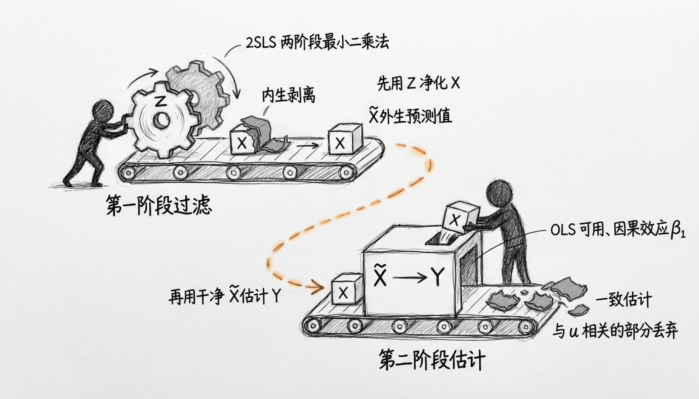

# 第8章 工具变量模型

> “登高而招，臂非加长也，而见者远；顺风而呼，声非加疾也，而闻者彰。君子生非异也，善假于物也。”
> 
> ——《荀子·劝学》

经济研究经常需要区分条件相关与因果效应。例如，教育与收入、研发投入与企业绩效、政策干预与居民健康之间都可能存在选择、遗漏因素或反向因果。政策建议需要与研究设计能够支持的因果结论相匹配。

上一章中，我们学习了面板数据模型，知道如何利用横截面和时间维度的信息吸收某些个体差异。然而，即便使用固定效应或随机效应模型，内生性问题仍可能存在。当解释变量与误差项相关时，OLS或面板模型的估计可能出现偏误。例如，如果高能力个体倾向于接受更多教育，而能力无法被完全观测，那么教育系数可能同时包含能力差异的影响；企业的研发投入也可能影响盈利能力，同时又受到盈利能力的反向影响。现实研究中，这些问题很常见，不能只靠换一种回归命令解决。

工具变量（Instrumental Variables, IV）方法利用一个能推动内生解释变量的外部变量来构造识别。有效工具需要满足相关性和外生性两项核心假设；存在处理效应异质性时，解释IV估计通常还要讨论单调性和识别对象。只有这些假设可信，IV才能识别相应的因果参数。

本章将从工具变量的基本概念入手，解释内生性问题与两阶段最小二乘法（2SLS），并讨论第一阶段强度、排除限制和过度识别检验。统计检验不能确保工具可靠，外生性主要依靠制度背景和反事实逻辑论证。最后的实践使用完全生成的数据，只用于理解估计量和诊断流程。

通过本章的学习，我们将理解面对内生性挑战时如何“善假于物”：寻找能够推动处理变量变化的外部来源，并逐项说明相关性和外生性为何可信。工具变量不是从数据中自动挖出因果效应的装置；识别结论取决于研究设计、假设与制度背景是否相互吻合。

## 8.1 工具变量模型的基本思想

在上一章中，我们学习了面板数据模型。面板数据既记录个体之间的差异，也记录同一个体随时间的变化。例如，企业文化、地理位置和长期管理传统等难以量化的特质，可能同时影响研发投入与绩效。固定效应模型通过组内变换吸收观察期内不变的企业特质，主要利用企业内部的时间变化来估计R&D与绩效的条件关系。这样可以减少不变特征造成的一类混杂，但不能处理随时间变化的遗漏因素。

虽然面板数据方法已经让我们走出了一大步，但它并非万能。面板数据主要解决的是“不随时间变化的遗漏变量”问题，但现实中的内生性来源远不止这一种。如第5章模型设定部分所介绍，在实践中，至少有以下三种常见的内生性来源：

遗漏变量。即使控制了个体固定特质，仍可能存在一些随时间变化但难以观测的因素。比如，宏观经济景气、行业技术变革、竞争格局变化等，这些因素既会影响企业的研发决策，也会影响其绩效。如果我们无法完全控制这些变量，R&D的估计系数仍会受到干扰。

反向因果。在我们的例子中，企业绩效不仅可能受到研发投入的影响，也可能反过来影响研发决策——绩效好的企业更有资金和动力投入更多研发。此时，解释变量（R&D）和被解释变量（绩效）之间存在双向因果关系，用普通最小二乘法（OLS）或固定效应模型估计都会得到偏误。

测量误差。企业的研发投入数据往往来自报表或调查，有时统计口径不一、填报不准确，造成测量误差。若误差存在于解释变量中，同样会导致系数估计出现系统性偏差。

因此，即便我们利用了面板数据、差分掉了不随时间变化的干扰项、引入了时间虚拟变量，仍然无法完全根除内生性问题。直观地说，内生性问题的本质是：我们用来解释的变量“太聪明了”。它不仅受我们感兴趣的机制影响，还混入了其他渠道的影响，使得它和误差项产生了联系。而OLS的一个基本假设就是解释变量与误差项不相关。内生性破坏了OLS的核心假设，使解释变量与误差项相关，从而产生偏误和不可靠的估计。

工具变量的核心思路是只利用解释变量中由工具推动的变异。能否把这部分变异称为外生，不由第一阶段预测自动保证，而取决于外生性假设是否成立。

工具变量法的基本思想可以用一句话概括：

“当解释变量被污染时，寻找一个外生的变量，利用它来提取解释变量中干净的部分。”

我们把这个外生变量称为工具变量。它的作用更像一个“外部支点”：只利用解释变量中由工具推动的那部分变化。回到企业的例子，如果绩效好也会促使更多研发投入，普通回归就会混入反向因果。地区研发政策可以是候选工具，但必须同时满足两项关键条件：它能改变研发投入；并且除研发投入之外，没有其他影响企业绩效的渠道。第二项通常无法由统计检验直接证明，需要结合制度背景逐条排查。只有这些识别假设可信时，IV估计才具有相应的因果解释。

工具变量法并不限于面板数据，也不是内生性出现时唯一可靠的选择。最近大学距离、教育政策、广告价格等都只能算候选工具：它们可能通过地区发展、家庭选址、市场需求等其他渠道直接影响结果。每个候选工具都必须分别论证相关性和外生性；若要解释LATE，还需讨论单调性等附加条件。

进一步要直观理解工具变量法，可以从两个阶段来思考。

第一阶段：提取外生部分。

在这一阶段，用工具变量和所有外生控制变量预测内生变量。例如，用研发补贴资格$Z$预测企业研发投入$X$。预测值$\widehat{X}$是工具和控制变量对$X$的线性投影；只有补贴资格满足外生性时，由工具提供的那部分变异才能用于因果识别。

第二阶段：使用第一阶段投影进行2SLS估计。

第二阶段用$\widehat{X}$解释企业绩效$Y$。若工具满足相关性和外生性，2SLS估计量才具有相应的一致性。实际计算应使用完整2SLS命令，以得到正确的标准误。

换句话说，工具变量法并没有直接修正OLS，而是绕了一条弯路：它先用工具所推动的那部分解释变量变化，再在假设成立时识别因果关系。假设你想知道喝咖啡对工作效率的影响，但工作效率高的人可能本身就更容易喝咖啡（反向因果）。这样，我们无法分辨到底是咖啡提升了效率，还是高效率的人喜欢喝咖啡。如果某些部门因为靠近咖啡机而更容易喝到咖啡，距离便可能提供一部分与咖啡摄入相关的变化。不过，只有在办公位置不通过部门分工、交流环境等其他路径影响效率，并且与影响效率的未观测因素无系统关系时，这一比较才可用于识别咖啡摄入的相应因果效应。这个例子也说明：工具容易提出，外生性往往很难令人信服。

基于这一逻辑，工具变量必须满足两个要求：

第一，相关性假设（Relevance）：工具变量必须在控制其他外生变量后对内生变量X提供足够的额外解释力。弱工具意味着第一阶段拟合主要由控制变量和噪声构成，IV估计会不稳定并出现严重有限样本偏误。父母受教育年限通常还会通过家庭资源、社会网络等渠道影响子女收入，因此一般不能仅因其能预测教育就把它当作有效工具。

第二，外生性。外生性包含两层要求：工具与影响潜在结果的未观测因素无系统关系；工具也不能绕过内生处理直接影响结果。前者在线性结构式中常写为$\operatorname{Cov}(Z,u)=0$，后者通常称为排除限制。本书为了便于初学者建立方法地图，将它们放在“外生性”这一核心标签下，但在具体研究中仍要分别论证。

在企业研究中，工具变量的逻辑完全类似：借助影响企业行为的外部冲击，提取解释变量中的外生变化。它不是把内生性“一键清除”，也不是寻找解释变量的普通代理变量。研究者必须说明工具为何影响处理、为何不直接影响结果，以及估计对应哪一类对象的局部效应。即使尚未学习两阶段最小二乘法的计算细节，也应先掌握这套识别逻辑。

> 专栏8-1 工具变量的历史渊源与思想背景
>
> 工具变量思想在20世纪初的供求关系与联立方程识别问题中逐步形成，早期典型应用并不是教育—收入回归。经济学家需要用需求曲线和供给曲线之外的外生变动来识别价格与数量关系，这构成了工具变量思路的重要来源。
>
> 工具变量思想早期用于联立方程中的供求识别。它的核心不是寻找X的代理变量，而是寻找能够推动X、同时不通过其他路径影响Y的外生变动。历史名称不是判断工具有效性的依据；任何具体工具都必须接受同样的排除限制审查。尤其是父母教育或出生年份，它们可能通过家庭资源、健康和宏观环境直接关联成年收入，不能被默认视为外生。
>
> 工具变量常被比作一个“外部支点”：它利用由工具推动的那部分解释变量变动，而不是解释变量的全部变动。这个比喻有助于理解估计思路，但支点是否可信仍取决于相关性、外生性以及目标参数所需的其他条件；候选工具不会自动把内生性中的干扰部分剥离干净。
>
> 工具变量思想也被用于政治学、医学和公共卫生等领域，例如把制度差异、随机鼓励或某些遗传变异作为候选工具。跨领域应用并不降低识别要求：研究者仍需说明工具影响处理的路径、排除其他结果路径，并界定估计所对应的人群。
>
> 理解这一历史脉络，有助于掌握工具变量的基本问题意识：当解释变量内生时，应寻找有制度依据的外生变动，同时审慎论证这种变动为何没有绕过处理变量影响结果。

## 8.2 两阶段最小二乘法

在上一节中，我们讲述了工具变量（IV）的基本概念及其解决内生性问题的逻辑。在实际应用中，仅理解原理还不够，我们需要具体方法来实现工具变量估计。两阶段最小二乘法（Two-Stage Least Squares, 2SLS）就是实现工具变量估计的标准方法。本节将从计量原理出发，解释2SLS如何解决内生性问题，并重点分析工具变量的两个核心假设——相关性假设和外生性假设。

首先，回顾内生性问题的来源。当解释变量$X$与误差项$u$相关，即$\operatorname{Cov}(X,u)\neq0$时，直接用普通最小二乘法（OLS）回归$Y$对$X$会导致估计量有偏，具体偏差为：

$$\widehat{\beta}_1^{\mathrm{OLS}}
=\frac{\operatorname{Cov}(X,Y)}{\operatorname{Var}(X)}
=\beta_1+\frac{\operatorname{Cov}(X,u)}{\operatorname{Var}(X)}$$

这意味着OLS估计量不能一致估计$X$对$Y$的结构系数。为了解决这一问题，我们引入工具变量$Z$，用它所推动的$X$变动识别目标参数。

工具变量方法能够成功的关键在于两个假设：

**第一，相关性。** 在控制模型中的其他外生变量后，工具变量$Z$必须能够推动内生解释变量$X$发生足够变化。若工具几乎不能解释$X$，2SLS就会面临弱工具变量问题，估计可能非常不稳定。

**第二，外生性。** 工具变量$Z$必须与结构误差项$u$不相关。直观上，这要求同时排查两件事：一是$Z$不能与影响$Y$的未观测因素共同决定；二是$Z$不能绕过$X$，通过其他路径影响$Y$。后者也常称为排除限制。为了便于入门，本书把这些要求统一归入“外生性”这一核心假设。

在满足上述两个假设后，2SLS的操作逻辑如下：

为简化记号，先写出单个内生变量、单个工具且暂不显示额外外生控制变量的情形。第一阶段用工具变量$Z$预测内生解释变量$X$：

$$X = \pi_{0} + \pi_{1}Z + v$$

这里的预测值 $\widehat{X} = \pi_{0} + \pi_{1}Z$代表X中由工具变量和所有外生控制变量线性预测的部分。只有当工具变量满足外生性时，这部分变动才可用于因果识别；预测值本身并不会因为来自第一阶段就自动变得干净。

第二阶段以$Y$为被解释变量，并使用第一阶段预测值$\widehat{X}$表示2SLS的投影逻辑：

$$Y = \beta_{0} + \beta_{1}\widehat{X} + u^{*}$$

若工具满足相关性和外生性，$\widehat{X}$所利用的工具变异才与结构误差正交，此时：

$$\widehat{\beta}_1^{\mathrm{2SLS}}
=\frac{\operatorname{Cov}(\widehat{X},Y)}
{\operatorname{Var}(\widehat{X})}
\xrightarrow{p}\beta_1$$

2SLS只利用由工具所推动的X变动。若相关性、外生性以及模型设定成立，它可以一致估计相应的因果参数；若工具无效，2SLS可能比OLS更糟。实操时应直接使用2SLS命令：手工跑两次OLS虽然能复现点估计，但第二步的普通OLS标准误没有计入第一阶段估计的不确定性。

为了加深理解，可以设想一项制度把部分人获得某项培训的概率提高，但制度本身不直接改变其后续工资，也不与其他工资决定因素相关。该制度才可能作为培训参与的工具。真实研究中，这些条件必须根据实施规则逐项论证，不能仅因政策发生在外部就默认成立。

工具变量需要满足相关性和外生性两个核心假设。相关性要求工具$Z$能够推动内生变量$X$发生足够变化；外生性要求$Z$与结构误差不相关，通常需要从“是否与未观测结果决定因素共同变化”和“是否存在绕过$X$影响$Y$的其他路径”两个方面论证。在异质处理效应框架下，解释LATE通常还需单调性等附加条件。第一阶段可以评估工具强度，过度识别检验能发现部分联合不相容，但外生性通常不能由样本统计检验证明，必须结合制度背景和因果路径论证。

两阶段写法帮助理解2SLS的投影逻辑，但软件估计和推断应作为一个整体完成。工具变量不是通用净化器；可信度首先来自研究设计，其次才是计算和检验。

## 8.3 工具变量估计检验

工具变量必须与内生解释变量相关，并满足外生性。第一阶段可以直接评估相关性和弱识别风险，但外生性涉及不可观测误差与反事实路径，通常不能被数据单独验证。过度识别检验只能检查一组联合约束是否与数据明显冲突，不能给每个工具颁发“有效证书”。因此，本节的目标是学会统计诊断能回答什么、不能回答什么，并把诊断结果与制度论证结合起来。

### 8.3a 相关性检验（防止弱工具变量）

相关性诊断关注被排除工具在控制其他变量后是否对X提供足够的额外预测力。工具很弱时，$\widehat{X}$通常与原始X相差很大且主要反映控制变量，IV估计会方差很大、有限样本偏误严重，甚至比OLS更不可靠。

在实践中，通常通过第一阶段回归进行检验：

$$X = \pi_{0} + \pi_{1}Z$$

对于单个内生变量，可报告被排除工具的偏F统计量和部分 $R^{2}$。常说的“F>10”只是特定同方差设定下的粗略预警线，不是强工具认证；存在异方差、聚类、多内生变量或多工具时，应使用相应的稳健弱识别诊断，并结合工具数量和期望偏误判断。盲目增加弱工具还可能使有限样本表现恶化。

### 8.3b 过度识别检验及其边界

在讨论过度识别检验之前，先看恰好识别（Exactly Identified）的情形：内生变量数量$K$与工具变量数量$L$相等，例如用一个工具$Z$识别一个内生变量$X$。此时没有多余矩条件，因而不能利用过度识别检验检查内部一致性；工具外生性的主要依据仍是理论、制度细节和因果路径。研究者可以考察工具与处理的第一阶段、预定变量平衡、安慰剂结果、可能的直接路径及敏感性，但这些检查只能发现部分矛盾，不能证明排除限制。若唯一工具实际无效，2SLS通常不能一致估计目标参数，而样本内也不存在一项能够单独认证该工具外生性的统计检验。

拥有多个有理论依据的工具时，模型可能处于过度识别（Overidentified）状态，从而可以检验一组矩条件是否彼此相容。但不能为了获得检验而机械增加工具：更多无效或微弱的工具可能使估计和检验表现更差。

过度识别检验利用的是模型中多出的矩条件：若有$K$个内生变量和$L>K$个工具，就存在$L-K$条可用于检查内部一致性的约束。在线性常系数模型和相应原假设下，这些约束应与数据相容。需要注意，处理效应存在异质性时，不同工具可能影响不同人群并识别不同的局部效应，估计差异不一定只来自工具无效；因此检验结果必须结合目标参数和模型结构解释。

过度识别检验常用Sargan统计量或Hansen J统计量。经典Sargan检验依赖同方差条件；Hansen J允许更一般的异方差稳健推断。它们检验的是整组额外矩条件，而不是逐个鉴定哪个工具外生。

检验的结果解释直接决定了我们对2SLS估计结果的信心：

若$p$值较高，我们只能说数据没有显示过度识别约束的明显冲突。检验功效可能不足，而且它的解释依赖于至少有足够有效工具、模型设定正确等前提，因此不能据此证明所有工具外生。若$p$值较低，则说明至少某些工具或模型约束与数据不相容，需要回到制度机制与模型设定重新排查。

若检验$p$值较低，说明整组矩条件与数据不相容。原因可能是一个或多个工具无效，也可能是结构模型设定错误，或不同工具在处理效应异质性下识别了不同参数。检验不能指出具体哪一个工具有问题，也不能把原因唯一归为工具内生。

过度识别检验不是有效工具的必要条件，因为恰好识别模型根本无法进行该检验；它也不是充分条件，因为不拒绝不能证明工具外生。检验结果必须与制度机制、模型设定和弱识别诊断一起解释。

### 8.3c 检验效果与现实应用

这些诊断提供的是不同层面的有限证据：第一阶段衡量工具对内生变量的增量预测力；弱识别诊断评估这部分变异是否足以支持稳定推断；过度识别检验检查额外矩条件是否彼此相容。任何一个检验都不能单独确认工具外生，也不能替代对共同原因和其他影响路径的制度论证。

因此，报告IV结果时，应把统计诊断与因果路径放在同一张证据表中：工具为什么改变处理变量，可能通过哪些其他渠道影响结果，政策或历史变量为何近似外生，估计针对哪个人群。检验未拒绝只能说明没有发现特定冲突；一旦存在无法排除的直接路径，就应收窄结论或更换识别设计。

## 8.4 如何寻找工具变量

寻找工具变量的首要逻辑并不复杂，但需要严谨的因果思维：你要问的是两类互相关联的问题——哪些外部力量会改变你关心的“处理”或解释变量，而这些力量是否能被合理地认为不会通过其他渠道直接影响结果变量。把问题分成这两步非常重要。第一步是识别潜在的“驱动器”：是什么在数据或制度上导致解释变量发生变化？第二步是论证这些驱动器本身是否与结果变量的未观测成分无关，也就是说它们的影响路径是否仅通过解释变量单向传导。只有把这两步都想通了，工具变量才可能是有用的。

在经验研究中，一个好的工具变量往往基于对制度背景或自然冲击的深刻理解，而不是机械地从数据中试出来的相关性。我们应首先回到经济学理论或制度细节，明确因果链条：解释变量是如何决定的？是否存在政策、地理或历史因素会以相对外生的方式推动解释变量？把这些制度性或自然发生的差异作为候选工具，往往比依赖纯粹的统计筛选更可靠，因为外生性必须有经济学或历史的理由来支撑。

在某些设计中，工具的外生性是在给定一组处理前协变量后才成立的。但“加入足够多控制变量”不会自动把可疑工具变成有效工具。控制变量必须在因果结构中有明确作用，且不能引入碰撞变量或处理后变量。研究者还要论证控制后工具仍不与未观测结果决定因素系统相关，并且不存在绕过处理变量影响结果的路径。

（1）制度或政策性工具变量

制度或政策冲击是实证研究中常见的一类候选工具。其核心逻辑是：政策或制度变化会影响解释变量，同时没有绕过该变量影响结果的其他路径，也不与结果的未观测决定因素系统相关。这类差异常来自制度变革、资格规则或执行强度，但是否接近随机化需要逐案论证。

制度性工具变量之所以常被采用，是因为政策和制度往往由政府或外部权威制定，其出台和调整具有相对明确的时间节点、适用范围和规则约束。我们可利用这些时间、地区或资格差异构建准自然实验，从而识别解释变量对结果变量的因果效应。然而，制度性工具的有效性仍依赖于其满足两个条件：相关性（relevance）与外生性（exogeneity）。前者要求工具变量能够显著影响内生解释变量；后者要求工具变量与回归方程中的误差项不相关，即不通过其他渠道直接影响结果变量。

政策差异或补贴安排。不同地区、行业或企业群体受到不同政策影响，这些差异可以产生候选工具，但由政府规定并不等于外生。例如，研发补贴可能直接缓解企业融资约束、带来声誉效应，也可能优先配置给更有潜力的企业；这些可能的直接路径和共同原因都会威胁外生性。因此，研究者必须分别说明：资格规则为什么会改变研发投入，以及它为什么不会绕过研发投入直接影响企业绩效。若资格由明确门槛决定，还应首先考虑断点设计是否比把资格简单当作工具更贴合制度。

制度改革或时间冲击。制度改革具有明确时间和适用范围，常能显著改变内生解释变量，但全国统一推动、时间明确或政策前趋势相近，都不能自动保证工具外生。改革可能同时改变税负、融资、预期或监管环境，从而通过多条路径影响结果变量。趋势图、安慰剂和虚假时点检验只能发现部分异常，不能验证排除限制；外生性仍要依靠制度背景、因果路径和反事实分析来论证。

政策执行强度差异。即便政策在全国范围内统一出台，不同地区在执行力度、资源配置或监督频次上仍可能存在显著差异。这种地方执行强度的差异，也可为我们提供可利用的工具变量。例如，在研究环境监管对企业投资或排放的影响时，可以利用各地环保检查频次、罚款金额或执法预算的差异，作为企业所面临监管压力的外生变动。此类工具变量的相关性来自执行力度的直接影响：执法越严，企业越可能被迫调整生产行为或增加相关投入。其外生性则依赖于执行强度的决定机制。如果执行强度主要由上级部门的行政指令、中央派驻督察或预算分配所驱动，而非由地方经济状况或企业表现决定，则较有理由认为它与企业绩效的误差项不相关。然而，在实际应用中，执行强度往往与地方政府治理能力、经济发展水平或产业结构相关。我们应通过引入地区固定效应、控制地方经济特征或采用上级指令下达的时间差异作为工具，来增强外生性论证。

在使用制度或政策性工具变量时，我们需要系统地论证其合理性。首先，应明确说明该政策为何会影响解释变量（相关性机制），并用第一阶段评估关系强度。其次，要详细分析政策是否可能通过其他渠道直接影响结果变量，或是否存在选择性施行问题，这些都是外生性论证的重点。此外，还需考虑政策执行过程中可能存在的溢出效应。例如，一个地区的政策可能通过产业链、劳动力流动或市场竞争影响邻近地区的经济结果，从而破坏外生性。限定样本范围、加入空间控制变量或开展敏感性分析可以检查部分威胁，但不能单独验证工具有效。

（2）地理与历史性工具

地理与历史性变量之所以常被提出作为候选工具，是因为它们形成较早或位于个体、企业决策之外，并可能影响解释变量。但“形成较早”或“位置外生”并不保证它们不会通过疾病环境、交通、人口迁移、产业布局等路径直接关联当期结果。能否作为工具必须逐案论证，不能把地理或历史属性本身视为外生性证明。

与制度或政策类工具相比，地理和历史性工具的显著特征是跨时间的稳定性与外生性。地理条件、气候环境或历史制度往往早于研究时期形成，且在短期内难以被个体或企业行为所改变。这种时间上的先在性使其具备较强的外生性基础。然而，这类工具的主要挑战在于：它们可能通过多条渠道间接影响结果变量，因此我们需要谨慎识别其作用路径，并通过严密的论证和实证检验来排除其他可能的影响机制。

地理差异类工具变量。自然地理条件是构建外生工具的经典来源。气候、地形、海拔、降雨量、交通便利度、港口或市场的距离等地理特征，往往在长期内保持稳定，不会受到个体决策或短期经济波动的影响。这些特征能够影响企业、农户或地区的经济行为，从而满足工具变量的相关性条件。例如，在研究企业创新投入时，企业与科研机构之间的地理距离会影响技术合作和知识溢出的机会。距离较近的企业更容易与高校、研究所建立合作关系，从而提高研发投入水平；而这种地理距离通常由历史布局决定，不太可能直接影响企业的当期绩效。类似地，在农业经济学研究中，降雨量、土壤肥力或地形坡度常被用于解释农户生产投入或种植结构的差异，其影响途径主要通过自然生产条件而非直接作用于收入水平。

然而，地理变量也可能与未观测到的区域特征（如地方政府效率、文化传统或基础设施水平）相关，从而破坏外生性。为增强论证的可信度，我们通常采取以下策略：一是在模型中加入地区固定效应或地理控制变量，隔离其他区域性因素；二是使用地理特征的潜在变异部分（例如历史地形与现代经济的交互项）；三是检验地理变量是否在理论上或数据上直接影响结果变量，若无显著相关，则支持其外生性假设。

历史事件、制度安排或基础设施布局常被用作候选工具，因为它们早于当前个体决策形成。但“发生得早”不等于满足排除限制。Acemoglu、Johnson和Robinson（2001）使用殖民时期定居者死亡率作为制度质量的工具，是一个影响深远且持续受到讨论的设计：死亡环境也可能通过疾病生态、人力资本等渠道关联当代发展。历史铁路同样可能通过城市化、人口和产业布局直接影响今天的结果。教材应把这些例子呈现为需要评估的识别设计，而不是已经证明外生的事实。

当然，历史性工具变量的使用也面临挑战。其主要问题在于历史因素可能通过多条渠道间接影响结果变量。例如，早期铁路布局既可能促进工业化，也可能影响教育水平、人口流动或城市化率，从而间接影响当前经济绩效。因此，我们应明确界定工具的作用路径，避免将“历史影响”的总效应误认为是单一经济机制的结果。

地理—历史交互类工具变量。为增强工具变量的解释力和外生变异，学者们常将地理与历史因素结合，构造交互式工具变量。这类工具通过捕捉不同地区在地理条件与历史制度下的差异化响应，为因果识别提供了更多外生信息。例如，我们可以将历史铁路布局与现代产业分布相交互，用以预测各地区的基础设施投资或经济活动强度。该设计基于这样的逻辑：历史铁路的存在反映了地理通达性与早期经济潜力，而其与现代产业格局的匹配情况决定了当下的交通投资需求。由于历史铁路的形成早于现代经济行为，且地理条件相对固定，这种交互项能够提供与当前经济结果无直接关系的外生变动。类似的思路还可见于将历史传教士分布与现代教育政策覆盖率结合，或将殖民制度遗产与地理气候特征结合的研究中。这类地理—历史交互工具常被用于解释地区发展差异、文化影响或制度遗产的长期效应。其优点在于丰富了可识别的外生信息，但也提高了对排除限制的要求。我们必须论证该交互变量不会通过其他机制直接影响结果变量，例如历史铁路本身带来的长期城市化效应或人口集聚。

地理与历史变量的优势是先于当前行为发生、资料有时较完整，但发生得早并不等于外生性强。铁路、港口、气候或历史制度往往通过人口、城市化、文化和产业结构等多条路径影响今天的结果，排除限制尤其难论证。这类工具变化较少时还可能面临弱识别。增加工具或构造交互项也不会自动解决问题，反而可能引入更多排除限制；每一条路径都需要单独说明。

（3）滞后或邻近变量

滞后或邻近变量常被提出作为候选工具。在缺少明确制度或自然冲击时，时间序列和地理网络中的变异确实可能提供预测力。但“能预测”只关乎相关性；这些变量是否与当期误差项无关、是否不会通过其他路径影响结果，仍需要额外假设和制度论证。

时间顺序可以排除“当期结果改变过去变量”这一条反向路径，却不能排除持久性冲击或未观测因素；空间距离也不会自动带来外生性，因为相邻地区可能面临共同冲击或存在溢出。因此，滞后和邻近变量在动态面板、区域经济学等领域虽常见，但不是随手可用的“现成工具”。

时间滞后变量。动态面板方法常利用变量的滞后值构造工具，但可用的滞后阶数取决于误差的序列相关结构和具体的预定性或内生性假设。例如，研发投入与企业绩效可能双向作用，过去的研发投入也可能受长期战略或持久冲击影响，因而不会仅因“滞后”就自动外生。Arellano和Bond（1991）的动态面板GMM是在明确矩条件下使用合适滞后值作为工具，并需要检查误差序列相关和工具数量等问题。

如果我们要研究一个人的储蓄行为是否受收入水平影响，当期储蓄和当期收入可能双向作用。上期收入可以作为当期收入的候选工具，但时间上发生得更早并不保证外生性；收入持续性、持久能力或误差序列相关都可能使滞后收入与当期误差相关。因此，必须结合具体动态模型的矩条件、自相关检验和制度背景论证滞后工具的有效性，而不能仅凭时间先后顺序判断。

空间或邻近效应变量。邻近地区的政策或市场状况有时能够预测本地区的解释变量，因此可被列为候选工具。例如，邻近地区的研发补贴可能通过竞争、人才流动或产业联系影响本地企业的研发投入。但同样的竞争、人才流动和产业联系也可能直接改变本地创新产出，这恰恰会违反排除限制。共同的区域冲击还可能使邻近变量与本地误差项相关。因此，空间工具必须结合明确的作用半径、网络结构和溢出路径论证；空间自相关检验、距离加权或固定效应只能提供部分诊断与控制，不能自动保证外生性。

滞后与邻近变量数据方便，却尤其容易被误当成现成工具。时间先后只能排除当前结果改变过去，不能排除持久遗漏因素同时影响过去的解释变量和当前结果；空间距离也不能排除共同冲击、贸易、迁移或产业链溢出。自相关检验、空间相关检验、第一阶段和过度识别检验可以提供诊断信息，但都不能确保外生性。使用这类工具时，应先画出完整因果路径，再说明为什么选定的滞后阶数或邻近范围满足外生性，包括不与未观测结果决定因素共同变化、不存在绕过内生变量的直接路径。

（4）结构性或生成性工具变量

在工具变量研究中，除地理、历史或滞后类工具外，还有一类重要的工具变量来源于理论建模或数据构造，被称为结构性或生成性工具。这类工具的核心思想在于：我们不依赖于自然界中现成的外生差异，而是依据经济理论或统计模型，从解释变量中提取出“外生部分”，以此构造能够满足外生性假设的变量。换言之，结构性工具的外生性来源于模型设定与理论推导，而非客观存在的地理或时间差异。这种方法在复杂的经济机制研究中具有独特优势，尤其适用于直接寻找外生冲击困难的情形。

预测或拟合变量。其基本做法是利用制度性信息构造能预测内生变量的工具。Angrist和Krueger（1991）利用出生季度与入学年龄规则、义务教育离校年龄之间的联合作用，为受教育年限提供工具变动。关键不是预测得准本身，而是这些制度性变动是否只通过教育影响工资。单纯由机器学习或经济预测模型生成的拟合值不会自动外生；若输入变量与结构误差相关，拟合值同样可能无效。

移位—份额（shift-share）工具。其逻辑是将一个外部冲击与一个相对固定的权重相结合，以此生成局部层面的外生变异。Bartik（1991）的地方劳动市场研究奠定了这一方法的基础。他将全国行业就业增长（外部冲击）与地方初始行业份额（固定权重）相乘，构造出地方层面的就业预测变量。由于全国行业需求变动通常被视为外生，而初始产业结构在短期内基本稳定，这一乘积项可以作为地方经济变化的外生预测值。此类方法后来广泛用于分析全球化、自动化和贸易冲击等问题，成为区域经济学与劳动经济学中的标准识别策略。尽管如此，我们仍需谨慎论证外部冲击是否会通过其他渠道直接影响结果变量，否则其外生性假设将受到质疑。

理论模型推导生成结构性工具。例如，在投资与现金流关系研究中，投资决策往往同时受到融资约束和内部资金状况的影响，导致二者存在内生相关。为了识别投资对绩效的因果效应，可以利用资本回报率的外生预测部分作为工具变量，因为这部分变化来源于市场或行业层面的外部因素，而非企业自身的经营状况。同样，在宏观经济研究中，学者常通过动态随机一般均衡（DSGE）模型推导出外生冲击项，如技术进步或政策扰动，并据此生成结构性工具。这类方法的优点在于，识别机制来源于理论模型本身，逻辑自洽且解释路径清晰；但缺点也十分明显，即结果高度依赖于模型假设，一旦理论设定不当，工具的外生性与识别有效性便难以保证。

总体而言，结构性或生成性工具可以把经济理论中的限制转化为识别所需的变异，适用于缺少直接自然实验的研究场景。其可信度取决于模型设定和理论限制。研究者必须说明工具的构造逻辑、与未观测结果决定因素无系统关联的理由，以及可能的直接路径，并用针对性检查考察部分可观测含义。替代工具若依赖相同假设，并不能相互验证；没有任何一组稳健性检验可以单独证明外生性。

不同来源的候选工具各有风险：制度或政策变量可能伴随其他改革，地理与历史变量可能通过多条长期路径影响结果，滞后或邻近变量可能受到序列相关和空间溢出影响，结构性工具则依赖额外理论限制。研究者应分别说明相关性与外生性，并在外生性论证中排查共同原因和绕过内生变量的其他影响路径，同时报告与识别强度相匹配的推断。第一阶段和过度识别检验只能提供部分诊断，不能确保工具有效。

> 专栏8-2 如何找到好的工具变量？
>
> 当解释变量与误差项相关时，OLS通常不能识别目标因果效应。工具变量方法尝试利用一个候选工具所推动的解释变量变化进行估计。这个思路是否可信，不取决于工具名称听起来是否“外生”，而取决于相关性和外生性是否有充分依据。
>
> 一个候选工具至少要满足两项核心假设：有足够的第一阶段相关性，并满足外生性。论证外生性时，实质上仍要分别讨论：工具是否与未观测结果决定因素共同变化，以及它是否存在绕过处理变量影响结果的直接路径。后者通常称为排除限制。只有与目标参数相应的全部识别条件可信时，IV系数才有因果含义。
>
> 一个经典例子来自Angrist和Krueger（1991）。在当时美国许多地区，入学年龄规则与最低离校年龄共同作用：年初出生者通常以稍大年龄入学，达到法定离校年龄时可能完成更少学年。出生季度因此能够预测部分人的受教育年限。排除限制仍需讨论，例如出生季节是否与家庭背景或健康相关；它不是不证自明的事实。
>
> 另一个经典例子是Angrist（1990）使用越战时期征兵抽签号码作为服役经历的工具，研究服役对长期收入的影响。抽签的随机性为外生性提供了重要制度依据，但其他直接路径、服从行为和样本范围仍需说明。该研究不是Card和Krueger的军事服役研究。
>
> 工具变量是否合适不能只靠统计检验。即使第一阶段较强，仍要用可核验的制度事实和因果路径论证外生性。这不是寻找一个听起来顺畅的“故事”，而是主动列出可能的直接路径和共同原因，并用资料或附加分析排查。出生季度影响教育年限的机制较清楚，但它是否还关联家庭背景、季节性健康或其他工资决定因素，或者是否存在绕过教育的直接路径，仍是需要讨论的识别问题。
>
> 在实际研究中，不能只讲一个顺耳的故事，而要列出可核验的识别链条：工具如何改变处理、可能有哪些直接路径、工具与哪些前定特征相关、谁会因工具而改变处理状态。存在处理效应异质性时，常规IV在外生性和单调性等条件下识别的是受工具影响的服从者的局部平均处理效应（LATE），不一定是所有人的平均处理效应。

## 8.5 案例实践：工具变量与内生性处理

【案例背景】

在前四节中，我们学习了工具变量的基本思想、两阶段最小二乘法（2SLS）的操作逻辑、工具变量的检验方法（相关性检验和过度识别检验），以及现实研究中寻找工具变量的四类常见思路。这些内容听起来各有侧重，但在真实研究中，面对一份可能存在内生性的数据，你需要在一个问题上依次完成：怀疑内生性 → 找工具 → 检验工具 → 用工具估计 → 验证结果的可靠性。

本案例以完全生成的截面企业数据为基础——500家虚构企业的研发投入（R&D）、净资产收益率（ROE）、科研资源密度和高校数量。数据中人为设定了一个不可观测的企业能力变量（ability），它同时影响R&D和ROE。这里的科研资源密度和高校数量在DGP中被强制设为外生工具；现实中它们很可能直接影响企业绩效，不能照搬。模拟结果不构成关于真实企业研发回报的证据。

【案例要解决的问题】

本案例要回答四个问题。

第一，如果忽略内生性，直接用OLS估计R&D对ROE的影响，系数会如何偏误？偏误的方向和大小说明了什么？

第二，工具变量（科研资源密度）在第一阶段有多强？偏F统计量和部分$R^2$是多少？如果换成一个弱工具（纯噪声），2SLS为何会变得不稳定，甚至比OLS更不可靠？“F>10”为什么只能作为粗略参照？

第三，当我们有两个工具变量时（科研资源密度 + 高校数量），模型从恰好识别变为过度识别。过度识别检验能检验什么、不能证明什么？同方差Sargan检验与异方差稳健Hansen J检验应如何选择？

第四，Durbin-Wu-Hausman检验是否正式确认了R&D的内生性？如果检验结果与理论预期不一致（如p>0.05），我们应该如何处理——直接改用OLS，还是坚持报告IV结果？

【AI Agent工作流准备】

先建立`chapter08_project/`并写一份“识别清单”：分别列出内生变量、工具变量、外生控制、目标参数，以及支持或威胁相关性、独立性和排除限制的证据。再预测OLS与IV系数可能怎样不同。识别清单必须先由你完成，不能让Agent从空白开始替你证明工具有效。

让Agent只读查看本节、任务卡、识别清单和脚本，先画出变量在OLS、第一阶段与第二阶段中的位置，并专门寻找违反外生性的路径。确认后运行配套脚本，保存OLS/IV比较、第一阶段、弱识别诊断、过度识别和DWH检验输出。Agent可以检查代码和证据缺口，但制度事实必须回到可核验来源，检验不拒绝也不能写成“工具已经外生”。

> **AI Agent工作流提示**
> 1. 先核对内生变量、被排除工具和外生控制的位置，防止2SLS语法写反；
> 2. 第一阶段要保存针对被排除工具的统计量和部分$R^2$，不能误用整条回归的总体F值；
> 3. 只有过度识别时才运行相应检验，并根据误差结构选择适当统计量；
> 4. 要求Agent把“软件能够检查的统计症状”和“需要理论、制度与来源支持的识别假设”分栏保存。
>
> 但以下判断必须由你自己完成：
> 1. OLS和IV的系数差异方向是否与理论预期一致？如果一致，偏误程度是轻微还是严重？
> 2. 第一阶段F统计量远大于10——工具很强。但“强”是否等同于好？外生性问题F统计量能回答吗？
> 3. 过度识别检验的$p$值——你能不能说“因为p>0.05，所以我的工具是外生的”？这句话的问题在哪里？
> 4. 如果两个工具中有一个可能不是完全外生的——你怎么从制度逻辑上论证，而不是依赖$p$值？

【实践任务】

**任务1：OLS与IV的对比——看见内生性偏误。** 先用OLS估计ROE对R&D、企业规模和年龄的回归。再用2SLS，以科研资源密度（ResDensity）作为R&D的工具变量，估计同样的方程。提交一张OLS vs IV的系数对比表，并回答：R&D的系数从OLS到IV发生了什么变化？这个变化的方向是否说明遗漏的“企业能力”与R&D正相关？如果OLS系数反而小于IV，可能的内生性来源是什么（提示：反向因果或测量误差可能导致负偏误）？

**任务2：第一阶段诊断——检测工具变量的强度。** 运行第一阶段回归（R&D对科研资源密度和控制变量），报告工具变量的系数、偏F统计量和部分$R^2$。回答：这些指标显示工具提供了多少额外预测信息？为什么不能把“F大于10”写成工具有效的充分条件？作为对比，用一个纯随机噪声变量充当假工具，重新运行第一阶段，观察弱工具下估计值和置信区间如何变化。

**任务3：多工具变量与过度识别检验。** 在任务1的基础上，加入第二个工具变量——高校数量（University）。提交单IV和双IV的系数对比表，并根据误差设定运行Sargan或Hansen J检验。回答：加入第二个工具后，估计和标准误如何变化？检验拒绝时说明哪些条件可能有问题？不拒绝时为什么不能说“两个工具都已被证明外生”？

**任务4：内生性检验与综合判断。** 运行Durbin-Wu-Hausman内生性检验。提交完整的汇总表（OLS / IV单工具 / IV双工具），并回答：检验是否拒绝R&D外生？若不拒绝，可能是变量确实外生，也可能是工具弱或检验功效不足。最终使用OLS还是IV，应比较两套识别假设的可信度；无效工具会使IV比OLS更差，不能因理论上担心内生性就例行报告IV。

> 📁 配套代码包：
> - Stata：`code/stata/ch08/01_iv_endogeneity.do`
> - Python：`code/python/ch08/01_iv_endogeneity.py`
> - AI Agent任务卡：`code/ai_cards/ch08_ai_task_card.md`
>
> 提交产出：1张OLS vs IV系数对比表 + 第一阶段F统计量 + 1张单IV vs 双IV对比表 + 过度识别检验结果 + DWH检验结果 + 可复现代码 + `ai_log.md`

【结果讨论】

任务1的结果通常显示：OLS中R&D的系数大于IV中的系数。因为这是透明的数据生成练习，我们知道遗漏的企业能力同时与R&D和ROE正相关，所以OLS存在向上偏误；我们也人为设定科研资源密度满足工具变量条件。因此，IV估计应更接近DGP设定值1.2。真实研究中看不到DGP，不能仅凭IV系数更小就断言OLS高估或工具有效。

任务2的第一阶段F统计量应较大，因为DGP把ResDensity对R&D的系数设为0.7。它说明本模拟样本中的第一阶段关系较强。但常见的F>10只是特定简单设定下的经验预警线，不是强工具认证，更不能证明外生性。真实研究还要采用适合异方差、聚类、多工具或多内生变量情形的弱识别诊断，并从制度背景论证排除限制。

任务3中，由于DGP把两个工具都设为外生，过度识别检验的$p$值通常不会很小；某次模拟仍可能因抽样波动而拒绝。检验不拒绝只说明样本没有显示各矩条件之间的明显冲突。多个工具若以相似方式无效，或检验功效不足，也可能不拒绝，因此结果不能认证任何一个工具外生。

任务4的DWH检验在既定DGP下通常会拒绝R&D外生。若某次抽样未拒绝，可能是检验功效不足，也可能反映随机波动。真实研究中，IV不是例行的“稳健性检验”：它依赖一套不同且往往更强的识别假设，只有工具设计可信时才值得报告。

【案例总结】

本章案例将IV分析的标准流程——怀疑内生性 → OLS基准 → 第一阶段诊断 → 2SLS → 过度识别 → DWH检验——完整走了一遍。你可能会发现：同样的变量、同样的样本，仅仅因为是否使用工具变量、使用几个工具变量，核心结论就可能不同。这种差异提醒我们，OLS与IV使用的变异来源不同，有时识别的参数对象也不同；差异还可能来自弱工具、无效工具或抽样误差。因此，不能只因IV与OLS结果不同就断定IV更可信，而要回到第一阶段、外生性论证和目标参数本身。

更重要的是，通过这个案例你应该养成IV分析的肌肉记忆：第一步先跑OLS，明确比较基准；第二步检查第一阶段强度，判断工具是否提供足够的增量变异；第三步用2SLS估计目标参数；第四步把过度识别和DWH检验作为补充诊断，而不是工具有效性的认证。这四个步骤的顺序不是随意的——每一步都有明确的诊断目的。但最关键的能力不在代码层面，而在于：当你面对审稿人或读者的质疑时，你能否用经济学理论和制度细节，而非统计检验的$p$值，来论证“我的工具变量为什么影响R&D但不直接影响ROE”。

> **方法边界：工具变量能做什么、不能做什么**
>
> 有效工具能够从内生解释变量中提取由工具推动的变异，并在相应假设下识别特定总体或服从者的因果参数。第一阶段强度不能证明外生性，过度识别检验不拒绝也不能认证全部工具有效；IV还可能只识别局部效应。可信度最终取决于相关性、外生性、必要时的单调性，以及这些条件与制度背景是否相容。外生性论证仍需具体讨论共同原因和其他影响路径，不能停留在术语层面。

## 本章小结

本章系统介绍了工具变量（IV）方法的核心思想与操作流程。我们首先明确了内生性问题的三大来源——遗漏变量、反向因果和测量误差——以及它们如何破坏OLS的一致估计。工具变量法尝试利用一个与内生解释变量相关、同时满足外生性的变量所推动的变异来识别目标参数；它能否恢复一致估计，取决于工具与研究设计是否真正满足这些假设。

在理论部分，我们详细讲解了两阶段最小二乘法（2SLS）的操作逻辑：第一阶段用工具变量预测内生解释变量，第二阶段利用工具所推动的变异估计目标参数。第一阶段预测值不会自动外生；只有相关性和外生性两个核心假设成立时，这部分变异才能用于因果识别。外生性既要求工具不与结构误差中的未观测因素共同变化，也要求工具不存在绕过内生变量影响结果的其他路径。

我们随后介绍了第一阶段强度诊断与过度识别检验。偏F和部分$R^2$衡量被排除工具的增量预测力；Sargan/Hansen J在过度识别时检验整组矩条件是否相容，但不证明外生性。制度、地理、历史、滞后、邻近和生成式变量都只是候选工具，必须逐项排查直接路径、共同原因、溢出和识别群体。

在实践部分，我们以企业研发投入对ROE的影响为案例，用模拟数据完整演示了从OLS到IV、从第一阶段诊断到过度识别检验、再到DWH内生性检验的完整流程。IV分析的肌肉记忆——OLS基准 → 第一阶段诊断 → 2SLS → 过度识别/DWH——每一步都有明确的诊断目的。

总体而言，工具变量方法的精髓在于借力打力——用一个外部的、可信的支点，撬动隐藏在数据背后的因果效应。选择工具变量的过程，本质上是在用制度知识和经济理论“讲一个因果故事”。统计检验可以提供辅助证据，但最终的说服力来自于你对经济机制和制度背景的深刻理解。

## 思考与练习

**1.** 一位同学用OLS估计教育与收入的关系，系数为0.08；用出生季度作工具的2SLS系数为0.11。他说：“IV更大，所以OLS有偏、IV才对。”请指出问题：（1）OLS与IV可能使用不同变异并识别不同人群，仅凭系数大小能否判断哪一个正确？（2）出生季度若通过健康等渠道直接影响收入，会违反什么假设？无效工具导致的偏误方向还取决于哪些协方差和第一阶段方向，为什么不能只凭“存在健康渠道”断言上偏或下偏？

**2.** 另一位同学在第一阶段回归中发现F统计量为45，于是对你说：“我的工具很强，所以一定是有效的。”请指出他混淆了什么概念：（1）F统计量检验的是工具变量的哪个假设？它不能检验的是哪个假设？（2）如果有一个工具变量与内生变量高度相关（F=80），但它直接影响被解释变量——这个工具有效吗？请用你自己的例子说明高F值不等于有效工具。

**3.** 运行实践任务1的OLS vs IV对比。如果你得到的OLS系数为1.82，IV系数为1.24。（1）偏误方向是什么？用企业能力同时影响R&D和ROE的因果链条解释偏误大小（约0.58）的来源；（2）如果换一批数据，OLS系数为1.05，IV系数为1.28——这个偏误方向是否合理？什么内生性来源可能导致这个方向？（3）在论文中报告时，你会选择OLS还是IV作为主表？如果审稿人要求你证明你的IV是外生的，你准备从哪些方面论证？

**4.** 运行实践任务3的过度识别检验。如果Sargan检验的$p$值为0.41：（1）你能否说“两个工具都是外生的”？如果不能，更准确的表述应该是什么？（2）如果$p$值为0.02——这意味着什么？它告诉了你具体哪一个工具是内生的吗？下一步你应该怎么做？（3）假设你只有一个工具变量（恰好识别），一位同学问“你的工具有多外生？”——为什么你无法用统计检验来回答这个问题？

**5.** 先写出科研资源密度作为R&D工具变量的相关性论证，并列出至少两条可能破坏外生性的路径，再让AI Agent读取你的识别清单和已有来源，专门反驳这套论证。比较后回答：（1）Agent是否只重复“影响R&D但不直接影响ROE”；（2）它是否发现科研资源可能经劳动力质量、基础设施或地方政策直接关联ROE；（3）哪些制度事实已经由原始来源支持，哪些仍只是Agent提出的待核验线索？

**6.** 回顾本章的`ai_log.md`：（1）Agent实际读取和运行了哪些文件？（2）它是否放错内生变量、控制变量或工具变量的位置，或在恰好识别时错误建议过度识别检验？（3）哪些代码和统计诊断可以由Agent协助，哪些关于相关性、外生性和识别对象的判断必须由你依据理论与制度资料完成？

## 拓展阅读

- **工具变量的难点不在两阶段回归，而在三个条件能否讲清楚**。Wooldridge（2020）第15章先介绍IV和2SLS，Angrist与Pischke（2009）第4章再讨论局部平均处理效应。阅读时不要把“工具变量”当成一个神奇的新变量：它必须能改变内生解释变量，与未观察到的干扰因素无关，并且只能通过该解释变量影响结果。为一个候选工具建立三栏证据表，分别写相关性、独立性和排除限制，再标注每项证据来自数据、制度还是理论。只写“已有文献普遍采用”是不够的，因为旧论文常用并不等于在你的样本中成立。
- **出生季度为什么可能影响教育年限？** Angrist与Krueger（1991）利用入学年龄和最低离校年龄规定，使不同季度出生的人能够接受的最低教育年限略有差异，再用这种差异估计教育回报。第一遍只读引言和制度背景，画出“出生季度→受教育年限→工资”的链条；第二遍找第一阶段表格，确认出生季度确实改变教育；第三遍再看作者怎样解释最终估计。这个案例吸引人的地方在于，一个看似与工资无关的出生日期，经过制度规则竟能成为研究设计的一部分。随后查找相关批评，思考出生季节是否还可能通过其他渠道影响工资。
- **征兵抽签提供了更接近随机实验的工具变量案例**。Angrist（1990）研究越战时期的抽签号码怎样改变服役概率，并进一步估计服役对终身收入的影响。阅读引言时先弄清楚：号码是随机分配的，但低号码并不保证每个人都服役，因此抽签号码是工具，实际服役才是处理。再问最终结果适用于谁，答案并不是所有男性，而主要是那些会因抽签号码不同而改变服役状态的人。把它与出生季度研究并排阅读，可以看到IV的可信度来自具体制度和行为反应，不来自第二阶段方程写得多复杂。
- **工具与解释变量关系太弱时，2SLS可能比普通回归更不稳定**。Staiger与Stock（1997）系统讨论弱工具问题，Stock与Yogo（2005）进一步给出常见诊断思路。零基础学生先看模拟图、结论和应用建议，暂时跳过渐近理论。自己生成一个工具变量，并逐步减小它对内生变量的影响，记录第一阶段强度、2SLS估计和置信区间。你会看到估计值可能突然跳动，区间也变得很宽。这个实验能解释为什么论文不能只报告第二阶段的显著系数，而必须展示第一阶段。
- **软件能检查一些症状，却不能检验最重要的排除限制**。Stata的`ivregress 2sls`和`linearmodels`网站中的`IV2SLS`示例可用于学习第一阶段、弱工具、过度识别和内生性诊断。跟着示例运行后，尝试把输出分成两类：软件能够计算的统计证据，以及只能靠制度背景和经济逻辑支持的识别假设。过度识别检验不拒绝，只能说明数据没有发现工具之间明显矛盾，不能“证明所有工具外生”；恰好识别时更没有这类检验可依赖。
