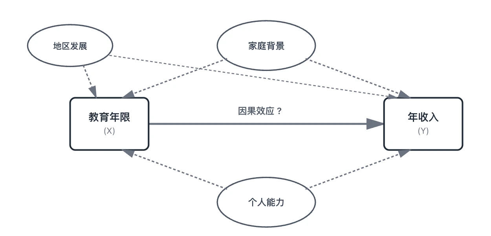
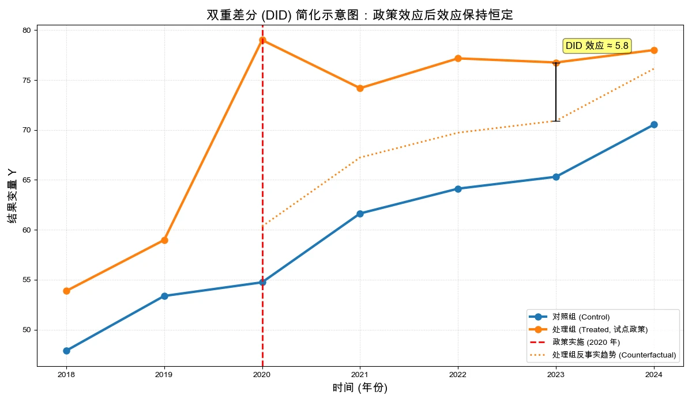
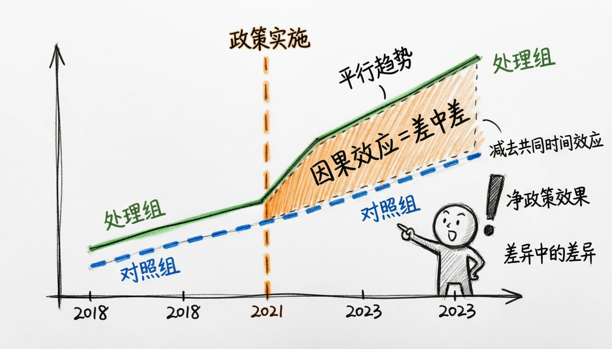
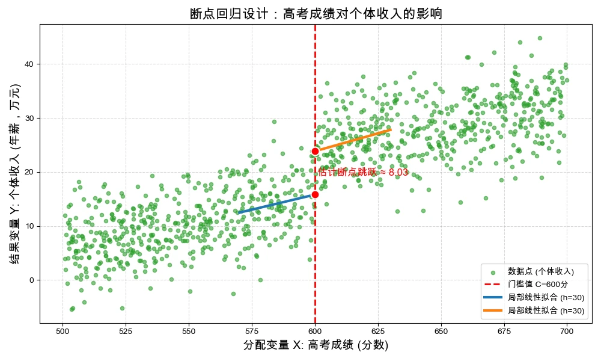
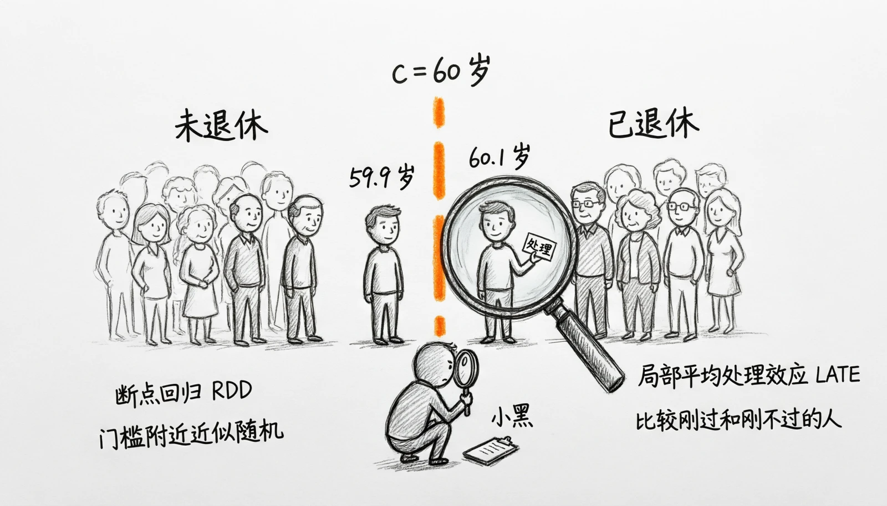

# 第9章 现代因果推断与准实验方法

> “物有本末，事有终始，知所先后，则近道矣。”
> 
> ——《大学》

每年夏天，美国各地的统计数据中都会反复出现一个有趣的规律：冰淇淋的月销量和溺水死亡人数高度正相关。冰淇淋卖得越好的月份，溺水而死的人就越多。

你会据此得出“吃冰淇淋导致溺水”的结论吗？当然不会。任何一个理性的人都能立刻指出：夏天天气炎热，人们既更爱吃冰淇淋，也更爱去游泳——气温这个隐藏的第三变量，同时推高了冰淇淋销量和溺水人数。这个例子听起来滑稽，但它精准地复现了我们在经济学研究中每天都要面对的困境：两个变量一起变化，不等于一个导致了另一个。

承认这一点容易，但在真实数据中不被相关迷惑却极其困难。前面八章，我们学了多元回归控制混杂因素、面板模型消除个体异质性、工具变量寻找外生支点——这些方法的共同目标只有一个：从相关性中剥离出因果关系。然而在现实研究中，即使你控制了所有能观测的变量、用上了固定效应、找到了一个看似不错的工具变量，你仍然常常会面对一个挥之不去的疑问：到底是X导致了Y，还是Y导致了X，还是有某个你根本看不见的Z在同时驱动两者？

过去三十年，经济学经历了一场常被称为“可信性革命”（Credibility Revolution）的方法论变革。2021年经济学奖授予David Card、Joshua Angrist和Guido Imbens三人；Alan Krueger是这一研究传统的重要学者，但不是该奖得主。这场变革的核心洞见是：**因果识别，功夫首先在研究设计中。** 经典双重差分利用组别与时间的交叉变化，断点回归利用制度门槛附近的连续性，随机对照实验则由随机机制分配干预。

首先，我们会用因果图表示变量关系，接着介绍实验与准实验的基本逻辑，然后拆解双重差分和断点回归。正文中的真实研究只用于说明设计思想；章末练习使用完全生成的政策与数据，不应形成任何现实政策结论。

如果说前面八章教会你的是“怎么估计一个关系”，这一章要教会你的是怎么设计一个能识别因果的研究。这是计量经济学思维的一次质变——也是这门学科最让人兴奋的部分。

## 9.1 因果推断与因果图

前几章的多元回归、面板模型和工具变量都可能服务于因果研究，但方法名称本身不产生因果性。多元回归依赖条件外生性，固定效应只能吸收特定的时间不变遗漏因素，工具变量则依赖相关性和外生性。本章进一步把注意力放到研究设计：先明确反事实和识别假设，再选择估计方法。

要系统地理解变量之间的因果关系，因果关系图（Causal Diagram）提供了一个直观而有力的工具。因果图通过节点表示变量、箭头表示因果方向，将复杂关系以可视化的形式展现出来。以教育对收入的影响为例，我们可以构建如下因果图：

图9-1 因果推断图

在这个因果图中，教育是核心解释变量，收入是被解释变量，而家庭背景和个人能力是潜在混杂因素。箭头表示假定的因果方向。直接比较大学教育组与非大学教育组的收入，无法区分教育作用与家庭资源、个人能力和地区机会等因素。忽视这些混杂因素时，教育系数会混合多条关系；偏误方向取决于各条关系的方向和大小，不能预先一概认定为高估。因果图的作用是把这些假定路径明确画出，帮助判断应控制哪些变量、哪些路径需要阻断以及候选工具可能受到哪些质疑。

因果图还能区分混杂变量、中介变量和碰撞变量。为估计教育对收入的总效应，需要阻断家庭背景等“后门路径”，但不应机械控制教育之后产生的职业选择等中介变量；也不能控制一个同时由教育和其他因素共同导致的碰撞变量，否则原本关闭的非因果路径可能被打开。因果图的价值在于先明确目标效应和控制集合，不能把“与$X$和$Y$相关”当作控制变量的唯一标准。

因果图能够帮助我们明确变量角色和可能的偏误路径，但画出图并不等于识别已经完成。双重差分通过组别与时间的交叉变化构造反事实，断点回归利用阈值附近的局部比较；它们分别依赖平行趋势、连续性和不可精确操纵等假设。方法与制度背景匹配、识别假设可信时，估计结果才具有相应的因果含义。

总而言之，因果推断就是要回答：如果改变X，Y会如何变化？核心挑战是分离因果效应与混淆偏误。无论是随机实验还是准实验方法，目标都是构建可信的反事实，让我们能够比较“有处理”和“无处理”两种情况下的结果差异。从相关关系到因果关系的转变，是计量经济学分析的核心目标。前几章的方法为这一转变提供了技术工具，而因果关系图则为我们建立理论和分析逻辑提供了可视化框架。掌握因果图的思路，不仅能帮助我们理解复杂的社会经济现象，也为后续实验设计、双重差分和断点回归等因果推断方法的学习打下坚实基础。通过这一节的学习，我们将能够认识到因果分析的本质，并理解统计方法在因果识别中的作用和局限。

## 9.2 实验与准实验

### 9.2a 随机控制实验

在自然科学中，因果关系的识别也一直是研究的核心问题。科学家们希望明确某个因素的变化如何直接引起另一个现象的变化，这是理解自然规律的关键。科学实验通常通过控制变量的方法进行：我们改变一个特定因素，而尽量保持其他可能影响结果的因素不变，从而观察其对结果变量的真实影响。例如，化学实验中调节反应物浓度，观察生成产物的变化；物理实验中改变力的大小，测量物体加速度的变化。这种通过控制环境、随机分配或重复试验的方式，使实验成为识别因果关系的最直接手段。

经济学研究同样面临因果识别问题，但是社会经济系统复杂、干扰因素众多，使随机对照试验（Randomized Controlled Trial, RCT）的实施具有挑战性。随机分配使处理与潜在结果在概率上独立，因此两组基线特征在期望上平衡；有限样本中仍可能偶然不平衡，也需考虑失访、不依从、干扰和执行偏差。

实验设计的核心价值在于处理分配机制已知。理想随机分配使处理指派$Z_i$与潜在结果$\{Y_i(1),Y_i(0)\}$独立。要把组间均值差解释为因果效应，还需要处理定义一致、单位之间不存在干扰（SUTVA的一部分）、结果不因差异化失访而缺失，以及分析与分配机制相匹配。用$\operatorname{Cov}(X,u)=0$概括随机化过于粗略，也无法表达不依从和干扰问题。

具体来说，实验方法通过随机分配处理（treatment），使处理组与对照组的基线特征在重复随机分配中平均可比，从而打破处理分配与混杂因素之间的系统关联。有限样本中仍可能偶然不平衡。假设个体i的结果变量为 $Y_{i}$，处理变量为$D_{i}$（1表示接受处理，0表示未接受处理），因果效应可以表示为：

$$\tau_{i} = Y_{i}(1) - Y_{i}(0)$$

由于每个个体只能观察到处理或未处理结果之一，无法直接观察$\tau_i$。若随机分配的处理指派与实际接受处理一致，处理组和对照组的平均结果差可估计样本平均处理效应：

$$\widehat{\tau}=\overline{Y}_{D=1}-\overline{Y}_{D=0}$$

若存在不依从，按随机指派$Z$比较得到的是意向处理效应（ITT），不是实际接受处理$D$的总体ATE。此时还可以在工具变量外生性（其中包括排除其他直接作用路径）和单调性等条件下，用随机指派作为工具识别服从者的局部平均处理效应。

随机试验的核心是依据预先规定的随机机制分配处理。实验室实验和田野实验都必须遵守知情同意、伦理审查和隐私保护等规则；不能把研究对象通常不知情当作田野实验的特征。田野环境更贴近实际，但并不自动保证外部有效性更高。

随机试验在经济学中的应用范围正日益广泛，尤其在发展经济学、劳动经济学和行为经济学等领域产生了深远影响。例如，研究者通过田野实验评估有条件现金转移项目对贫困家庭子女入学率的影响，或在劳动力市场中进行简历投递实验以探测招聘中的性别歧视。这些研究为理论提供了坚实的经验证据，并直接为公共政策的设计与评估提供了依据。尽管随机试验在内部效度上优势显著，但其结果在向其他情境推广时仍面临挑战，且某些宏观问题因伦理或可行性限制而无法采用此法。尽管如此，随机试验仍是最透明的因果识别设计之一，与自然实验、断点回归等拟随机方法共同构成了现代经验研究的方法论基石。

然而，在现实经济学研究中，完全随机实验往往难以实施。伦理约束、政策限制或成本因素，使我们无法随意操控关键变量。例如，不可能随意减少部分贫困地区的扶贫资金以进行对照实验。在这种情况下，准实验（Quasi-Experiment）提供了可行方案。准实验利用自然或制度中的准随机事件模拟实验条件，使处理组和对照组在干预之外尽量相似。

### 9.2b 准实验

准实验与自然实验相关，但不是完全同义。自然实验强调现实事件产生近似随机的处理分配；准实验是更宽的设计类别，还包括DID、RDD等依赖可陈述识别假设的方法。不同设计需要不同条件，不能统一概括为一个“排他性约束”。

准实验利用政策安排或制度规则构造反事实。例如，部分地区在同一时点实施政策时，可以考虑DID，但必须论证若无政策两组会保持可比趋势；以连续得分决定资格时，可以考虑RDD，但必须确认断点处的潜在结果连续且运行变量不能被精确操纵。政策看起来像门槛或只在部分地区实施并不足以自动形成可信设计。

工具变量、匹配、DID和RDD都可能用于观察数据因果分析，但“准实验”通常强调处理变异来自明确的制度或自然分配机制。匹配只平衡已观测协变量，本身不创造准随机分配，也不能消除未观测混杂。各种设计依赖不同假设，数据可视化和安慰剂检验只能提供部分诊断证据，不能验证全部识别条件。

准实验拓展了宏观政策、历史事件和长期效应的研究范围。典型应用包括利用征兵抽签号码研究兵役与收入，比较最低工资政策实施前后的跨州就业变化，或利用考试成绩门槛研究奖学金影响。准实验与随机实验依赖不同的分配机制和识别假设，不能仅按方法名称排列可信度；设计是否可信取决于制度背景、比较组构造、测量和关键假设。

> 专栏9-1 社会科学中的随机控制实验——实验经济学
>
> 在传统认知中，实验似乎主要属于自然科学领域：化学反应、物理力学、甚至生物学实验，都可以通过严格控制条件来观察因果关系。然而，经济学和社会科学同样需要理解因果关系，但社会现象复杂多变，解释变量往往与其他因素交织在一起，难以通过简单观测确定因果效应。实验经济学的发展为这一难题提供了可行的解决方案。
>
> 实验经济学把实验室实验、现场实验和随机控制试验（Randomized Controlled Trials, RCT）用于经济问题。随机分配使处理状态在平均意义上与处理前特征相独立，因此为构造反事实提供了较强依据。不过，失访、不依从、组间干扰和实施偏差仍需检查；随机化本身也不能替代对目标总体和处理含义的说明。
>
> 以2019年诺贝尔经济学奖相关研究为例，阿比吉特·班纳吉（Abhijit Banerjee）、埃丝特·杜弗洛（Esther Duflo）和迈克尔·克雷默（Michael Kremer）使用随机实验研究发展中国家的教育、健康和减贫干预。随机分配使处理组与对照组在期望上可比，从而减少家庭背景、地区条件等处理前因素造成的混杂。具体估计仍要结合实验层级、实际执行、失访和标准误设定来判断。
>
> 实验经济学的发展伴随着方法论的不断完善。在过去二十年里，我们在教育、健康、劳动市场、微观信贷、公共政策等多个领域进行了大量现场实验。例如，某些地区的教育扶贫试点，通过随机选择部分学校提供补贴，而其他学校保持原状，形成了随机实验环境；微观信贷的影响研究，也通过随机选择受益者与对照组来评估信贷对创业和收入的因果效应。这些实践显示，实验经济学不仅提供了方法论工具，也为政策制定者在现实中做出科学决策提供依据。
>
> 随机实验能够把处理分配机制写得较为清楚，并为比较平均结果提供明确基准。学习随机化、依从、缺失和干扰等问题，有助于理解DID、RDD等观察性设计如何构造反事实，以及这些设计为何需要额外假设。

## 9.3 双重差分方法

在诸多准实验研究方法中，双重差分法（Difference-in-Differences, DID）是应用最为广泛、也最直观的方法之一。它巧妙地回应了准实验面临的核心挑战——如何处理处理组与对照组之间可能存在的事前差异。其基本思想是，即便在政策实施前，两组之间存在着固有的水平差异，但如果在没有政策干预的情况下，两组结果变量的变化趋势是平行的，那么我们就可以将政策实施后两组之间变化趋势的差异归因于该政策的处理效应。因此，当研究者观察到某个外生政策在特定时点于一组（处理组）中实施，而另一组（对照组）未实施时，双重差分法便成为了一个极具吸引力的分析工具。

### 9.3a 双重差分

例如，政府在2019年对部分城市实施教育补贴。只比较这些城市政策前后的学生成绩，属于前后比较（Before-After Comparison）。时间不变的处理组特征在前后差分中会被消去，但全国教育趋势、同期课程改革、样本构成变化和其他时变冲击仍会混入结果。没有适当对照组时，无法估计处理组在未实施政策情况下的同期变化，因而不能把全部前后差异归因于补贴。

双重差分进行两次比较：先计算每组的前后变化，再比较两组变化之差。它能消去时间不变的组间水平差异和两组共同经历的时间冲击，但不能控制各自的趋势。因果解释依赖平行趋势：若无政策，处理组与对照组的平均潜在结果变化应相同，并且没有与处理同步的差异化冲击、提前反应或跨组溢出。

图9-2形象地展示了双重差分的逻辑：在政策时点（2019年）之前，处理组（蓝线）和对照组（绿线）呈现出基本平行的发展趋势，这为DID的平行趋势假设提供了初步的直观支持。2019年之后，处理组与对照组的变化出现分化。图中的红色虚线表示一个假设的反事实路径：政策如果没有发生，处理组可能如何变化。处理组实际结果与这条反事实线的差距，在数值上就是两组变化量之差。只有当平行趋势、无提前反应、无差异化同期冲击且无跨组溢出等条件可信时，这个差距才可解释为政策的处理效应。

图9-2 双重差分

双重差分如何进行估计呢？具体而言，设$Y_{it}$表示个体i在时间t的结果变量，${Treat}_{i}$为处理组虚拟变量（处理组取1，对照组取0），$Post_{t}$为政策实施后时间虚拟变量（实施后取1，实施前取0），双重差分模型可以写作：

$$Y_{it} = \beta_{0} + \beta_{1}{Treated}_{i} + \beta_{2}Post_{t} + \beta_{3}\left( {Treated}_{i} \times Post_{t} \right) + \epsilon_{it}$$

在这个模型中，$Y_{it}$ 是第i个个体在时期t的结果变量（例如收入、就业率等）。$Treated_{i}$是处理组虚拟变量，当个体i属于处理组时取值为1，属于对照组时取值为0。$Post_{t}$是时间虚拟变量，在政策实施后的时期取值为1，政策实施前取值为0。$Treated_{i} \times Post_{t}$是处理组与时间的交互项，只有当个体既属于处理组又处于政策后时期时才取值为1。

这个模型看似简单，但其背后蕴含着深刻的因果推断逻辑。要理解为什么 $\beta_{3}$能够识别政策的因果效应，我们需要逐一分析每个系数的经济学含义。

1. 截距项$\beta_{0}$：基准水平的锚定

截距项$\beta_{0}$代表了对照组在政策实施前的平均结果水平。当我们将$Treated_{i}=0$和$Post_{t}=0$代入回归方程时，所有虚拟变量及其交互项都消失，只剩下：

$Y_{i0} = \beta_{0} + \varepsilon_{i0}$

因此，$\beta_{0}$的期望值就是对照组在政策前的平均水平。这是整个分析的基准点，就像在坐标系中确定原点一样重要。所有其他系数都是相对于这个基准的偏离或增量。例如，假设我们研究某地区提高最低工资政策对就业率的影响。如果未实施政策的地区（对照组）在政策实施前的平均就业率是70%，那么$\beta_{0} = 0.7$。这个数值本身可能没有太多政策含义，但它为我们理解其他系数提供了参照系。

2. 处理组虚拟变量系数 $\beta_{1}$：捕捉初始差异

$\beta_{1}$的含义相对直观，但其重要性常常被低估。它衡量的是处理组和对照组在政策实施前就已经存在的系统性差异。当我们关注政策前时期（$Post_{t}=0$），比较处理组和对照组的结果变量：

处理组在政策前：$Y_{\text{处理,政策前}} = \beta_{0} + \beta_{1}$

对照组在政策前：$Y_{\text{对照,政策前}} = \beta_{0}$

两者之差：$\beta_{1}$

初始差异可能来自非随机政策分配。例如，政府可能优先在经济相对落后的地区实施扶贫政策，或在教育基础较好的地区试点改革。基本DID不要求两组结果的初始水平相同，组别主效应可以吸收时间不变的平均水平差异；但这并不解决差异趋势、选择性时变冲击、提前反应或组间干扰。因果解释仍需相应假设成立。

3. 时间虚拟变量系数 $\beta_{2}$：控制共同的时间效应

$\beta_{2}$可能是双重差分模型中最关键的参数之一，因为它直接关系到反事实推断的有效性。当我们关注对照组（$Treated_{i}=0$），比较政策前后的变化：

对照组在政策后：$Y_{\text{对照,政策后}} = \beta_{0} + \beta_{2}$

对照组在政策前：$Y_{\text{对照,政策前}} = \beta_{0}$

时间变化：$\beta_{2}$

这个系数捕捉的是所有个体——无论是否接受政策干预——都会经历的时间效应。在现实世界中，经济和社会环境始终在变化。宏观经济可能经历繁荣或衰退，技术进步可能改变生产方式，其他政策可能同时在实施。这些因素都会影响我们关心的结果变量。$\beta_{2}$的核心作用在于，它为我们提供了一个反事实的基准：如果处理组没有接受政策干预，在相同的时间段内，他们的结果变量应该如何变化？在平行趋势假设下，这个变化应该与对照组相同，也就是 $\beta_{2}$。

让我们用一个例子来理解这一点：假设某省在2022年实施了创业补贴政策，我们用邻近的未实施政策的省份作为对照组。从2021年到2023年，整个国家都经历了经济复苏，这会普遍提高各地的创业率。对照组创业率的增长（$\beta_{2}$）就反映了这种普遍的经济环境改善。我们不能将处理组创业率的全部增长都归功于补贴政策，因为其中一部分是经济大环境带来的。在平行趋势等识别假设成立时，扣除这一共同变化后的剩余差异才可解释为政策效应。

4. 交互项系数$\beta_{3}$：DID估计量

现在我们来到了核心问题：为什么交互项系数 $\beta_{3}$能够识别政策的因果效应？让我们首先看看处理组在政策后的预测值Y在政策后表示为$\beta_{0}$+$\beta_{1}$+$\beta_{2}$+$\beta_{3}$，这个表达式可以分解为四个部分：

- $\beta_{0}$：基准水平（对照组政策前的平均值）

- $\beta_{1}$：处理组相对于对照组的初始差异

- $\beta_{2}$：所有组共同经历的时间效应

- $\beta_{3}$：处理组在政策后的额外变化

这里的关键在于“额外”二字。$\beta_{3}$衡量的不是处理组在政策后的总变化，而是处理组与对照组的变化量之差。如果把处理组没有接受政策时的反事实结果写为 $\beta_{0}+\beta_{1}+\beta_{2}$，实际观测结果则为 $\beta_{0}+\beta_{1}+\beta_{2}+\beta_{3}$，两者之差就是$\beta_{3}$。但是，只有平行趋势等识别假设可信时，这一代数差异才具有因果含义。

从数学角度看，交互项 $Treated_{i} \times Post_{t}$只在两个条件同时满足时取1：（1）个体属于处理组，（2）时点在政策后。因此，$\beta_{3}$在代数上记录处理组在政策后的额外变化。它是否混入预趋势、差异化同期冲击或溢出效应，仍由识别假设和研究设计决定。

为了更加直观显示双重差分的效果，我们可以计算四种情况下结果变量的条件期望：

情况1：对照组，政策前（$Treated_{i} = 0,Post_{t} = 0$）

$$E\left\lbrack Y \middle| Treated = 0,Post = 0 \right\rbrack = \beta_{0}$$

这是我们的基准。所有其他情况都是在这个基础上的增量。

情况2：对照组，政策后（$Treated_{i} = 0,Post_{t} = 1$）

$$E\left\lbrack Y \middle| Treated = 0,Post = 1 \right\rbrack = \beta_{0} + \beta_{2}$$

对照组在政策后增加了 $\beta_{2}$，这是纯粹的时间效应。

情况3：处理组，政策前（$Treated_{i} = 1,Post_{t} = 0$）

$$E\left\lbrack Y \middle| Treated = 1,Post = 0 \right\rbrack = \beta_{0} + \beta_{1}$$

处理组在政策前比对照组高 $\beta_{1}$，这是初始差异。

情况4：处理组，政策后（$Treated_{i} = 1,Post_{t} = 1$）

$$E\left\lbrack Y \middle| Treated = 1,Post = 1 \right\rbrack = \beta_{0} + \beta_{1} + \beta_{2} + \beta_{3}$$

这是最复杂的情况，包含了所有四个参数。

第一次差分（时间维度）

现在我们分别计算两组在政策前后的变化。这是双重差分中的第一重差分。

对照组的时间变化：

$$
\begin{aligned}
\Delta Y_{\text{对照}}
&= E\left[ Y \mid Treated = 0, Post = 1 \right]
 - E\left[ Y \mid Treated = 0, Post = 0 \right] \\
&= \left(\beta_{0} + \beta_{2}\right) - \beta_{0}
 = \beta_{2}
\end{aligned}
$$

对照组的变化完全由时间效应决定。这是因为对照组没有接受政策干预，它们的变化反映的是自然演进——经济环境、社会趋势等因素的综合影响。

处理组的时间变化：

$$
\begin{aligned}
\Delta Y_{\text{处理}}
&= E\left[ Y \mid Treated = 1, Post = 1 \right]
 - E\left[ Y \mid Treated = 1, Post = 0 \right] \\
&= \left(\beta_{0} + \beta_{1} + \beta_{2} + \beta_{3}\right)
 - \left(\beta_{0} + \beta_{1}\right) \\
&= \beta_{2} + \beta_{3}
\end{aligned}
$$

处理组的变化包含两部分：时间效应 $\beta_{2}$和政策效应 $\beta_{3}$。如果我们单纯地看处理组政策前后的变化，会错误地将时间效应也归因于政策。这就是为什么简单的前后比较（before-after comparison）会产生偏误的原因。

#### 第二步：第二次差分（组间差异）

双重差分的精髓在于差之差。我们计算处理组变化与对照组变化的差：

$$DID = \Delta Y_{\text{处理}} - \Delta Y_{\text{对照}} = \left( \beta_{2} + \beta_{3} \right) - \beta_{2} = \beta_{3}$$

通过两次做差，$\beta_{0}$（基准水平）、$\beta_{1}$（初始差异）和共同时间变化$\beta_{2}$被消去，剩下$\beta_{3}$。只有在平行趋势和其他识别条件成立时，$\beta_{3}$才可解释为相应的平均处理效应。

引入交互项$Treated_{i} \times Post_{t}$的关键作用在于，它允许处理组和对照组在政策后有不同的变化轨迹，我们可以将完整的DID模型改写为：

$$Y_{it} = \beta_{0} + \beta_{1} \cdot Treated_{i} + \left( \beta_{2} + \beta_{3} \cdot Treated_{i} \right) \cdot Post_{t} + \varepsilon_{it}$$

从这个形式可以看出：

- 对照组的时间效应是 $\beta_{2}$

- 处理组的时间效应是 $\beta_{2}$+$\beta_{3}$

在这个只有“政策前/政策后”两个时期指标的模型中，$\beta_{3}$衡量的是两组前后平均变化之差，不是连续时间斜率之差。若要研究效应如何随事件时间变化，需要使用多期事件研究设定。

在实际分析中，我们做双重差分的数据一般是面板数据，结合面板数据的特点，我们更通常的做法不是控制时间变量Post，而是加入个体固定效应$\mu_{i}$和时间固定效应$\lambda_{t}$，进行双重固定效应模型回归：

$$Y_{it} = \alpha + \delta\left( {Treated}_{i} \times Post_{t} \right) + \mu_{i} + \lambda_{t} + \epsilon_{it}$$

个体固定效应$\mu_i$吸收不随时间变化的单位特质，时间固定效应$\lambda_t$吸收影响所有单位的共同冲击。它们不能吸收只影响处理组且与政策同时发生的冲击。推断时，标准误至少应在政策分配层级聚类；若只有很少的处理集群，常规聚类渐近近似也可能不可靠。

### 9.3b 多期双重差分

如果所有处理单位在同一时点开始受政策影响，可以用相对政策时点的事件研究描述动态效应。若不同单位在不同年份开始处理（交错实施），传统双向固定效应在处理效应随组别或时间异质时可能混合不恰当的比较，不能机械套用。此时应明确处理时点、选择尚未处理或从未处理的对照，并使用面向组别—时间处理效应的现代估计方法。

$$Y_{it}=\alpha_i+\lambda_t+\sum_{k\neq-1}\delta_k\mathbf{1}(t-G_i=k)+\epsilon_{it}$$

其中$G_i$是单位$i$首次受处理的时期，$k=t-G_i$是相对事件时间，通常把$k=-1$作为基期。同步处理时，这个事件研究式可以描述政策前后的动态系数。交错处理时不能直接把普通TWFE中的$\delta_k$当作各事件期平均处理效应，应采用适合组别—时间异质效应的估计和聚合方法。

将双重差分与一般面板回归对比，有助于把握其核心特点。固定效应可以控制时间不变的单位差异，时间效应可以控制共同冲击，但这些做法本身不识别政策效应。DID进一步比较处理组与对照组在政策前后的变化差异；只有在平行趋势、无提前反应、无差异性同期冲击和无相关溢出等条件成立时，交互项系数才可以解释为相应的平均处理效应。

### 9.3c 平行趋势

交互项系数 $\beta_{3}$能够识别因果效应，依赖于一个关键假设——平行趋势假设（Parallel Trends Assumption）。这个假设虽然无法直接检验，但理解它对于正确应用双重差分法至关重要。

平行趋势假设可以用反事实框架表述如下：

$$E\!\left[Y_{it}(0)-Y_{i,t-1}(0)\mid D_i=1\right]
=E\!\left[Y_{it}(0)-Y_{i,t-1}(0)\mid D_i=0\right]$$

这里$Y_{it}(0)$表示单位$i$在时期$t$未受处理时的潜在结果，$D_i$是组别指示变量（处理组取1，对照组取0）。平行趋势允许两组初始水平不同，但要求在没有政策时，两组平均未处理潜在结果具有相同变化。

平行趋势假设为何重要？在双重差分的推导中，我们用对照组的时间变化（$\beta_{2}$）代表处理组在没有政策时的反事实变化。如果处理组即使没有政策也增长得更快，政策后的相对增长就会同时包含处理效应和原有趋势差异，$\beta_{3}$不能识别目标效应。除平行趋势外，DID的因果解释还需要明确处理时点、无提前反应、没有干扰以及样本构成可比等条件。

政策后的反事实趋势无法直接观测，但政策前趋势可以提供诊断证据。实践中可绘制两组政策前结果趋势，或在事件研究中报告政策前各期系数、置信区间和联合检验。政策前估计接近零且区间较窄，可排除一部分明显预趋势，却不能证明政策后反事实趋势平行；若出现实质性预趋势，应重新评估比较组、政策时点和识别策略。加入组别特定趋势会改变函数形式和目标比较，也不能作为机械修复。

在只有政策前后两个时期的基本模型中，$\beta_2+\beta_3$是处理组的平均前后变化，不是连续时间斜率。多期事件研究中的政策后系数描述相对于基期的动态差异；只有平行趋势等识别假设成立时，才可解释为动态处理效应。

### 9.3d 安慰剂检验

双重差分法依赖于平行趋势假设：在没有政策干预的情况下，处理组和对照组的结果变量应该保持平行的变化趋势。这个假设的关键问题在于，它涉及的是反事实情况——处理组在接受政策后如果没有接受政策的潜在结果。我们无法直接观测这个反事实，因此也就无法直接检验政策实施后的平行趋势假设是否成立。这就像我们无法让时间倒流，让已经接受政策的地区重新来过一遍不接受政策的情景。这个困境是所有观察性研究都面临的挑战：我们依赖一个无法直接检验的假设来识别因果效应。那么，我们如何增强对这个假设的信心呢？安慰剂检验提供了一种间接但有力的证据途径。

在医学临床试验中，研究者经常使用安慰剂作为对照。一部分患者服用真正的药物，另一部分患者服用外观相同但没有药效的安慰剂。如果只有服用真药的患者病情好转，而服用安慰剂的患者没有改善，这就增强了我们对药物有效性的信心。反之，如果服用安慰剂的患者也出现了病情好转，我们就需要怀疑观察到的疗效可能不是药物本身的作用，而是心理作用或其他因素导致的。

在双重差分中，安慰剂检验借用了类似的逻辑。我们故意在“不应出现政策效应”的时点或对象上进行估计。如果反复出现明显的假效应，这是需要排查的诊断信号：可能存在预趋势、同期冲击、模型设定问题或错误的置换规则。如果假效应的估计值较小且置信区间也较窄，可以说数据与“没有明显安慰剂效应”相容，为主结果增加一份辅助证据。但不显著不能证明效应为零，安慰剂检验也不是反证法；它是诊断工具，不是识别有效的证明。

安慰剂检验的核心思想可以概括为：如果识别策略合理，那么在明确不应存在政策效应的时间或对象上，不应反复出现系统性跳跃。这里要警惕没有显著性＝没有效应的误读：检验功效不足时，大的异常也可能不显著；反过来，多次尝试假时点也可能偶然得到显著结果。因此，安慰剂检验是诊断工具和辅助证据，不能单独证明研究设计有效。常见做法可以从时间和空间两个维度展开：

（1）时间维度的安慰剂检验：我们可以假装政策在实际实施时间之前就已经实施了。例如，如果政策真实实施时间是2020年，我们可以假装政策在2018年就实施了，然后用2016—2019年的数据进行双重差分估计。由于2018年政策尚未实施，理论上不应反复观察到系统性的“政策效应”。如果在假政策时点检测到明显效应，这是需要进一步排查的警报：它可能来自政策前差异趋势，也可能来自同期冲击、模型设定、随机波动或多重检验。时间安慰剂检验因而是评估平行趋势可信度的常用辅助诊断，但不能单独证明或推翻整个识别设计。

让我们通过一个具体例子来理解。假设某省在2020年实施了教育改革政策，我们想评估这个政策对学生成绩的影响。我们收集了2015-2024年的数据，其中2015-2019年是政策前，2020-2024年是政策后。主要的双重差分估计使用全样本数据，以2020年作为政策实施时点。为了进行时间安慰剂检验，我们选择2018年作为假政策时点，只使用2015-2019年的数据（这段时间政策还没有实施）。在这个检验中，我们把2018-2019年标记为“假政策后”，把2015-2017年标记为“假政策前”。如果估计出显著的政策效应，比如发现处理省份的学生成绩在2018年后相对于对照省份显著提高了5分，这就是一个危险的信号。

这个提前的效应至少说明设计需要进一步排查。它可能来自处理组与对照组原有的差异趋势，也可能来自同期冲击、模型设定、随机波动或多重检验。如果时间安慰剂系数较小且置信区间也足够窄，它与政策前没有明显差异趋势相容，可以增强对主估计的信心；但一次不显著并不能证明平行趋势，更不能把政策后的相关变化自动升级为因果效应。

单期安慰剂检验只检查一个时点，而事件研究法则提供了更全面、更严格的检验。事件研究法的核心思想是系统地估计政策实施前后每一期的政策效应，然后绘制这些效应随时间变化的图形。具体而言，我们不再只区分政策前和政策后两个时期，而是将每一年都作为一个独立的时期来估计。例如，如果政策在2020年实施，我们会估计每一年相对于基准年的差异。通常我们会选择政策实施前的某一年（比如2019年）作为基准年，将其效应标准化为零。这样，所有其他年份的效应都是相对于这个基准年的变化。

事件研究可以展示处理组和对照组相对于基期的动态差异。政策前系数的点估计、置信区间和联合检验用于诊断预趋势和提前反应，但不显著可能来自检验功效不足。政策后系数是否偏离零是结果而不是预设要求；政策可以产生正效应、负效应、零效应或随时间变化的效应。显著的政策后系数仍需依赖平行趋势和无同期差异冲击等假设才能解释为因果效应。

事件研究法中效应的动态变化应该符合理论预期。有些政策的效应是即时的，我们应该看到政策实施当年就有显著效应。有些政策的效应是逐步累积的，我们应该看到效应随时间增大。还有些政策可能存在提前反应（如果人们预期到政策即将实施）或滞后效应（需要时间才能显现）。

让我们继续用教育改革的例子。假设我们估计了事件研究模型，得到以下结果（为了便于理解，这里使用了简化的数值）：

- 2016年：效应 = -0.3分（不显著）

- 2017年：效应 = 0.2分（不显著）

- 2018年：效应 = -0.1分（不显著）

- 2019年：效应 = 0（基准年）

- 2020年：效应 = 3.5分（显著）

- 2021年：效应 = 5.2分（显著）

- 2022年：效应 = 6.8分（显著）

- 2023年：效应 = 7.1分（显著）

这个结果与“政策前相对趋势稳定、政策后效应逐步累积”的故事相容。判断时不能只看星号，还应查看政策前系数的大小、置信区间、联合检验和图形趋势，并排查同期冲击与预期效应。政策前未拒绝零假设，只能说数据没有显示明显的预趋势，不能证明不可观测的反事实平行趋势成立。

（2）处理分配安慰剂：若制度允许把处理分配视为可交换，可以按照原有处理数量、分层结构、实施批次和聚类层级重新分配处理标签，构造置换分布。随意从对照组抽取若干单位并不总是有效，因为真实政策分配通常与地区、时期或资格规则相关。置换方案必须保留研究设计中的分配结构。

让我们通过一个例子来理解。假设某项创业补贴政策在北京、上海、广州三个城市实施，我们用其他城市作为对照组，估计出显著的正向政策效应——这三个城市的创业率在政策后相对提高了5个百分点。

为了进行空间安慰剂检验，我们可以从对照组中随机抽取三个城市，比如抽到了南京、武汉、西安。然后我们假装政策是在这三个城市实施的（虽然实际上没有），把它们标记为假处理组，其他对照组城市仍然作为对照组，真正的处理组（北京、上海、广州）则暂时排除在分析之外。用这个新的分组进行双重差分估计。如果在南京、武汉、西安这三个假处理组城市上也估计出显著的政策效应，这说明什么呢？这说明我们在真实处理组上观察到的效应可能不是政策导致的，而是某些与政策无关的因素导致的。可能是大城市本身就存在某种共同趋势，或者我们的对照组选择不恰当，导致大城市与小城市之间存在系统性差异。

若交换性假设可信，可以重复置换并得到假效应分布，再比较真实统计量在其中的位置。这个检验回答的是“在所设定随机分配机制下结果有多极端”，不能替代观察性政策的平行趋势和选择机制论证。

还可以考察邻近但未受政策的地区是否出现结果变化，以寻找溢出迹象。邻近地区系数显著可能反映溢出或区域共同冲击；不显著则可能是没有溢出，也可能是估计不精确。邻近地区若可能受影响，就不应直接作为“干净对照组”。

这种检验也可以反过来使用。如果理论上政策不应该影响邻近地区，但我们在邻近地区观察到了显著效应，这可能说明：第一，存在我们没有考虑到的溢出效应；第二，我们观察到的效应可能不是政策本身的作用，而是某种区域性的共同冲击。无论哪种情况，都需要我们重新审视识别策略。

总体而言，双重差分比较处理组与对照组在政策前后的相对变化，而不只是控制组别和时间固定差异。在平行趋势、无提前反应和无干扰等条件成立时，交互项可识别相应处理效应。事件研究和多期DID扩展能够描述动态效应并检查部分设定问题，但政策前系数不显著不能证明反事实平行趋势成立。

> 专栏9-2 双重差分法——时间与空间的因果解码术
>
> 约翰·斯诺的霍乱地图是观察、制度知识与反事实思维的经典案例，但不宜把它改写成一次标准的“水泵封闭前后×空间组别”的DID研究。历史案例应按其实际数据和设计描述；DID的教学直觉可以另用四格均值表清楚展示。
>
> 想象两组城市：A城实施网约车新政，B城维持原状。我们收集政策前后数月的交通数据。若新政前两城趋势近似、新政后A城拥堵指数相对下降，那么两组变化之差就是DID的直观来源。但这幅图本身还不能排除同期道路改造、出行需求变化或城市特有冲击。经典最低工资研究同样依赖具体的对照组选择、调查数据和识别假设；学习案例时应把“比较方法”与“最终结论是否可推广”分开。
>
> 当政策在不同地区错时实施时，传统双向固定效应估计可能把已经受处理的单位当作对照，并在处理效应存在异质性时产生难以解释的加权。此时应明确处理批次和比较组，采用适合交错实施的分组—时间效应估计，并报告聚合方式。机器学习可以辅助预测或寻找相似单位，却不能自动验证平行趋势，也不能替代制度分析。
>
> 对初学者而言，DID最值得记住的不是公式，而是反事实问题：如果处理组没有受到政策，它会怎样变化？时间对比消除共同的组别差异，组间对比消除共同的时间冲击；剩下的差异只有在平行趋势等假设可信时才能解释为政策效应。

## 9.4 断点回归

在前一节中，我们通过双重差分利用组别和时间变化构造反事实。如果政策由连续变量的明确门槛分配，则可以考虑断点回归（Regression Discontinuity Design，RDD）。例如，奖学金资格可能由考试分数是否达到门槛决定。RDD比较门槛附近两侧的结果跳跃：其因果解释依赖于潜在结果在门槛处连续、个体不能精确操纵分配变量，以及没有其他规则恰好在同一门槛突变。两侧个体不是“真的被随机分配”，只是当这些假设可信时，足够靠近门槛的个体可作为局部可比对象。因此，RDD识别的是门槛附近的局部效应，不能无条件推广到远离门槛的人群。

### 9.4a RDD的基本思想

RDD有两种相关但不同的解释框架。连续性框架要求未处理潜在结果关于运行变量在断点处连续，通过比较左右极限识别跳跃；局部随机化框架则在一个足够窄且预先界定的窗口内，把处理指派近似看作随机。常用的局部多项式RDD主要建立在连续性框架上，不能把“局部随机化”作为所有RDD的统一假设。

考虑一项按考试得分自动发放的奖学金：得分达到600分就获得，低于600分就不获得，且规则严格执行。若学生无法精确操纵得分，其他潜在结果决定因素在600分处连续，就可以比较断点两侧的结果跳跃。现实中的达到录取线往往不等于必然入读某所大学；若录取概率只是在门槛处上升，那属于模糊断点，不能当作精确断点。

图9-3 断点回归

### 9.4b 精确断点（Sharp RDD）和模糊断点（Fuzzy RDD）

根据干预措施在门槛处是否被严格执行，断点回归设计可以划分为两种基本类型：精确断点回归和模糊断点回归。

精确断点（Sharp RDD）：在断点处，处理状态完全由规则决定。例如，得分达到600分就自动获得奖学金，未达到者不获得。在这种情况下，处理变量从0确定性地变为1。

$$
D_i=\begin{cases}
1, & X_i\ge c,\\
0, & X_i<c.
\end{cases}
$$

在潜在结果关于运行变量于断点处连续等条件下，SRDD的结果跳跃就是断点处的局部处理效应。这里处理与资格完全一致，因此不需要再把结果跳跃除以第一阶段概率跳跃：

$$\tau_{\mathrm{SRDD}}
=\lim_{x\to c^+}E[Y_i\mid X_i=x]
-\lim_{x\to c^-}E[Y_i\mid X_i=x]$$

模糊断点（Fuzzy RDD）：门槛只使接受处理的概率发生跳跃，而不是完全决定处理状态。结果变量在断点处的跳跃是资格或鼓励的简化式效应（常称ITT），再除以处理概率的第一阶段跳跃，才得到在工具变量外生性和单调性等条件下对断点附近服从者的LATE。

对于模糊断点回归，我们不能直接把结果变量$Y$的跳跃当作处理效应，而需要采用工具变量（Instrumental Variable, IV）方法进行估计。定义断点指示$Z_i=\mathbf{1}(X_i\ge c)$，并把它作为处理变量$D_i$的工具。模糊断点估计量是结果在门槛处的跳跃与处理概率跳跃的比值：

$$
\tau_{\mathrm{FRDD}}=
\frac{
\lim_{x\to c^+}E[Y_i\mid X_i=x]-\lim_{x\to c^-}E[Y_i\mid X_i=x]
}{
\lim_{x\to c^+}E[D_i\mid X_i=x]-\lim_{x\to c^-}E[D_i\mid X_i=x]
}.
$$

在模糊RDD中，个体是否接受处理并不完全由阈值决定，而是处理概率在阈值处发生跳跃。直观上，$\tau_{\mathrm{FRDD}}$是“结果跳跃”与“处理概率跳跃”之比。例如，60岁的制度门槛使退休概率由0.2上升到0.7，第一阶段跳跃为$0.5$；同时，平均消费支出在断点处跳降1000元，结果跳跃为$-1000$元。在模糊RDD的识别假设成立时，断点附近服从者的平均消费变化为$-1000/0.5=-2000$元，即由阈值促成退休的人平均减少消费2000元。

### 9.4c RDD的估计方法

在实证研究中实施断点回归，首先需要通过图形展示确认断点的存在，随后采用局部回归方法进行精确估计。

1\. 图形展示与初步观察

RDD图通常先把运行变量分箱，展示各箱结果均值及断点两侧的局部拟合。断点处出现跳跃说明数据中存在不连续的描述性证据，但图形本身不能确认因果关系。还要检查处理概率、运行变量密度、预处理协变量以及是否有其他制度在同一阈值发生变化。

2\. 局部回归的精确断点估计模型

RDD常使用断点两侧的局部线性回归（Local Linear Regression）。它在给定带宽内以低阶函数逼近左右两侧条件均值，从而减少远离断点的函数形式外推；这属于连续性框架下的局部近似，不是“最大化局部随机化”。一个典型模型为：

$$Y_{i} = \alpha + \tau D_{i} + \beta_{1}\left( X_{i} - c \right) + \beta_{2}D_{i}\left( X_{i} - c \right) + \varepsilon_{i}$$

在这个模型中，$\tau$是断点两侧条件均值的跳跃。$D_{i}$是干预虚拟变量，当个体跨过门槛时取1。$\left( X_{i} - c \right)$是将驱动变量X减去门槛值c后的中心化变量，它代表个体距离门槛的远近。$\beta_{1}\left( X_{i} - c \right)$捕捉了门槛左侧结果变量Y随X的变化趋势，而交互项$\beta_{2}D_{i}\left( X_{i} - c \right)$则允许门槛右侧的变化趋势（斜率）与左侧有所不同。当我们将 $X_{i} = c$代入门槛处进行分析时：门槛左侧 $\left( D_{i} = 0 \right):Y_{i} \approx \alpha$，而门槛右侧 $\left( D_{i} = 1 \right):Y_{i} \approx \alpha + \tau$。在潜在结果于断点处连续、运行变量不能被精确操纵，且没有其他制度在同一门槛同时发生跳跃等条件下，$\tau$才可解释为断点附近的局部因果效应。

3\. 局部回归的模糊断点估计模型

在模糊断点设计中，断点两侧都可能同时存在接受和未接受处理的个体。结果变量在断点处的跳跃是资格规则的简化式效应，不等于接受处理本身的平均效应。若断点指示满足工具变量条件，可用结果跳跃除以处理概率跳跃，识别断点附近服从者的局部平均处理效应。

工具变量的核心思想是：找到一个能影响处理变量，但不经由处理变量就不会改变结果的外生变量。在断点处潜在结果连续、没有其他制度在同一门槛同时跳跃、运行变量不能被精确操纵，并满足单调性等条件时，模糊断点可以形成这样的工具变量设计。例如，是否达到60岁的指示变量会使退休概率发生跳跃；只有在上述条件可信时，才能把这一指示变量视为退休的合格工具。

常见的做法是用两阶段最小二乘（2SLS）在断点附近进行局部估计：

第一阶段：用断点指示Z来预测处理D，同时允许运行变量X的平滑效应：

$$D_{i} = \alpha_{1} + \beta_{1}Z_{i} + f_{1}\left( X_{i} - c \right) + u_{i}$$

这里$f_{1}\left( X_{i} - c \right)$表示在断点附近的平滑函数（通常用局部线性或低阶多项式，以及核加权的局部拟合），$\beta_{1}$捕捉断点引起的处理概率的跳跃。这一阶段捕捉阈值对处理概率的影响。

第二阶段的投影逻辑可以写为用第一阶段得到的处理预测值$\widehat{D}$进入结果方程：

$$Y_{i} = \alpha_{2} + \tau{\widehat{D}}_{i} + f_{2}\left( X_{i} - c \right) + \varepsilon_{i}$$

这里$f_2(X_i-c)$控制运行变量在断点附近的平滑趋势。上式用于帮助理解投影逻辑；实际估计应由软件联合执行局部2SLS，并计算正确反映第一阶段不确定性的标准误，不能把两次手工OLS的第二步常规标准误直接用于推断。

在实践中，这个两阶段过程通常在断点附近通过局部线性 2SLS 实现：对断点两侧使用相同带宽与权重函数分别拟合局部回归，并用断点指示作为工具做局部 2SLS。从识别条件上看，模糊RDD与一般的工具变量估计相同，需要满足两个核心假设：一是相关性，即阈值指示变量必须在断点处引起处理概率跳跃；二是外生性，即阈值指示不应与断点附近的其他潜在结果决定因素系统相关，也不应绕过处理变量直接影响结果。后一条通常称为排除限制，本书将它放在“外生性”之下理解。此外，识别服从者LATE还需要单调性等条件。

模糊断点设计利用阈值造成的处理概率跳跃，在断点附近识别因阈值而改变处理状态者的局部平均处理效应。与精确断点不同，它不要求资格规则完全决定处理状态；但因果解释仍依赖连续性、第一阶段、排除限制和单调性等条件。该方法常用于政策评估、教育、健康和社会保障研究。

不论是精确断点还是模糊断点，在局部多项式回归中，一个至关重要的选择是带宽（Bandwidth, h），它决定了在门槛$c$两侧多远范围内的数据点参与估计。在常用的连续性框架下，带宽过大会纳入更多远离断点的观测，使低阶局部多项式对断点附近条件均值的近似变差，从而增大函数形式近似偏差；带宽过小则会减少有效样本量，使估计方差增大、精度下降。因此，现代RDD通常使用面向均方误差或稳健推断的数据驱动带宽选择方法（如CCT方法），并报告不同合理带宽下的敏感性结果。如果研究者另行采用局部随机化框架，则需要为所选窗口提供相应的可交换性论证，不能把它与连续性框架下的带宽偏差混为一谈。

### 9.4d RDD的相关检验

RDD的内部有效性取决于连续性、不可精确操纵和无重合政策等条件。没有一组检验能够直接证明这些假设，但可以通过多项诊断寻找明显违背。

首先检查运行变量在断点附近的密度是否异常，并结合制度背景判断是否可能精确操纵或堆积。其次，对处理前协变量进行同样的局部连续性检查。协变量出现跳跃会削弱设计可信度；不显著则只表示没有发现明显不连续，不能证明样本已经随机化。

其次是伪断点检验（安慰剂检验）。在非政策位置（如490分）实施虚假断点分析。若在非临界点出现显著跳跃（如失业率在490分处突增0.6个百分点），则揭示数据存在结构性突变或模型设定错误。这种检验如同在河流非断崖处测量水位落差，用于验证瀑布效应是否真实存在。

最后是敏感性分析。研究者应在事先合理的范围内改变带宽、比较局部线性与必要的低阶多项式、检查核函数选择，并同时报告点估计与置信区间。结果在合理设定下相近可以增强信心，但不能只挑选最显著或最接近期望的规格。

断点回归的优势在于识别假设清晰、图形直观。当潜在结果在门槛处连续、个体不能精确操纵分配变量、且没有其他制度也在同一点突变时，门槛附近的结果跳跃可以解释为资格或处理带来的局部效应。它减少了对大量控制变量和函数形式外推的依赖，但并不会自动消除测量误差、操纵、并行政策或带宽选择带来的问题。

断点回归估计的是门槛处的局部效应，不必然代表全体单位的平均效应。局部性限制外推范围，却不会自动提高可信度；可信度仍来自分配规则和识别假设。报告应说明样本、带宽、核函数、局部多项式阶数、偏差修正和置信区间，并展示合理带宽下的敏感性结果。不同带宽造成多大变化没有固定的“±15%”规律，应直接报告本研究结果。

本节介绍了断点回归设计。其核心是比较分界点两侧非常接近的观测，并在潜在结果连续、分配变量不可精确操纵且没有其他制度同时跳跃等条件下，把断点处的结果跳跃解释为局部处理效应。估计时通常采用局部线性回归，并说明带宽、核函数、偏差修正和推断方法；密度、协变量连续性和伪断点检查只能发现部分违背，不能证明识别假设成立。RDD减少了对远离断点外推和大量控制变量的依赖，但不会自动消除遗漏因素造成的所有偏误，结论也主要适用于断点附近。

> 专栏9-3 要想富先修路？——一条政策红线的经济学故事
>
> 印度农村道路计划（PMGSY）根据人口门槛确定村庄的优先资格。道路能降低交通成本，但政府实际是否修路并不完全由人口是否越过门槛决定，因此这个案例是模糊断点设计，而不是精确断点设计。
>
> Asher和Novosad利用门槛两侧道路获得概率的跳跃，把人口达标指示作为工具变量，估计门槛附近因资格而获得道路的村庄的局部平均处理效应。因果解释仍依赖人口变量不可精确操纵、潜在结果连续和排除限制等条件。
>
> 论文主分析表中的样本约为11,432个村庄，而不是近2,000个。估计结果显示农业就业比例下降约9个百分点，非农业工资就业有所增加；但作者没有发现农业产出、收入或资产出现显著改善，村庄非农业企业就业的增加也较小。这里应同时报告估计值、置信区间和局部识别范围，避免把“不显著”写成“确定没有作用”。
>
> 这项研究说明基础设施可能先改变劳动力配置，而收入和资产效应未必在同一时期出现。它不意味着“修路无用”，也不能直接推广到不在门槛附近的村庄或其他国家。
>
> 教学上，这个案例最重要的不是结论是否反直觉，而是识别链条：人口门槛改变道路获得概率，结果跳跃除以第一阶段跳跃，得到断点附近服从村庄的LATE。
>
> 参考资料：Asher, Sam, and Paul Novosad. 2020. \"Rural Roads and Local Economic Development.\" *American Economic Review* 110 (3): 797--823.

## 9.5 案例实践：双重差分与断点回归

【案例背景】

在前四节中，我们学习了DID与RDD两种不同的研究设计。章末把两套生成数据放在一起，是为了比较工作流程，不是让两个无关样本相互交叉验证。只有当两种设计针对同一处理、同一结果和可比较的目标总体时，它们的结果才可能形成互补证据。

本案例包含两项彼此独立的模拟练习。A部分设定一个虚构的智能生产支持计划：60个虚构城市中30个在2021年同时开始实施，用DID估计计划对企业数字创新指标的影响。B部分设定一个虚构的退休资格规则：精确年龄达到60.00岁会使退休概率跳升，用连续年龄（按月或更精细）演示模糊RDD。两套结果都只说明程序能否恢复DGP参数，不构成现实政策证据。

【案例要解决的问题】

本案例要回答四个问题。

第一（DID），虚构的智能生产支持计划是否提高了企业数字创新指标？政策前趋势图和事件研究提供了什么证据，又不能证明什么？

第二（DID），如果政策时点被错误设定（如假政策时点=2019），安慰剂检验是否能识别出这个错误？空间安慰剂检验（随机假处理组）的结果说明了什么？

第三（RDD），在60岁资格断点处，消费是否出现跳跃？资格指示的简化式RDD估计为何是ITT，Fuzzy RDD为何识别断点附近服从者的LATE？它与真正处理完全由门槛决定的Sharp RDD有什么不同？

第四（RDD），协变量（收入、教育、健康、家庭人口、城乡）在断点处是否平滑？安慰剂检验在假断点（58岁和62岁）处是否检测到效应？这些检验如何影响我们对RDD结果的信心？

【AI Agent工作流准备】

先分别写下DID和RDD的处理、比较对象、目标参数与核心识别假设。对案例A，预测为什么不能只做单重差分、为什么按城市聚类；对案例B，预测资格跳跃、退休概率跳跃和局部处理效应之间的关系。

建立`chapter09_project/`，把DID与RDD分别放入两个子文件夹，各自保存README、代码、表图和日志，不要把两套数据或目标参数混在一起。再让Agent读取本节、任务卡、两份README和所选语言脚本，分别列出DID与RDD的处理、比较对象、目标参数、识别假设和预期输出。

确认计划后，允许Agent运行配套代码：DID部分保存趋势图、基准回归、事件研究和安慰剂结果；RDD部分保存分箱图、简化式、第一阶段、局部2SLS、带宽与伪断点诊断。运行结束后用表图、数据生成过程和制度设定核验Agent建议，并在`ai_log.md`中分别记录两条执行链。

> **AI Agent工作流提示**
> 1. DID先检查处理时点、事件时间、遗漏基准期和聚类层级，再估计模型；
> 2. RDD先检查运行变量中心化、资格与实际处理的区别、带宽范围和Fuzzy RDD工具变量位置；
> 3. 所有“不显著”诊断只能写成“未发现相应异常”，不得由Agent升级为“假设已经证明”；
> 4. 要求Agent保存实际命令、退出状态和输出文件；不能运行的Stata或Python结果必须明确标注“未验证”。
>
> 但以下判断必须由你自己完成：
> 1. 平行趋势图中政策前两条线的偏离是否轻微到可以接受？如果有一个政策前系数边缘显著，你怎么在论文中处理？
> 2. 资格规则的ITT和Fuzzy RDD的LATE在数值上是否相容？在相应识别假设和同一局部规格下，为什么LATE可写成简化式跳跃与第一阶段跳跃之比？
> 3. 协变量平滑性检验中如果有一个变量p<0.05——这是否意味着RDD不可信？你在论文中会如何讨论这个结果？
> 4. 为什么不能比较A部分和B部分系数的大小或显著性？请从处理、结果变量、样本和目标参数四方面说明。

【实践任务】

**任务1（A-DID）：基准估计与平行趋势诊断。** 用三种方式估计DID模型，并统一在城市层级聚类标准误：（a）纯交互项；（b）加入处理前确定的企业特征；（c）企业FE+年份FE。比较Treat×Post估计值与置信区间，并解释Treat和Post主效应为何被固定效应吸收。趋势图只提供直观诊断，不能证明反事实平行趋势。

**任务2（A-DID）：事件研究法与安慰剂检验。** 构建相对年份虚拟变量（以政策前一年为基准），运行事件研究回归。制作一张事件研究系数表（政策前3年到政策后3年），同时阅读点估计与置信区间。然后运行两个安慰剂检验：（a）假设政策在2019年实施（只使用2020年前的数据）；（b）随机分配处理组标签。回答：两个估计分别在探查哪类异常？如果不显著，为什么只能说“没有发现明显异常”，而不能说相应威胁已被排除？

**任务3（B-RDD）：资格的简化式效应（ITT）。** 以age−60为中心化运行变量，以age≥60为资格指示D，在若干预设带宽下估计结果变量的断点跳跃。它代表资格规则的ITT，而不是退休本身的效应，也不是Sharp RDD的处理效应。报告数据驱动带宽与偏差修正结果，并把其他带宽作为敏感性分析。

**任务4（B-RDD）：模糊断点与设计诊断。** 先估计资格对退休概率的第一阶段跳跃，再用局部2SLS估计LATE。检查LATE≈ITT/第一阶段跳跃。仅加入明确在资格确定前测量的协变量；收入若已经受退休影响就是坏控制，不能纳入。报告协变量连续性、运行变量密度、带宽敏感性和伪断点结果，并说明不显著不等于证明设计有效。

> 📁 配套代码包：
> - Stata（DID）：`code/stata/ch09/01_did_policy.do`
> - Stata（RDD）：`code/stata/ch09/02_rdd_retirement.do`
> - Python（DID）：`code/python/ch09/01_did_policy.py`
> - Python（RDD）：`code/python/ch09/02_rdd_retirement.py`
> - AI Agent任务卡：`code/ai_cards/ch09_ai_task_card.md`
>
> 提交产出：1张三列DID系数对比表 + 1张事件研究系数表 + 平行趋势图 + 2个安慰剂检验结果 + 1张资格规则ITT多带宽表 + RDD散点拟合图 + 1张Fuzzy RDD的第一阶段与LATE表 + 协变量平滑性检验汇总 + 假断点结果 + 可复现代码 + `ai_log.md`

【结果讨论】

任务1的三种DID设定下，Treat×Post系数应接近DGP设定值1.5。无控制变量设定最简洁；加入处理前企业特征后可以比较精度与稳定性；固定效应设定中Treat和Post主效应被吸收，这是因为Treat不随时间变化、Post对所有企业相同。由于我们知道DGP，估计值接近1.5说明程序实现基本正确；真实研究没有可见的真值，不能把多种设定符号和显著性一致当作因果证明。

在本章已知DGP的模拟数据中，任务2的政策前系数（pre3、pre2）应围绕零波动，政策后系数则应从post0起逐步接近程序设定的动态效应。假政策时点和按预定随机化规则重新分配处理标签的安慰剂估计通常应围绕零波动。具体样本仍可能因随机误差出现显著结果，因此要阅读点估计、置信区间和联合检验，而不能把“不显著”设为必须得到的通关答案。安慰剂结果与设计相容，也不能证明平行趋势成立。

任务3估计的是资格指示对消费的简化式跳跃。因为处理并不完全由门槛决定，它不是Sharp RDD；其绝对值也不必总小于LATE，方向和大小取决于第一阶段及识别条件。不同带宽结果应连同置信区间和偏差修正一起比较。

任务4的Fuzzy RDD在既定DGP下应接近程序设定的服从者局部效应。LATE适用于断点附近因资格而改变退休状态的人，不是“更真实的全体效应”。协变量连续和伪断点不显著只是与设计相容的辅助证据，不能证明排除限制；还应检查年龄变量是否存在堆积或人为取整。

【案例总结】

本章用两套相互独立的生成数据分别练习DID和RDD。DID利用组别×时间差异构造反事实，RDD利用门槛附近的局部比较；共同点是先说明变异来源和识别假设，再估计目标参数。两套案例不是对同一政策的交叉验证，结果也不能互相印证。

通过这个案例你应建立两套检查清单。DID：政策前趋势图 → 基准回归 → 事件研究 → 安慰剂与敏感性分析。Fuzzy RDD：分箱图和局部拟合 → 资格对结果的简化式跳跃 → 第一阶段 → 局部2SLS → 密度、协变量与伪断点诊断。每一步提供的证据不同，没有任何单项检查可以证明全部识别假设。

更重要的是，因果推断中没有完美的方法：DID依赖不可直接观测的反事实趋势，RDD通常只识别门槛附近的局部效应。多个方法只有在研究同一处理、结果和可比较目标参数时才可能形成互补证据；不能因为两组无关分析方向一致就称为交叉验证。好的实证研究应坦诚说明假设、诊断和外推边界。

> **方法边界：准实验设计能做什么、不能做什么**
>
> DID利用组别与时间变化构造反事实，RDD利用制度阈值附近的局部比较；在相应假设成立时，它们能够识别明确的因果参数。事件研究、安慰剂、密度和协变量连续性检查可以发现部分设计异常，却不能证明全部识别假设成立；DID结果依赖比较组与平行趋势，RDD结果通常只适用于断点附近。方法名称和一组“不显著检验”都不是因果结论的通行证。

## 本章小结

本章介绍了现代因果推断的基本框架，并聚焦双重差分（DID）和断点回归（RDD）两种常用准实验设计。因果图帮助明确变量角色和控制路径，随机实验与准实验则通过不同分配机制构造反事实。

在DID部分，我们详细拆解了差异中的差异的识别逻辑：处理组和对照组的前后双重比较，可以消去时间不变的组间水平差异和两组共同经历的时间冲击。只有在平行趋势等识别假设可信时，剩下的变化差异才可解释为政策效应。事件研究和安慰剂检验可以帮助发现预趋势、提前反应或模型异常，但不能检验或证明政策后的反事实平行趋势。

在RDD部分，Sharp RDD中处理完全由门槛决定，结果跳跃就是断点处的处理效应；Fuzzy RDD中处理概率只发生跳跃，结果的简化式跳跃是资格ITT，两者之比在额外条件下识别服从者LATE。两种结论都主要适用于断点附近。

在实践部分，我们用虚构的智能生产支持计划（DID）和虚构的退休资格规则（Fuzzy RDD）分别演示两套工作流程。诊断与敏感性分析可以暴露部分问题、积累支持或反对设计的证据，却不能把所有识别威胁逐一排除。两套DGP彼此独立，结果不作横向比较。

总体而言，因果推断方法的精髓不在于技术细节，而在于研究设计——你能否在制度和数据中找到近似随机的变异来源，并让读者相信你的识别策略是可信的。统计检验可以提供辅助证据，但最终的说服力来自于你对制度背景的深刻理解和对识别假设的坦诚讨论。

## 思考与练习

**1.** 一位同学用DID评估了最低工资政策对就业的影响。他比较了政策实施前后处理州（A州，提高了最低工资）的就业变化，发现就业增加了2%，于是结论是“提高最低工资促进了就业”。请指出他理解中的两个根本性错误：（1）为什么单重差分（before-after）不能识别政策效应？请用经济周期导致的普遍就业增长来解释他忽略了什么；（2）如果他加入一个没有提高最低工资的对照州（B州），在同时期B州就业增加了3%——现在他的结论应该是什么？这个结果说明了为什么双重差分是必要的？

**2.** 一位同学用高考600分录取资格研究大学教育与收入，发现断点处收入跳跃约2000元/月。（1）若实际入学完全由门槛决定，这是Sharp RDD，2000元应如何解释，它适用于哪些学生？（2）若门槛只使入学概率跳升0.70，这是Fuzzy RDD。把2000元称为资格的简化式跳跃，在排除限制、单调性等条件下，服从者LATE约为多少？（3）为什么这个局部LATE不能写成所有学生上大学的平均效果？

**3.** 运行实践任务2的事件研究法。假设政策前系数为 pre3=-0.12（p=0.71）、pre2=0.08（p=0.65）；政策后系数为 post0=1.21（p=0.02）、post1=1.48（p<0.01）、post2=1.89（p<0.01）、post3=2.05（p<0.01）。（1）政策前的两个系数都不显著——这是否“证明”了平行趋势成立？如果不能，更准确的表述是什么？（2）从post0到post3，系数逐年增大——这说明了什么？如果系数在post2突然下降回0.3，你会怎么解释？（3）如果pre2的系数是0.45（p=0.07）——虽然不显著但$p$值接近0.05，你在论文中会如何讨论这个结果？

**4.** 运行实践任务4的Fuzzy RDD，假设资格对结果的简化式跳跃为−3500，第一阶段处理概率跳跃为0.58，Fuzzy RDD的LATE为−6034。（1）验证LATE≈简化式跳跃/第一阶段跳跃。这个LATE应如何解释？（2）如果第一阶段跳跃只有0.15，这意味着什么？弱第一阶段会怎样影响LATE精度？（3）资格的简化式效应和服从者LATE回答不同政策问题，报告时为什么应明确区分而不是择一“取代”？

**5.** 先画出事件研究图应包含的要素，并写下基准期、横纵轴和置信区间设置，再让AI Agent读取实际事件研究脚本和输出图进行检查。运行后回答：（1）基准期是否为$t=-1$；（2）置信区间很宽究竟来自数据精度还是绘图错误，应怎样区分；（3）Agent是否把政策前“不显著”夸大为平行趋势已经成立，你依据什么输出纠正？

**6.** 回顾本章的`ai_log.md`：（1）Agent是否把DID和RDD当成同一条执行链，或混淆DID交互项和主效应；（2）它是否实际检查RDD运行变量中心化、第一阶段和局部2SLS；（3）哪些制表、绘图和语法检查适合交给Agent，哪些识别与外推判断必须由你完成？

## 拓展阅读

本章涉及的方法较多，适合按“先看研究设计，再看估计细节”的顺序选择材料，不要求一次全部读完。零基础读者可以先完成前两项；准备使用DID或RDD写论文时，再进入相应的进阶材料。

- **先用案例弄懂“准实验”究竟准在哪里**。Cunningham（2021）第9章讲DID，第6章讲RDD；Angrist与Pischke（2015）的相关章节篇幅更短，适合第一次阅读。DID利用某些群体在某个时间受到政策、另一些群体没有受到政策的差异；RDD利用阈值两侧非常接近的个体进行比较。阅读时暂时放下回归式，先画图，写出处理组、对照组、处理时点或断点附近的比较对象。能用一句话回答“因果比较来自哪里”以后，再看公式会轻松很多。
- **最低工资论文展示了一个研究设计怎样引发持续争论**。Card与Krueger（1994）比较新泽西提高最低工资前后与邻近宾夕法尼亚快餐店就业的变化，成为DID教学中最常见的案例之一。第一次读制度背景，找出哪一州改变政策；第二次看问卷调查和就业变量怎样构造；第三次再看结果表。随后了解围绕数据质量和对照组可比性的争论。这里最值得学习的不是“最低工资究竟增加还是减少就业”，而是一个公开研究怎样被他人质疑、重新分析，并迫使研究者说明数据和比较的边界。
- **当不同地区在不同年份陆续实施政策，传统DID会出现新的麻烦**。Callaway与Sant’Anna（2021）按处理批次和时期定义效应，Sun与Abraham（2021）解释传统双向固定效应事件研究为什么可能把已经处理的地区当成对照，并在处理效应不同的情况下产生难以解释的加权。两篇论文技术性较强，先读摘要、引言、示意图和应用部分。用自己的政策案例画时间轴，标出每个地区第一次受处理的年份，再逐年写出谁还能作为对照。看清比较对象之后，才有必要进入估计量和软件命令。
- **RDD最容易被一条漂亮的断点图吸引，也最需要克制**。Imbens与Lemieux（2008）从实践角度说明带宽、函数形式和有效性检查；Cattaneo、Idrobo与Titiunik（2020）的教材更系统地讲局部比较、操纵检验和可视化。先想一个门槛例子，例如分数达到某线才能获得奖学金。只有门槛附近的学生彼此足够相似，比较才可能可信。阅读时记录运行变量、阈值、带宽和局部样本，并问是否有人能精确操纵分数。RDD通常识别的是断点附近的局部效应，不能轻易推广到远离阈值的人群。
- **真正跑通一次复现项目，比观看十遍命令演示更有效**。从本章配套案例或Stata *Causal Inference and Treatment-Effects Reference Manual* 中挑一个DID或RDD示例，先照着说明运行，再删除结果文件，从头复现。README中写清处理如何定义、谁是比较组、使用哪段时间或带宽、标准误怎样处理。最后把软件输出中的参数翻译成一句研究结论，并回到案例说明核对两者是否一致。若命令运行成功却说不清比较对象，这个复现还没有完成。
