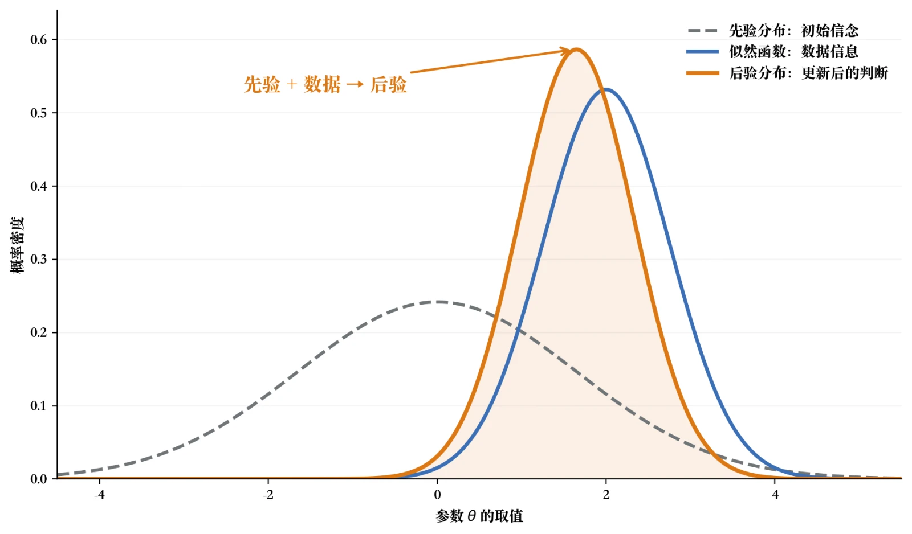
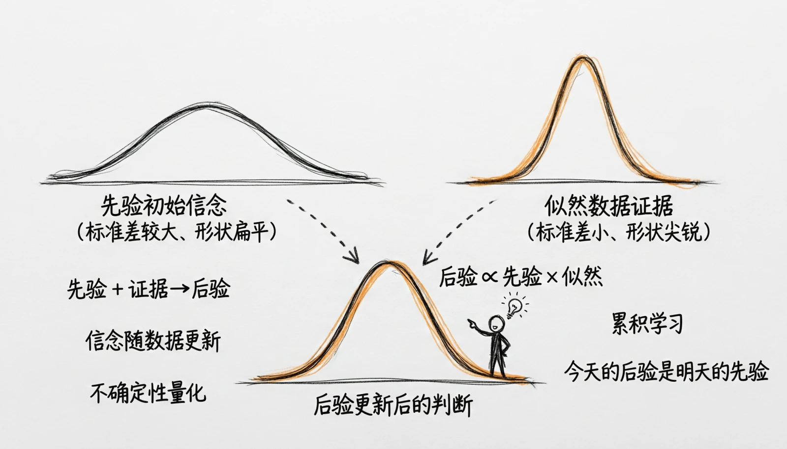
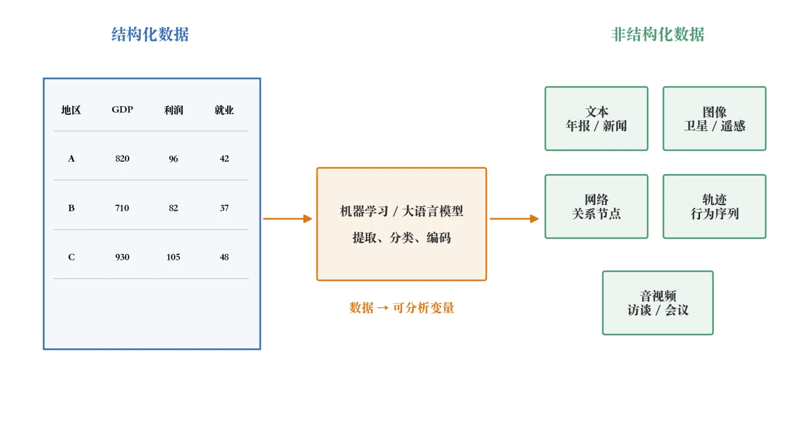
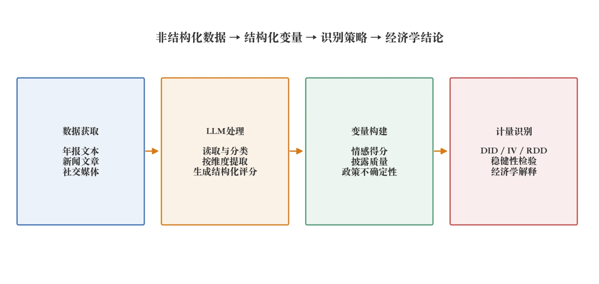
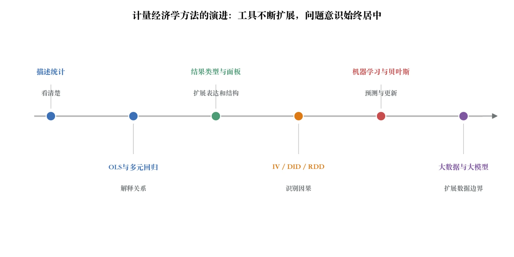

# 第10章 现代计量工具：机器学习、贝叶斯与大模型

> “计算的目的，不是数字，而是洞见。”
>
> ——理查德·哈明《数值方法：面向科学家与工程师》（Numerical Methods for Scientists and Engineers，1962）

{fig-alt=""}

> **本章定位：选学与前沿导览**
>
> 本章的目标是建立方法地图和边界意识，不要求零基础读者完整掌握双重机器学习的理论证明、贝叶斯计算或大模型接口开发。完成本章后，你至少应能区分预测与因果识别，理解“先验—似然—后验”的基本语言，并知道把文本或大模型输出变成研究变量时为什么必须验证测量质量。课堂可以选择其中一个方向做操作练习，其余内容作为阅读材料；需要实际使用某种方法时，还应继续学习专门课程、软件文档和复现案例。

在前一章中，我们讨论了随机实验、双重差分与断点回归等因果推断设计。它们的共同目标，是通过分配机制或可比组构造反事实，并明确说明因果解释依赖哪些条件。部分假设可以用图形、安慰剂或协变量平衡等方式诊断，另一些关键条件则必须依据制度背景论证，不能由统计检验直接验证。

经济研究的数据规模和类型都在变化。有些数据集包含数百万条观测和成千上万个特征，文本、图像、音视频与行为轨迹也越来越常见。线性回归仍然有用，但它不能直接处理所有高维、非线性和非结构化信息。机器学习因此进入了经济学的工具箱。它强调预测表现和样本外泛化，可以拟合非线性关系与复杂交互，也可用于某些因果估计中的辅助步骤。不过，预测准确不等于因果识别成立，算法输出也不能直接证明机制。

与此同时，贝叶斯方法提供了另一套概率推断语言：把对未知参数的不确定性表示为先验分布，并用数据更新为后验分布。这里的随机性描述研究者对未知量的认识，不意味着客观真值随抽样随机改变。更值得注意的是，大数据和大语言模型等新技术的兴起，也正在改变经济研究的证据基础。过去，实证分析往往依赖政府统计、调查数据或企业财报等结构化信息，而现在，研究者还可以利用新闻文本、合同条款、平台交互信息、网络评论、供应链记录以及模型辅助提取的信息来构建研究变量。新技术使制度环境、情感变化、企业治理和创新质量等难以直接观测的概念有了新的测量方式。不过，能够生成一个指标不等于测量已经有效，更不等于因果识别已经成立；研究者仍要验证指标与目标概念之间的对应关系。

本章不推导这些方法，而是回答三个入门问题：它们适合解决什么问题，需要哪些额外条件，又有哪些常见误用？全章分为三块：机器学习与因果估计、贝叶斯推断，以及大数据和大语言模型。读者现阶段只需掌握方法的基本语言和边界，真正使用时再学习相应的专门课程与软件文档。

## 10.1 机器学习：从预测工具到因果推断

### 10.1a 机器学习与传统计量

在上一章中，我们学习了实验设计、双重差分（DID）和断点回归（RDD）等因果推断方法。这些方法的核心在于研究者必须明确提出一个因果问题，并围绕该问题设计识别策略。以DID为例，我们需要明确谁是处理组、谁是对照组，政策实施前两组的趋势是否大致平行，再在相应识别假设下把两组的变化差异解释为政策效应。这种思维方式体现了计量经济学的一条基本原则：先定义研究问题，再说明识别条件、模型和数据如何共同支撑结论。传统计量方法重视模型设定、假设检验以及参数的经济含义，强调结果的可解释性和稳健性。然而，随着数据环境发生剧烈变化，传统计量方法面临新的挑战。现代研究中，数据量不断增大，变量数量日益丰富，经济关系呈现非线性和复杂交互，企业或政策决策要求更高的动态反馈和不确定性量化能力。

例如，研究一项产业补贴政策对企业创新投入的影响时，理论上我们需要控制行业景气、地区竞争、企业规模、资产结构、利润能力、历史研发投入以及人员学历结构等众多因素，而这些因素之间往往存在非线性关系或复杂交互。传统回归模型在这种环境下容易出现多重共线性、模型设定偏误，甚至无法有效估计。这时，研究者很容易把大量精力消耗在变量选择和模型试验上，而非核心的因果识别。机器学习通常更重视函数逼近和样本外预测，而不要求每个参数都有单独的经济含义。它可以拟合非线性和交互关系，并从大量特征中压缩预测信息。在因果研究中，这些能力只服务于特定估计环节，不能替代研究设计。尽管如此，机器学习并不能替代因果推断。

以企业创新投入与地区GDP增长为例，机器学习可以精确拟合两者关系，但它无法告诉我们增长是由创新推动的，还是创新仅仅集中在经济发展较快的地区。这是因为因果关系涉及潜在的反事实和混杂因素，单靠预测无法解决这些问题。因此，现代经济研究中最合理的做法是：将机器学习作为计算工具和信息处理引擎，而计量经济学框架仍然负责识别因果关系和解释经济现象。更具体地说，传统线性回归模型通常由研究者先设定公式，例如

$$Y_i = \beta_{0} + \beta_{1}X_{1i} + \beta_{2}X_{2i} + \cdots + u_i$$

其中每个系数都有明确的经济含义。与此相比，机器学习模型采用的形式是

$$Y_i = f\left( X_{1i},X_{2i},\ldots,X_{Ki} \right) + u_i$$

函数$f(\cdot)$不需要研究者预先指定为简单线性形式，而是由算法根据训练数据拟合。决策树、随机森林、Boosting或神经网络可以在大量特征中寻找有助于预测的组合，并拟合复杂的非线性关系和交互模式。在因果分析中，这种能力可用于估计高维控制变量对应的辅助函数；它能否帮助处理混杂，仍取决于混杂因素是否被充分测量、识别假设是否成立以及估计流程是否规范。经济研究越来越多地借助机器学习，是因为数据规模、变量数量和关系复杂度都在上升。机器学习擅长从数据中提取预测模式，计量经济学则提供目标参数、识别假设和推断框架；但后者也不会自动把预测模式转换成因果结论。两者结合时，算法改善某些估计环节，研究设计和理论仍决定结论可以走多远。综上所述，计量方法更强调识别和推断，机器学习更强调逼近和预测。两者结合可以提高高维数据处理与预测的效率，但不会自动保证因果结论可靠；因果解释仍取决于研究设计、目标参数、识别假设和推断方法。未来的经济研究者既要严谨思考反事实，也要能够透明、可复现地处理复杂数据。

### 10.1b 机器学习给计量带来的三大能力

在现代经济与社会研究中，数据的维度和复杂性远超过以往几十年所能处理的范围。政策、企业和城市治理问题中，潜在影响因素众多，变量之间关系复杂且非线性，同时单位对干预措施的响应存在异质性。传统线性模型在这种背景下可能面临多重共线性、函数形式过于简单，以及平均效应掩盖群体差异等问题。机器学习提供了强大的函数逼近能力和预测工具，使研究者可以较少依赖事先指定的简单函数形式。然而，机器学习并非因果识别的替代工具，其价值主要体现在高维信息压缩、非线性与交互关系逼近，以及条件处理效应的异质性估计。下面将从这三个方面介绍其思想、操作流程和方法边界。

**高维变量选择：自动化的控制与信息压缩。** 在现实经济研究中，潜在控制变量往往数量巨大。例如，评估企业创新补贴政策对研发投入的影响时，可能涉及企业规模、资产结构、历史研发投入、行业竞争程度、地区GDP、政策执行强度、员工教育结构、供应链网络等几十到上百个变量。传统线性回归在这种情况下容易出现多重共线性，导致系数估计不稳定；同时，人工选择控制变量既费力又容易遗漏关键因素。

LASSO（Least Absolute Shrinkage and Selection Operator，最小绝对收缩与选择算子）提供系统化的解决方案。其核心思想是在最小化残差平方和的基础上引入 L1 惩罚项，使不重要的变量系数自动收缩为零：

$$
(\widehat{\beta}_0,\widehat{\beta}_1,\dots,\widehat{\beta}_K)
=\operatorname*{argmin}_{\beta_0,\beta_1,\dots,\beta_K}
\left\{
\sum_{i=1}^{n}\Big( Y_i-\beta_0-\sum_{j=1}^{K}\beta_{j}X_{ij} \Big)^{2}
+\lambda\sum_{j=1}^{K}|\beta_{j}|
\right\}
$$

其中 $K$ 是候选变量的个数，$X_{ij}$ 是第 $i$ 个观测在第 $j$ 个变量上的取值，$\sum_{j=1}^{K}\beta_{j}X_{ij}$ 就是把一个观测的 $K$ 个特征按各自系数加权求和；$\lambda$ 控制稀疏程度，$\beta_{j}$ 是每个变量的回归系数。调节 $\lambda$ 可以平衡预测误差与稀疏性。

另外要把截距的处理说清楚：$\beta_0$ 参与上面的最小化，但一般**不进 L1 惩罚项**——惩罚项只对 $\beta_1,\dots,\beta_K$ 求和。把截距也往零收缩，等于要求模型的基准水平也跟着数据的整体尺度走，这与“让不重要的变量系数收缩为零”的目标无关。所以公式左边写的是 $\widehat\beta_0,\widehat\beta_1,\dots,\widehat\beta_K$ 这一整组估计，而惩罚只落在斜率上。

LASSO擅长预测和降维，但被收缩为零不等于变量在因果上不重要，保留下来也不等于它是混杂变量。因果分析不能采用“先让Y-LASSO选变量，再对入选变量做普通回归”的简单流程，因为它可能漏掉主要预测处理D、但对Y系数较弱的重要混杂变量，且选择后的常规标准误通常忽略了筛选步骤。

更合适的入门路径是先依据因果图排除处理后变量和碰撞变量，再使用双重机器学习（Double Machine Learning, DML）：它同时对结果方程和处理方程建模，用交叉拟合（把样本分折，在其余折上训练、在留出折上预测）得到样本外预测，再据此估计目标参数。这里的**干扰函数**指处理方程与结果方程中需要估计的那两个条件期望。以企业创新补贴研究为例，候选特征必须在政策实施前确定，并有重叠支持。LASSO可以拟合高维干扰函数，但不能保证保留10—15个变量就有效控制混杂，也不能修复DID的非平行趋势或IV的无效工具。

**非线性关系与复杂交互刻画：描述更灵活的预测关系。** 经济变量之间的关系往往非线性且存在复杂交互。例如，企业规模对研发投入的边际效应可能随着企业成长而下降，小企业边际回报高，而大企业可能面临规模瓶颈；政策激励效果可能依赖行业竞争强度与地区财政能力的交互作用。传统线性模型通常需要人工指定高阶项或交互项，但在高维环境下，这种做法既困难又容易造成过拟合。机器学习通过算法自动逼近复杂函数，天然适合处理非线性与交互关系。决策树通过逐层划分变量空间，将样本分为若干子区域，在每个区域内估计局部均值；随机森林通过集成多棵决策树降低过拟合风险；Boosting 通过迭代优化残差逐步逼近真实函数；人工神经网络通过多层非线性激活函数捕捉高阶交互模式。操作流程通常包括明确预测目标、划分训练与评估样本、交叉验证调参、检查样本外表现和误差结构。

特征重要性与部分依赖图（PDP）描述模型的预测关系，不是因果效应；当特征高度相关时，PDP还可能构造数据中几乎不存在的特征组合。例如，在研究城市财政激励政策对企业创新的效果时，地区经济基础、人口结构和财政能力可能以非线性方式关联处理和结果。Boosting可以在训练样本中拟合这些高维干扰函数；若要与DID结合，应使用针对目标参数构造的正交化或双重稳健方法，并进行样本分割或交叉拟合。普通Boosting残差本身没有因果含义，也不能修复非平行趋势、处理效应异质性或同期政策冲击。需要注意的是，非线性拟合能力强并不等于因果识别自动成立。残差和预测值只能辅助控制混杂因素，研究者仍需保证平行趋势或工具变量条件成立。机器学习的核心价值在于扩展估计空间，而非替代因果识别逻辑。

**条件处理效应与效应异质性：发现哪些群体可能不同。** 平均效应可能掩盖个体或单位之间的显著差异。例如，创新补贴政策可能对大企业效果明显，对小企业几乎无效。忽略这种异质性不仅影响理论理解，还可能导致政策资源错配。因果森林（causal forest）等方法主要估计给定特征的条件平均处理效应（conditional average treatment effect, CATE），不是每个个体不可同时观测的真正个体处理效应（individual treatment effect, ITE）。它根据处理前特征寻找效应异质性，并需要诚实分样、重叠和相应识别条件——**诚实分样**指用于确定分组结构的样本与用于估计效应的样本分开，避免用同一批数据既挑子群又报效应。操作流程如下：首先，明确目标参数和识别假设，并收集处理前特征；其次，用因果森林学习特征与条件平均处理效应之间的关系；第三，报告个体层面的CATE预测值或预先定义子群的平均效应及其不确定性；最后，检验异质性结论在留出样本或诚实分样下是否稳定。哪些特征能够预测效应差异，不等于这些特征就是差异产生的机制。

例如，在企业创新补贴研究中，模型可能显示大企业和资金充足企业的估计效应较大，而中小企业或资金紧张企业的估计效应较小。这样的结果可以形成差异化政策的研究线索，但在提出政策建议前，还要核对识别假设、估计不确定性、多重比较和样本外稳定性。异质性估计不自动解决因果识别问题；把因果森林与DID、IV或RCT结合时，也必须使用与原研究设计和目标参数相匹配的估计方法。机器学习在高维信息压缩、非线性与交互关系逼近，以及条件平均处理效应估计方面提供了新工具。但LASSO选中的变量不自动成为混杂因素，预测模型生成的残差不自动获得因果含义，因果森林的CATE也不是每个人不可同时观测的真实个体效应。这些方法扩展了估计工具箱，但仍要继承原研究设计的识别假设。

### 10.1c 机器学习与因果推断

前一节讨论了机器学习在高维变量选择、非线性刻画和效应异质性探索中的作用。本节进一步说明如何把这些计算能力嵌入一个已经明确目标参数和识别假设的因果推断框架。我们从Neyman–Rubin潜在结果框架出发，了解双重机器学习（Double Machine Learning, DML）的基本原理。它的主要优势是在既定识别框架中，降低目标参数对高维干扰函数小幅估计误差的一阶敏感性，而不是创造新的识别来源。假设我们希望评估某政策对结果变量的平均效应，对于个体$i$，定义潜在结果$Y_i(1)$为接受处理时的结果，$Y_i(0)$为未接受处理时的结果，则个体处理效应为$\tau_i=Y_i(1)-Y_i(0)$。由于每个个体只能观察到一个潜在结果，研究者需要借助研究设计和协变量$X_i$构建反事实。

机器学习在这里用于灵活逼近$Y$、$D$与$X$之间的条件关系；因果解释仍来自原有的识别假设。以部分线性模型为例，DML使用机器学习交叉拟合$E[D|X]$与$E[Y|X]$，再把正交化残差用于估计目标参数。正交得分降低了干扰函数小幅估计误差对目标参数的一阶影响，但不会避免所有高维偏误。因果解释仍需可忽略性、重叠、正确的目标参数和足够好的干扰函数估计——**可忽略性**指给定处理前协变量之后，接受处理与否与两种潜在结果无关；**重叠**指在协变量的各个取值上，处理组与对照组都有足够的观测。以企业创新补贴政策为例，企业特征和地区经济指标可能超过五十个维度，如果仅依赖研究者手工设定的简单线性函数，容易遗漏重要的非线性或交互关系。通过 DML，研究者可以用 LASSO 或 Boosting 等算法交叉拟合企业是否接受政策的条件期望以及研发投入的条件期望，再依据选定的正交得分估计目标参数。

正交得分和交叉拟合可以降低干扰函数估计误差的一阶影响，但不会保证结果稳健，也不会修复关键混杂变量缺失、重叠不足或政策分配内生等问题。交叉拟合把样本分成K折：每次在其他K−1折训练，在留出折生成预测，使每个观测都获得样本外预测；随后合并各折得分估计目标参数。它不只是简单做一次训练集/验证集切分，也不自动保证标准误正确，推断仍须使用与得分、抽样和聚类结构相匹配的公式。这套流程体现了机器学习与计量方法的分工：机器学习负责灵活拟合高维关系，因果解释仍依赖目标参数、反事实和识别假设。研究者需要说明可忽略性或工具变量条件为什么可信，而不能由算法替这些条件作保证。

协变量多并不等于混杂控制充分，处理后变量和碰撞变量也不能交给算法任意筛选。分折、样本外预测与得分聚合的具体做法见 10.1d 的第一步。在部分线性、常数处理效应模型中，可把这一步直观理解为残差回归；在二元处理与异质效应下，目标可能是平均处理效应（ATE）、处理组平均处理效应（ATT）或其他加权效应，不能不加区分地把一个残差回归系数都叫作ATE。为了让学生更直观地理解 DML 的应用，我们可以考虑两个典型案例。首先是政策评估。

假设研究者希望评估一项企业创新补贴政策的效果，控制变量可能包括企业规模、资产结构、历史研发投入、行业竞争度、地区经济指标等五十余个特征。研究者可以用 LASSO 或随机森林交叉拟合处理方程和结果方程，再用与目标参数匹配的正交得分估计平均效应。如果还要比较大企业与中小企业，必须预先定义子群并分别估计，或使用专门的异质性处理效应方法；单一的残差回归系数本身不能给出这些组间差异。

**第二个案例是金融风险管理。** 金融监管部门想要评估新出台的信贷政策对贷款违约率的影响。涉及特征数量庞大，包括客户信用评分、历史违约情况、企业财务指标、行业风险、宏观经济环境等。DML可以利用机器学习估计高维干扰函数，并按既定得分估计政策效应。

若进一步发现高风险与低风险客户的估计效应不同，还需要报告分组规则、不确定性和多重检验，并说明政策分配为何在给定协变量后可以视为可忽略。这两个案例都强调了 DML 的特点：它把机器学习用于估计高维干扰函数，同时把目标参数、识别假设和统计推断保留在计量框架中。结果是否稳健、能否作因果解释，仍要逐项检查，而不是由所用算法决定。实践中需要特别注意的几点，集中在 10.1d 第五步。

机制解释还需要理论、时间顺序和能排除替代解释的额外证据。总之，DML 的成功应用依赖于两点：一是对高维复杂数据的准确建模，二是对因果识别逻辑的严谨遵循。它体现了现代计量经济学“工具强大，但识别仍为核心”的原则。双重机器学习展示了现代计量与机器学习融合的典型路径。在这一方法中，机器学习负责估计可能高维、非线性和包含复杂交互的干扰函数，计量框架负责定义目标参数、提出识别假设并进行推断。学生应牢记，机器学习提供的是函数逼近能力，正交化和交叉拟合控制的是特定的估计误差；它们都不能取代对因果结构和数据生成过程的判断。图10-1 用 LASSO 演示“机器筛掉无关变量”这一步。

{fig-alt="LASSO：让机器筛掉无关变量"}

图10-1 LASSO：让机器筛掉无关变量

### 10.1d 应用示例：从高维政策的评估到大数据因果分析

在现代计量研究中，政策评估常面临高维协变量、非线性关系和个体异质性等挑战。为了理解机器学习与计量方法结合的全过程，我们以企业创新补贴政策对研发投入的影响为案例，详细展示从数据到因果推断的完整逻辑。我们的目标是量化政策的平均效果，同时考察不同企业的异质性响应。在潜在结果框架下，每家企业的研发投入可以表示为$Y_i(1)$（接受补贴时）和$Y_i(0)$（未接受补贴时），个体处理效应为$\tau_i=Y_i(1)-Y_i(0)$。由于每家企业只能观察到其中一个结果，研究者需要依靠研究设计和识别假设构造反事实。协变量$X_i$包括企业规模、历史研发投入、资本结构、行业类型、地区经济指标等处理前特征。机器学习可以灵活估计这些特征对应的条件期望，但不能把未观测到的混杂因素变成可观测变量。

**第一步：数据划分与机器学习建模。** 首先将样本随机划分为$K$折。每一轮用$K-1$折拟合机器学习模型，再为留出折计算预测值和得分，直到每个观测都得到样本外预测。交叉拟合可以减少同一观测参与模型训练和目标参数估计造成的过拟合影响，但不会单独解决识别问题。以部分线性模型为例，首先写出结构关系：

$$Y_i=\theta_0D_i+g_0(X_i)+\varepsilon_i,\qquad E(\varepsilon_i\mid D_i,X_i)=0$$

（本节沿用 DML 的标准记号：$\varepsilon_i$ 是结构误差，与全书其余各章写作 $u_i$ 的误差项含义相同；后文 $\eta_i$ 则是残差回归的误差，与 $\varepsilon_i$ 不是同一个对象。）

在每一训练折上，分别估计两个干扰函数：

$$\ell_0(X_i)=E(Y_i\mid X_i),\qquad m_0(X_i)=E(D_i\mid X_i)$$

这里$\ell_0(X_i)$和$m_0(X_i)$可以采用LASSO、随机森林或Boosting等学习器估计。学习器需要通过交叉验证调参并检查样本外表现。这一步不是直接估计因果效应，而是估计正交得分中所需的干扰函数。

**第二步：残差计算与交叉拟合。** 在验证集上，计算残差：

$$\widetilde D_i=D_i-\widehat m^{(-k(i))}(X_i),\qquad
\widetilde Y_i=Y_i-\widehat\ell^{(-k(i))}(X_i)$$

其中$-k(i)$表示拟合模型时没有使用观测$i$所在的折。这两个量分别是处理变量和结果变量相对于其条件期望的样本外预测误差。它们不是天然外生的“净处理”和“净结果”，其因果用途来自前述模型、识别假设和正交得分。如果在同一数据上训练和计算得分，灵活学习器可能把样本噪声也拟合进去，使目标参数估计和常规推断的近似性质变差，偏误方向并不固定。交叉拟合降低了这种“自身拟合”问题，但标准误仍需使用DML对应的推断公式。我们在理解这一部分时，应注意：残差化并非删除协变量，而是剔除高维干扰，使因果回归更稳健。

**第三步：因果效应回归。** 在残差上进行线性回归：

$$\widetilde Y_i = \tau\widetilde D_i + \eta_i$$

在常数效应的部分线性模型及相应识别条件下，$\tau$估计结构参数$\theta_0$。对于二元处理且处理效应存在异质性的情形，这个残差回归系数一般不能直接称为ATE；研究者应选择专门针对ATE、ATT或其他目标参数构造的正交得分（关于正交得分的直观含义，见本节末尾的说明）。无论目标是什么，因果解释都要依赖可忽略性、重叠和抽样等条件。教材提示：DML的核心目标不是“得到更高的预测准确性”，而是借助正交化和交叉拟合，减弱高维干扰参数估计误差对目标参数的一阶影响。它仍要求合适的因果结构、识别假设、学习器质量和推断条件，不能被理解为高维因果推断的自动保证。

**第四步：异质性分析。** 政策效应往往在不同企业群体中差异明显。例如，大企业可能更容易利用补贴进行研发投入，而中小企业受制于资源约束，响应较弱。为了识别这种异质性，可以采用因果森林（Wager 与 Athey，2018）或分层回归。

因果森林在残差回归基础上，通过树结构自动分组，估计条件平均处理效应：

$$\tau\left( X_{i} \right) = E\left\lbrack Y_{i}(1) - Y_{i}(0)\mid X_{i} \right\rbrack$$

假设结果显示大企业的估计效应较大，中小企业的估计效应较小，这可以提示政策响应存在异质性。不过，“一组显著、另一组不显著”本身并不等于组间效应显著不同，还要直接检验组间差异，并尽量使用诚实分样或留出样本验证。

**第五步：结果解释与注意事项。** 尽管 DML 提供了高维控制和非线性处理的能力，但仍有几个需要注意的关键点。第一，如果关键混杂变量遗漏，或政策分配存在未解决的内生性，即使 DML 也可能产生偏误。第二，机器学习模型的选择和超参数会影响干扰函数质量。第三，样本量、重叠程度与模型复杂度必须匹配。最后，特征重要性描述的是预测贡献，不能单独验证因果机制；结果解释还应结合设计诊断、得分分布和敏感性分析。

## 10.2 贝叶斯方法：从点估计到不确定性分析

### 10.2a 频率学派与贝叶斯学派：两种看世界的方式

本书前面主要用频率学派的估计与推断介绍OLS、IV、DID和RDD。频率学派通常把参数（如回归系数$\beta$）视为固定但未知的量，并研究估计量在重复抽样中的性质。95%置信区间的严格含义是：若按同一抽样和构造程序反复得到区间，长期覆盖率为95%；它不是在观测到当前数据后声称该固定参数有95%的概率落在这个具体区间内。需要注意，OLS、IV、DID和RDD是模型或研究设计，并非只能采用频率学派估计，也可以在相应假设下建立贝叶斯版本。贝叶斯学派用概率分布表达对未知参数的认识，并随着数据积累更新这种不确定性。客观真值可以仍是固定的；随机变量表述针对的是我们的知识状态或模型中的未知量，而不是宣称“真理不是固定数字”。这种思维方式或许听起来抽象，但其实非常贴近我们日常的认知过程。

设想一个医生在诊断病情：当一位病人走进诊室，医生根据症状描述形成一个初步判断（比如“这位患者很可能是普通感冒”）；接着医生让患者去做血常规检查，新的检查结果到来后，医生会修正自己的判断（“白细胞计数偏高，可能不是普通感冒，更像细菌感染”）；如果症状继续恶化，医生还会进一步调整诊断结论。这个过程的本质就是贝叶斯式的——从已有认知出发，根据新证据不断更新判断。天气预报可以帮助理解“用新信息更新预测”，但不能用来把两派简单分成“历史频率”和“主观判断”。频率方法也能利用当前气象变量建立概率预测，贝叶斯方法也依赖样本似然。两者更关键的差别在于如何解释参数和概率，以及如何构造和评价不确定性陈述。频率学派与贝叶斯学派都可用于大样本或小样本问题，优劣不能只按样本量划分。

频率方法侧重估计程序在重复抽样中的性质；贝叶斯方法便于合并明确的先验信息、进行层级建模并直接计算后验概率。具体选择取决于研究目标、模型可检验性、先验依据、计算成本和读者需要。

### 10.2b 贝叶斯思想的基本逻辑

贝叶斯方法的核心是著名的贝叶斯公式。其基本形式可以写为：

$$P(\theta|D) = \frac{P(D|\theta) \cdot P(\theta)}{P(D)}$$

这里 $\theta$ 代表我们关心的参数（比如某项政策的处理效应），$D$ 代表我们观察到的数据。公式右边的三个部分各有其名：$P(\theta)$ 是先验分布（Prior），它表示在看到数据之前，我们对参数的认知；$P(D\mid\theta)$ 是似然函数（Likelihood），它衡量在某个参数取值下数据出现的可能性；$P(\theta\mid D)$ 是后验分布（Posterior），它表示结合数据信息之后，我们对参数的更新认知。公式看起来抽象，但思想极为朴素，可以浓缩为一句话：

$$\text{后验} \propto \text{先验} \times \text{似然}$$

也就是说，贝叶斯方法把“事前的认知”和“数据带来的证据”结合起来，形成一个更新后的判断。先验代表我们的初始信念，似然代表数据告诉我们的信息，后验则是两者融合后的最终结论。我们可以用一个投资者的例子来直观体会这一逻辑。假设一位投资者正在考虑某家公司的股票，他事先根据该公司过去几年的表现，认为公司未来盈利情况“大概率不错”——这就是他的先验。然而，公司刚刚发布了最新一季度的财报，业绩超出市场预期——这是新的数据证据。投资者会综合自己的先验判断和这份财报的内容，形成对公司前景的新的看法：他对公司前景良好的信心进一步加强。这种“先验+证据→后验”的更新过程，就是贝叶斯方法的核心。值得注意的是，先验和数据在贝叶斯框架中共同决定后验。当样本量较小、数据信息有限时，先验对后验的影响通常较大；在模型可识别且满足常规条件时，随着有效信息增加，似然的影响通常增强。贝叶斯方法可以在小样本或新政策初期明确纳入已有信息，但不能凭空弥补数据不足，不恰当的先验还可能主导结论。图10-2 是贝叶斯更新的示意。

{fig-alt="贝叶斯更新示意图"}

图10-2 贝叶斯更新示意图

需要强调的是，本节我们不展开贝叶斯公式的具体求解过程。在实际研究中，后验分布的求解通常依赖马尔可夫链蒙特卡洛（MCMC）等数值方法，这些方法在Stan、PyMC、JAGS等专业软件中已经实现，研究者无需亲自推导。我们要把握的是思想：贝叶斯方法提供了一种“伴随数据持续更新认知”的科学推理路径，这是它区别于经典计量的最本质特征。

### 10.2c 贝叶斯方法在经济研究中的优势

相比传统的频率学派方法，贝叶斯方法在现代经济研究中展现出几个独特的优势。第一，以后验分布表达参数不确定性。频率派通常用估计量的抽样分布、标准误和置信区间描述不确定性；贝叶斯方法则在给定模型与先验后，得到参数的后验分布，并可计算参数落入某一区间的后验概率。例如，政策评估可以报告“政策效果大于0的后验概率”或“效果超过政策相关阈值的后验概率”。这种表述便于与决策问题衔接，但必须同时说明先验、似然和模型条件。第二，小样本下可以明确借用先验信息。数据较少时，后验会更依赖先验；这可能稳定估计，也可能把不恰当先验的偏见带入结果。贝叶斯方法不会凭空创造信息，小样本分析必须进行先验预测检查和先验敏感性分析。第三，动态学习与持续更新。经济现实是动态变化的，新政策不断出台，新数据不断累积。

贝叶斯方法天然适合这种动态环境——今天的后验分布，可以作为明天的先验分布；下一批数据到来后，我们就在此基础上继续更新。这种今天的后验是明天的先验的循环机制，使贝叶斯方法成为一种学习型的推断框架。中央银行在制定货币政策时，每月新公布的通胀、就业数据都会被用来更新对宏观经济状态的判断——这本质上就是贝叶斯式的动态更新过程。第四，结构化先验融入经济知识。经济理论、历史数据和以往研究可能对参数的方向或大致范围提供信息。贝叶斯方法允许研究者把这些信息转化为先验分布，但先验的来源、强度和敏感性都应该公开说明。理论也并非总能给出毫无争议的参数范围。第五，模型比较与决策一体化。在事先给定候选模型集合、模型先验和参数先验后，贝叶斯方法可以计算后验模型概率；结果会受到候选集合和先验设定影响，并不是无条件的模型排名。

贝叶斯后验还可以与损失函数或效用函数结合，用于比较不同决策方案的预期收益与风险。贝叶斯方法已用于DSGE模型估计、金融风险、不确定性分析和部分政策评估等领域。随着Stan、PyMC和Stata的`bayes`命令族等工具逐渐成熟，计算门槛有所降低。不过，贝叶斯分析并不是频率派结果的例行“稳健性检验”：二者使用不同的概率表述，研究者应说明先验来源、模型诊断和后验敏感性。

### 10.2d 应用示例：贝叶斯视角下的政策评估

为了让读者更直观地理解贝叶斯方法与传统方法的差异，我们以一个简化的政策评估案例来说明。假设某省份开始实施一项中小企业税收减免政策，希望评估该政策对企业投资的影响。研究者收集政策实施前后的企业数据，并在能够论证平行趋势等条件的前提下，选取邻省类似企业作为对照组。为便于解释，设被解释变量为企业投资额的对数。传统频率派做法：研究者使用双重差分（DID）方法，估计得到政策效应系数为0.18，标准误为0.07。按简化的正态近似，双侧$p$值约为0.010，95%置信区间约为[0.043, 0.317]。若识别假设成立，点估计对应的投资增幅约为$100(e^{0.18}-1)\%=19.7\%$。频率派区间描述的是重复抽样程序的覆盖性质，不能直接解释为“政策效应为正的概率”。

贝叶斯做法：为了演示计算，暂把频率派估计量近似看作$\widehat\theta\mid\theta\sim N(\theta,0.07^2)$，并设先验为$\theta\sim N(0.10,0.15^2)$。这个正态—正态示例可以直接解析求解；更复杂的DID模型才可能需要MCMC。由此得到：后验均值约为0.166，后验标准差约为0.063；政策效应大于0的后验概率约为99.6%；政策效应大于0.10的后验概率约为85.0%；政策效应大于0.20的后验概率约为29.4%。在给定似然近似、先验和模型的条件下，可以表述为：“政策效应为正的后验概率约为99.6%，效应超过0.10的后验概率约为85.0%。”这种语言便于接入决策问题，但它不是不依赖模型与先验的客观成功概率，也不能替代对DID识别假设的检验。

需要补充的是，先验的选择是贝叶斯分析中需要慎重对待的问题。如果先验过强（比如非常坚定地认为政策效应为0.5），它会主导结果；如果先验过弱（接近无信息先验），则贝叶斯结果会与频率派接近。在实践中，研究者常常会报告多种先验设定下的结果，作为稳健性检验，以避免主观偏向。贝叶斯方法的实操在现代统计软件中已经相当便捷。Stata用户可以使用`bayes:`前缀加在常用回归命令前（如`bayes: regress y x`），R用户可以使用`brms`、`rstanarm`等包，Python用户可以使用`PyMC`，专业研究者还可以直接使用Stan。这些工具大大降低了贝叶斯分析的技术门槛，使初学者能够把精力聚焦在思想理解和结果解读上，而不必陷入复杂的算法推导。

> **专栏10-1 从$p$值到后验概率——政策制定者真正想要什么？**
>
> 政策制定者常会问“政策成功的概率有多大”，而频率学派的$p$值并不直接回答这一问题。它描述的是原假设及统计模型成立时，当前或更极端检验统计量出现的概率。决策还需要效应量、损失函数、实施成本和不确定性等信息。
>
> 我们先来理解传统的$p$值表述。当一项研究说“政策效应在5%水平显著（$p<0.05$）”时，它的含义是：在零假设和所用统计模型成立的条件下，观察到当前这样或对零假设更不利的检验统计量的概率小于5%。它不是“零假设为真的概率”，也不直接回答“政策有多大可能起作用”。Sander Greenland等学者系统总结过这类误读，其中就包括把“统计显著”错误等同于“政策一定有效”。
>
> 贝叶斯方法可以直接计算这类概率。假设某项分析得到“政策效应大于0的后验概率为92%”，它的完整含义是：在给定模型、先验和现有数据的条件下，参数大于0的后验概率为92%。这类概率化表述更容易与政策制定者的损失函数和风险偏好衔接，但必须同时报告其条件。
>
> 假设一家保险公司评估是否推出养老险产品。频率分析可以报告预期利润估计、置信区间和检验结果；贝叶斯分析则可在给定模型与先验下报告三年内盈利的后验概率，或亏损超过800万元的后验概率。无论采用哪种框架，是否推出产品还取决于资本约束、风险偏好和各类结果的损失，而不能由一个$p$值或后验概率单独决定。
>
> 频率派与贝叶斯方法回答问题的概率语言不同。是否采用贝叶斯分析，应由研究问题、先验信息、决策目标和模型诊断决定，而不是把它当作期刊偏好或例行稳健性检验。
>
> 贝叶斯分析用后验分布表达在给定模型、先验和数据条件下对未知量的不确定性，也便于随新数据更新。后验概率并非脱离假设的主观把握；报告时应同时说明先验选择、似然设定和敏感性分析；图10-3 画出了先验如何被数据更新。

{fig-alt="贝叶斯：先验如何被数据更新"}

图10-3 贝叶斯：先验如何被数据更新

## 10.3 大数据与大模型：计量分析新范式

### 10.3a 数据基础的革命：从结构化指标到非结构化海洋

如果说前两节讨论的机器学习和贝叶斯方法是分析工具的革新，那么这一节我们要讨论的，是经济研究最底层基础——数据本身正在发生的深刻变化。回顾经典计量研究，我们使用的数据主要有三类：政府公布的宏观统计指标（如GDP、CPI、失业率）、问卷调查得到的微观数据（如CFPS、CHARLS）、企业财报披露的财务指标（如资产、利润、负债）。这些数据有一个共同特征——它们都是结构化的：以整齐的行列形式存储在数据库中，每一列对应一个明确的变量，每一行对应一个观测单位。研究者拿到这些数据后，可以直接放入回归模型进行分析。然而，这种结构化数据只是真实世界信息的极小一部分。

大量经济活动的痕迹其实存在于非结构化数据中：上市公司的年报和电话会议记录是文本数据；卫星拍摄的夜光图、城市鸟瞰图是图像数据；电商平台的浏览、点击、购买记录是行为序列数据；社交媒体上的评论、转发、点赞是关系网络数据；金融市场每秒数千笔的交易记录是高频时序数据。这些数据虽然蕴含丰富的经济信息，但传统计量方法很难直接利用——因为它们没有行和列的整齐结构。近十年来，随着算力提升和算法成熟，研究者越来越能够把这些非结构化数据翻译成可分析的变量，让经济研究的证据基础发生了革命性扩展。我们看几个有代表性的研究案例。用夜光数据测算经济活动。在很多发展中国家和地区，官方GDP统计存在质量问题或更新滞后。一些研究者发现，从太空拍摄的城市夜间灯光强度与当地经济活动高度相关——经济越发达，灯光越亮。

基于NASA等机构提供的夜光卫星数据，研究者构造出“客观、高频、广覆盖”的经济活动代理指标，用于评估扶贫政策、衡量地区不平等、研究战乱地区的经济恢复。这一类研究在发展经济学领域已经成为重要的实证范式。

**用文本分析量化政策不确定性。** Baker、Bloom和Davis在2016年系统构建了“经济政策不确定性指数”（EPU），其核心思想是统计主要报纸中同时涉及经济、政策和不确定性的文章数量。这一指标被用于研究政策不确定性与投资、就业等变量的关系，也被多个国家和地区扩展。是否能把相关关系解释为因果影响，仍取决于具体研究的识别设计。用招聘网站数据观察就业市场变化。传统就业统计往往只能反映已经发生的就业情况，而招聘网站上的职位发布数据则提供了实时的劳动需求信息。

研究者通过爬取主流招聘网站的职位描述，能够分析行业结构变化、新兴技能需求、地区就业市场冷热分布等，这些信息在结构化统计中很难获得。

**用企业年报文本预测财务困境。** 上市公司年报中管理层讨论与分析（MD&A）部分蕴含丰富信息。研究者可以使用情感分析、主题模型等方法量化披露基调和风险提示频率，再检验这些文本特征能否在留出样本中改善对未来业绩或违约风险的预测。能否超过传统财务比率，要由同一数据和评估规则下的样本外比较决定。图10-4 对比了结构化与非结构化数据。

{fig-alt="从结构化数据到非结构化数据"}

图10-4 从结构化数据到非结构化数据

这些案例共同说明：经济研究的数据边界正在被打破。过去无法观测、难以量化的经济现象——制度环境、企业战略、社会情绪、政策预期、创新质量——如今可以通过非结构化数据的转换被间接刻画。这不仅扩展了研究问题的边界，也对研究者的工具箱提出了新的要求。

### 10.3b 大语言模型如何赋能经济研究

大语言模型（Large Language Models, LLMs）可处理和生成自然语言内容，并被用于文献整理、文本编码、代码辅助和写作检查。它们的输出可能包含事实错误、虚构文献、分类偏差和不可复现变化，因此只能作为需要人工核验的研究工具。我们从三个核心应用场景来理解大语言模型的赋能作用。第一，文本变量的智能构造。传统的文本分析依赖关键词词典或简单的统计方法（如词频统计、情感词典匹配），能够提取的信息有限。大语言模型则可以读懂文本的深层含义，进而把抽象的文本属性转化为可量化的变量。例如，研究者想衡量上市公司的“创新强度”，传统做法是统计公司年报中“研发”“创新”“专利”等关键词的出现频率——但这种方法容易被表面文字误导（公司可能只是在堆砌词汇，并无实质创新）。

借助大语言模型，研究者可以把每份年报输入模型，让模型按照“披露的创新活动是否具体”“技术细节是否丰富”“是否提及实际成果”等多维度评分，得到更接近实质性创新的量化指标。这种方法在环境、社会与公司治理（Environmental, Social and Governance, ESG）披露质量评估、企业战略分析、市场情绪研究等领域已被广泛尝试。第二，数据采集与清洗的自动化。研究者经常需要从多源、异构的文档中提取关键信息。例如，研究并购交易需要从招股说明书、公告中提取交易金额、付款方式、估值倍数等几十项指标；研究地方政府债务需要从各省财政预算报告中梳理债务余额、新增发债等信息。这些工作过去主要依赖人工阅读和录入，耗时耗力且容易出错。大语言模型可以承担这些信息提取任务。研究者只需向模型描述清楚需要提取的信息内容和格式，模型就能从海量文档中快速识别并结构化输出。

这种“文档→结构化数据”的转换能力，使得过去难以开展的大规模、长时序文本数据研究变得可行。当然，由于模型可能存在错误识别，研究者通常需要对模型输出做抽样人工核验，并在论文中报告核验的准确率，以保证数据质量的可信度。第三，研究流程的全面辅助。除了直接处理数据，大语言模型还能担当研究者的助手，参与文献梳理、研究设计讨论、代码调试等环节。例如，研究者可以让模型快速综述某领域的核心文献和方法演进；可以与模型对话探讨研究思路的合理性、识别策略的潜在漏洞；可以让模型协助检查Stata或Python代码、解释报错信息。这种协作式研究的模式正在改变学术工作的节奏——从独自摸索转向人机协作，研究者能够把更多精力聚焦在创造性思考和因果识别这些机器难以替代的环节。需要特别强调的是，大语言模型是工具而非答案。

它的输出可能存在“幻觉”（生成看似合理但事实错误的内容）、可能反映训练数据中的偏见、可能在特定专业领域的细节上不够准确。把大语言模型用于学术研究时，研究者必须保持批判性审视——模型生成的变量需要验证，模型给出的文献综述需要核对原文，模型提出的研究思路需要用经济学逻辑检验。因果识别的核心责任，仍然在研究者本人。

### 10.3c 应用示例：用大模型分析企业ESG披露

我们以一个前沿研究方向——企业ESG披露质量与股票市场反应——来直观展示大语言模型在经济研究中的应用。研究背景：近年来，ESG 三个维度所对应的环境（E）、社会（S）和公司治理（G）表现受到投资者、监管层和学术界的广泛关注。许多上市公司每年发布专门的ESG报告，披露其在环境保护、员工权益、公司治理等方面的实践。一个核心研究问题是：ESG披露的质量是否影响投资者预期，进而反映在股价上？传统做法的局限。传统研究通常依赖商业ESG评级机构（如MSCI、富时罗素、Wind）公布的评分作为披露质量的代理变量。然而，这种做法存在几个问题：一是不同评级机构间的评分差异很大（同一家公司在不同机构可能得分截然不同），可信度受到质疑；二是商业评级一年更新一次，时效性差；三是评分标准是黑箱，研究者无法理解其构造逻辑，难以做精细化分析。

**大语言模型的解法。** 研究者可以借助大语言模型直接读取上市公司发布的ESG报告原文，按照统一标准对披露质量进行多维度评分。例如：实质性：报告披露的内容是否针对公司主营业务的实际ESG风险，还是空泛地谈论行业普遍议题？量化程度：是否提供了具体数据（如碳排放吨数、员工流失率、董事会独立性比例），还是只有定性描述？前瞻性：是否提出了可衡量的未来目标和实施路径，还是只回顾既往？一致性：报告内容是否与公司其他披露文件（如年报、招股书）保持一致，还是存在矛盾？让大语言模型按统一量表打分，可以构造一组可重复计算的候选指标，但它不是天然客观的。指标是否测到了披露质量，需要内容效度、人工标注基准、跨群体误差、重测稳定性和外部效度验证。

**计量识别。** 需要强调的是，这些“模型生成的变量”只是新的解释变量，并不自动等同于因果识别。

研究者仍需结合经典计量方法构建严谨的因果识别策略。例如：利用强制ESG披露政策的实施作为外生冲击，构建双重差分（DID）框架，估计披露质量提升对股价的因果效应；寻找具有清晰制度来源的工具变量来处理内生性；行业内同类公司的披露惯例通常会通过共同冲击、竞争或信息溢出直接影响本企业结果，不能仅凭相关性作为工具变量；通过断点回归（RDD），比较强制披露门槛附近企业的市场反应差异。实操时至少应固定并记录模型名称与版本、日期、系统提示、完整评分准则、温度等参数、文档切分方式和失败重试规则；使用独立人工标注集评估准确率、系统偏差和组间差异；遵守数据许可、隐私与平台条款。多模型相关性只说明模型彼此相似，不等于构念有效，也不能单独保证可复现性。图10-5 给出了大语言模型进入经济研究的流程。

{fig-alt="大语言模型在经济研究中的应用流程"}

图10-5 大语言模型在经济研究中的应用流程

### 10.3d 新范式下的研究者素养

面对数据基础的革命和分析工具的扩展，现代经济研究者需要具备哪些新的素养？我们认为至少有以下四个方面。

**经济学思维仍是根基。** 无论数据多么丰富、模型多么复杂，经济学问题的提出和经济学逻辑的判断始终是研究的灵魂。一个不懂经济学的人即使精通最前沿的算法，也无法判断研究问题是否有意义、识别策略是否合理、结论是否经得起经济学常识的检验。在大模型时代，能够提出“好问题”反而比能够“得到答案”更稀缺——因为答案可以借助工具批量产生，而好问题需要深厚的经济学修养。

**计量识别能力不可替代。** 大模型可以帮助处理数据，机器学习可以帮助拟合复杂关系，但因果识别中的处理组与对照组、目标参数和识别假设仍需要研究者设计和论证。

大模型构造的变量可以进入DID，机器学习也可以估计某些IV或DID模型中的干扰函数，但只有在新工具与原设计的时间顺序、误差结构和目标参数相容时，这种结合才有意义。

**数据与计算能力是新的入门门槛。** 十年前，掌握Stata操作、能跑常见回归就基本够用。今天，研究者还需要至少掌握一门通用编程语言（Python或R）、了解机器学习的核心算法、能够调用大模型API、熟悉版本管理工具（如Git）。这些技能不是要求每个研究者都成为程序员，而是让我们能够在与数据、与工具、与合作者的对话中保持顺畅。

**批判精神和伦理意识。** 新的工具带来新的挑战。机器学习模型可能存在算法歧视，大语言模型可能复制训练数据中的偏见，大数据采集可能涉及隐私边界。研究者必须保持批判性审视的精神，警惕算法黑箱，关注研究伦理。

在论文中清晰报告数据来源、模型选择、稳健性检验，不仅是学术规范，更是对学术共同体的责任。

> **专栏10-2 当年报遇上大模型——一项研究的真实工作流**
>
> 让我们设想一位经济学博士生小李正在开展一项关于“企业数字化转型如何影响劳动力结构”的研究。这个题目在五年前几乎无法做——因为数字化转型是一个抽象概念，没有现成的官方统计指标。但在大语言模型时代，小李的研究流程变得截然不同。
>
> 第一阶段：构造核心变量。假设小李所在机构拥有相应数据库的合法访问权限，或者他从上市公司依法公开的文件中下载了2010年至2024年的年报全文。他先制定一份数字化转型评分准则，列出若干可核验的观察点：是否披露云计算、大数据、人工智能等技术的具体应用？是否设立首席信息官（CIO）岗位？是否披露数字化投入？是否描述了可核验的业务案例？接着，他让大语言模型按照固定准则对年报评分。数据来源、批量下载和再分发都要遵守数据库许可、网站条款及版权要求。
>
> 第二阶段：质量验证。小李预先制定编码手册，请两名不知模型得分的人工编码者独立标注验证集，报告一致率、混淆表、组间误差和分歧处理规则。相关系数只能反映线性一致程度，不能发现系统性高估，也不能单独证明指标有效；另一模型给出相似分数同样只是补充证据。
>
> 第三阶段：因果识别。有了数字化转型指数后，小李先画因果图并说明目标参数，再寻找可核验的制度变动。真实政策是否外生、行业是否满足平行趋势，都必须根据实施细则论证；同地区其他公司的数字化水平很可能通过共同需求、基础设施和同伴溢出直接影响本企业劳动力结构，不能仅凭相关性充当工具变量。
>
> 第四阶段：异质性与机制分析。假设主回归显示数字化转型指标上升与蓝领工人比例下降、技术岗位比例上升相联系，并且原研究设计足以支持相应的因果解释。小李可以进一步使用与该设计相容的异质性估计方法，检验效应是否因行业和企业规模而异。年报中的机制段落只能提供机制线索，还需要时间顺序、替代解释排除或额外检验，不能把模型提取到的表述直接当作机制证据。
>
> 第五阶段：写作与汇报。在论文写作过程中，小李借助大模型整理检索词、润色初稿和检查代码。所有文献题录、研究结论和引文都回到原始论文核验，代码则通过测试、人工复核和可复现运行确认。核心论点、识别策略和结论解释由研究者负责。
>
> 小李的工作流，是当代经济学研究新范式的一个缩影。在这个范式中，大模型扩展了数据的边界，机器学习增强了分析的灵活性，贝叶斯方法提供了不确定性的量化语言，而经典计量方法则继续承担着因果识别的核心职责。各种工具不是相互替代，而是协同合作，共同服务于研究者对经济世界的理解。
>
> 这种人机协作正在改变部分学术工作的流程。掌握工具固然重要，更重要的是能否核验输出、记录过程并为研究判断负责。工具节省下来的时间，应更多用于提出问题、论证识别策略和解释结果。

## 10.4 计量理论总结：经典与前沿的对话

本章是基础方法部分的收束。在进入第11—15章的综合案例之前，我们先回望前十章的方法主线：从描述统计、相关分析，到OLS回归及其扩展，再到工具变量、双重差分、断点回归，以及本章介绍的机器学习、贝叶斯方法和大模型应用。计量经济学的工具不断扩展，但研究问题、目标参数和识别假设始终是组织这些工具的主线。

### 10.4a 计量经济学的逻辑主线回顾

回顾前十章，我们可以看到一条便于入门的逻辑主线：从描述到建模，从统计推断到因果识别，再到预测与计算工具的扩展。最初的几章，我们学习了描述性分析——如何用均值、方差、相关系数等工具刻画数据的基本特征。这一阶段的核心是“看清楚”：让数据说话，让统计指标告诉我们经济变量的基本面貌。随后，我们进入回归建模——以OLS为代表的方法刻画给定控制变量后的条件关系。我们学习了多元回归、虚拟变量、交互项、对数化处理、异方差检验等基础工具。只有在额外识别条件成立时，回归系数才能进一步解释为因果效应。第4章把模型表达扩展到对数、二次项、交互项和二元结果，用LPM、Logit与Probit说明如何刻画条件概率；第5章进一步组织控制变量选择、函数形式、误差结构和结果解释。

这些扩展帮助我们更合适地描述关系，但不会自动把相关关系变成因果效应。第6章正式建立反事实、目标参数和识别假设的语言。随后，第7章利用面板数据中的单位内部变化，第8章利用工具变量提供的外生变异，第9章利用随机实验、双重差分和断点回归等设计构造比较。它们依赖的假设不同，也可能识别不同参数。本章再加入三类工具：机器学习处理预测和高维辅助估计，贝叶斯方法提供另一种表达不确定性的方式，大数据和大模型扩展了数据处理与变量构造的手段。这些工具可以改善估计、预测或测量，却不能凭计算复杂度创造识别。图10-6 概括了计量方法的演进。

{fig-alt="计量经济学方法演进示意图"}

图10-6 计量经济学方法演进示意图

这条主线是一张学习地图，而不是方法的优劣排名。不同方法针对不同数据结构和研究目标，新方法也不会自动替代旧方法。

### 10.4b 经典计量与前沿计量：互补而非替代

在本章的学习中，读者可能会产生一个疑问：既然机器学习、贝叶斯方法、大模型这些前沿工具如此强大，传统的OLS、IV、DID等经典方法是否会被淘汰？我们的回答是明确的：不会。经典计量与前沿方法的关系，是互补而非替代。经典计量方法的核心价值，在于它们提供了一套清晰、可验证、可解释的识别框架。当一项研究使用OLS或IV时，研究者必须明确说明：识别假设是什么？外生性如何论证？平行趋势是否成立？这种“假设透明化”的要求，是科学研究可信性的基石。无论数据规模多大、算法多么复杂，因果识别的核心仍然依赖这些经典框架。前沿方法的价值，在于它们扩展了我们处理复杂数据和复杂关系的能力边界。机器学习处理高维和非线性，贝叶斯方法处理不确定性和动态学习，大模型处理非结构化数据——这些能力是经典方法难以独立实现的。

但这些方法同样有自己的局限：机器学习容易陷入高预测但无识别的陷阱，贝叶斯结果对先验设定敏感，大模型生成的变量可能存在偏差。因此，不存在适用于所有研究的固定“方法套餐”。DML可以在满足相应条件时估计DID等设计中的高维干扰函数；大模型构造的变量必须先通过测量验证，才能进入IV或其他模型；贝叶斯方法改变不确定性的表达方式，却不会修复无效的识别；因果森林用于异质性分析时，也要继承原设计的识别条件。只有当目标参数、时间结构和误差结构彼此相容时，方法组合才会增加研究价值。对初学者来说，最实用的判断是：先明确研究问题与识别条件，再决定是否需要更复杂的计算工具。复杂度本身不是研究质量。

### 10.4c 三大核心思想贯穿始终

前十章学习的方法虽然形式各异，但有三个核心思想始终贯穿其中。理解这三个思想，有助于读者在后面的综合案例中判断方法选择是否合理。第一是识别（Identification）思想。我们必须始终清楚自己在估计什么。一个回归系数的经济含义是什么？它能否被解释为因果效应？需要哪些假设才能成立？这些问题不会因为我们使用了更复杂的算法而消失——相反，方法越复杂，识别问题越需要被认真对待。一项有价值的实证研究，从来不是“跑出一个显著的系数”，而是“在清晰的识别假设下得到一个可信的估计”。第二是稳健（Robustness）思想。稳健性检查应针对具体威胁并事先说明理由，例如替代测量、合理带宽、样本定义或误差结构。不能在大量设定中挑选显著结果，也不能认为DID与IV、频率派与贝叶斯结果一致就自动证明可信；不同方法可能共享同一偏误，也可能识别不同目标参数。第三是可解释（interpretability）。研究者要把估计对象、单位、比较来源和不确定性说清楚。预测问题还需报告样本外表现；因果问题则需说明识别假设。特征重要性可以帮助理解模型如何预测，但不能单独回答变量为何产生因果作用。

### 10.4d 现代研究者的三重能力

10.3d 列出的四个方面可以收束为三重能力：**经济学思维**、**计量识别能力**、**计算与数据能力**（批判精神与伦理意识贯穿三者）。真正需要在这里强调的是，三种能力会在项目中互相制约：问题定义影响模型选择，数据质量限制可估计的参数，计算结果又可能促使研究者回头修改问题。本书第三部分将把它们放进同一个项目流程。

### 10.4e 从方法学习走向综合研究

写到这里，基础方法部分告一段落。前十章提供的是一张方法地图。真正完成一项研究，还要把方法放回具体制度背景，核对数据来源，处理变量口径，并说明每一步判断的依据。综合案例的作用，就是让读者在实际取舍中形成方法直觉。本书介绍的方法只是一个起点。合成控制、动态面板GMM、空间计量、网络分析、结构估计以及机器学习与因果推断的更多扩展，都需要在后续课程中继续学习。此时不必急于追求方法复杂度，先学会把一个简单设计说明白、做扎实。无论方法如何演进，应用计量研究仍要用可核验的数据回答明确问题，并对识别条件、估计不确定性和结论边界负责。回到本章引言中哈明的那句话：“计算的目的，不是数字，而是洞见。”让数字成为洞见的，是研究者对制度背景的理解、对方法的判断和对结果的解释。无论使用OLS还是机器学习，无论处理结构化指标还是模型生成的文本变量，都要让计算服务于研究问题。带着这条原则，我们进入后面的综合案例。

## 10.5 AI Agent探索任务：走进前沿方法的实践场

本章与前面九章的侧重点不同：前面主要介绍较成熟的计量方法，本章涉及仍在快速演进的工具及其应用边界。即使是OLS、FE和DID，也不存在脱离研究设计的机械“标准答案”；前沿方法则更需要查阅最新文档、核验实现并说明选择依据。因此，本章不提供唯一的操作模板，而是安排三条有明确检查标准的探索路线。

选择路线后，先写下研究问题、已有认识和待核验之处，再让AI Agent围绕一个固定文件夹读取材料、查找官方文档并保存过程。路线A和B需要搭建最小实现、实际运行代码并保存结果；路线C是研究设计型任务，不强制调用大模型API，但要保存评分规则、提示词草稿、人工标注样例和验证计划。

**不用 AI 也可以完成**：本章任务不要求使用 AI Agent。走人工路线时，路线 A 与路线 B 可直接阅读 DoubleML／econml 或 Stata `bayes`／PyMC 的官方文档，自行搭建最小实现、运行代码并保存命令与输出；路线 C 可以完全在纸面上完成——评分维度、提示词草稿、人工标注样例与验证计划都不依赖 Agent。`ai_log.md` 只在选用 Agent 时提交，走人工路线时改为提交等价的过程记录。

方法原理、识别假设和结果核验仍由学习者负责。本章的实践定位是：**一次由学习者负责、AI Agent协作完成的前沿探索**。

开始前建立`chapter10_project/`，至少包含`README.md`、`sources/`、`code/`、`output/`和`ai_log.md`。README先写清所选路线、最小目标、准备使用的软件和完成标准；`sources/`只保存已经核验的论文、官方文档或网址说明。路线A和B在`code/`与`output/`保存可复现代码和实际运行结果；路线C可在相同目录保存提示词、评分表、少量人工编码样例与预期输出模板，并明确标注哪些尚未真实调用模型。这些文件由 Agent 或读者本人维护都可以；若走人工路线，目录结构与完成标准完全相同。无论哪条路线，都不得把聊天中的临时回答当作最终成果。

### 10.5a 探索前的心理准备

在动手之前，有几件事你需要知道。

**第一，本章只要求建立入门框架。** 机器学习理论、贝叶斯计算和大语言模型架构都无法在一章内展开。本章的目标是知道这些方法能做什么、不能做什么，以及进一步学习时应检查哪些条件。第二，Agent可以推进工作，但不能决定答案。它可以先读项目材料，再帮助安装依赖、编写或修改DML代码、运行贝叶斯回归、整理大模型变量构造方案。代码跑通只说明计算完成，不说明识别逻辑正确；概念解释、软件接口和来源仍须对照教材、原始论文或官方文档核验。

**第三，过程记录与结果同样重要。** 一段代码最终跑通，只能说明程序完成了计算。还要记录Agent读取了什么、执行了什么、遇到哪些报错、修改了哪些文件、使用什么软件版本以及怎样核验，才能判断结果是否对应原来的研究问题。

### 10.5b 三条探索路线

本次任务从三条路线中任选一条完成。完成核心任务后，如有兴趣可以把其他路线作为不计入本次作业的课外选做。每条路线设计为2—4小时的探索任务。

**路线A：DML实战——让机器学习帮你做因果推断**

目标：先在已知真值的生成数据上跑一遍Double Machine Learning，并检查它在何种条件下能恢复设定参数。建议步骤：

1. 使用教材提供或自行编写的透明DGP：明确处理方程、结果方程、真值、30—50个处理前特征，以及哪些变量是真混杂、纯预测变量和噪声。不要把来源不明的Kaggle政策数据直接当成因果数据。
2. 先用成熟实现（如DoubleML或econml中与目标参数匹配的估计器）得到基准结果，读懂样本分折、干扰函数和目标参数对应的关键输出。手工复现K折交叉拟合属于进阶选做，不是本路线的基本要求。
3. 跑出结果后，先自己记录处理效应估计值及其与传统OLS的差别，再让Agent读取代码与真实输出，检查解读并提出其他可能解释。
4. 反思：DML的“交叉拟合”步骤到底解决了什么问题？进阶选做：尝试省略交叉拟合或手工复现一次分折流程，与成熟实现对比并解释差异。

Agent协作要点：先写流程或伪代码，再让Agent读取README与代码、提出最小运行计划。确认后由它执行成熟工具的基准实现，保存版本、折数、随机种子、结果和报错；若做进阶选项，再另存手工复现或无交叉拟合版本。识别假设、遗漏变量和经济含义仍由你判断，并写入`ai_log.md`。

**路线B：贝叶斯初体验——从"p<0.05"到概率是多少**

目标：在任意数据集上跑一个简单的贝叶斯回归，对比频率派和贝叶斯派的结果和解读。建议步骤：

1. 选用你手头的任何数据——本书前几章的模拟数据、课程论文的数据、网上找的公开数据都可以。
2. 先用传统OLS跑一遍基准回归，记录系数、标准误、$p$值。
3. 再用贝叶斯方法跑同样的回归。可以使用Stata的`bayes: regress`命令、R的`brms`包或Python的`PyMC`。先根据课程环境选择工具并找到对应版本的官方示例，再让Agent依据该示例检查和运行代码草稿。
4. 对比两种方法的输出：贝叶斯后验均值和OLS系数是否接近？后验分布的形状告诉了你什么额外信息？系数大于0的后验概率和"p<0.05"在解读上有什么不同？
5. 进阶尝试：换一个较弱的先验，观察后验分布如何变化；再换一个较强的先验，观察后验如何被拉偏。这让你直观理解先验选择的影响。

Agent协作要点：让Agent记录软件版本、先验设定、采样参数、诊断信息和输出文件，并分别运行弱先验与强先验设定。关于“先验为什么这样选”“后验能说明什么”的判断，Agent只能提供待核验建议，最终需要你结合研究问题和诊断结果决定。

**路线C：大模型时代的创意研究设计**

目标：设计一项利用大语言模型构造变量的实证研究方案。基本任务不要求真实调用模型API，但必须把可执行的设计材料写清楚；如果数据许可和工具条件允许，可用少量公开文本做一个明确标注为“试运行”的小样本pilot。建议步骤：

1. 选一个你感兴趣的传统上难以量化的经济概念——如企业创新质量、地方政府政策执行力、媒体报道倾向、消费者品牌忠诚度等。
2. 思考：这个概念可以从哪些非结构化数据中被读取出来？——年报？新闻？社交媒体？招聘网站？合同文本？
3. 设计变量构造方案：大语言模型按照什么标准、从什么原始文本中、提取出什么量化指标？写出具体的评分维度和提示词草稿。
4. 设计识别策略：这个新变量在你的研究中是X还是Y？如果是X，它的内生性来源是什么？你准备用什么方法解决？——DID？IV？RDD？
5. 设计质量验证方案：你怎么证明大模型生成的变量是可靠的？——人工核验抽样、多模型对照、与传统指标对比等。
6. 反思：大模型在这个过程中是工具还是替代？如果不用大模型，有没有其他方式构造类似变量？大模型方案的独特优势是什么？潜在风险是什么？这里要区分两个角色：大语言模型是变量构造工具，AI Agent是管理整个探索流程的协作者。Agent可以读取你的评分规则、样本文本和人工标注，调用模型生成候选指标，整理一致性与错误案例，再以审稿人视角指出设计漏洞。但研究问题、文本使用权限、评分标准、识别策略和有效性判断必须由你负责。

### 10.5c 探索成果的记录与展示

无论你选择哪条路线，请用一份**探索笔记**（2-4页）记录你的整个过程。笔记应包含：

1. **探索问题**：你选择了哪条路线？想通过这次探索回答什么问题？
2. **过程记录**：你和Agent分别做了什么？Agent读取、修改和运行了哪些文件？若选择路线C而未调用模型，应列出已完成的设计文件与尚未执行的步骤，不能把预期结果写成实际结果。遇到了什么困难？如何解决的？
3. **核心发现**：你在技术层面学到了什么？在方法论层面形成了什么新认识？
4. **Agent协作反思**：Agent在哪一步帮助最大？哪些输出让你不放心？你通过原始来源、实际运行、人工抽查或逐项审查设计材料做了哪些核实和修正？
5. **开放问题**：经历了这次探索后，你产生了哪些新的疑问？哪些方面你觉得自己还需要深入学习？这份探索笔记属于本章学习成果。它要让读者看出你如何提出问题、Agent实际执行了什么、你依据什么核验，以及哪些问题仍未解决。

> **AI Agent协作任务卡**
>
> 本章配有独立的前沿探索任务卡，帮助你组织探索笔记、来源清单、代码、结果文件和Agent执行记录。本章暂不提供固定参考代码。
>
> - AI Agent任务卡：`code/ai_cards/ch10_ai_task_card.md`

### 10.5d 拓展资源

如果你在某个方向上想深入学习，以下资源可以作为起点：

- **机器学习与因果推断**：Python 的 `econml`、`DoubleML` 包文档；Stata 的 `ddml`、`lasso` 命令文档。论文与书籍导读见本章末的「拓展阅读」。
- **贝叶斯方法**：McElreath "Statistical Rethinking"（有配套R包`rethinking`和视频课程）；Kruschke "Doing Bayesian Data Analysis"；Stata的`bayes`命令族文档。
- **大语言模型+经济研究**：各主流大模型平台的 API 文档；相应论文导读见本章末的「拓展阅读」。注意：这些资源的URL和软件版本可能更新。请优先通过论文数据库、期刊页面和软件官方文档核对；Agent可以帮助生成检索词、打开页面和整理线索，但每条来源都要保存可访问地址、版本或检索日期，不能用Agent摘要代替原文确认。

> **方法边界：前沿工具能做什么、不能做什么**
>
> 机器学习擅长预测、高维函数逼近和模式发现，贝叶斯方法提供更新不确定性的概率语言，大语言模型可以辅助处理非结构化材料。它们不能凭算法性能创造反事实，也不能自动确认变量测量有效、先验合理或研究设计外生。使用前沿工具时，仍应分别检查预测目标、因果目标、测量质量、推断方式、数据许可和可复现记录。

## 本章小结

本章是基础方法部分的收束，介绍了大数据环境下计量经济学的若干拓展，并回顾了前十章的方法主线。在理论部分，本章讨论了三类前沿方法。DML用正交得分与交叉拟合把机器学习用于干扰函数估计，但因果解释仍来自识别假设；贝叶斯方法用“先验×似然→后验”表达不确定性，小样本时尤其要检查先验敏感性；大语言模型可以把非结构化材料转化为候选变量，但必须验证测量效度、记录版本并处理隐私与版权。在思想总结部分，本章以“描述与建模→统计推断→因果识别→预测与计算扩展”为线索梳理了前十章。经典方法与前沿工具可能互补，但组合是否有效取决于目标参数、识别假设和数据结构是否相容。识别、稳健和可解释是判断方法选择与结论可信度的基本准则。使用这些工具时，应先明确预测、估计或测量目标，再说明识别假设、验证方式、计算环境与人工核验步骤。基础方法学习到此告一段落。第11—15章将以综合案例串联政策背景、数据构建、识别设计、估计检验和研究报告，帮助读者把本章的原则落实到完整项目中。

### 关键术语

- **机器学习**：用灵活函数逼近变量间关系；它改善预测，**不创造因果识别**。
- **LASSO**：带惩罚项的变量选择方法；被选中不等于混杂因素被控制。
- **双重机器学习（DML）**：在已给定的识别条件下，用机器学习估计高维干扰函数。
- **正交得分与交叉拟合**：降低干扰函数估计误差对目标参数的一阶影响，**不修复识别问题**。
- **贝叶斯方法**：把先验与似然结合得到后验；先验选择必须报告并做敏感性分析。
- **先验 / 似然 / 后验**：初始信念／数据提供的信息／两者融合后的判断。
- **大数据**：来自平台、传感器、文本等的新型数据，扩展了测量手段，也带来测量误差与隐私问题。
- **大语言模型**：可用于文本标注、变量构造与写作辅助；输出必须核验，不能替代识别论证。

## 思考与练习

**1.** 双重机器学习（DML）被称为“机器学习与因果推断的桥梁”。请回答：（1）为什么单独的机器学习模型（如随机森林）不能直接用于因果推断？（2）正交得分与交叉拟合主要缓解哪类干扰函数估计问题？（3）遗漏混杂、重叠不足和无效研究设计为什么仍不能由DML解决？

**2.** 频率学派和贝叶斯学派对参数和概率的解释不同。请说明：如果政策制定者问“这项政策有多大把握是有效的”，频率派的$p$值、置信区间与贝叶斯后验概率分别回答什么问题？贝叶斯概率依赖哪些模型和先验条件？决策时还需要哪些损失或收益信息？

**3.** 在10.5节的三条探索路线中任选一条，完成完整的探索任务，并按照10.5c的要求撰写一份探索笔记（2—4页）。技术实现和识别逻辑必须正确；在此基础上，还要考察：（1）是否清晰定义探索问题；（2）是否记录关键决策和困难；（3）是否核验Agent实际读取的材料、运行的代码与保存的输出；（4）是否形成可迁移的方法认识。

**4.** 假设你是一位研究负责人，团队正在开展一项关于“数字经济发展如何影响城乡收入差距”的研究。你的团队成员提出了三种分析方案：（a）用传统DID方法，手工选择10-15个控制变量；（b）用DML方法，先让LASSO从50+个潜在控制变量中筛选，再做因果识别；（c）用大语言模型从各省市政府工作报告中构造数字经济政策强度指标，替代传统的互联网普及率作为处理变量。请你：（1）分析每种方案的优缺点和适用条件；（2）判断三种方案是替代关系还是互补关系；（3）如果你来设计这项研究，三种方案如何组合使用？画出你的研究路线图。

**5.** 完成第3题的探索任务后，请反思你的研究过程。**走 AI 路线时**：（1）Agent在哪一个环节帮到了你最多？请结合一个具体文件、一次运行或一项输出说明，而不是只写“帮助写代码”。（2）Agent在哪一个环节让你感到不放心？你查阅了什么原始材料或怎样重新运行，才完成核实？（3）如果给下一届学生写一份“用AI Agent学习前沿方法的避坑指南”，你会提出哪三条最重要的建议？**走人工路线时**，把（1）（2）改为：你在查阅官方文档、搭建最小实现的过程中卡在哪一步，后来靠哪份材料或哪次实验解决；哪一处你最初理解错了，是怎么发现的。

**6.** 本章介绍了机器学习、贝叶斯方法和大语言模型。它们更新较快，教材之外还需要持续查阅原始论文和软件文档。在大模型时代，学习这些工具的策略与学习OLS、DID有哪些相同和不同？请结合本章的探索经历回答：（1）哪些检索、编程、运行和整理环节可以交给Agent加速？（2）哪些理论判断、识别假设和结果核验必须由人亲自完成？（3）你准备如何在课堂学习、独立实践和Agent协作之间分配精力？写一份不少于400字的个人学习计划。

## 拓展阅读

- **机器学习首先改变的是“怎样判断模型好不好”**。传统回归常关心系数和标准误，预测任务则更关心新样本上的误差。James等（2021）第2章用较少数学介绍统计学习框架，第5章讲训练集、验证集和交叉验证，第6章讲LASSO等正则化方法。先读图形和案例，再用同一数据比较训练误差与测试误差：复杂模型可能把训练数据记得很好，却在新数据上表现更差。实现时把scikit-learn用户指南当作按需查询的手册，亲自完成一次数据划分、交叉验证和变量筛选，记录每一步使用的是哪部分样本。
- 预测得准，不等于解释得对，更不等于发现了因果关系。Breiman（2001）用“两种文化”描述重视数据生成模型和重视算法预测的不同传统；Athey与Imbens（2019）进一步讨论哪些机器学习方法对经济学研究有用。两篇文章不要求连续精读，先看各自怎样定义研究目标和评价标准。拿“预测谁会失业”与“培训是否减少失业”作比较：前者可以利用任何有预测力的信息，后者必须说明处理与反事实。为自己的选题分别写一条预测问题和因果问题，你会发现二者需要的数据划分、模型评价和结论语言并不相同。
- **双重机器学习：让灵活预测服务于因果参数**。Chernozhukov等（2018）引入正交得分和交叉拟合，目的之一是降低复杂机器学习模型估计干扰项时产生的偏误。原论文数学较多，第一次先看问题设置、算法步骤和应用示例；“正交”可暂时理解为让干扰项的小误差不至于强烈传到目标参数上。随后跟随DoubleML项目文档复现一个部分线性模型，手工画出样本分折过程。还要检查混杂变量是否被观察、处理组和对照组是否有足够重叠，因为DML不能修复错误的因果问题。
- **贝叶斯方法把已有认识和新数据放进同一次更新中**。Gelman等（2013）第1—2章从概率模型和贝叶斯推断的基本想法讲起，零基础学生先理解先验、似然和后验各表示什么，不必急着推导积分。然后在PyMC文档中选择一个简单线性回归示例，分别使用较宽和较窄的先验，观察样本很少时后验怎样受先验影响、样本增多后这种影响怎样减弱。保存代码、随机种子、采样诊断和环境版本。贝叶斯图形通常很直观，但图形漂亮并不意味着模型收敛或设定合理。
- 生成式AI已经进入检索、编程和写作流程，也带来了很具体的新错误。Korinek（2023）讨论经济研究中可能使用生成式AI的环节及其风险。阅读时可选文献检索、代码解释或结果改写中的一个小任务，让模型完成初稿，同时保留提示词和原始输出。接着逐项核对：文献是否真实存在，代码是否改变了样本，文字是否把相关性写成因果。最后记录哪些建议被采纳、哪些被拒绝及理由。这个练习的重点不是展示AI能写多少，而是训练研究者对输出承担核验责任。
