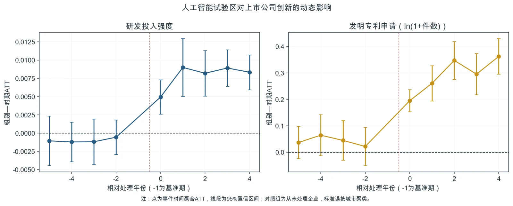

# 第14章 模型估计与证据检验

> “学而不思则罔，思而不学则殆。”
>
> ——《论语·为政》

{fig-alt=""}

孔子的这句话，恰好是实证研究最精炼的方法论。前三章我们做了大量“学”的工作——第11章收紧研究问题并完成文献定位，第12章形成识别策略和研究设计书，第13章明确数据下载、清理、匹配和变量构造的完整规则。分析数据集不会自动变成结论，你还需要“思”：面对输出，判断估计量回答了什么、识别条件是否可信、哪些结果可以解释，哪些只能保留为疑问。反过来，“思而不学则殆”同样危险——有些人热衷于跑回归、调模型、试各种设定，却没有扎实的研究设计和干净的数据做支撑，跑出来的结论经不起推敲。本章要做的，就是把“学”和“思”结合起来：在扎实的数据准备基础上，用清晰的逻辑去分析、检验和解释。这一章是整个第三部分最核心的一章。我们要回答这样一些问题：什么是基准回归？它为什么是整个实证分析的锚点？稳健性检验到底在检验什么？

异质性分析为什么重要？以及最关键的——怎么搞清楚为什么会这样，也就是机制分析。换句话说，这一章要带你理解实证研究的四个核心步骤：主回归、稳健性检验、异质性分析和机制分析，每一步的逻辑是什么、它们之间的关系是什么。这里想先跟你说明一点：这一章不把重点放在逐行教代码。我们在第14.1节到第14.4节中，会一步步梳理实证分析的底层逻辑——用最朴素的语言讲清楚每一步在做什么和为什么要这样做。等你理解了这四步的逻辑之后，第14.5节会用人工智能试验区研究案例，带你走一遍完整的分析流程。之所以这样安排，是因为我们相信：在动手写代码之前，你应该先知道自己在干什么。代码只是工具，逻辑才是研究的灵魂。第14.1—14.4节按照主结果、稳健性、异质性和机制证据组织内容。

这是一种常见的应用研究结构，不是每项研究都必须照搬的“四步走”。我们的人工智能试验区案例属于交错实施的DID情境，因此尤其重视动态效应和识别威胁；其他设计应根据自己的目标参数和假设调整分析顺序。好，我们开始。

## 14.1 主回归：基准回归是研究的锚

### 14.1a 什么是基准回归

在实证研究中，直接对应主要研究问题和预先选定识别策略的估计通常称为**基准回归**（baseline regression）或主估计。它给出目标参数的点估计和不确定性；能否解释为因果效应，取决于研究设计和识别假设，而不取决于这张表被称为“基准”。回到人工智能试验区案例。第11章确定研究问题与文献位置，第12章完成识别设计，第13章落实政策事实、企业数据和变量构造。现在要把研究设计书中的抽象方程变成可执行分析，检查教学样本中的点估计、区间和不同估计方法之间的差异。基准回归是起点，而不是最终答案。我们不妨先用一个更生活化的例子来理解基准回归。假设你是一个医生，要给病人做一次全面检查。基准回归就像量血压、测心率这类基础检查：它不是诊断的全部，但是后续判断的起点。

同样，实证研究要先用基准回归明确估计的对象、方向、量级和不确定性，再围绕识别威胁、群体差异和可能渠道继续分析。基准回归是参照系，不是因果结论的自动保证。那么，一个好的基准回归应该长什么样？它有四个基本特征。第一，**识别策略清晰**。你在跑基准回归之前，必须非常清楚自己用的是哪种识别策略。不同的研究问题对应不同的识别策略——有的研究依赖个体固定效应消除不随时间变化的遗漏变量，有的研究利用政策的准实验特征构造处理组和对照组，有的研究寻找与核心变量相关但不直接影响被解释变量的工具变量。无论你选的是哪一种策略，基准回归就是把这个策略落实为具体的模型设定。你不能在跑完回归之后才说“哦，我这个回归大概相当于一个DID”——策略必须在回归之前就确定下来，回归只是执行这个策略。第二，**设定简洁但完整**。

基准回归应该用最直接的设定落实研究设计，同时包含识别策略所需的最低结构。比如，个体固定效应吸收不随时间变化的个体特征，时间固定效应吸收各个体共同经历的时间冲击；它们不能消除所有混杂。工具变量分析要同时报告第一阶段和第二阶段，并说明相关性和外生性为什么可信。控制变量则应根据事前因果结构和研究设计选择，不能靠穷举组合制造显著结果。第三，**结果可以解读**。跑完回归之后，你要能清楚地回答三个问题：系数的大小意味着什么？估计的不确定性有多大？它在经济上重要吗？这三个问题对应点估计、置信区间和经济意义。光说系数为正或显著不够；你要把研发投入强度的系数换算为百分点，并与政策前均值比较，或把专利变换值转换为读者能够理解的量级，同时诚实报告区间和识别限制——这才叫解读。第四，**可复现**。

别人用你的数据和代码，应该能跑出一模一样的结果。这听起来像是基本要求，但实际上很多研究做不到——因为变量的构造步骤没有完整记录、样本筛选的细节被省略了。一个好的基准回归，从原始数据到最终回归结果，每一步都是透明、可追溯的。当你把基准回归跑出来以后，你就有了一个锚点。后续所有的分析——稳健性检验、异质性分析、机制分析——都是围绕这个锚点展开的。稳健性检验问的是：这个锚点在不同的设定下还站得住吗？异质性分析问的是：这个锚点在不同群体身上是一样的吗？机制分析问的是：这个锚点背后的传导链条是什么？所以，跑好基准回归不是研究的终点，但它决定了你整个研究的航向。

### 14.1b 跑基准回归前的四个关键决策

虽然本节不涉及具体软件操作，但我们仍然需要理解基准回归在实现层面的几个关键决策。这些决策是你面对任何一个研究问题时都需要思考的，与具体用什么软件无关。不管你的识别策略是OLS、面板固定效应、DID、IV还是RDD，下面这四个决策都是绕不开的。

**选什么识别策略？** 这是你在第12章就应该解决的问题，但它直接决定了基准回归的方程长什么样。不同识别策略有不同的模型要求。面板固定效应通常用个体效应吸收时间不变的个体特征，用时间效应吸收各单位共同经历的时间冲击。工具变量法需要第一阶段和第二阶段估计，并单独论证相关性和外生性。DID通过处理组与对照组的时间变化差异构造反事实；断点回归则需要设定断点两边的局部回归、带宽和相应识别诊断。选择哪一种策略，取决于三个因素。一是研究问题和制度背景：是否存在可用于构造反事实的政策分批、阈值或外生变动？二是数据结构：是否有政策前后的面板数据、可比的未处理单位，或可信的工具变量？

三是处理时点：如果一部分单位在同一时点受处理，另一部分单位作为未处理对照，可以使用经典的2×2 DID；如果不同单位在不同时点先后受处理，则需要适合交错处理的DID估计方法。若所有单位在同一时点都受处理且没有其他对照，标准DID无法仅凭前后变化识别政策效应。选好识别策略之后，基准回归的方程结构就基本定下来了。你不需要先学完所有的识别策略再开始做研究——你只需要深刻理解你选的这一种，搞清楚它的假设是什么、方程怎么写、结果怎么解读。其他策略在你以后遇到不同的研究问题时会自然接触到。

**选什么控制变量？** 控制变量的选择，是初学者最容易纠结的地方。一方面，你担心控制太少，怕遗漏了重要的混杂因素，导致估计有偏；另一方面，你又担心控制太多，怕加入不必要的变量反而降低了估计精度，甚至引入了新的问题。控制变量不能仅凭“同时与X和Y相关”来选择。真正需要处理的是处理发生前、会打开处理与结果之间非因果路径的共同原因；只预测结果的事前变量可能提高精度。工具变量、处理后的中介变量和碰撞变量即使同时与X、Y相关，也不应机械放入主回归。但问题在于，你怎么知道哪些变量同时跟X和Y都有关？答案是：你不可能完全知道——但你可以从两个来源获取指引。第一个来源是经济学理论。你的研究关注的是X对Y的影响，经济学理论通常会告诉你哪些因素同时影响这个关系中的双方。

比如，在研究教育对收入的影响时，经济学理论告诉你，能力既影响教育水平（能力高的人倾向于受更多教育）、又影响收入（能力高的人本身收入就高）——所以能力是你需要控制的混杂因素。第二个来源是已有实证文献。前任研究者在你这个领域做了大量工作，他们的控制变量选择是你最重要的参考——但注意，你要理解他们为什么选这些变量，而不是机械地照搬。具体到操作层面，控制变量的选择有一个实用的原则：在跑基准回归之前，把控制变量清单列出来，写下每个变量为什么要控制。这份控制变量说明书不需要很长——每个变量一句话的理由就够了。这样做有两个好处：第一，它强迫你在看到回归结果之前就想清楚控制变量的逻辑，避免事后试各种组合；第二，它让你在论文的数据与变量部分有话可说——你可以明确告诉读者，我们控制了X，因为理论或前人研究指出X同时影响A和B。

如果在做完基准回归之后，你发现某个控制变量的系数符号和量级与常识严重不符——比如企业规模越大，研发投入强度反而出现难以解释的极端变化——那需要回溯检查变量定义、分母异常或极端观测。但你不能因为某个控制变量的系数不好看就把它删掉。控制变量应当依据研究设计预先确定；如果它可能是政策的下游结果，属于坏控制，就应从总效应主回归中移出，并把这一研究选择说清楚。

**标准误怎么处理？** 标准误衡量的是你估计的核心系数有多精确。标准误越小，说明你的估计越精确，越容易检测到真实的效应。但标准误的计算方式如果不正确，你得到的精确就是假的——可能标准误被严重低估了，导致你认为显著的系数实际上并不显著。在微观实证研究中，最需要关注的一个问题是**标准误的聚类**。什么是聚类？简单来说，当你的数据中存在组内相关时——即同一组内的观测之间存在相关性，不满足标准回归模型中每个观测相互独立的假设——你就需要把标准误聚类到那个组的层面。举个例子。你用的是企业面板数据，同一家企业不同年份的创新活动显然相关；更重要的是，本案例的政策处理在城市层面变化，同一城市企业可能共同受到地方产业环境和政策执行的影响。如果仍把所有企业—年份观测视为彼此独立，标准误很可能被低估。

原则上应把标准误聚类到政策发生变异的城市层面，并在处理城市数量有限时进一步采用适合少量聚类的稳健推断方法。聚类到哪个层面，不是随意决定的。一个实用的原则是：聚类到你的**处理变量发生变异的层面**。举例来说，如果在你的研究中，政策是在省份层面实施的——某个省实施了政策，某个省没实施——那么同一个省内所有家庭的处理状态是一样的，它们不是独立的。这种情况下就应该聚类到省份层面。如果在你的研究中，处理变量是在个体层面变化的——比如每个家庭获得的补贴金额不同——那么聚类到个体层面通常就足够了。除了聚类，另外两个常见的标准误问题是异方差和自相关。异方差指不同观测的误差项方差不一样——比如大型企业的专利波动可能比小型企业更大。自相关指同一个体在不同时间的误差项之间相关。

现代计量软件通常可以直接输出聚类稳健标准误，但“指定一个聚类变量”并不意味着推断自然可靠：聚类层级应与处理分配和误差相关结构对应，聚类数量也要足以支撑渐近近似。

**模型设定的具体形式。** 你的被解释变量要不要取对数？你的核心解释变量是放水平值还是取对数？固定效应应该控制到哪个层面？这些看起来像是细节问题，但它们会影响你的估计结果和解读方式。被解释变量取对数的做法在经济学实证研究中极为普遍——尤其是在被解释变量是金额或数量时。取对数的好处有两个。第一，它让系数可以近似解释为百分比变化，便于不同量级的观测之间比较。第二，它可以压缩分布范围，减轻极端值的影响。本案例的专利申请数包含大量零值，因此使用\(\ln(1+\text{申请数})\)时必须明确变换方式，并用原始计数、专利授权或适当计数模型作替代检验；研发投入强度是比例变量，不能机械套用对数系数的解释。固定效应的层级选择取决于识别策略和数据特征。

企业固定效应可以消除企业文化、长期管理风格等不随时间变化的特征，年份固定效应可以吸收全国共同冲击。但企业固定效应也会吸收所有时间不变的企业属性，使你无法单独估计这些属性的水平效应。若加入城市×年份固定效应，又会把城市层面的试验区处理变量一并吸收。固定效应不是越多越好，而要与处理变量的变异来源和研究问题一致。还有一个容易被忽视的选择是处理变量如何编码。试验区批复发生在一年中的不同月份，而企业研发和专利数据按年度记录，因此批复当年究竟算已处理还是部分处理并不显然。主分析应预先确定一个有现实依据的口径——本案例从批复后的第一个完整年度开始取1——再把“批复当年即进入处理”作为替代口径检验。不能看到哪种编码更显著，就临时把它改成主口径。

以上四个决策——识别策略、控制变量、标准误、模型设定——在你坐下来跑基准回归之前就应该逐一思考过。它们不是在回归之后补上去的说明，而是回归的有机组成部分。做好这四个决策，你的基准回归就有了一个坚实的起点。

### 14.1c 读懂回归结果：那些数字在说什么

跑完基准回归之后，你会面对一张回归输出表。对于初学者来说，这张表可能像天书——几十个数字挤在一起，不知道哪个是关键、哪个可以忽略。其实，你只需要关注四个核心信息。下面我们用最朴素的语言逐一拆解。

**核心解释变量的系数。** 这是整张表中最重要的数字——它直接回答研究问题。在我们的人工智能试验区案例中，核心变量是城市—年份层面的处理状态。研发投入强度回归中的系数表示政策后该比例平均变化多少；专利变换值回归中的系数表示创新产出的相对变化。系数方向只是第一步，还要同时看置信区间、经济量级以及它来自TWFE还是交错DID估计。系数的大小需要结合被解释变量单位来理解。如果研发投入强度用0—1表示，系数0.01表示提高1个百分点，而不是提高1%；若用0—100表示，解释又不同。如果被解释变量取自然对数，系数可以近似换算为百分比，但\(\ln(1+y)\)在零值很多时不能简单等同于原始计数的百分比变化。所有解释都应以实际编码为准，并最好与政策前均值比较。很多初学者会问：系数多大才算大？这个问题没有标准答案——它取决于研究情境、结果变量基准水平和政策成本。研发投入强度提高0.1个百分点，对原本投入很低的企业可能重要，对高研发企业则未必；一个统计显著的专利变换系数，也可能对应很小的原始专利增量。判断大小的标准不是数字本身，而是它在现实世界中意味着什么。

**标准误和显著性。** 标准误衡量的是系数估计的不确定性。你可以把它理解为系数估计值的误差范围——标准误越小，说明我们对该系数的估计越精确。标准误的大小受两个因素影响：样本量和数据中的噪音。样本量越大，标准误通常越小，因为更多信息让估计更精确；数据中的噪音越大，标准误越大，因为被解释变量本身的波动让系数更难精确估计。显著性标记通常由检验的$p$值生成，常见表格用一颗、两颗和三颗星对应预先约定的10%、5%和1%阈值。$p$值描述在原假设及统计模型成立时，得到当前或更极端统计量的概率；星号不是“参数为正的信心”，也不应代替点估计和置信区间。这里有一个初学者很容易混淆的概念，需要特别澄清：**统计显著不等于经济重要。** 统计显著只说明数据对“系数为零”提供了多强的反对证据，并不直接告诉你系数大不大。如果样本量极大，哪怕很小的系数也可能统计显著；反过来，一个经济上可能重要的效应，在处理城市较少、政策后窗口较短时也可能估计得很不精确。成熟的研究者看到结果时，第一反应不应只是“有没有星”，而应同时问：点估计多大、置信区间多宽、它在现实世界意味着什么、研究设计是否可信。

**样本量和拟合优度。** 样本量通常标为\(N\)或观测数，它帮助判断有多少信息进入估计以及样本在哪些列发生变化。观测数多并不自动让设计更可信；在政策层面处理的研究中，独立处理地区和批次数可能比企业—年份总数更关键。若原始数据有一万个观测而回归只剩三千个，应排查变量缺失和筛选过程，并比较处理组与对照组的流失是否不同。拟合优度常用\(R^{2}\)或调整\(R^{2}\)表示，但不同软件会对固定效应模型报告总体、组内或组间\(R^{2}\)，含义并不相同；调整\(R^{2}\)在某些设定下还可能小于0。加入大量固定效应可能使总体拟合度很高，却不代表处理效应识别得更可信；组内\(R^{2}\)较低也不等于模型失败。时间序列中的共同趋势同样可能产生很高的拟合度而没有可靠因果关系。因此，阅读回归表时先确认软件报告的是哪一种\(R^{2}\)，再把它作为描述信息，不能用高低判断研究质量。

**控制变量的系数。** 严格来说，控制变量的系数不是基准回归关注的焦点——它们存在是为了改善可比性，而不是回答研究问题。在报告结果时，通常不需要逐一解读控制变量系数。但要检查方向和量级是否暴露变量定义、单位或异常值问题。例如资产负债率超出合理范围、研发投入强度因营业收入接近零而异常，都应回到数据处理环节核查，不能靠删变量解决。读懂回归结果的核心能力，不是背下每个数字的含义，而是区分估计对象、点估计、不确定性和辅助信息。核心变量的系数与置信区间要结合识别设计解释；控制变量、样本构成和拟合优度帮助读者理解设定，但不能单独决定因果结论是否可信。

### 14.1d 回归结果如何呈现：从数字到表格

跑完基准回归之后，你面对的是一个软件输出窗口——里面有回归系数、标准误、$t$值、$p$值、置信区间……但这些密密麻麻的数字不能直接放进论文里。你需要把它们整理成一张规范的**回归表**。回归表是实证论文的核心信息载体。一张好的回归表，不是把所有数字都塞进去，而是有选择、有层次地呈现关键信息。那么，一张标准的回归表应该包含哪些要素呢？表格首先要突出核心解释变量的点估计及其不确定性。可以在系数下方报告标准误，也可以直接报告置信区间。若使用星号，必须在表注中说明阈值；星号只是可选的辅助标记，不能替代区间和经济量级。然后是控制变量。如果控制变量不多——比如三到五个——可以把它们的系数也逐一列出来，每个变量一行，系数加标准误。

如果控制变量很多——十个以上——通常不需要逐一列出，可以在表格中加一行“控制变量：是”或“控制变量：否”，让读者知道每列是否加入了控制变量。具体的选择可以参考你目标投稿期刊的惯例。再往下是模型设定的信息。固定效应是否加入，通常用“是/否”标注一行或几行。这很重要，因为固定效应会改变用于识别的比较：没有企业固定效应时，估计同时利用企业之间和企业内部的差异；加入企业固定效应后，时间不变的企业差异被吸收，核心比较更多来自同一企业随时间的变化。然后是样本和拟合信息。除观测数外，面板研究通常还应报告企业数，政策评估还要报告处理地区数和批次数。\(R^{2}\)是否适用、报告总体还是组内指标，取决于模型和软件。标准误或置信区间的构造方法及聚类层级要在表注中说明，本案例原则上聚类到城市层面。除了表的内容，表的外围同样重要。

表的标题要能告诉读者这张表在回答什么问题——不要只写“表1 回归结果”，而应该写“表1 人工智能试验区对上市公司研发投入与发明专利申请的影响”。表注要说明估计方法、处理起点口径、对照组、标准误聚类层级、固定效应、控制变量、样本限制和数据来源。一张没有表注的回归表，就像一个没有说明书的电器——读者无法准确理解每个数字。还有一个实用的设计技巧：如果研究有多个相关被解释变量——比如研发投入强度和发明专利申请——可以把它们并排放在同一张表的不同列中，让读者同时看到投入与产出。不过，两类结果可能使用不同有效样本，必须明确报告各列观测数。如果只有单一被解释变量，多列通常对应不同模型设定——从简单设定到逐步加入控制变量。递进式呈现让读者看到系数如何变化，但不能把“逐列试到显著”为目的。到这里，基准回归部分就结束了。

你手里现在有一个待检验的核心估计，但研究不能停在这里。审稿人和研究者自己都会继续追问：这个结果经得起推敲吗？下一节讨论这个问题。

> **专栏14-1 奥卡姆剃刀：模型真的是越复杂越好吗？**
>
> 奥卡姆剃刀常被概括为“如无必要，勿增实体”。它并不是要求所有解释都越简单越好，而是在多个解释都能说明现象时，不要平白增加没有作用的假设。放到计量经济学中，这条原则提醒我们：模型的价值不由变量数量、公式长度或技术名称决定。
>
> 初学者常把“控制得更多”理解为“估计得更准”。于是，地区特征、企业特征、各种固定效应、交互项和高次项不断进入同一条回归。更多变量有时确实能减少遗漏因素的干扰，但也可能消耗有效变异、放大共线性、降低估计精度，甚至把政策影响之后才发生的变量错误地控制掉。模型变长了，因果含义反而可能更模糊。
>
> 拟合程度也不是复杂模型的通行证。加入足够多的变量，样本内的\(R^2\)通常不会下降，但模型可能只是在记住样本中的偶然波动。一个模型能够更贴近已经看到的数据，不等于它更能解释经济机制，也不等于其核心系数更接近因果效应。
>
> 奥卡姆剃刀在实证研究中的合理用法，是寻找“足以回答问题的最简模型”。处理变量和固定效应由研究设计决定，控制变量来自政策前的经济逻辑，非线性和交互项则应对应明确的理论或数据特征。每增加一项设定，都应该说得清它在解决什么问题，而不是因为软件可以轻易运行。
>
> 判断一项变量是否该进入模型，可以先问它在经济过程中处于什么位置。政策实施前已经决定、同时影响处理与结果的变量，可能是需要处理的混杂因素；政策实施后才变化的融资、用工或研发决策，则可能位于作用渠道上。二者看起来都与结果相关，在回归中的含义却完全不同。模型简约首先来自因果结构清楚。
>
> 这也不意味着只报告一条最简单回归。研究者可以从基础设定逐步加入必要控制，并观察核心估计为何变化；还可以用替代设定检验结论是否依赖某个选择。关键是让模型之间的差异服务于论证，而不是把很多结果堆在一起等待读者自己判断。
>
> 对人工智能试验区案例而言，最重要的不是把所有城市和企业变量塞入模型，而是先确定处理时点、比较组和估计对象，再选择政策前已经确定且有经济含义的控制变量。复杂性只有在解决真实问题时才有价值。一个结构清楚、假设透明的模型，往往比一条看似无所不包的回归更可信。

## 14.2 稳健性检验：让结论经得起推敲

### 14.2a 什么是稳健性检验？它检验的是什么？

基准回归给了你一个点估计，但任何一个负责任的读者——包括你自己——都会追问：这个数字可靠吗？它是否由特定处理时点、对照组、样本范围、估计方法或同期冲击驱动？稳健性检验就是用来回答这些具体追问的。稳健性分析针对研究设计中的具体选择和威胁，考察结论在合理替代设定下如何变化。不同设定若改变了样本、目标参数或识别假设，系数本来就可能不同，不能要求所有结果机械一致。某项分析出现差异时，首先要判断它是在暴露脆弱性，还是回答了另一个问题。稳健性分析更像一组有针对性的诊断。处理时点口径、对照组选择、同期政策和聚类推断分别对应不同风险；把它们混成“多做几项、相互印证”会掩盖每项检验的作用。这里有一个非常重要的思想需要从一开始就建立：稳健性检验的目的不是让结果更好看，而是诚实地检验结果的可靠性。如果你只挑那些跑出来显著的稳健性结果报告，而把不显著的结果藏起来——那你不是在检验稳健性，而是在进行一种隐蔽的挑选。这种做法的结果只能制造你对结论的虚假信心，对研究质量没有任何帮助。一个真正成熟的研究者，会诚实地报告所有稳健性检验的结果——包括那些不好看的——因为这才是检验的本意。

### 14.2b 稳健性检验可以从哪些角度做

那么，具体可以从哪些角度折腾你的分析呢？大致可以归纳为四个方向。每个方向我们都详细展开，帮助零基础的你理解折腾的是什么以及为什么这样折腾是有意义的。

**改变模型设定。** 你的基准回归中用的那个方程——控制了哪些变量、加了什么固定效应——并不是唯一可能的设定。同一组数据和同一个研究问题，往往有几种合法的模型设定方式。稳健性检验的任务之一就是试试这些替代设定，看核心系数是否稳定。可以比较不含控制变量和加入预设政策前控制变量的设定，但要保持样本一致，以免把系数变化与缺失造成的样本变化混在一起。若加入某个变量后估计明显改变，应回到因果图和变量时间顺序，判断它是重要的事前混杂、提高精度的预测变量，还是不应控制的政策下游变量，不能仅按显著性决定去留。改变固定效应的组合是另一种常见的折腾。你的基准回归可能控制了个体和年份固定效应，但有人可能会问：同一个省内不同县之间可能存在共同的时变冲击——比如省里出台了某项配套政策——你控住了吗？你可以试试加入省份乘年份的固定效应来处理这种顾虑。如果加入这个更高维度的固定效应后核心系数基本不变，说明你的基准结果不是被省级层面的时变冲击驱动的。

**改变样本范围。** 你的基准回归用了全部样本，但要问：如果去掉具有特殊政策环境或极端影响力的子样本，结果会变吗？剔除样本的逻辑不是随便删一些看看，而是针对具体质疑。本案例可以逐一排除直辖市或单个处理城市、企业迁址样本、疫情冲击特别严重的城市—年份，以及与其他重大数字政策高度重叠的城市。每次检验都应说明针对哪项威胁，而不是把不喜欢的观测删掉。若最早处理批次具有特殊经济基础，可以报告留一批次分析或分批次效应。不过，删除早期批次会改变目标总体和可用政策后窗口，结果变化不一定等于选择偏差。报告时要同时说明删掉了谁、剩余估计代表谁。还可以尝试限定时间窗口。你的面板数据可能跨越很多年，但你的研究关注的政策效应主要集中在实施前后的几年。把分析窗口缩小到政策实施前后各两三年——排除了太过遥远年份的干扰——看核心系数是否稳定。这种窄窗口检验在DID和RDD研究中都很常见。

**改变变量定义。** 每个变量都可能有合理的替代口径。本案例可以把研发投入强度替换为研发支出对数或其他分母口径，把发明专利申请替换为授权、总专利或原始计数；把主处理口径“批复后首个完整年度”替换为“批复当年”；把政策前固定注册地址替换为政策前固定办公地址，并报告迁址样本处理。缩尾比例等数据选择也应做敏感性检验，但每一种替代都要有经济和测量依据。这些换个定义看看的检验，目的是确认你的核心发现不是某个特定变量定义方式的人为产物。如果换了几种合理的替代定义后核心系数都基本一致，你就不用担心自己的结果恰好是某种定义方式下的侥幸产物。但如果换了某种定义后结果出现了巨大差异，那就需要仔细思考：是替代定义本身有问题，还是你的基准定义存在你之前没意识到的缺陷？

**改变估计方法。** 替代估计量必须与同一研究设计和目标参数相容。一阶差分与固定效应对误差结构和测量误差的反应不同；系统GMM只适用于具有相应动态结构和矩条件的面板模型，不能当作一般稳健性工具。交错DID应使用能够处理处理时点与效应异质性的估计量，并说明聚合权重。IV研究若担心弱识别，可以同时报告LIML和弱工具稳健置信区间，但LIML也不能修复无效工具。但这里有一个重要的边界：不是所有换方法都有意义。你换的方法必须和你的研究设计相关。如果换了一个完全不适用于你研究情境的方法——比如在截面数据中用需要面板数据的方法——那这个检验本身就没有意义。同时，你也不需要把所有的替代估计方法都列出来——选一到两个与你的识别策略最直接相关、最可能在方法学上回应质疑的替代方法就够了。稳健性检验没有必须达到的数量。先列出最可能改变识别或测量的威胁，再为每项威胁安排诊断、替代设定和判据。没有对应威胁的“换模型”不应为了凑表格保留。

### 14.2c 识别假设的检验：不同方法有不同的必答题

每一种识别策略都有它的核心假设——这些假设如果不成立，你的因果估计就可能存在问题。因此，检验识别假设是否大致成立，是所有实证研究中的一项必答题。不同的识别策略有不同的必答题，下面我们逐一来看。

**DID首先要讨论平行趋势。** 该假设涉及处理后的未处理潜在结果，因而不能直接检验。政策前的原始趋势和事件研究系数可以发现明显预趋势或提前反应，但观察窗口短、样本量小或置信区间宽时，“没有显著差异”提供的信息很有限。事件研究图以某个处理前时期为基准，展示各相对时期的组间动态差异。政策前要同时阅读点估计、置信区间和联合检验，并判断区间能否排除经济上重要的先行变化。政策后的系数只有在平行趋势等条件成立时才能解释为动态处理效应；“前期跨零、后期显著”不是预设的合格图形。

IV既要讨论识别强度，也要论证工具有效性。第一阶段统计量的适用形式取决于单工具、多工具、异方差和聚类结构。“F大于10”只是特定简单设定下的历史经验规则，不能证明工具足够强，更不能验证外生性。论证外生性时，要分别排查未观测共同原因和违反排除限制的其他路径。弱识别时应报告适合当前设定的诊断和弱工具稳健区间；LIML可以作为补充估计，但不是自动修复。

**RDD要检查运行变量与处理前协变量。** 连续性框架要求潜在结果在门槛处连续，并排除其他制度规则在同一门槛同时跳变。研究者应检查运行变量密度、可能的操纵或取整，以及处理前协变量是否出现异常不连续。协变量平滑与设计相容，但不能证明所有未观测因素也连续。这些诊断不能被概括为一次统一的“假设检验”。DID关注反事实趋势，IV还需要无法直接检验的排除限制，RDD依赖门槛处连续性。共同的研究习惯是列出可能产生同样观测模式的竞争性解释，再判断哪些能够用数据诊断，哪些必须依靠制度事实。

### 14.2d 证伪检验：用不应该存在效应的情境来验证设计

证伪检验（falsification test）把同一设计用于理论上不应受处理影响的时期、群体或结果。若出现系统性“效应”，原设计可能捕捉了预趋势、选择或共同冲击；若没有发现异常，只能说该项证伪没有推翻设计，不能证明研究可靠。证伪检验这个思路最早来自医学中的安慰剂概念：在药物实验中，给对照组患者吃看起来像真药但没有药效的假药——安慰剂——如果吃了安慰剂的患者也好转了，说明药物的效果可能来源于心理作用而非药本身。经济学研究者借用了这个思路，创造了几种经典的证伪检验方式。第一种是假政策时点。分析应限制在真实政策尚未发生的时期，并保持与原设计相容的样本和处理分组。假时点出现系统性差异可能反映预趋势、预期效应或模型设定问题；不显著则仍可能来自检验功效不足。第二种是假处理组。

重新分配处理标签时必须保留真实政策的分配层级、批次数量、处理时点结构和组内相关，不能把企业标签逐行随机打乱。得到的随机化分布回答的是所设置置换机制下的比较问题；若真实政策并非随机分配，它通常只是安慰剂诊断，不自动成为有效的随机化推断。第三种是安慰剂被解释变量。你选择一个理论上不应在短期内被试验区直接改变的企业结果，检验模型是否也给出“政策效应”。安慰剂结果必须由清晰理论界定，不能故意挑一个噪声极大的变量来制造不显著。如果模型对大量事前已确定或与政策渠道无关的结果都给出明显影响，就要警惕它捕捉的是城市选择、共同趋势或其他混杂因素。证伪检验的关键是事先说明为什么该时期、群体或结果不应受影响，并说明检验功效。通过一项安慰剂只排除了相应的某类异常，不能证明政策“确实不起效”，也不能覆盖其他识别威胁。

### 14.2e 稳健性检验的边界：做多少才算够？

做多少稳健性检验才算够？这可能是每个初学者都会问的问题。有些顶级期刊的论文，稳健性检验占了全文一半的篇幅；有些论文则只在脚注里提一句替换变量定义后结果稳健。到底该信哪一种？答案是：不以数量为标准，以是否回应核心威胁为标准。不存在适用于所有论文的四项、八项或其他固定数量，而且任何有限检验都不可能穷尽所有质疑。这里要特别警惕两种错误倾向。第一种是装饰性稳健性——研究者为了让论文看起来严谨，机械地把各种稳健性检验都往文章里塞，但其中很多跟具体研究没有真正的关联。审稿人一眼就能看出这是在凑数，反而会降低研究的可信度。第二种是用稳健性来掩盖问题——基准回归结果不理想，研究者尝试了几十种设定，最终在某个特定设定下找到了显著结果，然后把这个设定作为基准回归，把其他设定作为稳健性检验。

这本质上是一种隐蔽的p-hacking，不是稳健性检验的本意。一个好的习惯是：在主回归之前就规划好稳健性检验的路径。你心里已经想好了：如果审稿人质疑A，我用检验B回应；如果质疑C，我用检验D回应。这样当你跑完基准回归之后，无论结果是显著的还是不显著的，你都会按照既定的方案把稳健性检验跑一遍，诚实地报告每一项结果。这种先有预案、再执行的流程，不但是研究的纪律，也是学术诚信的体现。

> **专栏14-2 先射箭再画靶：为什么反复尝试总能找到“显著结果”**
>
> 想象一个人先朝墙上随意射箭，再围着箭落下的位置画出靶心。最后展示照片时，他看起来百发百中。问题不在射箭技术，而在靶心是看到结果以后才确定的。计量分析中，如果研究问题、样本和模型都随着结果不断改变，也会出现类似的“神准”。
>
> 一项研究可以选择多个结果变量、不同样本区间、若干缩尾比例、几套控制变量和多种固定效应。每项选择本身可能都有理由，但把它们自由组合后，尝试次数会迅速增加。如果20次彼此独立的检验都采用5%的显著性水平，即使真实效应全部为零，至少出现一次“显著”结果的概率也约为64%。偶然命中并不罕见。
>
> 真正危险的不是探索，而是只展示命中的那一箭。研究者可以在探索阶段查看不同变量和设定，从中发现数据问题或形成新假说；但探索所得的发现需要被标明，不能伪装成事先提出的检验。若只保留最符合预期的结果，读者就无法判断星号来自稳定关系，还是来自大量未被报告的尝试。
>
> 不显著结果同样包含信息。它可能说明效应很小，也可能说明样本不足以排除较大的正负效应，二者需要通过置信区间区分。若研究者把“不显著”等同于“没有价值”，就会产生不断换模型的冲动。允许数据给出接近零、不精确或与预期相反的答案，是避免先射箭再画靶的第一道防线。
>
> 降低这种风险，要从分析前开始。主要结果、样本范围和核心模型应尽量依据研究设计预先确定；分析过程中确需调整时，应记录修改原因，并保留对结论有实质影响的设定。涉及多个结果或大量分组时，还可以报告多重检验调整、完整结果表或设定曲线，让读者看到结论对分析选择有多敏感。
>
> AI和自动化代码使批量运行模型变得很容易，这既提高了效率，也让“试到显著”为止更加隐蔽。工具可以一次生成上百条回归，却不能替研究者区分诊断、探索和正式检验。稳健性分析的目的，是主动寻找结论可能失败的地方，而不是从许多模型中挑出最漂亮的一条。

## 14.3 异质性分析：平均效应掩盖了什么

### 14.3a 为什么不能只看平均效应

基准回归给出一个平均处理效应，但这个平均背后很可能藏着巨大差异。无论平均效应显著与否，都可以在有理论依据和足够统计功效的前提下研究异质性。你想想看，一家融资约束较强、缺少研发平台的民营企业，和一家已有稳定研发体系的大型国有企业——同样位于试验区，获得政策资源、吸收技术和调整研发决策的能力可能截然不同。高技术行业与传统行业、政策前创新基础不同的企业也可能作出不同反应。如果只看平均效应，就会错过一个重要问题：**政策在谁身上最起作用？** 这就是异质性分析要回答的问题。平均效应可能掩盖完全不同的分组故事。只看平均数，你可能得出政策有效的结论；分组以后，却可能发现政策只对某类企业有效，对其他企业几乎没有作用，甚至方向相反。这样的差异往往比一个笼统的“平均效应显著”更有政策价值。

异质性分析可以描述政策影响如何分布，并检验理论对组间差异的预测。若政策目标群体的估计效应较大，这与政策精准性的设想相容，但仍需直接检验组间差异并处理多重比较。异质性也可以提供机制线索和政策调整依据，不过不能单凭分组模式确认传导渠道。因此，在主回归和稳健性检验之后，做异质性分析是自然而然的下一步。主回归告诉你政策有没有效果，稳健性检验告诉你这个结论可不可信，异质性分析则进一步告诉你——对谁更有效。

### 14.3b 两种主流思路：分组与交互

做异质性分析，有两种最主流的思路：一种是**分组回归**，另一种是**交互项分析**。这两种方法考察的是同一个问题——效应在不同群体之间是否不同——但实现方式不同，各有优缺点。分组回归的思路最为直观。你把全样本按某个预先设定的维度切成两组或多组，然后在每一组分别估计处理效应。比如按政策前企业规模或融资约束把样本分组，比较不同组的点估计和置信区间。分组结果首先是描述性的，不能仅凭一组显著、另一组不显著就宣布两组效应不同。分组回归的好处是直白易懂——谁都能看出两组效应不一样。图表呈现也特别直观：你可以画一张系数图，每个分组的估计值和置信区间各画一条线段，读者一眼就能看出哪组效应大、哪组效应小。但分组回归也有一个重要的局限：分组会减少每个子样本的观测数量，导致估计精度下降。

如果你的样本本来就不大——比如说总共只有一千多个观测——再一分为二甚至一分为三，每组里可能就只剩几百个观测了。观测数少了，标准误会变大，原来显著的效应可能在子样本中变得不显著——这不是因为效应消失了，而是因为样本量不足以精确估计这个效应。交互项分析的思路不同。它不在子样本上分别跑回归，而是在全样本方程中加入处理变量与分组变量的交互项。比如处理变量乘民营企业虚拟变量，交互项反映民营企业与基准组处理效应的差异。解释时要把主效应和交互效应合起来，并报告组间差异的置信区间。对于交错DID，异质性分析还要使用与主估计量兼容的做法，不能把简单TWFE交互项自动当成最终答案。交互项分析的主要优势是把组间差异写在同一个模型中，并能直接给出差异估计及其置信区间。

在正确指定主效应、交互项、固定效应和标准误后，交互项检验可回答两组效应是否相同。它有时能共享部分参数、提高精度，但标准误不必然比分组回归更小；若全样本模型允许所有相关参数按组变化，交互模型与分别估计可能在代数上等价。在实际研究中，可以用分组点估计和置信区间展示各组量级，再用同一模型中的交互项或其他适当线性组合正式检验组间差异。不能根据“一组显著、另一组不显著”推断两组不同；还要说明分组是否预先设定，并注意多重检验。

### 14.3c 常见的异质性维度及其背后的逻辑

那么，按什么维度分组呢？这不是随便挑的。每一个异质性维度都应该有经济学或政策上的理由。如果你只是机械地把所有可能的维度都做一遍——按性别、按年龄、按地区、按收入、按教育——一来机械堆砌没有思想深度，二来审稿人会问：你到底在检验什么？一个好的做法是：在做研究设计的时候——第12章——就想好两到三个有理论或政策依据的异质性维度。通常可以从这几个方向寻找灵感。第一，从政策逻辑出发。试验区强调技术示范、应用场景、创新生态和制度探索，哪些行业或企业理论上更容易利用这些资源？如果人工智能相关或高技术行业、具有一定吸收能力的企业反应更强，这与政策渠道一致；如果只有原本资源最充足的企业受益，也可能提示“强者更强”的分配效应。政策文件提供的是假说来源，不是预先确定结论。第二，从已有文献出发。

前人研究可能提示哪些企业特征会影响政策响应，例如融资约束、技术吸收能力、所有制和行业属性。文献可以帮助提出异质性假说，但不能替代本研究的组间差异检验，也不应为了迎合既有结论而事后改变分组规则。第三，从经济理论出发。企业对区域创新政策的反应可能取决于融资约束、吸收能力、技术机会和调整成本。资源约束视角可能预测约束较强企业受益更多；吸收能力视角则可能预测已有技术基础的企业反应更强。若不同理论给出相反预测，数据可以帮助区分其相对解释力，但异质性结果仍可能同时反映其他组间差异。在我们的人工智能试验区案例中，可以预先设定四个异质性维度：所有制、企业规模、政策前创新基础和行业技术属性。所有制与资源获取和治理约束有关；规模反映资源基础与调整能力；政策前创新基础对应吸收能力；高技术行业与人工智能应用场景更直接。

每个维度都要在看结果之前写清理由、分组规则和预期方向，避免“能分组就分组”的机械操作。

### 14.3d 异质性分析中常见的陷阱

异质性分析看似简单——不就是把样本切开再跑一遍吗——但其中有不少坑，初学者特别容易中招。第一个陷阱是分组过细。有人喜欢把连续变量切成很多段——比如把收入分成十组——然后在每组里跑回归。这样做有两个问题：一是每组样本量太小，估计结果极其不稳定——你可能看到效应先正后负再正的看似有规律但实际上只是噪音的模式；二是十组的结果放在一起，读者根本看不出规律。通常的做法是按中位数分成两组，最多按四分位数分成三到四组。分组的目标不是切得越细越好，而是分出有意义的对比。第二个陷阱是忽视组间差异的统计不确定性。你看到民营企业点估计较大、国有企业点估计较小，就匆忙下结论说民营企业受政策影响更大。但两者差异可能并不精确。因此，在分组估计之外，**一定要报告正式的组间差异检验及其置信区间**。

如果差异不显著，最多只能说点估计呈现某种模式但证据不足，不能把“一组显著、另一组不显著”写成两组显著不同。第三个陷阱是选择性报告。同稳健性检验一样，异质性分析同样存在选择性报告的道德风险。你做了五个维度的异质性分析，其中只有一个维度出现了统计显著的差异——于是你在论文中就只报告这一个维度，把另外四个不显著的藏起来。审稿人是有经验的：他们会检查你为什么选了这些维度——那几个没报告的结果去哪了？如果某个维度在理论上很自然——比如按性别分组——但你没有报告结果，审稿人很可能会追问。诚实地报告所有预设维度的结果——包括不显著的——才是可接受的学术实践。第四个陷阱是忽视组别构成。总体效应和分组效应可能方向不同，只看平均效应容易掩盖政策影响的分布。

不过，分组结果也不能自动取代总体结果；二者回答的问题不同，应同时报告各组估计、组间差异及其不确定性。

## 14.4 机制分析：搞清楚为什么

### 14.4a 从有没有影响到为什么会这样

完成主估计和稳健性分析后，你可能得到正效应、负效应、接近零但不精确的估计，或者发现识别诊断不足以支持强因果解释。只要数据和设计允许，下一步都可以考察可能的传导渠道；机制分析并不以主结果显著为前提。为什么人工智能试验区可能改变企业创新？一个可能渠道是地方政府增加创新补助和公共研发平台，另一个是试验区改善融资条件、人才集聚和应用场景，也可能通过产业集聚产生知识溢出。但政策也可能带来资源挤占、补贴寻租或企业只增加可见投入而没有形成产出。这些相互竞争的渠道提醒我们：机制分析要回答的是**X影响Y的传导链条是什么**，而不是为既有结果补一个好听故事。机制分析也叫渠道分析，它考察政策是否改变了理论所预测的中间结果，以及这些证据是否与主结果的时间和群体模式相容。

机制结果不能弥补主识别策略的缺陷，但可以检查主结果是否呈现理论预测的时间顺序和伴随变化。若机制指标没有变化，或只有部分渠道得到支持，研究也应如实报告。第二，提供可操作的政策启示。政策制定者不只关心试验区“有没有效”，也关心它通过什么环节起效、哪些环节需要加强、哪些副作用需要警惕。如果研发投入上升主要伴随政府补助和研发人员增加，政策讨论会不同于“只有补助增加但专利没有变化”的情形。机制证据使政策评估更丰富，但只有在识别和测量可信时，才能支持相应建议。机制分析还把理论预测转化为可观察结果。收入效应、替代效应、融资约束、人才集聚和知识溢出都需要落实为明确的时间顺序、变量与竞争性预测；数据只能在既定识别条件下支持或不支持这些预测，不能笼统“验证理论”。

### 14.4b 机制分析的几种常见思路

在经济学实证研究中，机制分析有多种思路。我们这里介绍三种最常用的。你可以只用其中一种，也可以组合使用——选择哪种取决于你的研究问题、数据可得性和理论框架。

**第一种思路**：直接检验 X 对 M 的影响。 这是最直白的机制检验方式。\(M\)代表位于政策与企业创新之间的候选传导环节。本案例可以考察政府补助、融资条件或融资成本、研发人员数量等是否随试验区获批发生变化。它们应作为机制回归的被解释变量，而不是直接加入总效应主回归把政策渠道“控制掉”。检验X对M的影响，逻辑上很简单：把机制变量\(M\)作为被解释变量，把处理变量\(X\)作为核心解释变量，重新估计与主分析一致的政策效应。如果试验区提高政府补助、改善融资条件或增加研发人员，这为相应渠道提供了证据。但“政策改变了M”并不自动证明“M导致了创新变化”；它只是传导链条的一部分，还要结合时间顺序、理论预测、替代渠道和测量误差谨慎解释。

**第二种思路**：用异质性作为机制的侧证。 这种思路不直接测量某个机制变量——因为很多机制变量本身就是很难精确测量的抽象概念——而是通过观察在什么条件下效应更大来推测传导渠道。这就是为什么我们在14.3节中说异质性分析和机制分析应该互相呼应。比如，你推测政策通过缓解融资约束促进创新，但融资约束是难以完美测量的抽象概念。你可以预先使用一种或多种常见融资约束指标，检验约束较强企业是否反应更大，并同时考察融资成本、现金持有或外部融资变化。这些结果如果方向一致，只能说“与融资约束渠道一致”，不能说机制被完全证明；因为分组指标本身可能同时代理企业年龄、规模和风险等其他特征。

**第三种思路**：用调节效应检查机制预测。 中介分析考察X→M→Y的传导，调节分析则询问X对Y的效应是否随处理前条件而变化。若理论机制对这种异质性作出清晰、预先提出的预测，交互项可以提供辅助证据；调节效应本身并不识别中介路径。例如，若经济约束是候选机制，理论可能预测政策对政策前金融服务较少、借贷成本较高的家庭影响更大。观察到这种预设异质性与该机制相容，但金融可得性也可能代理收入、地区发展或风险等特征。因而还应检验替代解释，并避免把事后分组当作机制确认。调节效应的优势在于，它不要求你直接测量那个抽象的机制变量本身。你不需要给每个家庭精确测出一个经济约束指数——你只需要用可观测的特征——如收入水平、金融可得性、资产状况——来代理。

这在实际研究中极其有用，因为很多真实的传导机制——如被压抑的教育意愿、被低估的教育回报、信息不对称导致的选择偏差——都是抽象的理论概念，很难直接测量，但它们的经济学预测是可以在数据的异质性和调节效应中得到检验的。机制分析应先提出能够与替代解释区分、并可由数据检查的预测。无论考察X对M、预设异质性还是调节效应，都要说明变量在传导链中的位置、预期时间顺序以及可能产生相同现象的其他路径。不同证据可对候选机制提供程度不一的支持或反对，但单个统计检验通常不能识别完整传导链。

### 14.4c 理论与实证在机制分析中的关系

机制分析是理论和实证关系最密集的研究环节。在这里，你的经济学理论功底和你的数据分析能力需要紧密配合。理解了它们之间的关系，你在做机制分析时就不会跑偏。理论在机制分析中的作用是提供候选渠道。在你动手分析数据之前，经济学理论已经在告诉你X可能通过哪些渠道影响Y。这就是为什么很多研究在引言或理论框架部分会明确提出几个待检验的机制假说。理论的作用不是替你证明哪个渠道是真的，而是帮你圈定一个候选渠道清单——你在数据中要检验的对象。一个好的理论框架会让你的机制分析有方向——你不是在黑暗中摸索X跟什么变量相关，而是在理论的指引下去验证那种相关的存在方式是否符合理论预测。来看看当代经济学文献中一些典型的机制分析实例，你会对理论和实证如何配合有更直观的感受。

以生成式AI与劳动力需求为例，理论上至少存在替代和生产率两种方向相反的渠道。模型若能直接完成某类任务，相关劳动需求可能下降；若它降低生产成本并扩大产出，与AI互补的劳动需求也可能上升。实证研究应在分析前界定任务暴露和互补性，再检验不同职业的就业、任务量和收入是否符合这些竞争性预测，不能看到分组差异后才给职业贴标签。还可以把信号传递写成一个待检验的机制。若大语言模型降低申请材料的制作成本，材料质量与求职者能力之间的关系可能减弱，雇主也可能降低对这类材料的权重。完整分析需要分别观察工具普及前后的材料—能力关系和雇主决策权重，并排除求职者构成、岗位需求和招聘平台规则同步变化等解释。即使各项证据方向一致，也应写成“与信号弱化机制相容”。这两个例子说明，机制假说应当先于结果提出，并尽量写出可区分的预测。

实证部分再按时间顺序检查各环节，同时列出可能产生相同模式的替代解释。

### 14.4d 经济学中机制分析的特殊性

经济学的机制分析和心理学、社会学中的中介效应模型有重要区别。在心理学中，标准的中介分析通常要求同时估计X→M和M→Y两条路径，然后用统计公式算出间接效应。但在经济学中，这条路往往走不通——核心障碍是M和Y之间的关系通常存在严重的内生性。举个例子。假设你要考察政策是否可能通过增加研发人员影响专利产出。可以先检验政策是否增加研发人员（X→M），再讨论研发人员变化与专利变化之间的关系（M→Y）。第一段在政策识别假设成立时可以有较强因果含义；第二段却可能存在反向因果——预期专利增长的企业也会主动招聘研发人员——还可能受管理能力等遗漏因素影响。因此，即使研发人员与专利显著相关，也不能轻率地写成“研发人员增加导致专利增长”。因此，经济学中的机制分析通常采取一种更加谨慎的态度。

研究者不太会说我们证明了机制，而是说我们的发现与某某机制的预测一致，或者说证据指向某某机制。这种措辞上的克制不是缺乏信心，而是对因果识别局限性的诚实承认。经济学研究中，机制分析往往是提示性的——它给出可能的传导渠道，但不声称找到了全部答案。由于M→Y这一段的内生性往往难以解决，经济学中的机制分析常先估计X对预定机制结果M的影响，并结合时间顺序、替代解释和其他可区分预测组织证据。多项证据方向一致可以提高某一机制解释的可信度，但若它们依赖相同的未验证假设，就不能视为彼此独立的证明；异质性和交互项也只能作为辅助证据。机制变量必须来自政策内容和经济理论，不能因为它与处理变量相关就被称为渠道。在本案例中，政府补助、融资条件和研发人员分别对应政策支持、资本约束和人才投入，但它们也可能受其他城市政策影响，测量口径也各有局限。

每项机制都要说明为什么位于试验区政策与企业创新之间，以及还存在哪些替代路径。

### 14.4e 机制分析的常见误区

机制分析是初学者最容易出错的环节，这里特别提醒几个常见误区。第一个误区是把机制变量当作控制变量加入主回归。如果\(M\)是\(X\)的下游变量，即\(X\)先影响\(M\)、\(M\)再影响\(Y\)，控制\(M\)以后，\(X\)的系数通常不再表示政策总效应。本案例若把政策后的政府补助、融资条件或研发人员直接放入主回归，就可能截断试验区影响企业创新的部分渠道。总效应主回归不应机械控制这些变量；机制回归应单独报告。第二个误区是机制变量没有理论依据。本案例应在估计前说明：试验区可能通过公共研发平台和政府支持降低创新成本，通过融资环境缓解资本约束，或通过人才与应用场景提高技术吸收能力。若先从数据中挑出与政策显著相关的变量，再回头编写渠道，分析就变成了事后叙事。第三个误区是把X对M的显著影响等同于完整证明机制。

若政策没有改变测量到的M，通常会削弱“经由M传导”的解释；但由于测量误差、时点错配、效应异质性或统计功效不足，显著的X→M并非机械的必要条件。即使政策显著改变M，也仍需论证M与Y之间的传导以及替代路径。因此，结论宜写成“与该机制相容”或“为该机制提供支持”，并明确尚未识别的环节。第四个误区：机制分析和异质性分析脱节。比如你发现政策对融资约束较强企业反应更大，那么机制分析就应认真考察融资条件；如果异质性指向高技术行业，机制则应关注人才、研发平台或应用场景。一个好的做法是：先提出机制假说，再把异质性作为检验预测的一个窗口。这样二者形成一环扣一环的推理链，而不是看完结果后分别讲两套故事。

## 14.5 案例：人工智能试验区研究的完整估计

现在把前面的分析逻辑落实到人工智能试验区案例。[^case-data-14]

政策事实表确认了18个正式试点范围和8个批复日期组；按批复后的第一个完整年度编码后，形成2020、2021和2022三个年度处理组。第13章得到的样本覆盖2011—2024年，包括1,389家企业和15,863个企业—年份观测。

[^case-data-14]: 政策背景、批复时间和处理批次来自真实政策文件；企业面板经过匿名化、抽样、清理和半合成教学化处理。所有估计结果只用于演示研究设计、数据处理、交错DID和规范写作，不能解释为人工智能试验区的真实政策效果。

估计前的结构验收已经通过：企业—年份键唯一，处理状态一旦变为1便不再回到0，主要分析变量没有缺失，各处理组都有多个政策前年份和至少两个政策后年份。城市特征平衡较差则没有被“修复”为通过。它是试点选择性的直接提醒，必须留到识别讨论中。

### 14.5a 主回归：教学基准与交错DID主估计

先报告双向固定效应教学基准：

\[
Innovation_{ict}
=\alpha+\beta Pilot_{ct}
+\mu_i+\lambda_t+\varepsilon_{ict}.
\]

其中，\(Innovation\)分别为研发投入强度和\(\ln(1+\text{发明专利申请数})\)，标准误聚类到城市层面。TWFE估计中，研发投入强度系数为0.0086，专利申请变换值系数为0.2397，两者均在1%水平显著。加入当期企业特征后，系数分别为0.0085和0.2403。这里的控制变量均为**当期**取值，不是滞后变量。传统 TWFE 在异质性处理效应下可能使用不合适的比较——交错处理时，已被处理的单位会被后来的批次当作对照，得到的权重也难以解释，因此不作为唯一依据。还需注意，本教学样本中 TWFE 与交错 DID 两个口径的估计很接近，这源于数据生成过程**没有植入批次与时期之间的异质效应**；它是这份模拟数据的设定结果，不能据此认为现实中 TWFE 可以替代交错 DID 估计量。主估计使用组别—时期平均处理效应：

\[
ATT(g,t)=E[Y_t(1)-Y_t(0)\mid G=g],
\]

其中\(G=g\)表示地区在第\(g\)批首次进入处理。主估计使用样本期内从未处理企业作为对照，先估计各组别—时期效应，再聚合为总体效应、动态效应和批次效应。研发投入强度的总体ATT为0.0078，95%置信区间为[0.0054，0.0102]。由于研发投入强度按0—1计量，这相当于提高约0.78个百分点，约为处理组政策前均值的14.4%。发明专利申请变换值的总体ATT为0.2871，95%置信区间为[0.2524，0.3218]。按照\(e^{0.2871}-1\)作函数形式下的近似换算，约为33.3%，但这不是原始专利件数的精确百分比变化。这些数字说明半合成教学样本中的设定能够被程序正确恢复。它们不回答现实政策究竟产生了多大效果。完整主结果表和批次效应表保存在配套结果包中，正文只保留理解后续诊断所需的核心数字。

### 14.5b 平行趋势检验、政策预期与动态效应

事件时间以各批次首次处理年对齐，并省略处理前一期作为基准。图14-1同时展示两个结果变量的事件时间聚合ATT。每个点表示相对于基准期的估计变化，线段为95%置信区间。

{fig-alt="人工智能试验区与企业创新的动态效应"}

图14-1 人工智能试验区与企业创新的动态效应

以从未处理企业为对照时，研发投入强度政策前系数的联合检验\(p\)值为0.918，专利申请变换值为0.438，均未拒绝政策前系数共同为0。政策后的点估计整体为正，研发投入强度在处理当年上升，随后保持在相近量级；专利结果也表现出政策后增加。远期事件时间的可比样本逐渐减少，处理后第四年的估计只由较早批次支持，因此不能把末端点估计简单解释为所有试点的长期效应。由于申报、论证和筹备可能早于正式批复，应专门检查提前一至两年的预期效应。若政策前已经出现创新变化，有三种可能：平行趋势不成立、企业提前响应、或者正式批复日期没有捕捉实际政策启动。三者需要不同解释，不能只通过删除政策前期把图修平。对照组定义会改变诊断。改用当期尚未处理企业作为对照时，研发投入强度的政策前联合检验\(p\)值为0.999，专利结果却降为0.024。后一结果拒绝政策前系数共同为0，说明不能把某一种口径下的“不显著”写成平行趋势已经得到证明。正文采用从未处理组作为预设主口径，同时把这项敏感性如实保留。

### 14.5c 针对识别威胁的稳健性检验

稳健性检验围绕具体威胁展开。批复发生在年中，程序首先把处理起点改为批复当年；疫情与政策批次重合，因此分别排除2020年、武汉以及北京、上海和深圳；地区和行业的年度冲击则通过行业×年份固定效应处理。政策前特征加权、留一试点、研发强度替代分母、专利反双曲正弦变换和原始申请件数用于检查结果是否依赖样本构成、单个试点或变量形式。上述设定下，两个主要结果的方向均保持为正。这些结果不能替代识别讨论。政策前加权只能改善可观测特征的可比性，无法排除不可观测选择；删除疫情年份会同时损失政策后的信息。同期政策、办公地址和邻近城市变量在当前教学样本中是教学代理，相关结果只说明代码路径能够运行，不能声称已经排除了现实中的政策重叠、地址错配或空间溢出。完整稳健性表和留一试点图由学生通过配套代码生成。

### 14.5d 异质性分析

异质性分析预设所有制、企业规模、政策前创新基础和行业技术属性四个维度。国有企业与民营企业获取政策资源和承担创新风险的方式可能不同；大企业通常具有更强的吸收能力，小企业受到的边际约束也可能更大；创新基础既可能帮助企业利用试验区生态，也可能使低基础企业从公共平台中获得更大的边际改善；与人工智能互补性较强的行业则可能更快响应。这些相反的理论预测都要在看到结果前写清楚。分组全部使用政策前固定特征。当前配套结果采用TWFE交互项和分组估计作探索性分析，并直接检验组间差异；它们不是正式的分组交错DID ATT，正文不能混用名称。研发投入强度方面，所有制、政策前规模和行业技术属性的直接差异在5%水平显著，政策前创新基础的差异不显著。专利结果方面，政策前创新基础和行业技术属性的差异显著，所有制和规模差异不显著。这些结果说明，异质性结论会随结果变量变化。不能因为某一组显著而另一组不显著，就断言两组存在差异；也不能从多个分组结果中只挑符合故事的部分。配套结果包同时提供分组系数和直接差异检验，学生应将两者对照阅读。

### 14.5e 机制分析

本案例考察政府支持、融资和研发人才三条候选渠道。每个机制变量都沿用与主结果一致的处理编码、从未处理对照组和交错DID框架，不进入总效应主回归。政府补助变换值的总体ATT为0.3002，\(p<0.001\)；研发人员变换值的总体ATT为0.0500，\(p=0.004\)。KZ融资约束指标的估计为-0.0019，\(p=0.490\)；SA指标的估计为-0.0100，\(p=0.076\)，在5%水平不显著。合适的结论是：教学样本中的证据与政府补助和研发人员渠道一致，没有观察到融资约束指标的清晰响应。即便如此，这些两步估计也没有识别\(M\rightarrow Y\)的因果关系，不能宣称完整中介机制已经得到证明。

### 14.5f 结果整合与项目组织

配套结果包保存了TWFE教学基准、交错DID主结果、动态效应、稳健性、留一试点、异质性和机制分析的完整表图。正文没有逐张复制这些输出，因为本章的目标不是让学生记住一组系数，而是理解每项输出回答什么问题。学生需要从主脚本开始运行，检查样本量和关键数字，再按“主结果—识别诊断—敏感性—异质性—机制”的顺序阅读输出。当前证据地图可以概括为：半合成样本中的两个主要结果均为正；从未处理对照组口径下的政策前联合检验没有拒绝共同为零，但尚未处理对照组下的专利检验没有通过；主要结果不由单个试点或某一种变量形式单独驱动；异质性和机制结果同时保留显著与不显著的情形。这样的证据组合比“所有检验都通过”更适合训练学生处理相互冲突的信息。

## AI Agent 协作任务卡：结果核验

> **任务目标**：让 AI Agent 协助核对“研究设计—估计代码—输出表图—文字结论”是否使用了同一套口径。
> **提交材料**：研究设计摘要、最终分析脚本、软件版本、主结果表、动态效应图和结果文字。若材料包含受限数据，只提供变量结构和脱敏输出。
> **使用前判断**：先独立写下主结果的估计对象、预期方向、主要识别威胁和最可能改变结论的设定，再让 AI Agent 核对。
> **建议步骤**：
> 1. 要求 AI Agent 从代码中提取被解释变量、处理变量、样本、固定效应、对照组、基准期和聚类层级，与研究设计逐项比较；
> 2. 要求 AI Agent 检查表格、图形和正文中的样本量、系数、标准误、置信区间及显著性是否一致；
> 3. 要求 AI Agent 把每项稳健性检验对应到具体识别威胁，并标出“检验不能证明什么”；
> 4. 由你重新运行主脚本，抽查关键数字，记录无法复现、口径冲突和 AI Agent 误读。
> **提交产出**：一张“设计口径—代码实现—输出证据—核验结论”四列对照表 + 一份不超过600字的结果核验说明 + `ai_log.md`（**走人工路线时免交，改为提交等价的过程记录**）。
> **责任边界**：AI Agent 看到一张回归表不能判断识别策略成立。任何系数、显著性和因果解释都必须回到数据、代码和研究设计核验。
> **不用 AI 也可以完成**：本章任务不要求使用 AI Agent。走人工路线时，可自己逐列核对研究设计摘要、脚本与主结果表中的被解释变量、处理变量、样本、固定效应、对照组、基准期和聚类层级，再重跑主脚本抽查关键数字，把口径冲突与无法复现之处记成普通笔记，全流程不依赖 Agent。`ai_log.md` 只在选用 Agent 时提交；走人工路线时改为提交等价的过程记录（设计口径对照表、关键数字抽查记录、无法复现清单）。

## 本章小结

本章讨论了主估计、稳健性检验、异质性分析和机制分析。主估计把研究问题和识别策略落实为目标参数、样本、模型与推断方式，是后续分析的参照。阅读结果时，既要看点估计和置信区间，也要讨论经济量级、样本构成和识别限制，不能把星号当作结论本身。稳健性分析应围绕具体的识别或测量威胁展开。不同研究设计的必答题并不相同：DID要讨论政策前动态和对照组，IV要区分识别强度与工具有效性，RDD要检查门槛附近的操纵和连续性。证伪结果只能排除相应的一类异常，不能单独证明整个设计成立。异质性分析说明平均影响如何分布，但必须预先给出分组依据并正式检验组间差异。机制分析则把理论预测落实为可观察的中间结果和时间顺序。由于\(M\rightarrow Y\)常有新的内生性，机制证据通常只能支持或不支持某条渠道，不能轻率地宣称完整传导链已经得到证明。最后，本章用人工智能试验区案例演示了从主结果到机制分析的完整顺序。配套结果包中的表格和图形是研究报告的原材料，而不是需要逐项塞进正文的清单。第15章将说明如何筛选核心证据，把这些输出组织成一份能够被理解、检验和复核的研究报告。

### 关键术语

- **基准回归**：直接对应研究问题与识别策略的估计，是后续分析的参照，不等于因果结论。
- **回归表**：把软件回归输出整理成论文核心信息载体的规范表格，须在表注说明口径。
- **处理起点口径**：处理变量从哪一年起取 1 的预先约定；本案例用批复后的第一个完整年度。
- **稳健性检验**：针对具体识别或测量威胁的诊断，不以数量为标准，须事先规划。
- **证伪检验**：把同一设计用于理论上不应有效应的时期、群体或结果，属安慰剂诊断。
- **组别—时期平均处理效应（ATT(g,t)）**：每个处理批次在每个时期的平均效应，可聚合为总体与动态效应。
- **留一试点诊断**：每次剔除一个试点重新估计，检查结果是否由单个试点驱动。
- **分组回归**：按预设维度切开样本分别估计；组间差异是否成立须另作正式检验。
- **交互项分析**：在全样本中加入处理变量与分组变量的交互项，直接检验组间差异。
- **机制分析（渠道分析）**：检验 X 是否改变了理论预测的中间结果，并检查时间顺序与替代解释。
- **调节效应**：检验 X 对 Y 的效应是否随处理前条件变化，可作为机制的辅助证据。
- **中介分析**：同时估计 X→M 与 M→Y 的间接效应；经济学中因 M→Y 内生性通常走不通。

## 思考与练习

**1.** **综合应用题：基于贯穿案例的完整实证分析**

本章以国家新一代人工智能创新发展试验区为案例，演示了从主回归到机制分析的全过程。请基于这个案例完成以下任务：

（1）使用第13章准备好的企业—年份分析数据集，按照14.5节独立完成实证分析。在过程中记录：（a）TWFE教学基准与交错DID主结果的差异；（b）至少三种针对具体识别威胁的稳健性检验；（c）预设异质性维度的组间差异及置信区间；（d）机制相关结果及其不能证明的内容。重点复核从未处理组与尚未处理组两种口径下的政策前联合检验。

（2）扮演一位严苛的审稿人，针对你刚才得到的结果提出若干最重要的具体质疑，例如政策前动态是否支持识别、某个群体的估计为何不同、机制证据还能有哪些替代解释。针对每个质疑设计相应的诊断或补充分析，并说明可能的应对方案。

（3）借助 AI Agent 完成一项辅助任务：在不违反数据协议和保密要求的前提下，让 AI Agent 从代码逻辑、稳健性检验与机制分析三个方面检查你的脚本并提出改进建议。记录反馈和修改，然后反过来评估哪些建议值得采纳、哪些建议有问题，以及判断依据是什么。

**2.** **综合应用题：你自己研究的实证分析方案**

回到你在第12章和第13章的研究设计书和数据处理方案。基于本章学习的内容，独立完成一份完整的实证分析方案，要求：

（1）主回归方程：写出你的主回归方程，明确每个符号的含义；注明使用的估计命令、固定效应、标准误处理方式。

（2）稳健性检验路径：基于你的研究情境，找出最关键的识别、测量和推断威胁，并为每项威胁设计相应的诊断或替代分析。说明你的识别策略依赖哪些核心假设、哪些假设只能间接检验，以及每项结果将如何改变你的解释。

（3）异质性分析设计：选择少量有理论或政策依据的异质性维度，说明其研究价值、分组逻辑和预期方向，并解释这些维度与后续机制分析的关系。

（4）机制分析设计：提出有明确理论依据的候选渠道，说明机制变量的定义和数据来源。明确你的分析主要采用直接检验\(X\rightarrow M\)、异质性侧证或调节效应中的哪种思路，并说明这些证据不能证明什么。

（5）证伪检验设计：在你的研究情境中，能否构造一个理论上不应该有效应的假想情境？如果能，设计一个证伪检验来进一步验证你的研究设计。

（6）整合一份主控脚本文件：把以上所有分析整合到一个主脚本文件中，明确每个分析步骤对应的代码文件，模仿13.5f节的格式组织代码。把以上内容整合成一份3-5页的实证分析方案文档。这份文档结合第12章的研究设计书、第13章的数据处理方案，构成你研究的完整作战计划——下一步就是按这份方案真正动手做研究，并在第15章把成果写成论文。

> 📁 配套资源：见“案例结果/人工智能试验区综合案例/第14章”。其中包括12张结果表、6幅图形、可执行Python笔记本和Stata脚本。学生应从主脚本运行全部分析，保存日志和结果目录，再用自己的文字解释对照组敏感性、异质性直接检验和机制边界。（案例包的图表编号与正文各自独立，同名不代表同一张表）

## 拓展阅读

- 主回归不是“先放少量变量，再一列列加到显著”为止。回读Wooldridge（2020）第13—14章的面板模型，并看Cunningham（2021）第8章固定效应与第9章DID。先写清目标参数和核心比较：你想估计谁受到政策后的平均变化，用谁作为反事实？然后才决定样本、固定效应、控制变量和聚类层级。为主表每一列写一句存在理由，例如加入年份固定效应是为了吸收共同宏观冲击。若某一列唯一的价值是让系数出现星号，它就不是可信的设定依据。用这种方式组织表格，读者也更容易理解证据怎样逐步建立。
- **交错DID的困难来自“早处理地区后来还能不能当对照”**。Callaway与Sant’Anna（2021）把效应分成不同处理批次和时期，Sun与Abraham（2021）说明传统双向固定效应事件研究可能混入已经受处理的地区，并产生难以直观解释的权重。两篇论文技术要求较高，零基础学生先读摘要、引言、时间轴和应用图表，不必从定理开始。为本章案例给每个城市标出首次处理年份，再选择一个年份，列出已处理、尚未处理和从未处理三类城市。谁和谁能够比较，一旦写清楚，软件估计对象也会更容易核对。
- 政策前系数“不显著”，为什么仍不能证明平行趋势成立？ Roth（2022）指出，预趋势检验可能没有足够能力发现有经济意义的违背；研究者若先看图再调整窗口或模型，也会让报告产生选择性。阅读时先看直觉和模拟图，关注置信区间允许多大的政策前差异，而不只是星号。拿自己的事件研究图写两版说明：一版只说“政策前不显著”，另一版同时报告估计范围、区间宽度和可能的检验功效。比较后删掉“证明平行趋势成立”，改为数据能够支持的更谨慎表述。
- 稳健性检验做得越多，结论就一定越可靠吗？未必。Leamer（1983）批评研究者在许多设定之间挑选有利结果；Simmons、Nelson与Simonsohn（2011）用实验展示数据收集和分析中的自由度怎样制造假阳性。两篇文章领域不同，却都提醒我们：结果出来以后不断换样本、变量和模型，最后只展示成功版本，会让稳健性变成搜索。开始分析前先列出主要识别威胁及对应检验，区分预先计划、事后探索和证伪分析。软件命令版本、默认对照组、事件窗口与标准误设置也应记录，便于别人理解每一次变化。
