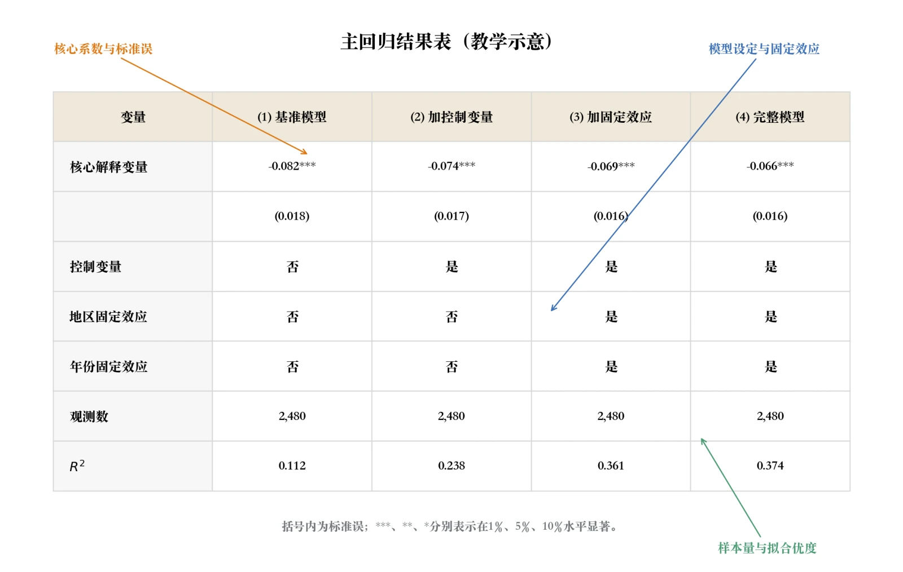
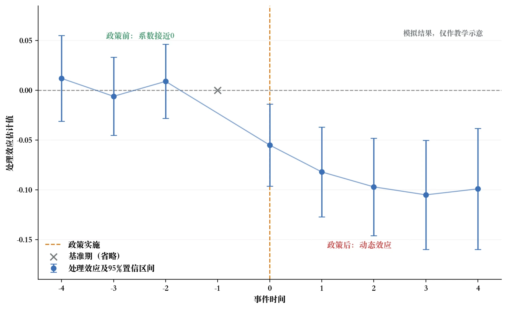

# 第15章 研究写作与成果呈现

> “辞达而已矣。”
>
> ——《论语·卫灵公》


孔子说“辞达而已矣”，强调表达首先要准确传达意思。对实证研究而言，完成估计不算终点，让读者准确理解证据、方法和边界同样重要。第14章已经生成主结果、识别诊断、稳健性、异质性和机制输出，但这些表格和图形仍只是研究成果的原材料。研究的真正完成，是当你能够把这些原材料整合成一份别人能看懂、能信服、能记住的研究报告或论文时。这一步看起来简单，实际却是许多研究最容易翻车的环节。无数严谨扎实的研究，因为表达不清、图表混乱、解读不当而被埋没；也有不少研究方法平平、但因为表达精彩、故事动人而广为传播。研究的影响力，从来不只取决于研究本身的质量，还取决于研究者把它讲清楚的能力。这一章讨论如何把研究成果做成一份合格的报告或论文，包括实证论文的结构、表图规范、结果解读、AI Agent 辅助写作、学术规范和可复现性。最后一节继续使用人工智能试验区案例，把第14章的核心输出整合成一份简洁的研究报告。[^case-data-15]

正文只保留理解论证所必需的数字和图形，完整表格与代码留在配套结果包中。

[^case-data-15]: 政策背景、批复时间和处理批次来自真实政策文件；企业面板经过匿名化、抽样、清理和半合成教学化处理。所有估计结果只用于演示研究设计、数据处理、交错DID和规范写作，不能解释为人工智能试验区的真实政策效果。

这一章的写作风格会和前几章有所不同——前面四章依次完成问题定位、研究设计、数据准备和证据检验，这一章偏重表达与整合。代码会减少，写作示范会增多。请你跟着每一段示范，体会好的研究表达长什么样。读完这一章，你会真正完成一项研究的全过程——从一个研究问题，到一份让人信服的研究成果。首先来看最基础的问题：一篇合格的实证论文，应该长什么样？

## 15.1 实证论文的结构与写作规范

### 15.1a 一篇标准实证论文的组织框架

实证论文的具体结构因研究问题、方法和期刊而异，但通常要完成六项功能：提出问题并定位贡献，交代相关文献，说明制度或理论背景，介绍数据与识别策略，呈现实证结果，最后总结结论与边界。这些功能可以分成独立章节，也可以合并。引言是论文的门面。它要回答四个问题：研究关注什么，为什么重要，已有研究留下什么待解决问题，以及本文怎样回答并形成增量。篇幅应服从论证需要和目标期刊要求，不能用固定比例衡量。文献回顾用于明确研究的学术位置。经济学论文既有把文献嵌入引言或制度背景的写法，也有单列章节的写法，不能简单按中英文期刊区分。无论形式如何，其功能都不是罗列作者和年份，而是说明已有证据、争议和本文的具体增量。理论框架与计量模型是研究的方法论根基。这一段回答你打算怎么做研究这个核心问题——是用DID、IV、RDD还是别的？

识别假设是什么？关键的计量方程长什么样？每一个符号代表什么？这一段写得好，读者会信任你的方法；写得含糊，读者会从这一节开始怀疑整篇论文的质量。数据与变量是研究的物质基础。这一段介绍数据来源、样本选择、变量定义、描述性统计。读者通过这一段判断你的结论建立在什么基础上。如果这一段写得清晰透明——数据来源可靠、样本筛选过程完整、变量定义明确、描述性统计规范——读者会对你的研究有信心。如果这一段写得草率——缺少描述性统计、样本筛选不清楚、变量定义模棱两可——读者会自然地怀疑后续所有结果的可信度。实证结果是论文最核心的部分。主回归、稳健性检验、异质性分析、机制分析全部呈现在这一部分，通常占论文篇幅的30%到40%，是最长的一段。结果呈现的核心原则是条理清晰——每一张表、每一张图都有明确的角色，逐步展开论证逻辑。

读者不需要自己找你的发现，而是被你一步步引导着理解：先看到主结果，再看这个结果有多稳健，然后看它在不同群体中的差异，最后理解背后的机制。结论总结研究发现、讨论局限并说明可能的政策含义和未来研究方向。它通常比结果部分简短，但应准确对应正文证据，不能在最后一节突然提出没有分析支持的新主张。不同论文会把理论、制度背景、文献和识别策略进行不同组合。写研究报告或毕业论文时，应先确认目标期刊或学校规范，再检查上述六项功能是否完整，而不是机械套用固定段数。

### 15.1b 引言的写作：四个要素环环相扣

引言虽然短，但写好极难。一份合格的引言应当回答四个问题，对应四个写作要素。下面我们逐一拆解，并给出每种要素的具体写法和示范。第一个要素是开篇的钩子——抓住读者的第一句话。钩子的任务是用一句话或一段话让读者产生继续读下去的兴趣。这不是靠夸张的修辞来实现的，而是靠让读者意识到一个值得关注的问题来实现的。常见的钩子写法有三种。一是从重大现实问题切入——比如人工智能会替代劳动，还是创造新的技术机会？读者立刻意识到这是一个与企业和劳动者都相关的真问题。二是从重大政策切入——比如自2019年起，科技部先后支持建设国家新一代人工智能创新发展试验区，读者明白你要评估一项真实的区域创新政策。三是从令人意外的现象切入——比如有些城市人工智能企业快速聚集，但当地上市公司的研发投入或专利产出未必同步变化，这种投入与产出的错位如何解释？

读者被反常现象吸引，想知道答案。钩子的核心不是堆砌宏大词汇——不要在开头写什么在全球化背景下、随着经济社会的快速发展这类空话——而是让读者在第一段就产生一个具体的疑问。这个疑问会驱动他们继续读下去。许多论文写得很扎实但开头太平淡，读者点开看几行就关掉了，这是非常可惜的，因为后面的内容其实很有价值。把钩子打磨好，是你为你的研究争取读者的第一步。第二个要素是研究空白——阐明为什么需要这项新研究。这一段不需要长，但必须明确。你要告诉读者：已有研究做了什么、共识是什么，以及还没有做什么。写法上要避免两个极端：一是简单罗列文献——X（2018）发现……Y（2020）发现……Z（2022）发现……——这种文献流水账让读者昏昏欲睡；二是空泛地说已有研究不足——不具体指出什么不足，等于没说。好的研究空白通常是具体的。

它可能是一个情境空白——已有研究主要关注非洲和南亚的低收入国家，对中国的相关证据相对有限。它可能是一个数据空白——已有研究多基于宏观地区数据，缺乏家庭层面的微观因果证据。它可能是一个方法空白——已有研究多使用相关性分析，缺乏干净的因果识别。它也可能是一个视角空白——已有研究关注了平均效应，但对异质性效应和传导机制的讨论相对不足。不管哪种空白，关键是要让读者看了之后觉得确实，这个问题还没有被回答好——而不是觉得这个问题早就被研究透了。第三个要素是本研究的贡献，即告诉读者做了什么、发现了什么。这是引言中最关键的部分。只说“我研究了X对Y的影响”仍然只是研究问题。更完整的写法是先交代数据和方法，再报告具体数字与区间，最后解释它们对文献或实践意味着什么。

本案例可以写成：“本文将科技部正式批复与匿名企业面板匹配，利用试验区分批获批形成的时空差异，采用组别—时期交错DID估计教学样本中的处理效应。”随后再报告两个主要结果和识别诊断。没有系统检索时，仍不能预先宣称“首次”或“填补空白”。第四个要素是论文结构预告——给读者一张路线图。这一两句话告诉读者论文的后续结构：第二节讨论什么，第三节呈现什么，第四节分析什么。虽然看起来有些机械，但对读者非常实用——他们可以根据路线图直接跳到自己最感兴趣的部分。写路线图不需要太多技巧，只需要准确和简洁。把这四个要素串起来，一份合格引言的结构就出来了：第一段用钩子抓住读者注意力并引出研究问题；第二段梳理已有文献并明确指出研究空白；第三段说明本研究的数据、方法和核心发现；第四段总结研究贡献并给出论文结构。

按照这个结构，配合具体的研究内容，你能比较顺利地写出一份合格的引言。但要写出优秀的引言，需要反复打磨。许多顶级期刊的作者承认，引言部分会被修改十几遍甚至几十遍——因为它是论文的门面，值得最大的精力投入。

### 15.1c 模型与数据章节的写作要点

模型与数据章节的写作核心就是一个词：清晰。让读者一眼能明白你的研究建立在什么基础上、用了什么方法。这部分写得好不好，直接决定读者对后续实证结果的信任程度。模型描述部分应当完成三件事。第一件事是解释识别策略的逻辑。你不能一上来就把方程扔给读者，而要先用普通人能理解的语言说明为什么这种方法适合研究问题。本案例中的试验区在不同年份分批获批，交错DID利用各批次在相同日历时期的处理状态差异，将已处理地区与当期合格的尚未处理或从未处理地区进行比较。只有在条件平行趋势、无提前反应和无干扰等假设大致成立时，这些比较才具有因果含义；分批实施本身并不会自动创造可信的自然实验。第二件事是写出计量方程并解释每一个符号。

本案例的教学基准可写为 `Innovation_{ict} = α + β·Pilot_{ct} + μ_i + λ_t + ε_{ict}`。其中，\(i\)是企业、\(c\)是城市、\(t\)是年份；结果变量为研发投入强度或发明专利申请；\(Pilot\)按正式批复和预设年度口径编码；\(\mu_i\)和\(\lambda_t\)分别是企业和年份固定效应；标准误聚类到城市层面。配套程序加入当期企业特征的列只作为敏感性设定，不能误写成滞后控制。传统TWFE是教学基准，正式结果来自允许处理效应随批次和时期变化的交错DID估计。第三件事是论证识别假设的合理性。因果识别方法都有假设：DID依赖反事实趋势，IV要求工具变量满足相关性和外生性，RDD要求门槛附近的潜在结果连续。

IV的外生性还要具体排查未观测共同原因和绕过内生变量的其他影响路径，不能只写一个术语。模型部分要说明具体假设、制度依据和可能的违背方式。本案例中的试验区由中央批复，但城市通常经过申报和遴选，不能据此排除自选择。研究者应结合政策前动态、城市特征可比性、同期政策和安慰剂分析判断设计是否受到明显挑战；这些诊断只能提供支持或暴露问题，不能直接证明平行趋势。数据描述部分也有几个要点需要特别留意。数据来源要清晰——明确说明数据来自哪个数据库或官方文件，由什么机构发布，覆盖什么时间和范围，作者如何获取与匹配。这不仅是格式要求，也是让读者评估数据质量和适用性。本案例要分别说明科技部批复、上市公司财务和研发、专利、企业地址及城市控制变量的来源与许可，而不能笼统写“使用上市公司数据”。样本筛选过程要透明。

从原始企业—年份数据有多少观测开始，经过证券类型、行业范围、地址匹配、关键变量缺失和异常值处理后，每一步减少了多少观测，最终进入分析的样本是多少，都应有明确记录。对于各回归列被解释变量或控制变量缺失造成的样本变化，也要单独说明。这样既便于复现，也能让读者判断筛选是否可能改变处理组与对照组的可比性。关键变量的定义要明确。每一个核心变量——被解释变量、核心解释变量、机制变量、分组变量——都要说明原始字段、编码规则和数据处理。比如不能只说“企业创新”，而要说明研发投入强度的分子与分母、单位和异常分母处理；发明专利按申请日还是授权日归属年份，是否包含子公司和公司曾用名；试验区处理从批复当年还是下一个完整年度开始；企业所在地为何固定在政策前。变量定义越明确，读者的信任就越强。描述性统计要规范呈现。

把主要变量的观测数、均值、标准差、最小值和最大值列在一张表里，让读者了解样本规模、变量分布和可能的异常值。如果研发投入强度超过合理范围、专利数量出现异常跳点，或财务比率因分母接近零而产生极端值，应回到原始字段和构造代码排查，并在论文中说明处理规则。

### 15.1d 实证结果章节的写作：像讲故事一样呈现发现

结果章节是论文最长的部分，也是最考验写作功力的部分。许多学生写结果章节像写系数说明书——把每个回归系数挨个介绍一遍，读者读着读着就睡着了。好的结果章节应当有清楚的证据顺序。常见安排是先给出主估计，再呈现识别诊断和稳健性分析，随后讨论异质性与机制证据。这个顺序不是预设“政策有效”，而是逐步回答：估计值是什么、不确定性有多大、哪些识别威胁得到缓解、结果如何分布，以及哪些渠道与数据相容。写主回归结果时，初学者常写：“处理变量系数显著为正，说明政策促进创新。”这只是在复述符号和星号。更好的写法应把系数放回经济情境：“交错DID中，研发投入强度的总体ATT为0.0078，95%置信区间为[0.0054，0.0102]。由于变量按0—1计量，点估计相当于0.78个百分点，约为处理组政策前均值的14.4%。”

随后再说明专利结果的函数形式、识别诊断和解释边界。写稳健性检验结果时，同样要避免一笔带过。不能只写“多种稳健性检验均支持主结论”——读者不知道你做了什么，也无法判断说服力。本案例应围绕具体质疑组织文字：把批复当年改为处理起点回应年度错配；使用不同对照组和交错DID估计量回应异质性处理效应；剔除特殊城市、疫情冲击和同期政策重叠回应共同冲击；把政策前固定注册地址替换为政策前固定办公地址、排除迁址企业回应地理错配；排除邻近城市回应空间溢出；采用少量聚类稳健推断回应城市数量有限。每项检验都要报告真实点估计和区间，并说明结果对哪项选择稳定、对哪项选择敏感。写异质性结果时，除了呈现各组系数，还必须回到预先提出的经济逻辑：为什么可能出现差异？组间差异是否经过直接检验？

例如，若民营企业或融资约束较强企业的点估计更大，应报告差异的置信区间，并讨论它是否与资源约束渠道一致；若高技术行业或政策前创新基础较强企业反应更大，则可能与技术机会和吸收能力有关。但任何解释都要使用“与……一致”之类的克制措辞，不能把事后分组直接写成政策精准性或机制证明。

### 15.1e 结论与政策启示的写作要点

结论部分虽然短，但审稿人和决策者最常看的就是结论。一份好的结论应当自然地完成四件事。首先是简明扼要地总结发现。用三到四句话把核心发现讲清楚——不要复制粘贴摘要，但要让读者在读完长长的结果章节之后有一个清晰的回顾。你用了什么数据、什么方法、发现了什么、这个发现意味着什么——把这些问题在一段里完整过一遍。其次是回顾学术贡献。不用长篇大论——这一块在引言中已经详细展开了——但需要简短地提醒读者：你的研究为这个领域增添了什么样的新证据，与已有文献的关系是什么。一段两三句话就够。第三是诚实地讨论研究局限。很多学生害怕承认局限，担心它会降低研究价值；实际上，明确边界有助于读者判断证据强度。每条局限可以按“问题是什么—可能造成什么偏误—已经采取哪些缓解措施—还剩什么不确定性”的顺序展开。

不要例行写“该局限不影响核心结论”，因为是否影响结论应由诊断结果和置信区间决定。例如，本案例若无法完全区分人工智能试验区与同期数字政策，就应说明重叠范围、采取的控制或样本限制，以及仍不能排除的共同冲击。第四是提出有尺度的政策启示。政策启示是最容易过度外推的地方。你研究的是样本期内国家级试验区中的上市公司，就不能直接推论到所有中小企业、所有城市、其他国家或任何人工智能政策。好的政策启示应当直接连接研究发现，不超出证据支撑的范围；对外推到其他情境持谨慎态度；同时指出哪些结论需要更长观察窗口、非上市企业数据或政策执行强度数据进一步验证。这种有所言、有所不言的尺度把握，是研究者面对学术界和决策者最重要的素养。

## 15.2 表格与图形的规范化呈现

在实证论文中，表格和图形是承载主要信息的载体。文字是用来叙述故事的，但具体的实证证据——系数有多大、显著性如何、稳健性怎么样——都依赖表格和图形呈现。一份论文的表图质量，直接决定了它的专业感——好的表图让读者一眼觉得这是认真做的研究，糟糕的表图则让读者立刻产生怀疑。

### 15.2a 一张好表的标准

一张好的实证回归表应当满足三个层次的标准，每个层次都对应着不同的阅读需求。第一个层次是结构清晰。表格的布局要自洽——行（变量）和列（模型设定）一目了然，关键变量放在显眼位置。最常见的做法是把核心解释变量放在表格最上方的几行——因为这是读者最关心的数字。控制变量放在核心变量下方，固定效应信息和样本量放在表格底部。这种核心在上、辅助在下的布局让读者的注意力自然地落在最重要的信息上。如果控制变量很多，不必逐一列出——用一行控制变量：是/否来概括，让表格保持简洁。第二个层次是信息完整。表格至少要报告目标参数的点估计和不确定性、有效样本量、关键设定及推断方法。小数位数要与变量尺度和估计精度相称，不必固定为三位；可以报告标准误或置信区间，星号并非必需。

面板和政策研究还应说明企业数、处理地区数、固定效应、对照组、估计量和聚类层级。\(R^{2}\)只在适用且含义明确时报告，不能把它列为所有模型的硬性要求。第三个层次是可读性强。表格是给人看的，不是给软件输出的。变量名要用中文或清晰的英文，不要直接使用原始代码名——`rd_intensity`不如“研发投入强度”直观。表头要有信息量，“表1 回归结果”不如“表1 人工智能试验区对上市公司研发投入与发明专利申请的影响”。表注要包含处理口径、估计量、对照组、标准误类型、聚类层级、固定效应、数据来源和样本限制，让表格脱离正文也能被理解。



图15-1 把这三层标准放在同一张教学示意表上：核心解释变量与标准误位于表格最上方，控制变量和固定效应用「是／否」行概括，样本量放在表底，表注说明括号内为标准误。图中星号与 $R^2$ 只是排版示例，报告与否按正文标准判断。

图15-1 一张合格主回归表的构成

### 15.2b 主回归表的设计原则

主回归表是论文中最重要的一张表——它是读者判断你的核心发现是否可信的第一窗口。它的设计有几个核心原则，值得仔细讨论。主回归表可以从较简洁的设定排到更完整的设定，但每一列都要有明确用途。第一列通常保留识别所必需的固定效应，不加入可能受政策影响的时变控制；后续列可以展示政策前协变量调整、行业年度冲击或其他针对性设定。比较各列时要保持样本一致，并先判断新增变量是否改变了目标参数。系数变化可能来自混杂调整、坏控制、样本流失或识别权重变化，不能把“逐列稳定”本身当作因果证明。多个相关的被解释变量可以并列呈现。如果研究关注政策对多个创新维度的影响——比如研发投入强度和发明专利申请——可以把它们放在同一张表的不同列中，分别呈现无控制变量和完整控制变量设定。这样读者能同时看到创新投入与产出。

但不能预设两者一定同向或显著：研发可能先变化，专利存在时滞，也可能两者都估计不精确。若两类结果使用的有效样本不同，要在表中明确报告。让关键信息突出。核心解释变量是整张表的主角——它应该放在表的最上方，让读者第一眼就看到。如果你想让读者特别关注某一列——比如加入了全部控制变量的最终主回归结果——可以把那一列的系数加粗。控制变量不需要每个都占一行——如果控制变量很多，汇总用一个控制变量：是/否行来告诉读者你已经做了控制，既保持了表格的完整性，又避免了长表格分散注意力。

### 15.2c 稳健性表与异质性表的设计

稳健性表和主回归表的组织方式有所不同。正文可以使用“威胁—替代设定—点估计—置信区间—样本变化—解释”的总览表，把针对同一研究问题的诊断放在一起。若替代分析改变了样本、估计对象或参数尺度，必须明确标注，不能只把系数横向排列。判断稳健性也不以“所有结果都显著”为标准；区间变宽、效应量变化或某项合理设定与主结果不同，都可能是需要正面解释的信息。异质性表通常按预设维度分块，每个块呈现相应子组。本案例可以依次报告国有与民营企业、大型与小型企业、政策前创新基础较高与较低企业，以及不同行业技术属性。除各组点估计和置信区间外，还应报告正式的组间差异及其区间；不能用“一组显著、另一组不显著”替代差异检验。

### 15.2d 一张好图的标准

在实证论文中，常见的图形有四类：事件研究图、系数图、时间趋势图、分布图。无论哪种类型，一张好的实证图都应该满足几个共同的要求。图的目的在于传达一个清晰信息，而不是装饰。事件研究图展示相对处理时间上的动态估计及政策前诊断，系数图比较不同群体或设定的点估计与区间，时间趋势图展示原始变化，分布图呈现零值、偏态和离散程度。如果一张图不比文字或小表更清楚，就没有必要绘制。图的设计要简洁专业。去除多余的装饰——网格线只在必要时保留、背景保持白色、字体统一、颜色使用克制。坐标轴标签要清晰——横轴表示什么、纵轴表示什么、刻度单位是什么，读者不需要猜测。图例要简洁明了——如果只有一条线就不需要图例，如果有多条线则图例的位置和文字大小要合适。

特别要注意的是：不要用花哨的3D效果、渐变色、彩虹色等装饰性元素——这些在学术界被视为业余的标志。学术图的美感来自简洁和精准，不是来自丰富的视觉效果。图必须诚实呈现数据。坐标范围可以根据分析目的选择，但若不从0开始或缩短时间窗口，应清楚标示并避免夸大差异；必要时同时提供全范围图。不能选择性省略反转时期或置信区间，双纵轴图也要谨慎使用并明确标注尺度。图应该尽量自包含。通过标题、坐标轴、图例和注释，读者应能知道图展示什么数据、采用什么估计方法以及区间如何构造；正文再负责解释其经济含义和识别边界。

### 15.2e 事件研究图和系数图的制作

事件研究图是DID研究最重要的可视化成果。一张专业的事件研究图有几个关键视觉要素：横轴清楚标注相对于试验区处理起点的年份；在时间0处用垂直虚线标记处理开始；纵轴标注事件时间聚合的处理效应及结果变量单位；每个时间点用圆点表示点估计，上下线段表示95%置信区间；纵轴0处画水平虚线；图注说明估计方法、对照组、基准期和聚类层级。交错DID中还要说明远期事件时间由哪些处理批次支持，不能把样本构成变化隐藏在图后。



图15-2 把这些视觉要素画在同一张示意图上：横轴为事件时间，处理时点在 0 处用垂直虚线标出，圆点与线段给出点估计和 95% 置信区间，基准期被省略并单独标注。图中数字为模拟值，只用于说明一张合格事件研究图应当包含什么。

图15-2 一张合格事件研究图的构成


系数图是呈现异质性分析结果的最佳方式。分组回归产生了多个系数——每组一个——系数图把这些系数用点加线段的方式并排展示。每个分组对应一个圆点（点估计值）和一条水平线段（置信区间），所有分组从上到下排列。在系数为0的位置画一条垂直虚线——如果某个分组的置信区间跨越了这条虚线，说明该组的效应在统计上不显著偏离零。分组按某种有意义的逻辑排序——比如按收入从低到高、按地区从西到东——让排序本身就传达信息。在主流统计软件中实现专业图形的几个实用技巧：导出PDF格式的图形文件，而不是软件默认的专有格式——PDF在论文排版中更通用；使用统一的图形配色方案；保持白色背景——这是学术论文的默认外观。如果你想让 AI Agent 帮你美化图形代码，可以把现有的图形代码发给 AI Agent，描述你想要的最终效果——比如黑白配色、字体调大、坐标轴标签更清晰——AI Agent 能给出修改后的代码。这种图形美化是 AI Agent 非常实用的应用场景，能帮你节省大量反复调试图形参数的时间。

> **专栏15-1 系数图：怎样把几十个回归结果压缩到一张图里**
>
> 假设一项研究分别估计了政策对国有企业、民营企业、大型企业、小型企业、高技术行业和传统行业的影响。若用文字依次描述，每一组都要重复“系数为多少、置信区间多宽、是否显著”，读者看到最后往往已经忘记开头。把这些结果放进多列回归表，精确数字虽然齐全，组间模式仍不容易迅速识别。
>
> 系数图把每个点估计画成一个点，把置信区间画成穿过该点的线段，再用一条零值参考线帮助判断方向和不确定性。不同组按同一尺度排列后，哪些估计较大、哪些接近零、哪些区间很宽，几秒钟内就能看出来。原本需要几段文字解释的比较关系，被压缩到同一视觉空间中。
>
> 图形尤其适合展示模式，表格则适合查询精确数字。正文没有必要把图中每个点再抄一遍，可以集中解释最重要的差异、异常和经济含义。若读者需要核对具体估计值，图上可以标注数字，或在附表中提供完整结果。图、表和文字各有任务，重复同一信息只会增加阅读负担。
>
> 这也是“能用图表说清楚，就少写重复文字”的真正含义。它不是让论文变成图册，而是把结构化信息交给图表，把判断和解释留给正文。一张组织良好的系数图，可以替代“第一组如何、第二组如何”的流水账；正文则回答为什么某些组不同，以及这种差异是否符合经济理论。
>
> 信息压缩不能以丢失含义为代价。所有系数必须具有可比单位，置信区间采用相同水平，分组顺序也应有经济逻辑。若不同模型使用的样本、估计量或被解释变量尺度不同，不能只把点并排画在一起而不作说明。颜色和排序可以帮助阅读，却不应被用来突出符合预期的结果、淡化不利结果。
>
> 对人工智能试验区案例而言，一张系数图可以同时呈现所有制、规模、政策前创新基础和行业属性的异质性估计。读者先从图中看到整体模式，再到表格查找精确数值，最后通过正文理解经济解释。好的表图不是论文的装饰，而是一种比逐项叙述更节省注意力的表达方式。

## 15.3 结果解读与经济学讨论

有了清晰的表格和图形，下一步是解释估计对象、单位、量级、不确定性和适用边界。结果解读不能停留在系数符号和显著性星号上，也不能超出研究设计能够支持的范围。

### 15.3a 经济显著性与统计显著性——最基础也最常被忽视的区分

这是结果解读中最重要的概念区分，同时也是初学者最容易混淆的地方。统计显著性（statistical significance）描述观测结果与某个原假设及统计模型的相容程度，通常结合$p$值、标准误和置信区间判断；它不等于判定某个效应“是信号还是噪音”。经济显著性（economic significance）关注估计量级在具体单位、基准水平和政策成本下是否重要。二者可能不一致：大样本可以把很小的差异估计得很精确，小样本也可能使重要但估计不精确的效应具有宽置信区间。系数0.001或0.5分别代表多大变化，取决于水平—水平、对数—水平、水平—对数或对数—对数等模型形式以及变量单位，不能脱离尺度直接写成0.1%或50%。以人工智能试验区案例为例，糟糕的写法是：“处理变量系数显著为正，说明政策促进创新。”

它没有解释单位、区间和量级。更好的写法是：“研发投入强度ATT为0.0078，95%置信区间为[0.0054，0.0102]；由于变量按0—1计量，点估计相当于提高0.78个百分点。”对专利变换值还要说明换算依赖函数形式，不能把\(\ln(1+\text{专利数})\)系数机械解释成原始专利数的精确百分比。

### 15.3b 内部有效性与外部有效性的讨论

另一对重要概念是内部有效性和外部有效性。内部有效性关注研究在目标样本和制度环境中能否识别所声称的因果效应，它取决于设计、数据、测量和推断是否支持核心假设，稳健性检验只能提供部分诊断，不能“保证”有效性。外部有效性则关注结论能否推广到其他对象、时期或制度情境。好的研究应同时讨论两者。在说明内部有效性的相关诊断后，应进一步界定结论适用于哪些对象、时期、处理版本和制度环境。若研究基于2006—2008年中国农村数据，外推到其他地区需要比较处理内容、基准风险、人口构成、市场条件和一般均衡反馈；“经济发展水平相似”或“政策结构相似”只能提供线索，不能证明效应可迁移。外部有效性通常需要额外数据、跨情境重复研究或明确的效应异质性模型支持。

### 15.3c 研究局限的诚实讨论

许多学生害怕讨论研究局限——担心承认局限会降低研究价值。但实际情况恰恰相反：诚实地讨论局限，提升的是研究的可信度。它表明研究者对自己的工作有清醒认识，而不是自吹自擂。审稿人看到你主动而且准确地指出了研究的局限，反而会降低他们在评审中挑刺的冲动——因为你已经把该说的都说了。讨论局限要避免两个极端。一个极端是根本不讨论或一笔带过——本研究还有一些不足之处，有待未来研究完善——这种笼统的说法等于没说，审稿人会追问具体什么不足。另一个极端是过度强调局限——把局限说得如此严重以至于读者怀疑那这个研究还有什么意义——这也是不必要的自我伤害。

合适的做法是把每一条局限放在一个有结构的叙述中：先指明这条局限具体是什么，再说明它可能使估计产生什么方向或范围的偏差，接着交代你在现有条件下做了什么来缓解，最后明确仍然存在多少不确定性以及后续研究可以怎样改进。比如：本研究无法完全排除同期其他农村政策（如新农合、新农保）的混合影响，因此估计系数可能同时包含这些政策的作用，不能全部归因于目标政策。我们通过控制可观测的同期政策实施情况并改变样本窗口进行敏感性分析，结果方向保持一致，但由于部分政策暴露无法精确测量，仍不能完全分离各项政策的独立效果。后续研究可以利用更细的政策执行数据进一步识别。这种“局限→可能偏差→缓解措施→剩余不确定性”的四步结构，既诚实又专业；如果证据不足，就不应直接宣称局限“不影响核心结论”。

### 15.3d 政策含义的尺度把握

政策评估类研究的结论部分通常要提出政策含义或政策启示。这是写作中最难把握尺度的地方——既要让研究发现转化为政策语言，又不能过度外推超出研究证据支撑的范围。过度外推的典型表现，是把局部发现推广到完全不同的情境。比如你只评估了国家级人工智能试验区对上市公司的影响，却说所有城市建设人工智能园区都能促进所有企业创新；或者把样本期内的短期结果直接写成长周期生产率效应。上市公司与中小企业的融资、治理和披露环境不同，国家级试验区也不等于一般地方数字化政策。好的政策启示应当由结果触发。若研发和专利均上升，且渠道证据指向人才或公共平台，可以讨论改善研发设施、人才流动和应用场景；若研发上升而专利没有清晰变化，应讨论创新产出时滞和投入效率，不能只用投入指标评价政策；若效果集中在原本基础较强企业，应警惕“强者更强”；若平均效应接近零或估计不精确，应如实说明当前证据的范围。最后为后续研究留出空间——更长时间窗口、非上市企业和政策执行强度数据都可能改变我们对长期效应的理解。

> **专栏15-2 从“显著为正”到“到底增加了多少”：把计量结果翻译成人话**
>
> “核心解释变量的系数显著为正”是学生论文中最常见的结果表述。它没有说系数是多少、变量采用什么单位，也没有告诉读者这一变化在现实中是否重要。统计软件输出的是估计结果，研究写作的任务是把它转化为能够回答经济问题的证据。
>
> 假设某项政策使企业研发投入占营业收入的比重提高0.3个百分点。如果企业政策前的平均研发强度是2%，那么0.3个百分点相当于基准水平的15%。这里的“0.3个百分点”和“15%”都可能有用，但含义不同，不能混写成“提高0.3%”。若被解释变量经过对数或其他变换，还要按照模型形式解释，不能把系数机械地加上百分号。
>
> 点估计也不能独自出现。假设0.3个百分点的95%置信区间为0.05至0.55个百分点，正文应让读者知道数据仍允许从较小到较大的多种效应。若区间跨过零，更准确的说法是当前数据无法精确区分正效应与零效应，而不是简单宣布“政策无效”。把不确定性写出来，不会削弱研究，反而能说明证据究竟支持到哪一步。
>
> 写作还会影响读者对因果强度的判断。“试验区企业的创新更高”“控制其他因素后仍然相关”和“试验区建设提高了企业创新”并不是同一句话。前两种表述可以对应描述性或条件相关证据，最后一种需要研究设计支持。文字中的一个动词，就可能把有限证据包装成过强结论。
>
> 一段清楚的结果文字通常先回答方向和量级，再给出区间与基准，随后解释经济含义和适用范围。它不需要逐列复述回归表，也不必堆叠“显著促进”“有力证明”之类评价。读者已经能从表中看到星号，正文更应解释数字意味着什么，以及为什么这一结果值得关注。
>
> 研究成果确实需要“包装”，但这里的包装是安排顺序、选择尺度和减少理解成本。把百分点写成百分比、只强调有利的点估计、把相关关系写成因果关系，则是在改变证据。好的写作让读者更容易看懂原来的结果，不会让结果显得比实际证据更强。

## 15.4 AI Agent 辅助研究写作

生成式AI已经进入研究写作流程，可以辅助解释概念、检查结构、修改表达和整理格式。它也可能虚构事实、泄露未公开材料或让作者在不知不觉中改变原意。本节讨论 AI Agent 可以承担哪些辅助工作，以及研究者仍需独立完成和负责的部分。

### 15.4a AI Agent 在论文写作中的能力与边界

在讨论具体使用场景之前，先要对 AI Agent 的能力有一个清醒的判断。AI Agent 擅长的是语言层面的工作。它能把粗糙的中文表述变成流畅的学术语言，把翻译腔的英文变成地道表达，把口语化的句子变成符合学术规范的严谨表述。它能在几十秒内帮你检查段落之间的逻辑是否连贯——哪里跳跃太快、哪里缺少过渡、哪里有重复啰嗦——然后给出具体的修改建议。它能帮你找出论证链条中的薄弱环节，建议在哪里可以补充什么类型的证据。它能用通俗的类比帮你向读者解释复杂的方法学概念。它能把你的一段话用几种不同的表达方式重新写出来，帮你避免文章中反复使用相同的句式。它还能在中英文之间做学术性的翻译，同时保持术语的一致性。

AI Agent 在实质性判断上并不稳定。它可能编造文献、数据、人物和政策事实，也可能在缺少制度背景时给出看似合理却不适用的识别策略。它可以提出候选解释和检查问题，但不能替代研究者查看原始数据、核对原文、判断假设或确定研究价值。输出越流畅，越需要追问依据。使用时仍遵循全书统一流程：先由作者写出主张和证据，再让 AI Agent 检查语言、逻辑和结构，最后逐项核对事实、数字、引用和原意。

### 15.4b 用 AI Agent 辅助文字打磨

文字打磨是 AI Agent 常见的应用场景。假设你写了这样一个长句：“本研究通过企业数据使用DID方法估计试验区对创新的影响并发现政策有显著促进作用且不同企业之间存在差异。”这句话太长，而且“显著促进”“存在差异”都需要具体证据。可以要求 AI Agent 只改表达、不改事实，拆成：“本文将试验区批复与企业年度数据匹配，采用交错双重差分方法考察教学样本中的处理效应。研发投入和专利结果分别报告点估计、置信区间与组间直接差异检验。”AI Agent 只能整理已经核对过的事实，不能猜测数字、方向或显著性。

AI Agent 还可以帮你统一全文的表达风格。学生论文中常常出现叙述人称、核心术语和结论强度前后不一致的问题。在数据许可、版权、隐私和保密规则允许的前提下，可以让 AI Agent 检查文稿的表达一致性；上传前应移除个人身份、受限数据、未公开结果和其他敏感内容。必要时可以只提供脱敏片段、术语表或本地处理的文件，不必上传整篇文稿。如果需要写英文论文或翻译摘要，AI Agent 也可以提供初稿。但不同工具、学科和语境下的质量差异很大，翻译后必须逐句核对原意、术语、数字和限定词，不能假定它一定比其他翻译工具准确。

### 15.4c 用 AI Agent 辅助逻辑检查

这是 AI Agent 辅助写作最有价值但也最需要判断力的应用——AI Agent 能帮你发现你自己看不出来的逻辑漏洞。可以把脱敏后的论文片段交给 AI Agent，让它扮演审稿人。例如：“请检查下面这段引言的论证链，分别指出逻辑跳跃、证据不足和措辞过强之处；不要补写事实或文献。”AI Agent 给出的意见只是待核验清单。作者要回到全文和原始证据，判断问题是否真的存在。

AI Agent 可能为了完成“提出问题”的指令而给出表面化批评。应逐条记录采纳、修改或拒绝的理由，不能按建议数量评价审查质量。

### 15.4d 用 AI Agent 辅助文献整理与综述

文献综述阶段可以让 AI Agent 根据你提供的论文或摘要提取研究问题、识别策略和主要发现，也可以用它比较若干论文的异同，形成待核实的阅读地图。这个过程不能替代精读关键原文；上传尚未公开的稿件、受版权或保密约束的材料前，还要确认平台条款和使用权限。不要让 AI Agent 凭空生成参考文献。它可能编造题名、作者、年份或结论，也可能把真实作者与不存在的论文拼在一起。AI Agent 只能整理已经找到的文献或生成检索词。每条引用都要在知网、学校图书馆数据库、期刊页面、Crossref或其他可靠目录中确认，并阅读与论证直接相关的原文；正文不能直接复制 AI Agent 生成的综述段落。

### 15.4e 大模型时代的学术诚信底线

最后讨论一个无法回避的话题——AI Agent 辅助写作的伦理边界在哪里？虽然学术界对此尚未有完全统一的标准，但几条底线已经非常清晰，任何严肃的学术工作者都应该遵守。不能把自己没有理解、核实和负责的 AI Agent 文本作为原创研究成果提交。不同学校、期刊和课程对 AI Agent 生成文字的允许范围并不完全一致，判断依据应是当时有效的具体规则，而不是所谓 AI Agent 检测器；作者还必须如实披露需要披露的用途，并对最终内容承担责任。核心思想、研究问题、识别策略必须是研究者自己的。AI Agent 可以帮你打磨表达，但它不能替你做研究判断——研究的灵魂必须是你自己的。如果连研究什么问题、为什么这个问题重要、用什么方法来回答都要依赖 AI Agent，那你就不是在做研究，而是在操作 AI Agent 生成文本。数据和事实必须真实可核实。

合成数据可以用于明确标注的方法教学或程序测试，但不能冒充真实观察数据，也不能为真实政策生成虚构“发现”。论文中的回归结果必须来自可追溯的分析过程，引用必须核实原文，数据描述必须忠实于实际来源和权限。如果目标期刊、学校或资助机构要求，应按其格式声明 AI Agent 工具、版本或访问日期、用途以及人工复核方式。即使没有强制模板，实质性使用也宜留下过程记录。声明只能按实际情况填写，不能套用“研究设计均由作者独立完成”之类与事实不符的固定句式。最重要的是，你必须始终是研究的主人。AI Agent 是助手——它可以提供建议、改进表达、检查逻辑，但研究的判断、选择、最终内容都必须由你来确认和负责。这种你是作者、AI Agent 是助手的关系一旦颠倒——AI Agent 变成了作者，你只是复制粘贴的人——你的学术成长就停止了。短期看好像效率很高，长期看损失的是你自己的研究能力。

在大模型时代，工具越强大，作者对过程的掌握就越重要。落到操作上：每一次 AI Agent 给出的修改建议都应有采纳或拒绝的记录，每一处由它协助生成的文字都要由作者逐句核对原意，每一个引用都要回到原文确认。这些记录本身就是你理解这项研究、并能在答辩时说清楚每一步的证据。

## 15.5 学术规范与可复现性基础

除了上面讨论的论文结构、表图设计、结果解读之外，一份合格的研究报告还需要遵守基本的学术规范。本节简要讨论几个最重要的规范——引用、可复现性、数据与代码开放——这些都是学术研究的基础要求。

### 15.5a 引用规范与学术诚信

引用是学术研究最基本的行为规范。它的核心目的只有两个：承认已有研究的贡献，让读者能追溯证据的来源。引用的几条基本原则值得每位研究者牢记。用了别人的观点、数据或方法，就必须引用——这是底线。直接复制别人的文字而不加引用是抄袭，使用别人的研究发现而不致谢是学术不端，基于别人的方法构建自己的方法但不说明来源也是不规范。引用的内容必须来自你真正读过的原文，而不是二手引用。假设你没有读过甲文（2018）的原文，只因乙文（2020）引用了甲文，就直接写“甲文（2018）发现……”，这种做法很危险：乙文可能误解了原意，你也会跟着出错。如果确实需要引用甲文，应找到并阅读原文；如果无法获得原文，只能明确写成“乙文（2020）转引甲文（2018）的发现……”。这里的甲文和乙文仅用于示范引用关系，不是真实参考文献。

引用密度要由论证需要决定。核心事实、理论来源、方法和既有实证结论需要可追溯的出处，常识性内容和纯粹的过渡语不必机械加引。也不存在“每段一到三个”的统一标准；关键是把引用放在它实际支持的陈述附近，并覆盖与研究问题直接相关的代表性文献和相反证据。遵守目标期刊的引用格式。常见格式有APA、Chicago、Harvard等，不同期刊要求不同。中文期刊通常采用GB/T 7714格式或期刊自行规定的格式。投稿前务必查阅目标期刊的投稿指南并严格遵守。

### 15.5b 研究的可复现性

计算可复现性是当代实证研究的核心要求，指他人在获得相同数据、代码和运行环境后，能够生成论文中的表、图和正文数字。它不同于使用新数据重新检验结论的重复研究。数据缺失、代码不完整、关键步骤没有记录或软件环境不清楚，都会使计算结果无法复现。影响分析结果的数据修改应尽量通过脚本完成；确需人工核对或更正时，也要在日志中记录原值、修改值、依据和操作者，而不是在Excel中无痕覆盖。代码应在关键步骤说明目的，不必给每一行都加注释。结构化目录、README、主控脚本、软件版本记录和版本管理能够帮助六个月后的自己或其他研究者重新运行项目。这些习惯在第13章的数据交付标准中有更详细的讨论。

### 15.5c 数据与代码的开放

作为可复现性的延伸，越来越多的期刊要求作者提交数据、代码、README和数据可得性说明。按当前政策，AEA期刊通常在论文正式接受前审查经验研究的复现材料；《Quarterly Journal of Economics》则要求论文接受后、发表前完成数据与程序归档。若原始数据受保密、商业许可或其他限制，作者仍需按期刊程序说明获取方式，并提供许可范围内的代码和文档。具体要求会更新，投稿时应查阅目标期刊的最新政策。数据和代码的公开通常通过两种方式。一是在期刊网站上作为补充材料上传——论文发表时，作者把所有的代码、数据和说明文档打包上传供下载。

二是在专门的学术存储平台上公开——常用的平台包括Harvard Dataverse（综合性学术数据存储）、Mendeley Data（研究数据公开）、GitHub（代码托管，也可以放小型数据）、OSF（开放科学框架）等。公开数据时有一个重要前提：遵守数据使用协议、版权条件和隐私要求。本案例的上市公司和专利数据即使由作者自行整理，也可能来自受许可约束的商业数据库或网站；匿名公司代码、随机抽取一半样本并不会自动产生再分发权。能够公开的通常是作者原创的政策事实表、变量字典、处理代码、输出表图和不含受限字段的派生材料；受限原始数据则应说明合法获取途径，让复现者自行申请或订阅。若保留精确地址或公司映射表，还应控制访问范围。

对于本科或硕士阶段的研究，虽然不一定要把数据和代码公开到学术平台上，但至少应该确保你的代码和数据在自己的环境内是可复现的——你的导师或同学拿到你的数据和代码，能够跑出一模一样的结果。这是研究质量的最基本保障。

### 15.5d 利益冲突与伦理声明

最后还应注意利益冲突与伦理规范。如果研究受到相关机构资助，或研究者持有样本公司股份，应如实声明可能影响判断的利益关系。涉及人类参与者的研究通常需要相应伦理审查；涉及个人信息或非公开身份映射时，也要遵守数据保护要求。本案例主要使用企业和政策二手数据，通常不属于人类参与者实验，但仍需遵守数据库协议、知识产权、商业秘密和个人信息保护规则。

## 15.6 案例：把分析结果写成一份合格报告

现在沿着人工智能试验区研究的脉络，把第14章生成的描述性统计、TWFE教学基准、交错DID主结果、动态效应、稳健性、异质性和机制输出整合成一份报告。正文不需要搬运每一张表。它只保留回答研究问题所必需的数字、图形和解释，其余输出由读者在配套结果包中复现。

### 15.6a 案例背景回顾

在第11—14章中，我们围绕“国家新一代人工智能创新发展试验区是否促进当地上市公司创新”完成了完整的研究流程。第11章从真实政策背景出发，区分了2017年面向全国的《新一代人工智能发展规划》和自2019年起对具体试验区的正式批复，并通过文献对照表形成暂定贡献。第12章进一步把问题转化为交错DID研究设计，预先写明比较来源、识别假设、主要威胁和停止规则。研究把企业创新分为投入和产出两个维度，分别用研发投入强度与发明专利申请作为主要结果，并明确上市公司和国家级试验区是结论的外推边界。第13章把研究设计落实为数据工程。政策端逐份核对正式名称、覆盖范围、批复日期和来源链接；企业端整理财务、研发、专利和政策前地址；匹配端统一公司曾用名、城市代码和行政区划。

为避免企业因政策而迁址造成反向匹配，主分析使用政策前固定注册地址；为处理批复年度只有部分月份受影响的问题，主口径从批复后的第一个完整年度开始取1，批复当年进入处理作为替代口径。当前样本没有完整的真实办公地址历史，相关替代变量只用于演示代码路径。第14章规定了从估计到检验的证据顺序：先做样本、变量、处理批次和原始趋势检查；再报告TWFE教学基准；随后使用允许处理效应随批次和时期变化的交错DID估计总体ATT和动态效应；最后针对选择性获批、政策预期、疫情冲击、同期政策、地址错配、空间溢出和处理城市数量有限等威胁进行检验。异质性维度预先限定为所有制、企业规模、政策前创新基础和行业技术属性；机制候选变量为政府补助、融资条件或成本以及研发人员。现在的任务，是把这些步骤组织成一条读者能够复核的证据链。

报告不能只告诉读者“系数显著”，还要交代处理怎样定义、比较对象是谁、估计量是什么、区间有多宽、哪些诊断支持当前解释，以及哪些问题仍然存在。

### 15.6b 论文结构规划

基于15.1节讨论的框架，报告可以分为六个主体部分：

1. **引言（约1200—1800字）**：完成“现实问题—文献位置—研究做法—主要发现—贡献与结构”的叙事；
2. **制度背景与研究假说（约1000—1500字）**：说明全国规划与试验区批复的区别、分批实施过程，以及促进创新和挤出资源两类竞争性渠道；
3. **数据、变量与识别策略（约1500—2200字）**：交代数据许可、样本筛选、变量定义、地理匹配、处理时点、模型和识别假设；
4. **主要结果与稳健性（约2200—3000字）**：依次呈现描述性证据、TWFE教学基准、交错DID主结果、动态效应和针对性检验；
5. **异质性与机制（约1200—1800字）**：报告预设组间差异及其直接检验，再呈现机制相关结果和解释边界；
6. **结论、局限与政策讨论（约800—1200字）**：回答研究问题，概括最关键证据，说明内部与外部有效性，并提出与证据边界一致的讨论。正文之外还应包括摘要、关键词、参考文献和附录。附录至少放置政策事实表、变量字典、样本筛选流程、补充动态结果、替代估计量和特殊行政范围说明。总字数可以控制在8000—12000字；本科课程报告可以略短，但不能通过省略数据来源、识别假设和局限来压缩篇幅。摘要应在正文完成后再写。本案例可以压缩为下面这段：

> 本文以国家新一代人工智能创新发展试验区的分批批复为情境，演示如何研究区域人工智能政策与上市公司创新之间的关系。教学样本覆盖2011—2024年，包括1,389家企业和15,863个企业—年份观测。以从未处理企业为对照的交错DID中，研发投入强度总体ATT为0.0078，发明专利申请变换值总体ATT为0.2871；两项结果的95%置信区间分别为[0.0054，0.0102]和[0.2524，0.3218]。政策前动态联合检验在主对照组口径下未拒绝共同为0，但专利结果对对照组定义较为敏感。全部数值均来自半合成教学样本，只用于演示估计、诊断和规范写作。关键词可以暂定为：人工智能；创新发展试验区；企业创新；交错双重差分；上市公司。最终关键词要与正文实际内容和目标期刊习惯一致。

### 15.6c 引言段落示范

下面给出一段简化的引言示范。它把制度背景、研究做法和教学结果连在一起，同时把尚未完成的文献贡献判断留在正式研究之外。

> **引言**
>
> 人工智能不仅是一类具体技术，也可能通过研发平台、应用场景、人才流动和制度创新改变企业的创新环境。近年来，各地相继建设人工智能产业园、示范区和公共技术平台，但一个更基础的问题仍需经验证据回答：区域人工智能政策能否把宏观规划转化为企业层面的研发投入和技术产出？
>
> 自2019年起，科技部先后支持建设国家新一代人工智能创新发展试验区。与2017年面向全国的总体规划不同，具体试验区在覆盖地区和正式批复时间上存在差异，为政策评估提供了交错实施情境。试验区强调应用场景、技术示范、产业集聚、制度探索和创新生态建设，理论上可能通过公共研发资源、人才集聚、融资改善和知识溢出促进企业创新；但试验区也可能只改变资源配置和政策标签，甚至产生挤出或寻租。因此，政策影响的方向和大小应由数据决定。
>
> 本文整理科技部正式批复日期与覆盖范围，将其与匿名企业教学面板匹配，考察试验区建设与研发投入强度、发明专利申请之间的关系。实证分析以允许处理效应随批次和时期变化的交错DID为主，传统双向固定效应仅作为教学基准；同时检查政策前动态、年度处理口径、对照组选择、疫情冲击、样本构成和变量形式。
>
> 在从未处理企业作为对照的交错DID中，研发投入强度总体ATT为0.0078，95%置信区间为[0.0054，0.0102]；发明专利申请变换值总体ATT为0.2871，95%置信区间为[0.2524，0.3218]。主口径下的政策前联合检验没有拒绝政策前系数共同为0，但专利结果对对照组定义较为敏感。异质性分析显示不同结果变量对应的组间差异并不相同；机制结果与政府补助和研发人员增加相容，没有观察到融资约束指标的清晰响应。
>
> 上述结果来自半合成教学样本，不构成现实政策评估证据。本文余下部分依次说明制度背景、数据和识别策略，报告主要结果与识别诊断，最后讨论异质性、机制证据和研究边界。这份示范没有虚构文献空白，也没有回避不一致的诊断。正式研究若得到不显著或不精确的结果，应报告区间能够排除多大效应，不能把“不显著”偷换成“没有任何作用”。政策前动态不支持识别时，则应降低因果措辞，必要时改为更克制的关联表述。

### 15.6d 正文与附录如何分工

研究报告不应把软件生成的所有表格都搬进正文。本案例的正文只报告交错DID的两个总体ATT、置信区间和一幅动态效应图。TWFE教学基准用于解释传统方法与主估计的差别，完整表格放入附录；稳健性、留一试点、异质性和机制结果则保存在配套结果包中，由读者根据正文提出的问题自行复现。这样的取舍不等于隐藏不利结果。正文必须主动说明专利平行趋势检验对对照组定义敏感，异质性与机制分析中也有不显著结果。附录表注还要写明处理起点、对照组、估计量、聚类层级、样本限制和代理变量性质。正文负责建立证据链，附录负责让证据链接受核查。

### 15.6e 事件研究图的最终版与解读

本案例把动态事件研究图作为正文唯一的回归结果图，即第14章的图14-1。图以处理前一年为基准，同时给出研发投入强度和专利申请变换值的事件时间聚合ATT及95%置信区间。写作时应先解释横纵轴和基准期，再报告政策前联合检验，最后讨论政策后的时间模式和远期样本支持。可以这样写：“以从未处理企业为对照时，研发投入强度和专利申请变换值的政策前联合检验\(p\)值分别为0.918和0.438，未拒绝政策前系数共同为0。政策后点估计整体为正，但处理后第四年的结果只由较早批次支持，长期解释应当谨慎。改用当期尚未处理企业作为对照后，专利结果的政策前联合检验\(p\)值为0.024，说明识别诊断对对照组定义敏感。”

这段文字没有把“不显著”写成平行趋势已经被证明，也没有隐藏另一种对照组下的不利诊断。图形的作用正是在一页内同时呈现估计值、不确定性和时间结构，减少正文对回归表的依赖。

### 15.6f 结果解读段落示范

主结果可以写成一段连续的证据叙述：

> 以从未处理企业为对照的交错DID显示，研发投入强度总体ATT为0.0078，95%置信区间为[0.0054，0.0102]。由于该变量按0—1计量，点估计相当于提高约0.78个百分点，约为处理组政策前均值的14.4%。发明专利申请变换值总体ATT为0.2871，95%置信区间为[0.2524，0.3218]；按照\(e^{ATT}-1\)近似换算约为33.3%，但这一换算不能替代原始申请件数的分布说明。主对照组口径下的政策前联合检验没有拒绝共同为0，主要结果在处理起点、疫情年份、特殊城市、政策前加权和变量形式等设定下保持正向。专利结果在尚未处理对照组口径下没有通过政策前联合检验，因此上述数值只能作为半合成教学样本中的估计结果，不能解释为现实政策效果。异质性和机制不必在正文中逐项列系数，但不能只报有利发现。可以概括为：研发投入强度的组间差异主要出现在所有制、政策前规模和行业技术属性，专利结果的差异主要出现在政策前创新基础和行业技术属性；政府补助和研发人员结果显著为正，KZ与SA融资约束指标在5%水平不显著。前者来自探索性TWFE交互检验，不应称为分组交错DID ATT；后者只与候选渠道相容，没有识别完整中介链。

### 15.6g 结论与政策启示段落示范

结论可以采用“回答问题—概括证据—说明局限”的结构：

> **结论与政策讨论**
>
> 本文使用2011—2024年的半合成企业面板，演示如何利用试验区分批批复开展交错DID分析。在从未处理企业作为对照的主口径下，研发投入强度和专利申请变换值的总体ATT均为正，政策前联合检验没有拒绝共同为0，多数敏感性设定也保持相同方向。但专利结果对对照组定义敏感，因此不能把主口径下的诊断写成平行趋势已经得到证明。
>
> 这套结果的首要边界来自数据性质：企业结果和部分机制变量经过教学化处理，任何系数都不具有现实政策含义。即使未来换成未经结果导向处理的真实企业数据，试验区非随机获批、疫情同期冲击、地址错配、政策重叠、空间溢出和专利质量测量仍需单独处理。趋势检验和政策前加权只能提供有限支持，不能消除所有选择性。
>
> 因此，本教学案例不据此提出人工智能试验区的现实政策建议。它的结论是方法性的：研究者应预先定义处理、保留不利诊断、区分总体效应与机制证据，并让正文中的每个数字都能追溯到数据和代码。不要在结尾写“尽管存在以上局限，但不影响本文核心结论”。局限是否影响结论，应由具体检验和区间说明；如果仍无法排除，就让不确定性保留在结论中。

### 15.6h 一份完整研究报告的提纲

把以上内容整合，最终研究报告可以采用下列结构：

**《人工智能试验区与企业创新：一个交错DID教学案例》**

```text
摘要（200—300字）
关键词

1. 引言（1200—1800字）
   1.1 现实背景与研究问题
   1.2 文献位置与待核实的研究增量
   1.3 数据、识别策略与主要结果
   1.4 贡献与全文结构

2. 制度背景与研究假说（1000—1500字）
   2.1 全国规划与试验区批复
   2.2 分批实施、覆盖范围与政策内容
   2.3 促进创新和资源挤出的竞争性渠道
   2.4 可检验假说

3. 数据、变量与识别策略（1500—2200字）
   3.1 数据来源、许可与样本筛选
   3.2 企业地址和政策批次匹配
   3.3 结果变量、控制变量与机制变量
   3.4 TWFE教学基准与交错DID主估计
   3.5 识别假设、标准误和推断方法
   3.6 描述性统计与处理批次覆盖

4. 主要结果与稳健性（2200—3000字）
   4.1 TWFE教学基准
   4.2 交错DID总体ATT
   4.3 动态效应与政策前趋势
   4.4 处理时点、对照组与估计量
   4.5 疫情、同期政策、地址和空间溢出
   4.6 少量处理聚类与影响力诊断

5. 异质性与机制（1200—1800字）
   5.1 所有制与企业规模
   5.2 政策前创新基础与行业技术属性
   5.3 政府补助、融资条件与研发人员
   5.4 多重检验与解释边界

6. 结论、局限与研究讨论（800—1200字）
   6.1 核心证据
   6.2 内部有效性与外部有效性
   6.3 研究局限
   6.4 教学结论与现实研究要求

参考文献

附录A 政策事实表与正式来源
附录B 变量字典与样本筛选流程
附录C 补充估计、图形与特殊地区处理
复现材料说明
```

**本项目的交付物、评分量规与中止规则。**

交付物见本章练习第 1、2 题：一份完整研究报告，加一套可复现的配套材料（README、运行日志、结果目录）。
评分量规按四个维度：**证据链完整**（每条主张都能落到具体的表、图、文献或制度事实）；**数字一致性**（摘要、正文与结论引用同一组数字，且都能追溯到输出文件）；**边界表述**（半合成性质、内部与外部有效性交代清楚，不显著不被写成“政策无效”）；**可复现性**（README、运行日志、结果目录与代码数据版本齐备）。
中止规则：若**主对照口径**下主结果的政策前联合检验未能通过，必须停止因果措辞，改写为关联表述并在结论中保留不确定性；**其他对照口径下的检验结果作为稳健性证据如实报告并加边界说明，不单独触发中止**。主对照口径应在研究设计阶段预先指定（不得事后按结果挑选），并在正文中写明。若关键数字无法从代码复现，必须在提交前解决，不得以文字说明替代。

提交前逐项检查：摘要、正文和结论引用同一组数字；所有表图由最终数据和同一代码版本生成；处理日期与正式批复一致；特殊行政范围单独说明；TWFE与交错DID没有混写；每个估计报告不确定性和聚类层级；政策前趋势没有被一句“未显著”带过；组间差异经过直接检验；机制使用“与……一致”的克制措辞；不显著没有被写成“政策无效”；数据、代码和政策表的公开范围符合许可；AI Agent 辅助内容由作者逐项核对并能独立解释。如果你能基于配套教学数据写出这样一份报告，并让每个数字追溯到输出文件、代码和数据版本，就完成了从研究问题到可复现报告的一次完整训练。将来换用真实数据时，同样的追溯要求仍然适用，但识别和数据许可需要重新审查。

## AI Agent 协作任务卡：写作与复现审查

> **任务目标**：使用 AI Agent 检查论证结构、数字一致性、引用完整性和复现说明，但不让 AI Agent 代写无法由证据支持的结论。
> **提交材料**：报告初稿、最终表图清单、参考文献表、代码与数据说明，以及目标课程或期刊的写作要求。
> **使用前判断**：先由作者列出核心主张及其证据位置，并自行抽查一组数字和引用，再让 AI Agent 寻找遗漏和冲突。
> **建议步骤**：
> 1. 要求 AI Agent 为每一项核心主张定位对应的表、图、文献或制度事实，找出没有证据支撑的句子；
> 2. 要求 AI Agent 检查摘要、正文与结论中的数字和口径是否一致，并标记把相关性、机制相关证据或不显著结果过度解释的地方；
> 3. 要求 AI Agent 标记正文未引用、引用未入表、作者年份不一致或疑似虚构的条目；条目是否真实必须再到论文数据库、期刊页面或其他原始来源确认；
> 4. 要求 AI Agent 按项目文件生成README草稿，再由你按照真实目录、运行环境、数据许可和复现结果逐项修订。
> **提交产出**：一份主张—证据对应表 + 一份引用核验表 + 最终README + AI Agent 使用披露说明 + `ai_log.md`（**走人工路线时免交，改为提交等价的过程记录**）。
> **责任边界**：AI Agent 不得虚构文献、数据、结果或复现状态。署名作者必须亲自核对原文和数字，并对最终文本承担责任。
> **不用 AI 也可以完成**：本章案例不要求使用 AI Agent。走人工路线时，主张—证据对应表、引用核验表与 README 可直接由作者本人逐条比对与撰写，AI 建议评估表改为「自查—同学互评—修订」记录；`ai_log.md` 免交，改为提交等价的过程记录（数字核对草稿、引用原文查证记录、版本差异说明）。


## 本章小结

本章讨论了怎样把实证分析整理成一份合格的报告或论文，并完成第三部分从研究设计到成果呈现的闭环。实证论文没有唯一的章节模板，但必须完成几项基本任务：提出问题并说明研究位置，交代数据与识别策略，呈现主要证据，最后说明结论和边界。摘要应在正文完成后再写，用有限篇幅准确概括研究问题、方法、结果和限制。表格和图形承担具体证据。回归表要让读者快速找到目标参数、置信区间或标准误、样本量、固定效应、聚类层级和关键设定；\(R^2\)只在适用且含义明确时报告。事件研究图应标明事件时间、基准期、处理效应和置信区间，并在图注中说明估计量与对照组。表图不必多，但每一张都应有明确用途。结果解读不能停在符号和星号上。研究者要说明估计量的单位、经济量级和不确定性，也要区分内部有效性与外部有效性。讨论局限时应指出它可能造成什么偏误、已经采取了哪些措施、还剩下什么问题，不能例行写成“局限不影响核心结论”。政策讨论同样不能超出样本、政策和识别设计能够支持的范围。

AI Agent 可以辅助语言修改、结构检查和文献整理，也会产生事实错误、虚构引用和不适用的方法建议。研究者应保留修改记录，逐项核对输出，并按照目标期刊、学校或机构的规则决定允许范围和披露方式。无论使用何种工具，署名作者都要理解并对数据、引用、分析和最终文字负责。引用、计算可复现性以及数据和代码的合规开放，是研究的基本规范。具体引用应核对原文；影响结果的数据修改应通过脚本或可追溯日志记录；代码、数据版本和运行环境应在授权范围内支持重新生成结果。公开范围则服从版权、许可、隐私和目标期刊政策。最后，本章用人工智能试验区案例演示了如何从完整输出中选择核心证据。正文保留总体ATT、置信区间、动态效应图和必要的识别边界，完整回归表、稳健性、异质性和机制输出交由附录与代码承载。这样的安排既保持了叙述连贯，也让每个判断都能被复核。

### 关键术语

- **钩子**：引言开篇用来抓住读者、引出研究问题的第一句或第一段。
- **研究空白**：已有研究尚未回答的具体问题，可分为情境、数据、方法、视角四类。
- **论文结构预告**：引言末尾用一两句话说明各节分工的路线图，便于读者跳读。
- **事件研究图**：在相对处理时间上展示动态估计与政策前诊断的图形，是 DID 研究最主要的可视化成果。
- **系数图**：用点表示估计值、线段表示置信区间，并排展示多个分组或设定的图形。
- **统计显著性**：观测结果与某个原假设及统计模型相容的程度，由 $p$ 值、标准误和区间判断。
- **经济显著性**：估计量级在具体单位、基准水平和政策成本下是否重要。
- **内部有效性**：研究在目标样本与制度环境中能否识别所声称的因果效应。
- **外部有效性**：结论能否推广到其他对象、时期或制度情境。
- **计算可复现性**：他人以相同数据、代码和运行环境能重新生成论文中的表、图与正文数字。
- **数据与代码开放**：按目标期刊要求提交数据、代码、README 与数据可得性说明的做法。
- **表注**：置于表下、说明处理口径、估计量、对照组、聚类层级与数据来源的说明文字。

## 思考与练习

**1.** **综合应用题：基于贯穿案例的完整研究报告写作**

本章和前面四章以国家新一代人工智能创新发展试验区为贯穿案例，完整走了一遍实证研究的主要环节。请使用配套半合成教学数据独立写出一份研究报告；也可以在权限允许时换用自己整理的数据，但必须重新核验变量、识别和许可。具体要求如下：

（1）按照15.6b规划的论文结构写出完整报告，总字数控制在8000—12000字。

（2）正文至少保留一幅动态事件研究图和一张精简的核心结果表。完整稳健性、异质性和机制输出放入附录，正文用文字说明它们回应的识别问题。

（3）引言说明研究问题、文献位置、研究做法、主要结果和全文安排，不机械套用固定句式。

（4）结果解读同时讨论经济量级、统计不确定性、内部有效性和外部有效性。

（5）结论必须说明数据是半合成教学材料，不得把估计值解释为现实政策效果，也不得据此提出具体政策建议。

（6）按照15.5节处理引用、可复现性和 AI Agent 辅助使用说明，并提交README、运行日志和结果目录。把以上内容整合成一份完整的Word文档（或PDF）。这份报告将成为你完成本书学习的毕业作品，是你独立研究能力的一次完整体现。

**2.** **综合应用题：用 AI Agent 辅助修改自己的研究报告并反向审视**

第1题完成后，继续做以下任务：

（1）把你的研究报告分章节（引言、数据方法、结果、结论）发给 AI Agent，请它扮演严苛的审稿人，对每一章节提出至少3条修改建议（共12条以上）。完整记录 AI Agent 的所有反馈。

（2）对 AI Agent 给出的每一条建议作出判断：接受、部分接受或拒绝，并说明依据，形成 AI Agent 建议评估表。

（3）基于评估结果修改报告，产出第二版，并比较两个版本在事实准确性、逻辑和表达上的差异。

（4）写一份500字以上的反思，说明 AI Agent 在哪些环节提供了帮助、哪些建议机械或错误、你怎样发现并纠正，以及如何保持作者对研究的实际控制。把完整研究报告v1、AI Agent 反馈整理、AI Agent 建议评估表、研究报告v2和个人反思整合为一份个人研究档案。档案应保留版本差异、采纳或拒绝建议的理由以及核验记录，便于复盘和后续课程使用。

> 📁 配套资源：见“案例结果/人工智能试验区综合案例/第15章”。其中包括精简主结果、关键稳健性、异质性直接差异、机制证据、数字一致性检查、四幅成品图和完整报告示范。学生应从配套代码重新生成结果，而不是直接复制成品文字。（案例包的图表编号与正文各自独立，同名不代表同一张表）


## 拓展阅读

- 第一版论文的任务是把论证搭起来，不是把第一段磨得像定稿。Booth等（2016）第四部分依次讨论形成初稿、整体修订、引言和结论。许多学生写完研究背景后迟迟不敢进入数据和结果，原因是想让每句话一次成型。可以反过来，先用占位句写出完整结构，再检查每一节是否能回答“研究问题是什么、提出什么主张、证据在哪里、有哪些限制”。每张表和图也要有明确任务：读者看完它应知道什么？若一项结果与核心论证无关，就移入附录，而不是因为跑出来了就留在正文。
- 准确的句子仍可能很难读，显著的结果也可能没有经济意义。Gopen与Swan（1990）从读者预期解释信息为什么应放在句子的特定位置，适合拿一段自己的结果解释逐句修改；McCloskey（2019）则用大量例子说明经济学写作怎样做到具体和简洁。涉及“显著但很小”或“不显著但区间很宽”时，再看Wasserstein、Schirm与Lazar（2019）。把一张回归表改写成一段话，依次交代效应量级、置信区间和识别边界，然后请一位没看过表格的同学复述结论。若他只记住“显著”或“不显著”，文字仍需修改。
- 一篇论文真正交付的，不只是PDF，还包括别人能否核对数字的路径。美国经济学会Data Editor的复现包指南详细说明主脚本、运行顺序、软件环境、随机种子、受限数据和中间文件应怎样记录；Zotero文档可帮助检查引文和参考文献是否对应。提交前换一个空结果目录，最好换一台电脑或请同学协助，只按README从头运行项目，确认正文关键数字与图表能够生成。AI Agent 辅助过的文字、代码和文献也保留提示、核验和修改记录。复现失败并不可怕，它通常能在提交前暴露隐藏的手工步骤和路径依赖。
