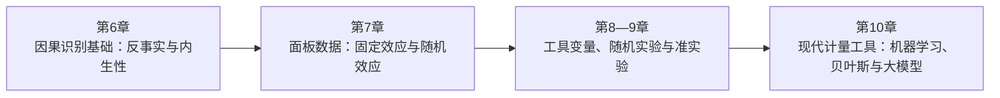

# 第二部分 进阶篇：识别与现代方法

## 从因果语言到可信比较，再到现代计算工具

第一部分建立了回归表达、控制变量选择和模型诊断的共同语言。第二部分（第6—10章）进一步追问：一个回归关系在什么条件下能够支持因果解释？第6章先定义反事实、目标参数、内生性与识别假设，并给出寻找可信比较的地图；第7章考察面板数据中的单位内部变化；第8章讨论工具变量提供的外生变异；第9章转向随机实验、双重差分和断点回归等实验或准实验设计；第10章说明机器学习、贝叶斯方法和大语言模型如何扩展预测、估计与测量能力。

这条路线可以概括为：先说明要估计什么，再说明比较从哪里来，最后选择怎样估计和计算。面板结构、工具变量和准实验设计依赖不同假设，也可能识别不同总体或局部参数；方法名称本身不产生因果性。第10章的新工具可以改善预测、处理高维信息或构造变量，但不能替研究者补上缺失的反事实。学习这一部分时，应始终区分三个层次：识别讨论数据和制度能否提供目标参数所需的比较，估计把这种比较转化为数值，推断则量化样本不确定性。三者相互连接，却不能彼此替代。
