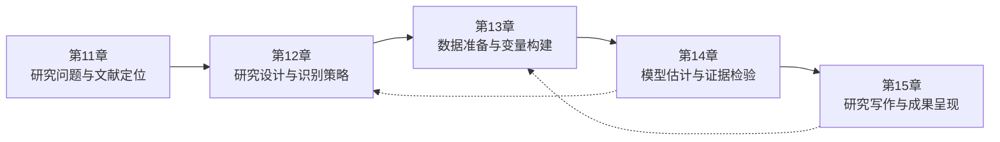

# 第三部分 实践篇：从问题到论文

## 从问题到论文：把五个研究环节连接起来

前两部分主要按方法组织学习，第三部分（第11—15章）改按研究流程组织内容。真实研究不会先收到一张写着“请使用DID”的试卷，而是从一个现实问题和一组并不整齐的材料出发。研究者需要先判断问题是否值得且能够回答，再确认它在文献中的位置，把识别假设变成可检查的设计，把设计落实为数据与估计，最后把证据写成有边界的结论。

图中的实线表示项目向前推进，虚线表示研究过程中的回查与修正：估计和诊断可能要求重新审视设计与识别，写作时发现证据不足也可能迫使研究者返回数据环节。

这五章不是五个相互独立的任务，而是一条可以回溯的项目链。文献检索可能迫使研究者收紧问题，数据质量可能要求修改变量，识别诊断可能要求重新选择比较组。贯穿案例会把问题与文献、政策核验、研究设计、企业与城市信息匹配、交错DID估计、稳健性分析和研究报告组织在同一个可复核项目中。

这一部分的学习标准不再只是“会运行某条命令”，而是让研究问题、数据、方法、结果和结论彼此对应，并使关键决定能够被追溯。AI可以辅助检索、代码检查、结果核对和表达修改，但不能代替政策事实核验、识别判断和作者责任。完成这一部分，意味着把前面学到的单项方法转化为一次完整的实证研究训练。
